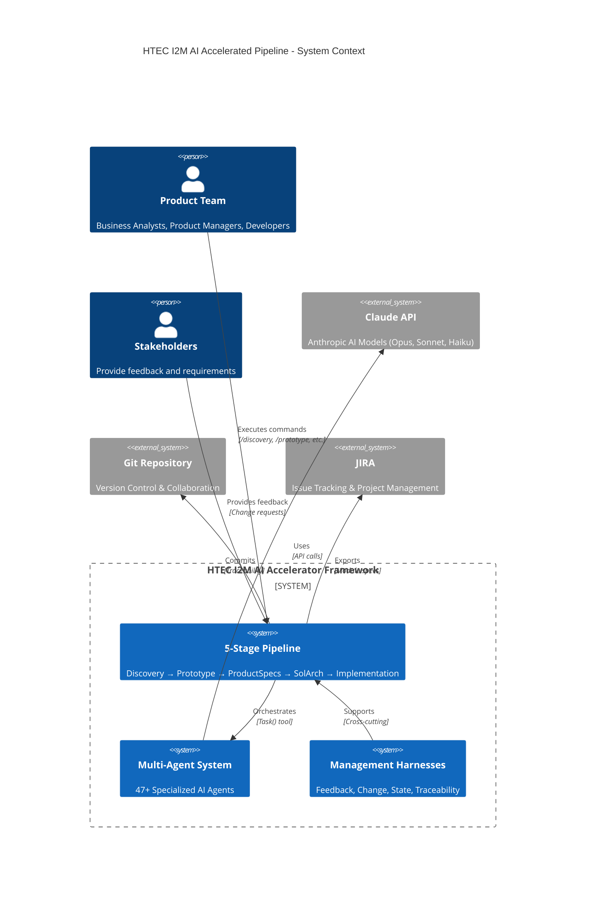

# HTEC I2M AI Accelerated Pipeline - High-Level Design Diagrams

**Version**: 1.0.0
**Created**: 2026-01-30
**Updated**: 2026-01-30
**Purpose**: Visual documentation of the HTEC I2M AI Accelerated Pipeline architecture from a macro perspective

---

## Table of Contents

1. [Diagram 1: Complete Pipeline with Management Harnesses](#diagram-1-complete-pipeline-with-management-harnesses)
2. [Related Documentation](#related-documentation)

---

## Diagram 1: Complete Pipeline with Management Harnesses

### Overview

This diagram presents a helicopter view of the HTEC I2M AI Accelerated Pipeline, showing:
- **5 Core Stages**: Discovery → Prototype → ProductSpecs → SolArch → Implementation
- **4 Cross-Cutting Management Harnesses**:
  - Feedback Management (per-stage feedback loops)
  - Change Management (Kaizen/PDCA/Reflexion)
  - State & Memory Management (session, progress, learnings)
  - Traceability Management (IDs, registries, version history)

### Mermaid Diagram: Complete Pipeline Architecture

```mermaid
flowchart TB
    %% ============================================================
    %% HTEC I2M AI ACCELERATED PIPELINE - HELICOPTER VIEW
    %% ============================================================

    subgraph INPUT["📥 INPUT LAYER"]
        direction LR
        CM["📄 Client Materials<br/>(Interviews, PDFs,<br/>Screenshots, Spreadsheets)"]
    end

    subgraph PIPELINE["🚀 5-STAGE AI ACCELERATED PIPELINE"]
        direction LR

        subgraph S1["STAGE 1<br/>DISCOVERY"]
            D1_IN["Raw Materials"]
            D1_PROC["🤖 7+ Parallel Agents<br/>• Interview Analyst<br/>• PDF Analyst<br/>• Data Analyst<br/>• Design Analyst"]
            D1_OUT["📋 21 Deliverables<br/>• Personas<br/>• JTBD<br/>• Requirements<br/>• Vision/Strategy"]
            D1_IN --> D1_PROC --> D1_OUT
        end

        subgraph S2["STAGE 2<br/>PROTOTYPE"]
            D2_IN["Discovery Outputs"]
            D2_PROC["🤖 11 Agents<br/>• Screen Specifier<br/>• Component Specifier<br/>• Code Generator<br/>• Visual QA"]
            D2_OUT["⚛️ Working React App<br/>• Design Tokens<br/>• Component Library<br/>• Interactive Screens"]
            D2_IN --> D2_PROC --> D2_OUT
        end

        subgraph S3["STAGE 3<br/>PRODUCTSPECS"]
            D3_IN["Prototype Outputs"]
            D3_PROC["🤖 10 Agents<br/>• UI/API Module Spec<br/>• Test Specifiers<br/>• NFR Generator<br/>• VP Reviewer"]
            D3_OUT["📝 JIRA-Ready Specs<br/>• Module Specs<br/>• Test Cases<br/>• Acceptance Criteria"]
            D3_IN --> D3_PROC --> D3_OUT
        end

        subgraph S4["STAGE 4<br/>SOLARCH"]
            D4_IN["ProductSpecs +<br/>Prototype"]
            D4_PROC["🤖 6 Agents<br/>• C4 Generators<br/>• ADR Writers<br/>• Quality Scenarios<br/>• Architecture Board"]
            D4_OUT["🏗️ Architecture Docs<br/>• C4 Diagrams<br/>• ADRs<br/>• Arc42 Docs"]
            D4_IN --> D4_PROC --> D4_OUT
        end

        subgraph S5["STAGE 5<br/>IMPLEMENTATION"]
            D5_IN["ProductSpecs +<br/>SolArch"]
            D5_PROC["🤖 13 Agents<br/>• Tech Lead<br/>• Developer x3<br/>• 6 Quality Reviewers<br/>• Reflexion Judges"]
            D5_OUT["💻 Production Code<br/>• TDD Implementation<br/>• Full Test Coverage<br/>• Documentation"]
            D5_IN --> D5_PROC --> D5_OUT
        end

        S1 --> S2 --> S3 --> S4 --> S5
    end

    subgraph OUTPUT["📦 OUTPUT LAYER"]
        direction LR
        PROD["🎯 Production-Ready<br/>Software Solution"]
    end

    %% ============================================================
    %% MANAGEMENT HARNESSES (Cross-Cutting Concerns)
    %% ============================================================

    subgraph HARNESS["🔧 CROSS-CUTTING MANAGEMENT HARNESSES"]
        direction TB

        subgraph FB["📬 FEEDBACK MANAGEMENT"]
            FB1["Per-Stage Feedback Commands"]
            FB2["Impact Analysis"]
            FB3["Approval Gates"]
            FB4["Implementation Tracking"]
            FB1 --> FB2 --> FB3 --> FB4
        end

        subgraph CM_H["🔄 CHANGE MANAGEMENT"]
            CM1["Kaizen Root Cause<br/>(5 Whys, Fishbone, A3)"]
            CM2["PDCA Cycle<br/>(Plan-Do-Check-Act)"]
            CM3["Reflexion Loop<br/>(Actor-Evaluator-Refiner)"]
            CM1 --> CM2 --> CM3
        end

        subgraph SM["💾 STATE & MEMORY MANAGEMENT"]
            SM1["Session Tracking<br/>(_state/session.json)"]
            SM2["Progress Tracking<br/>(*_progress.json)"]
            SM3["Agent Coordination<br/>(locks, sessions)"]
            SM4["Organizational Memory<br/>(CLAUDE.md learnings)"]
            SM1 --> SM2 --> SM3 --> SM4
        end

        subgraph TM["🔗 TRACEABILITY MANAGEMENT"]
            TM1["ID Generation<br/>(PP, JTBD, REQ, MOD, T)"]
            TM2["Registry Files<br/>(pain_point, jtbd, module)"]
            TM3["Version History<br/>(*_version_history.json)"]
            TM4["End-to-End Chain<br/>(CM→PP→JTBD→REQ→T→Code)"]
            TM1 --> TM2 --> TM3 --> TM4
        end
    end

    %% ============================================================
    %% CONNECTIONS
    %% ============================================================

    CM --> INPUT
    INPUT --> PIPELINE
    PIPELINE --> OUTPUT
    D5_OUT --> PROD

    %% Harness connections to all stages
    FB -.->|"Feedback Loops"| S1
    FB -.->|"Feedback Loops"| S2
    FB -.->|"Feedback Loops"| S3
    FB -.->|"Feedback Loops"| S4
    FB -.->|"Feedback Loops"| S5

    CM_H -.->|"Change Requests"| S5

    SM -.->|"State Tracking"| PIPELINE
    TM -.->|"Traceability"| PIPELINE

    %% ============================================================
    %% STYLING
    %% ============================================================

    style INPUT fill:#e3f2fd,stroke:#1565c0,stroke-width:2px
    style OUTPUT fill:#e8f5e9,stroke:#2e7d32,stroke-width:2px
    style PIPELINE fill:#fff3e0,stroke:#ef6c00,stroke-width:3px
    style HARNESS fill:#fce4ec,stroke:#c2185b,stroke-width:2px

    style S1 fill:#bbdefb,stroke:#1976d2,stroke-width:2px
    style S2 fill:#ffe0b2,stroke:#f57c00,stroke-width:2px
    style S3 fill:#c8e6c9,stroke:#388e3c,stroke-width:2px
    style S4 fill:#f8bbd9,stroke:#c2185b,stroke-width:2px
    style S5 fill:#e1bee7,stroke:#7b1fa2,stroke-width:2px

    style FB fill:#e1f5fe,stroke:#0288d1,stroke-width:1px
    style CM_H fill:#fff8e1,stroke:#ffa000,stroke-width:1px
    style SM fill:#f3e5f5,stroke:#9c27b0,stroke-width:1px
    style TM fill:#e0f2f1,stroke:#00897b,stroke-width:1px
```



### Mermaid Diagram: Pipeline Flow with Checkpoints

```mermaid
flowchart LR
    subgraph DISCOVERY["🔍 DISCOVERY"]
        direction TB
        D_CP["11 Checkpoints<br/>CP-01 → CP-11"]
        D_TIME["⏱️ 60-75 min<br/>(multi-agent)"]
        D_GATE["🚧 BLOCKING GATE<br/>Zero Hallucination Audit"]
    end

    subgraph PROTOTYPE["⚛️ PROTOTYPE"]
        direction TB
        P_CP["14+ Checkpoints<br/>CP-01 → CP-14"]
        P_TIME["⏱️ 3-5 hours"]
        P_GATE["🚧 BLOCKING GATE<br/>P0 Coverage 100%"]
    end

    subgraph PRODUCTSPECS["📝 PRODUCTSPECS"]
        direction TB
        PS_CP["8 Checkpoints<br/>CP-01 → CP-08"]
        PS_TIME["⏱️ 16-35 min<br/>(20 modules)"]
        PS_GATE["🚧 BLOCKING GATE<br/>100% P0 Traceability"]
    end

    subgraph SOLARCH["🏗️ SOLUTION ARCH"]
        direction TB
        SA_CP["13 Checkpoints<br/>CP-01 → CP-13"]
        SA_TIME["⏱️ 45-60 min<br/>(multi-agent)"]
        SA_GATE["🚧 BLOCKING GATE<br/>Input Validation"]
    end

    subgraph IMPLEMENTATION["💻 IMPLEMENTATION"]
        direction TB
        I_CP["10 Checkpoints<br/>CP-00 → CP-09"]
        I_TIME["⏱️ 23-47 min<br/>(per task)"]
        I_GATE["🚧 BLOCKING GATES<br/>CP1, CP6, CP9"]
    end

    DISCOVERY -->|"Export"| PROTOTYPE
    PROTOTYPE -->|"Specs"| PRODUCTSPECS
    PRODUCTSPECS -->|"Modules"| SOLARCH
    SOLARCH -->|"ADRs"| IMPLEMENTATION

    style DISCOVERY fill:#bbdefb,stroke:#1976d2,stroke-width:2px
    style PROTOTYPE fill:#ffe0b2,stroke:#f57c00,stroke-width:2px
    style PRODUCTSPECS fill:#c8e6c9,stroke:#388e3c,stroke-width:2px
    style SOLARCH fill:#f8bbd9,stroke:#c2185b,stroke-width:2px
    style IMPLEMENTATION fill:#e1bee7,stroke:#7b1fa2,stroke-width:2px
```



### Mermaid Diagram: Management Harnesses Detail

```mermaid
flowchart TB
    subgraph SHARED_INFRA["🗄️ SHARED INFRASTRUCTURE (Project Root)"]
        direction LR

        subgraph STATE["_state/"]
            S1_F["session.json"]
            S2_F["pipeline_config.json"]
            S3_F["*_progress.json"]
            S4_F["agent_lock.json"]
            S5_F["FAILURES_LOG.md"]
        end

        subgraph TRACE["traceability/"]
            T1_F["pain_point_registry.json"]
            T2_F["jtbd_registry.json"]
            T3_F["requirements_registry.json"]
            T4_F["module_registry.json"]
            T5_F["task_registry.json"]
            T6_F["*_version_history.json"]
        end
    end

    subgraph FEEDBACK_SYSTEM["📬 FEEDBACK MANAGEMENT SYSTEM"]
        direction TB

        subgraph FB_DISC["Discovery Feedback"]
            FB_D1["/discovery-feedback"]
            FB_D2["Impact Analysis"]
            FB_D3["Artifact Updates"]
        end

        subgraph FB_PROTO["Prototype Feedback"]
            FB_P1["/prototype-feedback"]
            FB_P2["Change Requests"]
            FB_P3["Code Updates"]
        end

        subgraph FB_SPEC["ProductSpecs Feedback"]
            FB_S1["/productspecs-feedback"]
            FB_S2["Spec Revisions"]
            FB_S3["Test Updates"]
        end

        subgraph FB_ARCH["SolArch Feedback"]
            FB_A1["/solarch-feedback"]
            FB_A2["ADR Revisions"]
            FB_A3["Architecture Updates"]
        end

        subgraph FB_IMPL["Implementation CR"]
            FB_I1["/htec-sdd-changerequest"]
            FB_I2["Kaizen Analysis"]
            FB_I3["PDCA Execution"]
        end
    end

    subgraph CHANGE_MGMT["🔄 CHANGE MANAGEMENT (Implementation Stage)"]
        direction LR

        subgraph KAIZEN["Kaizen Methods"]
            K1["5 Whys"]
            K2["Fishbone"]
            K3["A3 Analysis"]
            K4["Gemba Walk"]
        end

        subgraph PDCA["PDCA Cycle"]
            P1["Plan<br/>(Baseline + Hypothesis)"]
            P2["Do<br/>(TDD Implementation)"]
            P3["Check<br/>(Verify Results)"]
            P4["Act<br/>(Standardize/Iterate)"]
            P1 --> P2 --> P3 --> P4
            P4 -.->|"Iterate"| P1
        end

        subgraph REFLEXION["Reflexion Loop"]
            R1["🎭 Actor<br/>(Generate)"]
            R2["🔍 Evaluator<br/>(Critique)"]
            R3["✨ Self-Refiner<br/>(Improve)"]
            R1 --> R2 --> R3
            R3 -.->|"Score < 7"| R1
        end

        KAIZEN --> PDCA
        PDCA --> REFLEXION
    end

    subgraph TRACEABILITY_CHAIN["🔗 END-TO-END TRACEABILITY CHAIN"]
        direction LR
        TC1["CM-XXX<br/>(Client Material)"]
        TC2["PP-X.X<br/>(Pain Point)"]
        TC3["JTBD-X.X<br/>(Job To Be Done)"]
        TC4["REQ-XXX<br/>(Requirement)"]
        TC5["SCR-XXX<br/>(Screen)"]
        TC6["MOD-XXX<br/>(Module)"]
        TC7["ADR-XXX<br/>(Decision)"]
        TC8["T-NNN<br/>(Task)"]
        TC9["Code + Tests"]

        TC1 --> TC2 --> TC3 --> TC4 --> TC5 --> TC6 --> TC7 --> TC8 --> TC9
    end

    %% Connections
    SHARED_INFRA -.->|"Stores"| FEEDBACK_SYSTEM
    SHARED_INFRA -.->|"Tracks"| CHANGE_MGMT
    SHARED_INFRA -.->|"Records"| TRACEABILITY_CHAIN

    style SHARED_INFRA fill:#e8eaf6,stroke:#3f51b5,stroke-width:2px
    style FEEDBACK_SYSTEM fill:#e1f5fe,stroke:#0288d1,stroke-width:2px
    style CHANGE_MGMT fill:#fff8e1,stroke:#ffa000,stroke-width:2px
    style TRACEABILITY_CHAIN fill:#e0f2f1,stroke:#00897b,stroke-width:2px
```



### Mermaid Diagram: Multi-Agent Architecture Overview

```mermaid
flowchart TB
    subgraph ORCHESTRATION["🎯 ORCHESTRATION LAYER"]
        COMMANDS["/discovery, /prototype,<br/>/productspecs, /solarch,<br/>/htec-sdd commands"]
    end

    subgraph AGENT_LAYERS["🤖 MULTI-AGENT SYSTEM (47+ Specialized Agents)"]
        direction TB

        subgraph PLANNING["📋 PLANNING AGENTS"]
            PA1["tech-lead<br/>(Task Decomposition)"]
            PA2["product-researcher<br/>(Market Analysis)"]
            PA3["hfe-ux-researcher<br/>(UX Patterns)"]
            PA4["code-explorer<br/>(Codebase Mapping)"]
        end

        subgraph IMPLEMENTATION_A["⚙️ IMPLEMENTATION AGENTS"]
            IA1["developer x3<br/>(TDD: RED-GREEN-REFACTOR)"]
            IA2["test-automation-engineer<br/>(E2E/Playwright)"]
        end

        subgraph QUALITY["✅ QUALITY AGENTS (6 Parallel)"]
            QA1["bug-hunter"]
            QA2["security-auditor"]
            QA3["code-quality"]
            QA4["test-coverage"]
            QA5["contracts-reviewer"]
            QA6["a11y-auditor"]
        end

        subgraph INTEGRITY["🛡️ PROCESS INTEGRITY (Continuous)"]
            PI1["traceability-guardian<br/>(Registry Integrity)"]
            PI2["state-watchdog<br/>(Lock/Session Health)"]
            PI3["checkpoint-auditor<br/>(Gate Validation)"]
            PI4["playbook-enforcer<br/>(TDD Compliance)"]
        end

        subgraph REFLEXION_A["🔄 REFLEXION AGENTS"]
            RA1["actor<br/>(Generate)"]
            RA2["evaluator<br/>(Critique)"]
            RA3["self-refiner<br/>(Improve)"]
        end
    end

    subgraph COORDINATION["🔒 COORDINATION MECHANISMS"]
        C1["File Locking<br/>(agent_lock.json)"]
        C2["Session Management<br/>(Max 12 concurrent)"]
        C3["Phase Barriers<br/>([P]arallel, [S]equential, [B]locking)"]
        C4["Veto Authority<br/>(CRITICAL = halt)"]
    end

    ORCHESTRATION --> AGENT_LAYERS
    AGENT_LAYERS --> COORDINATION

    PLANNING --> IMPLEMENTATION_A
    IMPLEMENTATION_A --> QUALITY
    QUALITY --> REFLEXION_A
    INTEGRITY -.->|"monitors"| PLANNING
    INTEGRITY -.->|"monitors"| IMPLEMENTATION_A
    INTEGRITY -.->|"monitors"| QUALITY

    style ORCHESTRATION fill:#1565c0,color:#fff,stroke-width:2px
    style PLANNING fill:#ef6c00,color:#fff,stroke-width:2px
    style IMPLEMENTATION_A fill:#2e7d32,color:#fff,stroke-width:2px
    style QUALITY fill:#c62828,color:#fff,stroke-width:2px
    style INTEGRITY fill:#6a1b9a,color:#fff,stroke-width:2px
    style REFLEXION_A fill:#00695c,color:#fff,stroke-width:2px
    style COORDINATION fill:#37474f,color:#fff,stroke-width:2px
```



### Mermaid Diagram: Complete System Context



---

## ASCII Art Summary: Helicopter View

```
╔══════════════════════════════════════════════════════════════════════════════════════╗
║                    HTEC I2M AI ACCELERATED PIPELINE - HELICOPTER VIEW                 ║
╠══════════════════════════════════════════════════════════════════════════════════════╣
║                                                                                       ║
║   📥 INPUT: Client Materials (Interviews, PDFs, Screenshots, Spreadsheets)           ║
║        │                                                                              ║
║        ▼                                                                              ║
║   ┌─────────────────────────────────────────────────────────────────────────────┐    ║
║   │                    🚀 5-STAGE AI ACCELERATED PIPELINE                        │    ║
║   │                                                                              │    ║
║   │  ┌─────────┐   ┌─────────┐   ┌─────────┐   ┌─────────┐   ┌─────────────┐   │    ║
║   │  │ STAGE 1 │──▶│ STAGE 2 │──▶│ STAGE 3 │──▶│ STAGE 4 │──▶│   STAGE 5   │   │    ║
║   │  │DISCOVERY│   │PROTOTYPE│   │PRODSPEC │   │ SOLARCH │   │IMPLEMENTATION│   │    ║
║   │  │ 🤖 7+   │   │ 🤖 11   │   │ 🤖 10   │   │ 🤖 6    │   │   🤖 13     │   │    ║
║   │  │ agents  │   │ agents  │   │ agents  │   │ agents  │   │   agents    │   │    ║
║   │  │ ~1h     │   │ ~3-5h   │   │ ~30m    │   │ ~1h     │   │  ~30m/task  │   │    ║
║   │  └─────────┘   └─────────┘   └─────────┘   └─────────┘   └─────────────┘   │    ║
║   │       │             │             │             │             │            │    ║
║   │       └─────────────┴─────────────┴─────────────┴─────────────┘            │    ║
║   │                                   │                                         │    ║
║   └───────────────────────────────────┼─────────────────────────────────────────┘    ║
║                                       │                                              ║
║        ▼                                                                              ║
║   📦 OUTPUT: Production-Ready Software Solution                                       ║
║                                                                                       ║
╠══════════════════════════════════════════════════════════════════════════════════════╣
║                    🔧 CROSS-CUTTING MANAGEMENT HARNESSES                              ║
╠══════════════════════════════════════════════════════════════════════════════════════╣
║                                                                                       ║
║   📬 FEEDBACK MANAGEMENT                 🔄 CHANGE MANAGEMENT                         ║
║   ├─ /discovery-feedback                 ├─ Kaizen Root Cause                         ║
║   ├─ /prototype-feedback                 │   (5 Whys, Fishbone, A3)                   ║
║   ├─ /productspecs-feedback              ├─ PDCA Cycle                                ║
║   ├─ /solarch-feedback                   │   (Plan→Do→Check→Act)                      ║
║   └─ /htec-sdd-changerequest             └─ Reflexion Loop                            ║
║                                              (Actor→Evaluator→Refiner)                ║
║                                                                                       ║
║   💾 STATE & MEMORY MANAGEMENT           🔗 TRACEABILITY MANAGEMENT                   ║
║   ├─ _state/session.json                 ├─ ID Chain: CM→PP→JTBD→REQ→MOD→T→Code      ║
║   ├─ _state/*_progress.json              ├─ traceability/*_registry.json              ║
║   ├─ _state/agent_lock.json              ├─ traceability/*_version_history.json       ║
║   └─ CLAUDE.md (Learnings)               └─ Source citations in all artifacts         ║
║                                                                                       ║
╠══════════════════════════════════════════════════════════════════════════════════════╣
║                    🛡️ QUALITY GATES (Blocking)                                        ║
╠══════════════════════════════════════════════════════════════════════════════════════╣
║                                                                                       ║
║   Discovery CP-10.5: Zero Hallucination Audit (PASS required)                         ║
║   ProductSpecs CP-07: 100% P0 Traceability (PASS required)                            ║
║   SolArch CP-01: Input Validation (ProductSpecs CP8+, Prototype CP14+)                ║
║   Implementation CP-01: Input Validation (ProductSpecs CP8+, SolArch CP12+)           ║
║   Implementation CP-06: Code Review (No CRITICAL, Coverage >80%)                      ║
║   Implementation CP-09: Final (100% P0 test coverage, traceability complete)          ║
║                                                                                       ║
╚══════════════════════════════════════════════════════════════════════════════════════╝
```

---

## Related Documentation

| Document | Location | Description |
|----------|----------|-------------|
| Architecture Manual | `.claude/architecture/HTEC_ClaudeCode_Accelerators_Architecture.md` | Complete architecture documentation |
| Quick Start Guide | `.claude/architecture/workflows/QUICK_START_GUIDE.md` | 3-minute setup guide |
| Framework Onboarding | `.claude/architecture/workflows/FRAMEWORK_ONBOARDING.md` | Complete onboarding guide |
| Change Request Process | `.claude/architecture/workflows/ChangeManagement/ChangeRequest_Process.md` | Kaizen/PDCA/Reflexion details |
| Implementation Diagrams | `.claude/architecture/workflows/Implementation Phase/Implementation_Diagrams.md` | Detailed implementation diagrams |
| Discovery Onboarding | `.claude/architecture/workflows/Discovery Phase/DISCOVERY_ONBOARDING.md` | Discovery phase deep-dive |
| Prototype Onboarding | `.claude/architecture/workflows/Idea Shaping and Validation Phase/PROTOTYPE_ONBOARDING.md` | Prototype phase guide |
| ProductSpecs Onboarding | `.claude/architecture/workflows/Solution Specification Phase/SOLUTION_SPECIFICATION_ONBOARDING.md` | ProductSpecs workflow |

---

**Document Version**: 1.0.0
**Last Updated**: 2026-01-30
**Maintained By**: HTEC I2M Accelerator Framework Team
