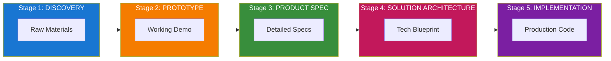
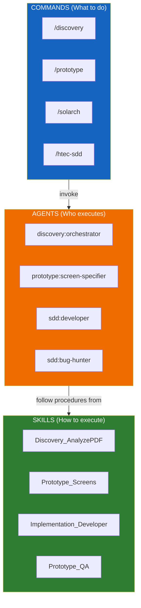
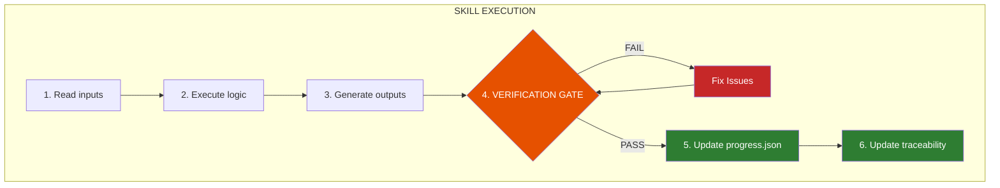
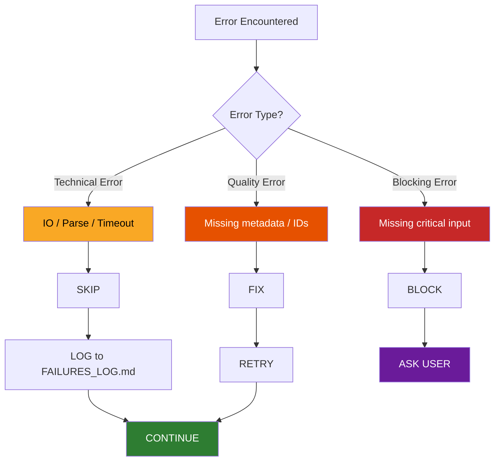
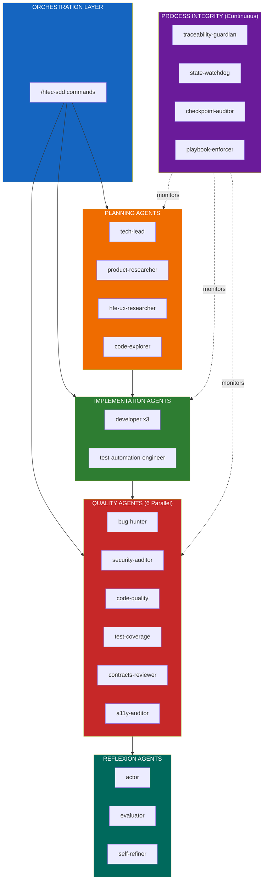
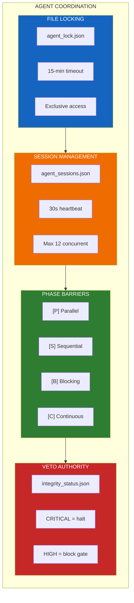
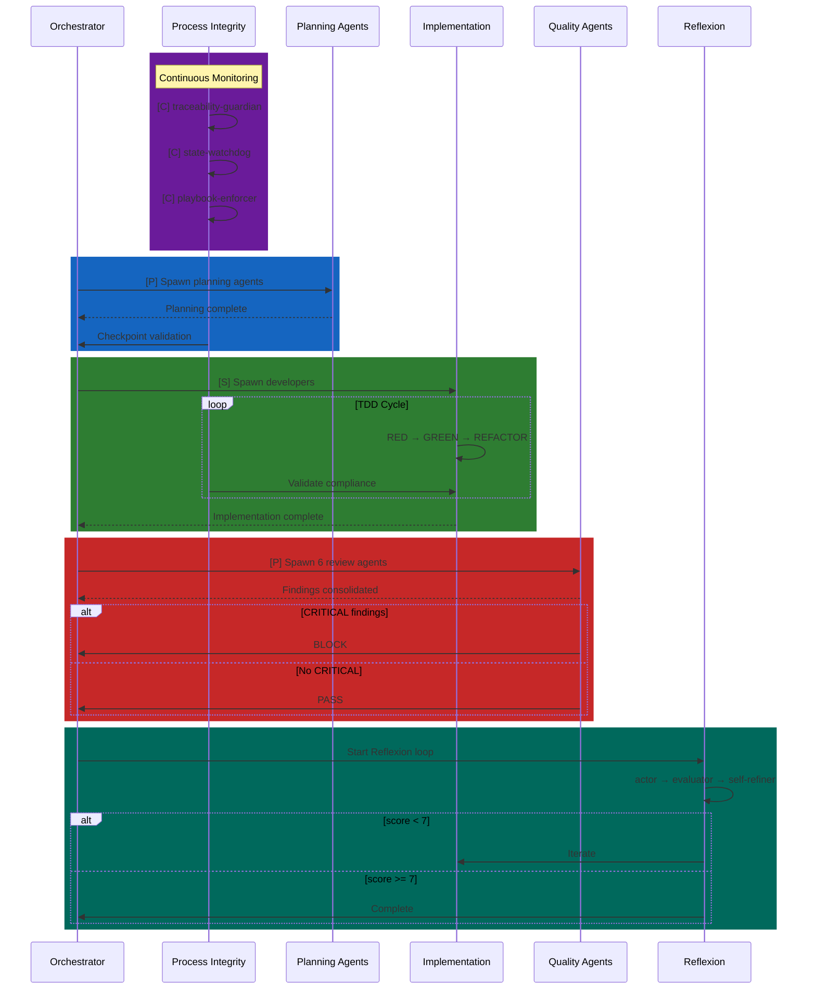
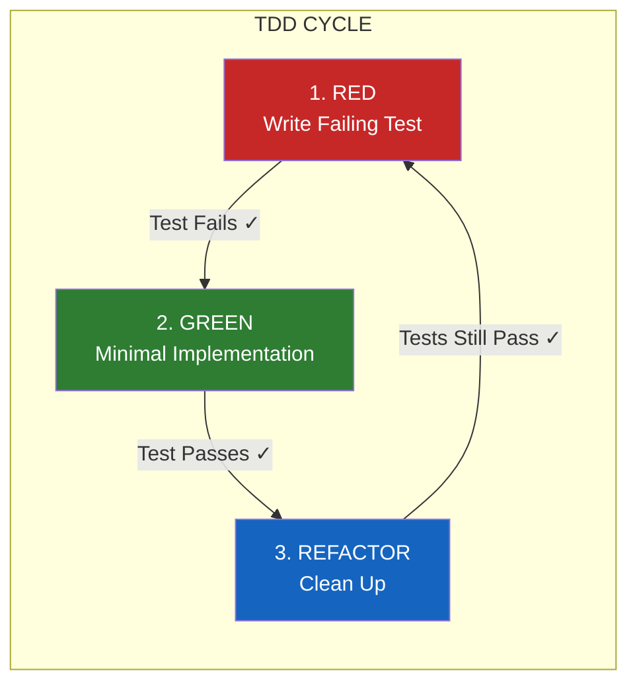
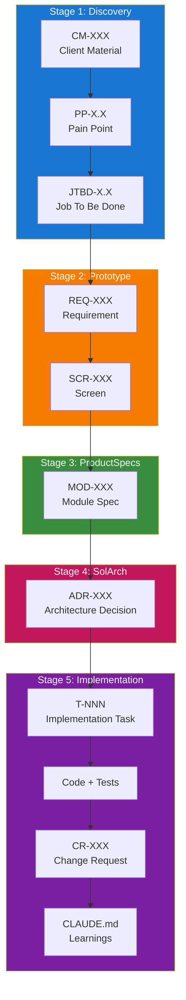

# HTEC ClaudeCode Accelerators Architecture Manual

**Version**: 3.2.0
**Created**: 2025-12-22
**Updated**: 2026-01-29
**Purpose**: Comprehensive onboarding and usage manual for the HTEC ClaudeCode Accelerators Framework

---

## Table of Contents

1. [Executive Overview](#executive-overview)
2. [Architecture Principles](#architecture-principles)
3. [System Components](#system-components)
4. [Multi-Agent Architecture](#multi-agent-architecture)
5. [Stage-by-Stage Journey](#stage-by-stage-journey)
6. [Skills Framework](#skills-framework)
7. [Commands Reference](#commands-reference)
8. [Rules & Guardrails](#rules--guardrails)
9. [Hooks & Quality Gates](#hooks--quality-gates)
10. [Traceability System](#traceability-system)
11. [File Organization](#file-organization)
12. [Usage Workflows](#usage-workflows)
13. [Framework Governance](#framework-governance)
14. [Troubleshooting](#troubleshooting)

---

## Executive Overview

### What is HTEC ClaudeCode Accelerators?

The HTEC ClaudeCode Accelerators Framework is a comprehensive, AI-powered system that transforms raw client materials into production-ready software solutions through five distinct stages:

```
┌──────────────┐    ┌──────────────┐    ┌──────────────┐    ┌──────────────┐    ┌──────────────┐
│  DISCOVERY   │───▶│  PROTOTYPE   │───▶│ PRODUCT SPEC │───▶│  SOLUTION    │───▶│IMPLEMENTATION│
│              │    │              │    │              │    │ ARCHITECTURE │    │              │
└──────────────┘    └──────────────┘    └──────────────┘    └──────────────┘    └──────────────┘
  Raw Materials      Working Demo      Detailed Specs      Tech Blueprint      Production Code
```



### Core Philosophy

1. **Traceability First**: Every artifact traces back to user needs
2. **Quality Guardrails**: Automated validation at every checkpoint
3. **Predictable Outputs**: Deterministic structure regardless of domain
4. **Progressive Refinement**: Each stage builds on the previous
5. **AI-Augmented**: Leverages AI while maintaining human control
6. **Kaizen Continuous Improvement**: Root cause analysis and iterative refinement

### Key Capabilities

- **Discovery**: Analyze interviews (text/audio/video), documents, PDFs, spreadsheets → structured insights (7+ parallel agents, 60-70% faster)
- **Prototype**: Generate working React applications with full traceability (11-agent architecture)
- **Product Specs**: Create JIRA-ready epics, stories, and acceptance criteria (7 entry points, self-validation, VP review)
- **Solution Architecture**: Generate C4 models, ADRs, Arc42 documentation (6 specialized agents)
- **Implementation**: TDD-based code generation with 8-phase automation (13 agents, worktree support, 6 parallel quality reviewers)

### Quick Start (3 Minutes)

```bash
# 1. Install dependencies
/htec-libraries-init

# 2. Initialize project metadata
/project-init

# 3. Run Discovery (multi-agent recommended)
/discovery-multiagent MyProject ./Client_Materials/

# 4. Continue through stages...
/prototype MyProject
/productspecs MyProject
/solarch MyProject
/htec-sdd-tasks MyProject
/htec-sdd-implement MyProject
```

**Full quick start guide**: `.claude/architecture/workflows/QUICK_START_GUIDE.md`

---

## Architecture Principles

### 1. Separation of Concerns

The framework is organized into distinct layers:

```
┌─────────────────────────────────────────────────────────┐
│                    COMMANDS LAYER                       │
│  User-facing entry points (128+ commands)              │
│  /discovery, /prototype, /productspecs, /solarch,      │
│  /htec-sdd, /kaizen-*, /review-*, /sdd-*, /tdd-*       │
└─────────────────────────────────────────────────────────┘
                          │
                          ▼
┌─────────────────────────────────────────────────────────┐
│                    SKILLS LAYER                         │
│  Specialized AI agents (149+ skills)                   │
│  33 Discovery, 25 Prototype, 10 ProductSpecs,          │
│  10 SolArch, 5 Implementation, 18 Other                │
└─────────────────────────────────────────────────────────┘
                          │
                          ▼
┌─────────────────────────────────────────────────────────┐
│                    RULES LAYER                          │
│  Global constraints (error-handling, traceability)     │
└─────────────────────────────────────────────────────────┘
                          │
                          ▼
┌─────────────────────────────────────────────────────────┐
│                    HOOKS LAYER                          │
│  Quality gates (5 stage validators)                    │
└─────────────────────────────────────────────────────────┘
```



```mermaid
flowchart TB
    subgraph Commands["COMMANDS LAYER"]
        direction LR
        C1["/discovery"]
        C2["/prototype"]
        C3["/productspecs"]
        C4["/solarch"]
        C5["/htec-sdd"]
        C6["/agent-*"]
    end

    subgraph Skills["SKILLS LAYER"]
        direction LR
        S1["33 Discovery"]
        S2["25 Prototype"]
        S3["10 ProductSpecs"]
        S4["10 SolArch"]
        S5["5 Implementation"]
        S6["20+ Agents"]
    end

    subgraph Agents["MULTI-AGENT LAYER"]
        direction LR
        A1["Planning Agents"]
        A2["Implementation Agents"]
        A3["Quality Agents"]
        A4["Process Integrity"]
        A5["Reflexion Judges"]
    end

    subgraph Rules["RULES LAYER"]
        R1["error-handling"]
        R2["traceability-guard"]
        R3["agent-coordination"]
        R4["process-integrity"]
    end

    subgraph Hooks["HOOKS LAYER"]
        H1["quality_gates.py"]
        H2["agent_coordinator.py"]
        H3["pre_agent_spawn.py"]
        H4["post_task_completion.py"]
    end

    Commands --> Skills
    Skills --> Agents
    Agents --> Rules
    Rules --> Hooks

    style Commands fill:#1565c0,color:#fff
    style Skills fill:#ef6c00,color:#fff
    style Agents fill:#2e7d32,color:#fff
    style Rules fill:#ad1457,color:#fff
    style Hooks fill:#6a1b9a,color:#fff
```

### Command-Agent-Skill Relationship

Understanding the three-layer execution model is critical for working effectively with the HTEC framework. This model clarifies **what** triggers execution (Commands), **who** executes (Agents), and **how** execution happens (Skills).

```
┌─────────────────────────────────────────────────────────────────────────────┐
│                    COMMAND → AGENT → SKILL MODEL                            │
├─────────────────────────────────────────────────────────────────────────────┤
│                                                                             │
│  COMMANDS (What to do)           USER-FACING ENTRY POINTS                   │
│  ─────────────────────           ────────────────────────                   │
│  /discovery, /prototype,         • Slash commands users invoke              │
│  /productspecs, /solarch,        • Define WHAT action to perform            │
│  /htec-sdd, /agent-spawn         • Orchestrate the overall workflow         │
│                                  • Checkpoint-based execution               │
│                           │                                                 │
│                           ▼                                                 │
│  AGENTS (Who executes)           SPECIALIZED CLAUDE INSTANCES               │
│  ─────────────────────           ────────────────────────────               │
│  discovery:orchestrator,         • Sub-agents spawned via Task() tool       │
│  prototype:screen-specifier,     • Define WHO performs the work             │
│  sdd:developer,                  • Coordinate parallel execution            │
│  sdd:bug-hunter                  • Manage state and file locks              │
│                                  • Right-sized models (sonnet/haiku)        │
│                           │                                                 │
│                           ▼                                                 │
│  SKILLS (How to execute)         PROCEDURAL PLAYBOOKS                       │
│  ───────────────────────         ─────────────────────                      │
│  Discovery_AnalyzePDF,           • SKILL.md files with step-by-step         │
│  Prototype_Screens,                procedures                               │
│  Implementation_Developer        • Define HOW to accomplish tasks           │
│                                  • Templates, validation rules, outputs     │
│                                  • Domain expertise encoded                 │
│                                                                             │
└─────────────────────────────────────────────────────────────────────────────┘
```



#### Key Distinctions

| Aspect | Commands | Agents | Skills |
|--------|----------|--------|--------|
| **Role** | Entry point | Executor | Procedure |
| **Definition** | `.claude/commands/*.md` | `.claude/agents/*/*.md` | `.claude/skills/*/SKILL.md` |
| **Invocation** | User types `/command` | System spawns via `Task()` | Agent reads and follows |
| **Model** | N/A | sonnet, haiku, opus | N/A (procedural text) |
| **Parallelism** | Sequential phases | Multiple concurrent | N/A |
| **State** | Tracks checkpoints | Manages locks/sessions | Defines outputs |

#### Why Skills Are NOT Deprecated

**Skills remain the procedural core of the framework.** The introduction of agents does NOT replace skills—it enhances how they are executed:

```
BEFORE (Single Agent):
  User → /discovery → Claude reads Discovery_AnalyzePDF skill → executes

AFTER (Multi-Agent):
  User → /discovery → discovery:orchestrator agent → spawns discovery:pdf-analyst agent
                                                    → pdf-analyst reads Discovery_AnalyzePDF skill
                                                    → executes following skill procedures
```

**Benefits of the Agent layer:**
1. **Parallelization**: Multiple agents can execute different skills simultaneously
2. **Right-sized models**: Use haiku for simple validation, sonnet for complex analysis
3. **State coordination**: File locks prevent conflicts; sessions track progress
4. **Process integrity**: Guardian agents monitor compliance across all execution
5. **Specialization**: Agents can be optimized for specific task domains

**Skills provide:**
1. **Domain expertise**: Detailed procedures for specific tasks
2. **Consistency**: Same procedure regardless of which agent executes
3. **Validation rules**: Quality gates and verification patterns
4. **Output templates**: Standardized deliverable formats
5. **Traceability requirements**: How to maintain trace links

#### Agent Registry skill_refs

Each agent definition includes explicit `skill_refs` indicating which skills it invokes:

```json
{
  "id": "discovery:pdf-analyst",
  "name": "PDF Analyst",
  "model": "sonnet",
  "skill_refs": ["Discovery_AnalyzePDF"],
  "description": "Deep analysis of PDF documents with chunking"
}
```

This mapping is maintained in stage-specific registries:
- `.claude/agents/discovery/DISCOVERY_AGENT_REGISTRY.json`
- `.claude/agents/prototype/PROTOTYPE_AGENT_REGISTRY.json`
- `.claude/agents/solarch/SOLARCH_AGENT_REGISTRY.json`

#### When to Use Each Layer

| Scenario | Use |
|----------|-----|
| User wants to run a workflow | **Command**: `/discovery MyProject` |
| Need parallel execution of tasks | **Agents**: Orchestrator spawns multiple agents |
| Defining how a task should be done | **Skill**: Write/update SKILL.md file |
| Adding a new user-facing action | **Command**: Create new `.claude/commands/*.md` |
| Optimizing execution performance | **Agents**: Adjust model allocation |
| Changing task procedures | **Skill**: Update the relevant SKILL.md |

### 2. State Management

All stages share a common state architecture:

```
Project Root/
├── _state/                          # Cross-stage state
│   ├── pipeline_config.json         # Overall pipeline configuration
│   ├── discovery_config.json        # Discovery-specific config
│   ├── discovery_progress.json      # Discovery phase tracking
│   ├── prototype_config.json        # Prototype-specific config
│   └── prototype_progress.json      # Prototype phase tracking
│
└── traceability/                    # Cross-stage traceability
    ├── trace_matrix.json            # Master traceability matrix
    ├── pain_point_registry.json     # Pain points catalog
    ├── jtbd_registry.json           # Jobs-to-be-done catalog
    ├── requirements_registry.json   # Requirements catalog
    └── screen_registry.json         # Screen catalog
```

### 3. Verification Before Completion

Every skill implements the **Verification Gate Pattern**:

```
┌─────────────────────────────────────────────────────────┐
│  SKILL EXECUTION                                        │
│                                                         │
│  1. Read inputs                                         │
│  2. Execute logic                                       │
│  3. Generate outputs                                    │
│  4. ╔═══════════════════════════════════════╗          │
│     ║  VERIFICATION GATE (MANDATORY)        ║          │
│     ║  • Run validation commands            ║          │
│     ║  • Capture evidence                   ║          │
│     ║  • If FAIL → Fix → Retry              ║          │
│     ║  • If PASS → Proceed                  ║          │
│     ╚═══════════════════════════════════════╝          │
│  5. Update progress.json                                │
│  6. Update traceability                                 │
└─────────────────────────────────────────────────────────┘
```



### 4. Error Handling Philosophy

**One Attempt, No Looping**:

```
┌─────────────────────────────────────────────────────────┐
│  ERROR HANDLING DECISION TREE                           │
│                                                         │
│  Error Encountered                                      │
│         │                                               │
│         ├─ Technical Error? (IO, parse, timeout)       │
│         │     └─▶ SKIP → LOG → CONTINUE                │
│         │                                               │
│         ├─ Quality Error? (missing metadata, IDs)      │
│         │     └─▶ FIX → RETRY → CONTINUE               │
│         │                                               │
│         └─ Blocking Error? (missing critical input)    │
│               └─▶ BLOCK → ASK USER                     │
└─────────────────────────────────────────────────────────┘
```



---

## System Components

### Commands

Commands are user-facing entry points that orchestrate multiple skills.

#### Discovery Commands (Implemented)

| Command | Purpose | Key Skills Used |
|---------|---------|-----------------|
| `/discovery` | Full discovery pipeline (sequential) | Discovery_Orchestrator + 28 skills |
| `/discovery-multiagent` | **Full discovery (60-70% faster, 7+ parallel agents)** | Discovery_Orchestrator + multi-agent |
| `/discovery-init` | Initialize discovery session | Discovery_Orchestrator |
| `/discovery-analyze` | Analyze materials only | Discovery_Analyze* skills + Audio Transcription |
| `/discovery-status` | Show progress | N/A (reads state) |
| `/discovery-audit` | Zero Hallucination Audit | Discovery_FactAuditor |
| `/discovery-audit-review` | **Chef Product Manager Review Gate** | **Discovery_FactAuditor, Traceability_Guard** |
| `/discovery-validate` | Run quality gates | Discovery_Validate |
| `/discovery-export` | Package for Prototype | N/A (file operations) |
| `/discovery-resume` | Resume from checkpoint | Discovery_Orchestrator |
| `/discovery-reset` | Reset discovery session | N/A (file operations) |

**New in v3.2.0**:
- `/discovery-multiagent`: Massively parallel execution with 7+ agents, reducing time from ~2.5 hours to 60-75 minutes
- `/discovery-audit-review`: Chef Product Manager Reviewer agent validates all ClientAnalysis materials for factuality before downstream stage progression. Acts as a blocking quality gate at CP-10.5.

#### Prototype Commands (Implemented)

| Command | Purpose | Key Skills Used |
|---------|---------|-----------------|
| `/prototype` | Full prototype pipeline | Prototype_Builder + 20 skills |
| `/prototype-init` | Initialize prototype session | Prototype_Builder |
| `/prototype-build` | Generate code | Prototype_CodeGen |
| `/prototype-status` | Show progress | N/A (reads state) |
| `/prototype-qa` | Run validation | Prototype_QA |
| `/prototype-resume` | Resume from checkpoint | Prototype_Builder |
| `/prototype-reset` | Reset prototype session | N/A (file operations) |

#### Prototype Commands

| Command | Purpose | Key Skills Used |
|---------|---------|-----------------|
| `/prototype-feedback` | Process change requests | Prototype_FeedbackAnalyzer, systematic-debugging |

**Full Reference**: `.claude/commands/PROTOTYPE_COMMAND_REFERENCE.md`

#### Product Specs Commands (Stage 3)

| Command | Purpose | Key Skills Used |
|---------|---------|-----------------|
| `/productspecs` | Full ProductSpecs pipeline | All ProductSpecs_* skills |
| `/productspecs-init` | Initialize folders and state | Setup |
| `/productspecs-validate` | Validate Discovery & Prototype | Validation |
| `/productspecs-extract` | Extract requirements hierarchy | ProductSpecs_Requirements |
| `/productspecs-modules` | Generate module specifications | ProductSpecs_ModuleSpec |
| `/productspecs-contracts` | Generate API contracts & NFRs | ProductSpecs_NFRGenerator |
| `/productspecs-tests` | Generate test specifications | ProductSpecs_TestGenerator |
| `/productspecs-finalize` | Validate traceability chains | ProductSpecs_Validator |
| `/productspecs-jira` | Generate JIRA export files | ProductSpecs_JIRAExporter |
| `/productspecs-export` | Package for SolArch stage | Export |
| `/productspecs-feedback` | Process specification changes | ProductSpecs_Feedback* |
| `/productspecs-status` | Show current progress | Status |
| `/productspecs-resume` | Resume from checkpoint | Resume |
| `/productspecs-reset` | Reset state | Reset |

**Full Reference**: `.claude/commands/PRODUCTSPECS_COMMAND_REFERENCE.md`

#### Solution Architecture Commands (Stage 4)

| Command | Purpose | Key Skills Used |
|---------|---------|-----------------|
| `/solarch` | Full SolArch pipeline (sequential, 13 checkpoints) | All SolutionArchitecture_* skills |
| **`/solarch-multiagent`** | **Full SolArch with multi-agent parallel execution (35-50% faster)** | **28 agents + Architecture Board** |
| `/solarch-init` | Initialize folders and state | Setup |
| `/solarch-validate` | Validate inputs **[BLOCKING]** | Input validation |
| `/solarch-context` | Generate introduction, constraints, context | SolutionArchitecture_Generator |
| `/solarch-strategy` | Generate solution strategy and ADRs | SolutionArchitecture_AdrGenerator |
| `/solarch-blocks` | Generate building blocks and C4 diagrams | SolutionArchitecture_C4Generator |
| `/solarch-runtime` | Generate runtime scenarios and API design | SolutionArchitecture_InformationDesignGenerator |
| `/solarch-quality` | Generate quality requirements and security | SolutionArchitecture_Generator |
| `/solarch-deploy` | Generate deployment view and operations | SolutionArchitecture_Generator |
| `/solarch-decisions` | Complete all ADRs | SolutionArchitecture_AdrGenerator |
| `/solarch-risks` | Generate risks and technical debt | SolutionArchitecture_Generator |
| `/solarch-docs` | Generate glossary and documentation | SolutionArchitecture_Generator |
| `/solarch-trace` | Validate traceability **[BLOCKING]** | SolutionArchitecture_E2ETraceabilityAnalyzer |
| `/solarch-finalize` | Generate validation report | SolutionArchitecture_Generator |
| `/solarch-feedback` | Process architecture feedback | SolArch_Feedback* |
| `/solarch-status` | Show current progress | Status |
| `/solarch-resume` | Resume from checkpoint | Resume |
| `/solarch-reset` | Reset state | Reset |

**New in v3.2.0**:
- `/solarch-multiagent`: Hierarchical multi-agent execution with Architecture Board (3 architects: Pragmatist, Perfectionist, Skeptic), weighted voting consensus, and parallel validation. Reduces time by 35-50% and improves quality by +23%.

**Full Reference**: `.claude/commands/SOLARCH_COMMAND_REFERENCE.md`

#### Implementation Commands (Stage 5)

| Command | Purpose | Key Skills Used |
|---------|---------|-----------------|
| `/htec-sdd` | Full implementation pipeline | All Implementation skills |
| `/htec-sdd-init` | Initialize implementation session | Implementation setup |
| `/htec-sdd-validate` | Validate ProductSpecs + SolArch inputs | Input validation |
| `/htec-sdd-tasks` | Generate task decomposition | Implementation_TaskDecomposer |
| `/htec-sdd-implement` | Execute TDD implementation | Implementation_Developer |
| `/htec-sdd-review` | Run 6-agent code review | Implementation_CodeReview |
| `/htec-sdd-integrate` | Run E2E tests | Integration testing |
| `/htec-sdd-finalize` | Generate reports | Documentation |
| `/htec-sdd-changerequest` | Process change requests (Kaizen + Reflexion) | Implementation_ChangeAnalyzer, Implementation_ChangeImplementer |
| `/htec-sdd-status` | Show implementation progress | N/A (reads state) |
| `/htec-sdd-resume` | Resume from checkpoint | Implementation orchestrator |
| `/htec-sdd-reset` | Reset implementation session | N/A (file operations) |

#### Other Utilities Commands (Kaizen, TDD, Code Review, Reflexion)

**Kaizen Commands** (Root Cause Analysis):
| Command | Purpose |
|---------|---------|
| `/kaizen-analyse` | Select appropriate analysis method based on problem type |
| `/kaizen-why` | 5 Whys root cause analysis |
| `/kaizen-fishbone` | Fishbone (Cause-and-Effect) diagram analysis |
| `/kaizen-problem` | A3 Problem Analysis template |
| `/kaizen-pdca` | Plan-Do-Check-Act cycle execution |
| `/kaizen-root-cause` | Gemba Walk ("go and see") investigation |

**TDD Commands** (Test-Driven Development):
| Command | Purpose |
|---------|---------|
| `/write-tests` | Cover local changes with tests using TDD |
| `/fix-tests` | Fix failing tests systematically |

**Code Review Commands**:
| Command | Purpose |
|---------|---------|
| `/review-pr` | Review pull request with 6-agent parallel review |
| `/review-local` | Review local changes before commit |

**Reflexion Commands** (Self-Improvement):
| Command | Purpose |
|---------|---------|
| `/reflect` | Self-refinement loop for quality improvement |
| `/critique` | Multi-perspective critique (3 judges) |
| `/memorize` | Update CLAUDE.md with learnings |

**SDD Commands** (Spec-Driven Development):
| Command | Purpose |
|---------|---------|
| `/sdd-setup` | Initialize SDD project structure |
| `/sdd-specify` | Write specifications |
| `/sdd-plan` | Generate implementation plan |
| `/sdd-tasks` | Execute tasks from plan |
| `/sdd-document` | Generate documentation |
| `/sdd-ideas` | Capture improvement ideas |

**Git Commands**:
| Command | Purpose |
|---------|---------|
| `/commit` | Create structured commit |
| `/create-pr` | Create pull request with summary |
| `/analyze-issue` | Analyze GitHub issue |
| `/attach-review-to-pr` | Attach code review to PR |
| `/load-issues` | Load GitHub issues |

**Agent Development Commands**:
| Command | Purpose |
|---------|---------|
| `/create-command` | Create new slash command |
| `/create-skill` | Create new skill |
| `/create-hook` | Create new hook |
| `/test-prompt` | Test a prompt |
| `/test-skill` | Test a skill |
| `/apply-anthropic-skill-best-practices` | Apply Anthropic best practices to skills |

### Skills

Skills are specialized AI agents that perform specific tasks. The framework contains over 100 skills, categorized by function.

#### Discovery Skills (33 Total)

**Phase 1-2: Analysis & Extraction**
- `Discovery_AnalyzeAudioVideo` - Process audio/video files via transcription (maps to Interview Analyst).
- `Discovery_AnalyzeCode` - Analyze source code.
- `Discovery_AnalyzeData` - Analyze data files.
- `Discovery_AnalyzeDesign` - Analyze design files.
- `Discovery_AnalyzeDocument` - Process Word/text documents
- `Discovery_AnalyzeSpreadsheet` - Process Excel/CSV files
- `Discovery_AnalyzePresentation` - Process PowerPoint files
- `Discovery_AnalyzePDF` - Deep PDF analysis with chunking
- `Discovery_ExtractPainPoints` - Extract user pain points
- `Discovery_ExtractUserTypes` - Identify user personas
- `Discovery_ExtractWorkflows` - Map business processes
- `Discovery_ExtractQuotes` - Capture user quotes
- `Discovery_ExtractMetrics` - Extract KPIs and metrics
- `Discovery_ExtractClientFacts` - Extract key client facts.

**Phase 3-4: Research**
- `Discovery_GeneratePersona` - Create user personas
- `Discovery_GenerateJTBD` - Generate Jobs-to-be-Done

**Phase 5-8: Strategy**
- `Discovery_GenerateVision` - Create product vision
- `Discovery_GenerateStrategy` - Define product strategy
- `Discovery_GenerateRoadmap` - Build product roadmap
- `Discovery_GenerateKPIs` - Define success metrics

**Phase 9: Design Specifications**
- `Discovery_SpecScreens` - Define screen layouts
- `Discovery_SpecNavigation` - Map navigation flows
- `Discovery_SpecDataModel` - Define data entities
- `Discovery_SpecInteractions` - Define interactions
- `Discovery_SpecComponents` - Specify UI components
- `Discovery_SpecSampleData` - Generate sample data

**Phase 10-11: Documentation & Validation**
- `Discovery_DocIndex` - Generate documentation index
- `Discovery_DocSummary` - Create summary documents
- `Discovery_FactAuditor` - Zero Hallucination audit (verify facts vs sources)
- `Discovery_Validate` - Validate completeness

**Feedback Management**
- `Discovery_FeedbackRegister` - Register feedback items
- `Discovery_FeedbackAnalyzer` - Analyze feedback
- `Discovery_FeedbackPlanner` - Plan feedback implementation
- `Discovery_FeedbackImplementer` - Implement feedback changes
- `Discovery_FeedbackValidator` - Validate feedback implementation

**Orchestration**
- `Discovery_Orchestrator` - Master coordinator

#### Prototype Skills (25 Total)

**Foundation Phase**
- `Prototype_ValidateDiscovery` - Validate discovery inputs
- `Prototype_Requirements` - Create requirements registry
- `Prototype_DataModel` - Generate entity schemas
- `Prototype_ApiContracts` - Define API endpoints
- `Prototype_TestData` - Generate test data

**Design Phase**
- `Prototype_DesignBrief` - Create design direction
- `Prototype_DesignTokens` - Generate design tokens
- `Prototype_Components` - Specify components
- `Prototype_Screens` - Specify screens
- `Prototype_Interactions` - Define animations

**Implementation Phase**
- `Prototype_Sequencer` - Create build order
- `Prototype_Prompts` - Generate code prompts
- `Prototype_CodeGen` - Generate React code
- `Prototype_PromptLog` - Log all prompts used for generation.

**Validation Phase**
- `Prototype_QA` - Requirements validation
- `Prototype_UIAudit` - Visual QA

**Management**
- `Prototype_Builder` - Pipeline orchestrator
- `Prototype_ChangeManager` - Change management
- `Prototype_Decomposition` - Generate OPML mindmaps
- `Prototype_Deliverables` - Export documents
- `Prototype_Migrate` - Version migration

**Feedback Management**
- `Prototype_FeedbackRegister` - Register feedback items
- `Prototype_FeedbackAnalyzer` - Analyze feedback
- `Prototype_FeedbackPlanner` - Plan feedback implementation
- `Prototype_FeedbackImplementer` - Implement feedback changes
- `Prototype_FeedbackValidator` - Validate feedback implementation

#### Product Specs Skills (9 Total)

- `ProductSpecs_Generator` - Transform prototype to production specs
- `ProductSpecs_JIRAExporter` - Export to JIRA format
- `ProductSpecs_ExtractRequirements` - Extracts requirements from various sources.
- `ProductSpecs_NFRGenerator` - Generates Non-Functional Requirements.
- `ProductSpecs_TestSpecGenerator` - Generates test specifications.
- `ProductSpecs_Validate` - Validates product specs.
- `ProductSpecs_FeedbackRegister` - Registers feedback for product specs.
- `ProductSpecs_FeedbackAnalyzer` - Analyzes feedback for product specs.
- `ProductSpecs_FeedbackImplementer` - Implements changes based on feedback.
- `ProductSpecs_FeedbackValidator` - Validates implemented feedback.

#### Solution Architecture Skills (10 Total)

- `SolutionArchitecture_Generator` - Master architecture generator
- `SolutionArchitecture_C4Generator` - Generate C4 diagrams
- `SolutionArchitecture_AdrGenerator` - Generate ADRs
- `SolutionArchitecture_Arc42Generator` - Generate Arc42 docs
- `SolutionArchitecture_InformationDesignGenerator` - Information architecture
- `SolutionArchitecture_E2ETraceabiliyAnalyzer` - End-to-end traceability
- `SolArch_FeedbackRegister` - Registers feedback for solution architecture.
- `SolArch_FeedbackAnalyzer` - Analyzes feedback.
- `SolArch_FeedbackImplementer` - Implements feedback.
- `SolArch_FeedbackValidator` - Validates feedback.

#### Implementation Skills (5 Total)

- `Implementation_TaskDecomposer` - Break down requirements into tasks with TDD specs
- `Implementation_Developer` - Execute TDD RED-GREEN-REFACTOR cycles
- `Implementation_CodeReview` - 6-agent parallel code review (Bug Hunter, Security Auditor, Test Coverage, Code Quality, Contracts, Historical)
- `Implementation_ChangeAnalyzer` - Kaizen root cause analysis (5 Whys, Fishbone, A3, Gemba Walk)
- `Implementation_ChangeImplementer` - PDCA implementation with Reflexion loops

#### Other Skills (18 Total)

**Kaizen & TDD**:
- `kaizen/SKILL.md` - 4 Pillars: Continuous Improvement, Poka-Yoke, Standardized Work, JIT
- `tdd/SKILL.md` - RED-GREEN-REFACTOR cycle, iron law of TDD
- `sadd/SKILL.md` - Subagent-Driven Development for parallel task execution

**SDD Agents** (7 Total):
- `sdd-developer/SKILL.md` - "Acceptance criteria as law", zero hallucination development
- `sdd-tech-lead/SKILL.md` - Task breakdown, vertical slicing, [P] parallel markers
- `sdd-software-architect/SKILL.md` - Architecture design patterns
- `sdd-business-analyst/SKILL.md` - Requirements analysis
- `sdd-researcher/SKILL.md` - Technical research and investigation
- `sdd-code-explorer/SKILL.md` - Codebase exploration and analysis
- `sdd-tech-writer/SKILL.md` - Documentation generation

**Code Review Agents** (6 Total):
- `code-review-bug-hunter/SKILL.md` - Root cause tracing, fishbone analysis
- `code-review-security-auditor/SKILL.md` - OWASP Top 10 checklist
- `code-review-test-coverage/SKILL.md` - Coverage analysis and gaps
- `code-review-code-quality/SKILL.md` - SOLID/DRY/Clean Code analysis
- `code-review-contracts/SKILL.md` - API compliance verification
- `code-review-historical/SKILL.md` - Historical context analysis

**Other**:
- `prompt-engineering/SKILL.md` - Prompt design best practices
- `ddd-software-architecture/SKILL.md` - Domain-Driven Design patterns

#### Core & Utility Skills

- **Change Management**: `ChangeManagement_Core`, `ChangeManager_Mutator`, `ChangeManager_Scanner`
- **Development Workflow**: `code-operations-plugin`, `engineering-workflow-plugin`, `systematic-debugging`, `test-driven-development`, `webapp-testing`
- **Document Handling**: `docx`, `pdf`, `pptx`, `xlsx`, `youtube-transcript`, `markitdown`
- **Framework Core**: `condition-based-waiting`, `defense-in-depth`, `executing-plans`, `receiving-code-review`, `requesting-code-review`, `root-cause-tracing`, `sharing-skills`, `ship-learn-next`, `tapestry`, `testing-anti-patterns`, `testing-skills-with-subagents`, `tools`, `using-superpowers`, `verification-before-completion`, `writing-plans`, `writing-skills`
- **Image & Design**: `canvas-design`, `frontend-design`, `generate-image`, `theme-factory`, `visual-documentation-plugin`
- **Traceability**: `traceability`, `Traceability_Manager`, `Solution_Traceability_Report`
- **Web**: `web-artifacts-builder`

### Rules

Rules are global constraints that apply across all skills.

#### `.claude/rules/discovery.md`

**Purpose**: Govern Discovery workflow behavior

**Key Rules**:
1. **Traceability**: Every insight must reference its source
2. **ID Generation**: Use hierarchical IDs (PP-X.Y, JTBD-X.Y, REQ-X.Y)
3. **PDF Handling**: PDFs >10 pages must be converted to Markdown
4. **Output Structure**: Strict folder structure compliance
5. **Quality Guardrails**: Mandatory validation at every checkpoint

#### `.claude/rules/commands.md`

**Purpose**: Govern command execution style

**Key Rules**:
1. **Conciseness**: Minimize conversational text
2. **Progress Indicators**: Use emojis (⏳ ✅ ⚠️ ❌)
3. **Error Reporting**: Show exact fix commands
4. **Proactiveness**: Suggest next logical command

#### `.claude/rules/error-handling.md`

**Purpose**: Unified error handling across all skills

**Key Rules**:
1. **One Attempt Rule**: Never retry failed operations
2. **Skip Triggers**: Technical errors → SKIP immediately
3. **Correction Triggers**: Quality errors → FIX and retry
4. **Legitimate Blocks**: Only block on critical missing inputs
5. **Banned Actions**: No pip install, no user prompts on error

#### `.claude/rules/traceability-guard.md`

**Purpose**: Enforce traceability throughout the lifecycle.

**Key Rules**:
1. **ID Propagation**: Ensure that IDs from one stage are correctly referenced in the next.
2. **Link Validation**: Periodically check that all trace links are valid and point to existing artifacts.
3. **Completeness Check**: Ensure that high-priority items (e.g., P0 requirements) are traced all the way to implementation and testing.

### Hooks

Hooks are validation scripts that enforce quality gates.

#### `discovery_quality_gates.py`

**Purpose**: Validate Discovery deliverables at checkpoints. Includes integrated call to `discovery_audit_gate.py` at Checkpoint 11.

**Usage**:
```bash
# List all checkpoints
python3 .claude/hooks/discovery_quality_gates.py --list-checkpoints

# Validate specific checkpoint
python3 .claude/hooks/discovery_quality_gates.py --validate-checkpoint 4 --dir ClientAnalysis_X/

# Validate individual file
python3 .claude/hooks/discovery_quality_gates.py --validate-file path/to/file.md
```

#### `discovery_audit_gate.py`

**Purpose**: Enforce Zero Hallucination Audit results.

**Function**:
- Verifies existence of `AUDIT_REPORT.md`
- Scans for mandatory `Status: PASS`
- Blocks pipeline if audit failed or was skipped

#### `prototype_quality_gates.py`

**Purpose**: Validate Prototype deliverables at checkpoints

**Usage**:
```bash
# Validate checkpoint
python3 .claude/hooks/prototype_quality_gates.py --validate-checkpoint 8 --dir Prototype_X/

# Validate file
python3 .claude/hooks/prototype_quality_gates.py --validate-file path/to/component.md
```

#### `productspecs_quality_gates.py`

**Purpose**: Validate Product Specification deliverables.

**Usage**:
```bash
# Validate all product specs
python3 .claude/hooks/productspecs_quality_gates.py --validate-all --dir ProductSpecs_X/
```

#### `solarch_quality_gates.py`

**Purpose**: Validate Solution Architecture deliverables.

**Usage**:
```bash
# Validate all architecture documents
python3 .claude/hooks/solarch_quality_gates.py --validate-all --dir SolArch_X/
```

#### `implementation_quality_gates.py`

**Purpose**: Validate Implementation deliverables at checkpoints

**Usage**:
```bash
# List all checkpoints
python3 .claude/hooks/implementation_quality_gates.py --list-checkpoints

# Validate specific checkpoint
python3 .claude/hooks/implementation_quality_gates.py --validate-checkpoint 6 --dir Implementation_X/

# Validate code review completion
python3 .claude/hooks/implementation_quality_gates.py --validate-review --dir Implementation_X/

# Validate task completion
python3 .claude/hooks/implementation_quality_gates.py --validate-task T-001 --dir Implementation_X/
```

**Blocking Gates**:
- **CP1**: Input validation - requires ProductSpecs CP8+ and SolArch CP11+
- **CP6**: Code review - all Critical and High issues must be resolved
- **CP9**: Test coverage - 100% P0 requirement coverage required

---

## Multi-Agent Architecture

The HTEC ClaudeCode Accelerators Framework uses a multi-agent architecture where specialized subagents handle different aspects of implementation tasks. This section explains how agents are spawned, coordinated, and how they collaborate to deliver high-quality results.

### Agent Taxonomy

```
┌───────────────────────────────────────────────────────────────────────────┐
│                      ORCHESTRATION LAYER                                  │
│  /htec-sdd commands invoke skills which spawn agents                      │
└───────────────────────────────────────────────────────────────────────────┘
                                          │
            ┌─────────────────────────────┼──────────────────────────┐
            ▼                             ▼                          ▼
┌──────────────────────┐ ┌─────────────────────────────┐ ┌───────────────────┐
│  PLANNING AGENTS     │ │ IMPLEMENTATION AGENTS       │ │  QUALITY AGENTS   │
├──────────────────────┤ ├─────────────────────────────┤ ├───────────────────┤
│ • tech-lead          │ │ • developer (parallel x3)   │ │ • bug-hunter      │
│ • product-researcher │ │ • test-automation-engineer  │ │ • security-auditor│
│ • hfe-ux-researcher  │ │                             │ │ • code-quality    │
│ • code-explorer      │ │                             │ │ • test-coverage   │
│                      │ │                             │ │ • contracts-rev   │
│                      │ │                             │ │ • a11y-auditor    │
└──────────────────────┘ └─────────────────────────────┘ └───────────────────┘
                                          │
                    ┌─────────────────────┴─────────────────────┐
                    ▼                                           ▼
┌───────────────────────────────────────┐ ┌───────────────────────────────────┐
│  PROCESS INTEGRITY AGENTS             │ │  REFLEXION AGENTS                 │
│  (Continuous Monitoring)              │ │  (Multi-Perspective Critique)     │
├───────────────────────────────────────┤ ├───────────────────────────────────┤
│ • traceability-guardian               │ │ • actor                           │
│ • state-watchdog                      │ │ • evaluator                       │
│ • checkpoint-auditor                  │ │ • self-refiner                    │
│ • playbook-enforcer                   │ │                                   │
└───────────────────────────────────────┘ └───────────────────────────────────┘
```



### Agent Categories

#### 1. Planning Agents

| Agent | Type ID | Model | Max Instances | Purpose |
|-------|---------|-------|---------------|---------|
| Tech Lead | `sdd:tech-lead` | sonnet | 1 | Task decomposition and sprint planning |
| Product Researcher | `sdd:product-researcher` | haiku | 2 | Market and competitor research |
| HFE/UX Researcher | `sdd:hfe-ux-researcher` | haiku | 2 | UX patterns and accessibility research |
| Code Explorer | `sdd:code-explorer` | sonnet | 3 | Codebase analysis and mapping |

#### 2. Implementation Agents

| Agent | Type ID | Model | Max Instances | Purpose |
|-------|---------|-------|---------------|---------|
| Developer | `sdd:developer` | sonnet | 3 | TDD implementation (RED-GREEN-REFACTOR) |
| Test Automation | `sdd:test-automation-engineer` | sonnet | 2 | E2E test framework setup |

#### 3. Quality Agents (Code Review)

All 6 agents run in **parallel** during code review:

| Agent | Type ID | Focus | Severity Weight |
|-------|---------|-------|-----------------|
| Bug Hunter | `sdd:bug-hunter` | Logic errors, null safety, edge cases | HIGH |
| Security Auditor | `sdd:security-auditor` | OWASP Top 10, injection, auth | CRITICAL |
| Code Quality | `sdd:code-quality` | SOLID, DRY, complexity, patterns | MEDIUM |
| Test Coverage | `sdd:test-coverage` | Missing tests, edge cases, mocking | HIGH |
| Contracts Reviewer | `sdd:contracts-reviewer` | API compliance, type safety | HIGH |
| Accessibility Auditor | `sdd:accessibility-auditor` | WCAG, a11y patterns | MEDIUM |

#### 4. Process Integrity Agents

These agents run **continuously** in the background with veto authority:

| Agent | Type ID | Model | Trigger | Role |
|-------|---------|-------|---------|------|
| Traceability Guardian | `sdd:traceability-guardian` | haiku | On artifact change | Validate ID chains |
| State Watchdog | `sdd:state-watchdog` | haiku | Every 30 seconds | Monitor locks/sessions |
| Checkpoint Auditor | `sdd:checkpoint-auditor` | haiku | Phase transition | Validate gate requirements |
| Playbook Enforcer | `sdd:playbook-enforcer` | sonnet | On task completion | Enforce TDD compliance |

#### 5. Reflexion Agents

Used for iterative quality improvement:

| Agent | Type ID | Model | Loop Position | Role |
|-------|---------|-------|---------------|------|
| Actor | `sdd:actor` | sonnet | 1. Generate | Solution generation |
| Evaluator | `sdd:evaluator` | sonnet | 2. Critique | Multi-perspective review |
| Self-Refiner | `sdd:self-refiner` | sonnet | 3. Polish | Final improvements |

### Agent Coordination

#### Spawning Agents

Agents are spawned using the `Task()` tool:

```javascript
Task({
    subagent_type: "sdd:developer",
    description: "Implement inventory validation",
    prompt: "Implement TDD for inventory item validation...",
    run_in_background: true,
    model: "sonnet"
})
```

#### Coordination Mechanisms

```
COORDINATION MECHANISMS:

1. FILE LOCKING
   - Exclusive locks on files being modified
   - Lock timeout: 15 minutes (one extension allowed)
   - Managed via _state/agent_lock.json

2. SESSION MANAGEMENT
   - Active sessions tracked in _state/agent_sessions.json
   - Heartbeat every 30 seconds
   - Max concurrent: 12 agents

3. PHASE BARRIERS
   - [P] Parallel tasks wait at barriers
   - [S] Sequential tasks wait for predecessors
   - [B] Blocking tasks halt on failure
   - [C] Continuous tasks run throughout

4. VETO AUTHORITY
   - Process Integrity agents can block phase transitions
   - CRITICAL violations halt immediately
   - Veto recorded in _state/integrity_status.json
```



### Phase Execution Pattern

```
PHASE EXECUTION:

╔═══════════════════════════════════════════════════════════════════════════╗
║  PROCESS INTEGRITY LAYER (Continuous Background Monitoring)               ║
║  [C] traceability-guardian: Validate ID chains on every artifact write    ║
║  [C] state-watchdog: Monitor _state/*.json for drift/corruption           ║
║  [C] playbook-enforcer: Ensure agents follow workflow rules               ║
╚═══════════════════════════════════════════════════════════════════════════╝
                                    │
                    ┌───────────────┴───────────────┐
                    ▼                               ▼
1. PARALLEL PHASE (Discovery Research & Planning)
   [P] tech-lead: Break down task
   [P] code-explorer: Analyze codebase
   [P] product-researcher: Market and External Domain Research
   [P] hfe-ux-researcher: UX research

   BARRIER: Wait for all planning agents
   INTEGRITY CHECK: checkpoint-auditor validates outputs

2. SEQUENTIAL PHASE (Implementation)
   [S] developer-1: Implement Module A (TDD)
   [S] developer-2: Implement Module B (TDD)
   [S] developer-3: Implement Module C (TDD)

   INTEGRITY CHECK: traceability-guardian validates T-XXX → MOD-XXX links

3. PARALLEL PHASE (Code Review)
   [P] 6 quality agents run simultaneously
   [B] BLOCKING if CRITICAL findings

4. REFLEXION PHASE (Quality Loop)
   actor → evaluator → self-refiner
   IF score < 7: ITERATE
   IF score >= 7: COMPLETE
```



### TDD Compliance (Enforced by playbook-enforcer)

```
TDD IRON LAW:

╔════════════════════════════════════════════════════════════════╗
║  NO IMPLEMENTATION CODE WITHOUT A FAILING TEST FIRST           ║
╚════════════════════════════════════════════════════════════════╝

TDD CYCLE:
1. RED    - Write failing test (proves test works)
2. GREEN  - Minimal implementation to pass
3. REFACTOR - Clean up while staying green

VALIDATION:
- Git history checked for commit order
- Test file timestamp < Implementation timestamp
- Commits must follow pattern:
  "RED: Add failing test for {feature}"
  "GREEN: Implement {feature}"
  "REFACTOR: Clean up {feature}"

VIOLATIONS:
- Implementation without test → CRITICAL (blocks CP6)
- Implementation before test → HIGH
- Empty/trivial test → MEDIUM
```



### Veto Authority

Process Integrity agents have veto power at blocking gates:

| Gate | Blocking | Requirements |
|------|----------|--------------|
| CP1 | YES | ProductSpecs CP8+, SolArch CP11+, 100% P0 coverage |
| CP6 | YES | No CRITICAL findings, HIGH ≤ 5, coverage > 80% |
| CP9 | YES | All tasks complete, integration tests pass, traceability 100% |

```
VETO PROTOCOL:

1. DETECT violation
2. RECORD in _state/integrity_status.json:
   {
     "veto": {
       "active": true,
       "agent": "playbook-enforcer",
       "checkpoint": "CP6",
       "reason": "TDD violation: implementation without test",
       "violations": [...],
       "timestamp": "..."
     }
   }
3. NOTIFY orchestrator
4. BLOCK further spawning
5. REQUIRE resolution before proceeding
```

### Agent Commands

| Command | Description |
|---------|-------------|
| `/agent-status` | Show coordination status (agents, locks, sessions) |
| `/agent-spawn <type> <task>` | Manually spawn an agent |
| `/agent-cleanup` | Clean stale locks and orphaned sessions |

See [Commands Reference](#commands-reference) for full details.

### Related Files

| File | Purpose |
|------|---------|
| `.claude/agents/README.md` | Agent architecture overview |
| `.claude/agents/planning/` | Planning agent definitions |
| `.claude/agents/implementation/` | Implementation agent definitions |
| `.claude/agents/quality/` | Quality agent definitions |
| `.claude/agents/process-integrity/` | Process integrity agent definitions |
| `.claude/agents/reflexion/` | Reflexion agent definitions |
| `.claude/hooks/agent_coordinator.py` | Lock and session management |
| `.claude/hooks/pre_agent_spawn.py` | Pre-spawn validation |
| `.claude/hooks/post_task_completion.py` | Post-task cleanup |
| `.claude/rules/agent-coordination.md` | Coordination rules |
| `.claude/rules/process-integrity.md` | Integrity monitoring rules |

---

## Stage-by-Stage Journey

### Stage 1: Discovery

**Input**: Raw client materials (interviews, PDFs, spreadsheets, presentations)
**Output**: Structured product documentation (21 deliverables), augmented by external market and competitive research
**Duration**: ~60-75 minutes (multi-agent) or ~2.5 hours (sequential)

#### Key Enhancements in Discovery

**Multi-Agent Parallel Execution** (60-70% faster):
- Command: `/discovery-multiagent <SystemName> <InputPath>`
- 7+ specialized agents run simultaneously:
  - `discovery:interview-analyst` - Interview transcript analysis (parallel per file)
  - `discovery:pdf-analyst` - Deep PDF analysis with chunking
  - `discovery:data-analyst` - Spreadsheet/CSV processing
  - `discovery:design-analyst` - Screenshot/wireframe analysis
  - `discovery:domain-researcher` - External market research
  - `discovery:persona-synthesizer` - Persona generation
  - `discovery:jtbd-extractor` - Jobs-to-be-Done extraction

**11 Checkpoints**:
| CP | Phase | Deliverables |
|----|-------|--------------|
| 1 | Initialize | Folder structure, state files |
| 2-3 | Analysis | Material analysis summaries, pain points |
| 4-5 | Research | Personas, JTBD |
| 6-8 | Strategy | Vision, Strategy, Roadmap, KPIs |
| 9 | Design Specs | Screens, navigation, data fields, interactions |
| 10 | Documentation | INDEX.md, README.md |
| 10.5 | **Zero Hallucination Audit** | AUDIT_REPORT.md (BLOCKING) |
| 11 | Validation | VALIDATION_REPORT.md |

**External Domain Research**:
- The `sdd:product-researcher` agent is integrated into early phases
- Conducts web-based research on domain, competitive landscape, and Go-to-Market strategies
- Ensures strategic artifacts are informed by both internal materials and external market context

#### Discovery Output Structure

```
ClientAnalysis_<SystemName>/
├── 00-management/
│   ├── PROGRESS_TRACKER.md
│   └── FAILURES_LOG.md
├── 01-analysis/
│   ├── [PDF_Name]_Analysis/
│   │   ├── SYSTEM_KNOWLEDGE.md
│   │   ├── TERMINOLOGY.md
│   │   ├── GAP_ANALYSIS.md
│   │   └── SECTION_INDEX.md
│   ├── PDF_ANALYSIS_INDEX.md
│   ├── PDF_FINDINGS_SUMMARY.md
│   └── ANALYSIS_SUMMARY.md
├── 02-research/
│   ├── personas/
│   │   └── PERSONA_[ROLE].md
│   └── JOBS_TO_BE_DONE.md
├── 03-strategy/
│   ├── PRODUCT_VISION.md
│   ├── PRODUCT_STRATEGY.md
│   ├── PRODUCT_ROADMAP.md
│   └── KPIS_AND_GOALS.md
├── 04-design-specs/
│   ├── screen-definitions.md
│   ├── navigation-structure.md
│   ├── data-fields.md
│   └── interaction-patterns.md
└── 05-documentation/
    ├── INDEX.md
    ├── README.md
    ├── DOCUMENTATION_SUMMARY.md
    └── VALIDATION_REPORT.md
```

### Stage 2: Prototype

**Input**: Discovery outputs (ClientAnalysis_X/)
**Output**: Working React application with full traceability, validated against market trends
**Duration**: ~3-6 hours (automated)

#### Key Enhancements in Prototype

**11-Agent Multi-Agent Architecture**:
- Command: `/prototype-multiagent <SystemName>` or `/prototype <SystemName>`
- Specialized agents for each phase:
  - `prototype:discovery-validator` - Validate Discovery inputs
  - `prototype:design-brief-generator` - Create design direction
  - `prototype:token-generator` - Generate design tokens
  - `prototype:component-specifier` - Specify component library
  - `prototype:screen-specifier` - Define screen specifications
  - `prototype:data-model-specifier` - Generate entity schemas
  - `prototype:api-contract-specifier` - Define API endpoints
  - `prototype:code-generator` - Generate React code
  - `prototype:visual-qa-tester` - Visual regression testing
  - `prototype:accessibility-auditor` - WCAG 2.1 AA compliance
  - `prototype:ux-validator` - UX best practices validation

**14+ Checkpoints**:
- Phases 1-6: Design system (tokens, component library)
- Phases 7-10: Screen specs and code generation
- Phases 11-14: Validation and deliverables

**Presentation Formats**:
- **PowerPoint (PPTX)**: Traditional slides for executives/stakeholders
- **Slidev (Markdown)**: Web-based interactive presentations for technical teams
  - Command: `/presentation-slidev`
  - Features: Live code demos, Mermaid diagrams, speaker notes, export to PDF

**Market Validation**:
- The `sdd:product-researcher` agent validates design choices against market standards
- Ensures feature implementations align with competitive offerings

#### Prototype Output Structure

```
Prototype_<SystemName>/
├── _state/
│   ├── discovery_summary.json
│   ├── requirements_registry.json
│   ├── progress.json
│   └── FAILURES_LOG.md
├── 00-foundation/
│   ├── DESIGN_BRIEF.md
│   ├── DESIGN_TOKENS.md
│   ├── data-model/
│   ├── api-contracts/
│   └── test-data/
├── 01-components/
│   ├── primitives/
│   ├── data-display/
│   ├── feedback/
│   ├── navigation/
│   ├── overlays/
│   └── patterns/
├── 02-screens/
│   └── {app-name}/
│       └── {screen-name}.md
├── 03-interactions/
│   ├── motion-system.md
│   └── accessibility-specs.md
├── 04-implementation/
│   ├── SEQUENCE.md
│   └── prompts/
├── 05-validation/
│   ├── VALIDATION_REPORT.md
│   ├── TRACEABILITY_MATRIX.md
│   └── screenshots/
├── 06-change-requests/
│   └── {YYYY-MM-DD}_CR_{NNN}/
└── prototype/
    ├── package.json
    ├── vite.config.ts
    └── src/
        ├── components/
        ├── screens/
        ├── db/
        └── styles/
```

### Stage 3: Product Specifications

**Input**: Prototype outputs (Prototype_X/) + Discovery outputs (ClientAnalysis_X/)
**Output**: JIRA-ready epics, stories, acceptance criteria with full traceability
**Duration**: ~16-35 minutes for 20 modules (depending on quality mode)

#### ProductSpecs v2.0.0 Architecture

**Hierarchical Orchestration**:
- Master orchestrator + 3 sub-orchestrators (module, test, validation)
- Per-agent self-validation using Haiku (15 checks, <15s per artifact)
- VP review integration (auto-trigger for P0 modules and score < 70)

**7 Entry Points** (Up to 80% time savings):

| Entry Point | Command | Time Savings | Use Case |
|-------------|---------|--------------|----------|
| System-level | `/productspecs InventorySystem` | Baseline | Full regeneration |
| Module-level | `/productspecs InventorySystem --module MOD-INV-SEARCH-01` | 80% | Single module update |
| Feature-level | `/productspecs InventorySystem --feature SEARCH` | 60-70% | Feature-scoped changes |
| Screen-level | `/productspecs InventorySystem --screen SCR-003` | 50-60% | UI-focused updates |
| Persona-level | `/productspecs InventorySystem --persona P-WAREHOUSE-01` | 40-50% | User-centric updates |
| Subsystem-level | `/productspecs InventorySystem --subsystem INVENTORY` | 30-40% | Domain boundaries |
| Layer-level | `/productspecs InventorySystem --layer API` | 40-50% | Architecture layers |

**Quality Modes**:

| Mode | Time (20 modules) | Cost | Quality Score | VP Reviews |
|------|-------------------|------|---------------|------------|
| Standard | 16 min | $53 | 85 | 0 |
| Auto-Reflexion | 24 min (+50%) | $85 (+60%) | 92 (+8%) | P0 + batch |
| `--quality critical` | 35 min (+119%) | $120 (+126%) | 96 (+13%) | All modules |

**10 Specialized Agents**:
- `productspecs:ui-module-specifier` - UI/screen module specs
- `productspecs:api-module-specifier` - API/backend module specs
- `productspecs:nfr-generator` - Non-functional requirements
- `productspecs:unit-test-specifier` - Unit test specifications
- `productspecs:integration-test-specifier` - Integration test specs
- `productspecs:e2e-test-specifier` - End-to-end test specs
- `productspecs:pict-combinatorial` - Pairwise combinatorial tests
- `productspecs:traceability-validator` - Trace chain validation
- `productspecs:cross-reference-validator` - ID reference integrity
- `productspecs:spec-reviewer` - Quality review

#### Product Specs Output Structure

```
ProductSpecs_<SystemName>/
├── modules/
│   └── MOD-{APP}-{FEATURE}-{NN}.md
├── apps/
│   └── APP-{NAME}-summary.md
├── tests/
│   ├── unit/
│   ├── integration/
│   └── e2e/
├── MASTER_DEVELOPMENT_PLAN.md
└── _registry/
    ├── modules.json
    ├── requirements.json
    └── traceability.json
```

### Stage 4: Solution Architecture

**Input**: Prototype outputs (Prototype_X/)  
**Output**: C4 models, ADRs, Arc42 documentation  
**Duration**: ~1-2 hours (automated)

#### Solution Architecture Output Structure

```
SolutionArchitecture_<SystemName>/
├── 01-introduction/
│   └── introduction-and-goals.md
├── 02-constraints/
│   └── architecture-constraints.md
├── 03-context-scope/
│   ├── business-context.md
│   ├── technical-context.md
│   └── diagrams/
│       └── c4-context.mermaid
├── 04-solution-strategy/
│   └── solution-strategy.md
├── 05-building-blocks/
│   ├── c4-container.mermaid
│   ├── c4-module-communication.mermaid
│   └── modules/
│       └── {module}/
│           └── c4-component.mermaid
├── 06-runtime-view/
│   └── runtime-scenarios.md
├── 07-deployment-view/
│   ├── infrastructure.md
│   └── c4-deployment.mermaid
├── 08-crosscutting-concepts/
│   └── crosscutting-concepts.md
├── 09-architecture-decisions/
│   ├── ADR-001-tech-stack.md
│   ├── ADR-002-module-structure.md
│   └── ADR-003-data-architecture.md
├── 10-quality-requirements/
│   └── quality-scenarios.md
├── 11-risks-technical-debt/
│   └── risks-and-debt.md
└── 12-glossary/
    └── glossary.md
```

### Stage 5: Implementation

**Input**: ProductSpecs outputs (ProductSpecs_X/) + SolArch outputs (SolArch_X/)
**Output**: Production-ready code with full test coverage and documentation
**Duration**: 23-47 minutes per task (comprehensive 8-phase execution)

#### Implementation Philosophy (v2.0.0)

**"Narrow Scope, Comprehensive Process"**:
- Always task-based or PR-based execution (narrow scope)
- But comprehensive automation per task (8 phases, 13 agents)

**Core Principles**:
1. **TDD Iron Law**: Never write production code without a failing test first
2. **Kaizen Root Cause Analysis**: No fixes without understanding root cause (5 Whys, Fishbone, A3)
3. **PDCA Cycle**: Plan-Do-Check-Act for all changes
4. **Reflexion**: Self-refinement loops for quality improvement
5. **Quality Built-in**: 6 parallel quality agents run automatically

#### 8-Phase Comprehensive Orchestration

| Phase | Duration | Agent(s) | Description |
|-------|----------|----------|-------------|
| 1. Context Detection | <1s | N/A | Worktree detection, PR group inference |
| 2. Codebase Research | 2-3 min | `planning:code-explorer` | Map dependencies, patterns, boundaries |
| 3. Implementation Planning | 3-5 min | `planning:tech-lead` | Task breakdown, vertical slicing |
| 4. Test Design | 4-6 min | `implementation:test-designer` | Test cases before code |
| 5. TDD Implementation | 8-15 min | `implementation:developer` | RED-GREEN-REFACTOR cycles |
| 6. Test Automation | 5-8 min | `implementation:test-automation-engineer` | E2E and integration tests |
| 7. Quality Review | 3-5 min | 6 parallel agents | Comprehensive code review |
| 8. Documentation & PR | 3-5 min | `implementation:documenter`, `implementation:pr-preparer` | Auto-generated docs and PR |

#### 13 Specialized Agents

**Planning Agents**:
- `planning:code-explorer` - Codebase mapping and dependency analysis
- `planning:tech-lead` - Task decomposition with [P] parallel markers

**Implementation Agents**:
- `implementation:test-designer` - Test case design before implementation
- `implementation:developer` - TDD execution (RED-GREEN-REFACTOR)
- `implementation:test-automation-engineer` - E2E/integration test setup

**Quality Agents** (6 run in parallel):
- `quality:bug-hunter` - Logic errors, null safety, edge cases
- `quality:security-auditor` - OWASP Top 10, injection, auth issues
- `quality:code-quality` - SOLID, DRY, complexity analysis
- `quality:test-coverage` - Coverage gaps, missing edge cases
- `quality:contracts-reviewer` - API compliance, type safety
- `quality:accessibility-auditor` - WCAG 2.1 AA compliance

**Documentation Agents**:
- `implementation:documenter` - Inline JSDoc/TSDoc, module READMEs
- `implementation:pr-preparer` - PR description with traceability

#### Git Worktree Support (Parallel PR Development)

**Commands**:
```bash
# Generate tasks with PR grouping strategies
/htec-sdd-tasks <SystemName>

# Create worktrees for each PR group
/htec-sdd-worktree-setup <SystemName>

# Work in parallel (different terminals/sessions)
cd ../worktrees/pr-001-auth
/htec-sdd-implement <SystemName>  # Auto-detects PR group
```

**PR Grouping Strategies**:
- **Per-story**: One PR per user story
- **Per-layer**: Frontend, Backend, Database PRs
- **Per-feature**: Feature-scoped PRs
- **Custom**: Manual grouping

**Worktree Benefits**:
- True parallelism: Multiple agents can modify "same" files independently
- Clean PRs: Each PR has isolated branch and changes
- Fast reviews: PR-scoped quality checks review only changed files
- Registry safety: Shared files (_state/, traceability/) remain sequentially coordinated

#### Implementation Output Structure

```
Implementation_<SystemName>/
├── _state/
│   ├── implementation_config.json
│   ├── implementation_progress.json
│   ├── task_registry.json
│   └── worktree_config.json       # NEW: Worktree state
├── tasks/
│   ├── T-001-[task-name].md
│   ├── T-002-[task-name].md
│   └── ...
├── src/
│   ├── components/
│   │   └── ComponentName_readme.md  # NEW: Inline docs
│   ├── services/
│   ├── models/
│   └── utils/
├── tests/
│   ├── unit/
│   ├── integration/
│   └── e2e/
├── change-requests/
│   └── {YYYY-MM-DD}_CR-{NNN}/
│       ├── FEEDBACK_ORIGINAL.md
│       ├── ROOT_CAUSE_ANALYSIS.md
│       ├── IMPLEMENTATION_PLAN.md
│       └── CR_SUMMARY.md
├── reports/
│   ├── VALIDATION_REPORT.md
│   ├── CODE_REVIEW_REPORT.md
│   ├── ACCESSIBILITY_REPORT.md    # NEW
│   └── TRACEABILITY_MATRIX.md
└── traceability/
    ├── task_registry.json
    └── change_request_registry.json
```

#### Implementation Checkpoint Requirements

| Checkpoint | Phase | Required Outputs | Blocking |
|------------|-------|------------------|----------|
| 0 | Initialize | `_state/implementation_config.json`, folder structure | No |
| 1 | Validate | Input validation (ProductSpecs CP8+, SolArch CP11+) | **YES** |
| 2 | Tasks | Task decomposition with TDD specs, PR grouping | No |
| 3-5 | Implement | RED-GREEN-REFACTOR cycles per task | No |
| 6 | Review | 6-agent parallel review, all Critical/High fixed | **YES** |
| 7 | Integrate | E2E tests pass, accessibility audit | No |
| 8 | Documentation | Inline docs, module READMEs, PR descriptions | No |
| 9 | Complete | 100% P0 test coverage, traceability verified | **YES** |

#### Traceability Chain (Complete)

```
CM-XXX (Client Material)
    ↓
PP-X.X (Pain Point)
    ↓
JTBD-X.X (Job To Be Done)
    ↓
REQ-XXX (Requirement)
    ↓
MOD-XXX (Module Spec)
    ↓
ADR-XXX (Architecture Decision)
    ↓
T-NNN (Implementation Task)  ← Stage 5
    ↓
Code + Tests  ← Stage 5
    ↓
CR-XXX (Change Request)  ← Stage 5 (for bugs/improvements)
    ↓
CLAUDE.md Learnings  ← Stage 5 (organizational memory)
```



---

## Performance Benchmarks

### Stage Performance Summary

| Stage | Sequential | Multi-Agent | Speedup | Agents |
|-------|------------|-------------|---------|--------|
| **Discovery** | ~2.5 hours | 60-75 min | 60-70% | 7+ |
| **Prototype** | ~4-6 hours | ~3-5 hours | 25-30% | 11 |
| **ProductSpecs** | ~16 min (20 modules) | ~3 min (1 module) | 80% | 10 |
| **SolArch** | ~1-2 hours | ~45-60 min | 40-50% | 6 |
| **Implementation** | N/A | 23-47 min/task | N/A | 13 |

### ProductSpecs Quality Modes

| Mode | Time (20 modules) | Cost | Quality Score | VP Reviews |
|------|-------------------|------|---------------|------------|
| Standard | 16 min | $53 | 85 | 0 |
| Auto-Reflexion | 24 min (+50%) | $85 (+60%) | 92 (+8%) | P0 + batch |
| `--quality critical` | 35 min (+119%) | $120 (+126%) | 96 (+13%) | All modules |

### Implementation Phases Timing

| Phase | Duration | Agent(s) |
|-------|----------|----------|
| Context Detection | <1s | N/A |
| Codebase Research | 2-3 min | planning:code-explorer |
| Implementation Planning | 3-5 min | planning:tech-lead |
| Test Design | 4-6 min | implementation:test-designer |
| TDD Implementation | 8-15 min | implementation:developer |
| Test Automation | 5-8 min | implementation:test-automation-engineer |
| Quality Review | 3-5 min | 6 parallel agents |
| Documentation & PR | 3-5 min | documenter + pr-preparer |
| **Total per Task** | **23-47 min** | **13 agents** |

---

## Skills Framework

### Skill Anatomy

Every skill follows a standard structure:

```markdown
---
name: skill-name
description: Use when you need to [specific task]
---

# Skill Name

> **Implements**: [VERSION_CONTROL_STANDARD.md] for output versioning

## Metadata
- **Skill ID**: Skill_Name
- **Version**: X.Y.Z
- **Created**: YYYY-MM-DD
- **Updated**: YYYY-MM-DD

## Description
[Detailed description of what this skill does]

## Trigger Conditions
- [When to invoke this skill]

## Input Requirements
| Input | Required | Description |
|-------|----------|-------------|
| input_1 | Yes | Description |

## Execution Steps
1. Step 1
2. Step 2
3. ...
N-1. **VERIFICATION GATE** (MANDATORY)
N. Update progress.json

## Output Structure
[What files/folders are created]

## Error Handling
[How errors are handled]

## Validation
[How to verify success]
```

### Agent Skills

Multi-agent architecture introduces specialized agent skills organized by category:

#### Planning Agent Skills

| Skill | Agent ID | Purpose |
|-------|----------|---------|
| `sdd-tech-lead` | `sdd:tech-lead` | Task decomposition, sprint planning, parallel markers |
| `sdd-product-researcher` | `sdd:product-researcher` | Market analysis, competitor research, trend mapping |
| `sdd-hfe-ux-researcher` | `sdd:hfe-ux-researcher` | UX patterns, accessibility research, usability heuristics |
| `sdd-code-explorer` | `sdd:code-explorer` | Codebase mapping, dependency analysis, pattern extraction |

#### Implementation Agent Skills

| Skill | Agent ID | Purpose |
|-------|----------|---------|
| `sdd-developer` | `sdd:developer` | TDD implementation (RED-GREEN-REFACTOR) |
| `sdd-test-automation-engineer` | `sdd:test-automation-engineer` | E2E testing, Playwright setup, CI integration |

#### Quality Agent Skills (Code Review)

| Skill | Agent ID | Purpose |
|-------|----------|---------|
| `code-review-bug-hunter` | `sdd:bug-hunter` | Logic errors, null safety, edge cases, race conditions |
| `code-review-security-auditor` | `sdd:security-auditor` | OWASP Top 10, injection, auth vulnerabilities |
| `code-review-code-quality` | `sdd:code-quality` | SOLID, DRY, complexity, maintainability |
| `code-review-test-coverage` | `sdd:test-coverage` | Missing tests, mock issues, boundary conditions |
| `code-review-contracts-reviewer` | `sdd:contracts-reviewer` | API contract compliance, interface consistency |
| `code-review-accessibility-auditor` | `sdd:accessibility-auditor` | WCAG 2.1 compliance, screen reader compatibility |

#### Process Integrity Agent Skills

| Skill | Agent ID | Purpose |
|-------|----------|---------|
| `sdd-traceability-guardian` | `sdd:traceability-guardian` | Trace link validation, orphan detection |
| `sdd-state-watchdog` | `sdd:state-watchdog` | Lock health, session monitoring, heartbeat validation |
| `sdd-checkpoint-auditor` | `sdd:checkpoint-auditor` | Gate validation, prerequisite verification |
| `sdd-playbook-enforcer` | `sdd:playbook-enforcer` | TDD compliance, git history validation |

#### Reflexion Agent Skills

| Skill | Agent ID | Purpose |
|-------|----------|---------|
| `sdd-actor` | `sdd:actor` | Solution generation, initial implementation |
| `sdd-evaluator` | `sdd:evaluator` | Multi-judge critique, quality scoring |
| `sdd-self-refiner` | `sdd:self-refiner` | Targeted refinement, final polishing |

### Agent Skill Invocation

Agents are invoked via the Task tool with the `subagent_type` parameter:

```python
# Single agent invocation
Task(
    subagent_type="sdd:developer",
    prompt="Implement T-015 following TDD",
    model="sonnet"
)

# Parallel agent invocation (code review)
Task(
    subagent_type="sdd:bug-hunter",
    prompt="Review src/services/",
    run_in_background=True
)
Task(
    subagent_type="sdd:security-auditor",
    prompt="Review src/services/",
    run_in_background=True
)
# ... all 6 review agents in parallel
```

### Agent Definition Files

Agent definitions are stored in `.claude/agents/`:

```
.claude/agents/
├── planning/
│   ├── tech-lead.md
│   ├── product-researcher.md
│   ├── hfe-ux-researcher.md
│   └── code-explorer.md
├── implementation/
│   ├── developer.md
│   └── test-automation-engineer.md
├── quality/
│   ├── bug-hunter.md
│   ├── security-auditor.md
│   ├── code-quality.md
│   ├── test-coverage.md
│   ├── contracts-reviewer.md
│   └── accessibility-auditor.md
├── integrity/
│   ├── traceability-guardian.md
│   ├── state-watchdog.md
│   ├── checkpoint-auditor.md
│   └── playbook-enforcer.md
└── reflexion/
    ├── actor.md
    ├── evaluator.md
    └── self-refiner.md
```

---

## Commands Reference

### Discovery Commands

#### `/discovery <SystemName> <InputPath>`

**Purpose**: Run complete discovery analysis

**Example**:
```bash
/discovery InventorySystem /path/to/client/materials
```

**What it does**:
1. Creates `ClientAnalysis_InventorySystem/` folder
2. Analyzes all files in input path
3. Generates 11 phases of documentation
4. Validates at every checkpoint
5. Outputs structured product documentation

**When to use**: Starting a new project from raw materials

---

#### `/discovery-init <SystemName> <InputPath>`

**Purpose**: Initialize discovery session without running analysis

**Example**:
```bash
/discovery-init InventorySystem /path/to/materials
```

**What it does**:
1. Creates folder structure
2. Initializes state files
3. Validates checkpoint 0

**When to use**: Setting up before manual analysis

---

#### `/discovery-status`

**Purpose**: Show current discovery progress

**Example**:
```bash
/discovery-status
```

**What it shows**:
- Current phase
- Completed checkpoints
- Files created
- Validation status

**When to use**: Checking progress during long-running analysis

---

#### `/discovery-validate`

**Purpose**: Run quality gates on discovery outputs

**Example**:
```bash
/discovery-validate
```

**What it does**:
1. Runs all checkpoint validations
2. Checks metadata and traceability
3. Reports errors and warnings

**When to use**: Before exporting to Prototype stage

---

#### `/discovery-resume`

**Purpose**: Resume interrupted discovery session

**Example**:
```bash
/discovery-resume
```

**What it does**:
1. Reads discovery_progress.json
2. Identifies last completed checkpoint
3. Continues from next phase

**When to use**: After interruption or error

---

#### `/discovery-audit <SystemName>`

**Purpose**: Run Zero Hallucination Audit to verify artifacts against ground truth

**Example**:
```bash
/discovery-audit InventorySystem
```

**What it does**:
1. Indexes all Client Facts and Analysis Summaries
2. Scrutinizes Personas, JTBDs, and Specs for `(Source: ...)` citations
3. Detects "filler" content or industry assumptions not in source materials
4. Generates `AUDIT_REPORT.md` and `CLIENT_CLARIFICATION_QUESTIONS.md`
5. **Blocks Pipeline**: If hallucinations are found, it blocks export to Stage 2

**When to use**: After Phase 9 (Design Specs) is complete, as a final truth-check

---

#### `/discovery-reset`

**Purpose**: Reset discovery session

**Example**:
```bash
/discovery-reset
```

**What it does**:
1. Backs up existing outputs
2. Clears progress state
3. Prepares for fresh start

**When to use**: Starting over with same materials

---

### Prototype Commands

#### `/prototype <SystemName>`

**Purpose**: Generate complete working prototype

**Example**:
```bash
/prototype InventorySystem
```

**What it does**:
1. Validates Discovery exists
2. Creates `Prototype_InventorySystem/` folder
3. Generates 14 phases of artifacts
4. Builds working React application
5. Validates requirements coverage

**When to use**: After Discovery is complete

---

#### `/prototype-init <SystemName>`

**Purpose**: Initialize prototype session

**Example**:
```bash
/prototype-init InventorySystem
```

**What it does**:
1. Validates Discovery outputs
2. Creates folder structure
3. Initializes state files
4. Validates checkpoint 0

**When to use**: Setting up before manual prototype work

---

#### `/prototype-build`

**Purpose**: Generate code only (skip specs)

**Example**:
```bash
/prototype-build
```

**What it does**:
1. Reads existing specs
2. Generates React components
3. Generates screens
4. Wires routing
5. Runs build verification

**When to use**: Regenerating code after spec changes

---

#### `/prototype-status`

**Purpose**: Show current prototype progress

**Example**:
```bash
/prototype-status
```

**What it shows**:
- Current phase
- Completed checkpoints
- Files created
- Validation status
- P0 coverage percentage

**When to use**: Checking progress during prototype generation

---

#### `/prototype-qa`

**Purpose**: Run validation and testing

**Example**:
```bash
/prototype-qa
```

**What it does**:
1. Runs Playwright tests
2. Validates requirements coverage
3. Checks P0 coverage (must be 100%)
4. Generates validation report

**When to use**: After code generation, before delivery

---

#### `/prototype-resume`

**Purpose**: Resume interrupted prototype session

**Example**:
```bash
/prototype-resume
```

**What it does**:
1. Reads prototype_progress.json
2. Identifies last completed checkpoint
3. Continues from next phase

**When to use**: After interruption or error

---

#### `/prototype-reset`

**Purpose**: Reset prototype session

**Example**:
```bash
/prototype-reset
```

**What it does**:
1. Backs up existing outputs
2. Clears progress state
3. Prepares for fresh start

**When to use**: Starting over with same discovery

---

### Agent Coordination Commands

The multi-agent system provides commands for managing agent coordination, monitoring, and cleanup.

#### `/agent-status [options]`

**Purpose**: Display current status of the multi-agent coordination system

**Examples**:
```bash
/agent-status              # Full status report
/agent-status --brief      # Quick summary
/agent-status --locks      # Lock status only
/agent-status --sessions   # Session status only
/agent-status --integrity  # Process integrity status only
```

**What it shows**:
- Active agents count and capacity (max 12)
- Session details (agent, task, duration)
- Lock status (file, owner, expiry)
- Process integrity monitors
- Active violations and vetos
- Recent completions

**Output format**:
```markdown
# Agent Coordination Status

## Overview
- **System Health**: HEALTHY | WARNING | CRITICAL
- **Active Agents**: 3 / 12
- **Capacity Remaining**: 9

## Active Sessions
| Session | Agent Type | Task | Started | Duration |
|---------|------------|------|---------|----------|
| session-abc123 | sdd:developer | T-015 | 10:30 | 15m |

## Active Locks
| File | Locked By | Task | Expires In |
|------|-----------|------|------------|
| src/services/OrderService.ts | developer-001 | T-015 | 10m |
```

**When to use**: Checking coordination status during multi-agent execution

---

#### `/agent-spawn <agent-type> <task-id> [--files <files>]`

**Purpose**: Manually spawn a specific agent type for a task

**Examples**:
```bash
/agent-spawn developer T-015 --files src/services/OrderService.ts
/agent-spawn code-review --target src/     # All 6 review agents
/agent-spawn reflexion --task T-015        # Reflexion loop
```

**Available agents**:

| Category | Agent | ID |
|----------|-------|----|
| Planning | Tech Lead | `sdd:tech-lead` |
| Planning | Product Researcher | `sdd:product-researcher` |
| Planning | HFE/UX Researcher | `sdd:hfe-ux-researcher` |
| Planning | Code Explorer | `sdd:code-explorer` |
| Implementation | Developer | `sdd:developer` |
| Implementation | Test Automation | `sdd:test-automation-engineer` |
| Quality | Bug Hunter | `sdd:bug-hunter` |
| Quality | Security Auditor | `sdd:security-auditor` |
| Quality | Code Quality | `sdd:code-quality` |
| Quality | Test Coverage | `sdd:test-coverage` |
| Quality | Contracts Reviewer | `sdd:contracts-reviewer` |
| Quality | Accessibility Auditor | `sdd:accessibility-auditor` |
| Integrity | Traceability Guardian | `sdd:traceability-guardian` |
| Integrity | State Watchdog | `sdd:state-watchdog` |
| Integrity | Checkpoint Auditor | `sdd:checkpoint-auditor` |
| Integrity | Playbook Enforcer | `sdd:playbook-enforcer` |
| Reflexion | Actor | `sdd:actor` |
| Reflexion | Evaluator | `sdd:evaluator` |
| Reflexion | Self-Refiner | `sdd:self-refiner` |

**Pre-spawn validation**:
1. Capacity check (max 12 agents)
2. Instance limit check
3. File lock availability
4. Process integrity status

**When to use**: Manually starting specific agents for targeted tasks

---

#### `/agent-cleanup [options]`

**Purpose**: Clean up stale locks, orphaned sessions, and reset coordination state

**Examples**:
```bash
/agent-cleanup                    # Clean stale resources (safe)
/agent-cleanup --force            # Force cleanup all
/agent-cleanup --agent <id>       # Clean specific agent resources
/agent-cleanup --session <id>     # Terminate specific session
/agent-cleanup --lock <file>      # Force release specific lock
```

**What it does**:
- **Default**: Releases expired locks and terminates unresponsive sessions
- **--force**: Cleans all coordination state (use with caution)
- **--agent**: Cleans all resources for specific agent
- **--session**: Terminates specific session
- **--lock**: Force-releases lock on specific file

**Output format**:
```markdown
# Agent Cleanup Report

## Summary
- **Locks Released**: 2
- **Sessions Terminated**: 1
- **Tasks Reset**: 1

## Details
### Released Locks
| File | Was Held By | Duration | Reason |
|------|-------------|----------|--------|
| src/OrderService.ts | developer-001 | 45m | expired |
```

**When to use**:
- Routine maintenance after long sessions
- Recovering from agent crashes
- Clearing stuck resources

---

### ProductSpecs Commands (Stage 3)

**Full Reference**: `.claude/commands/PRODUCTSPECS_COMMAND_REFERENCE.md`

ProductSpecs commands are fully implemented and transform prototypes into production-ready specifications.

#### `/productspecs <SystemName> [OPTIONS]`

**Purpose**: Run complete ProductSpecs generation with v2.0 hierarchical orchestration

**Examples**:
```bash
# System-level (default) - all modules
/productspecs InventorySystem

# Module-level - single module (80% time savings)
/productspecs InventorySystem --module MOD-INV-SEARCH-01

# Feature-level - all search modules (60-70% savings)
/productspecs InventorySystem --feature SEARCH

# Screen-level - all modules for screen
/productspecs InventorySystem --screen SCR-003

# Quality critical - VP review for ALL modules
/productspecs InventorySystem --quality critical
```

**What it does**:
1. Validates Discovery & Prototype completeness (with fuzzy matching for entry points)
2. Extracts hierarchical requirements
3. Generates module specifications (UI and API) with self-validation
4. Creates API contracts & NFRs
5. Generates test specifications (unit, integration, E2E, PICT)
6. Validates 100% P0 traceability coverage
7. Triggers VP review for P0 modules or quality critical mode
8. Exports to JIRA format

**Output**: `ProductSpecs_<SystemName>/` with modules, tests, traceability, JIRA exports

---

#### Related ProductSpecs Commands

| Command | Purpose |
|---------|---------|
| `/productspecs-init` | Initialize folders and state |
| `/productspecs-validate` | Validate Discovery & Prototype |
| `/productspecs-extract` | Extract requirements hierarchy |
| `/productspecs-modules` | Generate module specifications |
| `/productspecs-contracts` | Generate API contracts & NFRs |
| `/productspecs-tests` | Generate test specifications |
| `/productspecs-finalize` | Validate traceability chains |
| `/productspecs-export` | Generate JIRA export |
| `/productspecs-jira` | Quick JIRA regeneration |
| `/productspecs-status` | Show current progress |
| `/productspecs-resume` | Resume from last checkpoint |
| `/productspecs-reset` | Reset state |
| `/productspecs-feedback` | Process change requests |

---

### Solution Architecture Commands (Stage 4)

**Full Reference**: `.claude/commands/SOLARCH_COMMAND_REFERENCE.md`

Solution Architecture commands are fully implemented and generate arc42-compliant documentation.

#### `/solarch <SystemName>`

**Purpose**: Run complete Solution Architecture generation (all 13 checkpoints)

**Example**:
```bash
/solarch InventorySystem
```

**What it does**:
1. Validates ProductSpecs & Prototype inputs
2. Generates context, constraints, and strategy docs
3. Creates C4 diagrams (Context, Container, Component, Deployment)
4. Generates Architecture Decision Records (ADRs)
5. Creates runtime and deployment views
6. Validates 100% traceability coverage
7. Generates final validation report

**Output**: `SolArch_<SystemName>/` with arc42 structure and C4 diagrams

---

#### Related SolArch Commands

| Command | Purpose |
|---------|---------|
| `/solarch-init` | Initialize folders and state |
| `/solarch-validate` | Validate inputs **[BLOCKING]** |
| `/solarch-context` | Generate introduction, constraints, context |
| `/solarch-strategy` | Generate solution strategy and ADRs |
| `/solarch-blocks` | Generate building blocks and C4 diagrams |
| `/solarch-runtime` | Generate runtime scenarios and API design |
| `/solarch-quality` | Generate quality requirements |
| `/solarch-deploy` | Generate deployment view |
| `/solarch-decisions` | Complete all ADRs |
| `/solarch-risks` | Generate risks and technical debt |
| `/solarch-docs` | Generate glossary |
| `/solarch-trace` | Validate traceability **[BLOCKING]** |
| `/solarch-finalize` | Generate validation report |
| `/solarch-status` | Show current progress |
| `/solarch-resume` | Resume from last checkpoint |
| `/solarch-reset` | Reset state |
| `/solarch-feedback` | Process stakeholder feedback |

---

### Implementation Commands (Stage 5)

**Full Reference**: `.claude/commands/HTEC_SDD_COMMAND_REFERENCE.md`

Implementation commands are fully implemented for TDD-based code generation with multi-agent support.

#### `/htec-sdd <SystemName>`

**Purpose**: Run complete implementation workflow (all 10 checkpoints)

**Example**:
```bash
/htec-sdd InventorySystem
```

**What it does**:
1. Validates ProductSpecs & SolArch inputs
2. Decomposes modules into implementation tasks
3. Executes TDD implementation (RED-GREEN-REFACTOR)
4. Runs multi-agent code review (6 parallel reviewers)
5. Performs integration testing
6. Generates documentation and validation report

**Output**: `Implementation_<SystemName>/` with source code, tests, and reports

---

#### Related Implementation Commands

| Command | Purpose |
|---------|---------|
| `/htec-sdd-init` | Initialize folders and state |
| `/htec-sdd-validate` | Validate inputs **[BLOCKING]** |
| `/htec-sdd-tasks` | Interactive task decomposition with PR grouping |
| `/htec-sdd-worktree-setup` | Create git worktrees for parallel PR development |
| `/htec-sdd-implement [--task T-001]` | Execute 8-phase TDD implementation (worktree-aware) |
| `/htec-sdd-review` | Multi-agent code review (6 parallel agents) **[BLOCKING]** |
| `/htec-sdd-integrate` | Integration and accessibility testing |
| `/htec-sdd-finalize` | Documentation and validation |
| `/htec-sdd-status` | Show current progress |
| `/htec-sdd-resume` | Resume from last checkpoint |
| `/htec-sdd-reset` | Reset state |
| `/htec-sdd-changerequest` | Kaizen-based change management (5 Whys, Fishbone, A3) |

---

### Feedback Commands (All Stages)

Feedback commands are fully implemented for all stages with impact analysis and traceability.

| Stage | Command | Purpose |
|-------|---------|---------|
| Discovery | `/discovery-feedback` | Process discovery feedback |
| Prototype | `/prototype-feedback` | Process prototype change requests |
| ProductSpecs | `/productspecs-feedback` | Process specification changes |
| SolArch | `/solarch-feedback` | Process architecture feedback |
| Implementation | `/htec-sdd-changerequest` | Kaizen-based bug/improvement handling |

**Common Workflow**:
1. Input collection (text/file)
2. Impact analysis with traceability
3. Registration (unique ID)
4. Approval gate
5. Implementation planning
6. Execution with tracking
7. Validation
8. Completion summary

---

### Utility Commands

| Command | Purpose |
|---------|---------|
| `/htec-libraries-init` | Install all Python dependencies |
| `/traceability-init` | Initialize traceability backbone |
| `/traceability-status` | Check traceability health |
| `/integrity-check` | Cross-stage validation |

---

## Rules & Guardrails

### Discovery Rules

**File**: `.claude/rules/discovery.md`

**Key Principles**:

1. **Traceability**: Every insight must reference its source
   ```markdown
   (Source: interview-transcript.txt, line 45)
   (Source: user-manual.pdf, p. 23)
   ```

2. **ID Generation**: Use hierarchical format
   - Personas: `P-[Role]-[Number]` (e.g., `P-WarehouseOperator-1`)
   - JTBD: `JTBD-[Category]-[Number]` (e.g., `JTBD-Inventory-1`)
   - Requirements: `REQ-[Feature]-[Number]` (e.g., `REQ-Scanning-1`)

3. **PDF Handling**: 
   - ≤10 pages: Read directly
   - >10 pages: Convert to Markdown using `pdf_splitter.py automd`

4. **Output Structure**: Strict compliance with folder structure

5. **Quality Guardrails**: Mandatory validation
   ```bash
   # After every phase
   python3 .claude/hooks/discovery_quality_gates.py --validate-checkpoint <N>
   
   # After every file
   python3 .claude/hooks/discovery_quality_gates.py --validate-file <path>
   ```

### Command Rules

**File**: `.claude/rules/commands.md`

**Key Principles**:

1. **Conciseness**: Minimize conversational text
   - ❌ Bad: "I will now proceed to run the discovery analysis..."
   - ✅ Good: "🚀 Starting Discovery Analysis..."

2. **Progress Indicators**: Use emojis
   - ⏳ Processing
   - ✅ Success
   - ⚠️ Warning
   - ❌ Error

3. **Error Reporting**: Show exact fix commands

4. **Proactiveness**: Suggest next command

### Error Handling Rules

**File**: `.claude/rules/error-handling.md`

**The Iron Law**: **One Attempt, No Looping**

**Skip Triggers** (Technical):
- "PDF too large"
- "ModuleNotFoundError"
- "Exit code 1"
- "Timeout"
- "Parse error"

**Correction Triggers** (Quality):
- "❌ QUALITY ERROR"
- "Traceability gap"
- "Empty/Placeholder file"

**Legitimate Blocks**:
1. Critical missing inputs
2. Quality gates (P0 < 100%)
3. User instruction
4. Explicit block

**Banned Actions**:
- ❌ pip install
- ❌ Retry failed operations
- ❌ Ask user on error
- ❌ Wait for input

---

## Hooks & Quality Gates

### Discovery Quality Gates

**Script**: `.claude/hooks/discovery_quality_gates.py`

**Checkpoint Map**:
| Checkpoint | Phase | Required Files |
|------------|-------|----------------|
| 0 | Initialize | PROGRESS_TRACKER.md, FAILURES_LOG.md |
| 1 | Analyze | ANALYSIS_SUMMARY.md |
| 2 | Pain Points | PAIN_POINTS.md |
| 3 | Personas | personas/PERSONA_*.md |
| 4 | JTBD | JOBS_TO_BE_DONE.md |
| 5 | Vision | PRODUCT_VISION.md |
| 6 | Strategy | PRODUCT_STRATEGY.md |
| 7 | Roadmap | PRODUCT_ROADMAP.md |
| 8 | KPIs | KPIS_AND_GOALS.md |
| 9 | Design Specs | screen-definitions.md, data-fields.md |
| 10 | Documentation | INDEX.md, README.md |
| 11 | Validation | VALIDATION_REPORT.md |

### Prototype Quality Gates

**Script**: `.claude/hooks/prototype_quality_gates.py`

**Checkpoint Map**:
| Checkpoint | Phase | Required Outputs |
|------------|-------|------------------|
| 0 | Initialize | _state/ folder structure |
| 1 | Validate Discovery | discovery_summary.json |
| 2 | Requirements | requirements_registry.json |
| 3 | Data Model | data-model/ folder |
| 8 | Components | 01-components/ with specs |
| 9 | Screens | 02-screens/ with specs |
| 12 | CodeGen | prototype/ with working code |
| 13 | QA | VALIDATION_REPORT.md |

---

## Traceability System

### Traceability Chain

```
Client Materials
      │
      ▼
Pain Points (PP-X.Y)
      │
      ▼
Jobs-to-be-Done (JTBD-X.Y)
      │
      ▼
Product Vision
      │
      ▼
Product Strategy
      │
      ▼
Product Roadmap (Features)
      │
      ▼
Screen Definitions (S-X.Y)
      │
      ▼
Requirements (REQ-X.Y)
      │
      ▼
Component Specs (COMP-X)
      │
      ▼
Implementation Code
      │
      ▼
Test Cases (TC-X)
```

---

## File Organization

### Naming Conventions

**Directories**: Always `kebab-case`
```
data-model/
api-contracts/
test-data/
```

**Markdown Files**:
- Summary/Overview: `UPPER_SNAKE.md`
- Content/Specs: `kebab-case.md`

**JSON Files**:
- State/Config: `snake_case.json`
- Data: `kebab-case.json`
- Schemas: `PascalCase.schema.json`

**Code Files**:
- React Components: `PascalCase.tsx`
- Utilities/Hooks: `camelCase.ts`
- Python Scripts: `snake_case.py`

---

## Usage Workflows

### Workflow 1: Complete ClaudeCode Accelerators Pipeline

**Scenario**: Transform raw materials to production code

**Steps**:

1. **Discovery** (60-75 min with multi-agent):
   ```bash
   /discovery-multiagent MyProject ./project-materials  # Recommended: 60-70% faster
   # Or sequential: /discovery MyProject ./project-materials
   /discovery-validate
   ```

2. **Prototype** (3-5 hours):
   ```bash
   /prototype MyProject
   /prototype-qa
   /presentation-slidev  # Optional: Generate interactive presentation
   ```

3. **Product Specs** (16-35 min):
   ```bash
   /productspecs MyProject                    # Standard mode
   # Or: /productspecs MyProject --quality critical  # For high-stakes projects
   /productspecs-jira MyProject
   ```

4. **Solution Architecture** (45-60 min):
   ```bash
   /solarch MyProject
   ```

5. **Implementation** (23-47 min per task):
   ```bash
   /htec-sdd-tasks MyProject            # Interactive task decomposition
   /htec-sdd-worktree-setup MyProject   # Optional: Parallel PR development
   /htec-sdd-implement MyProject        # Execute tasks with 8-phase automation
   /htec-sdd-review                     # 6-agent code review
   ```

### Workflow 2: Prototype Feedback Loop

**Scenario**: Process stakeholder feedback on prototype

**Steps**:

1. **Collect Feedback**:
   ```bash
   /prototype-feedback ./stakeholder-feedback.md
   ```

2. **Review Impact Analysis**:
   - Review generated impact analysis
   - Approve or reject changes

3. **Implement Changes**:
   - Select implementation plan
   - Monitor implementation log

4. **Validate Changes**:
   ```bash
   /prototype-qa
   ```

5. **Iterate**:
   - Collect more feedback
   - Repeat process

---

## Framework Governance

To ensure enterprise accountability, the framework employs centralized versioning and audit trails.

- **Centralized Versioning**: Managed via `.claude/version.json` and controlled by the `/version-bump` command.
- **Audit Logging**: Every file change is logged to `traceability/{system_name}_version_history.json`.
- **Integrity Enforcement**: The Traceability Guard rule ensures no modification is finalized without an audit entry.

For detailed specifications, see: [Version and Traceability Management](./Version_and_Traceability_Management.md)

---

## Troubleshooting

### Common Issues

#### Issue: "PDF too large" error

**Solution**:
```bash
# Convert to Markdown
.venv/bin/python .claude/skills/tools/pdf_splitter.py automd manual.pdf ./output/
```

#### Issue: Validation fails with "Missing metadata"

**Solution**:
Add YAML frontmatter:
```yaml
---
document_id: DISC-XXX-001
version: 1.0.0
created_at: 2025-12-22
updated_at: 2025-12-22
generated_by: Skill_Name
---
```

#### Issue: "P0 coverage < 100%" blocks delivery

**Solution**:
1. Check validation report
2. Find unaddressed P0 requirements
3. Add to components/screens
4. Re-run QA

---

## Appendix

### Implementation Roadmap

**Priority 1: Prototype Feedback**
- [ ] Complete `/prototype-feedback` command integration
- [ ] Test with Prototype_ChangeManager skill
- [ ] Validate backup/restore mechanism
- [ ] Document usage examples

**Priority 2: Product Specs**
- [ ] Implement `/product-specs-generate` command
- [ ] Implement `/product-specs-export-jira` command
- [ ] Test with ProductSpecs_Generator skill
- [ ] Validate JIRA import process

**Priority 3: Solution Architecture**
- [ ] Implement `/solution-architecture-generate` command
- [ ] Implement `/solution-architecture-c4` command
- [ ] Implement `/solution-architecture-adr` command
- [ ] Implement `/solution-architecture-arc42` command
- [ ] Test with all SolutionArchitecture_* skills
- [ ] Validate diagram rendering

### Glossary

| Term | Definition |
|------|------------|
| **Agent** | Specialized sub-agent for a specific task domain |
| **Agent ID** | Unique identifier for an agent type (e.g., `sdd:developer`) |
| **Blocking Gate** | Checkpoint that halts execution until conditions met |
| **Checkpoint** | Validation gate between phases |
| **Discovery** | Stage 1: Transform raw materials → structured docs |
| **Entry Point** | ProductSpecs scope selector (system, module, feature, screen, persona, subsystem, layer) |
| **File Lock** | Coordination mechanism preventing concurrent file modification |
| **Heartbeat** | Periodic signal from agent indicating it is still active |
| **JTBD** | Jobs-to-be-Done: User goals and motivations |
| **P0/P1/P2** | Priority levels (P0 = must-have) |
| **Pain Point** | User problem or frustration |
| **PICT** | Pairwise Independent Combinatorial Testing for test generation |
| **Process Integrity** | Continuous monitoring layer that can veto phase transitions |
| **ProductSpecs** | Stage 3: Generate JIRA-ready specifications with traceability |
| **Prototype** | Stage 2: Generate working React application |
| **Reflexion** | Self-improvement loop: Actor → Evaluator → Self-Refiner |
| **Self-Validation** | Per-agent Haiku validation (15 checks, <15s per artifact) |
| **Session** | Agent execution instance with unique ID and lifecycle |
| **Skill** | Specialized AI agent for specific task |
| **SolArch** | Stage 4: Solution Architecture with C4 diagrams and ADRs |
| **TDD** | Test-Driven Development: RED-GREEN-REFACTOR cycle |
| **Traceability** | Links from user needs → implementation |
| **Verification Gate** | Mandatory validation before completion |
| **Veto Authority** | Power to halt execution due to integrity violations |
| **VP Review** | Senior product manager review for critical artifacts |
| **Worktree** | Git worktree for parallel PR development |

---

**Document Version**: 3.2.0
**Last Updated**: 2026-01-29
**Maintained By**: HTEC ClaudeCode Accelerators Team

### Changelog

| Version | Date | Changes |
|---------|------|---------|
| 3.2.0 | 2026-01-29 | **Comprehensive Updates**: (1) **Discovery**: Added `/discovery-multiagent` for 60-70% faster execution with 7+ parallel agents, 11 checkpoints with zero hallucination audit; (2) **Prototype**: Added 11-agent architecture, 14+ checkpoints, Slidev presentation support; (3) **ProductSpecs v2.0**: Hierarchical orchestration with 3 sub-orchestrators, 7 entry points (80% time savings), self-validation with Haiku, VP review integration, `--quality critical` mode; (4) **Implementation v2.0**: 8-phase comprehensive orchestration (23-47 min/task), 13 specialized agents including test-designer/documenter/pr-preparer/accessibility-auditor, git worktree support for parallel PR development, `/htec-sdd-tasks` with PR grouping strategies, `/htec-sdd-worktree-setup` command |
| 3.1.0 | 2025-12-29 | Minor updates and refinements |
| 3.0.0 | 2025-12-27 | **Multi-Agent Architecture**: Added 20+ specialized agents in 5 categories (Planning, Implementation, Quality, Process Integrity, Reflexion); Added parallel coordination with file locking; Added Process Integrity monitoring with veto authority; Added Mermaid diagrams for all ASCII diagrams; Added agent commands (/agent-status, /agent-spawn, /agent-cleanup); Added agent skills framework |
| 2.0.0 | 2025-12-24 | Added Stage 5: Implementation with TDD + Kaizen; Added additional commands/skills (38 commands, 18 skills); Updated 5-stage pipeline |
| 1.1.0 | 2025-12-22 | Initial architecture documentation |
