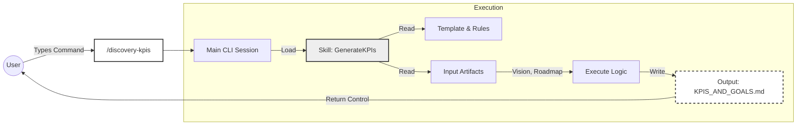
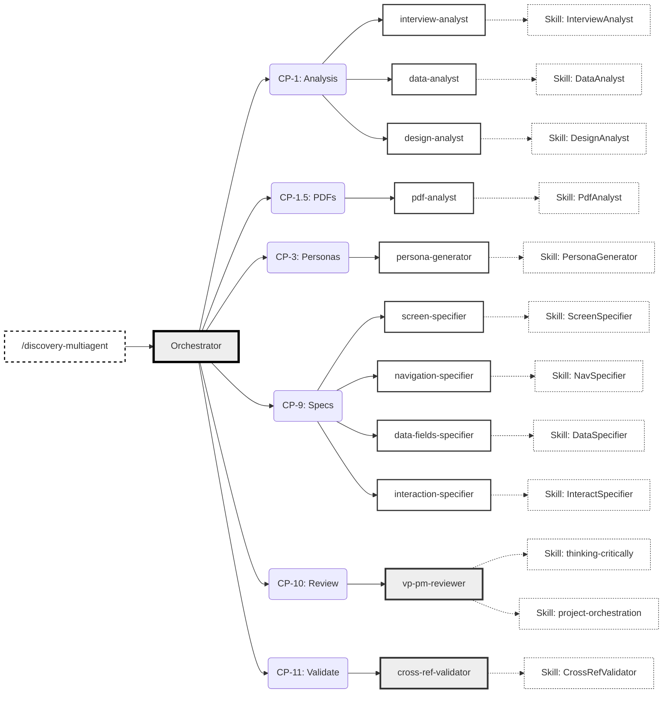

# HTEC Discovery Phase Tools: Onboarding Guide & Architecture Reference

**Version:** 2.2.0
**Date:** January 25, 2026
**Scope:** Discovery Phase Automation (Gemini CLI Environment)

---

## Table of Contents

1. [Executive Summary](#1-executive-summary)
2. [The Three-Layer Architecture](#2-the-three-layer-architecture)
3. [Visual Workflows](#3-visual-workflows)
4. [Core Workflow: Multi-Agent Parallelization](#4-core-workflow-multi-agent-parallelization)
   - 4.5. [Detailed Discovery Command Reference](#45-detailed-discovery-command-reference)
     - 4.5.1. [Orchestration Commands](#451-orchestration-commands)
     - 4.5.2. [Initialization Commands](#452-initialization-commands)
     - 4.5.3. [Manual Artifact Commands](#453-manual-artifact-commands)
     - 4.5.4. [Utility Commands](#454-utility-commands)
     - 4.5.5. [Command Comparison Matrix](#455-command-comparison-matrix)
     - 4.5.6. [Typical Command Sequences](#456-typical-command-sequences)
5. [Directory Structure & Outputs](#5-directory-structure--outputs)
6. [Command Reference](#6-command-reference)
7. [Agent Specifications & Models](#7-agent-specifications--models)
8. [State Management & Traceability](#8-state-management--traceability)
9. [Skills Matrix & Persona Ownership](#9-skills-matrix--persona-ownership)
10. [Getting Started](#10-getting-started)

---

## 1. Executive Summary

Welcome to the HTEC Discovery Phase toolset. This system transforms the traditional sequential software discovery process into a **massively parallel, multi-agent workflow**. By utilizing the Gemini CLI, we autonomously analyze client materials, generate personas, define strategies, and create detailed design specifications.

**Key Capabilities:**
*   **Massive Parallelization:** Runs up to 7+ agents simultaneously (e.g., analyzing 5 interview files at once).
*   **Token Efficiency:** Reduces token usage by 60-70% via specialized agents using fresh contexts.
*   **Multi-Model Strategy:** Uses **Opus** for deep strategic review, **Sonnet** for creation (with 1M context for interviews), and **Haiku** for validation.
*   **Speed:** Reduces typical Discovery phase execution time from ~2.5 hours to ~1.25 hours.
*   **16 Specialized Agents:** Covering analysis, research, strategy, design specs, strategic review, and validation.

[Back to Top](#table-of-contents)

---

## 2. The Three-Layer Architecture

Understanding the architecture is crucial for effective use. We do not move knowledge between agents; we share it via a "Single Source of Truth."

### Layer 1: Skills (The "Brain")
*   **Location:** `.claude/skills/{Stage}_{Function}/`
*   **Description:** These folders contain the core logic, templates, validation rules, and "how-to" instructions. They are the source of truth.
*   **Usage:** Both Manual Commands and Automated Agents reference these files.

### Layer 2: Commands (The "Manual Mode")
*   **Location:** `.claude/commands/`
*   **Invocation:** User types `/discovery-kpis`, `/discovery-personas`, etc.
*   **Description:** User-facing commands that execute logic synchronously in the main session.
*   **When to use:** Debugging, regenerating a single specific artifact, or targeted updates based on feedback.

### Layer 3: Agents (The "Auto Mode")
*   **Location:** `.claude/agents/`
*   **Invocation:** Spawned automatically by the Orchestrator (`/discovery-multiagent`).
*   **Description:** Specialized sub-agents that run asynchronously and in parallel. They load specific Skills from Layer 1 into a fresh context.
*   **When to use:** Production workflows, full stage execution, and processing large batches of input files.

[Back to Top](#table-of-contents)

---

## 3. Visual Workflows

### Manual Command Workflow
This workflow is synchronous and runs directly in your main CLI session. It is ideal for targeted updates.



### Agentic (Multi-Agent) Workflow
This workflow is asynchronous and massively parallel. The Orchestrator manages checkpoints and spawns specialized sub-agents.

```mermaid
---
config:
  theme: neo-dark
  layout: fixed
---
flowchart LR
 subgraph subGraph0["Massive Parallel Spawn"]
        A1["Interview Analyst 1"]
        CP1{"CP-1: Material Analysis"}
        A2["Interview Analyst 2"]
        A3["Data Analyst"]
        A4["Design Analyst"]
  end
 subgraph subGraph1["PDF Parallel Spawn"]
        PDF1["PDF Analyst 1"]
        CP1_5{"CP-1.5: PDF Analysis"}
        PDF2["PDF Analyst 2"]
  end
 subgraph subGraph2["Persona Parallel Spawn"]
        P1["Persona 1"]
        CP3{"CP-3: Personas"}
        P2["Persona 2"]
  end
 subgraph subGraph3["Specs Parallel Spawn"]
        S1["Screen Specifier"]
        CP9{"CP-9: Design Specs"}
        S2["Nav Specifier"]
        S3["Data Specifier"]
  end
 subgraph subGraph4["Strategic Review"]
        VPPM["VP PM Reviewer"]
        CP10["CP-10: VP PM Strategic Review"]
  end
    User(("User")) -- Start --> Orch["/discovery-multiagent"]
    Orch --> CP0["CP-0: Initialization"]
    CP0 --> CP1
    CP1 -- Spawn --> A1 & A2 & A3 & A4
    A1 -- Merge --> Sync1["Sync & Merge"]
    A2 -- Merge --> Sync1
    A3 -- Merge --> Sync1
    A4 -- Merge --> Sync1
    Sync1 --> CP1_5
    CP1_5 -- Spawn --> PDF1 & PDF2
    PDF1 --> CP2["CP-2: Pain Point Validation"]
    PDF2 --> CP2
    CP2 --> CP3
    CP3 -- Spawn --> P1 & P2
    P1 --> CP4["CP-4 to CP-8: Strategy Chain"]
    P2 --> CP4
    CP4 --> CP9
    CP9 -- Spawn --> S1 & S2 & S3
    S1 --> CP10
    S2 --> CP10
    S3 --> CP10
    CP10 -- Opus --> VPPM
    VPPM --> CP11["CP-11: Comprehensive Validation"]
    CP11 -- Report --> Done(("Complete"))

    style CP1 fill:#616161,stroke:#333,stroke-width:2px
    style CP1_5 fill:#757575,stroke:#333,stroke-width:2px
    style CP3 fill:#757575,stroke:#333,stroke-width:2px,color:none
    style CP9 fill:#757575,stroke:#333,stroke-width:2px
    style CP10 fill:#757575,stroke:#333,stroke-width:2px
    style Orch fill:#757575,stroke:#000,stroke-width:4px
```



### Detailed Agent-Skill Relationship Map

This diagram maps the Orchestrator checkpoints to specific Agents and their core Skills.



[Back to Top](#table-of-contents)
---


## 4. Core Workflow: Multi-Agent Parallelization

The Discovery phase is divided into Checkpoints (CP). The system advances through these checkpoints, spawning parallel agent groups where dependencies allow.

### The Dependency Graph

1.  **CP-0: Initialization** (Setup)
2.  **CP-1: Material Analysis (MASSIVELY PARALLEL)**
    *   *Agents:* One `interview-analyst` per file (Sonnet 1M), `data-analyst`, `design-analyst`.
3.  **CP-1.5: PDF Analysis (PARALLEL)**
    *   *Agents:* One `pdf-analyst` per PDF file.
4.  **CP-2: Pain Point Validation** (Sequential - Gates next steps)
5.  **CP-3: Persona Generation (PARALLEL)**
    *   *Agents:* One `persona-generator` per user role.
6.  **CP-4 to CP-8: Strategy & Vision** (Sequential Chain)
    *   JTBD → Vision → Strategy → Roadmap → KPIs.
7.  **CP-9: Design Specifications (PARALLEL)**
    *   *Agents:* `screen-specifier`, `navigation-specifier`, `data-fields-specifier`, `interaction-specifier`.
8.  **CP-10: VP PM Strategic Review** ⭐ NEW
    *   *Agent:* `vp-pm-reviewer` (Opus model)
    *   30-year VP PM persona with 15-step critical thinking framework
    *   Outputs: `VP_PM_STRATEGIC_REVIEW.md`
9.  **CP-11: Comprehensive Validation** (Blocking Gate)
    *   6-phase validation: folders, files, state, traceability, tasks, P0 coverage
    *   Auto-remediation callback via `--fix-issues` flag

[Back to Top](#table-of-contents)

---

## 4.5. Detailed Discovery Command Reference

This section provides comprehensive documentation for all Discovery phase commands, including what they do, what files they read/create, what skills/agents they use, and when to use them.

### Command Categories

Discovery commands fall into four categories:

1. **Orchestration Commands** - End-to-end workflow execution
2. **Initialization Commands** - Setup and configuration
3. **Manual Artifact Commands** - Regenerate specific outputs
4. **Utility Commands** - Status, validation, export

---

### 4.5.1 Orchestration Commands

#### `/discovery-multiagent <SystemName> <InputPath> [flags]` ⭐ RECOMMENDED

**File**: `.claude/commands/discovery-multiagent.md`
**Model**: Sonnet
**Mode**: Massively Parallel Multi-Agent

**What it does**:
- Executes complete Discovery phase using multi-agent parallelization
- Spawns specialized agents for each checkpoint
- Implements spawn verification with retry logic
- Provides 60-70% performance improvement over sequential mode

**Reads**:
- `Client_Materials/**/*` - All raw client files
- `.claude/agents/DISCOVERY_AGENT_REGISTRY.json` - Agent registry
- `.claude/agents/discovery-*.md` - Agent definitions (15 agents)
- `.claude/skills/Discovery_*/**/*` - All Discovery skills
- `_state/discovery_agent_spawn_manifest.json` - For resume mode
- `_state/discovery_progress.json` - Checkpoint tracking

**Creates/Edits**:
- `_state/discovery_agent_spawn_manifest.json` - Tracks all agent spawns
- `_state/agent_sessions.json` - Active agent sessions
- `_state/discovery_progress.json` - Checkpoint completion status
- `_state/discovery_config.json` - System configuration
- `ClientAnalysis_<SystemName>/` - All Discovery outputs (20+ files)
- `traceability/*.json` - All traceability registries

**Spawns Agents** (via Task tool):
```
CP-1: Material Analysis (MASSIVE PARALLEL)
  ├─ discovery-interview-analyst (1 per interview, Sonnet 1M)
  ├─ discovery-data-analyst (Sonnet)
  └─ discovery-design-analyst (Sonnet)

CP-1.5: PDF Analysis (PARALLEL)
  └─ discovery-pdf-analyst (1 per PDF, Sonnet)

CP-2: Pain Point Validation
  └─ discovery-pain-point-validator (Sonnet)

CP-3: Persona Generation (PARALLEL)
  └─ discovery-persona-generator (1 per user type, Sonnet)

CP-4: JTBD Extraction
  └─ discovery-jtbd-extractor (Sonnet)

CP-5-8: Strategy Chain (Sequential)
  ├─ discovery-vision-generator (Sonnet)
  ├─ discovery-strategy-generator (Sonnet)
  ├─ discovery-roadmap-generator (Sonnet)
  └─ discovery-kpis-generator (Sonnet)

CP-9: Design Specs (PARALLEL - 4 agents)
  ├─ discovery-screen-specifier (Sonnet)
  ├─ discovery-navigation-specifier (Sonnet)
  ├─ discovery-data-fields-specifier (Sonnet)
  └─ discovery-interaction-specifier (Sonnet)

CP-10: Strategic Review (NEW)
  └─ discovery-vp-pm-reviewer (Opus) ⭐

CP-11: Validation (BLOCKING)
  └─ discovery-cross-reference-validator (Haiku)
```

**Skills Used** (loaded by agents):
- `Discovery_InterviewAnalyst`
- `Discovery_DataAnalyst`
- `Discovery_DesignAnalyst`
- `Discovery_PdfAnalyst`
- `Discovery_PainPointValidator`
- `Discovery_PersonaGenerator`
- `Discovery_JTBDExtractor`
- `Discovery_VisionGenerator`
- `Discovery_StrategyGenerator`
- `Discovery_RoadmapGenerator`
- `Discovery_KPIsGenerator`
- `Discovery_ScreenSpecifier`
- `Discovery_NavSpecifier`
- `Discovery_DataFieldsSpecifier`
- `Discovery_InteractionSpecifier`
- `thinking-critically` (VP PM Review)
- `project-orchestration` (VP PM Review)
- `Discovery_CrossRefValidator`

**Agent Spawn Verification**:
- Timeout: 30 seconds per agent
- Retry attempts: 3 (with countermeasures)
- Verification methods:
  1. Check `_state/agent_sessions.json` for new entry
  2. Poll `agent_coordinator.py --status`
  3. File system watcher (output file created)

**Example Usage**:
```bash
# New run (visible terminals - default)
/discovery-multiagent InventorySystem Client_Materials/

# Headless mode (no visible terminals)
/discovery-multiagent InventorySystem Client_Materials/ --headless

# Resume from last checkpoint
/discovery-multiagent InventorySystem --resume

# Resume from specific checkpoint
/discovery-multiagent InventorySystem --resume --checkpoint 3

# Retry failed agents
/discovery-multiagent InventorySystem --resume --retry-failed

# Fix validation issues (triggered by CP-11)
/discovery-multiagent InventorySystem --fix-issues
```

**When to use**:
- ✅ Complex projects (>5 client materials)
- ✅ Large interview sets (10+ interviews)
- ✅ Time-sensitive deliverables
- ✅ Production workflows
- ❌ Simple projects (<10 materials) - use `/discovery` instead
- ❌ Debugging/testing - use manual commands

**Performance**:
- **60-70% faster** than sequential mode
- **76% token reduction** (62,500 → 15,000 peak)
- **Massive parallelization**: 5 interviews = 7 parallel agents at CP-1

**Resume Capability**:
- Reads `_state/discovery_agent_spawn_manifest.json`
- Skips completed agents
- Re-spawns failed agents (with `--retry-failed`)
- Continues from specific checkpoint (with `--checkpoint N`)

---

#### `/discovery <SystemName> <InputPath>`

**File**: `.claude/commands/discovery.md`
**Model**: Sonnet
**Mode**: Sequential (Single Session)

**What it does**:
- Executes complete Discovery phase in main session
- Loads all skills sequentially
- No agent spawning - all work in main thread

**Reads**:
- `Client_Materials/**/*` - All raw client files
- `.claude/skills/Discovery_*/**/*` - All Discovery skills (29 skills)
- `_state/discovery_progress.json` - Checkpoint tracking

**Creates/Edits**:
- Same as `/discovery-multiagent` but without spawn manifest
- All work done in main session

**Spawns Agents**: None (single-session execution)

**Skills Used** (directly in main session):
- All 29 Discovery skills loaded sequentially

**Example Usage**:
```bash
/discovery InventorySystem Client_Materials/
```

**When to use**:
- Simple projects (<10 client materials)
- Debugging skill logic
- Testing new Discovery skills
- Multi-agent infrastructure unavailable

**Performance**: Baseline (100% - no parallelization)

---

### 4.5.2 Initialization Commands

#### `/discovery-init <SystemName> <InputPath>`

**File**: `.claude/commands/discovery-init.md`
**Model**: Haiku
**Mode**: Setup

**What it does**:
- Initializes Discovery session folder structure
- Creates all state files and traceability registries
- Scans and categorizes client materials
- Creates empty output folders

**Reads**:
- `.claude/skills/Discovery_Orchestrator/Discovery_Orchestrator.md` - For templates
- `.claude/templates/traceability/init/*.init.json` - Registry templates
- `Client_Materials/**/*` - To build materials inventory

**Creates/Edits**:
```
_state/
├── pipeline_config.json             ← Project-level config
├── discovery_config.json            ← Discovery config
├── discovery_progress.json          ← Checkpoint tracking
├── discovery_context.json           ← Session history
├── discovery_materials_inventory.json ← File categorization
└── discovery_error_log.md           ← Error tracking

traceability/
├── trace_matrix.json                ← Empty chains
├── client_facts_registry.json       ← Empty
├── pain_point_registry.json         ← Empty
├── user_type_registry.json          ← Empty
├── jtbd_registry.json               ← Empty
├── requirements_registry.json       ← Empty
├── screen_registry.json             ← Empty
├── <SystemName>_version_history.json ← Empty history
└── feedback_sessions/               ← Empty folder

ClientAnalysis_<SystemName>/
├── 00-management/
│   └── PROGRESS_TRACKER.md          ← Initial tracker
├── 01-analysis/                     ← Empty
├── 02-research/                     ← Empty
├── 03-strategy/                     ← Empty
├── 04-design-specs/                 ← Empty
└── 05-documentation/                ← Empty
```

**Spawns Agents**: None

**Skills Used**:
- `Discovery_Orchestrator` (read only for templates)

**Example Usage**:
```bash
/discovery-init InventorySystem Client_Materials/
```

**When to use**:
- Before starting Discovery analysis
- When you want granular control over workflow
- Can be followed by `/discovery-analyze` or individual commands

**Next Command**: `/discovery-analyze` or `/discovery`

---

### 4.5.3 Manual Artifact Commands

These commands regenerate specific Discovery artifacts without re-running the entire pipeline.

#### `/discovery-analyze`

**File**: `.claude/commands/discovery-analyze.md`
**Model**: Sonnet
**Mode**: Material Analysis Only

**What it does**:
- Analyzes raw client materials
- Extracts client facts, pain points, user types
- Handles PDF chunking for large files (>30 pages)
- Handles audio/video transcription
- **MANDATORY**: Classifies project type (FULL_STACK, BACKEND_ONLY, etc.)

**Reads**:
- `_state/discovery_config.json` - For input_path
- `_state/discovery_materials_inventory.json` - File list
- `Client_Materials/**/*` - All raw files
- `.claude/skills/Discovery_ClassifyProject/SKILL.md` - **MANDATORY**
- `.claude/skills/Discovery_AnalyzeDocument/` - Document analysis
- `.claude/skills/Discovery_AnalyzeSpreadsheet/` - Spreadsheet analysis
- `.claude/skills/Discovery_AnalyzeInterview/` - Interview analysis
- `.claude/skills/Discovery_AnalyzePDF/` - Deep PDF analysis
- `.claude/skills/Discovery_ExtractClientFacts/` - **MANDATORY**
- `.claude/skills/Discovery_ExtractPainPoints/`
- `.claude/skills/tools/pdf_splitter.py` - PDF chunking
- `.claude/skills/tools/audio_transcriber.py` - Audio/video transcription

**Creates/Edits**:
```
ClientAnalysis_<SystemName>/01-analysis/
├── interviews/{name}_Analysis.md    ← Per interview
├── data/DATA_ANALYSIS.md           ← Spreadsheet analysis
├── design/DESIGN_ANALYSIS.md       ← Screenshot analysis
├── PAIN_POINTS.md                  ← Consolidated pain points
└── ANALYSIS_SUMMARY.md             ← Overall summary

Client_Materials/
├── _transcripts/{name}_transcript.md ← Audio/video transcripts
└── _pdf_markdown/{pdf_name}/       ← PDF markdown chunks
    ├── {basename}_1_30.md          ← Page 1-30
    ├── {basename}_31_60.md         ← Page 31-60
    └── ...

traceability/
├── client_facts_registry.json      ← Populated with CM-XXX, CF-XXX
└── pain_point_registry.json        ← Populated with PP-X.X

_state/
├── discovery_config.json           ← Updated with project_classification
└── discovery_error_log.md          ← Skipped files logged
```

**Spawns Agents**: None (main session only)

**Skills Used**:
- `Discovery_ClassifyProject` - **MANDATORY FIRST**
- `Discovery_AnalyzeDocument`
- `Discovery_AnalyzeSpreadsheet`
- `Discovery_AnalyzePresentation`
- `Discovery_AnalyzeScreenshot`
- `Discovery_AnalyzeAudioVideo`
- `Discovery_AnalyzeInterview`
- `Discovery_AnalyzePDF` (Phase 1.5 - deep analysis)
- `Discovery_ExtractClientFacts` - **MANDATORY**
- `Discovery_ExtractPainPoints`
- `Discovery_ExtractUserTypes`

**PDF Handling** (CRITICAL):
```bash
# STEP 1: ALWAYS check page count first
.venv/bin/python .claude/skills/tools/pdf_splitter.py count <file.pdf>
# Output: "📄 manual.pdf: 72 pages"

# STEP 2: Branch based on count
IF pages ≤ 30:
    Read(<file.pdf>)  # Direct read OK
ELSE:
    # STEP 3: Convert to Markdown (stored in Client_Materials for reuse!)
    .venv/bin/python .claude/skills/tools/pdf_splitter.py automd \
        <file.pdf> Client_Materials/_pdf_markdown/{pdf_name}/

    # STEP 4: Read Markdown files instead
    FOR EACH .md file in _pdf_markdown/{pdf_name}/:
        Read(<chunk.md>)
```

**Audio/Video Handling** (MANDATORY for .mp3, .wav, .m4a, .mp4, .mov, .avi):
```bash
# STEP 1: Transcribe audio
.venv/bin/python .claude/skills/tools/audio_transcriber.py \
    <file> Client_Materials/_transcripts/
# Creates: {filename}_transcript.md

# STEP 2: Read transcript
Read(Client_Materials/_transcripts/{filename}_transcript.md)
```

**Project Classification** (MANDATORY):
- Determines: FULL_STACK, BACKEND_ONLY, DATABASE_ONLY, INTEGRATION, INFRASTRUCTURE
- Stores in: `_state/discovery_config.json` → `project_classification`
- Affects: Which artifacts are required/optional

**Example Usage**:
```bash
/discovery-analyze
```

**When to use**:
- After `/discovery-init`
- To re-analyze materials after adding new files
- When materials were skipped due to errors

**Next Command**: `/discovery-personas` or `/discovery-research`

---

#### `/discovery-personas`

**File**: `.claude/commands/discovery-personas.md`
**Model**: Haiku
**Mode**: Persona Generation Only

**What it does**:
- Generates detailed persona files for all user types
- Creates rich narratives with goals, pain points, workflows
- Links to pain points and JTBD

**Reads**:
- `_state/discovery_config.json` - For output_path
- `traceability/user_type_registry.json` - User types
- `traceability/pain_point_registry.json` - Pain points
- `01-analysis/ANALYSIS_SUMMARY.md` - Context
- `.claude/skills/Discovery_GeneratePersona/` - Template and logic

**Creates/Edits**:
```
ClientAnalysis_<SystemName>/02-research/
├── persona-warehouse-manager.md    ← Primary persona
├── persona-inventory-clerk.md      ← Primary persona
├── persona-shipping-coordinator.md ← Primary persona
└── persona-composite-staff.md      ← Composite (if needed)

traceability/user_type_registry.json ← Updated with persona_file references
```

**Spawns Agents**: None

**Skills Used**:
- `Discovery_GeneratePersona`

**Persona Content**:
- Overview table (role, department, experience, tech proficiency)
- Profile with representative name and photo description
- Goals with success metrics
- Pain points (P0, P1, P2) with quotes and IDs
- Daily workflow table (time-based activities)
- Technical context
- Jobs To Be Done preview
- Representative quotes
- Design implications
- Feature priorities
- Success indicators
- Relationships with other personas

**Persona Selection Logic**:
| User Types Found | Action |
|-----------------|--------|
| 1-3 | All as personas |
| 4-6 | 3-4 primary + 1 composite |
| 7+ | 4-5 primary, group others |

**Example Usage**:
```bash
/discovery-personas
```

**When to use**:
- After analysis phase complete
- To regenerate personas after feedback
- When user types changed

**Next Command**: `/discovery-jtbd`

---

#### `/discovery-jtbd`

**File**: `.claude/commands/discovery-jtbd.md`
**Model**: Haiku

**What it does**:
- Generates Jobs-To-Be-Done document
- Transforms pain points into "When... I want to... So that..." format
- Links to personas and screens

**Reads**:
- `traceability/pain_point_registry.json`
- `traceability/user_type_registry.json`
- `02-research/persona-*.md`
- `.claude/skills/Discovery_GenerateJTBD/`

**Creates/Edits**:
```
ClientAnalysis_<SystemName>/02-research/
└── JOBS_TO_BE_DONE.md              ← JTBD document

traceability/jtbd_registry.json     ← Populated with JTBD-X.X
```

**Example Usage**:
```bash
/discovery-jtbd
```

---

#### `/discovery-screens`

**File**: `.claude/commands/discovery-screens.md`
**Model**: Haiku

**What it does**:
- Generates screen definitions document
- Defines purpose, elements, and user flows for each screen
- Links to JTBD and personas

**Reads**:
- `traceability/jtbd_registry.json`
- `02-research/persona-*.md`
- `.claude/skills/Discovery_ScreenSpecifier/`

**Creates/Edits**:
```
ClientAnalysis_<SystemName>/04-design-specs/
└── screen-definitions.md           ← Screen specs

traceability/screen_registry.json   ← Populated with S-X.X
```

**Example Usage**:
```bash
/discovery-screens
```

---

#### `/discovery-kpis`

**File**: `.claude/commands/discovery-kpis.md`
**Model**: Haiku

**What it does**:
- Generates KPIs and Goals document
- Defines S.M.A.R.T. metrics and OKRs
- Links to product vision

**Reads**:
- `03-strategy/PRODUCT_VISION.md`
- `03-strategy/PRODUCT_ROADMAP.md`
- `.claude/skills/Discovery_KPIsGenerator/`

**Creates/Edits**:
```
ClientAnalysis_<SystemName>/03-strategy/
└── KPIS_AND_GOALS.md               ← KPIs document
```

**Example Usage**:
```bash
/discovery-kpis
```

---

### 4.5.4 Utility Commands

#### `/discovery-status`

**File**: `.claude/commands/discovery-status.md`
**Model**: Haiku
**Mode**: Read-Only Status Display

**What it does**:
- Displays comprehensive Discovery phase status
- Shows checkpoint progress
- Lists processed materials
- Shows traceability statistics
- Lists errors/skipped files
- Provides recommended next action

**Reads**:
- `_state/discovery_config.json` - Status and system name
- `_state/discovery_progress.json` - Checkpoint status
- `_state/discovery_context.json` - Session history
- `_state/discovery_materials_inventory.json` - Materials stats
- `_state/discovery_error_log.md` - Errors
- `traceability/*.json` - All registries for statistics

**Creates/Edits**: None (read-only)

**Spawns Agents**: None

**Skills Used**: None

**Output**:
```
╔════════════════════════════════════════════════════════════╗
║              DISCOVERY STATUS: InventorySystem              ║
╠════════════════════════════════════════════════════════════╣
║ Status:        In Progress                                  ║
║ Progress:      ████████████░░░░░░░░ 60%                    ║
║ Current Phase: JTBD Generation                              ║
║ Checkpoint:    discovery-jtbd                               ║
╚════════════════════════════════════════════════════════════╝

PHASE STATUS
────────────────────────────────────────────────────────────
✅ 0. Initialize          Completed: 2026-01-15 10:00
✅ 1. Analyze Materials    Completed: 2026-01-15 10:30
✅ 2. Extract Insights     Completed: 2026-01-15 10:45
✅ 3. Generate Personas    Completed: 2026-01-15 11:00
⏳ 4. Generate JTBD        In Progress...
⏸️  5. Generate Vision      Pending
⏸️  6. Generate Strategy    Pending
⏸️  7. Generate Roadmap     Pending
⏸️  8. Generate KPIs        Pending
⏸️  9. Design Specs         Pending
⏸️  10. Documentation       Pending
⏸️  11. Validation          Pending

MATERIALS PROCESSED
────────────────────────────────────────────────────────────
Total Files:     15
Processed:       12 (80%)
Skipped:         3

By Type:
• Interviews:    5 files
• Documents:     4 files
• Spreadsheets:  2 files
• Screenshots:   1 file
• Skipped:       3 files (video/audio)

TRACEABILITY STATUS
────────────────────────────────────────────────────────────
Pain Points:     12 (P0: 4, P1: 5, P2: 3)
User Types:      5
JTBDs:           8
Features:        0 (pending roadmap)
Screens:         0 (pending specs)

RECOMMENDED ACTION
────────────────────────────────────────────────────────────
Continue with: /discovery-resume
Or run specific phase: /discovery-jtbd
```

**Example Usage**:
```bash
/discovery-status
```

**When to use**:
- Check current progress
- Identify next steps
- Review what was processed
- Check for errors

---

#### `/discovery-audit`

**File**: `.claude/commands/discovery-audit.md`
**Model**: Sonnet
**Mode**: Zero Hallucination Audit

**What it does**:
- Performs zero-hallucination audit on all artifacts
- Verifies every claim has source citation
- Checks all persona traits have interview evidence
- Validates pain points have source evidence
- Checks JTBD have user quotes
- Identifies orphaned claims

**Reads**:
- `ClientAnalysis_<SystemName>/02-research/persona-*.md` - All personas
- `ClientAnalysis_<SystemName>/02-research/JOBS_TO_BE_DONE.md`
- `ClientAnalysis_<SystemName>/01-analysis/**/*.md` - All analysis
- `traceability/client_facts_registry.json`
- `traceability/pain_point_registry.json`
- `.claude/skills/Discovery_FactAuditor/SKILL.md`
- `.claude/skills/traceability/Traceability_Guard.md`

**Creates/Edits**:
```
ClientAnalysis_<SystemName>/05-documentation/
├── AUDIT_REPORT.md                 ← Audit results (PASS/FAIL)
├── HALUCINATIONS_LOG.md            ← Issues found (if any)
└── CLIENT_CLARIFICATION_QUESTIONS.md ← Questions for client (if issues)

traceability/trace_matrix.json      ← Updated with audit results
```

**Spawns Agents**: None

**Skills Used**:
- `Discovery_FactAuditor`
- `Traceability_Guard`

**Audit Checks**:
1. **Citation Check**: All claims have `(Source: ...)` or `CF-XXX` reference
2. **Persona Traits**: All persona goals/frustrations have interview quotes
3. **Pain Points**: All pain points have client fact references
4. **JTBD**: All jobs have supporting evidence
5. **Orphan Detection**: No artifacts without traceability chains

**Audit Results**:
```
IF hallucinations detected:
    ❌ **Audit Failed**: Hallucinations found
    → BLOCK PIPELINE (cannot export to Prototype)
    → Present CLIENT_CLARIFICATION_QUESTIONS.md

ELSE:
    ✅ **Audit Passed**: All claims verified
    → Ready for export
```

**Example Usage**:
```bash
/discovery-audit InventorySystem
```

**When to use**:
- Before `/discovery-export`
- **MANDATORY** at Checkpoint 10.5
- After feedback incorporation
- Quality assurance milestone

**Blocking**: If audit fails, Discovery cannot proceed to Prototype stage

---

#### `/discovery-feedback [feedback | file.md | resume FB-NNN | status | list]`

**File**: `.claude/commands/discovery-feedback.md`
**Model**: Sonnet
**Mode**: Reflexion-Enhanced Change Management

**What it does**:
- Processes feedback on Discovery artifacts
- Performs reflexion-enhanced impact analysis
- Evaluates multiple implementation options
- Implements changes with full traceability
- Validates changes with multi-perspective review
- Memorizes lessons learned

**Reads**:
- `ClientAnalysis_<SystemName>/**/*` - All Discovery outputs
- `traceability/*.json` - All registries
- `.claude/skills/Shared_FeedbackImpactAnalyzer_Reflexion/SKILL.md`
- `.claude/skills/Shared_FeedbackPlanGenerator_Reflexion/SKILL.md`
- `.claude/skills/Shared_FeedbackReviewer_Reflexion/SKILL.md`

**Creates/Edits**:
```
traceability/feedback_sessions/discovery/
├── discover_feedback_register.json ← All feedback items
└── FB-{NNN}/
    ├── feedback_input.md           ← Original feedback
    ├── impact_analysis.md          ← Hierarchical chains, before/after
    ├── implementation_plan.md      ← Options with X/10 scores
    ├── implementation_log.md       ← Execution log
    ├── post_implementation_review.md ← Validation
    └── completion_summary.md       ← Final summary

Updated artifacts in ClientAnalysis_<SystemName>/ ← Based on plan
Updated registries in traceability/ ← Traceability preserved
```

**Spawns Agents**: None (uses Reflexion pattern in main session)

**Skills Used**:
- `Shared_FeedbackImpactAnalyzer_Reflexion` (Actor + Evaluator)
- `Shared_FeedbackPlanGenerator_Reflexion` (Actor + Evaluator)
- `Shared_FeedbackReviewer_Reflexion` (Evaluator)

**Workflow**:
```
1. INPUT          Collect feedback, metadata
2. ANALYZE        ← REFLEXION: Impact analysis + self-critique
                    • Hierarchical traceability chains
                    • Before/after content
                    • Confidence level (HIGH/MEDIUM/LOW)
3. REGISTER       Assign FB-NNN, create session folder
4. APPROVE        ← AskUserQuestion: Approve/Reject/Modify
5. PLAN           ← REFLEXION: Generate + evaluate options (X/10 scores)
6. IMPLEMENT      Execute selected plan
7. VALIDATE       ← REFLEXION: Multi-perspective review
                    • Requirements perspective
                    • Architecture perspective
                    • Quality perspective
8. COMPLETE       Generate summary, close session
```

**Impact Analysis Output**:
- Hierarchical chains: PP → JTBD → Requirements → Screens → Components
- Before/after content for each change
- Flat summary table
- Reflexion self-critique:
  - ✓ Completeness check
  - ✓ Accuracy check
  - ✓ Downstream impact assessment
  - ✓ Risk assessment
- Confidence level with percentage

**Implementation Options** (evaluated by Reflexion):
```
Option 1: Minimal Change (Conservative)
  Score: 7/10
  Pros: Low risk, fast, maintains consistency
  Cons: May not fully address feedback

Option 2: Comprehensive Refactor
  Score: 9/10
  Pros: Addresses root cause, improves quality
  Cons: Higher effort, more testing needed

Option 3: Incremental Enhancement
  Score: 8/10
  Pros: Balanced approach, manageable risk
  Cons: Requires careful sequencing
```

**Example Usage**:
```bash
# Interactive mode
/discovery-feedback

# Inline feedback
/discovery-feedback "Add support for mobile barcode scanning"

# From file
/discovery-feedback feedback.md

# Resume incomplete implementation
/discovery-feedback resume FB-003

# Check status
/discovery-feedback status

# List all feedback
/discovery-feedback list
```

**When to use**:
- User/client provides feedback on Discovery outputs
- Need to incorporate change requests
- Want to assess impact before making changes
- Need traceability for changes

**Features**:
- ✓ Reflexion-powered analysis (confidence scoring)
- ✓ Hierarchical impact visualization
- ✓ Multiple options with evaluation
- ✓ Multi-perspective validation
- ✓ Kaizen PDCA integration
- ✓ Lesson memorization

---

#### `/discovery-export`

**File**: `.claude/commands/discovery-export.md`
**Model**: Haiku
**Mode**: Package for Next Stage

**What it does**:
- Verifies Discovery completion
- Validates traceability coverage
- Generates export summary
- Updates pipeline config
- Prepares for Prototype stage

**Reads**:
- `_state/discovery_config.json` - Completion status
- `05-documentation/VALIDATION_REPORT.md` - Validation status
- `ClientAnalysis_<SystemName>/**/*` - All outputs
- `traceability/*.json` - All registries

**Creates/Edits**:
```
_state/
├── discovery_export.json           ← Export metadata
└── pipeline_config.json            ← Update current_stage to "prototype"

Output: Export Report (console)
```

**Spawns Agents**: None

**Skills Used**: None

**Export Verification**:
1. **Completion Check**: `discovery_config.json` status = "complete"
2. **Validation Check**: `VALIDATION_REPORT.md` status = 🟢 PASS
3. **P0 Coverage Check**: 100% P0 pain points traced to screens
4. **Required Files Check**: All mandatory artifacts exist

**Export Summary**:
```
╔════════════════════════════════════════════════════════════╗
║              DISCOVERY EXPORT COMPLETE                      ║
╠════════════════════════════════════════════════════════════╣
║ System:        InventorySystem                              ║
║ Export Time:   2026-01-15 14:30                             ║
║ Target Stage:  Prototype                                    ║
╚════════════════════════════════════════════════════════════╝

EXPORT SUMMARY
────────────────────────────────────────────────────────────

Discovery Outputs:
✅ ClientAnalysis_InventorySystem/  (complete)
✅ traceability/                     (populated)
✅ _state/discovery_*.json           (finalized)

Key Artifacts for Prototype:
────────────────────────────────────────────────────────────

| Artifact | Path | Status |
|----------|------|--------|
| Personas | 02-research/persona-*.md | ✅ Ready |
| JTBD | 02-research/JOBS_TO_BE_DONE.md | ✅ Ready |
| Roadmap | 03-strategy/PRODUCT_ROADMAP.md | ✅ Ready |
| Screens | 04-design-specs/screen-definitions.md | ✅ Ready |
| Data Model | 04-design-specs/data-fields.md | ✅ Ready |
| Sample Data | 04-design-specs/sample-data.json | ✅ Ready |

Traceability Status:
────────────────────────────────────────────────────────────

• Pain Points: 12 (P0: 5, P1: 5, P2: 2)
• P0 → Screen Coverage: 100%
• Ready for Prototype: ✅ Yes

NEXT STEPS
────────────────────────────────────────────────────────────
Run: /prototype InventorySystem
Or:  /prototype-multiagent InventorySystem
```

**Example Usage**:
```bash
/discovery-export
```

**When to use**:
- After Discovery phase complete
- Before starting Prototype
- To verify readiness for next stage

**Blocking Conditions**:
- Discovery status ≠ "complete"
- Validation status ≠ PASS
- P0 coverage < 100%
- Required files missing

**Next Command**: `/prototype InventorySystem` or `/prototype-multiagent InventorySystem`

---

### 4.5.5 Command Comparison Matrix

| Command | Mode | Agents | Speed | Use Case |
|---------|------|--------|-------|----------|
| `/discovery-multiagent` | Parallel | 15+ base + N instances | **60-70% faster** | Production, complex projects |
| `/discovery` | Sequential | 0 (main session) | Baseline | Simple projects, debugging |
| `/discovery-init` | Setup | 0 | Fast | Initialize only |
| `/discovery-analyze` | Material Analysis | 0 | Medium | Re-analyze materials |
| `/discovery-personas` | Artifact Gen | 0 | Fast | Regenerate personas |
| `/discovery-jtbd` | Artifact Gen | 0 | Fast | Regenerate JTBD |
| `/discovery-screens` | Artifact Gen | 0 | Fast | Regenerate screens |
| `/discovery-kpis` | Artifact Gen | 0 | Fast | Regenerate KPIs |
| `/discovery-status` | Utility | 0 | Instant | Check progress |
| `/discovery-audit` | Validation | 0 | Medium | Zero hallucination audit |
| `/discovery-feedback` | Change Mgmt | 0 (Reflexion) | Medium | Process feedback |
| `/discovery-export` | Utility | 0 | Fast | Package for Prototype |

---

### 4.5.6 Typical Command Sequences

#### New Project (Multi-Agent - Recommended)
```bash
# 1. Initialize
/discovery-multiagent InventorySystem Client_Materials/

# (If interrupted, resume)
/discovery-multiagent InventorySystem --resume

# 2. Check status
/discovery-status

# 3. Audit
/discovery-audit InventorySystem

# 4. Export
/discovery-export
```

#### New Project (Manual Control)
```bash
# 1. Initialize
/discovery-init InventorySystem Client_Materials/

# 2. Analyze materials
/discovery-analyze

# 3. Generate personas
/discovery-personas

# 4. Generate JTBD
/discovery-jtbd

# 5. Generate screens
/discovery-screens

# 6. Audit
/discovery-audit InventorySystem

# 7. Export
/discovery-export
```

#### Feedback Workflow
```bash
# 1. Process feedback
/discovery-feedback "Add mobile support for warehouse staff"

# 2. Re-audit
/discovery-audit InventorySystem

# 3. Check status
/discovery-status

# 4. Export
/discovery-export
```

#### Resume After Failure
```bash
# 1. Check what failed
/discovery-status

# 2. Resume multi-agent
/discovery-multiagent InventorySystem --resume --retry-failed

# Or resume from specific checkpoint
/discovery-multiagent InventorySystem --resume --checkpoint 3
```

[Back to Top](#table-of-contents)

---

## 5. Directory Structure & Outputs

Understanding where files are read from and written to is essential for managing the Discovery process.

```mermaid
graph TD
    Root[Project Root]
    
    subgraph Inputs
        CM[Client_Materials/]
        Interviews[Interviews/*.md]
        PDFs[PDFs/*.pdf]
        Data[Data/*.xlsx]
        Images[Images/*.png]
        
        CM --> Interviews
        CM --> PDFs
        CM --> Data
        CM --> Images
    end
    
    subgraph System
        State[_state/]
        Manifest[discovery_manifest.json]
        Progress[discovery_progress.json]
        
        State --> Manifest
        State --> Progress
    end
    
    subgraph "Output Artifacts"
        Out[ClientAnalysis_SystemName/]
        
        Analysis[01-analysis/]
        Research[02-research/]
        Strategy[03-strategy/]
        Specs[04-design-specs/]
        Docs[05-documentation/]
        
        Out --> Analysis
        Out --> Research
        Out --> Strategy
        Out --> Specs
        Out --> Docs
        
        Analysis --> AA1[interviews/*_Analysis.md]
        Analysis --> AA2[PAIN_POINTS.md]
        
        Research --> RR1[personas/*.md]
        Research --> RR2[JOBS_TO_BE_DONE.md]
        
        Strategy --> ST1[PRODUCT_VISION.md]
        Strategy --> ST2[PRODUCT_ROADMAP.md]
        
        Specs --> SP1[screen-definitions.md]
        Specs --> SP2[data-fields.md]
        
        Docs --> DD1[VALIDATION_REPORT.md]
    end
    
    Root --> CM
    Root --> State
    Root --> Out
    
    style Inputs fill:#fff,stroke:#333,stroke-width:2px
    style System fill:#eee,stroke:#333,stroke-width:2px
    style Out fill:#fff,stroke:#333,stroke-width:2px,stroke-dasharray: 5 5
```



### Folder Breakdown

*   **`Client_Materials/`**: The **ONLY** place you should put raw client files. The agents scan this directory automatically.
*   **`_state/`**: System files that track progress. **Do not edit manually** unless you are debugging a stuck process.
*   **`ClientAnalysis_[SystemName]/`**: The main output directory. All generated markdown files reside here, organized by phase (01 to 05).

### ANSI Directory Tree

```text
.
├── Client_Materials/                # RAW INPUTS
│   ├── Interviews/                  # Interview transcripts (.md, .txt)
│   ├── PDFs/                        # Technical documentation (.pdf)
│   ├── Data/                        # Spreadsheets (.xlsx, .csv)
│   └── Images/                      # Screenshots (.png, .jpg)
├── _state/                          # ORCHESTRATION STATE
│   ├── discovery_agent_spawn_manifest.json
│   └── discovery_progress.json
├── traceability/                    # SHARED REGISTRIES
│   ├── client_facts_registry.json
│   ├── discovery_traceability_register.json
│   ├── jtbd_registry.json           # Jobs-to-be-Done catalog
│   ├── pain_points_registry.json    # Validated problems catalog
│   ├── user_types_registry.json     # Identified personas list
│   └── screen_registry.json         # Master screen list
└── ClientAnalysis_[SystemName]/     # GENERATED ARTIFACTS
    ├── 01-analysis/                 # Foundational Analysis
    │   ├── interviews/              # Per-interview deep dives
    │   ├── data/                    # Spreadsheet analysis
    │   ├── design/                  # Screenshot analysis
    │   └── PAIN_POINTS.md           # Consolidated validated problems
    ├── 02-research/                 # User & Job Research
    │   ├── personas/                # Detailed user profiles
    │   └── JOBS_TO_BE_DONE.md       # "When... I want to... So that..."
    ├── 03-strategy/                 # Strategic Direction
    │   ├── PRODUCT_VISION.md        # Value prop & North Star
    │   ├── PRODUCT_STRATEGY.md      # Competitive positioning
    │   ├── PRODUCT_ROADMAP.md       # Phased delivery plan
    │   └── KPIS_AND_GOALS.md        # Success metrics (OKRs)
    ├── 04-design-specs/             # Detailed Specifications
    │   ├── screen-definitions.md    # Screen purpose & elements
    │   ├── navigation-structure.md  # IA & Menu hierarchy
    │   ├── data-fields.md           # Data types & validation rules
    │   └── interaction-patterns.md  # Accessibility & micro-interactions
    └── 05-documentation/            # Quality & Compliance
        ├── VP_PM_STRATEGIC_REVIEW.md  # VP PM critical analysis (CP-10)
        └── VALIDATION_REPORT.md     # Traceability audit report (CP-11)
```

[Back to Top](#table-of-contents)

---

## 6. Command Reference

### Primary Orchestration Command

**`/discovery-multiagent <SystemName> <MaterialPath> [flags]`**

This is the main entry point for the Discovery Phase.

*   **Inputs:**
    *   `SystemName`: The name of the project (e.g., `InventorySystem`).
    *   `MaterialPath`: Path to raw client files (e.g., `Client_Materials/`).
*   **Flags:**
    *   `--headless`: Runs without visible terminals for sub-agents.
    *   `--resume`: Picks up from the last successful checkpoint defined in `_state/`.
    *   `--retry-failed`: Attempts to re-spawn agents that failed in a previous run.
    *   `--checkpoint <N>`: Forces a resume from a specific checkpoint number.
    *   `--fix-issues`: Triggered by CP-11 validator to remediate validation failures automatically.

### Manual Artifact Commands

Use these for targeted regeneration *after* the main pipeline has run, or for specific updates.

*   **`/discovery-kpis <System>`**: Regenerates only the KPI document.
*   **`/discovery-jtbd <System>`**: Regenerates only the Jobs To Be Done.
*   **`/discovery-personas <System>`**: Regenerates personas.
*   **`/discovery-feedback <System>`**: Interactive workflow to incorporate user feedback into existing artifacts.

[Back to Top](#table-of-contents)

---

## 7. Agent Specifications & Models

**Model Strategy (v2.2):**
*   **Opus**: VP PM Strategic Reviewer (deep critical analysis)
*   **Sonnet**: All creation agents (quality-first), with 1M context for interviews
*   **Haiku**: Cross-reference validator (cost optimization)

### Material Analysis Group (CP-1 & 1.5)

| Agent | Model | Input | Output | Description |
| :--- | :--- | :--- | :--- | :--- |
| **interview-analyst** | **Sonnet (1M Context)** | Single `.md`/`.txt` interview file | `[Interview]_Analysis.md` | Extracts pain points, quotes, and workflows. Spawns per file. |
| **data-analyst** | Sonnet | `.xlsx`, `.csv` files | `DATA_ANALYSIS.md` | Extracts business rules and data schemas from spreadsheets. |
| **design-analyst** | Sonnet | `.png`, `.jpg` files | `DESIGN_ANALYSIS.md` | Identifies UI components and design patterns from screenshots. |
| **pdf-analyst** | Sonnet | Single `.pdf` file | `[PDF]_Analysis/` folder | Deep analysis of technical docs, gap analysis, and terminology. |

### Strategy & Research Group (CP-2 to CP-8)

| Agent | Model | Input | Output | Description |
| :--- | :--- | :--- | :--- | :--- |
| **pain-point-validator** | Sonnet | Analysis MD files | `PAIN_POINTS.md` | Consolidates and validates pain points with citations. |
| **persona-generator** | Sonnet | User Type + Analysis | `PERSONA_[ROLE].md` | Creates rich user narratives and day-in-the-life scenarios. |
| **jtbd-extractor** | Sonnet | Pain Points | `JOBS_TO_BE_DONE.md` | Transforms pain points into "When... I want to... So that..." format. |
| **vision/strategy/roadmap** | Sonnet | JTBD + Previous Step | Strategy Docs | Generates Vision, Strategy, Roadmap, and KPIs sequentially. |

### Design Specification Group (CP-9)

| Agent | Model | Input | Output | Description |
| :--- | :--- | :--- | :--- | :--- |
| **screen-specifier** | Sonnet | JTBD, Personas | `screen-definitions.md` | Defines screen layouts, purpose, and user flows. |
| **navigation-specifier** | Sonnet | Screen Specs | `navigation-structure.md` | Defines IA, menus, and hierarchy. |
| **data-fields-specifier** | Sonnet | Data Analysis | `data-fields.md` | Defines exact field types, validation rules, and constraints. |
| **interaction-specifier** | Sonnet | Screens, Personas | `interaction-patterns.md` | Defines accessibility and interaction models. |

### Strategic Review (CP-10) ⭐ NEW

| Agent | Model | Input | Output | Description |
| :--- | :--- | :--- | :--- | :--- |
| **vp-pm-reviewer** | **Opus** | All Discovery Artifacts | `VP_PM_STRATEGIC_REVIEW.md` | 30-year VP PM persona. Applies 15-step critical thinking framework + Who/What/Why analysis. Identifies risks, gaps, and provides Proceed/No-Proceed recommendation. |

### Validation (CP-11)

| Agent | Model | Input | Output | Description |
| :--- | :--- | :--- | :--- | :--- |
| **cross-ref-validator** | **Haiku** | All Artifacts + VP PM Review | `VALIDATION_REPORT.md` | 6-phase comprehensive validation: folder integrity, required files, state files, traceability registries, task completion, P0 coverage. **Blocking Gate**: Auto-remediates via `--fix-issues` callback. |

[Back to Top](#table-of-contents)

---

## 8. State Management & Traceability

This chapter provides detailed technical implementation of state management and traceability mechanisms in the Discovery phase. Understanding these systems is critical for debugging, extending, and maintaining the Discovery pipeline.

---

### 8.1 State Management Architecture

The Discovery phase maintains orchestration state in the `_state/` directory at the project root. This architecture enables crash recovery, resumption from checkpoints, parallel agent tracking, and cross-session coordination.

#### 8.1.1 State Files Overview

| File | Purpose | Updated By | Read By | Retention |
|------|---------|-----------|---------|-----------|
| `session.json` | Session identity and context | Startup hook | All components | Session lifetime |
| `lifecycle.json` | Event log (commands, skills, agents) | Lifecycle hooks | Monitoring tools | Permanent |
| `discovery_progress.json` | Checkpoint completion status | Orchestrator, Commands | Resume logic, Validators | Phase lifetime |
| `discovery_config.json` | System name, paths, classification | Initialization | All Discovery components | Phase lifetime |
| `discovery_agent_spawn_manifest.json` | Agent spawn tracking | Orchestrator | Resume logic | Phase lifetime |

---

#### 8.1.2 session.json - Session Identity

**Purpose**: Establishes the session context for all components (commands, skills, agents).

**Schema**:
```json
{
  "session_id": "1769401758-1401",
  "program": "HTEC Framework",
  "project": "InventorySystem",
  "stage": "discovery",
  "started_at": "2026-01-26T05:29:18+01:00",
  "updated_at": "2026-01-26T06:15:42+01:00",
  "user": "system",
  "metadata": {}
}
```

**Key Fields**:
- **`session_id`**: Unique identifier for the current CLI session (timestamp-based)
- **`project`**: System name (e.g., "InventorySystem") - set after initialization
- **`stage`**: Current stage (`discovery`, `prototype`, `productspecs`, `solarch`, `implementation`, `utility`, `unknown`)
- **`started_at`**: Session start timestamp (ISO 8601)
- **`updated_at`**: Last update timestamp

**Usage**:
- Read by `log-lifecycle.sh` to enrich all lifecycle events with session context
- Read by agents to determine which project and stage they're operating in
- Updated by initialization commands (`/discovery-init`) to set `project` and `stage`

**Technical Implementation**:
```bash
# Startup hook creates session.json
bash .claude/hooks/log-lifecycle.sh session unknown started

# Commands update project and stage
python3 -c "import json; data = json.load(open('_state/session.json')); \
            data['project'] = 'InventorySystem'; data['stage'] = 'discovery'; \
            json.dump(data, open('_state/session.json', 'w'), indent=2)"
```

---

#### 8.1.3 lifecycle.json - Event Log

**Purpose**: Append-only log of all component executions (commands, skills, agents). Provides deterministic audit trail for debugging and monitoring.

**Schema** (JSONL - one JSON object per line):
```json
{"component":"session","name":"unknown","event":"started","timestamp":"2026-01-26T05:29:18+01:00","session":"1769401758-1401","project":"pending","stage":"unknown","extra":{"source":""}}
{"component":"command","name":"/discovery-init","event":"instruction_start","timestamp":"2026-01-26T05:30:12+01:00","session":"1769401758-1401","project":"InventorySystem","stage":"discovery","description":"Initialize Discovery session"}
{"component":"skill","name":"Discovery_Orchestrator","event":"pre_invoke","timestamp":"2026-01-26T05:30:15+01:00","session":"1769401758-1401","project":"InventorySystem","stage":"discovery","extra":{"method":"checkpoint-based"}}
{"component":"agent","name":"interview-analyst","event":"started","timestamp":"2026-01-26T05:30:45+01:00","session":"1769401758-1401","project":"InventorySystem","stage":"discovery","extra":{"file":"interview_001.md"}}
{"component":"agent","name":"interview-analyst","event":"stopped","timestamp":"2026-01-26T05:32:10+01:00","session":"1769401758-1401","project":"InventorySystem","stage":"discovery","extra":{"status":"completed"}}
```

**Event Types**:
- **Commands**: `instruction_start`, `instruction_end`
- **Skills**: `pre_invoke`, `post_invoke`
- **Agents**: `started`, `stopped` (via `pre_spawn`, `post_spawn` from Task tool hooks)
- **Subagents**: `started`, `stopped` (via FIRST ACTION pattern)
- **Session**: `started`, `stopped`

**Technical Implementation**:
```bash
# Log command execution
bash .claude/hooks/log-lifecycle.sh command /discovery-analyze instruction_start \
  '{"stage": "discovery", "checkpoint": 1}' "Analyze client materials"

# Log agent spawn (automatic via Task tool hook)
# settings.json: "onPreToolUse": [{"tool": "Task", "hook": "log-lifecycle.sh agent --from-input pre_spawn"}]

# Log subagent execution (manual via FIRST ACTION)
bash .claude/hooks/log-lifecycle.sh subagent interview-analyst started \
  '{"stage": "discovery", "file": "interview_001.md"}'
```

**Why JSONL (JSON Lines)**:
- Append-only format (no need to parse entire file to add new event)
- Resilient to crashes (partial writes only affect last line)
- Easy to stream and filter with `grep`, `jq`, `tail`

**Query Examples**:
```bash
# Find all agent spawns
jq -c 'select(.component == "agent" and .event == "started")' _state/lifecycle.json

# Find failed agents
jq -c 'select(.component == "agent" and .extra.status == "failed")' _state/lifecycle.json

# Count events by component type
jq -r '.component' _state/lifecycle.json | sort | uniq -c
```

---

#### 8.1.4 discovery_progress.json - Checkpoint Status

**Purpose**: Tracks completion status of all 12 Discovery checkpoints. Used by orchestrator resume logic and quality gates.

**Schema**:
```json
{
  "system_name": "InventorySystem",
  "stage": "discovery",
  "overall_progress": 75,
  "current_checkpoint": "9",
  "phases": {
    "0_init": {
      "name": "Initialization",
      "status": "complete",
      "started_at": "2026-01-26T05:30:12+01:00",
      "completed_at": "2026-01-26T05:30:15+01:00"
    },
    "1_analyze": {
      "name": "Material Analysis",
      "status": "complete",
      "started_at": "2026-01-26T05:30:15+01:00",
      "completed_at": "2026-01-26T05:35:42+01:00"
    },
    "9_specs": {
      "name": "Design Specifications",
      "status": "in_progress",
      "started_at": "2026-01-26T06:10:00+01:00",
      "completed_at": null
    },
    "10_docs": {
      "name": "Documentation",
      "status": "pending",
      "started_at": null,
      "completed_at": null
    }
  }
}
```

**Key Fields**:
- **`overall_progress`**: Integer 0-100 representing percentage complete
- **`current_checkpoint`**: String checkpoint number (0, 1, 1.5, 2-11)
- **`phases.<key>.status`**: `pending`, `in_progress`, `complete`, `failed`

**Phase Mapping**:
| Checkpoint | Phase Key | Name |
|------------|-----------|------|
| CP-0 | `0_init` | Initialization |
| CP-1 | `1_analyze` | Material Analysis |
| CP-1.5 | `1.5_pdf_analysis` | Deep PDF Analysis |
| CP-2 | `2_extract` | Pain Point Extraction |
| CP-3 | `3_personas` | Persona Generation |
| CP-4 | `4_jtbd` | JTBD Generation |
| CP-5 | `5_vision` | Product Vision |
| CP-6 | `6_strategy` | Product Strategy |
| CP-7 | `7_roadmap` | Product Roadmap |
| CP-8 | `8_kpis` | KPIs & Goals |
| CP-9 | `9_specs` | Design Specifications |
| CP-10 | `10_docs` | Documentation |
| CP-11 | `11_validate` | Validation Report |

**Update Protocol**:
```python
import json
from datetime import datetime

# Load progress
with open('_state/discovery_progress.json') as f:
    progress = json.load(f)

# Update checkpoint status
progress['phases']['1_analyze']['status'] = 'complete'
progress['phases']['1_analyze']['completed_at'] = datetime.now().isoformat()
progress['overall_progress'] = 25  # 3 of 12 checkpoints

# Save
with open('_state/discovery_progress.json', 'w') as f:
    json.dump(progress, f, indent=2)
```

**Resume Logic**:
```bash
# Orchestrator reads progress to determine resume point
RESUME_CHECKPOINT=$(jq -r '.current_checkpoint' _state/discovery_progress.json)
echo "Resuming from checkpoint: $RESUME_CHECKPOINT"
```

---

#### 8.1.5 discovery_config.json - Configuration

**Purpose**: Stores initialization parameters and project classification.

**Schema**:
```json
{
  "system_name": "InventorySystem",
  "client_materials_path": "Client_Materials/",
  "output_folder": "ClientAnalysis_InventorySystem/",
  "created_at": "2026-01-26T05:30:12+01:00",
  "project_classification": {
    "type": "FULL_STACK",
    "confidence": "HIGH",
    "detected_at": "2026-01-26T05:30:15+01:00",
    "signals": [
      "Interviews mention UI screens",
      "Data fields defined for database",
      "API endpoints referenced"
    ],
    "artifact_applicability": {
      "screen-definitions": true,
      "navigation-structure": true,
      "data-fields": true,
      "interaction-patterns": true
    }
  }
}
```

**Key Fields**:
- **`system_name`**: Project identifier (used in folder names, registries)
- **`client_materials_path`**: Source folder for raw inputs
- **`output_folder`**: Discovery output folder path
- **`project_classification.type`**: `FULL_STACK`, `BACKEND_ONLY`, `DATABASE_ONLY`, `INTEGRATION`, `INFRASTRUCTURE`
- **`project_classification.artifact_applicability`**: Which artifacts apply to this project type

**Usage**:
- Read by all commands and agents to determine system name and paths
- Project classification determines which artifacts are required/optional
- Quality gates check artifact applicability before validation

---

#### 8.1.6 discovery_agent_spawn_manifest.json - Agent Tracking

**Purpose**: Tracks every agent spawned during multi-agent execution. Used for resume logic and failure detection.

**Schema**:
```json
{
  "system_name": "InventorySystem",
  "checkpoint": "1",
  "spawned_agents": [
    {
      "agent_type": "interview-analyst",
      "agent_id": "interview-analyst-001",
      "input_file": "Client_Materials/Interviews/interview_001.md",
      "output_file": "ClientAnalysis_InventorySystem/01-analysis/interviews/interview_001_Analysis.md",
      "status": "completed",
      "started_at": "2026-01-26T05:30:45+01:00",
      "completed_at": "2026-01-26T05:32:10+01:00",
      "execution_time_seconds": 85
    },
    {
      "agent_type": "interview-analyst",
      "agent_id": "interview-analyst-002",
      "input_file": "Client_Materials/Interviews/interview_002.md",
      "output_file": "ClientAnalysis_InventorySystem/01-analysis/interviews/interview_002_Analysis.md",
      "status": "failed",
      "started_at": "2026-01-26T05:30:50+01:00",
      "completed_at": "2026-01-26T05:31:15+01:00",
      "execution_time_seconds": 25,
      "error": "PDF too large (45 pages)"
    }
  ]
}
```

**Status Values**:
- `pending`: Scheduled but not started
- `in_progress`: Currently executing
- `completed`: Successfully finished
- `failed`: Execution failed (see `error` field)
- `skipped`: Intentionally skipped (e.g., N/A artifact)

**Resume Logic**:
```bash
# Orchestrator checks manifest for incomplete work
PENDING_AGENTS=$(jq -r '.spawned_agents[] | select(.status != "completed") | .agent_id' \
                  _state/discovery_agent_spawn_manifest.json)

# Re-spawn failed agents with --retry-failed flag
for agent_id in $PENDING_AGENTS; do
  echo "Re-spawning agent: $agent_id"
  # ... spawn logic ...
done
```

---

### 8.2 Traceability Management Architecture

Traceability ensures **every design decision can be traced back to raw client evidence**. This section explains the technical implementation of the traceability system.

---

#### 8.2.1 Traceability Chain Overview

The Discovery phase establishes the **foundational traceability chain**:

```
┌─────────────────────────────────────────────────────────────────────────┐
│                    DISCOVERY TRACEABILITY CHAIN                          │
├─────────────────────────────────────────────────────────────────────────┤
│                                                                         │
│  CLIENT MATERIALS (CM-XXX)                                              │
│       │  Source: Client_Materials/ (interviews, PDFs, spreadsheets)    │
│       │                                                                 │
│       ▼  ← Extracted by: interview-analyst, pdf-analyst, data-analyst  │
│  CLIENT FACTS (CF-XXX)                                                  │
│       │  Registry: traceability/client_facts_registry.json             │
│       │  Contains: Quotes, metrics, observations, screenshots          │
│       │                                                                 │
│       ▼  ← Validated and linked by: pain-point-validator               │
│  PAIN POINTS (PP-X.X)                                                   │
│       │  Registry: traceability/pain_point_registry.json               │
│       │  Contains: User problems, severity (P0/P1/P2), evidence links  │
│       │                                                                 │
│       ▼  ← Transformed by: jtbd-extractor                              │
│  JOBS TO BE DONE (JTBD-X.X)                                             │
│       │  Registry: traceability/jtbd_registry.json                     │
│       │  Format: "When... I want to... So that..."                     │
│       │                                                                 │
│       ▼  ← Linked by: persona-generator                                │
│  PERSONAS (UT-XXX)                                                      │
│       │  Registry: traceability/user_type_registry.json                │
│       │  Contains: User roles, goals, frustrations, JTBD links         │
│       │                                                                 │
│       ▼  ← Defined by: screen-specifier                                │
│  SCREENS (S-X.X)                                                        │
│       │  Registry: traceability/screen_registry.json                   │
│       │  Contains: Screen purpose, elements, JTBD links                │
│       │                                                                 │
│       ▼  ← Downstream: Prototype, ProductSpecs, SolArch                │
│  REQUIREMENTS (REQ-XXX)                                                 │
│       │  Registry: traceability/requirements_registry.json             │
│       │  Stage: ProductSpecs (not Discovery)                           │
│                                                                         │
└─────────────────────────────────────────────────────────────────────────┘
```

**Key Principle**: Every artifact at level N must reference at least one artifact at level N-1. This ensures **no hallucinated requirements** enter the system.

---

#### 8.2.2 Registry File Structure

All traceability data is stored in JSON registries at `traceability/` (project root).

**Example: pain_point_registry.json**

```json
{
  "schema_version": "1.0.0",
  "system_name": "InventorySystem",
  "created_at": "2026-01-26T05:35:00+01:00",
  "updated_at": "2026-01-26T05:35:42+01:00",
  "pain_points": [
    {
      "id": "PP-1.1",
      "title": "Manual inventory counting is time-consuming",
      "description": "Warehouse staff spend 4 hours daily counting items manually, leading to delays in order fulfillment.",
      "severity": "P0",
      "category": "EFFICIENCY",
      "client_fact_refs": ["CF-003", "CF-015"],
      "source_materials": ["CM-001"],
      "evidence": [
        {
          "fact_id": "CF-003",
          "quote": "We spend half the day just counting boxes",
          "source": "interview_001.md",
          "timestamp": "line 42"
        }
      ],
      "affected_personas": ["UT-001", "UT-002"],
      "downstream_jtbd": ["JTBD-1.1", "JTBD-1.2"]
    }
  ]
}
```

**Key Registry Fields**:
- **`id`**: Unique identifier (format: `PP-X.X` for pain points)
- **`client_fact_refs`**: Array of CF-XXX IDs this pain point is based on
- **`source_materials`**: Array of CM-XXX IDs (original files)
- **`evidence`**: Direct quotes and references for audit trail
- **`downstream_jtbd`**: Array of JTBD-X.X IDs derived from this pain point

**Registry Initialization**:
All registries are initialized from templates in `.claude/templates/traceability/init/`:

```bash
# Initialize discovery traceability register
cp .claude/templates/traceability/init/discovery_traceability_register.init.json \
   traceability/discovery_traceability_register.json

# Replace placeholders
sed -i '' "s/{{SYSTEM_NAME}}/InventorySystem/g" \
  traceability/discovery_traceability_register.json
sed -i '' "s/{{CREATED_AT}}/$(date -Iseconds)/g" \
  traceability/discovery_traceability_register.json
```

---

#### 8.2.3 Version History Logging

**Every file change** (create, modify, delete) is logged to `traceability/{system_name}_version_history.json` via the `version_history_logger.py` hook.

**Purpose**: Provides audit trail of all artifact changes with traceability references.

**Schema**:
```json
{
  "system_name": "InventorySystem",
  "history": [
    {
      "timestamp": "2026-01-26T05:35:42+01:00",
      "stage": "discovery",
      "author": "Claude",
      "version": "1.0.0",
      "action": "creation",
      "file": "ClientAnalysis_InventorySystem/01-analysis/PAIN_POINTS.md",
      "reason": "Initial pain point extraction from client interviews",
      "references": ["CF-003", "CF-015", "CM-001"]
    },
    {
      "timestamp": "2026-01-26T06:10:15+01:00",
      "stage": "discovery",
      "author": "Claude",
      "version": "1.0.1",
      "action": "modification",
      "file": "ClientAnalysis_InventorySystem/01-analysis/PAIN_POINTS.md",
      "reason": "Added severity classification to PP-1.1",
      "references": ["PP-1.1"]
    }
  ]
}
```

**Technical Implementation**:
```bash
# MANDATORY: Log every file write/edit/delete
python3 .claude/hooks/version_history_logger.py \
  "traceability/" \
  "InventorySystem" \
  "discovery" \
  "Claude" \
  "1.0.0" \
  "Initial pain point extraction" \
  "CF-003,CF-015,CM-001" \
  "ClientAnalysis_InventorySystem/01-analysis/PAIN_POINTS.md" \
  "creation"
```

**Arguments**:
1. **traceability_dir**: Always "traceability/" (project root)
2. **system_name**: From `_state/discovery_config.json`
3. **stage**: `discovery`, `prototype`, `productspecs`, etc.
4. **author**: "Claude" or user name
5. **version**: Major.Minor.Patch (from `.claude/version.json`)
6. **reason**: Single sentence explaining the change
7. **references**: Comma-separated IDs this change traces to
8. **file_path**: Relative path to changed file
9. **action**: `creation`, `modification`, `deletion`

**Enforcement**:
- **CORE_RULES.md Section 3**: "MANDATORY: Version History Logging"
- **Quality Gates**: Validate that all files have corresponding version history entries
- **Post-commit hooks**: Can verify logging before allowing push

---

#### 8.2.4 Traceability Matrix Master

**Purpose**: Aggregates all traceability relationships into a single master file for reporting and coverage analysis.

**Location**: `traceability/traceability_matrix_master.json`

**Schema**:
```json
{
  "schema_version": "1.0.0",
  "system_name": "InventorySystem",
  "stage": "Cross-cutting",
  "created_at": "2026-01-26T05:30:15+01:00",
  "updated_at": "2026-01-26T06:15:42+01:00",
  "traceability_chain": {
    "description": "CM → CF → PP → JTBD → REQ → SCR → COMP → MOD → ADR",
    "levels": [
      "ClientMaterial",
      "ClientFact",
      "PainPoint",
      "JTBD",
      "Requirement",
      "Screen",
      "Component",
      "Module",
      "ADR"
    ]
  },
  "coverage": {
    "pain_points": {
      "total": 15,
      "addressed": 15,
      "coverage_percent": 100
    },
    "jtbd": {
      "total": 12,
      "addressed": 12,
      "coverage_percent": 100
    },
    "screens": {
      "total": 8,
      "addressed": 8,
      "coverage_percent": 100
    }
  },
  "mappings": {
    "cm_to_cf": {
      "CM-001": ["CF-001", "CF-003", "CF-015"],
      "CM-002": ["CF-020", "CF-025"]
    },
    "cf_to_pp": {
      "CF-003": ["PP-1.1"],
      "CF-015": ["PP-1.1", "PP-1.2"]
    },
    "pp_to_jtbd": {
      "PP-1.1": ["JTBD-1.1", "JTBD-1.2"],
      "PP-1.2": ["JTBD-1.3"]
    }
  },
  "summary": {
    "total_artifacts": 53,
    "total_links": 127,
    "overall_coverage_percent": 100
  }
}
```

**Update Protocol**:
```python
# After each checkpoint, aggregate registries into master matrix
python3 .claude/hooks/update_traceability_matrix.py \
  traceability/discovery_traceability_register.json \
  traceability/traceability_matrix_master.json
```

---

### 8.3 Cross-Reference Validation

**Agent**: `discovery-cross-reference-validator` (Checkpoint 11)
**Model**: haiku (cost-optimized for structured validation)
**Purpose**: Validates bidirectional links between all Discovery artifacts.

---

#### 8.3.1 Validation Rules

```yaml
validation_rules:
  client_facts_to_pain_points:
    from: pain_point_registry.items[].client_fact_refs
    to: client_facts_registry.items[].id
    required: true
    coverage_threshold: 100%
    severity_if_broken: CRITICAL

  pain_points_to_jtbd:
    from: jtbd_registry.items[].pain_point_refs
    to: pain_point_registry.items[].id
    required: true
    coverage_threshold: 100%
    severity_if_broken: HIGH

  jtbd_to_personas:
    from: user_type_registry.items[].jtbd_refs
    to: jtbd_registry.items[].id
    required: true
    coverage_threshold: 80%
    severity_if_broken: MEDIUM

  jtbd_to_screens:
    from: screen_registry.items[].jtbd_refs
    to: jtbd_registry.items[].id
    required: true
    coverage_threshold: 100%
    severity_if_broken: HIGH
```

---

#### 8.3.2 Validation Process

```
┌────────────────────────────────────────────────────────────────────────┐
│             CROSS-REFERENCE-VALIDATOR EXECUTION FLOW                   │
├────────────────────────────────────────────────────────────────────────┤
│                                                                        │
│  1. LOAD all registries:                                               │
│         │                                                              │
│         ├── client_facts_registry.json                                 │
│         ├── pain_point_registry.json                                   │
│         ├── jtbd_registry.json                                         │
│         ├── user_type_registry.json                                    │
│         └── screen_registry.json                                       │
│         │                                                              │
│         ▼                                                              │
│  2. BUILD reference index:                                             │
│         │                                                              │
│         ├── Extract all IDs from each registry                         │
│         ├── Map source → target references                             │
│         └── Map target → source back-references                        │
│         │                                                              │
│         ▼                                                              │
│  3. VALIDATE forward references:                                       │
│         │                                                              │
│         ├── Check all PP.client_fact_refs exist in CF registry         │
│         ├── Check all JTBD.pain_point_refs exist in PP registry        │
│         ├── Check all UT.jtbd_refs exist in JTBD registry              │
│         └── Check all S.jtbd_refs exist in JTBD registry               │
│         │                                                              │
│         ▼                                                              │
│  4. VALIDATE backward coverage:                                        │
│         │                                                              │
│         ├── Each CF must be referenced by ≥1 PP (orphan detection)     │
│         ├── Each PP must be referenced by ≥1 JTBD                      │
│         ├── Each JTBD must be linked to ≥1 persona                     │
│         └── Each JTBD must be linked to ≥1 screen                      │
│         │                                                              │
│         ▼                                                              │
│  5. CALCULATE coverage metrics:                                        │
│         │                                                              │
│         ├── Forward link percentage (valid refs / total refs)          │
│         ├── Backward link percentage (linked items / total items)      │
│         └── End-to-end chain completeness (complete chains / total)    │
│         │                                                              │
│         ▼                                                              │
│  6. WRITE validation reports:                                          │
│         │                                                              │
│         ├── CROSS_REFERENCE_VALIDATION.md (detailed findings)          │
│         ├── COVERAGE_MATRIX.md (coverage analysis)                     │
│         └── FIX_SUGGESTIONS.md (auto-generated fixes)                  │
│         │                                                              │
│         ▼                                                              │
│  7. RETURN pass/fail status                                            │
│      (BLOCKING if coverage < 100% for P0 items)                        │
│                                                                        │
└────────────────────────────────────────────────────────────────────────┘
```

---

#### 8.3.3 Validation Outputs

**CROSS_REFERENCE_VALIDATION.md**:
```markdown
# Cross-Reference Validation Report

## Summary

| Metric | Value | Status |
|--------|-------|--------|
| **Total Artifacts** | 53 | - |
| **Valid References** | 127 | - |
| **Broken References** | 0 | ✅ PASS |
| **Orphan Artifacts** | 0 | ✅ PASS |
| **Chain Completeness** | 100% | ✅ PASS |

## Coverage Matrix

| Source | Target | Required | Actual | Status |
|--------|--------|----------|--------|--------|
| Pain Points | Client Facts | 100% | 100% | ✅ |
| JTBD | Pain Points | 100% | 100% | ✅ |
| Personas | JTBD | 80% | 100% | ✅ |
| Screens | JTBD | 100% | 100% | ✅ |

---

## Complete Chains

```
CM-001 → CF-001 → PP-1.1 → JTBD-1.1 → UT-001 → S-1.1  ✅ COMPLETE
CM-001 → CF-003 → PP-1.1 → JTBD-1.1 → UT-001 → S-1.1  ✅ COMPLETE
CM-002 → CF-020 → PP-2.1 → JTBD-2.1 → UT-002 → S-2.1  ✅ COMPLETE
```

---

*Validation Date: 2026-01-26T06:15:42+01:00*
*Validator: discovery:cross-validator*
*Stage: Discovery*
```

---

### 8.4 Integration with Quality Gates

The state management and traceability systems are enforced by quality gates at key checkpoints.

---

#### 8.4.1 Quality Gate Script

**Script**: `.claude/hooks/discovery_quality_gates.py`
**Invocation**: `python3 .claude/hooks/discovery_quality_gates.py --validate-checkpoint N`

**Checkpoint Requirements**:

| Checkpoint | Required State | Required Traceability | Blocking Gate |
|------------|----------------|----------------------|---------------|
| **CP-1** | `1_analyze` = complete | `client_facts_registry.json` ≥1 entry | ✅ Yes |
| **CP-2** | `2_extract` = complete | `pain_point_registry.json` ≥1 entry, all PPs link to CFs | ✅ Yes |
| **CP-4** | `4_jtbd` = complete | `jtbd_registry.json` ≥1 entry, all JTBDs link to PPs | ✅ Yes |
| **CP-11** | All phases complete | 100% P0 coverage, no broken refs, audit PASS | ✅ Yes (Final Gate) |

**Example Validation**:
```bash
# Validate Checkpoint 2
python3 .claude/hooks/discovery_quality_gates.py --validate-checkpoint 2

# Output (PASS):
✅ State files validated
✅ Checkpoint 2 deliverables verified in ClientAnalysis_InventorySystem
✅ Phase 2_extract status = complete
✅ pain_point_registry.json has 15 entries
✅ All pain points reference valid client facts

# Output (FAIL):
❌ QUALITY GATE FAILED: Missing mandatory deliverable for Checkpoint 2 in ClientAnalysis_InventorySystem: 01-analysis/PAIN_POINTS.md

💡 Fix the issue and re-run validation before proceeding.
```

---

#### 8.4.2 Audit Gate (Checkpoint 11)

**Script**: `.claude/hooks/discovery_audit_gate.py`
**Purpose**: Verifies Zero Hallucination Audit has been performed and passed.

**Validation**:
```bash
# Check for AUDIT_REPORT.md existence and PASS status
python3 .claude/hooks/discovery_audit_gate.py ClientAnalysis_InventorySystem/

# Output (PASS):
✅ Zero Hallucination Audit Verified (PASS).

# Output (FAIL):
❌ FAIL: Zero Hallucination Audit has not been performed. Run /discovery-audit first.
```

**Audit Process**:
1. `/discovery-audit` command reads all personas, JTBDs, and requirements
2. For each claim, searches for supporting evidence in source materials
3. Logs any claims without evidence to `HALLUCINATIONS_LOG.md`
4. Generates `AUDIT_REPORT.md` with PASS/FAIL status
5. CP-11 quality gate blocks if audit status ≠ PASS

---

### 8.5 Technical Enforcement Summary

The Discovery phase enforces state and traceability management through multiple layers:

| Layer | Mechanism | Enforcement Type |
|-------|-----------|------------------|
| **Hooks** | `log-lifecycle.sh` | Automatic logging on all tool calls |
| **Skills** | `version_history_logger.py` | Manual invocation after file changes |
| **Agents** | FIRST ACTION pattern | Self-logging at agent start |
| **Quality Gates** | `discovery_quality_gates.py` | Blocking validation at checkpoints |
| **Validators** | `cross-reference-validator` | Deep traceability chain analysis |
| **Audit Gates** | `discovery_audit_gate.py` | Zero hallucination verification |

**Critical Rules**:
1. **NEVER skip logging** - All file changes must be logged to version history
2. **NEVER proceed without validation** - Quality gates are BLOCKING
3. **100% P0 coverage required** - Discovery phase incomplete until all P0 pain points traced end-to-end
4. **Zero hallucination tolerance** - All claims must have evidence or be marked as assumptions

[Back to Top](#table-of-contents)

---

## 9. Skills Matrix & Persona Ownership

Each skill is a modular unit of expertise. In an enterprise setting, specific personas are responsible for maintaining the standards (templates and rules) within these skills.

| Skill Name | Description | Owner Persona |
| :--- | :--- | :--- |
| **Discovery_InterviewAnalyst** | Expertise in parsing conversational transcripts to extract sentiment, workflow friction, and explicit user quotes. Uses qualitative coding techniques. | **UX Researcher** |
| **Discovery_DataAnalyst** | Capabilities to parse tabular data (Excel/CSV) to infer business logic, data types, and validation constraints hidden in existing data sets. | **Business Analyst / Data Engineer** |
| **Discovery_DesignAnalyst** | Visual analysis skill to identify UI components, brand styling, and navigation patterns from static image inputs. | **UI/UX Designer** |
| **Discovery_PdfAnalyst** | Technical reading comprehension for ingesting legacy documentation, identifying system gaps, and extracting domain terminology. | **System Architect** |
| **Discovery_PainPointValidator** | A critical thinking skill that validates extracted problems against evidence, ensuring no hallucinated issues enter the pipeline. | **Product Manager** |
| **Discovery_PersonaGenerator** | Creative writing and empathy modeling to construct realistic user profiles, motivations, and day-in-the-life narratives based on data. | **UX Researcher** |
| **Discovery_JTBDExtractor** | Framework application skill that converts raw problems into standardized "Jobs to be Done" statements for solution-agnostic requirements. | **Product Manager** |
| **Discovery_VisionGenerator** | Strategic synthesis skill to articulate a high-level north star and value proposition for the product. | **Product Owner / VP of Product** |
| **Discovery_StrategyGenerator** | Competitive analysis and strategic planning skill to define how the product wins in the market. | **Product Strategist** |
| **Discovery_RoadmapGenerator** | Project planning skill involving RICE scoring and dependency analysis to phase feature delivery effectively. | **Product Manager** |
| **Discovery_KPIsGenerator** | Analytical skill to define S.M.A.R.T. metrics and OKRs that measure the success of the product vision. | **Business Analyst** |
| **Discovery_ScreenSpecifier** | UI Architecture skill to define the purpose, essential elements, and flow of specific application screens. | **Product Designer** |
| **Discovery_NavSpecifier** | Information Architecture (IA) skill to organize content hierarchies, menus, and navigation paths. | **Interaction Designer** |
| **Discovery_DataSpecifier** | Technical specification skill to map UI inputs to database schema requirements and validation logic. | **Database Architect** |
| **Discovery_InteractSpecifier** | Micro-interaction design skill focusing on feedback loops, states, and accessibility patterns. | **Interaction Designer** |
| **thinking-critically** | 15-step senior staff-level architectural thinking framework. Surfaces tradeoffs, exposes hidden assumptions, reasons about failure modes. | **VP Product / Staff Engineer** |
| **project-orchestration** | Strategic orchestration skill using Who/What/Why framework. Selects and applies mental models for complex problems. | **Project Manager / Product Lead** |
| **Discovery_CrossRefValidator** | Quality Assurance skill that enforces strict logic chains between requirements and source materials. 6-phase validation with auto-remediation. | **QA Lead / Compliance Officer** |

[Back to Top](#table-of-contents)

---

## 10. Getting Started

### 🚀 Framework Initialization (REQUIRED)

**⚠️ IMPORTANT**: If this is your first time using the HTEC framework, **you must complete framework initialization first**:

1. **Read the Framework Onboarding Guide**:
   - Location: `.claude/architecture/Workflows/FRAMEWORK_ONBOARDING.md`
   - Covers: Dependencies installation + Project initialization
   - Time: 5-10 minutes

2. **Run initialization commands**:
   ```bash
   # Step 1: Install dependencies
   /htec-libraries-init

   # Step 2: Initialize project metadata
   /project-init
   ```

3. **Verify setup**:
   ```bash
   python3 .claude/hooks/validate_session.py
   # Expected: ✅ Session validation passed
   ```

**Why this matters**:
- Session validation ensures traceability logs show YOUR username (not "system")
- Project metadata enables proper context throughout the framework
- Dependencies are required for PDF processing, Playwright, and TypeScript support

---

### Prerequisites
*   ✅ Framework initialization completed (see above)
*   ✅ `Client_Materials/` directory populated with raw data (Interviews, PDFs, Spreadsheets)
*   ✅ Claude Code CLI configured with API keys
*   ✅ Session validation passing (no "pending"/"system" warnings)

### Running Your First Analysis
1.  **Verify initialization:**
    ```bash
    # Check session is valid
    cat _state/session.json | jq '.project, .user'
    # Should show your project name and username (NOT "pending" or "system")
    ```

2.  **Run Discovery command:**
    ```bash
    /discovery-multiagent <ProjectName> Client_Materials/

    # Example:
    /discovery-multiagent InventorySystem Client_Materials/
    ```

3.  **Monitor progress:**
    - Watch parallel agents spawn (terminals for "interview-analyst", "pdf-analyst", etc.)
    - Check status: `/discovery-status`
    - Monitor checkpoints: CP-01 → CP-11 (BLOCKING gate)

4.  **Review outputs:**
    - Check `VALIDATION_REPORT.md` in the documentation folder
    - Review personas, JTBD, requirements in `ClientAnalysis_<ProjectName>/`

5.  **Refine (if needed):**
    - Use manual commands (e.g., `/discovery-personas`) to regenerate specific artifacts
    - Use `/discovery-feedback` for change requests with impact analysis

[Back to Top](#table-of-contents)