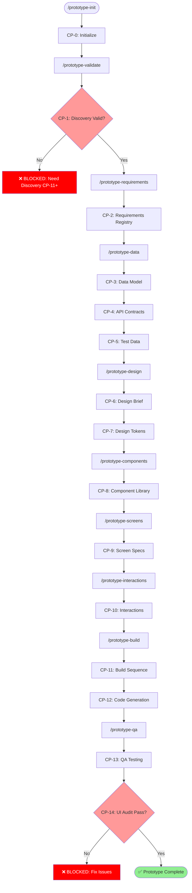

# Prototype Phase Onboarding Manual

**Version**: 2.0.0
**Stage**: 2 of 5 (Prototype)
**Prerequisite**: Completed Discovery Phase (CP-11+)
**Last Updated**: 2026-01-29

---

## Executive Summary

The **Prototype Phase** transforms Discovery outputs into a working React prototype with full design system, component library, and validated screens. This is Stage 2 of the HTEC Framework pipeline.

### Key Capabilities

| Metric | Value |
|--------|-------|
| Total Agents | 14 (1 orchestrator + 5 specifiers + 1 planner + 4 TDD implementers + 5 validators) |
| Checkpoints | 16 (CP-0 through CP-14, includes CP-9.5 Review Gate) |
| Blocking Gates | 3 (CP-1: Discovery Validation, CP-9.5: User Approval, CP-14: UI Audit) |
| Performance | ~54% faster than sequential execution |
| Cost Optimization | ~10% savings via Haiku for TDD testing and validation |
| Model Allocation | 10 Sonnet + 5 Haiku agents |
| TDD Approach | RED-GREEN-REFACTOR cycle with 2 parallel teams |
| Test Coverage | >80% enforced by validation |

### What You'll Produce

```
Prototype_<SystemName>/
├── 00-foundation/          # Design tokens, typography, colors
├── 01-components/          # Complete component library specs
├── 02-screens/             # Screen specifications with wireframes
├── 03-interactions/        # Motion, accessibility, responsive specs
├── 04-implementation/      # Data model, API contracts, test data
├── 05-validation/          # QA reports, UI audit, screenshots
├── 06-change-requests/     # Feedback sessions with root cause analysis
├── prototype/              # Working React + Vite application
└── reports/                # Architecture, traceability matrix
```

---

## Three-Layer Architecture

The Prototype Phase uses the same three-layer architecture as Discovery:

```
┌─────────────────────────────────────────────────────────────────┐
│                        LAYER 1: SKILLS                          │
│                      (Brain / Knowledge)                        │
├─────────────────────────────────────────────────────────────────┤
│  Prototype_Builder      Prototype_Components    Prototype_QA    │
│  Prototype_DataModel    Prototype_Screens       Prototype_UIAudit│
│  Prototype_ApiContracts Prototype_Interactions  ...             │
│                                                                 │
│  📁 .claude/skills/Prototype_*/SKILL.md                         │
│  🎯 Contain the "HOW" - templates, quality rules, examples      │
└─────────────────────────────────────────────────────────────────┘
                              │
                              ▼
┌─────────────────────────────────────────────────────────────────┐
│                      LAYER 2: COMMANDS                          │
│                    (Manual Mode Triggers)                       │
├─────────────────────────────────────────────────────────────────┤
│  /prototype              /prototype-components   /prototype-qa  │
│  /prototype-init         /prototype-screens      /prototype-export│
│  /prototype-validate     /prototype-build        /prototype-reset│
│  /prototype-requirements /prototype-interactions                │
│  /prototype-data         /prototype-design       /prototype-feedback│
│                                                                 │
│  📁 .claude/commands/prototype*.md                              │
│  🎯 User-invoked entry points, orchestrate skills               │
└─────────────────────────────────────────────────────────────────┘
                              │
                              ▼
┌─────────────────────────────────────────────────────────────────┐
│                       LAYER 3: AGENTS                           │
│                    (Autonomous Executors)                       │
├─────────────────────────────────────────────────────────────────┤
│  prototype-orchestrator           prototype-component-validator │
│  prototype-data-model-specifier   prototype-screen-validator    │
│  prototype-api-contract-specifier prototype-ux-validator        │
│  prototype-design-token-generator prototype-accessibility-auditor│
│  prototype-component-specifier    prototype-visual-qa-tester    │
│  prototype-screen-specifier       prototype-planner (NEW)       │
│  prototype-developer-1 (NEW)      prototype-tester-1 (NEW)      │
│  prototype-developer-2 (NEW)      prototype-tester-2 (NEW)      │
│                                                                 │
│  📁 .claude/agents/prototype-*.md                               │
│  🎯 Task tool targets, parallel execution, TDD implementation    │
└─────────────────────────────────────────────────────────────────┘
```

### Layer Interaction

```
User Request: "/prototype InventorySystem"
       │
       ▼
┌──────────────────┐     ┌──────────────────┐     ┌──────────────────┐
│    COMMAND       │────▶│     SKILL        │────▶│     AGENT        │
│  prototype.md    │     │ Prototype_Builder│     │ prototype-       │
│                  │     │                  │     │ orchestrator     │
│ Entry point,     │     │ Templates,       │     │                  │
│ argument parsing │     │ quality rules    │     │ Spawns child     │
└──────────────────┘     └──────────────────┘     │ agents via Task()│
                                                  └──────────────────┘
                                                          │
                              ┌────────────────┬──────────┴──────────┬────────────────┐
                              ▼                ▼                     ▼                ▼
                    ┌─────────────────┐ ┌─────────────────┐ ┌─────────────────┐ ┌─────────────────┐
                    │ data-model-     │ │ design-token-   │ │ component-      │ │ screen-         │
                    │ specifier       │ │ generator       │ │ specifier       │ │ specifier       │
                    └─────────────────┘ └─────────────────┘ └─────────────────┘ └─────────────────┘
```

---

## Visual Workflow

### Manual Mode (Sequential)



### Multi-Agent Mode (Parallel)

```mermaid
---
config:
  theme: neo-dark
  layout: dagre
---
flowchart LR
 subgraph SEQ1["Sequential: Data & Design"]
        API["api-contract-specifier"]
        DM["data-model-specifier"]
        TD["Test Data Generation"]
        DTG["design-token-generator"]
  end
 subgraph PAR1["CP-9: Per-Screen Parallelism"]
        SS1["screen-specifier<br>Dashboard"]
        SS2["screen-specifier<br>Inventory List"]
        SS3["screen-specifier<br>Settings"]
        SS4["screen-specifier<br>..."]
  end
 subgraph PAR2["CP-13: Parallel Validators"]
        CV["component-validator"]
        SV["screen-validator"]
        UV["ux-validator"]
        AA["accessibility-auditor"]
  end
    START(["/prototype InventorySystem"]) --> ORCH["prototype-orchestrator"]
    ORCH --> CP0["CP-0: Initialize"]
    CP0 --> CP1{"CP-1: Discovery Validation"}
    CP1 -- Fail --> BLOCK1["❌ BLOCKED"]
    CP1 -- Pass --> CP2["CP-2: Requirements"]
    CP2 --> SEQ1
    DM --> API
    API --> TD
    TD --> DTG
    SEQ1 --> CS["component-specifier"]
    CS --> PAR1
    PAR1 --> INT["Interactions Spec"]
    INT --> BUILD["Build & Code Gen"]
    BUILD --> PAR2
    PAR2 --> VQA["visual-qa-tester"]
    VQA --> CP14{"CP-14: Final Audit"}
    CP14 -- Fail --> BLOCK2["❌ Fix & Retry"]
    CP14 -- Pass --> DONE(["✅ Complete"])

    style ORCH fill:#4169E1,color:#fff
    style CP1 fill:#757575
    style PAR1 fill:#E6F3FF
    style PAR2 fill:#E6F3FF
    style CP14 fill:#757575
```



---

## Checkpoint Reference

### Checkpoint Overview

| CP | Name | Blocking | Agents | Key Outputs |
|----|------|----------|--------|-------------|
| 0 | Initialize | No | - | Folder structure, config files |
| 1 | Discovery Validation | **YES** | - | `discovery_summary.json` |
| 2 | Requirements | No | - | `requirements_registry.json` |
| 3 | Data Model | No | data-model-specifier | `data-model.md` |
| 4 | API Contracts | No | api-contract-specifier | `api-contracts.json` |
| 5 | Test Data | No | - | `test-data/*.json` |
| 6 | Design Brief | No | design-token-generator | `design-brief.md` |
| 7 | Design Tokens | No | design-token-generator | `design-tokens.json` |
| 8 | Components | No | component-specifier | `01-components/**/*.md` |
| 9 | Screens | No | screen-specifier (parallel) | `02-screens/**/*.md` |
| 10 | Interactions | No | - | `03-interactions/*.md` |
| 11 | Build Sequence | No | - | `build-sequence.md` |
| 12 | Code Generation | No | - | `prototype/src/**/*` |
| 13 | QA Testing | No | 4 validators (parallel) | `05-validation/*.md` |
| 14 | UI Audit | **YES** | visual-qa-tester | `ui-audit-report.md` |

### CP-1: Discovery Validation (BLOCKING)

**Purpose**: Ensure Discovery outputs are complete before starting prototype.

**Validation Checks**:
- Discovery checkpoint >= 11
- Required files exist:
  - `ClientAnalysis_*/01-personas/`
  - `ClientAnalysis_*/02-jtbd/`
  - `ClientAnalysis_*/03-strategy/`
  - `ClientAnalysis_*/04-design-specs/`

**If Blocked**:
```bash
# Complete Discovery first
/discovery-resume <SystemName>

# Verify checkpoint
python3 .claude/hooks/discovery_quality_gates.py --validate-checkpoint 11
```

### CP-14: UI Audit (BLOCKING)

**Purpose**: Final quality gate ensuring prototype meets all requirements.

**Validation Checks**:
- Screen coverage == 100%
- All screens have React code
- WCAG AA compliance
- No critical visual regressions

**If Blocked**:
```bash
# Review audit report
cat Prototype_<SystemName>/05-validation/ui-audit-report.md

# Fix issues and re-run
/prototype-qa <SystemName>
```

---

## Command Reference

### Main Commands

| Command | Description | Usage |
|---------|-------------|-------|
| `/prototype` | Complete end-to-end prototype | `/prototype InventorySystem` |
| `/prototype-resume` | Resume from checkpoint | `/prototype-resume` |
| `/prototype-status` | Show current progress | `/prototype-status --verbose` |

### Phase Commands

| Command | Phases | Description |
|---------|--------|-------------|
| `/prototype-init` | 0 | Initialize folders and state |
| `/prototype-validate` | 1 | Validate Discovery completeness |
| `/prototype-requirements` | 2 | Extract hierarchical requirements |
| `/prototype-data` | 3-5 | Data model, API contracts, test data |
| `/prototype-design` | 6-7 | Design brief and tokens |
| `/prototype-components` | 8 | Component library specs |
| `/prototype-screens` | 9 | Screen specifications |
| `/prototype-interactions` | 10 | Motion, accessibility, responsive |
| `/prototype-build` | 11-12 | Build sequence and code generation |
| `/prototype-qa` | 13-14 | QA testing and UI audit |

### Utility Commands

| Command | Description | Usage |
|---------|-------------|-------|
| `/prototype-feedback` | Process change requests | `/prototype-feedback "Button colors wrong"` |
| `/prototype-reset` | Reset progress | `/prototype-reset --soft` |
| `/prototype-export` | Export package | `/prototype-export --format full` |
| `/presentation-slidev` | Generate presentation | Interactive configuration |

### Command Examples

```bash
# Full prototype generation (multi-agent)
/prototype InventorySystem

# Resume from last checkpoint
/prototype-resume

# Check status
/prototype-status --verbose

# Run specific phases
/prototype-init InventorySystem
/prototype-validate InventorySystem
/prototype-data InventorySystem
/prototype-build InventorySystem

# Process feedback
/prototype-feedback "The dashboard stats show undefined values"
/prototype-feedback ./client_feedback.md
/prototype-feedback resume CR-003

# Reset options
/prototype-reset InventorySystem --soft     # Keep outputs, reset progress
/prototype-reset InventorySystem --hard     # Delete everything
/prototype-reset InventorySystem --phase 8  # Reset specific phase

# Export
/prototype-export InventorySystem --format full
/prototype-export InventorySystem --format code --output ~/Deliverables/
```

---

## Agent Specifications

### Agent Overview

```
┌─────────────────────────────────────────────────────────────────────────┐
│                         PROTOTYPE AGENTS (11)                          │
├────────────────────────────────────────────────────────────────────────┤
│                                                                        │
│  ORCHESTRATION (1)                                                     │
│  └── prototype-orchestrator (Sonnet) - Master coordinator              │
│                                                                        │
│  SPECIFICATION (5)                                                     │
│  ├── prototype-data-model-specifier (Sonnet) - CP-3                   │
│  ├── prototype-api-contract-specifier (Sonnet) - CP-4                 │
│  ├── prototype-design-token-generator (Sonnet) - CP-6/7               │
│  ├── prototype-component-specifier (Sonnet) - CP-8                    │
│  └── prototype-screen-specifier (Sonnet) - CP-9, per-screen parallel  │
│                                                                        │
│  VALIDATION (5)                                                        │
│  ├── prototype-component-validator (Haiku) - CP-13, parallel          │
│  ├── prototype-screen-validator (Haiku) - CP-13, parallel             │
│  ├── prototype-ux-validator (Haiku) - CP-13, parallel                 │
│  ├── prototype-accessibility-auditor (Sonnet) - CP-13, parallel       │
│  └── prototype-visual-qa-tester (Sonnet) - CP-14, final               │
│                                                                        │
└─────────────────────────────────────────────────────────────────────────┘
```

### Model Allocation

| Model | Count | Agents | Rationale |
|-------|-------|--------|-----------|
| **Sonnet** | 7 | orchestrator, data-model-specifier, api-contract-specifier, design-token-generator, component-specifier, screen-specifier, accessibility-auditor, visual-qa-tester | Complex design decisions, code generation |
| **Haiku** | 3 | component-validator, screen-validator, ux-validator | Pattern-based validation checks |

### Agent Details

#### prototype-orchestrator
- **Model**: Sonnet
- **Checkpoint**: All
- **Capabilities**: Phase orchestration, agent dispatch, parallel coordination, state management, quality gates, code generation
- **Invokes**: All other prototype agents

#### prototype-data-model-specifier
- **Model**: Sonnet
- **Checkpoint**: 3
- **Input**: `ClientAnalysis_*/04-design-specs/data-fields.md`
- **Output**: `04-implementation/data-model.md`
- **Capabilities**: Entity extraction, relationship mapping, type definition, validation rules

#### prototype-api-contract-specifier
- **Model**: Sonnet
- **Checkpoint**: 4
- **Depends On**: data-model-specifier
- **Output**: `04-implementation/api-contracts.json`
- **Capabilities**: Endpoint definition, request/response schemas, OpenAPI generation, mock data creation

#### prototype-design-token-generator
- **Model**: Sonnet
- **Checkpoint**: 6-7
- **Outputs**: `00-foundation/design-tokens.json`, `color-system.md`, `typography.md`, `spacing-layout.md`
- **Capabilities**: Color system generation, typography scale, spacing system, token export

#### prototype-component-specifier
- **Model**: Sonnet
- **Checkpoint**: 8
- **Depends On**: design-token-generator
- **Outputs**: `01-components/**/*.md`
- **Capabilities**: Component identification, prop definition, variant specification, accessibility requirements

#### prototype-screen-specifier
- **Model**: Sonnet
- **Checkpoint**: 9
- **Parallel**: Per-screen (one agent per Discovery screen)
- **Depends On**: component-specifier
- **Outputs**: `02-screens/[screen-name]/*.md`
- **Capabilities**: Layout specification, component mapping, state management, user flow definition

#### prototype-component-validator
- **Model**: Haiku
- **Checkpoint**: 13 (parallel group)
- **Output**: `05-validation/component-validation.md`
- **Capabilities**: Spec completeness check, prop type validation, variant coverage, token reference check

#### prototype-screen-validator
- **Model**: Haiku
- **Checkpoint**: 13 (parallel group)
- **Output**: `05-validation/screen-validation.md`
- **Capabilities**: Screen coverage check, component usage validation, data flow verification, traceability check

#### prototype-ux-validator
- **Model**: Haiku
- **Checkpoint**: 13 (parallel group)
- **Output**: `05-validation/ux-validation.md`
- **Capabilities**: Pattern consistency check, navigation flow validation, interaction pattern review, error state coverage

#### prototype-accessibility-auditor
- **Model**: Sonnet
- **Checkpoint**: 13 (parallel group)
- **Output**: `05-validation/accessibility-report.md`
- **Capabilities**: WCAG compliance check, ARIA validation, keyboard navigation review, color contrast check

#### prototype-visual-qa-tester
- **Model**: Sonnet
- **Checkpoint**: 14 (final, blocking)
- **Depends On**: All CP-13 validators
- **Outputs**: `05-validation/ui-audit-report.md`, `screenshots/`
- **Capabilities**: Screenshot capture, visual comparison, responsive testing, final QA report

---

## Parallel Execution Groups

### CP-9: Per-Screen Parallelism

```
Discovery Screens (S-1.1, S-1.2, S-2.1, ...)
            │
            ▼
    ┌───────┴───────┬───────────┬───────────┐
    ▼               ▼           ▼           ▼
┌─────────┐   ┌─────────┐  ┌─────────┐  ┌─────────┐
│screen-  │   │screen-  │  │screen-  │  │screen-  │
│specifier│   │specifier│  │specifier│  │specifier│
│Dashboard│   │List View│  │Settings │  │...      │
└─────────┘   └─────────┘  └─────────┘  └─────────┘
    │               │           │           │
    └───────────────┴───────────┴───────────┘
                    │
                    ▼
            02-screens/ complete
```

**Speedup**: Linear with screen count (5 screens = ~5x faster for CP-9)

### CP-13: Validation Parallelism

```
Code Generation Complete (CP-12)
            │
            ▼
    ┌───────┴───────┬───────────┬───────────┐
    ▼               ▼           ▼           ▼
┌─────────┐   ┌─────────┐  ┌─────────┐  ┌─────────┐
│component│   │screen-  │  │ux-      │  │a11y-    │
│validator│   │validator│  │validator│  │auditor  │
│(Haiku)  │   │(Haiku)  │  │(Haiku)  │  │(Sonnet) │
└─────────┘   └─────────┘  └─────────┘  └─────────┘
    │               │           │           │
    └───────────────┴───────────┴───────────┘
                    │
            All must pass
                    │
                    ▼
            ┌─────────────┐
            │visual-qa-   │
            │tester       │
            │(Sonnet)     │
            └─────────────┘
                    │
                    ▼
            CP-14: UI Audit
```

**Speedup**: ~4x faster for validation phase

---

## State Management

### State File Locations

> **IMPORTANT**: All state files are stored at **ROOT level** `_state/` folder, NOT inside `Prototype_<SystemName>/`.

```
project_root/
├── _state/                              # SHARED state (ROOT)
│   ├── prototype_config.json           # Prototype configuration
│   ├── prototype_progress.json         # Progress tracking
│   ├── discovery_summary.json          # From Discovery (input)
│   ├── requirements_registry.json      # Requirements mapping
│   └── FAILURES_LOG.md                 # Error tracking
├── traceability/                        # SHARED traceability (ROOT)
│   └── prototype_traceability_register.json
└── Prototype_<SystemName>/              # Outputs only
    ├── 00-foundation/
    ├── 01-components/
    └── ...
```

### prototype_config.json

```json
{
  "schema_version": "1.0.0",
  "system_name": "InventorySystem",
  "created_at": "2026-01-27",
  "discovery_source": "ClientAnalysis_InventorySystem/",
  "output_path": "Prototype_InventorySystem/",
  "framework": "react",
  "styling": "tailwind"
}
```

### prototype_progress.json

```json
{
  "schema_version": "2.3",
  "current_phase": 8,
  "current_checkpoint": 8,
  "phases": {
    "initialize": {
      "status": "completed",
      "started_at": "2026-01-27T10:00:00Z",
      "completed_at": "2026-01-27T10:00:15Z"
    },
    "validate_discovery": {
      "status": "completed",
      "blocking": true,
      "validation_passed": true
    },
    "extract_requirements": {
      "status": "completed"
    },
    "data_model": {
      "status": "completed",
      "agent": "prototype-data-model-specifier"
    },
    "api_contracts": {
      "status": "completed",
      "agent": "prototype-api-contract-specifier"
    },
    "test_data": {
      "status": "completed"
    },
    "design_brief": {
      "status": "completed"
    },
    "design_tokens": {
      "status": "completed",
      "agent": "prototype-design-token-generator"
    },
    "components": {
      "status": "in_progress",
      "agent": "prototype-component-specifier"
    },
    "screens": {
      "status": "pending"
    },
    "interactions": {
      "status": "pending"
    },
    "build_sequence": {
      "status": "pending"
    },
    "code_generation": {
      "status": "pending"
    },
    "qa_testing": {
      "status": "pending"
    },
    "ui_audit": {
      "status": "pending",
      "blocking": true
    }
  },
  "validation_history": []
}
```

---

## Traceability System

### Traceability Chain

```
Discovery                      Prototype
─────────                      ─────────
PP-1.1 (Pain Point)    →    REQ-001 (Requirement)
JTBD-1.1 (Job)         →    US-001 (User Story)
S-1.1 (Screen)         →    SCR-001 (Screen Spec)
                       →    COMP-001 (Component)
                       →    prototype/src/pages/*
```

### ID Formats

| ID Format | Artifact | Example |
|-----------|----------|---------|
| `REQ-NNN` | Requirement | REQ-001, REQ-015 |
| `US-NNN` | User Story | US-001, US-012 |
| `SCR-NNN` | Screen Spec | SCR-001, SCR-003 |
| `COMP-NNN` | Component | COMP-001, COMP-042 |

### Traceability Files

- `traceability/prototype_traceability_register.json` - Master registry
- `_state/requirements_registry.json` - Requirements mapping
- `reports/TRACEABILITY_MATRIX.md` - Human-readable matrix

---

## Quality Gates

### Validation Commands

```bash
# List all checkpoints
python3 .claude/hooks/prototype_quality_gates.py --list-checkpoints

# Validate specific checkpoint
python3 .claude/hooks/prototype_quality_gates.py --validate-checkpoint 8 \
  --dir Prototype_InventorySystem/

# Validate single file
python3 .claude/hooks/prototype_quality_gates.py --validate-file \
  Prototype_InventorySystem/04-implementation/api-contracts.json

# Validate traceability
python3 .claude/hooks/prototype_quality_gates.py --validate-traceability \
  --dir Prototype_InventorySystem/
```

### Error Handling Rule

**Global Rule**: `ERROR → SKIP → CONTINUE → NEVER RETRY`

| Error | Action |
|-------|--------|
| File read failure | Log `⛔ SKIPPED`, continue |
| Checkpoint fails | Block until fixed |
| Code generation fails | Log, provide manual steps |
| npm build fails | Log in QA report |

**BANNED Actions**:
- ❌ `pip install` anything
- ❌ Retry failed operations
- ❌ Ask user what to do on error
- ❌ Wait for input after error

---

## Skills Matrix

### Specification Skills

| Skill | Purpose | Agent |
|-------|---------|-------|
| `Prototype_Builder` | Main orchestration | orchestrator |
| `Prototype_DataModel` | Entity schemas | data-model-specifier |
| `Prototype_ApiContracts` | OpenAPI generation | api-contract-specifier |
| `Prototype_TestData` | Mock data generation | api-contract-specifier |
| `Prototype_DesignBrief` | Visual direction | design-token-generator |
| `Prototype_DesignTokens` | Token system | design-token-generator |
| `Prototype_Components` | Component library | component-specifier |
| `Prototype_Decomposition` | Component analysis | component-specifier |
| `Prototype_Screens` | Screen layout | screen-specifier |
| `Prototype_Interactions` | Motion/a11y | screen-specifier |

### Validation Skills

| Skill | Purpose | Agent |
|-------|---------|-------|
| `Prototype_QA` | Quality checks | component/screen/ux validators |
| `Prototype_UIAudit` | Visual regression | visual-qa-tester |

### Psychology Skills (UX Enhancement)

| Skill | Applied In |
|-------|------------|
| `cognitive-load` | component-specifier |
| `hicks-law` | component-specifier |
| `progressive-disclosure` | screen-specifier |
| `visual-cues-cta-psychology` | screen-specifier |
| `cognitive-fluency-psychology` | screen-specifier |
| `cognitive-biases` | ux-validator |
| `status-quo-bias` | ux-validator |
| `loss-aversion-psychology` | ux-validator |

---

## Directory Structure (Complete)

```
Prototype_<SystemName>/
├── _state/                           # NOTE: Moved to ROOT level
├── 00-foundation/
│   ├── design-brief.md               # Visual direction and principles
│   ├── design-principles.md          # Core design principles
│   ├── design-tokens.json            # Token system (JSON)
│   ├── color-system.md               # Color palette documentation
│   ├── typography.md                 # Typography scale
│   └── spacing-layout.md             # Spacing and grid system
│
├── 01-components/
│   ├── component-index.md            # Master component list
│   ├── primitives/
│   │   ├── button.md
│   │   ├── input.md
│   │   ├── select.md
│   │   ├── checkbox.md
│   │   └── ...
│   ├── data-display/
│   │   ├── table.md
│   │   ├── card.md
│   │   ├── list.md
│   │   └── ...
│   ├── feedback/
│   │   ├── alert.md
│   │   ├── toast.md
│   │   ├── progress.md
│   │   └── ...
│   ├── navigation/
│   │   ├── sidebar.md
│   │   ├── header.md
│   │   ├── tabs.md
│   │   └── ...
│   ├── overlays/
│   │   ├── modal.md
│   │   ├── drawer.md
│   │   ├── dropdown.md
│   │   └── ...
│   └── patterns/
│       ├── form.md
│       ├── search.md
│       ├── data-table.md
│       └── ...
│
├── 02-screens/
│   ├── screen-index.md               # Screen inventory
│   ├── dashboard/
│   │   ├── layout.md
│   │   ├── components.md
│   │   ├── data-requirements.md
│   │   └── interactions.md
│   ├── inventory-list/
│   │   └── ...
│   └── [screen-name]/
│       └── ...
│
├── 03-interactions/
│   ├── motion-system.md              # Animations, transitions
│   ├── accessibility-spec.md         # WCAG AA requirements
│   └── responsive-behavior.md        # Breakpoints, adaptation
│
├── 04-implementation/
│   ├── data-model.md                 # Entity schemas
│   ├── api-contracts.json            # OpenAPI specification
│   ├── build-sequence.md             # Build order (DAG)
│   └── test-data/
│       ├── catalog.json
│       ├── core.json
│       └── transactional.json
│
├── 05-validation/
│   ├── component-validation.md
│   ├── screen-validation.md
│   ├── ux-validation.md
│   ├── accessibility-report.md
│   ├── qa-report.md
│   ├── ui-audit-report.md
│   └── screenshots/
│       ├── dashboard_desktop.png
│       ├── dashboard_tablet.png
│       ├── dashboard_mobile.png
│       └── ...
│
├── 06-change-requests/
│   └── <YYYY-MM-DD>_CR_<NNN>/
│       ├── FEEDBACK_ORIGINAL.md
│       ├── IMPACT_ANALYSIS.md
│       ├── ROOT_CAUSE_ANALYSIS.md
│       ├── IMPLEMENTATION_PLAN.md
│       ├── IMPLEMENTATION_LOG.md
│       ├── VALIDATION_REPORT.md
│       └── CR_SUMMARY.md
│
├── prototype/                        # Working React application
│   ├── package.json
│   ├── vite.config.ts
│   ├── tsconfig.json
│   ├── tailwind.config.js
│   ├── public/
│   └── src/
│       ├── main.tsx
│       ├── App.tsx
│       ├── components/
│       │   ├── primitives/
│       │   ├── data-display/
│       │   └── ...
│       ├── pages/
│       │   ├── Dashboard.tsx
│       │   └── ...
│       ├── hooks/
│       ├── services/
│       ├── types/
│       └── styles/
│
└── reports/
    ├── ARCHITECTURE.md               # Technical architecture summary
    ├── README.md                     # Project documentation
    └── TRACEABILITY_MATRIX.md        # Full traceability
```

---

## Getting Started

### 🚀 Framework Initialization (REQUIRED)

**⚠️ IMPORTANT**: If this is your first time using the HTEC framework, **complete framework initialization first**:

📖 **Read**: `.claude/architecture/Workflows/FRAMEWORK_ONBOARDING.md`

**Quick setup**:
```bash
# Step 1: Install dependencies
/htec-libraries-init

# Step 2: Initialize project metadata
/project-init

# Step 3: Verify
python3 .claude/hooks/validate_session.py
# Expected: ✅ Session validation passed
```

---

### Prerequisites

1. **Framework Initialized**:
   ```bash
   # Verify session is valid (not "pending" or "system")
   cat _state/session.json | jq '.project, .user'
   # Should show: "InventorySystem", "your-username"
   ```

2. **Complete Discovery Phase**:
   ```bash
   # Verify Discovery is complete (CP-11+)
   python3 .claude/hooks/discovery_quality_gates.py --validate-checkpoint 11 \
     --dir ClientAnalysis_InventorySystem/
   ```

3. **Dependencies Installed**:
   ```bash
   # Already done via /htec-libraries-init above
   # Verify: ls .venv/lib/python*/site-packages/pypdfium2
   ```

### Quick Start

```bash
# Option 1: Full automated prototype (recommended)
/prototype InventorySystem

# Option 2: Step-by-step manual execution
/prototype-init InventorySystem
/prototype-validate InventorySystem
/prototype-requirements InventorySystem
/prototype-data InventorySystem
/prototype-design InventorySystem
/prototype-components InventorySystem
/prototype-screens InventorySystem
/prototype-interactions InventorySystem
/prototype-build InventorySystem
/prototype-qa InventorySystem
```

### Running the Prototype

```bash
# Navigate to prototype folder
cd Prototype_InventorySystem/prototype

# Install dependencies
npm install

# Start development server
npm run dev

# Build for production
npm run build
```

### Common Issues

#### "Discovery validation failed"
```bash
# Check what's missing
/prototype-validate InventorySystem --verbose

# Complete Discovery first
/discovery-resume InventorySystem
```

#### "Component X not found"
```bash
# Regenerate components
/prototype-reset InventorySystem --phase 8
/prototype-components InventorySystem
```

#### "Build failed"
```bash
# Check build errors
cd Prototype_InventorySystem/prototype
npm run build 2>&1 | tee build_errors.log

# Review and fix, then re-run QA
/prototype-qa InventorySystem
```

---

## Change Request Workflow

The `/prototype-feedback` command provides systematic debugging:

```
┌─────────────────────────────────────────────────────────────────┐
│                    FEEDBACK WORKFLOW                            │
├─────────────────────────────────────────────────────────────────┤
│                                                                 │
│  1. INPUT COLLECTION                                            │
│     └── Receive feedback (text, file, or resume)               │
│                                                                 │
│  2. IMPACT ANALYSIS                                             │
│     └── Identify affected files and components                  │
│                                                                 │
│  3. ROOT CAUSE ANALYSIS  ⚠️ NO FIXES WITHOUT ROOT CAUSE        │
│     └── Determine why the issue occurred                        │
│                                                                 │
│  4. APPROVAL GATE                                               │
│     └── User approves or rejects proposed approach              │
│                                                                 │
│  5. IMPLEMENTATION PLANNING                                     │
│     └── Generate fix options                                    │
│                                                                 │
│  6. IMPLEMENTATION                                              │
│     └── Execute changes                                         │
│                                                                 │
│  7. VALIDATION                                                  │
│     └── Verify fix resolves issue                              │
│                                                                 │
│  8. CLOSURE                                                     │
│     └── Update registry, document learnings                     │
│                                                                 │
└─────────────────────────────────────────────────────────────────┘
```

### Example Usage

```bash
# Direct text feedback
/prototype-feedback "The stat cards show undefined values"

# File-based feedback
/prototype-feedback ./client_feedback.md

# Resume previous CR
/prototype-feedback resume CR-003
```

### Output Structure

```
06-change-requests/2026-01-27_CR_001/
├── FEEDBACK_ORIGINAL.md      # Original feedback
├── IMPACT_ANALYSIS.md        # Files affected
├── ROOT_CAUSE_ANALYSIS.md    # Why it happened
├── IMPLEMENTATION_PLAN.md    # How to fix
├── IMPLEMENTATION_LOG.md     # What was changed
├── VALIDATION_REPORT.md      # Verification results
└── CR_SUMMARY.md             # Final summary
```

---

## Performance Characteristics

### Time Estimates (10-screen project)

| Mode | Sequential | Multi-Agent | Speedup |
|------|------------|-------------|---------|
| CP-0 to CP-7 | 25 min | 20 min | ~20% |
| CP-8 (Components) | 15 min | 12 min | ~20% |
| CP-9 (Screens) | 50 min | 10 min | **~80%** |
| CP-10 to CP-12 | 30 min | 25 min | ~17% |
| CP-13 (Validation) | 20 min | 5 min | **~75%** |
| CP-14 (UI Audit) | 10 min | 10 min | 0% |
| **Total** | **150 min** | **82 min** | **~45%** |

### Cost Optimization

| Agent Type | Model | Cost Factor |
|------------|-------|-------------|
| Specifiers | Sonnet | 1.0x |
| Validators | Haiku | 0.1x |
| QA Testers | Sonnet | 1.0x |

**Estimated Savings**: ~20% from using Haiku for validation tasks

---

## Assembly-First Mode

When `_state/assembly_config.json` exists with a valid component library, the prototype uses Assembly-First mode:

### Benefits
- ~7x token savings on component generation
- Consistent component usage across screens
- Pre-validated accessibility compliance

### Detection
```bash
# Check if Assembly-First is active
cat _state/assembly_config.json
```

### Configuration
```json
{
  "mode": "assembly_first",
  "component_library": "shadcn",
  "component_path": "node_modules/@shadcn/ui"
}
```

---

## Hooks Reference

### Quality Gate Hook

```bash
# File: .claude/hooks/prototype_quality_gates.py

# Usage
python3 .claude/hooks/prototype_quality_gates.py --help

# List checkpoints
python3 .claude/hooks/prototype_quality_gates.py --list-checkpoints

# Validate checkpoint
python3 .claude/hooks/prototype_quality_gates.py \
  --validate-checkpoint 8 \
  --dir Prototype_InventorySystem/

# Validate file
python3 .claude/hooks/prototype_quality_gates.py \
  --validate-file Prototype_InventorySystem/04-implementation/api-contracts.json

# Validate traceability
python3 .claude/hooks/prototype_quality_gates.py \
  --validate-traceability \
  --dir Prototype_InventorySystem/
```

---

## Related Documentation

| Document | Location |
|----------|----------|
| Multi-Agent Architecture | `.claude/architecture/Workflows/Idea Shaping and Validation Phase/Multi_Agent_Prototype_Architecture.md` |
| Agentic Workflow | `.claude/architecture/Workflows/Idea Shaping and Validation Phase/Prototype_Phase_Agentic_Workflow.md` |
| Agent Registry | `.claude/skills/PROTOTYPE_AGENT_REGISTRY.json` |
| Command Reference | `.claude/commands/PROTOTYPE_COMMAND_REFERENCE.md` |
| Main Command | `.claude/commands/prototype.md` |
| Builder Skill | `.claude/skills/Prototype_Builder/SKILL.md` |
| Quality Gates | `architecture/Quality_Gates_Reference.md` |
| Traceability | `architecture/Traceability_System.md` |

---

## Appendix: Quick Reference Card

### Commands
```
/prototype <SystemName>          # Full run
/prototype-resume               # Continue
/prototype-status               # Check progress
/prototype-feedback "text"      # Bug report
/prototype-reset --soft         # Reset progress
```

### Checkpoints
```
CP-1  ❌ BLOCKING: Discovery validation
CP-14 ❌ BLOCKING: UI audit
```

### Agents (11)
```
Orchestration: prototype-orchestrator
Specifiers:    data-model, api-contract, design-token, component, screen
Validators:    component, screen, ux (Haiku); a11y, visual-qa (Sonnet)
```

### State Files (ROOT level)
```
_state/prototype_config.json
_state/prototype_progress.json
_state/requirements_registry.json
```

### Quality Check
```bash
python3 .claude/hooks/prototype_quality_gates.py --validate-checkpoint N
```

---

*End of Prototype Phase Onboarding Manual*
