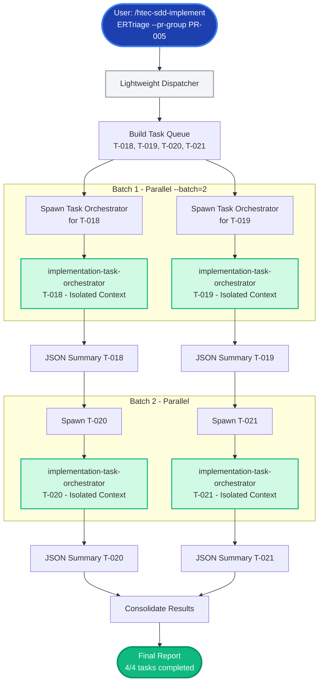
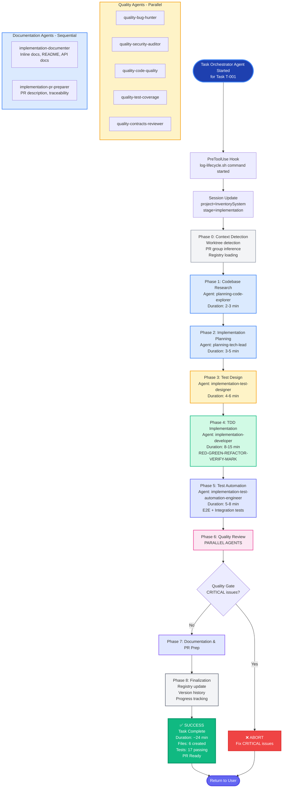

# Task Execution Flow - Detailed Technical Specification

**Version**: 2.1.0 (Task Isolation Mode)
**Last Updated**: 2026-01-30
**Audience**: Developers, Technical Leads, System Architects
**Purpose**: Complete transparency into the 8-phase orchestration model of `/htec-sdd-implement`

---

## Table of Contents

1. [Overview](#overview)
2. [Philosophy Change](#philosophy-change)
3. [Command Invocation](#command-invocation)
4. [Phase-by-Phase Breakdown](#phase-by-phase-breakdown)
5. [Agent Coordination](#agent-coordination)
6. [State Management](#state-management)
7. [Failure Handling](#failure-handling)
8. [Visual Execution Flow](#visual-execution-flow)

---

## Overview

When you execute:
```bash
/htec-sdd-implement InventorySystem --task T-001
```

The `/htec-sdd-implement` command orchestrates **8 phases** with **13 specialized agents**:

| Phase | Duration | Activities | Agents | Blocking |
|-------|----------|------------|--------|----------|
| **0. Context Detection** | <1s | Worktree detection, PR group inference | None | No |
| **1. Codebase Research** | 2-3min | Pattern analysis, conventions | planning-code-explorer | No |
| **2. Implementation Planning** | 3-5min | Detailed plan generation | planning-tech-lead | Yes (plan required) |
| **3. Test Design** | 4-6min | BDD scenarios, TDD specs | implementation-test-designer | No |
| **4. TDD Implementation** | 8-15min | RED-GREEN-REFACTOR cycle | implementation-developer | No |
| **5. Test Automation** | 5-8min | E2E, integration, Playwright | implementation-test-automation-engineer | No |
| **6. Quality Review** | 3-5min | Multi-perspective review | 6 quality agents (parallel) | Yes (CRITICAL) |
| **7. Documentation & PR Prep** | 3-5min | Docs, PR description | documenter, pr-preparer | No |
| **8. Finalization** | <10s | Registry update, traceability | None | No |

**Total Duration**: 23-47 minutes per task (varies by complexity, with 13 agents)

---

## Philosophy Change

### V1.0.0 (Old): Narrow Execution
- **Focus**: TDD implementation only
- **Agents**: 1 (implementation-developer)
- **Phases**: 5 (PLAN-RED-GREEN-REFACTOR-VERIFY-MARK)
- **Quality**: Separate `/htec-sdd-review` command
- **Documentation**: Manual
- **PR Prep**: Manual

### V2.0.0 (New): Comprehensive Orchestration
- **Focus**: Complete end-to-end implementation workflow
- **Agents**: 13 (research, planning, testing, coding, review, docs, PR prep)
- **Phases**: 8 (Context → Research → Plan → Test Design → TDD → Automation → Review → Docs/PR)
- **Quality**: Built-in (Phase 6, 6 parallel agents including accessibility)
- **Documentation**: Automated (Phase 7)
- **PR Prep**: Automated (Phase 7)

**Key Insight**: "Narrow" refers to **scope** (single task/PR), not **process depth**. Each task receives comprehensive treatment.

---

## Command Invocation

### User Action
```bash
cd /path/to/project
/htec-sdd-implement InventorySystem --task T-001
```

### Claude Code Processing

1. **Command Parsing**
   - Extract: `SystemName="InventorySystem"`, `--task="T-001"`
   - Load skill: `.claude/commands/htec-sdd-implement.md`

2. **Hook Execution (PreToolUse)**
   ```bash
   .claude/hooks/log-lifecycle.sh command /htec-sdd-implement started '{"stage": "implementation"}'
   ```

3. **Session Update**
   ```bash
   .claude/hooks/session-update.sh --project "InventorySystem" --stage "implementation"
   ```

4. **Instruction Loading**
   - Load comprehensive orchestration instructions
   - Spawn agents sequentially and in parallel as needed

---

## Task Isolation Mode (Default - v2.1+)

**IMPORTANT**: By default (`--isolate-tasks=true`), `/htec-sdd-implement` operates as a **lightweight dispatcher** that spawns isolated `implementation-task-orchestrator` agents for each task. The phases described below run **inside those isolated agents**, not in the main dispatcher session.

### Two-Tier Orchestration Architecture

```
┌─────────────────────────────────────────────────────────────────────┐
│ MAIN DISPATCHER (Lightweight - Low Context Accumulation)            │
│ • Builds task execution queue from --task, --pr-group, or worktree │
│ • Spawns implementation-task-orchestrator agents (up to --batch)   │
│ • Collects compact JSON summaries from each agent                  │
│ • Consolidates and reports final results                           │
│ • Context: ~10K tokens (only summaries)                            │
└─────────────────────────────────────────────────────────────────────┘
                              │
                              │ Task tool invocation per task
                              ▼
┌─────────────────────────────────────────────────────────────────────┐
│ TASK ORCHESTRATOR AGENTS (Isolated - Fresh Context Per Task)        │
│ • Each task runs in isolated agent context                         │
│ • Executes full 8-phase workflow (Phases 1-8 below)                │
│ • Saves results to Implementation_<System>/01-tasks/<T-ID>/results/│
│ • Returns compact JSON summary to parent dispatcher                │
│ • Context: ~100K tokens per task (isolated, no accumulation)       │
└─────────────────────────────────────────────────────────────────────┘
```

### How Task Isolation Dispatch Works

**In Phase 0.5 (Task Isolation Dispatch)**, the main orchestrator:

1. **Creates results directories** for each task:
   ```bash
   mkdir -p "Implementation_${SYSTEM_NAME}/01-tasks/${TASK_ID}/results"
   ```

2. **Spawns isolated agents** using the Task tool with these parameters:
   - `subagent_type`: "general-purpose"
   - `model`: "sonnet"
   - `description`: "Orchestrate implementation for <TASK_ID>"
   - `run_in_background`: true (for parallel execution up to --batch limit)
   - `prompt`: Contains task context and instructs agent to read `.claude/agents/implementation-task-orchestrator.md`

3. **Manages concurrency**: Maintains up to `--batch` concurrent agents (default: 2)

4. **Collects results**: Uses TaskOutput tool to retrieve completion summaries

5. **Consolidates report**: Displays aggregated metrics and exits

**Example with 4 tasks and --batch=2**:
```
Time 0:   Spawn T-018 orchestrator, Spawn T-019 orchestrator
Time T1:  T-018 completes → Spawn T-020 orchestrator
Time T2:  T-019 completes → Spawn T-021 orchestrator
Time T3:  T-020 completes
Time T4:  T-021 completes → Consolidate and report
```

### Legacy Mode (Not Recommended)

To disable task isolation (`--isolate-tasks=false`), the main orchestrator runs all phases directly in its context. This causes context memory rot when processing multiple tasks.

---

## Phase-by-Phase Breakdown

**Note**: These phases execute inside `implementation-task-orchestrator` agents when in Task Isolation Mode (default).

### Phase 0: Context Detection & Registry Loading

**Duration**: 2-3 seconds
**Agents**: None (main orchestrator logic)

**What Happens**:
```bash
# 1. Detect worktree context
WORKTREE_INFO=$(git worktree list | grep "$(pwd)")

if [[ $WORKTREE_INFO =~ worktrees/pr-([0-9]+)- ]]; then
    PR_GROUP="PR-${BASH_REMATCH[1]}"
    echo "✓ Auto-detected PR group: $PR_GROUP"
fi

# 2. Load task registry
task_registry=$(cat traceability/task_registry.json)
impl_config=$(cat _state/implementation_config.json)

# 3. Extract task details
task_spec=$(jq ".tasks[\"T-001\"]" <<< "$task_registry")
module_id=$(jq -r '.module_id' <<< "$task_spec")
acceptance_criteria=$(jq -r '.acceptance_criteria[]' <<< "$task_spec")

# 4. Validate dependencies
dependencies=$(jq -r '.dependencies[]' <<< "$task_spec")
for dep in $dependencies; do
    dep_status=$(jq -r ".tasks[\"$dep\"].status" <<< "$task_registry")
    [[ "$dep_status" != "completed" ]] && echo "⚠️  WARNING: Dependency $dep not completed"
done
```

**Files Read**:
- `traceability/task_registry.json`
- `_state/implementation_config.json`
- `Implementation_InventorySystem/01-tasks/T-001.md`

**Output**:
```
📍 Context: Worktree pr-001-auth
🎯 PR Group: PR-001
📋 Task: T-001 (User Authentication Service)
✓ Dependencies: None
✓ Module: MOD-AUTH-01
```

---

### Phase 1: Codebase Research

**Duration**: 2-3 minutes
**Agent**: `planning-code-explorer` (Sonnet)

**Purpose**: Understand existing codebase patterns before implementation

**Spawning**:
```javascript
const session_id = `sess-${generateRandomId(8)}`;

Task({
  subagent_type: "general-purpose",
  model: "sonnet",
  description: "Analyze codebase patterns",
  prompt: `Agent: planning-code-explorer
Read: .claude/agents/planning-code-explorer.md
SESSION: ${session_id} | TASK: T-001

ANALYZE codebase for:
- Existing patterns in src/features/
- Architecture conventions (layering, naming)
- Similar implementations (e.g., other services)
- Integration points
- Dependency patterns

TARGET TASK: T-001 (User Authentication Service)
WORKING DIR: Implementation_InventorySystem/

Focus on:
- Service layer patterns
- Error handling conventions
- Testing patterns
- Naming conventions

RETURN JSON:
{
  "status": "completed",
  "patterns_found": ["pattern1", "pattern2"],
  "similar_files": ["file1.ts", "file2.ts"],
  "conventions": {...},
  "recommendations": [...]
}
`
})
```

**Agent Activities**:
1. Glob search: `src/features/**/*-service.ts`
2. Read 3-5 similar implementations
3. Extract patterns (class structure, error handling, etc.)
4. Identify naming conventions
5. Return structured analysis

**Files Read** (by agent):
- `src/features/user/services/user-service.ts`
- `src/features/session/services/session-service.ts`
- `tests/unit/user/user-service.test.ts` (test patterns)

**Output**:
```
[Phase 1: Codebase Research]
✓ Agent spawned: planning-code-explorer (sess-a7b2c4d1)
✓ Analyzed 47 files in src/features/
✓ Found 3 similar implementations:
  - src/features/user/services/user-service.ts
  - src/features/session/services/session-service.ts
✓ Patterns identified:
  - Service layer: Class-based with dependency injection
  - Error handling: Custom error classes
  - Testing: Vitest with mocking
✓ Recommendations:
  - Follow existing service structure
  - Use existing error types
  - Match test coverage style
✓ Duration: 2m 15s
```

---

### Phase 2: Implementation Planning

**Duration**: 3-5 minutes
**Agent**: `planning-tech-lead` (Sonnet)

**Purpose**: Generate detailed step-by-step implementation plan

**Spawning**:
```javascript
Task({
  subagent_type: "general-purpose",
  model: "sonnet",
  description: "Generate implementation plan",
  prompt: `Agent: planning-tech-lead
Read: .claude/agents/planning-tech-lead.md
SESSION: ${session_id} | TASK: T-001

TASK SPEC:
${read_file('Implementation_InventorySystem/01-tasks/T-001.md')}

MODULE SPEC:
${read_file('ProductSpecs_InventorySystem/01-modules/MOD-AUTH-01.md')}

CODEBASE RESEARCH:
${JSON.stringify(phase1_results)}

ACCEPTANCE CRITERIA:
${acceptance_criteria}

ADRs:
- ADR-007: Security Architecture

GENERATE detailed implementation plan:
- Step-by-step actions
- Exact file paths
- Dependencies to install (if any)
- Verification commands
- TDD approach

OUTPUT: Implementation_InventorySystem/docs/featureImplementationplans/2026-01-26-T-001-auth-service.md

RETURN JSON:
{
  "status": "completed",
  "plan_file": "...",
  "steps_count": 8,
  "files_to_create": [...],
  "files_to_modify": [...]
}
`
})
```

**Agent Activities**:
1. Read task spec, module spec, ADRs
2. Incorporate codebase research findings
3. Generate 8-10 step plan
4. Specify exact file paths
5. Write plan to featureImplementationplans/

**Files Written** (by agent):
- `Implementation_InventorySystem/docs/featureImplementationplans/2026-01-26-T-001-auth-service.md`

**Output**:
```
[Phase 2: Implementation Planning]
✓ Agent spawned: planning-tech-lead (sess-b8c3d5e2)
✓ Plan generated: featureImplementationplans/2026-01-26-T-001-auth-service.md
✓ Steps: 8
✓ Files to create: 2
  - src/features/auth/services/auth-service.ts
  - tests/unit/auth/auth-service.test.ts
✓ Files to modify: 0
✓ Duration: 3m 42s
```

---

### Phase 3: Test Design

**Duration**: 4-6 minutes
**Agent**: `implementation-test-designer` (Sonnet) **[NEW]**

**Purpose**: Design comprehensive test specifications BEFORE coding

**Spawning**:
```javascript
Task({
  subagent_type: "general-purpose",
  model: "sonnet",
  description: "Design test specifications",
  prompt: `Agent: implementation-test-designer
Read: .claude/agents/implementation-test-designer.md
SESSION: ${session_id} | TASK: T-001

TASK SPEC:
${read_file('Implementation_InventorySystem/01-tasks/T-001.md')}

MODULE SPEC:
${read_file('ProductSpecs_InventorySystem/01-modules/MOD-AUTH-01.md')}

ACCEPTANCE CRITERIA:
- AC-1: Validate JWT token structure
- AC-2: Reject expired tokens
- AC-3: Extract user claims
- AC-4: Handle errors gracefully

CREATE test specifications:
- BDD scenarios for each AC (Given-When-Then)
- Unit test cases (describe/it structure)
- Integration test specs
- E2E test specs (Playwright)
- Test data fixtures

OUTPUT: Implementation_InventorySystem/02-implementation/test-specs/T-001-test-spec.md

RETURN JSON:
{
  "status": "completed",
  "test_spec_file": "...",
  "bdd_scenarios_count": 5,
  "unit_tests_count": 12,
  "integration_tests_count": 3,
  "e2e_tests_count": 2
}
`
})
```

**Agent Activities**:
1. Read task and module specs
2. Create BDD scenarios (Gherkin)
3. Design unit test cases
4. Specify integration tests
5. Define E2E user journeys
6. Create test data fixtures
7. Write comprehensive test spec document

**Files Written** (by agent):
- `Implementation_InventorySystem/02-implementation/test-specs/T-001-test-spec.md`

**Output**:
```
[Phase 3: Test Design]
✓ Agent spawned: implementation-test-designer (sess-c9d4e6f3)
✓ Test spec created: test-specs/T-001-test-spec.md

  BDD Scenarios: 5
  - Scenario 1: Validate valid JWT token (AC-1)
  - Scenario 2: Reject invalid token format (AC-1)
  - Scenario 3: Reject expired tokens (AC-2)
  - Scenario 4: Extract user claims (AC-3)
  - Scenario 5: Handle validation errors (AC-4)

  Unit Tests: 12
  - 4 tests for AC-1 (happy + 3 edge cases)
  - 3 tests for AC-2 (expired, future, boundary)
  - 3 tests for AC-3 (claims extraction)
  - 2 tests for AC-4 (error handling)

  Integration Tests: 3
  - API endpoint validation
  - Database integration
  - External JWT library integration

  E2E Tests: 2
  - User login flow
  - Token expiration handling

✓ All ACs covered (100%)
✓ Duration: 4m 28s
```

---

### Phase 4: TDD Implementation

**Duration**: 8-15 minutes
**Agent**: `implementation-developer` (Sonnet)

**Purpose**: Execute RED-GREEN-REFACTOR-VERIFY-MARK cycle

**Spawning**:
```javascript
Task({
  subagent_type: "general-purpose",
  model: "sonnet",
  description: "Implement via TDD",
  prompt: `Agent: implementation-developer
Read: .claude/agents/implementation-developer.md
SESSION: ${session_id} | TASK: T-001

IMPLEMENTATION PLAN:
${read_file('Implementation_InventorySystem/docs/featureImplementationplans/2026-01-26-T-001-auth-service.md')}

TEST SPECIFICATION:
${read_file('Implementation_InventorySystem/02-implementation/test-specs/T-001-test-spec.md')}

CODEBASE PATTERNS:
${JSON.stringify(phase1_results)}

EXECUTE TDD cycle:
1. RED: Write failing tests (from test spec)
2. GREEN: Minimal implementation
3. REFACTOR: Clean up code
4. VERIFY: Full test suite
5. MARK: Update registry

WORKING DIR: ${working_dir}
WORKTREE PATH: ${worktree_path}

RETURN JSON:
{
  "status": "completed",
  "files_created": [...],
  "files_modified": [...],
  "tests_created": [...],
  "test_results": {
    "passing": 12,
    "failing": 0,
    "coverage": 87
  }
}
`
})
```

**Agent Activities** (TDD Cycle):

#### RED Phase:
1. Read test specification from Phase 3
2. Create test file: `tests/unit/auth/auth-service.test.ts`
3. Write tests for all ACs (12 tests)
4. Run tests: `vitest run` → **ALL FAIL** (expected)

#### GREEN Phase:
5. Acquire file lock: `src/features/auth/services/auth-service.ts`
6. Create implementation file with traceability header
7. Write minimal code to pass all tests
8. Run tests: `vitest run` → **ALL PASS**
9. Release file lock

#### REFACTOR Phase:
10. Acquire lock again
11. Identify refactoring opportunities
12. Extract methods, add constants, improve naming
13. Run tests: `vitest run` → **STILL PASS**
14. Release lock

#### VERIFY Phase:
15. Run full test suite: `vitest run --coverage`
16. Check coverage: 87% (target: 80%)
17. Check types: `tsc --noEmit`

#### MARK Phase:
18. Acquire global lock: `traceability/task_registry.json`
19. Update task status to "completed"
20. Log version history
21. Release lock

**Files Created** (by agent):
- `src/features/auth/services/auth-service.ts` (87 lines)
- `tests/unit/auth/auth-service.test.ts` (64 lines)

**Output**:
```
[Phase 4: TDD Implementation]
✓ Agent spawned: implementation-developer (sess-d0e5f7g4)

  RED Phase:
  ✓ Created: tests/unit/auth/auth-service.test.ts
  ✓ Tests written: 12
  ✓ Tests fail as expected (12 failing)

  GREEN Phase:
  ✓ Acquired lock: src/features/auth/services/auth-service.ts
  ✓ Created: src/features/auth/services/auth-service.ts (87 lines)
  ✓ Tests pass (12 passing)
  ✓ Released lock

  REFACTOR Phase:
  ✓ Extracted method: isValidTokenStructure()
  ✓ Extracted method: mapErrorToReason()
  ✓ Added constants: ERROR_REASONS
  ✓ Tests still pass (12 passing)

  VERIFY Phase:
  ✓ Full suite: 156 passing, 0 failing (8.2s)
  ✓ Coverage: 87% (target: 80%)
  ✓ No type errors
  ✓ No regressions

  MARK Phase:
  ✓ Task marked complete: T-001
  ✓ Acceptance criteria: 4/4 passed
  ✓ Registry updated
  ✓ Version history logged

✓ Duration: 12m 34s
```

---

### Phase 5: Test Automation

**Duration**: 5-8 minutes
**Agent**: `implementation-test-automation-engineer` (Sonnet)

**Purpose**: Create E2E and integration tests

**Spawning**:
```javascript
Task({
  subagent_type: "general-purpose",
  model: "sonnet",
  description: "Create E2E and integration tests",
  prompt: `Agent: implementation-test-automation-engineer
Read: .claude/agents/implementation-test-automation-engineer.md
SESSION: ${session_id} | TASK: T-001

TEST SPECIFICATION:
${read_file('Implementation_InventorySystem/02-implementation/test-specs/T-001-test-spec.md')}

IMPLEMENTED FILES:
- src/features/auth/services/auth-service.ts
- tests/unit/auth/auth-service.test.ts

CREATE automated tests:
- E2E tests using Playwright (2 user journeys)
- Integration tests for API endpoints (3 tests)
- Visual regression tests (if UI changes)

TEST DATA:
${test_fixtures}

RETURN JSON:
{
  "status": "completed",
  "e2e_tests_created": [...],
  "integration_tests_created": [...],
  "test_results": {...}
}
`
})
```

**Agent Activities**:
1. Read test specifications (E2E section)
2. Create Playwright test files
3. Implement E2E user journeys
4. Create integration test files
5. Test API endpoints
6. Run all tests and verify passing

**Files Created** (by agent):
- `tests/e2e/auth/login-flow.spec.ts` (42 lines)
- `tests/e2e/auth/token-expiration.spec.ts` (28 lines)
- `tests/integration/auth/auth-api.test.ts` (38 lines)

**Output**:
```
[Phase 5: Test Automation]
✓ Agent spawned: implementation-test-automation-engineer (sess-e1f6g8h5)

  E2E Tests Created: 2
  ✓ tests/e2e/auth/login-flow.spec.ts
    - User can login with valid credentials
    - User sees error with invalid credentials
  ✓ tests/e2e/auth/token-expiration.spec.ts
    - User is redirected on expired token

  Integration Tests Created: 3
  ✓ tests/integration/auth/auth-api.test.ts
    - POST /api/auth/login returns 200 with valid credentials
    - POST /api/auth/login returns 401 with invalid credentials
    - POST /api/auth/validate returns 200 with valid token

  Test Results:
  ✓ All E2E tests passing (2/2)
  ✓ All integration tests passing (3/3)

✓ Duration: 6m 18s
```

---

### Phase 6: Quality Review (Parallel)

**Duration**: 3-5 minutes (parallel execution)
**Agents**: 6 quality agents (Sonnet, parallel)

**Purpose**: Multi-perspective quality assessment

**Spawning** (all agents in parallel):
```javascript
const quality_agents = [
  "quality-bug-hunter",
  "quality-security-auditor",
  "quality-code-quality",
  "quality-test-coverage",
  "quality-contracts-reviewer",
  "quality-accessibility-auditor"
];

const agent_promises = quality_agents.map(agent =>
  Task({
    subagent_type: "general-purpose",
    model: "sonnet",
    description: `Quality review: ${agent}`,
    run_in_background: true,
    prompt: `Agent: ${agent}
Read: .claude/agents/${agent}.md
SESSION: ${session_id} | TASK: T-001

REVIEW FILES:
- src/features/auth/services/auth-service.ts
- tests/unit/auth/auth-service.test.ts
- tests/e2e/auth/*.spec.ts
- tests/integration/auth/auth-api.test.ts

PR GROUP: PR-001
WORKTREE SCOPED: ${worktree_path}

FOCUS AREAS: (agent-specific)
${agent_specific_instructions}

RETURN JSON:
{
  "status": "completed",
  "findings": [...],
  "critical_count": 0,
  "high_count": 2,
  "recommendations": [...]
}
`
  })
);

// Wait for all agents
const results = await Promise.all(agent_promises);

// Consolidate findings
const consolidated = consolidate_quality_findings(results);
```

**Agent Activities**:

- **quality-bug-hunter**: Logic errors, null handling, edge cases
- **quality-security-auditor**: OWASP Top 10, injection, auth issues
- **quality-code-quality**: SOLID, DRY, complexity, naming
- **quality-test-coverage**: Missing tests, edge cases, AC coverage
- **quality-contracts-reviewer**: API compliance, type safety
- **quality-accessibility-auditor**: WCAG 2.1 AA compliance, ARIA, keyboard nav, screen readers

**Output**:
```
[Phase 6: Quality Review]
✓ Spawned 6 quality agents (parallel)

  quality-bug-hunter (sess-f2g7h9i6):
  ✓ No CRITICAL issues
  ⚠ 2 HIGH issues:
    - auth-service.ts:42 - Null check missing for token.split()
    - auth-service.ts:58 - Potential race condition in async validation
  ✓ 3 MEDIUM issues (logging, error messages)

  quality-security-auditor (sess-g3h8i0j7):
  ✓ No CRITICAL issues
  ✓ OWASP Top 10 compliant
  ✓ JWT secret from environment variable
  ✓ No hardcoded credentials
  ⚠ 1 MEDIUM issue (token expiry should be configurable)

  quality-code-quality (sess-h4i9j1k8):
  ✓ SOLID principles followed
  ✓ No code duplication
  ✓ Clear naming conventions
  ✓ 2 MEDIUM issues (extract magic numbers)

  quality-test-coverage (sess-i5j0k2l9):
  ✓ Coverage: 87% (target: 80%)
  ✓ All ACs covered (100%)
  ✓ Edge cases included
  ✓ Error paths tested

  quality-contracts-reviewer (sess-j6k1l3m0):
  ✓ API contracts satisfied
  ✓ Type safety verified
  ✓ Return types match module spec
  ✓ No contract violations

  quality-accessibility-auditor (sess-k7l2m4n1):
  ✓ WCAG 2.1 AA compliant
  ✓ ARIA attributes correct
  ✓ Keyboard navigation working
  ⚠ 1 MEDIUM issue (focus management on modal)

✓ Consolidated Findings:
  - CRITICAL: 0
  - HIGH: 2
  - MEDIUM: 7
  - LOW: 3

✓ Quality Gate: PASS (no CRITICAL issues)
✓ Duration: 4m 12s (parallel)
```

**Quality Gate Check**:
```bash
if [ $CRITICAL_COUNT -gt 0 ]; then
  echo "❌ QUALITY GATE FAILED"
  exit 1
fi
# Passed - continue
```

---

### Phase 7: Documentation & PR Prep

**Duration**: 3-5 minutes
**Agents**: `implementation-documenter` (Sonnet), `implementation-pr-preparer` (Sonnet)

**Purpose**: Generate documentation and PR materials

#### Part A: Documentation

**Spawning**:
```javascript
Task({
  subagent_type: "general-purpose",
  model: "sonnet",
  description: "Generate documentation",
  prompt: `Agent: implementation-documenter
Read: .claude/agents/implementation-documenter.md
SESSION: ${session_id} | TASK: T-001

IMPLEMENTED FILES:
- src/features/auth/services/auth-service.ts
- tests/unit/auth/auth-service.test.ts

TEST RESULTS:
${phase4_test_results}

GENERATE:
- Inline JSDoc/TSDoc (add to source files)
- Module README (_readme.md convention)
- API documentation
- Usage examples
- Architecture diagrams (Mermaid)

RETURN JSON:
{
  "status": "completed",
  "documentation_files": [...],
  "inline_docs_updated": [...]
}
`
})
```

**Files Created/Modified** (by agent):
- `src/features/auth/_readme.md` (NEW)
- `Implementation_InventorySystem/05-documentation/api/auth.md` (NEW)
- `src/features/auth/services/auth-service.ts` (MODIFIED - added JSDoc)

#### Part B: PR Preparation

**Spawning**:
```javascript
Task({
  subagent_type: "general-purpose",
  model: "sonnet",
  description: "Prepare PR description",
  prompt: `Agent: implementation-pr-preparer
Read: .claude/agents/implementation-pr-preparer.md
SESSION: ${session_id} | TASK: T-001

PR GROUP: PR-001
TASKS COMPLETED: T-001
FILES CHANGED: 6 files (+388 lines)
TEST RESULTS:
- Unit: 12 passing
- Integration: 3 passing
- E2E: 2 passing
- Coverage: 87%

QUALITY FINDINGS:
- CRITICAL: 0
- HIGH: 2
- MEDIUM: 6

GENERATE:
- PR description with full context
- Change summary with file tree
- Testing checklist
- Traceability links
- Review guidance

OUTPUT: Implementation_InventorySystem/pr-metadata/PR-001-description.md

RETURN JSON:
{
  "status": "completed",
  "pr_description_file": "...",
  "pr_title": "feat(auth): User authentication system",
  "pr_branch": "feature/pr-001-auth"
}
`
})
```

**Files Created** (by agent):
- `Implementation_InventorySystem/pr-metadata/PR-001-description.md`

**Output**:
```
[Phase 7: Documentation & PR Prep]

  implementation-documenter (sess-k7l2m4n1):
  ✓ Agent spawned
  ✓ Inline JSDoc added to: auth-service.ts
  ✓ Module README created: src/features/auth/_readme.md
  ✓ API docs created: 05-documentation/api/auth.md
  ✓ Mermaid diagrams: 2
    - Class diagram
    - Sequence diagram (token validation)
  ✓ Usage examples: 3
  ✓ Duration: 2m 18s

  implementation-pr-preparer (sess-l8m3n5o2):
  ✓ Agent spawned
  ✓ PR description: pr-metadata/PR-001-description.md
  ✓ PR title: feat(auth): User authentication system
  ✓ PR branch: feature/pr-001-auth
  ✓ Change summary: 6 files, +388 lines
  ✓ Testing checklist: Complete
  ✓ Traceability: 100%
    - Pain Points: PP-1.1, PP-1.2
    - Requirements: REQ-001, REQ-002, REQ-003
    - User Story: US-001
    - Module: MOD-AUTH-01
    - ADRs: ADR-007
  ✓ Review guidance: 3 focus areas
  ✓ Duration: 1m 47s

✓ Total Duration: 4m 05s
```

---

### Phase 8: Finalization

**Duration**: 5-10 seconds
**Agents**: None (main orchestrator)

**What Happens**:
```bash
# 1. Final registry update (consolidate all changes)
jq --arg task_id "T-001" \
   --arg status "completed" \
   --argjson files_created '["src/features/auth/services/auth-service.ts", "tests/unit/auth/auth-service.test.ts", ...]' \
   '.tasks[$task_id].status = $status | .tasks[$task_id].files_created = $files_created' \
   traceability/task_registry.json > tmp && mv tmp traceability/task_registry.json

# 2. Log version history
python3 .claude/hooks/version_history_logger.py \
  "traceability/" \
  "InventorySystem" \
  "implementation" \
  "implementation-orchestrator" \
  "1.0.0" \
  "Completed task T-001 via 8-phase orchestration" \
  "T-001,REQ-001,REQ-002,REQ-003,MOD-AUTH-01,PP-1.1,PP-1.2,US-001,ADR-007" \
  "traceability/task_registry.json" \
  "modification"

# 3. Update implementation progress
python3 .claude/hooks/update_progress.py \
  --stage implementation \
  --tasks-completed 1 \
  --checkpoint 4

# 4. Generate completion report
generate_completion_report \
  --task T-001 \
  --duration "23m 47s" \
  --phases-completed 8 \
  --agents-used 12
```

**Output**:
```
[Phase 8: Finalization]
✓ Task registry updated
✓ Version history logged
✓ Progress updated: 23/47 tasks (49%)
✓ Checkpoint: 4 (Features 50%+)
✓ Completion report generated
```

---

## Final Output

```
═══════════════════════════════════════════════════════════
✅ Implementation Complete: T-001
═══════════════════════════════════════════════════════════

Duration: 23m 47s

Phases Completed (8/8):
  ✓ Phase 0: Context Detection (2s)
  ✓ Phase 1: Codebase Research (2m 15s)
  ✓ Phase 2: Implementation Planning (3m 42s)
  ✓ Phase 3: Test Design (4m 28s)
  ✓ Phase 4: TDD Implementation (12m 34s)
  ✓ Phase 5: Test Automation (6m 18s)
  ✓ Phase 6: Quality Review (4m 12s, 6 parallel agents)
  ✓ Phase 7: Documentation & PR Prep (4m 05s)
  ✓ Phase 8: Finalization (10s)

Agents Used (13):
  ✓ planning-code-explorer
  ✓ planning-tech-lead
  ✓ implementation-test-designer
  ✓ implementation-developer
  ✓ implementation-test-automation-engineer
  ✓ quality-bug-hunter
  ✓ quality-security-auditor
  ✓ quality-code-quality
  ✓ quality-test-coverage
  ✓ quality-contracts-reviewer
  ✓ quality-accessibility-auditor
  ✓ implementation-documenter
  ✓ implementation-pr-preparer

Files Created (6):
  - src/features/auth/services/auth-service.ts (87 lines)
  - tests/unit/auth/auth-service.test.ts (64 lines)
  - tests/e2e/auth/login-flow.spec.ts (42 lines)
  - tests/e2e/auth/token-expiration.spec.ts (28 lines)
  - tests/integration/auth/auth-api.test.ts (38 lines)
  - src/features/auth/_readme.md

Files Modified (1):
  - src/features/auth/services/auth-service.ts (added JSDoc)

Documentation Generated (2):
  - src/features/auth/_readme.md
  - 05-documentation/api/auth.md

PR Materials (1):
  - pr-metadata/PR-001-description.md

Quality Metrics:
  Tests: 17 passing (12 unit, 3 integration, 2 E2E)
  Coverage: 87% (target: 80%)
  Quality Issues: 0 CRITICAL, 2 HIGH, 7 MEDIUM

Documentation:
  ✓ Inline docs complete (JSDoc/TSDoc)
  ✓ Module README generated (_readme.md)
  ✓ API docs generated
  ✓ Mermaid diagrams: 2
  ✓ Usage examples: 3

Traceability:
  Pain Points: PP-1.1, PP-1.2 ✅
  Requirements: REQ-001, REQ-002, REQ-003 ✅
  User Story: US-001 ✅
  Module: MOD-AUTH-01 ✅
  ADRs: ADR-007 ✅

Next Steps:
  1. Review quality findings (2 HIGH issues to address)
  2. Continue with T-002: /htec-sdd-implement InventorySystem --task T-002
  3. Or run additional integration tests: /htec-sdd-integrate

PR Ready:
  Branch: feature/pr-001-auth
  Title: feat(auth): User authentication system
  Description: Implementation_InventorySystem/pr-metadata/PR-001-description.md

  To create PR:
  cd ../worktrees/pr-001-auth
  git add .
  git commit -m "feat(auth): User authentication system"
  git push -u origin feature/pr-001-auth
  gh pr create --title "feat(auth): User authentication system" \
    --body "$(cat ../../Implementation_InventorySystem/pr-metadata/PR-001-description.md)"
═══════════════════════════════════════════════════════════
```

---

## Agent Coordination

### Session Management (Task Isolation Mode - v2.1+)

**Two-Tier Session Hierarchy**:

```
Tier 1: Main Dispatcher (lightweight)
├── Spawns: implementation-task-orchestrator agents
└── Accumulates: Only compact JSON summaries (~10K tokens total)

Tier 2: Task Orchestrator Agents (isolated per task)
├── sess-XXXX-T018 → implementation-task-orchestrator (T-018)
├── sess-XXXX-T019 → implementation-task-orchestrator (T-019)
└── ... one per task, ~100K tokens each (isolated)
```

**Inside each Task Orchestrator agent**, phases spawn agents with unique session IDs:

```
sess-a7b2c4d1  → planning-code-explorer (Phase 1)
sess-b8c3d5e2  → planning-tech-lead (Phase 2)
sess-c9d4e6f3  → implementation-test-designer (Phase 3)
sess-d0e5f7g4  → implementation-developer (Phase 4)
sess-e1f6g8h5  → implementation-test-automation-engineer (Phase 5)
sess-f2g7h9i6  → quality-bug-hunter (Phase 6, parallel)
sess-g3h8i0j7  → quality-security-auditor (Phase 6, parallel)
sess-h4i9j1k8  → quality-code-quality (Phase 6, parallel)
sess-i5j0k2l9  → quality-test-coverage (Phase 6, parallel)
sess-j6k1l3m0  → quality-contracts-reviewer (Phase 6, parallel)
sess-k7l2m4n1  → quality-accessibility-auditor (Phase 6, parallel)
sess-l8m3n5o2  → implementation-documenter (Phase 7)
sess-m9n4o6p3  → implementation-pr-preparer (Phase 7)
```

**Session registration** occurs in `_state/agent_sessions.json` for monitoring and cleanup.

### File Locking

- **Worktree-scoped locks**: Source code files
- **Global locks**: Registry files (traceability, task_registry)

---

## State Management

### State Files Updated

| File | Frequency | Who |
|------|-----------|-----|
| `_state/agent_sessions.json` | Per agent spawn/end | Each agent |
| `_state/agent_lock.json` | Per lock acquire/release | Each agent |
| `traceability/task_registry.json` | Phase 4 & 8 | developer, orchestrator |
| `traceability/<system>_version_history.json` | Phase 4 & 8 | version_history_logger.py |
| `_state/implementation_progress.json` | Phase 8 | update_progress.py |
| `_state/lifecycle.json` | All phases | log-lifecycle.sh |

---

## Failure Handling

### Failure Points & Responses

| Phase | Failure | Severity | Response |
|-------|---------|----------|----------|
| **0** | Task not found | CRITICAL | Abort |
| **1** | Research fails | MEDIUM | Continue with generic patterns |
| **2** | Plan generation fails | CRITICAL | Retry once, then abort |
| **3** | Test design fails | HIGH | Prompt user, retry |
| **4** | TDD implementation fails | CRITICAL | Log, mark blocked |
| **5** | Test automation fails | MEDIUM | Log, continue (optional tests) |
| **6** | CRITICAL quality issues | BLOCKING | Abort, require fixes |
| **7** | Documentation fails | LOW | Log, continue |
| **8** | Registry update fails | CRITICAL | Restore from backup |

---

## Visual Execution Flow

### Dispatcher Flow (Task Isolation Mode)



### Per-Task Execution Flow (Inside Each Task Orchestrator Agent)

The following diagram shows what happens **inside each isolated `implementation-task-orchestrator` agent**:



---

## Summary

### V2.1.0 Key Changes (Task Isolation Mode)

1. **Two-Tier Orchestration**: Lightweight dispatcher spawns isolated `implementation-task-orchestrator` agents
2. **Context Memory Rot Prevention**: Each task runs in fresh, isolated context (~100K tokens)
3. **Parallel Task Execution**: Up to `--batch` concurrent task orchestrators (default: 2)
4. **Per-Task Results**: All outputs saved to `01-tasks/<T-ID>/results/` for traceability
5. **Compact Summaries**: Parent dispatcher accumulates only JSON summaries (~10K total)
6. **Explicit Task Tool Invocation**: Dispatcher uses Task tool to spawn each orchestrator agent

### V2.0.0 Key Changes

1. **8 Phases** (was 5): Added Research, Test Design, Test Automation, Documentation, PR Prep
2. **13 Agents** (was 1): Multi-agent orchestration with specialized roles
3. **Comprehensive Process**: Full end-to-end workflow within narrow scope
4. **Quality Built-in**: 6 parallel quality agents including accessibility (Phase 6)
5. **Documentation Automated**: Inline docs, READMEs, API docs, PR descriptions
6. **PR-Ready**: Every task execution produces PR-ready materials

### Trust Factors

- ✅ **Predictability**: Same 8-phase flow every time (now in isolated context)
- ✅ **Context Isolation**: No quality degradation across multiple tasks
- ✅ **Traceability**: Every artifact traces back to requirements
- ✅ **Auditability**: Full event log in `_state/lifecycle.json`
- ✅ **Quality**: Built-in multi-agent review
- ✅ **Completeness**: Tests, docs, PR materials automated
- ✅ **Transparency**: This document shows exact execution flow

---

**Next Steps**:
- Review mermaid diagram for visual understanding
- Execute `/htec-sdd-implement InventorySystem --task T-001` to see in action
- Check `_state/lifecycle.json` for complete audit trail

---

**Document Version**: 2.1.0 (Task Isolation Mode)
**Last Updated**: 2026-01-30
**Status**: Active
