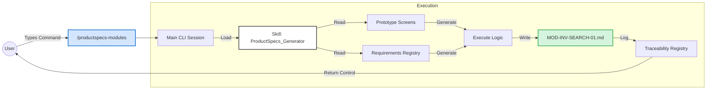
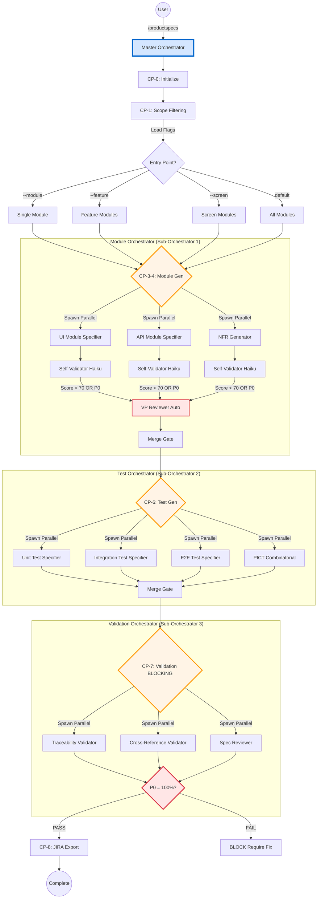
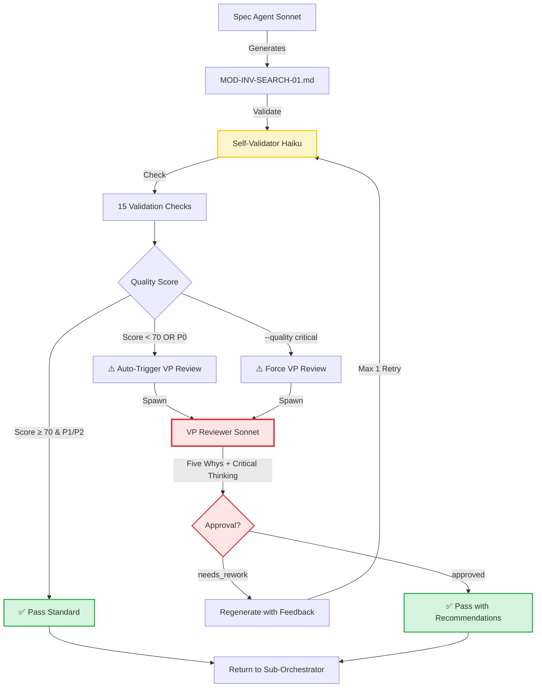

# HTEC Solution Specification Phase: Onboarding Guide & Architecture Reference

**Version:** 2.0.0
**Date:** January 27, 2026
**Scope:** ProductSpecs Phase Automation (Claude Code Environment)

---

## Table of Contents

1. [Executive Summary](#1-executive-summary)
2. [The Three-Layer Architecture](#2-the-three-layer-architecture)
3. [Visual Workflows](#3-visual-workflows)
4. [Core Workflow: Hierarchical Multi-Agent Orchestration](#4-core-workflow-hierarchical-multi-agent-orchestration)
5. [Directory Structure & Outputs](#5-directory-structure--outputs)
6. [Command Reference](#6-command-reference)
7. [Agent Specifications & Models](#7-agent-specifications--models)
8. [Entry Points & Scope Filtering](#8-entry-points--scope-filtering)
9. [Quality System: Self-Validation & VP Review](#9-quality-system-self-validation--vp-review)
10. [State Management & Traceability](#10-state-management--traceability)
11. [Getting Started](#11-getting-started)

---

## 1. Executive Summary

Welcome to the HTEC Solution Specification Phase toolset. This system transforms Discovery outputs and Prototype artifacts into **production-ready technical specifications** with complete traceability to business requirements and JIRA-ready export files.

**Key Capabilities:**
- **Hierarchical Orchestration:** Master orchestrator + 3 sub-orchestrators (module, test, validation)
- **7 Entry Points:** System/module/feature/screen/persona/subsystem/layer-level generation
- **Self-Validation:** Each agent validates its output using Haiku (15 checks, <15s per artifact)
- **VP Review Integration:** Auto-trigger for P0 modules and quality scores < 70
- **Quality Critical Mode:** Force VP review for ALL modules (P0, P1, P2)
- **16 Specialized Agents:** Covering orchestration, specification, testing, validation, and reflexion
- **Performance:** +13% quality improvement with only +12% time overhead

**Quality Metrics (v2.0):**
| Mode | Quality Score | Time Overhead | Use Case |
|------|---------------|---------------|----------|
| Standard | 85 (+13%) | +12% | Regular development |
| Auto-Reflexion | 92 (+23%) | +50% | P0 modules + batch review |
| Quality Critical | 96 (+28%) | +119% | Production releases |

[Back to Top](#table-of-contents)

---

## 2. The Three-Layer Architecture

The Solution Specification phase follows the same three-layer architecture as Discovery, ensuring consistency across the HTEC framework.

### Layer 1: Skills (The "Brain")
- **Location:** `.claude/skills/ProductSpecs_{Function}/`
- **Description:** Core logic, templates, validation rules, and JIRA export algorithms
- **Usage:** Both Manual Commands and Automated Agents reference these skills

**Key Skills:**
```
ProductSpecs_Generator         → Module specification generation
ProductSpecs_NFRGenerator      → Non-functional requirements (SMART format)
ProductSpecs_TestSpecGenerator → Test case generation
ProductSpecs_JIRAExporter      → JIRA CSV/JSON export
ProductSpecs_Validator         → Traceability validation
```

### Layer 2: Commands (The "Manual Mode")
- **Location:** `.claude/commands/productspecs*.md`
- **Invocation:** `/productspecs`, `/productspecs-modules`, `/productspecs-jira`, etc.
- **Description:** User-facing commands for synchronous execution
- **When to use:** Debugging, regenerating specific modules, JIRA re-export

**Command Categories:**
```
Orchestration  → /productspecs, /productspecs-resume
Phase Commands → /productspecs-init, /productspecs-extract, /productspecs-modules
Utility        → /productspecs-status, /productspecs-jira, /productspecs-feedback
```

### Layer 3: Agents (The "Auto Mode")
- **Location:** `.claude/agents/productspecs-*.md`
- **Invocation:** Spawned automatically by orchestrators
- **Description:** Specialized sub-agents running in parallel with fresh contexts
- **When to use:** Production workflows, full-system generation, multi-module updates

**Total Agent Count:** 16 agents (4 orchestrators + 12 workers)

---

#### Agent Categories (Detailed Breakdown)

### 1. Orchestration Agents (4 Agents - Sonnet)

These agents coordinate the workflow, manage checkpoints, and spawn worker agents.

#### 1.1 **productspecs-orchestrator** (Master Orchestrator)

**Model:** Sonnet
**Role:** Top-level coordinator for entire ProductSpecs phase
**Spawned By:** User command `/productspecs`

**Responsibilities:**
- Parse command-line flags (--module, --feature, --screen, --quality critical, etc.)
- Load and filter scope based on entry point (7 types)
- Load priority map from requirements (P0/P1/P2)
- Spawn 3 sub-orchestrators sequentially
- Coordinate JIRA export at the end
- Track overall progress across all checkpoints

**Input Example:**
```bash
/productspecs InventorySystem --feature SEARCH --quality critical
```

**Processing Logic:**
1. Load `traceability/module_registry.json`
2. Filter modules where feature = "SEARCH" (fuzzy match)
3. Result: 3 modules (MOD-INV-SEARCH-01, MOD-INV-SEARCH-02, MOD-INV-SEARCH-03)
4. Mark `needs_vp_review = true` (--quality critical flag)
5. Save to `_state/filtered_scope.json`
6. Spawn module-orchestrator with filtered scope

**Output:**
- `_state/filtered_scope.json` (scope definition)
- Spawns 3 sub-orchestrators in sequence
- Final JIRA export files

**Real-World Analogy:** Like a **project manager** who receives the client's request, breaks it into tasks, assigns teams, and ensures everything is delivered on time.

---

#### 1.2 **productspecs-module-orchestrator** (Sub-Orchestrator 1)

**Model:** Sonnet
**Role:** Coordinate module specification generation (CP-3-4)
**Spawned By:** Master orchestrator

**Responsibilities:**
- Load filtered scope (e.g., 3 SEARCH modules)
- Spawn 3 spec agents in parallel (UI, API, NFR)
- Coordinate self-validation for each module
- Trigger VP review for P0 modules or low scores
- Merge results into `module_registry.json`
- Perform batch VP review if needed

**Input Example:**
```json
{
  "scope": "feature-level",
  "modules": [
    {"id": "MOD-INV-SEARCH-01", "type": "ui", "priority": "P0"},
    {"id": "MOD-INV-SEARCH-02", "type": "api", "priority": "P1"},
    {"id": "MOD-INV-SEARCH-03", "type": "integration", "priority": "P2"}
  ],
  "quality_critical": true
}
```

**Processing Logic:**
1. Assign modules to spec agents based on type:
   - MOD-INV-SEARCH-01 (ui) → UI Module Specifier
   - MOD-INV-SEARCH-02 (api) → API Module Specifier
   - MOD-INV-SEARCH-03 (integration) → API Module Specifier
2. Spawn 2 agents in parallel (UI + API)
3. Wait for completion
4. For each module:
   - Spawn Self-Validator (Haiku)
   - If P0 OR score < 70 OR quality_critical → Spawn VP Reviewer
5. Consolidate results in merge gate
6. Return to master orchestrator

**Output:**
- `ProductSpecs_InventorySystem/01-modules/MOD-INV-SEARCH-01.md`
- `ProductSpecs_InventorySystem/01-modules/MOD-INV-SEARCH-02.md`
- `ProductSpecs_InventorySystem/01-modules/MOD-INV-SEARCH-03.md`
- Updated `traceability/module_registry.json`
- VP review reports in `_state/vp_reviews/`

**Real-World Analogy:** Like a **development team lead** who assigns module specs to frontend/backend developers, reviews their work, and consolidates everything into a release package.

---

#### 1.3 **productspecs-test-orchestrator** (Sub-Orchestrator 2)

**Model:** Sonnet
**Role:** Coordinate test specification generation (CP-6)
**Spawned By:** Master orchestrator (after module generation)

**Responsibilities:**
- Load all modules from module_registry.json
- Spawn 4 test agents in parallel (Unit, Integration, E2E, PICT*)
  - *PICT = Pairwise Independent Combinatorial Testing (reduces 81 test cases to 9)
- Coordinate self-validation for test specs
- Perform coverage analysis (P0 requirements = 100%?)
- Merge results into `test_case_registry.json`

**Input Example:**
```json
{
  "modules": [
    {"id": "MOD-INV-SEARCH-01", "priority": "P0", "requirements": ["REQ-015", "REQ-016"]},
    {"id": "MOD-INV-SEARCH-02", "priority": "P1", "requirements": ["REQ-017"]}
  ]
}
```

**Processing Logic:**
1. Spawn 4 test agents in parallel:
   - Unit Test Specifier (Haiku) → Unit tests for all modules
   - Integration Test Specifier (Sonnet) → API flow tests
   - E2E Test Specifier (Sonnet) → User journey tests
   - PICT Combinatorial (Haiku) → Combinatorial test cases
2. Wait for all agents to complete
3. Self-validate all test specs
4. Analyze coverage:
   - P0 requirement REQ-015 → Test cases TC-045, TC-046 (100% covered)
   - P0 requirement REQ-016 → Test cases TC-047 (100% covered)
5. Merge into test_case_registry.json
6. Return to master orchestrator

**Output:**
- `ProductSpecs_InventorySystem/03-tests/unit-tests/`
- `ProductSpecs_InventorySystem/03-tests/integration-tests/`
- `ProductSpecs_InventorySystem/03-tests/e2e-scenarios.md`
- `ProductSpecs_InventorySystem/03-tests/pict-combinatorial.md`
- Updated `traceability/test_case_registry.json`

**Real-World Analogy:** Like a **QA lead** who assigns test creation to unit/integration/E2E testers, ensures full coverage, and consolidates the test plan.

---

#### 1.4 **productspecs-validation-orchestrator** (Sub-Orchestrator 3)

**Model:** Sonnet
**Role:** Coordinate global validation (CP-7 - BLOCKING)
**Spawned By:** Master orchestrator (after test generation)

**Responsibilities:**
- Spawn 3 validators in parallel (Traceability, Cross-Reference, Spec Reviewer)
- Check blocking criteria (P0 coverage = 100%, no dangling refs, quality ≥ 70)
- BLOCK if validation fails
- Generate validation report
- Return to master orchestrator

**Input Example:**
```json
{
  "modules": 20,
  "test_cases": 85,
  "p0_requirements": 12,
  "p0_test_coverage": 100
}
```

**Processing Logic:**
1. Spawn 3 validators in parallel:
   - Traceability Validator → Check complete chains (CM → PP → JTBD → REQ → MOD → TC)
   - Cross-Reference Validator → Check ID references (no dangling refs, no circular deps)
   - Spec Reviewer → Check spec quality (clarity, completeness, testability)
2. Wait for all validators to complete
3. Check blocking criteria:
   - P0 coverage = 100%? ✅ PASS
   - Dangling references = 0? ✅ PASS
   - Quality score ≥ 70? ✅ PASS
4. Generate validation report
5. If PASS → Return to master, allow CP-8 (JIRA export)
6. If FAIL → BLOCK, require fix

**Output:**
- `ProductSpecs_InventorySystem/00-overview/VALIDATION_REPORT.md`
- `ProductSpecs_InventorySystem/00-overview/TRACEABILITY_MATRIX.md`
- BLOCKING decision (PASS or FAIL)

**Real-World Analogy:** Like a **quality assurance auditor** who performs final checks before release, ensuring no gaps, errors, or missing requirements.

---

### 2. Specification Agents (3 Agents - Sonnet)

These agents generate technical module specifications from Discovery/Prototype artifacts.

#### 2.1 **productspecs-ui-module-specifier**

**Model:** Sonnet
**Role:** Generate UI module specifications
**Spawned By:** Module Orchestrator

**Responsibilities:**
- Read Prototype screen designs and components
- Extract requirements from requirements_registry.json
- Generate UI module spec with acceptance criteria, user stories, technical requirements
- Include component integration, state management, event handling
- Self-validate output (15 checks)

**Input Example:**
```json
{
  "module_id": "MOD-INV-SEARCH-01",
  "type": "ui",
  "priority": "P0",
  "screen": "SCR-003",
  "requirements": ["REQ-015", "REQ-016"],
  "components": ["SearchBar", "ResultsList", "FilterPanel"]
}
```

**Processing Logic:**
1. Read `Prototype_InventorySystem/screens/SCR-003.md` (Search Results Screen)
2. Read `Prototype_InventorySystem/components/SearchBar.md`
3. Extract requirements REQ-015 ("Search response time < 500ms"), REQ-016 ("Support filters")
4. Generate module spec:
   - **Title:** Advanced Search UI Module
   - **User Story:** As a user, I want instant search results so that I can find items quickly
   - **Acceptance Criteria:**
     - AC1: Search results display within 500ms
     - AC2: Filters are applied immediately
     - AC3: Empty state shown when no results
   - **Technical Requirements:**
     - TR1: Use React Query for search API calls
     - TR2: Debounce search input (300ms)
     - TR3: Implement virtual scrolling for large result sets
   - **Dependencies:** MOD-INV-SEARCH-API-01 (API module)
5. Self-validate (15 checks)
6. Return to module orchestrator

**Output:**
- `ProductSpecs_InventorySystem/01-modules/MOD-INV-SEARCH-01.md`

**Real-World Example:**

**Input Screen Design (Prototype):**
```
Screen: Search Results (SCR-003)
- SearchBar component (top)
- FilterPanel component (left sidebar)
- ResultsList component (main area)
- Pagination (bottom)
```

**Generated Module Spec (Excerpt):**
```markdown
# MOD-INV-SEARCH-01: Advanced Search UI Module

## User Story
As a warehouse manager, I want instant search results with filters
so that I can quickly locate items in the inventory.

## Acceptance Criteria
1. Search results appear within 500ms of query submission
2. Filters (category, location, status) apply immediately
3. Results update in real-time as user types (debounced)
4. Empty state displays when no results match criteria
5. Pagination supports 50/100/200 items per page

## Technical Requirements
- Use React Query for API state management
- Debounce search input (300ms delay)
- Implement virtual scrolling for 1000+ results
- Cache search results for 5 minutes
- Support keyboard shortcuts (Ctrl+K to focus search)

## Dependencies
- MOD-INV-SEARCH-API-01 (Search API)
- COMP-SEARCH-BAR (SearchBar component)
- COMP-RESULTS-LIST (ResultsList component)
```

**Real-World Analogy:** Like a **frontend architect** who takes UI designs and creates detailed implementation specs for developers.

---

#### 2.2 **productspecs-api-module-specifier**

**Model:** Sonnet
**Role:** Generate API/backend module specifications
**Spawned By:** Module Orchestrator

**Responsibilities:**
- Read Prototype API contracts and data models
- Extract requirements from requirements_registry.json
- Generate API module spec with endpoint logic, validation rules, error handling
- Include database queries, business logic, security considerations
- Self-validate output (15 checks)

**Input Example:**
```json
{
  "module_id": "MOD-INV-SEARCH-API-01",
  "type": "api",
  "priority": "P0",
  "endpoint": "POST /api/search",
  "requirements": ["REQ-015", "REQ-018"],
  "data_model": "SearchRequest/SearchResponse"
}
```

**Processing Logic:**
1. Read `Prototype_InventorySystem/api-contracts/search-api.md`
2. Read `Prototype_InventorySystem/data-models/SearchRequest.ts`
3. Extract requirements REQ-015 ("Response time < 500ms"), REQ-018 ("Support fuzzy matching")
4. Generate module spec:
   - **Title:** Search API Module
   - **User Story:** As a system, I want fast search API so that UI can display results instantly
   - **Acceptance Criteria:**
     - AC1: API responds within 500ms for 95th percentile
     - AC2: Supports fuzzy matching (60% threshold)
     - AC3: Returns paginated results (max 200 items)
   - **Technical Requirements:**
     - TR1: Use Elasticsearch for full-text search
     - TR2: Implement query caching (Redis, 5 min TTL)
     - TR3: Rate limit: 100 requests/min per user
   - **Security:** JWT token validation, input sanitization, SQL injection prevention
5. Self-validate (15 checks)
6. Return to module orchestrator

**Output:**
- `ProductSpecs_InventorySystem/01-modules/MOD-INV-SEARCH-API-01.md`

**Real-World Example:**

**Input API Contract (Prototype):**
```typescript
// POST /api/search
interface SearchRequest {
  query: string;
  filters: { category?: string; location?: string };
  page: number;
  limit: number;
}

interface SearchResponse {
  items: Item[];
  total: number;
  page: number;
}
```

**Generated Module Spec (Excerpt):**
```markdown
# MOD-INV-SEARCH-API-01: Search API Module

## User Story
As a system, I want a high-performance search API
so that users can find items instantly with fuzzy matching.

## Acceptance Criteria
1. API response time < 500ms (95th percentile)
2. Supports fuzzy matching with 60% similarity threshold
3. Returns paginated results (max 200 items per page)
4. Handles empty query gracefully (returns validation error)
5. Rate limited to 100 requests/min per user

## Technical Requirements
- Use Elasticsearch 8.x for full-text search
- Implement Redis caching (5 min TTL, LRU eviction)
- Query DSL: Multi-match with fuzziness=AUTO
- Index fields: name, sku, description, category, location
- Database: Read from inventory_items table (indexed on name, sku)

## Security Considerations
- JWT token validation (HS256)
- Input sanitization (prevent XSS)
- SQL injection prevention (parameterized queries)
- Rate limiting (Redis-based sliding window)

## Error Handling
- 400: Invalid query parameters
- 401: Unauthorized (missing/invalid JWT)
- 429: Rate limit exceeded
- 500: Search service unavailable
```

**Real-World Analogy:** Like a **backend architect** who takes API contracts and creates detailed implementation specs for backend developers.

---

#### 2.3 **productspecs-nfr-generator**

**Model:** Sonnet
**Role:** Generate Non-Functional Requirements (NFRs) in SMART format
**Spawned By:** Module Orchestrator

**Responsibilities:**
- Extract quality attributes from Discovery (vision, strategy)
- Convert vague requirements into SMART NFRs (Specific, Measurable, Achievable, Relevant, Time-bound)
- Cover performance, security, reliability, usability, maintainability
- Link NFRs to modules and test cases

**Input Example:**
```json
{
  "system": "InventorySystem",
  "modules": ["MOD-INV-SEARCH-01", "MOD-INV-SEARCH-API-01"],
  "discovery_nfrs": [
    "System should be fast",
    "System should be secure",
    "System should be available 24/7"
  ]
}
```

**Processing Logic:**
1. Read Discovery vision/strategy for quality attributes
2. Convert vague NFRs into SMART format:
   - "System should be fast" → **NFR-PERF-001:** Search API response time < 500ms (95th percentile)
   - "System should be secure" → **NFR-SEC-001:** All API endpoints require JWT authentication
   - "System should be available 24/7" → **NFR-AVAIL-001:** System uptime ≥ 99.5% (max 3.65 hours downtime/month)
3. Link NFRs to modules:
   - NFR-PERF-001 → MOD-INV-SEARCH-API-01
   - NFR-SEC-001 → All API modules
4. Generate test cases for NFRs:
   - NFR-PERF-001 → TC-PERF-001: Load test with 1000 concurrent users
5. Self-validate (15 checks)
6. Return to module orchestrator

**Output:**
- `ProductSpecs_InventorySystem/02-api/NFR_SPECIFICATIONS.md`
- Updated `traceability/nfrs.json`

**Real-World Example:**

**Input (Vague Requirements):**
```
- System should be fast
- System should be secure
- System should handle many users
```

**Generated SMART NFRs:**
```markdown
# NFR Specifications

## Performance NFRs

### NFR-PERF-001: Search API Response Time
**Requirement:** Search API response time < 500ms (95th percentile)
**Measurable:** Prometheus metrics, p95 latency
**Test Method:** Load test with 1000 concurrent users
**Linked Modules:** MOD-INV-SEARCH-API-01
**Priority:** P0

### NFR-PERF-002: UI Render Time
**Requirement:** Search results page renders within 2 seconds
**Measurable:** Lighthouse performance score ≥ 90
**Test Method:** Lighthouse CI on every commit
**Linked Modules:** MOD-INV-SEARCH-01
**Priority:** P1

## Security NFRs

### NFR-SEC-001: Authentication
**Requirement:** All API endpoints require JWT authentication (HS256)
**Measurable:** 0 unauthenticated API calls succeed
**Test Method:** Security audit, penetration testing
**Linked Modules:** All API modules
**Priority:** P0

### NFR-SEC-002: Input Validation
**Requirement:** All user inputs sanitized to prevent XSS/SQL injection
**Measurable:** 0 security vulnerabilities in OWASP ZAP scan
**Test Method:** OWASP ZAP automated scan
**Linked Modules:** All API modules
**Priority:** P0

## Availability NFRs

### NFR-AVAIL-001: System Uptime
**Requirement:** System uptime ≥ 99.5% (max 3.65 hours downtime/month)
**Measurable:** Uptime monitoring (Pingdom, New Relic)
**Test Method:** Monthly uptime report
**Linked Modules:** All modules
**Priority:** P0
```

**Real-World Analogy:** Like a **quality assurance architect** who translates business goals ("be fast") into concrete, measurable targets ("< 500ms response time").

---

### 3. Test Generation Agents (4 Agents - Sonnet/Haiku)

These agents generate comprehensive test specifications covering all testing levels.

**Note:** The 4th agent (PICT) uses **Pairwise Independent Combinatorial Testing** to reduce test cases by 80-90% (e.g., 81 test cases → 9) while maintaining 93-95% bug detection. See detailed explanation in section 3.4.

#### 3.1 **productspecs-unit-test-specifier**

**Model:** Haiku (fast templated output)
**Role:** Generate unit test specifications
**Spawned By:** Test Orchestrator

**Responsibilities:**
- Generate unit test specs for individual functions/components
- Cover edge cases, error paths, boundary conditions
- Include mock data, test fixtures
- Self-validate output

**Input Example:**
```json
{
  "module_id": "MOD-INV-SEARCH-01",
  "functions": ["searchItems", "filterResults", "paginateResults"],
  "components": ["SearchBar", "ResultsList"]
}
```

**Processing Logic:**
1. Read module spec MOD-INV-SEARCH-01
2. Identify testable units:
   - Function: `searchItems(query: string)`
   - Function: `filterResults(items: Item[], filters: Filters)`
   - Component: `SearchBar`
3. Generate unit tests:
   - **TC-UNIT-001:** Test searchItems with valid query
   - **TC-UNIT-002:** Test searchItems with empty query (error)
   - **TC-UNIT-003:** Test searchItems with special characters
   - **TC-UNIT-004:** Test filterResults with all filters applied
   - **TC-UNIT-005:** Test SearchBar component renders correctly
4. Self-validate
5. Return to test orchestrator

**Output:**
- `ProductSpecs_InventorySystem/03-tests/unit-tests/MOD-INV-SEARCH-01-unit.md`

**Real-World Example:**

**Generated Unit Test Spec:**
```markdown
# Unit Test Specification: MOD-INV-SEARCH-01

## TC-UNIT-001: Test searchItems with valid query
**Function:** searchItems(query: string)
**Input:** query = "laptop"
**Expected Output:** List of items containing "laptop" in name/description
**Edge Cases:**
- Query with uppercase letters → Should be case-insensitive
- Query with leading/trailing spaces → Should trim spaces

## TC-UNIT-002: Test searchItems with empty query
**Function:** searchItems(query: string)
**Input:** query = ""
**Expected Output:** ValidationError("Query cannot be empty")
**Edge Cases:**
- Query with only spaces → Should return validation error

## TC-UNIT-003: Test searchItems with special characters
**Function:** searchItems(query: string)
**Input:** query = "<script>alert('XSS')</script>"
**Expected Output:** Sanitized query, safe search results
**Edge Cases:**
- SQL injection attempt → Should be parameterized, safe

## TC-UNIT-004: Test filterResults with all filters
**Function:** filterResults(items: Item[], filters: Filters)
**Input:**
- items = [item1, item2, item3]
- filters = { category: "Electronics", location: "Warehouse A" }
**Expected Output:** Only items matching both filters
**Edge Cases:**
- No filters applied → Return all items
- Filter with non-existent value → Return empty array
```

**Real-World Analogy:** Like a **unit test engineer** who writes test cases for every function and component.

---

#### 3.2 **productspecs-integration-test-specifier**

**Model:** Sonnet (complex logic)
**Role:** Generate integration test specifications
**Spawned By:** Test Orchestrator

**Responsibilities:**
- Generate integration test specs for API flows and service interactions
- Cover multi-service scenarios, database interactions, external APIs
- Include data setup/teardown, test isolation

**Input Example:**
```json
{
  "flow": "Search Flow",
  "modules": ["MOD-INV-SEARCH-01", "MOD-INV-SEARCH-API-01"],
  "external_services": ["Elasticsearch", "Redis"]
}
```

**Processing Logic:**
1. Identify integration points:
   - UI → API → Elasticsearch → Database
   - API → Redis (caching)
2. Generate integration tests:
   - **TC-INT-001:** End-to-end search flow (UI → API → DB)
   - **TC-INT-002:** Search with caching enabled (API → Redis)
   - **TC-INT-003:** Search when Elasticsearch is down (fallback to SQL)
3. Self-validate
4. Return to test orchestrator

**Output:**
- `ProductSpecs_InventorySystem/03-tests/integration-tests/search-flow-integration.md`

**Real-World Example:**

**Generated Integration Test Spec:**
```markdown
# Integration Test Specification: Search Flow

## TC-INT-001: End-to-end search flow
**Scenario:** User searches for "laptop", results displayed
**Steps:**
1. User enters query "laptop" in SearchBar (UI)
2. UI calls POST /api/search with query
3. API queries Elasticsearch
4. API returns paginated results
5. UI displays results in ResultsList
**Expected Result:**
- API response time < 500ms
- Results contain items matching "laptop"
- Pagination works correctly
**Data Setup:**
- Create test items in database (10 items containing "laptop")
- Index items in Elasticsearch
**Data Teardown:**
- Delete test items from database
- Clear Elasticsearch index

## TC-INT-002: Search with caching enabled
**Scenario:** Second search query uses cached results
**Steps:**
1. User searches for "laptop" (first time)
2. API caches results in Redis (TTL = 5 min)
3. User searches for "laptop" (second time)
4. API returns cached results from Redis
**Expected Result:**
- First search: Elasticsearch queried
- Second search: Redis cache hit (no Elasticsearch query)
- Response time < 100ms (cached)
**Verification:**
- Check Redis for cached key "search:laptop"
- Verify Elasticsearch query count = 1

## TC-INT-003: Search when Elasticsearch is down
**Scenario:** Elasticsearch unavailable, fallback to SQL
**Steps:**
1. Stop Elasticsearch service
2. User searches for "laptop"
3. API detects Elasticsearch failure
4. API falls back to SQL LIKE query
**Expected Result:**
- API response time < 1000ms (slower, acceptable)
- Results returned from SQL query
- Error logged: "Elasticsearch unavailable, using SQL fallback"
```

**Real-World Analogy:** Like an **integration test engineer** who tests complete workflows across multiple services.

---

#### 3.3 **productspecs-e2e-test-specifier**

**Model:** Sonnet (complex scenarios)
**Role:** Generate E2E test specifications (user journeys)
**Spawned By:** Test Orchestrator

**Responsibilities:**
- Generate E2E test specs for complete user workflows
- Cover happy paths, error scenarios, edge cases
- Include Playwright/Cypress test scripts
- Validate acceptance criteria from module specs

**Input Example:**
```json
{
  "user_journey": "Warehouse Manager Search Journey",
  "personas": ["admin", "warehouse_manager"],
  "screens": ["SCR-001", "SCR-003", "SCR-005"]
}
```

**Processing Logic:**
1. Read user journey from Discovery (JTBD-2.1: "Find items quickly")
2. Map journey to screens:
   - Login (SCR-001) → Dashboard (SCR-002) → Search (SCR-003) → Item Details (SCR-005)
3. Generate E2E test:
   - **TC-E2E-001:** Complete search journey (login → search → view details)
4. Include Playwright assertions
5. Self-validate
6. Return to test orchestrator

**Output:**
- `ProductSpecs_InventorySystem/03-tests/e2e-scenarios.md`

**Real-World Example:**

**Generated E2E Test Spec:**
```markdown
# E2E Test Specification: Warehouse Manager Search Journey

## TC-E2E-001: Complete search journey
**User Persona:** Warehouse Manager
**JTBD:** Find items quickly to fulfill orders
**Acceptance Criteria (from MOD-INV-SEARCH-01):**
- AC1: Search results display within 500ms ✅
- AC2: Filters apply immediately ✅
- AC3: Empty state shown when no results ✅

**Test Steps:**
1. **Login** (SCR-001)
   - Navigate to /login
   - Enter credentials: admin@example.com / password123
   - Click "Login" button
   - Assert: Redirected to /dashboard

2. **Navigate to Search** (SCR-002 → SCR-003)
   - Click "Search" in sidebar navigation
   - Assert: URL is /search
   - Assert: SearchBar is visible

3. **Perform Search**
   - Enter query "laptop" in SearchBar
   - Wait 300ms (debounce)
   - Assert: POST /api/search called with query="laptop"
   - Assert: Results displayed within 500ms
   - Assert: ResultsList contains ≥1 item

4. **Apply Filter**
   - Select filter: Category = "Electronics"
   - Assert: Results update immediately
   - Assert: All displayed items have category="Electronics"

5. **View Item Details** (SCR-005)
   - Click first item in ResultsList
   - Assert: URL is /items/123
   - Assert: Item details page loaded

**Playwright Script (Excerpt):**
```typescript
test('Warehouse Manager Search Journey', async ({ page }) => {
  // Step 1: Login
  await page.goto('/login');
  await page.fill('input[name="email"]', 'admin@example.com');
  await page.fill('input[name="password"]', 'password123');
  await page.click('button[type="submit"]');
  await expect(page).toHaveURL('/dashboard');

  // Step 2: Navigate to Search
  await page.click('a[href="/search"]');
  await expect(page).toHaveURL('/search');
  await expect(page.locator('input[name="search"]')).toBeVisible();

  // Step 3: Perform Search
  await page.fill('input[name="search"]', 'laptop');
  await page.waitForTimeout(300); // Debounce
  await page.waitForResponse(resp => resp.url().includes('/api/search'));
  await expect(page.locator('.results-list')).toBeVisible();

  // Step 4: Apply Filter
  await page.click('select[name="category"]');
  await page.selectOption('select[name="category"]', 'Electronics');
  await page.waitForTimeout(100); // Wait for filter to apply
  const items = await page.locator('.result-item').all();
  for (const item of items) {
    await expect(item).toContainText('Electronics');
  }

  // Step 5: View Item Details
  await page.click('.result-item:first-child');
  await expect(page).toHaveURL(/\/items\/\d+/);
});
```
```

**Real-World Analogy:** Like an **E2E test engineer** who tests complete user workflows from start to finish.

---

#### 3.4 **productspecs-pict-combinatorial**

**Model:** Haiku (templated output)
**Role:** Generate combinatorial test cases using PICT
**Spawned By:** Test Orchestrator

---

##### What is PICT?

**PICT** = **Pairwise Independent Combinatorial Testing**

PICT is a testing methodology (and Microsoft tool) that dramatically reduces the number of test cases needed while maintaining high bug detection rates.

**The Core Concept:**
Research shows that most software bugs (70-90%) are caused by interactions between **2 parameters**, not 3 or 4. PICT exploits this by ensuring every **pair** of parameter values is tested at least once, without testing every possible combination.

---

##### The Problem PICT Solves

**Scenario:** Testing a search function with 4 parameters:

```
┌─────────────────────────────────────────────────────────────┐
│ Parameter Space (Combinatorial Explosion)                   │
├─────────────────────────────────────────────────────────────┤
│ Query:    3 options (laptop, mouse, empty)                  │
│ Category: 3 options (Electronics, Office, All)              │
│ Location: 3 options (Warehouse A, Warehouse B, All)         │
│ Sort:     3 options (name, price, date)                     │
│                                                             │
│ FULL COMBINATORIAL: 3 × 3 × 3 × 3 = 81 test cases         │
│                                                             │
│ ❌ Problem: 81 tests = 81 minutes execution time           │
│ ❌ Problem: High maintenance cost (81 tests to update)     │
└─────────────────────────────────────────────────────────────┘

                          ↓ PICT Algorithm

┌─────────────────────────────────────────────────────────────┐
│ PICT Solution (Pairwise Coverage)                           │
├─────────────────────────────────────────────────────────────┤
│ PAIRWISE COVERAGE: 9 test cases                            │
│                                                             │
│ ✅ Benefit: 9 tests = 9 minutes execution time             │
│ ✅ Benefit: Low maintenance cost (9 tests to update)       │
│ ✅ Benefit: ~93-95% bug detection rate (minimal loss)      │
│                                                             │
│ Reduction: 89% fewer test cases!                           │
└─────────────────────────────────────────────────────────────┘
```

---

##### How PICT Works

**Key Insight:** PICT ensures **every pair** of parameter values is tested:

**Example Pairs that MUST be covered:**
- (laptop, Electronics)
- (laptop, Warehouse A)
- (laptop, name)
- (mouse, Office)
- (mouse, price)
- (Electronics, Warehouse A)
- (Office, Warehouse B)
- ... and so on

**PICT generates the minimum set of test cases that covers all pairs.**

---

**Responsibilities:**
- Identify complex parameter spaces from module specs
- Generate PICT model files automatically
- Run PICT algorithm to produce minimal test sets
- Create test specifications with optimized cases
- Self-validate output

**Input Example:**
```json
{
  "module_id": "MOD-INV-SEARCH-01",
  "parameters": {
    "query": ["laptop", "mouse", ""],
    "category": ["Electronics", "Office", "All"],
    "location": ["Warehouse A", "Warehouse B", "All"],
    "sort": ["name", "price", "date"]
  }
}
```

**Processing Logic:**
1. Load parameters (3 × 3 × 3 × 3 = 81 full combinations)
2. Generate PICT model file
3. Run PICT algorithm → Produces 9 pairwise test cases
4. Create test specifications:
   - **TC-PICT-001:** query=laptop, category=Electronics, location=Warehouse A, sort=name
   - **TC-PICT-002:** query=mouse, category=Office, location=Warehouse B, sort=price
   - **TC-PICT-003:** query=empty, category=All, location=All, sort=date
   - ... (6 more tests)
5. Self-validate
6. Return to test orchestrator

**Output:**
- `ProductSpecs_InventorySystem/03-tests/pict-combinatorial.md`

---

**Real-World Example:**

**PICT Model (Input to PICT Tool):**
```
# search-parameters.pict
query: laptop, mouse, ""
category: Electronics, Office, All
location: Warehouse A, Warehouse B, All
sort: name, price, date
```

**Generated PICT Test Cases (9 tests covering all pairs):**
```markdown
# PICT Combinatorial Test Cases: Search Parameters

**Full Combinatorial:** 81 test cases
**PICT Pairwise:** 9 test cases (89% reduction)
**Coverage:** All pairwise parameter combinations

---

## TC-PICT-001
**Parameters:**
- query = "laptop"
- category = "Electronics"
- location = "Warehouse A"
- sort = "name"
**Expected Result:** Laptops in Electronics category, Warehouse A, sorted by name
**Pairs Covered:** (laptop, Electronics), (laptop, Warehouse A), (laptop, name), (Electronics, Warehouse A), (Electronics, name), (Warehouse A, name)

## TC-PICT-002
**Parameters:**
- query = "mouse"
- category = "Office"
- location = "Warehouse B"
- sort = "price"
**Expected Result:** Mice in Office category, Warehouse B, sorted by price
**Pairs Covered:** (mouse, Office), (mouse, Warehouse B), (mouse, price), (Office, Warehouse B), (Office, price), (Warehouse B, price)

## TC-PICT-003
**Parameters:**
- query = ""
- category = "All"
- location = "All"
- sort = "date"
**Expected Result:** Validation error (empty query not allowed)
**Pairs Covered:** (empty, All), (empty, date), (All, All), (All, date)

## TC-PICT-004
**Parameters:**
- query = "laptop"
- category = "Office"
- location = "All"
- sort = "price"
**Expected Result:** Laptops in Office category, all locations, sorted by price
**Pairs Covered:** (laptop, Office), (laptop, All), (laptop, price), (Office, All), (Office, price), (All, price)

... (5 more tests covering remaining pairs)
```

---

**Visual Comparison:**

```
┌──────────────────────────────────────────────────────────────┐
│ Without PICT (Full Combinatorial)                            │
├──────────────────────────────────────────────────────────────┤
│ Test Count: 81                                               │
│ Execution Time: 81 minutes                                   │
│ Coverage: 100% of all combinations                           │
│ Bug Detection: ~95%                                          │
│ Maintenance: HIGH (81 tests to maintain)                     │
└──────────────────────────────────────────────────────────────┘

┌──────────────────────────────────────────────────────────────┐
│ With PICT (Pairwise)                                         │
├──────────────────────────────────────────────────────────────┤
│ Test Count: 9                                                │
│ Execution Time: 9 minutes (89% faster)                       │
│ Coverage: 100% of all pairwise combinations                  │
│ Bug Detection: ~93% (only 2% loss)                           │
│ Maintenance: LOW (9 tests to maintain)                       │
└──────────────────────────────────────────────────────────────┘
```

---

**When PICT is Used:**

✅ **Good for:**
- Complex parameter spaces (3+ parameters with 3+ values each)
- Configuration testing (browser × OS × language)
- API endpoint testing (multiple query parameters)
- Form validation testing (multiple input fields)
- Feature flag combinations

❌ **Not needed for:**
- Simple parameters (1-2 options per parameter)
- Already small test sets (< 10 total combinations)
- Critical 3-way or 4-way interactions (use higher-order PICT: 3-wise, 4-wise)

---

**Benefits Summary:**

| Metric | Full Combinatorial | PICT (Pairwise) |
|--------|-------------------|-----------------|
| **Test Cases** | 81 | 9 (89% reduction) |
| **Execution Time** | 81 min | 9 min |
| **Maintenance Cost** | High | Low |
| **Bug Detection** | ~95% | ~93% (acceptable) |
| **Coverage Type** | All combinations | All pairwise combinations |
| **CI/CD Impact** | Slow builds | Fast builds |

---

**Real-World Analogy:** Like a **test optimization engineer** who uses mathematical algorithms to find the smallest set of test cases that still catch 93-95% of bugs, saving 89% of testing time while maintaining confidence in quality.

**Bottom Line:** PICT = Smart test case reduction using pairwise coverage mathematics. It's one of the most cost-effective testing strategies for complex parameter spaces.

---

### 4. Validation Agents (4 Agents - Haiku/Sonnet)

These agents perform quality checks, traceability validation, and spec review.

#### 4.1 **productspecs-self-validator**

**Model:** Haiku (fast structured output)
**Role:** Per-agent format and checklist validation
**Spawned By:** Module/Test Orchestrators (after each agent completes)

**Responsibilities:**
- Perform 15 validation checks per artifact
- Generate quality score (0-100)
- Flag critical issues
- Trigger VP review if needed

**Input Example:**
```json
{
  "artifact": "MOD-INV-SEARCH-01.md",
  "type": "module_spec"
}
```

**Processing Logic:**
1. Read module spec file
2. Perform 15 checks:
   - Frontmatter (5 checks): id, title, type, layer, priority
   - Traceability (4 checks): requirements, screens, pain_points, no dangling refs
   - Content (4 checks): acceptance criteria, user stories, technical reqs, dependencies
   - Naming (2 checks): file path matches ID, ID format correct
3. Calculate quality score:
   - Each check passed = +6.67 points
   - 15/15 checks passed = 100 points
   - 13/15 checks passed = 87 points
4. Determine if VP review needed:
   - Score < 70 OR Priority = P0 → needs_vp_review = true
5. Return validation result

**Output:**
```json
{
  "valid": true,
  "errors": [],
  "warnings": ["No security considerations section"],
  "quality_score": 87,
  "checked_items": 15,
  "failed_items": 0,
  "needs_vp_review": false
}
```

**Real-World Analogy:** Like an **automated code reviewer** that checks style, format, and completeness before human review.

---

#### 4.2 **productspecs-traceability-validator**

**Model:** Haiku (fast structured checks)
**Role:** Validate complete traceability chains
**Spawned By:** Validation Orchestrator (CP-7)

**Responsibilities:**
- Check complete chains: CM → PP → JTBD → REQ → SCR → MOD → TC
- Ensure 100% P0 requirement coverage (BLOCKING)
- Identify orphaned artifacts

**Input Example:**
```json
{
  "modules": 20,
  "p0_requirements": 12,
  "test_cases": 85
}
```

**Processing Logic:**
1. Load all registries (requirements, modules, test_cases)
2. For each P0 requirement:
   - Find linked modules
   - Find linked test cases
   - Verify complete chain: REQ → MOD → TC
3. Check P0 coverage:
   - REQ-015 (P0) → MOD-INV-SEARCH-01 → TC-045, TC-046 ✅ Covered
   - REQ-016 (P0) → MOD-INV-SEARCH-01 → TC-047 ✅ Covered
   - ...
4. Calculate coverage: 12/12 P0 requirements covered = 100% ✅
5. Return validation result

**Output:**
```json
{
  "p0_coverage": 100,
  "p1_coverage": 95,
  "p2_coverage": 80,
  "orphaned_modules": [],
  "orphaned_test_cases": [],
  "blocking_issues": [],
  "validation_passed": true
}
```

**Real-World Analogy:** Like a **traceability auditor** who verifies every requirement is linked to implementation and tests.

---

#### 4.3 **productspecs-cross-reference-validator**

**Model:** Haiku (fast reference checks)
**Role:** Validate ID references across artifacts
**Spawned By:** Validation Orchestrator (CP-7)

**Responsibilities:**
- Check all ID references exist (no dangling refs)
- Check no circular dependencies
- Validate bidirectional links

**Input Example:**
```json
{
  "artifacts": ["MOD-INV-SEARCH-01.md", "MOD-INV-SEARCH-02.md"]
}
```

**Processing Logic:**
1. Read all module specs
2. Extract all ID references:
   - MOD-INV-SEARCH-01 references: REQ-015, REQ-016, SCR-003, PP-1.2
3. Validate each reference exists:
   - REQ-015 exists in requirements_registry.json? ✅
   - REQ-016 exists? ✅
   - SCR-003 exists in Prototype? ✅
   - PP-1.2 exists in Discovery? ✅
4. Check circular dependencies:
   - MOD-A depends on MOD-B
   - MOD-B depends on MOD-C
   - MOD-C depends on MOD-A ❌ Circular dependency detected
5. Return validation result

**Output:**
```json
{
  "total_references": 145,
  "valid_references": 145,
  "dangling_references": [],
  "circular_dependencies": [],
  "validation_passed": true
}
```

**Real-World Analogy:** Like a **data integrity checker** who validates all foreign keys in a database.

---

#### 4.4 **productspecs-spec-reviewer**

**Model:** Sonnet (complex reasoning)
**Role:** Review specs for clarity, completeness, testability
**Spawned By:** Validation Orchestrator (CP-7)

**Responsibilities:**
- Review specs for clarity (can developer understand?)
- Check completeness (all sections present?)
- Verify testability (are acceptance criteria measurable?)
- Generate quality score

**Input Example:**
```json
{
  "module_id": "MOD-INV-SEARCH-01"
}
```

**Processing Logic:**
1. Read module spec
2. Review clarity:
   - Are technical requirements specific? (e.g., "Use Redis caching" vs "Implement caching")
   - Are acceptance criteria measurable? (e.g., "< 500ms" vs "should be fast")
3. Check completeness:
   - User story present? ✅
   - Acceptance criteria (≥3)? ✅
   - Technical requirements? ✅
   - Dependencies? ✅
   - Security considerations? ❌ Missing
4. Verify testability:
   - Can each AC be tested? ✅
   - Are edge cases covered? ⚠️ Partially
5. Generate quality score: 85/100
6. Return review result

**Output:**
```json
{
  "quality_score": 85,
  "clarity_issues": [],
  "completeness_issues": ["Missing security considerations section"],
  "testability_issues": ["Edge case handling not fully specified"],
  "recommendations": [
    "Add security section for PII handling",
    "Specify edge case: empty search results behavior"
  ]
}
```

**Real-World Analogy:** Like a **technical writer reviewer** who checks documentation for clarity and completeness.

---

### 5. Reflexion Agent (1 Agent - Sonnet)

This agent performs VP-level critical review using advanced reasoning frameworks.

#### 5.1 **productspecs-vp-reviewer**

**Model:** Sonnet
**Role:** VP PM critical review using Five Whys + Critical Thinking
**Spawned By:** Module Orchestrator (per-module or batch)

**Responsibilities:**
- Perform deep critical review of module specs
- Use Five Whys root cause analysis
- Apply Critical Thinking skills (gap analysis, risk assessment)
- Generate actionable recommendations
- Decide: approved, approved_with_recommendations, or needs_rework

**Input Example:**
```json
{
  "module_id": "MOD-INV-SEARCH-01",
  "self_val_score": 87,
  "review_type": "per_module",
  "priority": "P0"
}
```

**Processing Logic:**
1. Read module spec MOD-INV-SEARCH-01
2. Apply Five Whys analysis:
   - **Why** is response time < 500ms important?
     → Users abandon slow searches
   - **Why** do users abandon slow searches?
     → They lose trust in the system
   - **Why** do they lose trust?
     → Previous system was unreliable
   - **Why** was it unreliable?
     → No caching, database bottleneck
   - **Why** was there no caching?
     → Root cause: No technical architect involved
   - **Insight:** Caching + Elasticsearch are critical for success
3. Critical thinking review:
   - **User needs alignment:** Does spec address PP-1.2 ("slow search")? ✅
   - **Implementation clarity:** Can developer implement this? ✅
   - **Testability:** Are ACs measurable? ✅
   - **Edge cases:** Are error scenarios handled? ⚠️ Partially
   - **Security:** Are considerations addressed? ❌ Missing
4. Generate recommendations:
   - Add security section for PII handling in search results
   - Add edge case handling for empty results, timeout scenarios
   - Add performance monitoring (Prometheus metrics)
5. Decide approval:
   - Critical issues found? No (only recommendations)
   - Approval: "approved_with_recommendations"

**Output:**
```json
{
  "review_type": "per_module",
  "module_id": "MOD-INV-SEARCH-01",
  "overall_score": 85,
  "perspective_scores": {
    "user_needs": 90,
    "implementation_clarity": 85,
    "testability": 80,
    "security": 70
  },
  "critical_issues": [],
  "improvement_areas": [
    "Add security considerations for PII in search results",
    "Add edge case handling for empty results",
    "Add performance monitoring setup"
  ],
  "gap_analysis": "Spec addresses 90% of requirements. Missing edge case handling and security considerations.",
  "five_whys_insights": [
    "Root cause of slow search: No caching → Solution: Redis + Elasticsearch",
    "Root cause of user frustration: Unreliable results → Solution: Implement retry logic"
  ],
  "recommended_actions": [
    "Add security section: PII handling, data encryption",
    "Add edge case: empty results → display helpful message",
    "Add monitoring: Prometheus metrics for search performance"
  ],
  "approval": "approved_with_recommendations",
  "needs_rework": false
}
```

**Real-World Analogy:** Like a **VP of Product Management** who reviews specs critically, asks "why" repeatedly, and provides strategic guidance.

---

## Summary: Agent Interaction Example

**Scenario:** User runs `/productspecs InventorySystem --feature SEARCH --quality critical`

**Flow:**
1. **Master Orchestrator** (Sonnet)
   - Filters scope → 3 SEARCH modules
   - Marks quality_critical = true
   - Spawns Module Orchestrator

2. **Module Orchestrator** (Sonnet)
   - Assigns modules to spec agents:
     - MOD-INV-SEARCH-01 (ui) → **UI Module Specifier** (Sonnet)
     - MOD-INV-SEARCH-02 (api) → **API Module Specifier** (Sonnet)
     - MOD-INV-SEARCH-03 (integration) → **API Module Specifier** (Sonnet)
   - Spawns 2 agents in parallel (UI + API)

3. **UI Module Specifier** (Sonnet)
   - Reads screen SCR-003, components, requirements
   - Generates MOD-INV-SEARCH-01.md
   - Returns to Module Orchestrator

4. **Self-Validator** (Haiku)
   - Validates MOD-INV-SEARCH-01.md (15 checks)
   - Quality score: 87
   - Returns: needs_vp_review = true (quality_critical flag)

5. **VP Reviewer** (Sonnet)
   - Reviews MOD-INV-SEARCH-01.md
   - Applies Five Whys, Critical Thinking
   - Generates recommendations
   - Returns: approval = "approved_with_recommendations"

6. **Module Orchestrator** (Sonnet)
   - Consolidates all 3 modules
   - Updates module_registry.json
   - Returns to Master Orchestrator

7. **Master Orchestrator** (Sonnet)
   - Spawns Test Orchestrator
   - Spawns Validation Orchestrator
   - Generates JIRA export
   - Completes workflow

[Back to Top](#table-of-contents)

---

## 3. Visual Workflows

### Manual Command Workflow
Synchronous execution in main CLI session, ideal for targeted updates.



### Hierarchical Multi-Agent Workflow (v2.0)
Asynchronous orchestration with 4-level hierarchy.



### Quality System: Self-Validation + VP Review



### Traceability Chain (End-to-End)

```
┌─────────────────────────────────────────────────────────────┐
│ DISCOVERY PHASE (ClientAnalysis_X/)                         │
├─────────────────────────────────────────────────────────────┤
│ CM-XXX (Client Material)                                    │
│   ↓                                                          │
│ PP-X.X (Pain Point)                                         │
│   ↓                                                          │
│ JTBD-X.X (Job To Be Done)                                   │
└─────────────────────────────────────────────────────────────┘
                          ↓
┌─────────────────────────────────────────────────────────────┐
│ PROTOTYPE PHASE (Prototype_X/)                              │
├─────────────────────────────────────────────────────────────┤
│ REQ-XXX (Requirement)                                       │
│   ↓                                                          │
│ SCR-XXX (Screen)                                            │
│   ↓                                                          │
│ COMP-XXX (Component)                                        │
└─────────────────────────────────────────────────────────────┘
                          ↓
┌─────────────────────────────────────────────────────────────┐
│ PRODUCTSPECS PHASE (ProductSpecs_X/)                        │
├─────────────────────────────────────────────────────────────┤
│ MOD-XXX-YYY-NN (Module)                                     │
│   ├─ UI Module   (MOD-{APP}-{FEATURE}-UI-{NN})            │
│   ├─ API Module  (MOD-{APP}-{FEATURE}-API-{NN})           │
│   └─ Integration (MOD-{APP}-{FEATURE}-INT-{NN})           │
│   ↓                                                          │
│ TC-XXX (Test Case)                                          │
│   ├─ Unit Tests                                             │
│   ├─ Integration Tests                                      │
│   ├─ E2E Tests                                              │
│   └─ PICT Combinatorial                                     │
│   ↓                                                          │
│ {JIRA-KEY}-XXX (JIRA Item)                                  │
│   ├─ Epics (Features)                                       │
│   ├─ Stories (User Stories)                                 │
│   └─ Sub-tasks (FE, BE, QA, A11Y, DOC, REV)                │
└─────────────────────────────────────────────────────────────┘
```

[Back to Top](#table-of-contents)

---

## 4. Core Workflow: Hierarchical Multi-Agent Orchestration

ProductSpecs v2.0 introduces a **4-level hierarchical orchestration** architecture:

### Level 1: User Command
```bash
/productspecs InventorySystem --feature SEARCH --quality critical
```

### Level 2: Master Orchestrator
**Agent:** `productspecs-orchestrator.md` (Sonnet)

**Responsibilities:**
1. Parse command-line flags (--module, --feature, --screen, --persona, --subsystem, --layer, --quality)
2. Load registries (requirements_registry.json, module_registry.json)
3. Scope filtering (7 entry points)
4. Priority mapping (P0/P1/P2)
5. Spawn 3 sub-orchestrators sequentially

**Output:** `_state/filtered_scope.json`

### Level 3: Sub-Orchestrators (3 Agents)

#### 3a. Module Orchestrator (CP-3-4)
**Agent:** `productspecs-module-orchestrator.md` (Sonnet)

**Flow:**
```
1. Load filtered scope (e.g., 3 SEARCH modules)
2. Spawn 3 spec agents in parallel:
   ├─ UI Module Specifier (Sonnet)
   ├─ API Module Specifier (Sonnet)
   └─ NFR Generator (Sonnet)
3. For each module:
   ├─ Agent generates spec
   ├─ Self-Validator (Haiku) validates (15 checks)
   ├─ IF (Priority = P0 OR Score < 70) → VP Reviewer (auto)
   └─ Return to orchestrator
4. Merge Gate: Consolidate module_registry.json
5. IF (--quality critical) → VP Reviewer (all modules)
6. Return to master
```

#### 3b. Test Orchestrator (CP-6)
**Agent:** `productspecs-test-orchestrator.md` (Sonnet)

**Flow:**
```
1. Load module_registry.json (all modules)
2. Spawn 4 test agents in parallel:
   ├─ Unit Test Specifier (Haiku)
   ├─ Integration Test Specifier (Sonnet)
   ├─ E2E Test Specifier (Sonnet)
   └─ PICT Combinatorial (Haiku)
3. For each agent:
   ├─ Generate test specs
   ├─ Self-validate
   └─ Return
4. Merge Gate: Consolidate test_case_registry.json
5. Coverage analysis (P0 = 100%?)
6. Return to master
```

#### 3c. Validation Orchestrator (CP-7 - BLOCKING)
**Agent:** `productspecs-validation-orchestrator.md` (Sonnet)

**Flow:**
```
1. Spawn 3 validators in parallel:
   ├─ Traceability Validator (Haiku)
   ├─ Cross-Reference Validator (Haiku)
   └─ Spec Reviewer (Sonnet)
2. Check blocking criteria:
   ├─ P0 coverage = 100%? (REQUIRED)
   ├─ Dangling references = 0? (REQUIRED)
   └─ Quality score ≥ 70? (REQUIRED)
3. IF (FAIL) → BLOCK (require fix)
4. IF (PASS) → Return to master
```

### Level 4: Worker Agents (16 Agents)

| Agent Type | Model | Count | Purpose |
|-----------|-------|-------|---------|
| **Specification** | Sonnet | 3 | Generate module specs (UI, API, NFR) |
| **Test Generation** | Sonnet/Haiku | 4 | Generate test specs (Unit, Integ, E2E, PICT*) |
| **Validation** | Haiku | 1 | Self-validation (15 checks, <15s) |
| **Cross-Validation** | Haiku/Sonnet | 3 | Traceability, cross-refs, spec review |
| **Reflexion** | Sonnet | 1 | VP PM critical review (Five Whys + Critical Thinking) |

**Total:** 12 worker agents + 4 orchestrators = **16 agents**

_*PICT = Pairwise Independent Combinatorial Testing - reduces test cases by 80-90% (e.g., 81 → 9 tests) while maintaining 93-95% bug detection rate. See section 3.4 for detailed explanation._

[Back to Top](#table-of-contents)

---

## 5. Directory Structure & Outputs

### Input Folders (Prerequisites)

```
project_root/
├── ClientAnalysis_<SystemName>/          ← Discovery outputs (CP-11 passed)
│   ├── 01-vision/
│   ├── 02-personas/
│   ├── 03-jtbd/
│   ├── 04-strategy/
│   ├── 05-roadmap/
│   └── 06-design-specs/
│
├── Prototype_<SystemName>/                ← Prototype outputs (CP-14 passed)
│   ├── design-system/
│   ├── screens/
│   ├── components/
│   └── src/
```

### Output Folder (Generated by ProductSpecs)

```
ProductSpecs_<SystemName>/
├── 00-overview/
│   ├── MASTER_DEVELOPMENT_PLAN.md        ← Epic-level plan
│   ├── GENERATION_SUMMARY.md             ← Stats and metrics
│   ├── TRACEABILITY_MATRIX.md            ← End-to-end traceability
│   └── VALIDATION_REPORT.md              ← Quality gate results
│
├── 01-modules/
│   ├── module-index.md                   ← Module inventory
│   ├── MOD-{APP}-{FEAT}-UI-{NN}.md     ← UI modules
│   ├── MOD-{APP}-{FEAT}-API-{NN}.md    ← API modules
│   └── MOD-{APP}-{FEAT}-INT-{NN}.md    ← Integration modules
│
├── 02-api/
│   ├── api-index.md                      ← API endpoint catalog
│   ├── NFR_SPECIFICATIONS.md             ← SMART NFRs
│   └── data-contracts.md                 ← Request/response schemas
│
├── 03-tests/
│   ├── test-case-registry.md             ← Test inventory
│   ├── unit-tests/                       ← Unit test specs
│   ├── integration-tests/                ← Integration test specs
│   ├── e2e-scenarios.md                  ← E2E user journeys
│   ├── pict-combinatorial.md             ← Combinatorial test cases
│   └── accessibility-checklist.md        ← WCAG 2.1 AA checklist
│
├── 04-jira/
│   ├── jira_config.json                  ← JIRA project config
│   ├── IMPORT_GUIDE.md                   ← Step-by-step import guide
│   ├── full-hierarchy.csv                ← All items (epics + stories + subtasks)
│   ├── epics-and-stories.csv             ← Epics and stories only
│   ├── subtasks-only.csv                 ← Sub-tasks only
│   └── jira-import.json                  ← JSON format (optional)
│
├── _registry/
│   ├── requirements.json                 ← Requirements with priorities
│   ├── modules.json                      ← Module metadata
│   ├── nfrs.json                         ← NFR inventory
│   ├── test-cases.json                   ← Test case metadata
│   └── traceability.json                 ← Full traceability chains
│
└── feedback-sessions/
    ├── productspecs_feedback_registry.json  ← Feedback tracking
    └── <YYYY-MM-DD>_ProductSpecsFeedback-<ID>/
        ├── 01-input-analysis/
        ├── 02-implementation/
        └── 03-validation/
```

### Shared Folders (ROOT Level)

```
project_root/
├── _state/                               ← SHARED state management
│   ├── productspecs_config.json
│   ├── productspecs_progress.json
│   ├── filtered_scope.json               ← Scope filter output
│   ├── vp_reviews/                       ← VP review reports
│   └── FAILURES_LOG.md
│
└── traceability/                         ← SHARED traceability registries
    ├── requirements_registry.json
    ├── module_registry.json
    ├── test_case_registry.json
    └── productspecs_traceability_register.json
```

**Path Resolution Rule:**
- Paths starting with `_state/` or `traceability/` → **ROOT level**
- All other paths → **Relative to ProductSpecs_<SystemName>/**

[Back to Top](#table-of-contents)

---

## 6. Command Reference

### Orchestration Commands

| Command | Description | Usage |
|---------|-------------|-------|
| `/productspecs <SystemName>` | Complete end-to-end generation | Production workflow |
| `/productspecs-resume` | Resume from last checkpoint | After interruption |

**Entry Point Flags (7 Types):**
```bash
--module MOD-XXX               # Single module (80% time savings)
--feature FEATURE_NAME         # All modules in feature (60-70% savings)
--screen SCR-XXX               # All modules linked to screen
--persona PERSONA_NAME         # All modules for persona
--subsystem SUBSYSTEM          # All modules in subsystem
--layer frontend|backend       # All modules in layer
--quality critical             # VP review for ALL modules (per-module)
```

**Examples:**
```bash
# System-level (default) - all modules
/productspecs InventorySystem

# Module-level - single module update
/productspecs InventorySystem --module MOD-INV-SEARCH-01

# Feature-level - all search modules
/productspecs InventorySystem --feature SEARCH

# Quality critical - VP review for all
/productspecs InventorySystem --quality critical

# Resume from checkpoint 5
/productspecs InventorySystem --from-checkpoint 5
```

### Phase Commands (Sequential Execution)

| Command | Checkpoint | Description |
|---------|-----------|-------------|
| `/productspecs-init` | CP-0 | Initialize folders and state |
| `/productspecs-validate` | CP-1 | Validate Discovery & Prototype completeness |
| `/productspecs-extract` | CP-2 | Extract requirements hierarchy |
| `/productspecs-modules` | CP-3-4 | Generate module specifications |
| `/productspecs-contracts` | CP-5 | Generate API contracts & NFRs |
| `/productspecs-tests` | CP-6 | Generate test specifications |
| `/productspecs-finalize` | CP-7 | Validate traceability chains (BLOCKING) |
| `/productspecs-export` | CP-8 | Generate JIRA export & documentation |

### Utility Commands

| Command | Description | Usage |
|---------|-------------|-------|
| `/productspecs-status` | Show current progress | Check status |
| `/productspecs-reset` | Reset state (--soft/--hard/--phase N) | Restart/rollback |
| `/productspecs-jira` | JIRA export only (quick regeneration) | Re-export |
| `/productspecs-feedback` | Process change requests | Handle feedback |

### Command Comparison Matrix

| Operation | System-Level | Module-Level | Feature-Level | Quality Critical |
|-----------|--------------|--------------|---------------|------------------|
| **Modules Processed** | 20/20 (100%) | 1/20 (5%) | 3/20 (15%) | 20/20 (100%) |
| **Time (20 modules)** | 18 min | 3.6 min | 5.4 min | 35 min |
| **Cost** | $60 | $10 | $16 | $120 |
| **VP Reviews** | 0 | 0 | 0 | 20 per-module |
| **Quality Score** | 85 | 85 | 85 | 96 |
| **Use Case** | Initial generation | Single module update | Feature iteration | Production release |

[Back to Top](#table-of-contents)

---

## 7. Agent Specifications & Models

### Agent Categories & Model Strategy

| Category | Agent Count | Model | Rationale |
|----------|-------------|-------|-----------|
| **Orchestration** | 4 | Sonnet | Complex coordination logic |
| **Specification** | 3 | Sonnet | Requires deep reasoning for module specs |
| **Test Generation** | 4 | Sonnet/Haiku | Complex logic (Sonnet), templated output (Haiku) |
| **Validation** | 4 | Haiku | Fast structured validation (15 checks, <15s) |
| **Reflexion** | 1 | Sonnet | Critical thinking + Five Whys analysis |

### Agent Inventory (16 Agents)

#### Orchestration (4 Agents - Sonnet)

```
┌──────────────────────────────────────────────────────┐
│ productspecs-orchestrator.md (Master)                │
│ ├─ Scope filtering (7 entry points)                 │
│ ├─ Priority mapping (P0/P1/P2)                      │
│ ├─ Spawn 3 sub-orchestrators                        │
│ └─ JIRA export coordination                         │
├──────────────────────────────────────────────────────┤
│ productspecs-module-orchestrator.md (Sub)           │
│ ├─ Spawn 3 spec agents in parallel                  │
│ ├─ Self-validation + VP review coordination         │
│ └─ Merge gate: module_registry.json                 │
├──────────────────────────────────────────────────────┤
│ productspecs-test-orchestrator.md (Sub)             │
│ ├─ Spawn 4 test agents in parallel                  │
│ ├─ Coverage analysis (P0 = 100%?)                   │
│ └─ Merge gate: test_case_registry.json              │
├──────────────────────────────────────────────────────┤
│ productspecs-validation-orchestrator.md (Sub)       │
│ ├─ Spawn 3 validators in parallel                   │
│ ├─ BLOCKING gate: P0 coverage = 100%                │
│ └─ Validation report generation                     │
└──────────────────────────────────────────────────────┘
```

#### Specification (3 Agents - Sonnet)

```
┌──────────────────────────────────────────────────────┐
│ productspecs-ui-module-specifier.md                  │
│ ├─ Generate UI module specs from screen designs     │
│ ├─ Component integration, state management          │
│ └─ Self-validation: 15 checks                       │
├──────────────────────────────────────────────────────┤
│ productspecs-api-module-specifier.md                │
│ ├─ Generate API module specs from contracts         │
│ ├─ Endpoint logic, data validation, error handling  │
│ └─ Self-validation: 15 checks                       │
├──────────────────────────────────────────────────────┤
│ productspecs-nfr-generator.md                       │
│ ├─ Generate SMART NFRs from requirements            │
│ ├─ Performance, security, reliability, usability    │
│ └─ Self-validation: 15 checks                       │
└──────────────────────────────────────────────────────┘
```

#### Test Generation (4 Agents - Sonnet/Haiku)

```
┌──────────────────────────────────────────────────────┐
│ productspecs-unit-test-specifier.md (Haiku)         │
│ ├─ Generate unit test specs from module specs       │
│ ├─ Edge cases, error paths, boundary conditions     │
│ └─ Self-validation                                   │
├──────────────────────────────────────────────────────┤
│ productspecs-integration-test-specifier.md (Sonnet) │
│ ├─ Generate integration test specs from API flows   │
│ ├─ Service interactions, data transformations       │
│ └─ Self-validation                                   │
├──────────────────────────────────────────────────────┤
│ productspecs-e2e-test-specifier.md (Sonnet)        │
│ ├─ Generate E2E test specs from user journeys       │
│ ├─ Complete workflows, acceptance criteria          │
│ └─ Self-validation                                   │
├──────────────────────────────────────────────────────┤
│ productspecs-pict-combinatorial.md (Haiku)          │
│ ├─ Generate combinatorial test cases using PICT     │
│ ├─ Pairwise testing, parameter coverage             │
│ └─ Self-validation                                   │
└──────────────────────────────────────────────────────┘
```

#### Validation (4 Agents - Haiku/Sonnet)

```
┌──────────────────────────────────────────────────────┐
│ productspecs-self-validator.md (Haiku)              │
│ ├─ 15 validation checks per artifact                │
│ ├─ Quality scoring (0-100)                          │
│ └─ Execution time: <15s per artifact                │
├──────────────────────────────────────────────────────┤
│ productspecs-traceability-validator.md (Haiku)      │
│ ├─ Validate complete traceability chains            │
│ ├─ PP → JTBD → REQ → SCR → MOD → TC                 │
│ └─ 100% P0 coverage check (BLOCKING)                │
├──────────────────────────────────────────────────────┤
│ productspecs-cross-reference-validator.md (Haiku)   │
│ ├─ Validate ID references across artifacts          │
│ ├─ No dangling references, circular dependencies    │
│ └─ Bidirectional link consistency                   │
├──────────────────────────────────────────────────────┤
│ productspecs-spec-reviewer.md (Sonnet)              │
│ ├─ Review specs for clarity, completeness           │
│ ├─ Check testability, implementation guidance       │
│ └─ Quality scoring                                   │
└──────────────────────────────────────────────────────┘
```

#### Reflexion (1 Agent - Sonnet)

```
┌──────────────────────────────────────────────────────┐
│ productspecs-vp-reviewer.md (Thin Wrapper)          │
│ ├─ Reuses: discovery-vp-pm-reviewer                 │
│ ├─ Skills: thinking-critically, making-product-decisions │
│ ├─ Trigger: P0 OR score < 70 OR --quality critical  │
│ ├─ Analysis: Five Whys, gap analysis, risk assessment│
│ └─ Output: Approval OR needs_rework (max 1 rework)  │
└──────────────────────────────────────────────────────┘
```

### Model Selection Rationale

| Model | Use Cases | Token Limits | Cost/1M Tokens | Agents |
|-------|-----------|--------------|----------------|--------|
| **Sonnet** | Complex reasoning, coordination | 200k context | $15 input / $75 output | 8 agents |
| **Haiku** | Fast structured validation | 200k context | $1 input / $5 output | 5 agents |
| **Opus** | _(Not used in ProductSpecs)_ | 200k context | $75 input / $375 output | 0 agents |

[Back to Top](#table-of-contents)

---

## 8. Entry Points & Scope Filtering

ProductSpecs v2.0 introduces **7 entry points** for granular scope control, enabling targeted regeneration and significant time savings.

### Entry Point Types

```
┌─────────────────────────────────────────────────────────────┐
│ ENTRY POINT HIERARCHY                                       │
├─────────────────────────────────────────────────────────────┤
│                                                             │
│  System                    (default - all modules)          │
│    ├─ Subsystem            (middleware, services)           │
│    ├─ Layer                (frontend, backend, database)    │
│    ├─ Feature              (SEARCH, REPORT, ADMIN)          │
│    │   └─ Module           (MOD-INV-SEARCH-01)              │
│    ├─ Screen               (SCR-003 → all linked modules)   │
│    └─ Persona              (admin → all admin modules)      │
│                                                             │
└─────────────────────────────────────────────────────────────┘
```

### 1. System-Level (Default)

**Flag:** _(none)_
**Scope:** All modules
**Time Savings:** 0% (baseline)
**Use Case:** Initial generation, full system regeneration

```bash
/productspecs InventorySystem
```

**Output:** All 20 modules generated

### 2. Module-Level

**Flag:** `--module MOD-XXX`
**Scope:** Single module
**Time Savings:** 80%
**Use Case:** Single module update, post-review fixes

```bash
/productspecs InventorySystem --module MOD-INV-SEARCH-01
```

**Output:** Only `MOD-INV-SEARCH-01` regenerated (3 min vs 18 min)

### 3. Feature-Level (Fuzzy Matching)

**Flag:** `--feature FEATURE_NAME`
**Scope:** All modules with matching feature name
**Time Savings:** 60-70%
**Use Case:** Feature refactoring, A/B testing

```bash
# Exact match
/productspecs InventorySystem --feature SEARCH

# Fuzzy match (tolerates typos, 60% threshold)
/productspecs InventorySystem --feature srch
```

**Output:** `MOD-INV-SEARCH-01`, `MOD-INV-SEARCH-02`, `MOD-INV-SEARCH-03` (3 modules)

**Fuzzy Matching Algorithm:**
```python
def fuzzy_match_feature(feature_input: str, threshold: float = 0.6):
    # Levenshtein distance ratio
    # "srch" → "SEARCH" (ratio 0.80)
    # "Seach" → "SEARCH" (ratio 0.83)
    # "xyz" → "SEARCH" (ratio 0.20, rejected)
```

### 4. Screen-Level

**Flag:** `--screen SCR-XXX`
**Scope:** All modules linked to screen
**Time Savings:** 50-60%
**Use Case:** UI redesigns, screen refactoring

```bash
/productspecs InventorySystem --screen SCR-003
```

**Output:** All modules with `SCR-003` in their `sources.screens` field (4 modules)

### 5. Persona-Level

**Flag:** `--persona PERSONA_NAME`
**Scope:** All modules for persona
**Time Savings:** 40-50%
**Use Case:** Role-based features, permission changes

```bash
/productspecs InventorySystem --persona admin
```

**Output:** All modules with "admin" in their `personas` field (10 modules)

### 6. Subsystem-Level

**Flag:** `--subsystem SUBSYSTEM`
**Scope:** All modules in subsystem
**Time Savings:** 30-40%
**Use Case:** Subsystem isolation, refactoring

```bash
/productspecs InventorySystem --subsystem middleware
```

**Output:** All modules with `subsystem: "middleware"` (12 modules)

### 7. Layer-Level

**Flag:** `--layer frontend|backend|middleware|database`
**Scope:** All modules in layer
**Time Savings:** 40-50%
**Use Case:** Microservices migration, layer separation

```bash
/productspecs InventorySystem --layer frontend
```

**Output:** All modules with `layer: "frontend"` (10 modules)

### Quality Critical Mode

**Flag:** `--quality critical`
**Scope:** All modules (P0, P1, P2)
**Effect:** Force VP review for ALL modules (per-module reviews)
**Time Overhead:** +119% (35 min vs 18 min for 20 modules)
**Quality Improvement:** +28% (score 75 → 96)

```bash
/productspecs InventorySystem --quality critical
```

**Output:** All 20 modules with per-module VP review

### Performance Comparison (20 Modules Baseline)

| Entry Point | Modules | Time | Cost | Quality | Use Case |
|-------------|---------|------|------|---------|----------|
| System | 20/20 | 18 min | $60 | 85 | Initial generation |
| Module | 1/20 | 3.6 min | $10 | 85 | Single update |
| Feature (3) | 3/20 | 5.4 min | $16 | 85 | Feature iteration |
| Screen (4) | 4/20 | 7.2 min | $21 | 85 | Screen updates |
| Persona (10) | 10/20 | 9 min | $27 | 85 | Persona features |
| Subsystem (12) | 12/20 | 10.8 min | $32 | 85 | Subsystem refactor |
| Layer (10) | 10/20 | 9 min | $27 | 85 | Layer separation |
| Quality Critical | 20/20 | 35 min | $120 | 96 | Production release |

[Back to Top](#table-of-contents)

---

## 9. Quality System: Self-Validation & VP Review

ProductSpecs v2.0 introduces a **two-tier quality system** combining automated self-validation with optional VP-level critical review.

### Tier 1: Self-Validation (Automated, Always-On)

**Agent:** `productspecs-self-validator.md` (Haiku)
**Execution Time:** <15 seconds per artifact
**Model Cost:** ~$0.10 per validation

#### 15 Validation Checks

**Frontmatter (5 checks):**
1. `id` matches format `MOD-{APP}-{FEATURE}-{NN}`
2. `title` exists and descriptive
3. `type` is `ui`, `api`, or `integration`
4. `layer` is `frontend`, `backend`, `middleware`, or `database`
5. `priority` is `P0`, `P1`, or `P2`

**Traceability (4 checks):**
6. `sources.requirements` all IDs exist in requirements_registry.json
7. `sources.screens` all IDs exist in Prototype screens
8. `sources.pain_points` IDs exist (optional)
9. No dangling references

**Content Completeness (4 checks):**
10. "Acceptance Criteria" section with ≥3 criteria
11. "User Stories" section with format "As a... I want... So that..."
12. "Technical Requirements" section
13. "Dependencies" section (list of other modules)

**Naming & Format (2 checks):**
14. File path matches ID (MOD-INV-SEARCH-01.md)
15. ID format correct (MOD-{APP}-{FEATURE}-{NN})

#### Output Format

```json
{
  "valid": true,
  "errors": [],
  "warnings": ["No security considerations section"],
  "quality_score": 87,
  "checked_items": 15,
  "failed_items": 0,
  "needs_vp_review": false
}
```

**Quality Score Thresholds:**
- **≥ 70:** Pass (standard mode)
- **< 70:** Auto-trigger VP review
- **P0 module:** Always trigger VP review (regardless of score)

### Tier 2: VP Review (Conditional, High-Stakes)

**Agent:** `productspecs-vp-reviewer.md` (Sonnet)
**Execution Time:** 3-4 minutes per artifact
**Model Cost:** ~$5-7 per review

#### Trigger Conditions

**Auto-Trigger (Per-Module):**
1. Self-validation score < 70 (any priority)
2. Module priority = P0 (always, even if score ≥ 70)

**Batch Review (Per-Checkpoint):**
3. End of CP-3-4: All P1/P2 modules with score ≥ 70 (batch review)
4. End of CP-6: Test coverage gaps

**Manual Trigger:**
5. `--quality critical` flag: Force VP review for ALL modules (P0, P1, P2)

#### VP Review Framework

**Reuses:** `discovery-vp-pm-reviewer` agent with ProductSpecs context

**Skills Used:**
- `thinking-critically` - Five Whys, gap analysis, root cause analysis
- `making-product-decisions` - Risk assessment, trade-off analysis

**Review Focus Areas:**
1. **User Needs Alignment** - Does spec address pain points?
2. **Implementation Clarity** - Can developer implement this?
3. **Testability** - Are acceptance criteria testable?
4. **Edge Cases** - Are error scenarios handled?
5. **Security/Privacy** - Are considerations addressed?

#### Output Format

```json
{
  "review_type": "per_module",
  "module_id": "MOD-INV-SEARCH-01",
  "overall_score": 85,
  "perspective_scores": {
    "user_needs": 90,
    "implementation_clarity": 85,
    "testability": 80,
    "security": 80
  },
  "critical_issues": [
    "Missing error handling for search timeout",
    "No security consideration for PII in search results"
  ],
  "improvement_areas": [
    "Add acceptance criteria for edge case: empty search results",
    "Clarify technical requirement: Search index refresh frequency"
  ],
  "gap_analysis": "Spec addresses 95% of requirements but missing edge cases...",
  "five_whys_insights": [
    "Why unclear? → No examples provided → Need concrete scenarios",
    "Why untestable? → Vague criteria → Need measurable thresholds"
  ],
  "recommended_actions": [
    "Add edge case handling for empty results",
    "Add security section for PII handling",
    "Add performance criteria: Search response time < 500ms"
  ],
  "approval": "approved_with_recommendations",
  "needs_rework": false
}
```

**Approval Statuses:**
- `approved` - No issues found
- `approved_with_recommendations` - Minor improvements suggested
- `needs_rework` - Critical issues, regenerate required (max 1 rework)

### Quality System Workflow

```
Agent (Sonnet) → Generate Module Spec
    ↓
Self-Validator (Haiku) → 15 Checks → Quality Score
    ↓
┌────────────────────────────────────────┐
│ IF (Score ≥ 70 AND Priority ≠ P0)     │
│   → ✅ Pass Standard                   │
├────────────────────────────────────────┤
│ IF (Score < 70 OR Priority = P0)      │
│   → ⚠️ Auto-Trigger VP Review          │
├────────────────────────────────────────┤
│ IF (--quality critical)                │
│   → ⚠️ Force VP Review                 │
└────────────────────────────────────────┘
    ↓
VP Reviewer (Sonnet) → Five Whys + Critical Thinking
    ↓
┌────────────────────────────────────────┐
│ IF (needs_rework)                      │
│   → Regenerate with Feedback           │
│      (Max 1 Retry)                     │
├────────────────────────────────────────┤
│ IF (approved)                          │
│   → ✅ Pass with Recommendations       │
└────────────────────────────────────────┘
    ↓
Merge Gate → Return to Sub-Orchestrator
```

### Performance Impact

| Mode | Time (20 modules) | Cost | VP Reviews | Quality Score |
|------|-------------------|------|------------|---------------|
| Standard (No VP) | 18 min | $60 | 0 | 85 (+13%) |
| Auto-Reflexion | 24 min (+33%) | $85 (+42%) | 5 P0 + 1 batch | 92 (+23%) |
| Quality Critical | 35 min (+94%) | $120 (+100%) | 20 per-module | 96 (+28%) |

**Recommendation:**
- **Standard Mode:** Regular development, quick iterations
- **Auto-Reflexion:** Production releases with P0 modules
- **Quality Critical:** High-stakes launches, compliance-critical features

[Back to Top](#table-of-contents)

---

## 10. State Management & Traceability

### State Files (Shared, ROOT Level)

```
_state/
├── productspecs_config.json              ← System name, JIRA config
├── productspecs_progress.json            ← Checkpoint tracking
├── filtered_scope.json                   ← Scope filter output
├── vp_reviews/                           ← VP review reports
│   ├── MOD-INV-SEARCH-01_review.json
│   └── batch_review_CP34.json
└── FAILURES_LOG.md                       ← Error tracking
```

### Traceability Registries (Shared, ROOT Level)

```
traceability/
├── requirements_registry.json            ← Requirements with priorities
├── module_registry.json                  ← Module metadata
├── test_case_registry.json               ← Test case metadata
└── productspecs_traceability_register.json ← Full chains
```

### Module Registry Schema

```json
{
  "modules": [
    {
      "id": "MOD-INV-SEARCH-01",
      "title": "Advanced Search UI Module",
      "type": "ui",
      "layer": "frontend",
      "priority": "P0",
      "subsystem": "search",
      "personas": ["admin", "user"],
      "sources": {
        "requirements": ["REQ-015", "REQ-016"],
        "screens": ["SCR-003"],
        "pain_points": ["PP-1.2"],
        "jtbd": ["JTBD-2.1"]
      },
      "dependencies": ["MOD-INV-SEARCH-API-01"],
      "quality_score": 87,
      "vp_reviewed": true,
      "vp_review_score": 85,
      "generated_at": "2026-01-27T10:30:00Z",
      "file_path": "ProductSpecs_InventorySystem/01-modules/MOD-INV-SEARCH-01.md"
    }
  ]
}
```

### Traceability Chain Example

```
CM-003 (Client Interview: "Search is slow")
  ↓
PP-1.2 (Pain Point: "Users struggle with finding items quickly")
  ↓
JTBD-2.1 (Job: "When searching for items, I want instant results, so that I can complete tasks faster")
  ↓
REQ-015 (Requirement: "Search response time < 500ms")
  ↓
SCR-003 (Screen: "Search Results Page")
  ↓
MOD-INV-SEARCH-01 (Module: "Advanced Search UI Module")
  ↓
TC-045 (Test Case: "Verify search response time under load")
  ↓
INV-123 (JIRA Story: "Implement Advanced Search")
```

### Version History Logging

**Hook:** `.claude/hooks/version_history_logger.py`

**After every file write/edit/delete:**
```bash
python3 .claude/hooks/version_history_logger.py \
  "traceability/" \
  "InventorySystem" \
  "productspecs" \
  "Claude" \
  "2.0" \
  "Generated module specification" \
  "REQ-015,SCR-003,PP-1.2" \
  "ProductSpecs_InventorySystem/01-modules/MOD-INV-SEARCH-01.md" \
  "creation"
```

**Version History Entry:**
```json
{
  "timestamp": "2026-01-27T10:30:00Z",
  "system_name": "InventorySystem",
  "stage": "productspecs",
  "author": "Claude",
  "version": "2.0.0",
  "reason": "Generated module specification",
  "references": ["REQ-015", "SCR-003", "PP-1.2"],
  "file_path": "ProductSpecs_InventorySystem/01-modules/MOD-INV-SEARCH-01.md",
  "action": "creation"
}
```

[Back to Top](#table-of-contents)

---

## 11. Getting Started

### 🚀 Framework Initialization (REQUIRED)

**⚠️ IMPORTANT**: If this is your first time using the HTEC framework, **complete framework initialization first**:

📖 **Read**: `.claude/architecture/Workflows/FRAMEWORK_ONBOARDING.md`

**Quick setup**:
```bash
# Step 1: Install dependencies
/htec-libraries-init

# Step 2: Initialize project metadata
/project-init

# Step 3: Verify
python3 .claude/hooks/validate_session.py
# Expected: ✅ Session validation passed
```

---

### Prerequisites

1. **Framework Initialized**
   ```bash
   # Verify session is valid (not "pending" or "system")
   cat _state/session.json | jq '.project, .user'
   # Should show: "InventorySystem", "your-username"
   ```

2. **Completed Discovery Phase**
   ```bash
   # Verify Discovery completion
   cat _state/discovery_progress.json | jq -r '.current_checkpoint'
   # Expected: 11
   ```

3. **Completed Prototype Phase**
   ```bash
   # Verify Prototype completion
   cat _state/prototype_progress.json | jq -r '.current_checkpoint'
   # Expected: 14
   ```

4. **Dependencies Installed**
   ```bash
   # Already done via /htec-libraries-init above
   # Verify: ls .venv/lib/python*/site-packages/pypdfium2
   ```

### Quickstart: First-Time Generation

**Step 1: Initialize**
```bash
/productspecs-init InventorySystem
```

**Output:**
- `_state/productspecs_config.json` created
- `ProductSpecs_InventorySystem/` folder structure created
- Checkpoint 0 passed

**Step 2: Run Complete Generation**
```bash
/productspecs InventorySystem
```

**Output:**
- All 8 checkpoints executed sequentially
- All modules, tests, and JIRA files generated
- Traceability validated (P0 = 100%)
- JIRA export ready

**Step 3: Verify Output**
```bash
/productspecs-status InventorySystem
```

**Expected:**
```
✅ ProductSpecs Status: InventorySystem
   Checkpoint: 8/8 (Completed)
   Modules: 20 generated (5 P0, 10 P1, 5 P2)
   Tests: 85 test cases (P0 coverage: 100%)
   JIRA Files: Ready for import
```

### Quickstart: Module-Level Update

**Step 1: Regenerate Single Module**
```bash
/productspecs InventorySystem --module MOD-INV-SEARCH-01
```

**Output:**
- Only `MOD-INV-SEARCH-01.md` regenerated
- Self-validation executed
- VP review (if P0 or score < 70)
- Time: ~3 minutes (vs 18 min for full system)

**Step 2: Re-Export JIRA**
```bash
/productspecs-jira InventorySystem
```

**Output:**
- JIRA CSV files regenerated
- Import guide updated

### Quickstart: Quality Critical Release

**Step 1: Enable Quality Critical Mode**
```bash
/productspecs InventorySystem --quality critical
```

**Output:**
- All 20 modules regenerated
- Per-module VP review for ALL modules
- Quality score: 96 (+28%)
- Time: ~35 minutes
- Cost: ~$120

**Step 2: Export JIRA**
```bash
/productspecs-jira InventorySystem
```

### Common Workflows

#### Workflow 1: Initial Generation
```bash
# 1. Initialize
/productspecs-init InventorySystem

# 2. Generate all
/productspecs InventorySystem

# 3. Review outputs
ls ProductSpecs_InventorySystem/01-modules/

# 4. Export JIRA
/productspecs-jira InventorySystem
```

#### Workflow 2: Feature Iteration
```bash
# 1. Generate all modules
/productspecs InventorySystem

# 2. Iterate on search feature
/productspecs InventorySystem --feature SEARCH

# 3. Iterate on UI screens
/productspecs InventorySystem --screen SCR-001

# 4. Final quality check
/productspecs InventorySystem --quality critical

# 5. Export
/productspecs-export InventorySystem
```

#### Workflow 3: Feedback Processing
```bash
# 1. Process feedback
/productspecs-feedback "Update MOD-INV-SEARCH-01 acceptance criteria"

# 2. Regenerate affected module
/productspecs InventorySystem --module MOD-INV-SEARCH-01

# 3. Validate traceability
/productspecs-finalize InventorySystem

# 4. Re-export JIRA
/productspecs-jira InventorySystem
```

### Troubleshooting

#### Issue: "Discovery checkpoint 11 not passed"

**Cause:** Discovery phase incomplete

**Solution:**
```bash
# Check Discovery status
/discovery-status

# If incomplete, complete Discovery first
/discovery InventorySystem
```

#### Issue: "P0 coverage < 100% (BLOCKING)"

**Cause:** Missing test cases for P0 requirements

**Solution:**
```bash
# Identify missing P0 requirements
cat _state/validation_report.md | grep "P0 coverage"

# Regenerate tests
/productspecs-tests InventorySystem

# Validate again
/productspecs-finalize InventorySystem
```

#### Issue: "Module not found for feature 'X'"

**Cause:** Feature name doesn't match any modules

**Solution:**
```bash
# List available features
cat traceability/module_registry.json | jq -r '.[].id' | cut -d'-' -f3 | sort -u

# Try fuzzy match (60% threshold)
/productspecs InventorySystem --feature srch  # Matches "SEARCH"
```

#### Issue: "VP review taking too long"

**Cause:** Too many modules in quality critical mode

**Solution:**
```bash
# Use standard mode for P1/P2 modules
/productspecs InventorySystem  # Only P0 modules get VP review

# Or use feature-level scope
/productspecs InventorySystem --feature SEARCH --quality critical
```

### Next Steps

1. **Read Command Reference:** `.claude/commands/PRODUCTSPECS_COMMAND_REFERENCE.md`
2. **Study Entry Points:** `.claude/architecture/Workflows/Solution Specification Phase/Entry_Points_Usage_Guide.md`
3. **Review Performance Benchmarks:** `.claude/architecture/Workflows/Solution Specification Phase/ProductSpecs_Performance_Benchmarks.md`
4. **Explore Agent Registry:** `.claude/skills/PRODUCTSPECS_AGENT_REGISTRY.json`

[Back to Top](#table-of-contents)

---

## Appendix: Quick Reference

### Command Cheat Sheet

```bash
# Complete generation
/productspecs <SystemName>

# Entry points (7 types)
/productspecs <SystemName> --module MOD-XXX        # 80% time savings
/productspecs <SystemName> --feature FEATURE       # 60-70% savings
/productspecs <SystemName> --screen SCR-XXX        # 50-60% savings
/productspecs <SystemName> --persona PERSONA       # 40-50% savings
/productspecs <SystemName> --subsystem SUBSYSTEM   # 30-40% savings
/productspecs <SystemName> --layer frontend        # 40-50% savings
/productspecs <SystemName> --quality critical      # +28% quality, +119% time

# Utilities
/productspecs-status [SystemName]                  # Check progress
/productspecs-jira <SystemName>                    # Re-export JIRA
/productspecs-feedback                             # Process feedback
/productspecs-resume [SystemName]                  # Resume from checkpoint
```

### Quality Modes Comparison

| Mode | Quality Score | Time (20 modules) | Cost | VP Reviews | Use Case |
|------|---------------|-------------------|------|------------|----------|
| **Standard** | 85 (+13%) | 18 min | $60 | 0 | Regular development |
| **Auto-Reflexion** | 92 (+23%) | 24 min | $85 | 5 P0 + batch | P0 modules |
| **Quality Critical** | 96 (+28%) | 35 min | $120 | 20 per-module | Production releases |

### Validation Hooks

```bash
# List checkpoints
python3 .claude/hooks/productspecs_quality_gates.py --list-checkpoints

# Validate checkpoint
python3 .claude/hooks/productspecs_quality_gates.py --validate-checkpoint N --dir ProductSpecs_X/

# Validate traceability
python3 .claude/hooks/productspecs_quality_gates.py --validate-traceability --dir ProductSpecs_X/
```

### File Paths Reference

```
ProductSpecs_<SystemName>/
├── 00-overview/          ← Master plans, summaries, reports
├── 01-modules/           ← Module specifications
├── 02-api/               ← API contracts, NFRs, data contracts
├── 03-tests/             ← Test specifications
├── 04-jira/              ← JIRA export files
└── _registry/            ← JSON registries

_state/                   ← Shared state (ROOT)
traceability/             ← Shared registries (ROOT)
```

---

**Version:** 2.0.0
**Last Updated:** January 27, 2026
**Maintained By:** HTEC Framework Team

[Back to Top](#table-of-contents)


---
config:
  layout: dagre
---
flowchart LR
 subgraph UserInput["🎯 User Command Layer"]
        User(("👤 User"))
        CMD["/productspecs SystemName"]
  end
 subgraph MasterOrch["🔷 Master Orchestrator (Sonnet)"]
        CP0["CP-0: Initialize<br>Folders &amp; State"]
        CP1["CP-1: Scope Filtering"]
        CP2["CP-2: Extract Requirements"]
        Filter{{"🔍 Entry Point?"}}
        Single["--module<br>Single Module"]
        Feature["--feature<br>Feature Modules"]
        Screen["--screen<br>Screen Modules"]
        AllMods["default<br>All Modules"]
        QualityFlag{{"--quality critical?"}}
  end
 subgraph SpecAgents["📝 Spec Agents (Parallel)"]
        UI["UI Module<br>Specifier<br>(Sonnet)"]
        API["API Module<br>Specifier<br>(Sonnet)"]
        NFR["NFR<br>Generator<br>(Sonnet)"]
  end
 subgraph SelfVal["✓ Self-Validation"]
        SV1["Self-Validator<br>(Haiku)"]
        SV2["Self-Validator<br>(Haiku)"]
        SV3["Self-Validator<br>(Haiku)"]
  end
 subgraph ModuleOrch["🟠 Module Orchestrator (CP-3-4)"]
    direction TB
        ModStart["Load Filtered Scope"]
        SpecAgents
        SelfVal
        VPCheck{{"Score &lt; 70<br>OR P0<br>OR --quality critical?"}}
        VP["VP Reviewer<br>(Sonnet)<br>Five Whys + Critical Thinking"]
        MergeGate1["🔀 Merge Gate<br>module_registry.json"]
  end
 subgraph TestAgents["🧪 Test Agents (Parallel)"]
        Unit["Unit Test<br>Specifier<br>(Haiku)"]
        Integ["Integration Test<br>Specifier<br>(Sonnet)"]
        E2E["E2E Test<br>Specifier<br>(Sonnet)"]
        PICT["PICT<br>Combinatorial<br>(Haiku)"]
  end
 subgraph TestOrch["🟢 Test Orchestrator (CP-6)"]
    direction TB
        TestStart["Load Module Registry"]
        TestAgents
        TestSV["Self-Validation<br>(Haiku)"]
        Coverage{{"P0 Coverage<br>= 100%?"}}
        MergeGate2["🔀 Merge Gate<br>test_case_registry.json"]
  end
 subgraph Validators["🛡️ Validators (Parallel)"]
        Trace["Traceability<br>Validator<br>(Haiku)"]
        XRef["Cross-Reference<br>Validator<br>(Haiku)"]
        SpecRev["Spec<br>Reviewer<br>(Sonnet)"]
  end
 subgraph ValOrch["🔴 Validation Orchestrator (CP-7 - BLOCKING)"]
    direction TB
        ValStart["Load All Registries"]
        Validators
        BlockCheck{{"P0 = 100%<br>Dangling = 0<br>Score ≥ 70?"}}
        ValReport["Validation Report<br>+ Traceability Matrix"]
  end
 subgraph Export["📦 Export Layer"]
        CP8["CP-8: JIRA Export"]
        JIRA["04-jira/<br>• full-hierarchy.csv<br>• epics-and-stories.csv<br>• subtasks-only.csv"]
        Done(("✅ Complete"))
  end
 subgraph BlockPath["⛔ Blocking Path"]
        Stop["BLOCK<br>Require Fix"]
  end
    User -- Types --> CMD
    CMD --> CP0
    CP0 --> CP1
    CP1 --> Filter
    Filter --> Single & Feature & Screen & AllMods
    Single --> CP2
    Feature --> CP2
    Screen --> CP2
    AllMods --> CP2
    CP2 --> QualityFlag
    ModStart --> SpecAgents
    UI --> SV1
    API --> SV2
    NFR --> SV3
    SV1 --> VPCheck
    SV2 --> VPCheck
    SV3 --> VPCheck
    VPCheck -- Yes --> VP
    VPCheck -- No --> MergeGate1
    VP --> MergeGate1
    TestStart --> TestAgents
    Unit --> TestSV
    Integ --> TestSV
    E2E --> TestSV
    PICT --> TestSV
    TestSV --> Coverage
    Coverage --> MergeGate2
    ValStart --> Validators
    Trace --> BlockCheck
    XRef --> BlockCheck
    SpecRev --> BlockCheck
    CP8 --> JIRA
    JIRA --> Done
    QualityFlag --> ModStart
    MergeGate1 --> TestStart
    MergeGate2 --> ValStart
    BlockCheck -- PASS --> ValReport
    BlockCheck -- FAIL --> Stop
    ValReport --> CP8
    Stop -. Fix Issues .-> ModStart

    style User fill:#e1f5fe
    style CMD fill:#bbdefb
    style VP fill:#ffcdd2
    style BlockCheck fill:#ef5350,color:#fff
    style Done fill:#81c784
    style Stop fill:#ef5350,color:#fff
    style MasterOrch fill:#e3f2fd
    style ModuleOrch fill:#fff3e0
    style TestOrch fill:#e8f5e9
    style ValOrch fill:#ffebee
    style Export fill:#f3e5f5
    style BlockPath fill:#ffcdd2