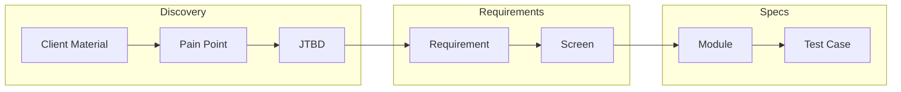

# /productspecs-finalize - Validate Traceability Chains

## FIRST ACTION (MANDATORY)

Before doing ANYTHING else, run these commands:

```bash
# 1. Update session context
bash "$CLAUDE_PROJECT_DIR/.claude/hooks/session-update.sh" --project "{SystemName}" --stage "productspecs"

# 2. Log command start
bash .claude/hooks/log-lifecycle.sh command /productspecs-finalize instruction_start '{"stage": "productspecs", "method": "instruction-based"}'
```

## Rules Loading (On-Demand)

This command requires traceability rules for module/test ID management:

```bash
# Load Traceability rules (includes module ID format MOD-XXX-XXX-NN)
/rules-traceability
```

## Arguments

- `$ARGUMENTS` - Required: `<SystemName>`

## Prerequisites

- `/productspecs-tests <SystemName>` completed (Checkpoint 6 passed)

## Skills Used

This command validates the complete traceability chain:

```
CM (Client Material) → PP (Pain Point) → JTBD → REQ → Screen → Module → Test
```

## Execution Steps

### Step 1: Verify Checkpoint 6

```bash
python3 .claude/hooks/productspecs_quality_gates.py --validate-checkpoint 6 --dir ProductSpecs_<SystemName>/
```

If not passed, show error and exit.

### Step 2: Load All Registries

```python
# From shared _state/ at ROOT level
config = json.load("_state/productspecs_config.json")
discovery_summary = json.load("_state/discovery_summary.json")
requirements_registry = json.load("_state/requirements_registry.json")

# From ProductSpecs registry
output_path = config["output_path"]
modules = json.load(f"{output_path}/_registry/modules.json")
requirements = json.load(f"{output_path}/_registry/requirements.json")
nfrs = json.load(f"{output_path}/_registry/nfrs.json")
traceability = json.load(f"{output_path}/_registry/traceability.json")
test_cases = json.load(f"{output_path}/_registry/test-cases.json")
```

### Step 3: Validate P0 Traceability Chains

For each P0 requirement, verify complete chain:

```python
p0_validation = []

for req in requirements["requirements"]:
    if req["priority"] != "P0":
        continue

    chain = {
        "requirement": req["id"],
        "title": req["title"],
        "links": {
            "pain_points": req.get("pain_point_refs", []),
            "jtbds": req.get("jtbd_refs", []),
            "screens": req.get("screen_refs", []),
            "modules": find_modules_for_req(req["id"]),
            "tests": find_tests_for_req(req["id"])
        },
        "complete": False,
        "gaps": []
    }

    # Check each link
    if not chain["links"]["pain_points"]:
        chain["gaps"].append("Missing pain point reference")
    if not chain["links"]["jtbds"]:
        chain["gaps"].append("Missing JTBD reference")
    if not chain["links"]["screens"]:
        chain["gaps"].append("Missing screen reference")
    if not chain["links"]["modules"]:
        chain["gaps"].append("Missing module specification")
    if not chain["links"]["tests"]:
        chain["gaps"].append("Missing test coverage")

    chain["complete"] = len(chain["gaps"]) == 0
    p0_validation.append(chain)

# Calculate P0 coverage
p0_complete = sum(1 for c in p0_validation if c["complete"])
p0_total = len(p0_validation)
p0_coverage = (p0_complete / p0_total * 100) if p0_total > 0 else 0
```

### Step 4: Validate Cross-References

Verify all referenced IDs exist:

```python
cross_ref_errors = []

# Check pain point references
for pp_id in all_pain_point_refs:
    if not exists_in_discovery(pp_id, "pain_points"):
        cross_ref_errors.append(f"PP reference {pp_id} not found in discovery")

# Check JTBD references
for jtbd_id in all_jtbd_refs:
    if not exists_in_discovery(jtbd_id, "jtbds"):
        cross_ref_errors.append(f"JTBD reference {jtbd_id} not found in discovery")

# Check module references
for mod_id in all_module_refs:
    if not exists_in_modules(mod_id):
        cross_ref_errors.append(f"Module reference {mod_id} not found in specs")

# Check test references
for test_id in all_test_refs:
    if not exists_in_tests(test_id):
        cross_ref_errors.append(f"Test reference {test_id} not found in specs")
```

### Step 5: Calculate Coverage Metrics

```python
coverage = {
    "requirements": {
        "total": len(requirements["requirements"]),
        "p0_total": len([r for r in requirements["requirements"] if r["priority"] == "P0"]),
        "p0_traced": p0_complete,
        "p0_coverage_percent": p0_coverage,
        "p1_total": len([r for r in requirements["requirements"] if r["priority"] == "P1"]),
        "p2_total": len([r for r in requirements["requirements"] if r["priority"] == "P2"])
    },
    "modules": {
        "total": len(modules["modules"]),
        "with_tests": count_modules_with_tests,
        "coverage_percent": modules_coverage
    },
    "tests": {
        "total": len(test_cases["test_cases"]),
        "p0_total": len(test_cases["by_priority"]["P0"]),
        "requirements_covered": unique_requirements_with_tests
    },
    "traceability_chains": {
        "total": len(traceability["chains"]),
        "complete": len([c for c in traceability["chains"] if c["complete"]]),
        "incomplete": len([c for c in traceability["chains"] if not c["complete"]])
    }
}
```

### Step 6: Generate Traceability Matrix

Write `ProductSpecs_<SystemName>/00-overview/TRACEABILITY_MATRIX.md`:

```markdown
# Traceability Matrix

**System**: <SystemName>
**Generated**: <TIMESTAMP>
**Status**: ✅ Complete | ⚠️ Gaps Found

---

## P0 Requirements Traceability

| Req ID | Title | PP | JTBD | Screen | Module | Test | Status |
|--------|-------|----|----- |--------|--------|------|--------|
| REQ-001 | Search items | PP-1.1 | JTBD-1.1 | M-01 | MOD-INV-SEARCH-01 | TC-E2E-001 | ✅ |
| REQ-002 | View details | PP-1.1 | JTBD-1.2 | M-02 | MOD-INV-SEARCH-01 | TC-E2E-002 | ✅ |
| ... | ... | ... | ... | ... | ... | ... | ... |

---

## Coverage Summary

| Metric | Value |
|--------|-------|
| P0 Requirements | 18/18 (100%) |
| P1 Requirements | 18/20 (90%) |
| Modules with Tests | 12/12 (100%) |
| Complete Chains | 12/12 (100%) |

---

## Gap Analysis

### P0 Gaps (BLOCKING)

None ✅

### P1/P2 Gaps (Non-blocking)

| Req ID | Missing | Recommendation |
|--------|---------|----------------|
| REQ-025 | Test coverage | Add TC-E2E for workflow |
| REQ-030 | Module spec | Create MOD-INV-REPORT-01 |

---

## Chain Visualization


```

### Step 7: Generate Validation Report

Write `ProductSpecs_<SystemName>/00-overview/VALIDATION_REPORT.md`:

```markdown
# ProductSpecs Validation Report

**System**: <SystemName>
**Generated**: <TIMESTAMP>
**Overall Status**: ✅ PASSED | ❌ FAILED

---

## Executive Summary

| Check | Status | Details |
|-------|--------|---------|
| P0 Traceability | ✅ | 18/18 (100%) |
| Cross-References | ✅ | 0 broken links |
| Module Coverage | ✅ | 15/15 screens |
| Test Coverage | ✅ | 18/18 P0 requirements |

---

## Detailed Results

### 1. P0 Requirement Traceability

All P0 requirements have complete traceability chains:

| Req ID | Pain Point | JTBD | Screen | Module | Test |
|--------|------------|------|--------|--------|------|
| REQ-001 | ✅ PP-1.1 | ✅ JTBD-1.1 | ✅ M-01 | ✅ MOD-xxx | ✅ TC-E2E-001 |
| ... | ... | ... | ... | ... | ... |

### 2. Cross-Reference Validation

| Reference Type | Valid | Invalid | Details |
|----------------|-------|---------|---------|
| Pain Points | 12 | 0 | |
| JTBDs | 8 | 0 | |
| Screens | 15 | 0 | |
| Modules | 12 | 0 | |
| Tests | 107 | 0 | |

### 3. Coverage Metrics

| Metric | Target | Actual | Status |
|--------|--------|--------|--------|
| P0 Traceability | 100% | 100% | ✅ |
| P1 Traceability | 80% | 90% | ✅ |
| Module Coverage | 100% | 100% | ✅ |
| Test Coverage (P0) | 100% | 100% | ✅ |

---

## Recommendations

1. ✅ Ready for export to JIRA
2. Consider adding tests for remaining P1 requirements
3. Review P2 scope for potential deferral

---

## Sign-Off

| Role | Name | Date | Signature |
|------|------|------|-----------|
| Product Owner | | | |
| Tech Lead | | | |
| QA Lead | | | |
```

### Step 8: Update Final Traceability Registry

Write updated `ProductSpecs_<SystemName>/_registry/traceability.json`:

```json
{
  "$schema": "productspecs-traceability-v1",
  "$metadata": {
    "created_at": "<TIMESTAMP>",
    "updated_at": "<TIMESTAMP>",
    "validated_at": "<TIMESTAMP>",
    "validation_status": "passed"
  },
  "chains": [...],
  "coverage": {
    "pain_points_addressed": 12,
    "pain_points_total": 12,
    "jtbds_addressed": 8,
    "jtbds_total": 8,
    "p0_traced": 18,
    "p0_total": 18,
    "p0_coverage_percent": 100,
    "modules_with_tests": 12,
    "modules_total": 12,
    "tests_total": 107
  },
  "validation": {
    "p0_complete": true,
    "cross_refs_valid": true,
    "gaps": []
  }
}
```

### Step 9: Update Shared Traceability Register

Update `traceability/productspecs_traceability_register.json`:

```python
register = {
    "version": "1.0.0",
    "system_name": system_name,
    "validated_at": timestamp,
    "status": "validated",
    "links": {
        "discovery": f"ClientAnalysis_{system_name}",
        "prototype": f"Prototype_{system_name}",
        "productspecs": f"ProductSpecs_{system_name}"
    },
    "coverage": coverage,
    "chains": traceability["chains"]
}
```

### Step 10: Update Progress

Update `_state/productspecs_progress.json`:

```python
progress["phases"]["traceability"]["status"] = "completed"
progress["phases"]["traceability"]["completed_at"] = timestamp
progress["phases"]["traceability"]["outputs"] = [
    "00-overview/TRACEABILITY_MATRIX.md",
    "00-overview/VALIDATION_REPORT.md",
    "_registry/traceability.json"
]
progress["current_phase"] = 8
```

### Step 11: Validate Checkpoint 7

```bash
python3 .claude/hooks/productspecs_quality_gates.py --validate-checkpoint 7 --dir ProductSpecs_<SystemName>/
```

**CRITICAL**: If P0 coverage < 100%, this checkpoint BLOCKS.

### Step 12: Display Summary

```
═══════════════════════════════════════════════════════
  TRACEABILITY VALIDATION COMPLETE
═══════════════════════════════════════════════════════

  System:          <SystemName>

  Validation Results:
  ────────────────────────────────────────────────────
  │ Check              │ Status │ Details           │
  │────────────────────│────────│───────────────────│
  │ P0 Traceability    │ ✅     │ 18/18 (100%)      │
  │ Cross-References   │ ✅     │ 0 broken links    │
  │ Module Coverage    │ ✅     │ 15/15 screens     │
  │ Test Coverage      │ ✅     │ 18/18 P0 reqs     │

  Traceability Chains:
  • Complete:   12/12
  • Incomplete: 0

  Checkpoint 7:    ✅ PASSED

═══════════════════════════════════════════════════════

  Next Steps:
  • /productspecs-export     - Generate JIRA export
  • /productspecs-jira       - Generate JIRA files only
  • /productspecs            - Continue full generation

═══════════════════════════════════════════════════════
```

## Blocking Conditions

| Condition | Action |
|-----------|--------|
| P0 traceability < 100% | **BLOCK** - Must fix gaps |
| Broken cross-references | **BLOCK** - Must resolve |

## Outputs

| File | Location |
|------|----------|
| `TRACEABILITY_MATRIX.md` | `ProductSpecs_<SystemName>/00-overview/` |
| `VALIDATION_REPORT.md` | `ProductSpecs_<SystemName>/00-overview/` |
| `traceability.json` | `ProductSpecs_<SystemName>/_registry/` |
| `productspecs_traceability_register.json` | `traceability/` |

## Error Handling

| Error | Action |
|-------|--------|
| Checkpoint 6 not passed | **BLOCK** - Run /productspecs-tests |
| P0 gap found | **BLOCK** - Show gap, require fix |
| P1/P2 gap found | **WARN** - Log, continue |
| Broken reference | **BLOCK** - Show details |

## Related Commands

| Command | Description |
|---------|-------------|
| `/productspecs-tests` | Previous phase |
| `/productspecs-export` | Next phase |
| `/productspecs-jira` | JIRA export only |
| `/productspecs` | Full generation |
