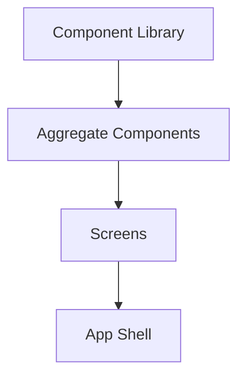
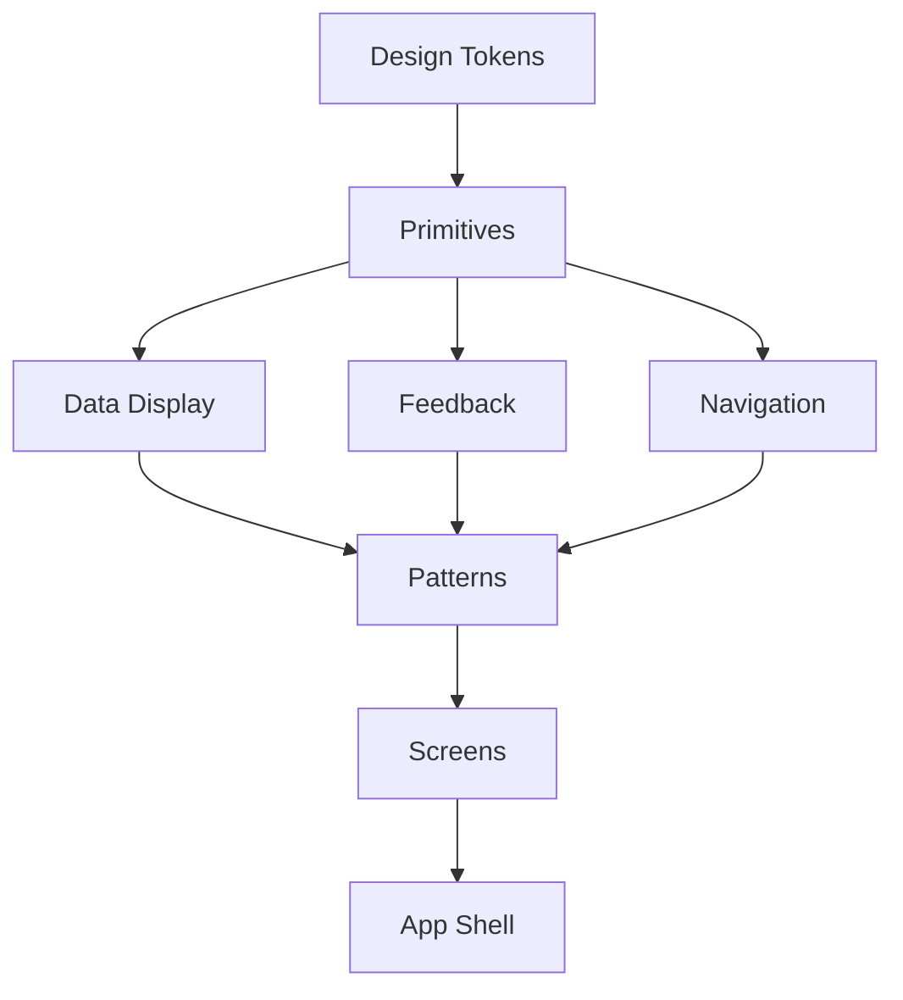

# /prototype-build - Sequencer & Code Generation (Phases 11-12)

## FIRST ACTION (MANDATORY)

Before doing ANYTHING else, run these commands:

```bash
# 1. Update session context
bash "$CLAUDE_PROJECT_DIR/.claude/hooks/session-update.sh" --project "{SystemName}" --stage "prototype"

# 2. Log command start
bash .claude/hooks/log-lifecycle.sh command /prototype-build instruction_start '{"stage": "prototype", "method": "instruction-based"}'
```

## Rules Loading (On-Demand)

This command requires Assembly-First and traceability rules:

```bash
# Assembly-First rules (loaded automatically in Prototype stage)
/_assembly_first_rules

# Traceability rules for ID management
/rules-traceability
```

## Arguments

- `$ARGUMENTS` - Required: `<SystemName>` or path to `Prototype_<SystemName>/`

## Prerequisites

- Phase 10 completed: Interaction specs exist
- Checkpoint 10 passed

## Assembly-First Mode Detection

**BEFORE execution**, check if Assembly-First mode is enabled:

```
1. Check if .claude/templates/component-library/ exists
2. Check if .claude/templates/component-library/manifests/components.json exists
3. Check if _state/prototype_config.json has assembly_first.enabled == true

IF all true:
  → ASSEMBLY_FIRST_MODE = ON
  → Read .claude/skills/Prototype_Builder/ASSEMBLY_FIRST_INTEGRATION.md
  → Follow Assembly-First workflow (library imports, no raw HTML)

ELSE:
  → ASSEMBLY_FIRST_MODE = OFF
  → Read .claude/skills/Prototype_Sequencer/SKILL.md
  → Read .claude/skills/Prototype_CodeGen/SKILL.md
  → Follow traditional workflow (generate all components)
```

## Skills Used

**Read BEFORE execution** (mode-dependent):

**IF Assembly-First Mode ON:**
- `.claude/skills/Prototype_Builder/ASSEMBLY_FIRST_INTEGRATION.md` (primary)
- `.claude/templates/component-library/SKILL.md` (usage protocol)
- `.claude/templates/component-library/INTERACTIONS.md` (state patterns)
- `.claude/commands/_assembly_first_rules.md` (enforcement checklist)
- `01-components/library-components/LIBRARY_REFERENCE.md` (component mapping)
- `02-screens/*/component-usage.md` (per-screen usage guides)

**IF Assembly-First Mode OFF:**
- `.claude/skills/Prototype_Sequencer/SKILL.md` (Phase 11)
- `.claude/skills/Prototype_CodeGen/SKILL.md` (Phase 12)

---

## Execution Flow (Assembly-First Mode ON)

```
READ .claude/commands/_assembly_first_rules.md AS rules
READ .claude/templates/component-library/SKILL.md AS lib_protocol
READ .claude/templates/component-library/INTERACTIONS.md AS lib_interactions
READ 01-components/library-components/LIBRARY_REFERENCE.md AS lib_mapping

STORE for use during code generation:
  - forbidden_practices[] (raw HTML elements, manual ARIA)
  - required_practices[] (imports from @/component-library, render props, tokens)
  - component_mapping{} (requirement → component)

LOG: "✅ Assembly-First rules loaded for code generation"
```

---

### Phase 11: Build Sequence (Checkpoint 11) - Assembly-First

#### Step 11.1: Load Inputs

Read:
- `01-components/library-components/LIBRARY_REFERENCE.md`
- `01-components/aggregates/*.md`
- `02-screens/screen-index.md`
- `02-screens/*/component-usage.md` (all screens)
- `_state/requirements_registry.json`

#### Step 11.2: Update Progress

```json
{
  "current_phase": 11,
  "phases": {
    "sequencer": {
      "status": "in_progress",
      "started_at": "<timestamp>",
      "mode": "assembly_first"
    }
  }
}
```

#### Step 11.3: Execute Build Sequencing (Assembly-First)

**Key Difference:** Library components are NOT generated, only imported.

1. **Simplified Dependencies**:
   - Library components: Already built (skip)
   - Aggregate components: Need generation
   - Screens: Need generation (using library + aggregates)
   - App shell: Standard

2. **Create Build Order (Simplified)**:
   ```
   Phase A: Foundation (tokens, styles) - SAME
   Phase B: Aggregate Components - GENERATE ONLY
   Phase C: Screens - GENERATE (use library + aggregates)
   Phase D: App Shell - STANDARD
   ```

3. **Generate Implementation Prompts** (Assembly-First specific):
   - Each prompt includes:
     - Component library import instructions
     - Assembly-First rules reminder
     - Forbidden practices list
     - Required practices list

#### Step 11.4: Generate Build Sequence (Assembly-First)

Create `04-implementation/build-sequence.md`:

```markdown
# Build Sequence (Assembly-First Mode)

## Overview

**Mode:** Assembly-First - Using pre-built component library
**Library:** 62 accessible components from `.claude/templates/component-library/`
**Token Savings:** ~5x vs traditional

## Dependency Graph (Simplified)



## Build Order

### Phase A: Foundation (Batch 1)

| Order | Component | Dependencies | Est. Complexity |
|-------|-----------|--------------|-----------------|
| A.1 | Install @/component-library | none | Low |
| A.2 | Configure Tailwind theme tokens | Design Tokens | Low |
| A.3 | Setup library aliases | package.json | Low |

### Phase B: Aggregate Components (Batch 2)

| Order | Component | Dependencies | Est. Complexity |
|-------|-----------|--------------|-----------------|
| B.1 | KPICard | Library: Meter, Heading, Text, Badge | Medium |
| B.2 | TaskListItem | Library: Checkbox, Text, Menu, Button | Medium |
| B.3 | UserProfileCard | Library: Avatar, Heading, Text, Badge | Low |

**Note:** Only custom aggregates generated. All other components imported from library.

### Phase C: Screens (Batch 3)

| Order | Screen | Dependencies | Est. Complexity |
|-------|--------|--------------|-----------------|
| C.1 | Dashboard | Library + KPICard | High |
| C.2 | Inventory List | Library + TaskListItem | High |
| C.3 | Inventory Detail | Library components | Medium |
| C.4 | Stock Movement | Library components | Medium |
| C.5 | Reports | Library components | High |
| C.6 | Settings | Library components | Medium |

### Phase D: App Shell (Batch 4)

| Order | Item | Dependencies | Est. Complexity |
|-------|------|--------------|-----------------|
| D.1 | Router Setup | All screens | Low |
| D.2 | App Layout | Library: Header, NavigationMenu | Low |
| D.3 | Auth Mock | none | Low |
| D.4 | Data Providers | Test data | Medium |

## Assembly-First Rules (MANDATORY)

All code generation MUST follow these rules:

### ✅ REQUIRED

1. **Imports from component library:**
   ```tsx
   import { Button, TextField, Form, Table } from '@/component-library';
   ```

2. **Use render props for state:**
   ```tsx
   <Button
     className={({ isPressed, isHovered, isPending }) =>
       `px-4 py-2 ${isPressed ? 'bg-accent-active' : 'bg-accent-default'}`
     }
   >
     Submit
   </Button>
   ```

3. **Use Tailwind theme tokens:**
   ```tsx
   className="bg-surface-1 text-primary accent-default"
   ```

### ❌ FORBIDDEN

1. **No raw HTML interactive elements:**
   ```tsx
   // ❌ WRONG
   <button onClick={handleClick}>Submit</button>
   <input type="text" onChange={handleChange} />

   // ✅ CORRECT
   import { Button, TextField } from '@/component-library';
   <Button onPress={handleClick}>Submit</Button>
   <TextField onChange={handleChange} />
   ```

2. **No manual ARIA attributes:**
   ```tsx
   // ❌ WRONG
   <div role="button" aria-label="Close">X</div>

   // ✅ CORRECT
   import { Button } from '@/component-library';
   <Button aria-label="Close"><CloseIcon /></Button>
   ```

3. **No custom CSS for library components:**
   Use library variants and Tailwind utilities only.

## Critical Path (Assembly-First)

```
Component Library Setup → Aggregate Components → Screens → App Shell
```

**Time Savings:** ~70% faster than traditional approach.
```

#### Step 11.5: Validate Checkpoint 11

```bash
python3 .claude/hooks/prototype_quality_gates.py --validate-checkpoint 11 --dir Prototype_<SystemName>/
```

#### Step 11.6: Update Progress

Mark phase 11 completed, move to phase 12.

---

### Phase 12: Code Generation (Checkpoint 12) - Assembly-First

#### Step 12.1: Update Progress

```json
{
  "current_phase": 12,
  "phases": {
    "codegen": {
      "status": "in_progress",
      "started_at": "<timestamp>",
      "mode": "assembly_first"
    }
  }
}
```

#### Step 12.2: Execute Code Generation (Assembly-First)

Follow build sequence with Assembly-First enforcement:

1. **Initialize Project**:

   ```bash
   cd Prototype_<SystemName>/prototype
   npm create vite@latest . -- --template react-ts
   npm install
   npm install -D tailwindcss postcss autoprefixer
   npx tailwindcss init -p

   # Install component library
   npm install react-aria-components
   npm install tailwindcss-react-aria-components

   npm install react-router-dom
   npm install @tanstack/react-query
   npm install date-fns
   ```

2. **Configure Tailwind with Theme Tokens**:

   `tailwind.config.js`:
   ```javascript
   /** @type {import('tailwindcss').Config} */
   export default {
     content: [
       "./index.html",
       "./src/**/*.{js,ts,jsx,tsx}",
     ],
     theme: {
       extend: {
         colors: {
           // Semantic tokens from design-tokens.json
           canvas: 'var(--color-canvas)',
           'surface-1': 'var(--color-surface-1)',
           'surface-2': 'var(--color-surface-2)',
           primary: 'var(--color-text-primary)',
           secondary: 'var(--color-text-secondary)',
           'accent-default': 'var(--color-accent-default)',
           'accent-hover': 'var(--color-accent-hover)',
           'accent-active': 'var(--color-accent-active)',
           border: 'var(--color-border-default)',
           // ... other tokens
         },
       },
     },
     plugins: [
       require('tailwindcss-react-aria-components')
     ],
   }
   ```

3. **Setup Component Library Alias**:

   `vite.config.ts`:
   ```typescript
   import { defineConfig } from 'vite'
   import react from '@vitejs/plugin-react'
   import path from 'path'

   export default defineConfig({
     plugins: [react()],
     resolve: {
       alias: {
         '@': path.resolve(__dirname, './src'),
         '@/component-library': 'react-aria-components',
       },
     },
   })
   ```

4. **Create Folder Structure (Simplified)**:

   ```
   prototype/
   ├── src/
   │   ├── components/
   │   │   └── aggregates/         # ONLY aggregates
   │   │       ├── KPICard.tsx
   │   │       ├── TaskListItem.tsx
   │   │       └── index.ts
   │   ├── pages/                  # Screens using library
   │   │   ├── Dashboard.tsx
   │   │   ├── InventoryList.tsx
   │   │   └── ...
   │   ├── hooks/
   │   ├── lib/
   │   │   └── utils.ts
   │   ├── styles/
   │   │   └── globals.css         # CSS variables
   │   ├── data/
   │   │   └── mock/
   │   ├── App.tsx
   │   └── main.tsx
   ├── public/
   ├── package.json
   └── vite.config.ts
   ```

5. **Generate Aggregate Components** (Only custom aggregates):

   Example `src/components/aggregates/KPICard.tsx`:
   ```tsx
   import { Meter, Heading, Text } from '@/component-library';
   import { cn } from '@/lib/utils';

   interface KPICardProps {
     label: string;
     value: number;
     trend?: { direction: 'up' | 'down'; value: number };
     icon?: React.ReactNode;
     variant?: 'default' | 'primary' | 'success' | 'warning' | 'danger';
   }

   export function KPICard({ label, value, trend, icon, variant = 'default' }: KPICardProps) {
     return (
       <div className={cn(
         'rounded-lg p-6 bg-surface-1 border border-border',
         {
           'border-accent-default': variant === 'primary',
           'border-green-500': variant === 'success',
           'border-yellow-500': variant === 'warning',
           'border-red-500': variant === 'danger',
         }
       )}>
         <div className="flex items-center justify-between mb-4">
           <Heading level={3} className="text-sm font-medium text-secondary">
             {label}
           </Heading>
           {icon && <div className="text-accent-default">{icon}</div>}
         </div>

         <Meter
           value={value}
           maxValue={100}
           className="mb-2"
         />

         <div className="flex items-baseline justify-between">
           <Text className="text-3xl font-bold text-primary">{value}</Text>
           {trend && (
             <Text className={cn(
               'text-sm font-medium',
               trend.direction === 'up' ? 'text-green-600' : 'text-red-600'
             )}>
               {trend.direction === 'up' ? '↑' : '↓'} {trend.value}%
             </Text>
           )}
         </div>
       </div>
     );
   }
   ```

6. **Generate Screens** (Using library + aggregates):

   Example `src/pages/Dashboard.tsx`:
   ```tsx
   import { Header, NavigationMenu, Table, TableHeader, TableBody, TableColumn, TableRow, TableCell, Button } from '@/component-library';
   import { KPICard } from '@/components/aggregates';
   import { useQuery } from '@tanstack/react-query';

   export function Dashboard() {
     const { data: stats, isLoading } = useQuery({
       queryKey: ['dashboard-stats'],
       queryFn: fetchDashboardStats,
     });

     return (
       <div className="min-h-screen bg-canvas">
         <Header
           logo={<Logo />}
           user={{ name: 'John Doe', avatar: '/avatar.jpg' }}
         />

         <div className="flex">
           <NavigationMenu
             items={[
               { id: 'dashboard', label: 'Dashboard', href: '/' },
               { id: 'inventory', label: 'Inventory', href: '/inventory' },
             ]}
             defaultOpen="dashboard"
           />

           <main className="flex-1 p-8">
             {/* KPI Cards Row */}
             <div className="grid grid-cols-1 md:grid-cols-2 lg:grid-cols-4 gap-6 mb-8">
               <KPICard
                 label="Total Items"
                 value={stats?.totalItems ?? 0}
                 trend={{ direction: 'up', value: 5.2 }}
                 variant="primary"
               />
               <KPICard
                 label="Low Stock"
                 value={stats?.lowStock ?? 0}
                 variant="warning"
               />
               <KPICard
                 label="Today's Movements"
                 value={stats?.movements ?? 0}
               />
               <KPICard
                 label="Pending Orders"
                 value={stats?.pendingOrders ?? 0}
               />
             </div>

             {/* Low Stock Alerts Table */}
             <div className="bg-surface-1 rounded-lg border border-border p-6">
               <h2 className="text-lg font-semibold mb-4">Low Stock Alerts</h2>
               <Table aria-label="Low stock alerts">
                 <TableHeader>
                   <TableColumn key="sku">SKU</TableColumn>
                   <TableColumn key="name">Name</TableColumn>
                   <TableColumn key="quantity">Quantity</TableColumn>
                   <TableColumn key="actions">Actions</TableColumn>
                 </TableHeader>
                 <TableBody items={stats?.lowStockItems ?? []}>
                   {(item) => (
                     <TableRow key={item.id}>
                       <TableCell>{item.sku}</TableCell>
                       <TableCell>{item.name}</TableCell>
                       <TableCell>{item.quantity}</TableCell>
                       <TableCell>
                         <Button size="sm" variant="secondary">
                           Reorder
                         </Button>
                       </TableCell>
                     </TableRow>
                   )}
                 </TableBody>
               </Table>
             </div>
           </main>
         </div>
       </div>
     );
   }
   ```

   **Key Points:**
   - ✅ All imports from `@/component-library`
   - ✅ No raw HTML interactive elements
   - ✅ Uses Tailwind theme tokens (`bg-canvas`, `text-primary`, etc.)
   - ✅ Library handles all accessibility
   - ✅ Focus on business logic and data fetching

7. **Setup Router** (Standard):

   `src/App.tsx`:
   ```tsx
   import { BrowserRouter, Routes, Route } from 'react-router-dom';
   import { Dashboard } from './pages/Dashboard';
   import { InventoryList } from './pages/InventoryList';
   // ... other imports

   export function App() {
     return (
       <BrowserRouter>
         <Routes>
           <Route path="/" element={<Dashboard />} />
           <Route path="/inventory" element={<InventoryList />} />
           <Route path="/inventory/:id" element={<InventoryDetail />} />
           {/* ... other routes */}
         </Routes>
       </BrowserRouter>
     );
   }
   ```

8. **Add Mock Data** (Standard):

   Copy test data from `04-implementation/test-data/` to `src/data/mock/`.

9. **Build and Validate**:

   ```bash
   npm run build
   ```

   **If build fails, check for:**
   - Raw HTML violations (`<button>`, `<input>`, etc.)
   - Manual ARIA attributes
   - Invalid imports
   - Missing library components

#### Step 12.3: Validate Assembly-First Compliance

```bash
# Scan for raw HTML elements
grep -r "<button\|<input\|<select\|<textarea" prototype/src/

# Scan for manual ARIA
grep -r "role=\|aria-label=\|aria-" prototype/src/

# Validate imports
grep -r "import.*from.*component-library" prototype/src/

# Run quality gate
python3 .claude/hooks/prototype_quality_gates.py --validate-checkpoint 12 --dir Prototype_<SystemName>/
```

**Validation Criteria (Assembly-First):**
- ✅ No raw HTML interactive elements
- ✅ All component imports from `@/component-library`
- ✅ No manual ARIA attributes (except icon-only buttons)
- ✅ `npm run build` succeeds
- ✅ All screens implemented
- ✅ Aggregate components follow composition pattern

**If violations found:**
- Log to `_state/FAILURES_LOG.md`
- **BLOCK** deployment
- Provide fix instructions

#### Step 12.4: Update Progress

```json
{
  "current_phase": 13,
  "phases": {
    "codegen": {
      "status": "completed",
      "completed_at": "<timestamp>",
      "mode": "assembly_first",
      "validation": {
        "raw_html_check": "passed",
        "import_check": "passed",
        "aria_check": "passed",
        "build_check": "passed"
      }
    }
  }
}
```

---

## Final Summary (Assembly-First Mode)

```
═══════════════════════════════════════════════════════
  BUILD PHASES COMPLETE (11-12)
  Assembly-First Mode: ENABLED
═══════════════════════════════════════════════════════

  Phase 11 - Build Sequence:
  ├── Mode:                Assembly-First
  ├── Library Components:  62 (imported)
  ├── Aggregate Components: 5 (generated)
  ├── Screens:             6 (generated)
  └── Output:              04-implementation/build-sequence.md

  Phase 12 - Code Generation:
  ├── Aggregate Files:     5 files
  ├── Page Files:          6 files
  ├── Utilities:           3 files
  ├── Token Savings:       ~5x vs traditional
  ├── Assembly Validation: ✅ PASSED
  ├── Build Status:        ✅ Success
  └── Output:              prototype/

  Assembly-First Validation:
  ├── Raw HTML Check:      ✅ PASSED (0 violations)
  ├── Import Check:        ✅ PASSED (all from library)
  ├── ARIA Check:          ✅ PASSED (no manual attributes)
  └── Build Check:         ✅ PASSED

  Checkpoints:             11 ✅  12 ✅

═══════════════════════════════════════════════════════

  To run the prototype:
  cd Prototype_<SystemName>/prototype && npm run dev

  Next: /prototype-qa or /prototype <SystemName>

═══════════════════════════════════════════════════════
```

---

## Execution Flow (Assembly-First Mode OFF - Traditional)

---

### Phase 11: Build Sequence (Checkpoint 11)

#### Step 11.1: Load Inputs

Read:
- `01-components/component-index.md`
- `02-screens/screen-index.md`
- `_state/requirements_registry.json`

#### Step 11.2: Update Progress

```json
{
  "current_phase": 11,
  "phases": {
    "sequencer": {
      "status": "in_progress",
      "started_at": "<timestamp>"
    }
  }
}
```

#### Step 11.3: Execute Prototype_Sequencer Skill

1. **Analyze Dependencies**:
   - Map component dependencies
   - Map screen dependencies on components
   - Identify shared utilities

2. **Create Build Order (DAG)**:
   - Foundation first (tokens, styles)
   - Primitives
   - Composite components
   - Patterns
   - Screens
   - Routes and app shell

3. **Generate Implementation Prompts**:
   - Prompt per component/screen
   - Include context and requirements

#### Step 11.4: Generate Build Sequence

Create `04-implementation/build-sequence.md`:

```markdown
# Build Sequence

## Overview

This document defines the order in which prototype components and screens should be implemented.

## Dependency Graph



## Build Order

### Phase A: Foundation (Batch 1)

| Order | Component | Dependencies | Est. Complexity |
|-------|-----------|--------------|-----------------|
| A.1 | Design Tokens Setup | none | Low |
| A.2 | Tailwind Config | Design Tokens | Low |
| A.3 | Global Styles | Tailwind | Low |

### Phase B: Primitives (Batch 2)

| Order | Component | Dependencies | Est. Complexity |
|-------|-----------|--------------|-----------------|
| B.1 | Button | Tokens | Low |
| B.2 | Input | Tokens | Low |
| B.3 | Select | Tokens, Input | Medium |
| B.4 | Checkbox | Tokens | Low |
| B.5 | Badge | Tokens | Low |
| B.6 | Avatar | Tokens | Low |
| B.7 | Icon | none | Low |

### Phase C: Data Display (Batch 3)

| Order | Component | Dependencies | Est. Complexity |
|-------|-----------|--------------|-----------------|
| C.1 | Card | Tokens | Low |
| C.2 | Stat | Card | Low |
| C.3 | List | Tokens | Low |
| C.4 | Table | Tokens, Checkbox | Medium |
| C.5 | Empty State | Tokens | Low |

### Phase D: Feedback (Batch 4)

| Order | Component | Dependencies | Est. Complexity |
|-------|-----------|--------------|-----------------|
| D.1 | Alert | Tokens, Icon | Low |
| D.2 | Toast | Tokens, Icon | Medium |
| D.3 | Spinner | Tokens | Low |
| D.4 | Skeleton | Tokens | Low |
| D.5 | Progress | Tokens | Low |

### Phase E: Navigation (Batch 5)

| Order | Component | Dependencies | Est. Complexity |
|-------|-----------|--------------|-----------------|
| E.1 | Sidebar | Tokens, Icon | Medium |
| E.2 | Header | Tokens, Avatar, Icon | Medium |
| E.3 | Breadcrumb | Tokens, Icon | Low |
| E.4 | Tabs | Tokens | Medium |
| E.5 | Pagination | Tokens, Button | Low |

### Phase F: Overlays (Batch 6)

| Order | Component | Dependencies | Est. Complexity |
|-------|-----------|--------------|-----------------|
| F.1 | Dropdown | Tokens | Medium |
| F.2 | Tooltip | Tokens | Low |
| F.3 | Modal | Tokens, Button | Medium |
| F.4 | Drawer | Tokens | Medium |

### Phase G: Patterns (Batch 7)

| Order | Component | Dependencies | Est. Complexity |
|-------|-----------|--------------|-----------------|
| G.1 | Form | Input, Select, Button | Medium |
| G.2 | Search | Input, Icon | Low |
| G.3 | Filter | Select, Button | Medium |
| G.4 | Data Table | Table, Pagination, Search | High |
| G.5 | Dashboard Card | Card, Stat | Low |

### Phase H: Screens (Batch 8)

| Order | Screen | Dependencies | Est. Complexity |
|-------|--------|--------------|-----------------|
| H.1 | Dashboard | All components | High |
| H.2 | Inventory List | Data Table, Filter | High |
| H.3 | Inventory Detail | Card, Form | Medium |
| H.4 | Stock Movement | Form, Modal | Medium |
| H.5 | Reports | Data Table, Chart | High |
| H.6 | Settings | Form, Tabs | Medium |

### Phase I: App Shell (Batch 9)

| Order | Item | Dependencies | Est. Complexity |
|-------|------|--------------|-----------------|
| I.1 | Router Setup | All screens | Low |
| I.2 | App Layout | Header, Sidebar | Low |
| I.3 | Auth Mock | none | Low |
| I.4 | Data Providers | Test data | Medium |

## Implementation Prompts

Located in `04-implementation/prompts/`:
- `README.md` (prompt index and usage guide)
- `00-setup-prompt.md`
- `01-auth-layout-prompt.md`
- `02-catalog-prompt.md`
- `03-core-crud-prompt.md`
- ... (one per phase 00-10)

## Phase Sequences

Located in `04-implementation/sequence/`:
- `phase-00-setup.md` through `phase-10-polish.md`

## Checkpoints

Located in `04-implementation/checkpoints/`:
- `checkpoint-01-foundation.md` (after Phase 02)
- `checkpoint-02-core-functionality.md` (after Phase 05)
- `checkpoint-03-dashboards.md` (after Phase 07)
- `checkpoint-04-production-ready.md` (after Phase 10)

## Critical Path

```
Design Tokens → Button → Card → Stat → Dashboard Card → Dashboard Screen
```

This path determines minimum time to first screen.
```

#### Step 11.5: Validate Checkpoint 11

```bash
python3 .claude/hooks/prototype_quality_gates.py --validate-checkpoint 11 --dir Prototype_<SystemName>/
```

#### Step 11.6: Update Progress

Mark phase 11 completed, move to phase 12.

---

### Phase 12: Code Generation (Checkpoint 12)

#### Step 12.1: Update Progress

```json
{
  "current_phase": 12,
  "phases": {
    "codegen": {
      "status": "in_progress",
      "started_at": "<timestamp>"
    }
  }
}
```

#### Step 12.2: Execute Prototype_CodeGen Skill

Follow build sequence to generate code:

1. **Initialize Project**:

   ```bash
   cd Prototype_<SystemName>/prototype
   npm create vite@latest . -- --template react-ts
   npm install
   npm install -D tailwindcss postcss autoprefixer
   npx tailwindcss init -p
   npm install @headlessui/react @heroicons/react
   npm install react-router-dom
   npm install @tanstack/react-query
   npm install date-fns
   ```

2. **Configure Tailwind**:

   `tailwind.config.js`:
   ```javascript
   /** @type {import('tailwindcss').Config} */
   export default {
     content: [
       "./index.html",
       "./src/**/*.{js,ts,jsx,tsx}",
     ],
     theme: {
       extend: {
         // Import from design-tokens.json
         colors: { /* ... */ },
         fontFamily: { /* ... */ },
         spacing: { /* ... */ },
       },
     },
     plugins: [],
   }
   ```

3. **Create Folder Structure**:

   ```
   prototype/
   ├── src/
   │   ├── components/
   │   │   ├── primitives/
   │   │   ├── data-display/
   │   │   ├── feedback/
   │   │   ├── navigation/
   │   │   ├── overlays/
   │   │   └── patterns/
   │   ├── pages/
   │   ├── hooks/
   │   ├── lib/
   │   ├── styles/
   │   ├── data/
   │   │   └── mock/
   │   ├── App.tsx
   │   └── main.tsx
   ├── public/
   ├── package.json
   └── vite.config.ts
   ```

4. **Generate Components** (per build sequence):

   For each component:
   - Create component file
   - Add props interface
   - Implement component with Tailwind classes
   - Export from index.ts

   Example `src/components/primitives/Button.tsx`:
   ```tsx
   import { ButtonHTMLAttributes, forwardRef } from 'react';
   import { cn } from '@/lib/utils';

   interface ButtonProps extends ButtonHTMLAttributes<HTMLButtonElement> {
     variant?: 'primary' | 'secondary' | 'ghost';
     size?: 'sm' | 'md' | 'lg';
     loading?: boolean;
   }

   export const Button = forwardRef<HTMLButtonElement, ButtonProps>(
     ({ className, variant = 'primary', size = 'md', loading, children, disabled, ...props }, ref) => {
       return (
         <button
           ref={ref}
           className={cn(
             'inline-flex items-center justify-center rounded-md font-medium transition-colors',
             'focus-visible:outline-none focus-visible:ring-2 focus-visible:ring-offset-2',
             'disabled:pointer-events-none disabled:opacity-50',
             {
               'bg-primary-600 text-white hover:bg-primary-700': variant === 'primary',
               'bg-neutral-100 text-neutral-900 hover:bg-neutral-200': variant === 'secondary',
               'hover:bg-neutral-100': variant === 'ghost',
               'h-8 px-3 text-sm': size === 'sm',
               'h-10 px-4 text-sm': size === 'md',
               'h-12 px-6 text-base': size === 'lg',
             },
             className
           )}
           disabled={disabled || loading}
           {...props}
         >
           {loading && <Spinner className="mr-2 h-4 w-4" />}
           {children}
         </button>
       );
     }
   );
   ```

5. **Generate Screens** (per screen specs):

   For each screen:
   - Create page component
   - Import required components
   - Implement layout per layout.md
   - Add data fetching per data-requirements.md

6. **Setup Router**:

   `src/App.tsx`:
   ```tsx
   import { BrowserRouter, Routes, Route } from 'react-router-dom';
   import { AppLayout } from './components/patterns/AppLayout';
   import { Dashboard } from './pages/Dashboard';
   import { InventoryList } from './pages/InventoryList';
   // ... other imports

   export function App() {
     return (
       <BrowserRouter>
         <Routes>
           <Route element={<AppLayout />}>
             <Route path="/" element={<Dashboard />} />
             <Route path="/inventory" element={<InventoryList />} />
             <Route path="/inventory/:id" element={<InventoryDetail />} />
             {/* ... other routes */}
           </Route>
         </Routes>
       </BrowserRouter>
     );
   }
   ```

7. **Add Mock Data**:

   Copy test data from `04-implementation/test-data/` to `src/data/mock/`.

8. **Build and Test**:

   ```bash
   npm run build
   npm run dev
   ```

#### Step 12.3: Validate Checkpoint 12

```bash
python3 .claude/hooks/prototype_quality_gates.py --validate-checkpoint 12 --dir Prototype_<SystemName>/
```

**Validation Criteria**:
- `prototype/package.json` exists
- `prototype/src/App.tsx` exists
- `prototype/src/components/` has files
- `npm run build` succeeds (or document why it failed)

#### Step 12.4: Update Progress

Mark phase 12 completed.

---

## Final Summary

```
═══════════════════════════════════════════════════════
  BUILD PHASES COMPLETE (11-12)
═══════════════════════════════════════════════════════

  Phase 11 - Build Sequence:
  ├── Batches:             9
  ├── Components:          35
  ├── Screens:             6
  └── Output:              04-implementation/build-sequence.md

  Phase 12 - Code Generation:
  ├── Components:          35 files
  ├── Pages:               6 files
  ├── Utilities:           5 files
  ├── Build Status:        ✅ Success / ⚠️ With warnings
  └── Output:              prototype/

  Checkpoints:             11 ✅  12 ✅

═══════════════════════════════════════════════════════

  To run the prototype:
  cd Prototype_<SystemName>/prototype && npm run dev

  Next: /prototype-qa or /prototype <SystemName>

═══════════════════════════════════════════════════════
```

## Outputs

| File/Folder | Phase | Purpose |
|-------------|-------|---------|
| `04-implementation/build-sequence.md` | 11 | Implementation order |
| `04-implementation/prompts/` | 11 | Generation prompts |
| `prototype/` | 12 | Working React application |

## Error Handling

| Error | Action |
|-------|--------|
| Interaction specs missing | **BLOCK** - Run /prototype-interactions |
| npm install fails | Log error, provide manual instructions |
| Component generation fails | Log, skip to next component |
| Build fails | Log errors, continue to QA |

## Related Commands

| Command | Description |
|---------|-------------|
| `/prototype-interactions` | Run Phase 10 |
| `/prototype-qa` | Run Phases 13-14 |
| `/prototype-serve` | Start development server |
| `/prototype` | Run full prototype |

## Outputs
