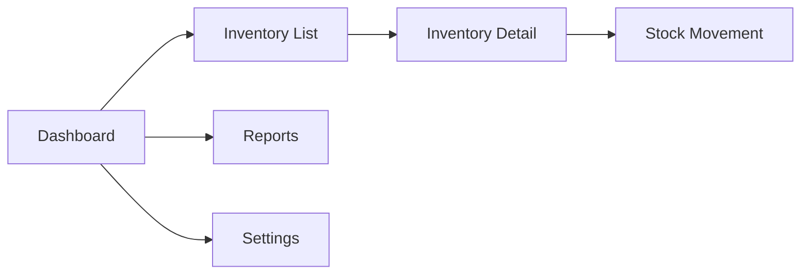

## FIRST ACTION (MANDATORY)

Before doing ANYTHING else, run these commands:

```bash
# 1. Update session context
bash "$CLAUDE_PROJECT_DIR/.claude/hooks/session-update.sh" --project "{SystemName}" --stage "prototype"

# 2. Log command start
bash .claude/hooks/log-lifecycle.sh command /prototype-screens instruction_start '{"stage": "prototype", "method": "instruction-based"}'
```

## Rules Loading (On-Demand)

This command requires Assembly-First rules (loaded automatically when in Prototype stage):

```bash
# Assembly-First rules are auto-loaded in Prototype stage
# If not loaded, explicitly load:
/_assembly_first_rules

# Traceability rules for ID management
/rules-traceability
```

## Arguments

- `$ARGUMENTS` - Required: `<SystemName>` or path to `Prototype_<SystemName>/`

## Prerequisites

- Phase 8 completed: Component library exists
- Checkpoint 8 passed

## Assembly-First Mode Detection

**BEFORE execution**, check if Assembly-First mode is enabled:

```
1. Check if .claude/templates/component-library/ exists
2. Check if .claude/templates/component-library/manifests/components.json exists
3. Check if _state/prototype_config.json has assembly_first.enabled == true

IF all true:
  → ASSEMBLY_FIRST_MODE = ON
  → Read .claude/skills/Prototype_Screens/ASSEMBLY_FIRST_INTEGRATION.md
  → Follow Assembly-First workflow (component composition + usage docs)

ELSE:
  → ASSEMBLY_FIRST_MODE = OFF
  → Read .claude/skills/Prototype_Screens/SKILL.md
  → Follow traditional workflow (standard screen specs)
```

## Skills Used

**Read BEFORE execution** (mode-dependent):

**IF Assembly-First Mode ON:**
- `.claude/skills/Prototype_Screens/ASSEMBLY_FIRST_INTEGRATION.md` (primary)
- `.claude/templates/component-library/manifests/components.json` (component registry)
- `01-components/library-components/LIBRARY_REFERENCE.md` (component mapping)
- `01-components/aggregates/*.md` (aggregate components)
- `.claude/commands/_assembly_first_rules.md` (enforcement checklist)

**IF Assembly-First Mode OFF:**
- `.claude/skills/Prototype_Screens/SKILL.md` (traditional workflow)

---

## Execution Steps (Assembly-First Mode ON)

When Assembly-First mode is enabled, follow the workflow in `ASSEMBLY_FIRST_INTEGRATION.md`:

### Step 0.5: Read Component Library (MANDATORY BLOCKING)

```
READ 01-components/library-components/LIBRARY_REFERENCE.md AS lib_mapping
READ 01-components/aggregates/*.md AS aggregates
READ .claude/templates/component-library/manifests/components.json AS lib_components

VERIFY lib_components has 62+ components
VERIFY lib_mapping exists

LOG: "✅ Assembly-First mode enabled: Using component library for screens"
```

### Step 1: Load Inputs

Read:
- `_state/discovery_summary.json` (screens array)
- `_state/requirements_registry.json` (screen_refs)
- `ClientAnalysis_<SystemName>/04-design-specs/screen-definitions.md`
- `01-components/library-components/LIBRARY_REFERENCE.md`
- `01-components/aggregates/*.md`

### Step 2: Generate Screen Specifications (Component Composition)

For each screen from Discovery:

#### 2.1 Create Screen Folder with Assembly-First Structure

```
02-screens/
├── screen-index.md                   # Includes component usage matrix
└── dashboard/
    ├── specification.md              # Component composition from library
    ├── component-usage.md            # Detailed library component usage
    └── data-requirements.md          # API calls and state
```

#### 2.2 Generate specification.md (Component Composition)

```markdown
# Dashboard - Screen Specification

## Screen ID
SCR-001

## Route
`/dashboard`

## Purpose
Provide at-a-glance overview of inventory status and key metrics.

## Layout Structure

```
┌─────────────────────────────────────────────────────────┐
│ Header                                                   │
├─────────┬───────────────────────────────────────────────┤
│         │ ┌─────────┐ ┌─────────┐ ┌─────────┐ ┌───────┐│
│         │ │ KPICard │ │ KPICard │ │ KPICard │ │ KPI   ││
│ Sidebar │ │ (Agg)   │ │ (Agg)   │ │ (Agg)   │ │ Card  ││
│         │ └─────────┘ └─────────┘ └─────────┘ └───────┘│
│         │ ┌─────────────────────┐ ┌─────────────────────┐│
│         │ │                     │ │                     ││
│         │ │   Table (Library)   │ │   Chart (Lib)       ││
│         │ │                     │ │                     ││
│         │ └─────────────────────┘ └─────────────────────┘│
└─────────┴───────────────────────────────────────────────┘
```

## Component Composition

| Zone | Component | Source | Props |
|------|-----------|--------|-------|
| Header | Header | Library: Navigation | user, notifications |
| Sidebar | NavigationMenu | Library: Navigation | items, defaultOpen |
| Stats Row | KPICard | Aggregate | label, value, trend, icon |
| Table | Table | Library: Collections | data, columns, sorting |
| Chart | AreaChart | Library: Charts | data, categories, colors |

## Responsive Behavior

| Breakpoint | Changes |
|------------|---------|
| < 768px | Sidebar collapses, KPIs stack |
| < 1024px | Chart moves below table |
```

#### 2.3 Generate component-usage.md (Detailed Usage)

```markdown
# Dashboard - Component Usage Guide

## Library Components Used

### Header (from Navigation category)

**Import:**
```tsx
import { Header } from '@/component-library';
```

**Props Configuration:**
```tsx
<Header
  logo={<Logo />}
  user={{
    name: currentUser.name,
    avatar: currentUser.avatar
  }}
  notifications={{
    count: unreadCount,
    items: notifications
  }}
  onNotificationClick={handleNotificationClick}
/>
```

**Accessibility:** Built-in (React Aria), keyboard navigation automatic

---

### NavigationMenu (from Navigation category)

**Import:**
```tsx
import { NavigationMenu } from '@/component-library';
```

**Props Configuration:**
```tsx
<NavigationMenu
  items={[
    { id: 'dashboard', label: 'Dashboard', icon: <HomeIcon />, href: '/' },
    { id: 'inventory', label: 'Inventory', icon: <BoxIcon />, href: '/inventory' },
    { id: 'reports', label: 'Reports', icon: <ChartIcon />, href: '/reports' }
  ]}
  defaultOpen="dashboard"
  onSelectionChange={handleNavigationChange}
/>
```

**Accessibility:** WCAG AA compliant, auto-focus management

---

### Table (from Collections category)

**Import:**
```tsx
import { Table, TableHeader, TableBody, TableColumn, TableRow, TableCell } from '@/component-library';
```

**Props Configuration:**
```tsx
<Table
  aria-label="Low stock alerts"
  sortDescriptor={sortDescriptor}
  onSortChange={setSortDescriptor}
>
  <TableHeader>
    <TableColumn key="sku" allowsSorting>SKU</TableColumn>
    <TableColumn key="name" allowsSorting>Name</TableColumn>
    <TableColumn key="quantity" allowsSorting>Quantity</TableColumn>
  </TableHeader>
  <TableBody items={lowStockItems}>
    {(item) => (
      <TableRow key={item.id}>
        <TableCell>{item.sku}</TableCell>
        <TableCell>{item.name}</TableCell>
        <TableCell>{item.quantity}</TableCell>
      </TableRow>
    )}
  </TableBody>
</Table>
```

**State Management:** Uses render props for sort state
**Accessibility:** Built-in, screen reader support automatic

---

## Aggregate Components Used

### KPICard (Custom Aggregate)

**Import:**
```tsx
import { KPICard } from '@/components/aggregates';
```

**Composition:** Combines library components:
- Meter (from Status)
- Heading (from Content)
- Text (from Content)
- Badge (from Content)

**Props Configuration:**
```tsx
<KPICard
  label="Total Items"
  value={1234}
  trend={{ direction: 'up', value: 5.2 }}
  icon={<BoxIcon />}
  variant="primary"
/>
```

---

## Styling Approach

All components use Tailwind theme tokens:
- `bg-canvas` - Background
- `text-primary` - Primary text
- `accent-default` - Accent color
- `surface-1` - Card backgrounds

No raw HTML elements. No manual ARIA attributes.
```

#### 2.4 Generate data-requirements.md (API + State)

Standard data requirements file (same as traditional mode)

### Step 3: Generate Screen Index with Component Usage Matrix

Create `02-screens/screen-index.md` with additional Component Usage Matrix section:

```markdown
# Screen Index

## Overview

This document catalogs all screens in the <SystemName> prototype.

## Screen Inventory

| ID | Name | Type | Priority | Path |
|----|------|------|----------|------|
| SCR-001 | Dashboard | Overview | P0 | /dashboard |
| SCR-002 | Inventory List | List | P0 | /inventory |
...

## Component Usage Matrix

**Library Components:**

| Component | Category | Dashboard | Inventory | Detail | ... |
|-----------|----------|-----------|-----------|--------|-----|
| Header | Navigation | ✅ | ✅ | ✅ | ✅ |
| NavigationMenu | Navigation | ✅ | ✅ | ✅ | ✅ |
| Table | Collections | ✅ | ✅ | ❌ | ❌ |
| TextField | Forms | ❌ | ✅ | ✅ | ✅ |
| Button | Buttons | ✅ | ✅ | ✅ | ✅ |
| Badge | Content | ✅ | ✅ | ✅ | ❌ |
| AreaChart | Charts | ✅ | ❌ | ❌ | ❌ |

**Aggregate Components:**

| Component | Dashboard | Inventory | Detail | ... |
|-----------|-----------|-----------|--------|-----|
| KPICard | ✅ (4x) | ❌ | ❌ | ❌ |
| TaskListItem | ❌ | ✅ | ✅ | ❌ |

## Screen-to-Requirement Mapping

...
```

### Step 4: Update Traceability

Update `_state/requirements_registry.json`:
- Link screen_refs to requirements
- Add component_refs to screens

Update `traceability/prototype_traceability_register.json`:
- Add screens to `artifacts.screens`
- Add component usage to `artifacts.component_usage`
- Create trace chains: pain_point → jtbd → requirement → screen → component

### Step 5: Validate Checkpoint 9

```bash
python3 .claude/hooks/prototype_quality_gates.py --validate-checkpoint 9 --dir Prototype_<SystemName>/
```

**Validation Criteria (Assembly-First):**
- `02-screens/screen-index.md` exists with component usage matrix
- All screens have `specification.md`, `component-usage.md`, `data-requirements.md`
- All screens reference library or aggregate components
- No raw HTML elements mentioned in specifications
- Component usage matrix matches screen specs

### Step 6: Update Progress

```json
{
  "current_phase": 10,
  "phases": {
    "screens": {
      "status": "completed",
      "completed_at": "<timestamp>",
      "mode": "assembly_first",
      "library_components_used": 28,
      "aggregate_components_used": 5,
      "outputs": ["02-screens/screen-index.md", "02-screens/dashboard/", ...]
    }
  }
}
```

### Step 7: Display Summary

```
═══════════════════════════════════════════════════════
  SCREEN SPECIFICATIONS COMPLETE (Phase 9)
  Assembly-First Mode: ENABLED
═══════════════════════════════════════════════════════

  Screens Specified:

  │ ID       │ Name              │ Route                │
  ├──────────┼───────────────────┼──────────────────────┤
  │ SCR-001  │ Dashboard         │ /dashboard           │
  │ SCR-002  │ Inventory List    │ /inventory           │
  │ SCR-003  │ Inventory Detail  │ /inventory/:id       │
  │ SCR-004  │ Stock Movement    │ /inventory/:id/move  │
  │ SCR-005  │ Reports           │ /reports             │
  │ SCR-006  │ Settings          │ /settings            │

  Total:                     6 screens
  Library Components Used:   28 unique
  Aggregate Components:      5
  API Endpoints:             15

  Token Savings:             ~6x vs traditional

  Checkpoint 9:              ✅ PASSED

═══════════════════════════════════════════════════════

  Output: 02-screens/

  Next: /prototype-interactions or /prototype <SystemName>

═══════════════════════════════════════════════════════
```

---

## Execution Steps (Assembly-First Mode OFF - Traditional)

### Step 1: Load Inputs

Read:
- `_state/discovery_summary.json` (screens array)
- `_state/requirements_registry.json` (screen_refs)
- `ClientAnalysis_<SystemName>/04-design-specs/screen-definitions.md`
- `01-components/component-index.md`

### Step 2: Update Progress

```json
{
  "current_phase": 9,
  "phases": {
    "screens": {
      "status": "in_progress",
      "started_at": "<timestamp>"
    }
  }
}
```

### Step 3: Execute Prototype_Screens Skill

For each screen from Discovery:

#### 3.1 Create Screen Folder

```
02-screens/
├── screen-index.md
├── dashboard/
│   ├── layout.md
│   ├── components.md
│   ├── data-requirements.md
│   └── interactions.md
├── inventory-list/
│   ├── layout.md
│   ├── components.md
│   ├── data-requirements.md
│   └── interactions.md
└── ...
```

#### 3.2 Generate Screen Index

Create `02-screens/screen-index.md`:

```markdown
# Screen Index

## Overview

This document catalogs all screens in the <SystemName> prototype.

## Screen Inventory

| ID | Name | Type | Priority | Path |
|----|------|------|----------|------|
| SCR-001 | Dashboard | Overview | P0 | /dashboard |
| SCR-002 | Inventory List | List | P0 | /inventory |
| SCR-003 | Inventory Detail | Detail | P0 | /inventory/:id |
| SCR-004 | Stock Movement | Form | P1 | /inventory/:id/move |
| SCR-005 | Reports | Report | P1 | /reports |
| SCR-006 | Settings | Settings | P2 | /settings |

## Screen Flow



## Screen-to-Requirement Mapping

| Screen | Requirements |
|--------|--------------|
| Dashboard | US-001, US-002 |
| Inventory List | US-003, US-004, US-005 |
| Inventory Detail | US-006, US-007 |

## Persona Access

| Screen | Personas |
|--------|----------|
| Dashboard | All |
| Inventory List | Warehouse Operator, Supervisor |
| Reports | Supervisor, Manager |
| Settings | Manager |
```

#### 3.3 Generate Screen Specifications

For each screen, create a folder with four files:

**`layout.md`:**

```markdown
# Dashboard - Layout

## Screen ID
SCR-001

## Route
`/dashboard`

## Purpose
Provide at-a-glance overview of inventory status and key metrics.

## Layout Structure

```
┌─────────────────────────────────────────────────────────┐
│ Header                                                   │
├─────────┬───────────────────────────────────────────────┤
│         │ ┌─────────┐ ┌─────────┐ ┌─────────┐ ┌───────┐│
│         │ │ Stat    │ │ Stat    │ │ Stat    │ │ Stat  ││
│ Sidebar │ │ Card 1  │ │ Card 2  │ │ Card 3  │ │ Card 4││
│         │ └─────────┘ └─────────┘ └─────────┘ └───────┘│
│         │ ┌─────────────────────┐ ┌─────────────────────┐│
│         │ │                     │ │                     ││
│         │ │   Activity Feed     │ │   Stock Chart       ││
│         │ │                     │ │                     ││
│         │ └─────────────────────┘ └─────────────────────┘│
│         │ ┌─────────────────────────────────────────────┐│
│         │ │                                             ││
│         │ │   Low Stock Alerts Table                    ││
│         │ │                                             ││
│         │ └─────────────────────────────────────────────┘│
└─────────┴───────────────────────────────────────────────┘
```

## Zones

| Zone | Purpose | Size |
|------|---------|------|
| Header | Global navigation, user info | Fixed, 64px |
| Sidebar | Main navigation | Fixed, 256px |
| Stats Row | Key metrics | 4 equal columns |
| Middle Row | Activity and charts | 2 equal columns |
| Bottom Row | Alerts table | Full width |

## Responsive Behavior

| Breakpoint | Changes |
|------------|---------|
| < 768px | Sidebar collapses to hamburger |
| < 1024px | Stats stack to 2 columns |
| < 640px | Stats stack to 1 column |
```

**`components.md`:**

```markdown
# Dashboard - Components

## Component Inventory

| Zone | Component | Variant | Props |
|------|-----------|---------|-------|
| Header | Header | default | user, notifications |
| Sidebar | Sidebar | default | items, active |
| Stats Row | Stat | primary | label, value, trend |
| Stats Row | Stat | warning | label, value, trend |
| Middle Row | Card | default | title, content |
| Middle Row | Chart | line | data, labels |
| Bottom Row | DataTable | default | columns, data, pagination |

## Component Details

### Header
- Component: `navigation/header`
- Shows: Logo, search, notifications, user avatar
- Actions: Search trigger, notification dropdown, user menu

### Sidebar
- Component: `navigation/sidebar`
- Items: Dashboard, Inventory, Reports, Settings
- Active: Dashboard

### Stat Cards (x4)
- Component: `data-display/stat`
- Cards:
  1. Total Items (primary)
  2. Low Stock Items (warning)
  3. Today's Movements (default)
  4. Pending Orders (default)

### Activity Feed
- Component: `patterns/dashboard-card` + `data-display/list`
- Shows: Recent stock movements
- Max items: 5

### Stock Chart
- Component: `patterns/dashboard-card` + `data-display/chart`
- Type: Line chart
- Data: Stock levels over 7 days

### Low Stock Alerts
- Component: `patterns/data-table`
- Columns: SKU, Name, Current, Reorder Point, Status
- Pagination: 5 per page
- Actions: View detail, Reorder
```

**`data-requirements.md`:**

```markdown
# Dashboard - Data Requirements

## API Endpoints Required

| Endpoint | Method | Purpose |
|----------|--------|---------|
| `/api/stats/overview` | GET | Stat card data |
| `/api/activity/recent` | GET | Activity feed |
| `/api/inventory/low-stock` | GET | Low stock alerts |
| `/api/reports/stock-levels` | GET | Chart data |

## Data Shapes

### Overview Stats

```typescript
interface OverviewStats {
  totalItems: number;
  totalItemsChange: number; // percentage
  lowStockItems: number;
  lowStockItemsChange: number;
  todayMovements: number;
  todayMovementsChange: number;
  pendingOrders: number;
  pendingOrdersChange: number;
}
```

### Activity Feed

```typescript
interface ActivityItem {
  id: string;
  type: 'stock_in' | 'stock_out' | 'adjustment' | 'transfer';
  description: string;
  user: string;
  timestamp: string;
  quantity: number;
  itemName: string;
}
```

### Low Stock Alerts

```typescript
interface LowStockItem {
  id: string;
  sku: string;
  name: string;
  currentQuantity: number;
  reorderPoint: number;
  status: 'critical' | 'warning';
  lastRestocked: string;
}
```

## Refresh Strategy

| Data | Refresh |
|------|---------|
| Stats | 30 seconds |
| Activity | 60 seconds |
| Low Stock | On page load, on action |
| Chart | 5 minutes |
```

**`interactions.md`:**

```markdown
# Dashboard - Interactions

## User Actions

| Element | Action | Behavior |
|---------|--------|----------|
| Stat Card | Click | Navigate to filtered list |
| Activity Item | Click | Navigate to item detail |
| Low Stock Row | Click | Navigate to item detail |
| Reorder Button | Click | Open reorder modal |
| Search | Submit | Navigate to search results |

## Loading States

| State | Treatment |
|-------|-----------|
| Initial Load | Full page skeleton |
| Stats Loading | Individual stat skeletons |
| Activity Loading | List skeleton (5 items) |
| Table Loading | Table skeleton rows |

## Error States

| Error | Treatment |
|-------|-----------|
| Stats API fail | Show error card with retry |
| Activity API fail | Show empty state with retry |
| Table API fail | Show error row with retry |

## Keyboard Navigation

| Key | Action |
|-----|--------|
| Tab | Move between interactive elements |
| Enter | Activate focused element |
| Escape | Close any open dropdown/modal |

## Screen Reader Announcements

| Event | Announcement |
|-------|--------------|
| Page Load | "Dashboard loaded. X items in inventory." |
| Stats Update | "Stats updated." (live region) |
| Error | "Error loading [section]. Retry available." |
```

### Step 4: Update Traceability

Update `_state/requirements_registry.json`:
- Link screen_refs to requirements

Update `traceability/prototype_traceability_register.json`:
- Add screens to `artifacts.screens`
- Create trace chains: pain_point → jtbd → requirement → screen

### Step 5: Validate Checkpoint 9

```bash
python3 .claude/hooks/prototype_quality_gates.py --validate-checkpoint 9 --dir Prototype_<SystemName>/
```

**Validation Criteria**:
- `02-screens/screen-index.md` exists
- At least 3 screen folders exist
- Each screen folder has: layout.md, components.md, data-requirements.md
- Screen index has route mapping

### Step 6: Update Progress

```json
{
  "current_phase": 10,
  "phases": {
    "screens": {
      "status": "completed",
      "completed_at": "<timestamp>",
      "outputs": ["02-screens/screen-index.md", "02-screens/dashboard/", ...]
    }
  }
}
```

### Step 7: Display Summary

```
═══════════════════════════════════════════════════════
  SCREEN SPECIFICATIONS COMPLETE (Phase 9)
═══════════════════════════════════════════════════════

  Screens Specified:

  │ ID       │ Name              │ Route                │
  ├──────────┼───────────────────┼──────────────────────┤
  │ SCR-001  │ Dashboard         │ /dashboard           │
  │ SCR-002  │ Inventory List    │ /inventory           │
  │ SCR-003  │ Inventory Detail  │ /inventory/:id       │
  │ SCR-004  │ Stock Movement    │ /inventory/:id/move  │
  │ SCR-005  │ Reports           │ /reports             │
  │ SCR-006  │ Settings          │ /settings            │

  Total:               6 screens
  Components Used:     24 unique
  API Endpoints:       15

  Checkpoint 9:        ✅ PASSED

═══════════════════════════════════════════════════════

  Output: 02-screens/

  Next: /prototype-interactions or /prototype <SystemName>

═══════════════════════════════════════════════════════
```

## Outputs

| Folder | Purpose |
|--------|---------|
| `02-screens/screen-index.md` | Screen inventory and routing |
| `02-screens/SCREEN_SPECIFICATIONS_SUMMARY.md` | **Executive summary with metrics** |
| `02-screens/[screen]/layout.md` | Layout structure |
| `02-screens/[screen]/components.md` | Component mapping |
| `02-screens/[screen]/data-requirements.md` | API and data needs |
| `02-screens/[screen]/interactions.md` | User interactions |

### SCREEN_SPECIFICATIONS_SUMMARY.md

This summary file provides:

```markdown
# Screen Specifications Summary

## Overview

| Metric | Value |
|--------|-------|
| Total Screens | 12 |
| P0 Screens | 6 |
| P1 Screens | 4 |
| P2 Screens | 2 |
| Requirements Covered | 32/35 (91.4%) |
| Components Used | 41 unique |

## Screen Inventory

| ID | Screen Name | Route | Priority | Components | API Endpoints |
|----|-------------|-------|----------|------------|---------------|
| SCR-001 | Dashboard | / | P0 | 12 | 4 |
| SCR-002 | Inventory List | /inventory | P0 | 8 | 3 |
| SCR-003 | Inventory Detail | /inventory/:id | P0 | 10 | 2 |
| SCR-004 | Stock Movement | /inventory/:id/move | P1 | 7 | 2 |
| SCR-005 | Reports | /reports | P1 | 9 | 3 |
| SCR-006 | Settings | /settings | P2 | 6 | 2 |

## Requirements Coverage by Screen

| Screen | P0 Reqs | P1 Reqs | Total |
|--------|---------|---------|-------|
| Dashboard | 5 | 2 | 7 |
| Inventory List | 4 | 3 | 7 |
| Inventory Detail | 3 | 2 | 5 |

## Persona Access Matrix

| Screen | Warehouse Operator | Supervisor | Manager |
|--------|-------------------|------------|---------|
| Dashboard | ✅ | ✅ | ✅ |
| Inventory List | ✅ | ✅ | ✅ |
| Reports | ❌ | ✅ | ✅ |
| Settings | ❌ | ❌ | ✅ |

## User Flow Summary

```
Dashboard → Inventory List → Item Detail → Stock Movement
         → Reports
         → Settings (Manager only)
```
```

## Error Handling

| Error | Action |
|-------|--------|
| Component index missing | **BLOCK** - Run /prototype-components first |
| Screen definition unclear | Generate minimal spec, log warning |


---

## Related Commands

| Command | Description |
|---------|-------------|
| `/prototype-components` | Run Phase 8 |
| `/prototype-interactions` | Run Phase 10 |
| `/prototype` | Run full prototype |
