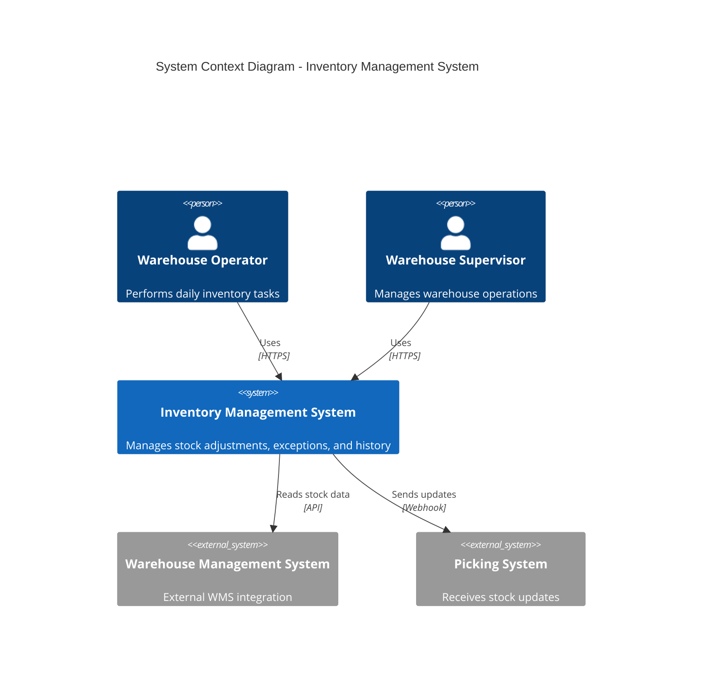
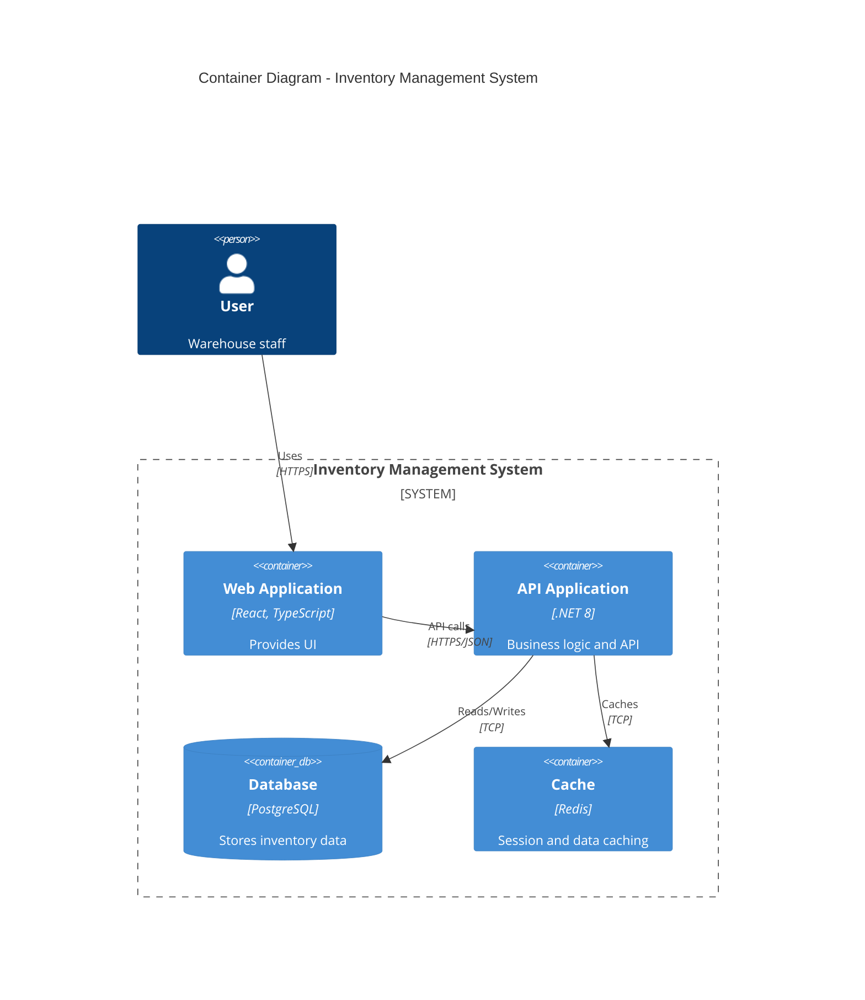
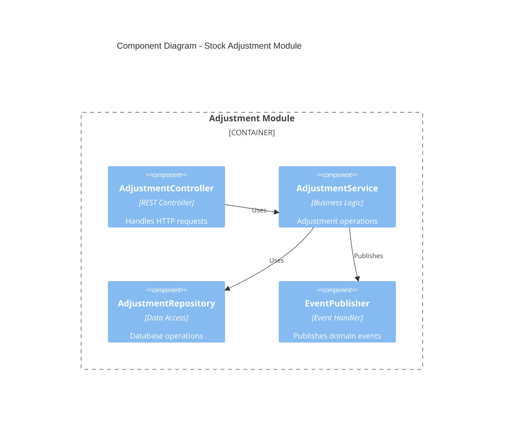

## FIRST ACTION (MANDATORY)

Before doing ANYTHING else, run these commands:

```bash
# 1. Update session context
bash "$CLAUDE_PROJECT_DIR/.claude/hooks/session-update.sh" --project "{SystemName}" --stage "solarch"

# 2. Log command start
bash .claude/hooks/log-lifecycle.sh command /solarch-blocks instruction_start '{"stage": "solarch", "method": "instruction-based"}'
```

## Rules Loading (On-Demand)

This command requires traceability rules for architecture decisions:

```bash
# Load Traceability rules (includes ADR ID format, building blocks)
/rules-traceability
```

## Description

This command generates the building block views documenting the static structure of the system, including module decomposition, C4 diagrams, and component registry. This is Checkpoint 4 of the pipeline.

## Arguments

- `$ARGUMENTS` - Optional: `<SystemName>` (auto-detected from config if not provided)

## Usage

```bash
/solarch-blocks InventorySystem
```

## Prerequisites

- Checkpoint 3 passed (`/solarch-strategy` completed)
- Module specifications available from ProductSpecs

## Skills Used

Read BEFORE execution:
- `.claude/skills/SolutionArchitecture_Arc42Generator/SKILL.md`
- `.claude/skills/SolutionArchitecture_C4Generator/SKILL.md`

## Execution Steps

### Step 1: Execute

```
LOAD _state/solarch_config.json
SYSTEM_NAME = config.system_name

READ ProductSpecs materials:
  - ProductSpecs_X/_registry/modules.json
  - ProductSpecs_X/01-modules/MOD-*.md (all module specs)
  - ProductSpecs_X/_registry/requirements.json

FOR each module IN modules.json:
  EXTRACT:
    - module_id, title, slug
    - screens
    - requirements
    - api_endpoints
    - pain_points

GENERATE 05-building-blocks/overview.md:
  USE Arc42Generator Section 05 template:

    5.1 Level 1: System Context
      - Reference to c4-context.mermaid
      - Prose description

    5.2 Level 2: Container View
      - Reference to c4-container.mermaid
      - Containers table (Web App, API, Database, Cache)

    5.3 Level 3: Component View
      - Module overview table
      - Links to module details

GENERATE 05-building-blocks/cross-cutting.md:
  - Shared Kernel components
  - Module Communication patterns
  - Common services (Auth, Logging, etc.)

GENERATE 05-building-blocks/data-model/README.md:
  - Entity overview
  - Relationship diagram
  - Database schema summary

FOR each module:
  CREATE folder: 05-building-blocks/modules/{slug}/

  GENERATE modules/{slug}/README.md:
    - Module responsibility
    - Screens table
    - API endpoints table
    - Key components
    - Traceability (PP-*, REQ-*)

  GENERATE modules/{slug}/c4-component.mermaid:
    USE C4Generator Component template

GENERATE diagrams/c4-context.mermaid:
  USE C4Generator Context template:
    - System boundary
    - External actors (personas)
    - External systems

GENERATE diagrams/c4-container.mermaid:
  USE C4Generator Container template:
    - Web Application container
    - API container
    - Database container
    - Cache container
    - Message Queue (if applicable)

GENERATE diagrams/c4-deployment.mermaid:
  USE C4Generator Deployment template:
    - Infrastructure nodes
    - Container placements

UPDATE traceability/component_registry.json (ROOT level, v3.0):
  FOR each module:
    ADD component:
      {
        "id": "COMP-{MODULE-ID}",
        "module_id": "MOD-*",
        "title": "{module title}",
        "type": "module",
        "screens": [...],
        "api_endpoints": [...],
        "dependencies": [...],
        "created_at": "ISO8601"
      }
  # NOTE: Local _registry/components.json is DEPRECATED

UPDATE _state/solarch_progress.json:
  phases.blocks.status = "completed"
  phases.blocks.completed_at = NOW()
  current_checkpoint = 4

RUN quality gate:
  python3 .claude/hooks/solarch_quality_gates.py --validate-checkpoint 4 --dir {OUTPUT_PATH}/

DISPLAY checkpoint 4 summary
```

### Step 2: Log Command End (MANDATORY)

```bash
# Log command completion - MUST RUN LAST
  --command-name "/solarch-blocks" \
  --stage "solarch" \
  --status "completed" \

echo "✅ Logged command completion"
```

## Output Files

### 05-building-blocks/

| File | Content |
|------|---------|
| `overview.md` | System decomposition, Level 1-3 views |
| `cross-cutting.md` | Shared components, communication patterns |
| `data-model/README.md` | Entity overview, relationships |
| `modules/{slug}/README.md` | Per-module details |
| `modules/{slug}/c4-component.mermaid` | C4 component diagram |

### diagrams/

| File | Content |
|------|---------|
| `c4-context.mermaid` | C4 Context diagram |
| `c4-container.mermaid` | C4 Container diagram |
| `c4-deployment.mermaid` | C4 Deployment diagram |

## C4 Diagram Templates

### Context Diagram



### Container Diagram



### Component Diagram (per module)



## Output Format

```
═══════════════════════════════════════════════════════════════
 CHECKPOINT 4: BUILDING BLOCKS - COMPLETED
═══════════════════════════════════════════════════════════════

Generated Files:
├─ 05-building-blocks/
│   ├─ overview.md ✅
│   ├─ cross-cutting.md ✅
│   ├─ data-model/README.md ✅
│   └─ modules/
│       ├─ adjustment/README.md ✅
│       ├─ exception-dashboard/README.md ✅
│       ├─ history/README.md ✅
│       ├─ approval/README.md ✅
│       └─ bin-management/README.md ✅
└─ diagrams/
    ├─ c4-context.mermaid ✅
    ├─ c4-container.mermaid ✅
    └─ c4-deployment.mermaid ✅

Components Registered: 5
C4 Diagrams Generated: 8

Quality Gate: ✅ PASSED

Next: /solarch-runtime InventorySystem
═══════════════════════════════════════════════════════════════
```

## Checkpoint Validation

```bash
python3 .claude/hooks/solarch_quality_gates.py --validate-checkpoint 4 --dir SolArch_InventorySystem/
```

**Required for Checkpoint 4:**
- `05-building-blocks/overview.md` exists
- `_registry/components.json` has entries
- At least one module folder in `05-building-blocks/modules/`
- C4 diagrams in `diagrams/`

## Error Handling

| Error | Action |
|-------|--------|
| Module spec missing | Log to FAILURES_LOG, generate with available data |
| C4 diagram fails | Continue with other modules |
| Registry update fails | Retry once, then continue |

## Related Commands

| Command | Description |
|---------|-------------|
| `/solarch-strategy` | Previous phase (Checkpoint 3) |
| `/solarch-runtime` | Next phase (Checkpoint 5) |
