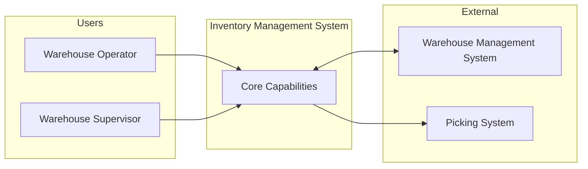

## FIRST ACTION (MANDATORY)

Before doing ANYTHING else, run these commands:

```bash
# 1. Update session context
bash "$CLAUDE_PROJECT_DIR/.claude/hooks/session-update.sh" --project "{SystemName}" --stage "solarch"

# 2. Log command start
bash .claude/hooks/log-lifecycle.sh command /solarch-context instruction_start '{"stage": "solarch", "method": "instruction-based"}'
```

## Rules Loading (On-Demand)

This command requires traceability rules for architecture decisions:

```bash
# Load Traceability rules (includes ADR ID format, building blocks)
/rules-traceability
```

## Description

This command generates the foundational architecture documentation covering introduction and goals, constraints, and system context. This is Checkpoint 2 of the pipeline.

## Arguments

- `$ARGUMENTS` - Optional: `<SystemName>` (auto-detected from config if not provided)

## Usage

```bash
/solarch-context InventorySystem
```

## Prerequisites

- Checkpoint 1 passed (`/solarch-validate` completed)
- Input validation successful

## Skills Used

Read BEFORE execution:
- `.claude/skills/SolutionArchitecture_Arc42Generator/SKILL.md`

## Execution Steps

### Step 1: Execute

```
LOAD _state/solarch_config.json
LOAD _state/solarch_input_validation.json
SYSTEM_NAME = config.system_name

READ Discovery materials:
  - ClientAnalysis_X/01-analysis/ANALYSIS_SUMMARY.md
  - ClientAnalysis_X/01-analysis/PAIN_POINTS.md
  - ClientAnalysis_X/02-research/personas/PERSONA_*.md
  - ClientAnalysis_X/03-strategy/PRODUCT_VISION.md

READ ProductSpecs materials:
  - ProductSpecs_X/00-overview/MASTER_DEVELOPMENT_PLAN.md
  - ProductSpecs_X/_registry/modules.json
  - ProductSpecs_X/_registry/requirements.json
  - ProductSpecs_X/_registry/nfrs.json

GENERATE 01-introduction-goals/introduction.md:
  USE Arc42Generator Section 01 template:
    - Requirements Overview from MASTER_DEVELOPMENT_PLAN
    - Business Context summary
    - Key Capabilities table with priorities

GENERATE 01-introduction-goals/stakeholders.md:
  EXTRACT from personas:
    - Role, Name/Title, Expectations
    - Key Concerns mapped to ADRs/Modules
    - Stakeholder concerns matrix

GENERATE 02-constraints/business-constraints.md:
  EXTRACT from ANALYSIS_SUMMARY:
    - Business constraints with rationale
    - Timeline constraints from roadmap
    - Resource constraints if mentioned

GENERATE 02-constraints/technical-constraints.md:
  EXTRACT from ANALYSIS_SUMMARY:
    - Integration constraints
    - Technology mandates
    - Performance constraints from NFRs

GENERATE 02-constraints/regulatory-constraints.md:
  EXTRACT from requirements:
    - Security requirements
    - Audit requirements
    - Compliance requirements

GENERATE 03-context-scope/business-context.md:
  CREATE business context diagram (Mermaid)
  LIST communication partners:
    - Users (from personas)
    - External systems (from integration points)

GENERATE 03-context-scope/technical-context.md:
  REFERENCE C4 context diagram
  LIST external interfaces:
    - Protocol, Data Format, Direction
  DOCUMENT scope:
    - In scope modules
    - Out of scope items
    - Assumptions

ADD frontmatter to all files:
  ---
  document_id: SA-{SECTION}-{NAME}
  version: 1.0.0
  created_at: ISO8601
  updated_at: ISO8601
  arc42_section: N
  sources: [list]
  traceability:
    pain_points: [PP-*]
    requirements: [REQ-*]
  ---

UPDATE _state/solarch_progress.json:
  phases.context.status = "completed"
  phases.context.completed_at = NOW()
  current_checkpoint = 2

RUN quality gate:
  python3 .claude/hooks/solarch_quality_gates.py --validate-checkpoint 2 --dir {OUTPUT_PATH}/

DISPLAY checkpoint 2 summary
```

### Step 2: Log Command End (MANDATORY)

```bash
# Log command completion - MUST RUN LAST
  --command-name "/solarch-context" \
  --stage "solarch" \
  --status "completed" \

echo "✅ Logged command completion"
```

## Output Files

### 01-introduction-goals/

| File | arc42 Section | Content |
|------|---------------|---------|
| `introduction.md` | 1.1-1.2 | Requirements overview, business context, quality goals |
| `stakeholders.md` | 1.3 | Stakeholder list, concerns, expectations |

### 02-constraints/

| File | arc42 Section | Content |
|------|---------------|---------|
| `business-constraints.md` | 2.1 | Business constraints, timeline, resources |
| `technical-constraints.md` | 2.2 | Integration, technology, performance |
| `regulatory-constraints.md` | 2.3 | Security, audit, compliance |

### 03-context-scope/

| File | arc42 Section | Content |
|------|---------------|---------|
| `business-context.md` | 3.1 | Business context diagram, communication partners |
| `technical-context.md` | 3.2-3.3 | Technical context, external interfaces, scope |

## Template Examples

### Introduction Structure

```markdown
---
document_id: SA-01-INTRO
version: 1.0.0
created_at: 2025-12-22T10:00:00Z
arc42_section: 1
sources:
  - ProductSpecs_X/00-overview/MASTER_DEVELOPMENT_PLAN.md
  - ClientAnalysis_X/03-strategy/PRODUCT_VISION.md
---

# 1. Introduction and Goals

## 1.1 Requirements Overview

{Product vision from MASTER_DEVELOPMENT_PLAN}

### Business Context

{Summary of the business problem being solved}

### Key Capabilities

| Capability | Description | Priority |
|------------|-------------|----------|
| Stock Adjustment | Move inventory between bins | P0 |
| Exception Dashboard | Monitor discrepancies | P0 |
| ...

*Source: MASTER_DEVELOPMENT_PLAN.md Section 1*

## 1.2 Quality Goals

| Priority | Quality Goal | Scenario | Source |
|----------|--------------|----------|--------|
| 1 | Performance | < 500ms response time | NFR-PERF-001 |
| 2 | Security | Role-based access | NFR-SEC-001 |
| ...
```

### Business Context Diagram



## Output Format

```
═══════════════════════════════════════════════════════════════
 CHECKPOINT 2: CONTEXT & GOALS - COMPLETED
═══════════════════════════════════════════════════════════════

Generated Files:
├─ 01-introduction-goals/
│   ├─ introduction.md ✅
│   └─ stakeholders.md ✅
├─ 02-constraints/
│   ├─ business-constraints.md ✅
│   ├─ technical-constraints.md ✅
│   └─ regulatory-constraints.md ✅
└─ 03-context-scope/
    ├─ business-context.md ✅
    └─ technical-context.md ✅

Traceability:
├─ Pain Points Referenced: 10
├─ Requirements Referenced: 26
└─ Personas Referenced: 4

Quality Gate: ✅ PASSED

Next: /solarch-strategy InventorySystem
═══════════════════════════════════════════════════════════════
```

## Checkpoint Validation

```bash
python3 .claude/hooks/solarch_quality_gates.py --validate-checkpoint 2 --dir SolArch_InventorySystem/
```

**Required for Checkpoint 2:**
- All 7 markdown files exist
- Each file has valid frontmatter
- Each file has minimum content (10+ lines)
- No placeholder text

## Error Handling

| Error | Action |
|-------|--------|
| Source file missing | Log to FAILURES_LOG, use available data |
| Template section empty | Generate with available data, add TODO |
| Invalid frontmatter | Skip file frontmatter, continue |

## Related Commands

| Command | Description |
|---------|-------------|
| `/solarch-validate` | Previous phase (Checkpoint 1) |
| `/solarch-strategy` | Next phase (Checkpoint 3) |
