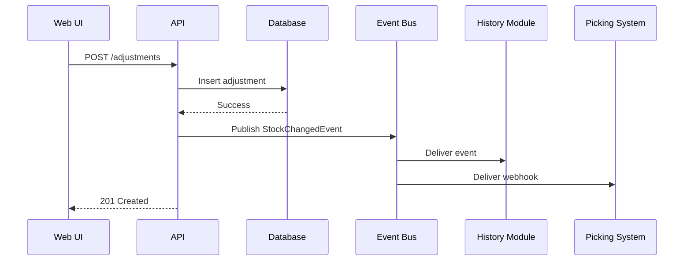

## FIRST ACTION (MANDATORY)

Before doing ANYTHING else, run these commands:

```bash
# 1. Update session context
bash "$CLAUDE_PROJECT_DIR/.claude/hooks/session-update.sh" --project "{SystemName}" --stage "solarch"

# 2. Log command start
bash .claude/hooks/log-lifecycle.sh command /solarch-runtime instruction_start '{"stage": "solarch", "method": "instruction-based"}'
```

## Rules Loading (On-Demand)

This command requires traceability rules for architecture decisions:

```bash
# Load Traceability rules (includes ADR ID format, building blocks)
/rules-traceability
```

## Description

This command generates runtime behavior documentation including key scenarios, sequence diagrams, API design, and event communication patterns. This is Checkpoint 5 of the pipeline.

## Arguments

- `$ARGUMENTS` - Optional: `<SystemName>` (auto-detected from config if not provided)

## Usage

```bash
/solarch-runtime InventorySystem
```

## Prerequisites

- Checkpoint 4 passed (`/solarch-blocks` completed)
- Module specifications with sequence diagrams available

## Skills Used

Read BEFORE execution:
- `.claude/skills/SolutionArchitecture_Arc42Generator/SKILL.md`
- `.claude/skills/SolutionArchitecture_InformationDesignGenerator/SKILL.md`

## Execution Steps

### Step 1: Execute

```
LOAD _state/solarch_config.json
SYSTEM_NAME = config.system_name

READ ProductSpecs materials:
  - ProductSpecs_X/01-modules/MOD-*.md (sequence diagrams, state logic)
  - ProductSpecs_X/02-api/api-index.md
  - ProductSpecs_X/_registry/traceability.json

READ Prototype materials:
  - Prototype_X/04-implementation/api-contracts.json

IDENTIFY key scenarios:
  FOR each module:
    EXTRACT main user flows
    EXTRACT critical paths (P0 requirements)

GENERATE 06-runtime/api-design.md:
  USE InformationDesignGenerator:

    API Overview:
      - Base URL, versioning
      - Authentication approach
      - Rate limiting

    Endpoint Summary:
      | Method | Path | Description | Module |
      | GET | /items | Search items | MOD-INV-SEARCH |
      | POST | /adjustments | Create adjustment | MOD-INV-ADJUST |

    Request/Response formats:
      - Standard success response
      - Error response format

    ADR Reference: ADR-005

GENERATE 06-runtime/event-communication.md:
  USE InformationDesignGenerator:

    Event Overview:
      - Event types (Domain, Integration)
      - Event bus technology
      - Delivery guarantees

    Event Catalog:
      | Event | Publisher | Subscribers | Payload |
      | StockChangedEvent | Adjustment | History, Picking | {...} |

    Sequence diagrams for event flows

    ADR Reference: ADR-006

GENERATE 06-runtime/security-architecture.md:
  Authentication & Authorization:
    - Authentication mechanism
    - Authorization model (RBAC/ABAC)
    - Permission matrix

  Security flows:
    - Login sequence
    - Token refresh
    - Permission check

  ADR Reference: ADR-007

CREATE 09-decisions/ ADRs if not exist:
  - ADR-005-api-design.md
  - ADR-006-event-communication.md
  - ADR-007-security-architecture.md

UPDATE _registry/decisions.json:
  ADD ADR-005, ADR-006, ADR-007

UPDATE _state/solarch_progress.json:
  phases.runtime.status = "completed"
  phases.runtime.completed_at = NOW()
  current_checkpoint = 5

RUN quality gate:
  python3 .claude/hooks/solarch_quality_gates.py --validate-checkpoint 5 --dir {OUTPUT_PATH}/

DISPLAY checkpoint 5 summary
```

### Step 2: Log Command End (MANDATORY)

```bash
# Log command completion - MUST RUN LAST
  --command-name "/solarch-runtime" \
  --stage "solarch" \
  --status "completed" \

echo "✅ Logged command completion"
```

## Output Files

### 06-runtime/

| File | Content |
|------|---------|
| `api-design.md` | API overview, endpoints, formats |
| `event-communication.md` | Event catalog, patterns, flows |
| `security-architecture.md` | Auth, authorization, security flows |

### 09-decisions/

| File | Content |
|------|---------|
| `ADR-005-api-design.md` | API design decisions |
| `ADR-006-event-communication.md` | Event architecture decisions |
| `ADR-007-security-architecture.md` | Security architecture decisions |

## Template Examples

### API Design Structure

```markdown
---
document_id: SA-06-API
version: 1.0.0
arc42_section: 6
---

# API Design

## Overview

| Aspect | Value |
|--------|-------|
| Base URL | `/api/v1` |
| Authentication | Bearer JWT |
| Rate Limit | 100 req/min |
| Versioning | URL path |

## Endpoint Summary

| Method | Path | Description | Auth | Module |
|--------|------|-------------|------|--------|
| GET | /items | Search items | Yes | MOD-INV-SEARCH |
| POST | /adjustments | Create adjustment | Yes | MOD-INV-ADJUST |
| GET | /adjustments/{id} | Get adjustment | Yes | MOD-INV-ADJUST |

## Standard Responses

### Success Response

```json
{
  "success": true,
  "data": {...},
  "timestamp": "2025-01-15T10:00:00Z"
}
```

### Error Response

```json
{
  "success": false,
  "error": {
    "code": "VALIDATION_ERROR",
    "message": "Field validation failed",
    "details": [...]
  }
}
```

## Traceability

- ADR: [ADR-005](../09-decisions/ADR-005-api-design.md)
- Pain Points: PP-1.1, PP-2.1
```

### Event Communication Structure

```markdown
---
document_id: SA-06-EVENTS
version: 1.0.0
arc42_section: 6
---

# Event Communication

## Overview

| Aspect | Value |
|--------|-------|
| Technology | RabbitMQ / Redis Streams |
| Pattern | Publish-Subscribe |
| Delivery | At-least-once |
| Idempotency | Event ID based |

## Event Catalog

| Event | Publisher | Subscribers | Priority |
|-------|-----------|-------------|----------|
| StockChangedEvent | Adjustment | History, Exceptions, Picking | High |
| ApprovalRequestedEvent | Adjustment | Approval | Medium |
| ApprovalCompletedEvent | Approval | Adjustment | Medium |

## Event Flow: Stock Adjustment



## Traceability

- ADR: [ADR-006](../09-decisions/ADR-006-event-communication.md)
- Pain Points: PP-1.1 (Real-time propagation)
```

## Output Format

```
═══════════════════════════════════════════════════════════════
 CHECKPOINT 5: RUNTIME & INTEGRATION - COMPLETED
═══════════════════════════════════════════════════════════════

Generated Files:
├─ 06-runtime/
│   ├─ api-design.md ✅
│   ├─ event-communication.md ✅
│   └─ security-architecture.md ✅
└─ 09-decisions/
    ├─ ADR-005-api-design.md ✅
    ├─ ADR-006-event-communication.md ✅
    └─ ADR-007-security-architecture.md ✅

Runtime Documentation:
├─ API Endpoints: 12 documented
├─ Events: 5 cataloged
└─ Security Flows: 3 documented

ADRs Registered: 5 total (3 new)

Quality Gate: ✅ PASSED

Next: /solarch-quality InventorySystem
═══════════════════════════════════════════════════════════════
```

## Checkpoint Validation

```bash
python3 .claude/hooks/solarch_quality_gates.py --validate-checkpoint 5 --dir SolArch_InventorySystem/
```

**Required for Checkpoint 5:**
- `06-runtime/api-design.md` exists with content
- `06-runtime/event-communication.md` exists with content

## Error Handling

| Error | Action |
|-------|--------|
| API contracts missing | Generate from module specs |
| Sequence diagrams missing | Generate basic flows |
| Event catalog incomplete | Document known events |

## Related Commands

| Command | Description |
|---------|-------------|
| `/solarch-blocks` | Previous phase (Checkpoint 4) |
| `/solarch-quality` | Next phase (Checkpoint 6) |
