# GDPR Data Flow Diagram Generator

> Creates comprehensive GDPR-compliant data flow diagrams using Mermaid notation

## Metadata
- **Skill ID**: GDPR_DataFlow_Mapper
- **Version**: 1.0.0
- **Created**: 2025-02-02
- **Author**: Claude

## Description

This skill generates data flow diagrams (DFDs) specifically designed for GDPR compliance. It creates multi-level Mermaid diagrams showing how personal data moves through systems, identifying controllers, processors, data stores, and cross-border transfers.

## Usage

**Triggers:**
- "Create a data flow diagram for GDPR"
- "Map our personal data processing"
- "Generate a DFD for our DPIA"
- "Visualize our data flows"
- "Show how customer data moves through our system"

**Input:** Description of data processing activities, systems involved, or existing documentation

**Output:** Multi-level Mermaid diagrams + GDPR compliance checklist

---

## Workflow

### Phase 1: Data Inventory Collection

Gather the following information (ask user if not provided):

#### 1.1 Data Subjects & Categories
```
- Who does the data belong to? (customers, employees, vendors, etc.)
- What categories of individuals are affected?
```

#### 1.2 Personal Data Types
```
- Basic identifiers (name, email, phone)
- Special category data (health, biometrics, political views)
- Financial data (bank accounts, transactions)
- Technical data (IP addresses, cookies, device IDs)
- Location data
- Communication data
```

#### 1.3 Processing Activities
```
- Collection methods (forms, APIs, third-party)
- Processing purposes (service delivery, marketing, analytics)
- Storage locations (databases, cloud services, file shares)
- Retention periods
- Deletion procedures
```

#### 1.4 Key Entities
```
- Data Controllers (who decides why/how data is processed)
- Data Processors (who processes on behalf of controller)
- Sub-processors
- Third-party recipients
- Cross-border transfer destinations
```

### Phase 2: Diagram Generation

Generate diagrams at multiple levels following DFD conventions.

---

## DFD Notation in Mermaid

### Symbol Mapping

| DFD Element | Mermaid Syntax | Description |
|-------------|----------------|-------------|
| External Entity | `entity[/"Entity Name"/]` or `entity[Entity Name]` | Data subjects, external systems |
| Process | `process((Process))` or `process{Process}` | Data transformation/processing |
| Data Store | `store[(Database)]` | Storage locations |
| Data Flow | `-->` with label | Movement of data |

### Color Coding for GDPR

```mermaid
%%{init: {'theme': 'base', 'themeVariables': {
  'primaryColor': '#4299e1',
  'primaryBorderColor': '#2b6cb0',
  'secondaryColor': '#48bb78',
  'tertiaryColor': '#f59e0b'
}}}%%
```

| Category | Color | Use For |
|----------|-------|---------|
| External Entity | `#e2e8f0` (gray) | Data subjects, third parties |
| Controller Process | `#4299e1` (blue) | Your organization's processing |
| Processor | `#9f7aea` (purple) | Third-party processors |
| Data Store | `#48bb78` (green) | Databases, storage |
| Special Category | `#f56565` (red) | Sensitive/special data |
| Cross-Border | `#f59e0b` (amber) | International transfers |

---

## Diagram Templates

### Level 0: Context Diagram

Shows the entire system as a single process with external entities.

```mermaid
flowchart TB
    subgraph External["External Entities"]
        DS[/"👤 Data Subject"/]
        TP[/"🏢 Third Party"/]
        REG[/"⚖️ Regulator"/]
    end

    subgraph System["Your Organization"]
        SYS(("🔄 Data Processing<br/>System"))
    end

    subgraph Storage["Data Stores"]
        DB[(🗄️ Primary Database)]
        ARCHIVE[(📦 Archive Storage)]
    end

    DS -->|"Personal Data<br/>(consent-based)"| SYS
    SYS -->|"Service Delivery"| DS
    SYS -->|"Data Sharing<br/>(contract-based)"| TP
    TP -->|"Enriched Data"| SYS
    SYS -->|"Compliance Reports"| REG
    SYS <-->|"CRUD Operations"| DB
    SYS -->|"Archival"| ARCHIVE

    style DS fill:#e2e8f0,stroke:#a0aec0
    style TP fill:#e2e8f0,stroke:#a0aec0
    style REG fill:#e2e8f0,stroke:#a0aec0
    style SYS fill:#4299e1,stroke:#2b6cb0,color:#fff
    style DB fill:#48bb78,stroke:#2f855a,color:#fff
    style ARCHIVE fill:#48bb78,stroke:#2f855a,color:#fff
```



### Level 1: System Decomposition

Breaks down the system into major processing areas.

```mermaid
flowchart TB
    subgraph Subjects["Data Subjects"]
        CUST[/"👤 Customers"/]
        EMP[/"👥 Employees"/]
    end

    subgraph Collection["1. Data Collection"]
        WEB(("1.1 Web Forms"))
        API(("1.2 API Ingestion"))
        MANUAL(("1.3 Manual Entry"))
    end

    subgraph Processing["2. Data Processing"]
        VALID(("2.1 Validation"))
        ENRICH(("2.2 Enrichment"))
        ANON(("2.3 Anonymization"))
    end

    subgraph Storage["Data Stores"]
        RAW[(Raw Data)]
        PROCESSED[(Processed Data)]
        ANON_STORE[(Anonymized Data)]
    end

    subgraph External["External Processors"]
        CRM[/"☁️ CRM System"/]
        ANALYTICS[/"📊 Analytics"/]
    end

    CUST -->|"Registration Data"| WEB
    CUST -->|"Transaction Data"| API
    EMP -->|"HR Data"| MANUAL

    WEB --> VALID
    API --> VALID
    MANUAL --> VALID

    VALID --> RAW
    RAW --> ENRICH
    ENRICH --> PROCESSED
    PROCESSED --> ANON
    ANON --> ANON_STORE

    PROCESSED -->|"Sync"| CRM
    ANON_STORE -->|"Export"| ANALYTICS

    style CUST fill:#e2e8f0,stroke:#a0aec0
    style EMP fill:#e2e8f0,stroke:#a0aec0
    style WEB fill:#4299e1,stroke:#2b6cb0,color:#fff
    style API fill:#4299e1,stroke:#2b6cb0,color:#fff
    style MANUAL fill:#4299e1,stroke:#2b6cb0,color:#fff
    style VALID fill:#4299e1,stroke:#2b6cb0,color:#fff
    style ENRICH fill:#4299e1,stroke:#2b6cb0,color:#fff
    style ANON fill:#4299e1,stroke:#2b6cb0,color:#fff
    style RAW fill:#48bb78,stroke:#2f855a,color:#fff
    style PROCESSED fill:#48bb78,stroke:#2f855a,color:#fff
    style ANON_STORE fill:#48bb78,stroke:#2f855a,color:#fff
    style CRM fill:#9f7aea,stroke:#6b46c1,color:#fff
    style ANALYTICS fill:#9f7aea,stroke:#6b46c1,color:#fff
```



### Level 2: Detailed Process View

Shows granular data flows within a specific process.

```mermaid
flowchart LR
    subgraph Input["Input Data"]
        FORM[/"📝 Web Form Data"/]
        SESSION[/"🔐 Session Data"/]
    end

    subgraph Validation["2.1 Data Validation"]
        SCHEMA{{"Schema Check"}}
        CONSENT{{"Consent Verify"}}
        DEDUPE{{"Deduplication"}}
    end

    subgraph Output["Validated Data"]
        VALID_REC[(Valid Records)]
        REJECT_LOG[(Rejection Log)]
    end

    FORM --> SCHEMA
    SESSION --> SCHEMA
    SCHEMA -->|"Valid"| CONSENT
    SCHEMA -->|"Invalid"| REJECT_LOG
    CONSENT -->|"Consented"| DEDUPE
    CONSENT -->|"No Consent"| REJECT_LOG
    DEDUPE --> VALID_REC

    style FORM fill:#e2e8f0,stroke:#a0aec0
    style SESSION fill:#e2e8f0,stroke:#a0aec0
    style SCHEMA fill:#4299e1,stroke:#2b6cb0,color:#fff
    style CONSENT fill:#4299e1,stroke:#2b6cb0,color:#fff
    style DEDUPE fill:#4299e1,stroke:#2b6cb0,color:#fff
    style VALID_REC fill:#48bb78,stroke:#2f855a,color:#fff
    style REJECT_LOG fill:#f59e0b,stroke:#d97706,color:#fff
```



### Cross-Border Transfer Diagram

Special diagram for international data flows (GDPR Article 44-49).

```mermaid
flowchart TB
    subgraph EU["🇪🇺 EU/EEA Region"]
        EU_CTRL(("Controller<br/>Operations"))
        EU_DB[(EU Database)]
    end

    subgraph Adequate["✅ Adequacy Decisions"]
        UK[/"🇬🇧 UK"/]
        JP[/"🇯🇵 Japan"/]
        CH[/"🇨🇭 Switzerland"/]
    end

    subgraph SCC["📜 Standard Contractual Clauses"]
        US[/"🇺🇸 USA<br/>(Cloud Provider)"/]
        IN[/"🇮🇳 India<br/>(Support Center)"/]
    end

    subgraph BCR["🏛️ Binding Corporate Rules"]
        GROUP[/"Global<br/>Subsidiaries"/]
    end

    EU_CTRL <--> EU_DB
    EU_CTRL -->|"Direct Transfer"| UK
    EU_CTRL -->|"Direct Transfer"| JP
    EU_CTRL -->|"Direct Transfer"| CH
    EU_CTRL -->|"SCC Required"| US
    EU_CTRL -->|"SCC Required"| IN
    EU_CTRL -->|"BCR Approved"| GROUP

    style EU_CTRL fill:#4299e1,stroke:#2b6cb0,color:#fff
    style EU_DB fill:#48bb78,stroke:#2f855a,color:#fff
    style UK fill:#48bb78,stroke:#2f855a
    style JP fill:#48bb78,stroke:#2f855a
    style CH fill:#48bb78,stroke:#2f855a
    style US fill:#f59e0b,stroke:#d97706
    style IN fill:#f59e0b,stroke:#d97706
    style GROUP fill:#9f7aea,stroke:#6b46c1
```



### Special Category Data Diagram

For sensitive personal data (GDPR Article 9).

```mermaid
flowchart TB
    subgraph SpecialData["⚠️ Special Category Data"]
        HEALTH[/"🏥 Health Data"/]
        BIO[/"🔬 Biometric Data"/]
        GENETIC[/"🧬 Genetic Data"/]
    end

    subgraph Safeguards["🛡️ Additional Safeguards"]
        ENCRYPT{{"Encryption<br/>at Rest"}}
        ACCESS{{"Access<br/>Controls"}}
        AUDIT{{"Audit<br/>Logging"}}
        PSEUDO{{"Pseudonymization"}}
    end

    subgraph Storage["Secure Storage"]
        SECURE_DB[(("🔒 Encrypted<br/>Database"))]
    end

    HEALTH --> ENCRYPT
    BIO --> ENCRYPT
    GENETIC --> ENCRYPT
    ENCRYPT --> ACCESS
    ACCESS --> AUDIT
    AUDIT --> PSEUDO
    PSEUDO --> SECURE_DB

    style HEALTH fill:#f56565,stroke:#c53030,color:#fff
    style BIO fill:#f56565,stroke:#c53030,color:#fff
    style GENETIC fill:#f56565,stroke:#c53030,color:#fff
    style ENCRYPT fill:#4299e1,stroke:#2b6cb0,color:#fff
    style ACCESS fill:#4299e1,stroke:#2b6cb0,color:#fff
    style AUDIT fill:#4299e1,stroke:#2b6cb0,color:#fff
    style PSEUDO fill:#4299e1,stroke:#2b6cb0,color:#fff
    style SECURE_DB fill:#48bb78,stroke:#2f855a,color:#fff
```

### Data Subject Rights Flow

Maps the handling of GDPR data subject requests.

```mermaid
flowchart LR
    subgraph Request["📨 Data Subject Request"]
        DSR[/"Data Subject"/]
    end

    subgraph Verification["1. Identity Verification"]
        ID_CHECK{{"Verify<br/>Identity"}}
    end

    subgraph Processing["2. Request Processing"]
        ACCESS(("Access<br/>Request"))
        RECTIFY(("Rectification<br/>Request"))
        ERASE(("Erasure<br/>Request"))
        PORT(("Portability<br/>Request"))
    end

    subgraph Response["3. Response (30 days)"]
        FULFILL[/"✅ Fulfill Request"/]
        DENY[/"❌ Deny with Reason"/]
    end

    DSR -->|"Submit Request"| ID_CHECK
    ID_CHECK -->|"Verified"| ACCESS
    ID_CHECK -->|"Verified"| RECTIFY
    ID_CHECK -->|"Verified"| ERASE
    ID_CHECK -->|"Verified"| PORT
    ID_CHECK -->|"Failed"| DENY
    ACCESS --> FULFILL
    RECTIFY --> FULFILL
    ERASE --> FULFILL
    PORT --> FULFILL

    style DSR fill:#e2e8f0,stroke:#a0aec0
    style ID_CHECK fill:#f59e0b,stroke:#d97706,color:#fff
    style ACCESS fill:#4299e1,stroke:#2b6cb0,color:#fff
    style RECTIFY fill:#4299e1,stroke:#2b6cb0,color:#fff
    style ERASE fill:#4299e1,stroke:#2b6cb0,color:#fff
    style PORT fill:#4299e1,stroke:#2b6cb0,color:#fff
    style FULFILL fill:#48bb78,stroke:#2f855a,color:#fff
    style DENY fill:#f56565,stroke:#c53030,color:#fff
```



---

## GDPR Compliance Checklist Template

After generating diagrams, provide this compliance checklist:

```markdown
## GDPR Data Flow Compliance Checklist

### Article 5 - Principles
- [ ] **Lawfulness**: Legal basis identified for each processing activity
- [ ] **Purpose Limitation**: Each flow has a defined, legitimate purpose
- [ ] **Data Minimization**: Only necessary data is collected
- [ ] **Accuracy**: Mechanisms exist to keep data current
- [ ] **Storage Limitation**: Retention periods defined
- [ ] **Integrity & Confidentiality**: Security measures documented

### Article 13-14 - Transparency
- [ ] Privacy notice covers all data flows
- [ ] Data subjects informed of all recipients
- [ ] Cross-border transfers disclosed

### Article 28 - Processors
- [ ] All processors identified in diagram
- [ ] Written contracts in place (DPAs)
- [ ] Sub-processor chain documented

### Article 30 - Records of Processing
- [ ] Diagram supports ROPA documentation
- [ ] All processing activities captured
- [ ] Contact details for controller/DPO included

### Article 32 - Security
- [ ] Technical measures shown (encryption, access control)
- [ ] Organizational measures documented
- [ ] Pseudonymization/anonymization points identified

### Article 35 - DPIA
- [ ] High-risk processing identified
- [ ] Necessity and proportionality assessed
- [ ] Risks to data subjects evaluated
- [ ] Mitigating measures documented

### Articles 44-49 - International Transfers
- [ ] All cross-border flows identified
- [ ] Legal mechanism for each transfer (Adequacy/SCC/BCR)
- [ ] Transfer impact assessments completed
```

---

## Output File Structure

When generating diagrams, create the following files:

```
{output_dir}/
├── gdpr-data-flow-overview.md       # Main document with all diagrams
├── diagrams/
│   ├── level-0-context.mmd          # Context diagram (Mermaid source)
│   ├── level-1-decomposition.mmd    # System decomposition
│   ├── level-2-{process}.mmd        # Detailed process views
│   ├── cross-border-transfers.mmd   # International transfer map
│   └── special-category-data.mmd    # Sensitive data flows
├── compliance-checklist.md          # GDPR compliance checklist
└── data-inventory.md                # Data inventory summary
```

---

## Best Practices

### DFD Rules (Follow These)

1. **Label all flows** with descriptive data type names
2. **Use verb phrases** for process descriptions (e.g., "Validate Input")
3. **Use noun phrases** for data stores (e.g., "Customer Database")
4. **Every process** must have at least one input AND one output
5. **No direct connections** between data stores and external entities
6. **Avoid crossing lines** - restructure for clarity

### GDPR-Specific Guidelines

1. **Mark legal basis** on data collection flows (consent, contract, legitimate interest)
2. **Highlight special category data** with distinct styling
3. **Identify cross-border transfers** with country flags/codes
4. **Show retention periods** at data stores
5. **Indicate security controls** (encryption, access control icons)
6. **Map data subject rights** fulfillment paths

### Mermaid Tips

1. Use `subgraph` to group related elements
2. Apply consistent styling with `style` commands
3. Use descriptive link labels: `-->|"Label"| `
4. Keep diagrams readable - split complex flows into multiple levels
5. Use emoji sparingly for quick visual recognition

---

## Example Invocations

### Basic Usage
```
User: Create a data flow diagram for our e-commerce platform
```

### With Specific Scope
```
User: Generate a Level 2 DFD for our payment processing system, focusing on GDPR compliance
```

### For DPIA
```
User: I need data flow diagrams for a DPIA on our new AI-powered recommendation engine
```

### Cross-Border Focus
```
User: Map our international data transfers - we have customers in EU, processing in US, and support in India
```

---

## References

- [GDPR Article 30 - Records of Processing Activities](https://gdpr-info.eu/art-30-gdpr/)
- [GDPR Article 35 - Data Protection Impact Assessment](https://gdpr-info.eu/art-35-gdpr/)
- [ICO Data Flow Mapping Guidance](https://ico.org.uk/for-organisations/guide-to-data-protection/guide-to-the-general-data-protection-regulation-gdpr/documentation/data-flow-mapping/)
- [Mermaid Flowchart Syntax](https://mermaid.js.org/syntax/flowchart.html)
