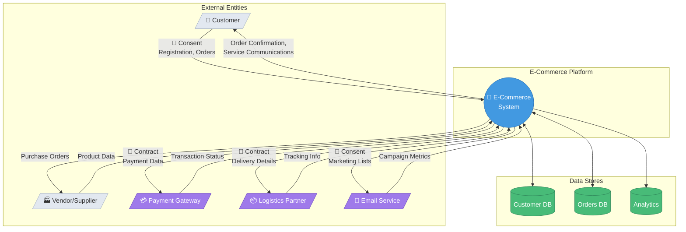
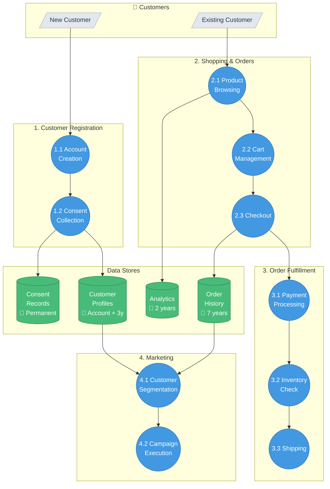
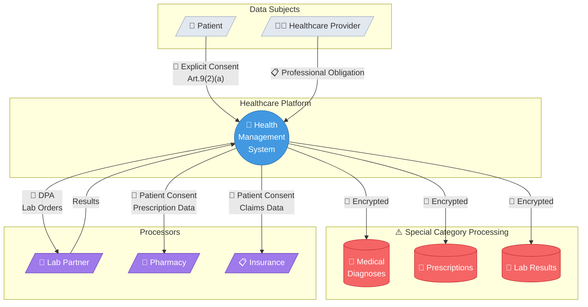
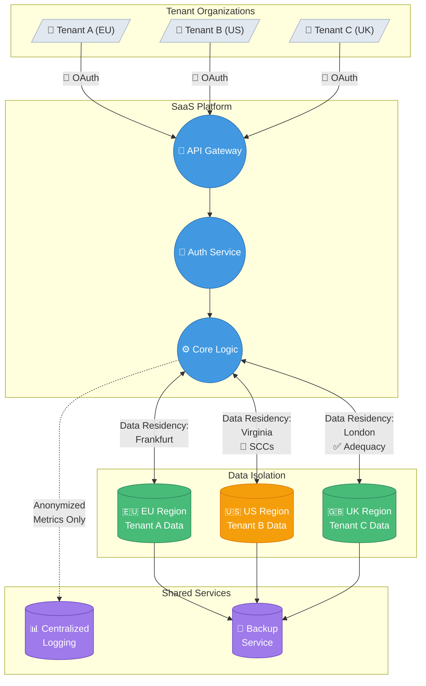
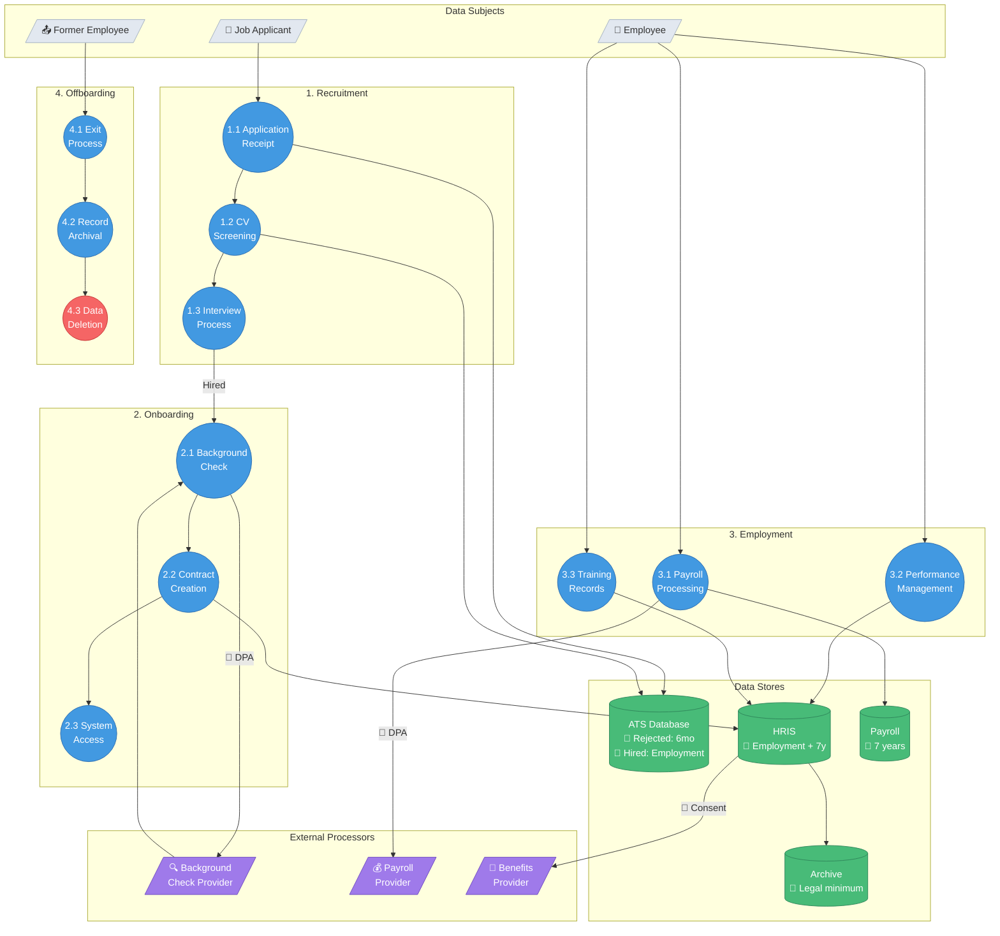

# GDPR Data Flow Diagram Examples

## Example 1: E-Commerce Platform

### Context Diagram (Level 0)



### Level 1: System Decomposition



---

## Example 2: Healthcare Application

### Context with Special Category Data



### Security-Focused Detail View

```mermaid
flowchart LR
    subgraph Input["Patient Data Entry"]
        ENTRY[/"📝 Health Data"/]
    end

    subgraph Security["🛡️ Security Controls"]
        MFA{{"🔐 MFA<br/>Authentication"}}
        ENCRYPT{{"🔒 Field-Level<br/>Encryption"}}
        ACCESS{{"👥 Role-Based<br/>Access"}}
        AUDIT{{"📊 Audit<br/>Logging"}}
        MASK{{"🎭 Data<br/>Masking"}}
    end

    subgraph Storage["Secure Storage"]
        DB[(("🔒 Encrypted<br/>Health DB"))]
        AUDIT_LOG[(Immutable<br/>Audit Trail)]
    end

    ENTRY --> MFA
    MFA -->|"Authenticated"| ENCRYPT
    ENCRYPT --> ACCESS
    ACCESS --> AUDIT
    AUDIT --> DB
    AUDIT --> AUDIT_LOG
    DB --> MASK

    style ENTRY fill:#f56565,stroke:#c53030,color:#fff
    style MFA fill:#4299e1,stroke:#2b6cb0,color:#fff
    style ENCRYPT fill:#4299e1,stroke:#2b6cb0,color:#fff
    style ACCESS fill:#4299e1,stroke:#2b6cb0,color:#fff
    style AUDIT fill:#4299e1,stroke:#2b6cb0,color:#fff
    style MASK fill:#4299e1,stroke:#2b6cb0,color:#fff
    style DB fill:#48bb78,stroke:#2f855a,color:#fff
    style AUDIT_LOG fill:#48bb78,stroke:#2f855a,color:#fff
```

---

## Example 3: SaaS B2B Platform

### Multi-Tenant Data Flow



---

## Example 4: HR/Employee Management

### Complete HR Data Flow



---

## Example 5: Cross-Border Transfer Mapping

### Global Data Transfer Architecture

```mermaid
flowchart TB
    subgraph EU["🇪🇺 European Union (Controller HQ)"]
        EU_MAIN(("EU Main<br/>Operations"))
        EU_DB[(EU Customer<br/>Database)]
        EU_HR[(EU Employee<br/>Data)]
    end

    subgraph Adequate["✅ Adequacy Decision Countries"]
        UK_SUB[/"🇬🇧 UK Subsidiary"/]
        JP_SUB[/"🇯🇵 Japan Office"/]
        CH_BANK[/"🇨🇭 Swiss Bank"/]
    end

    subgraph SCC["📜 Standard Contractual Clauses"]
        US_CLOUD[/"🇺🇸 AWS<br/>(Cloud Hosting)"/]
        US_CRM[/"🇺🇸 Salesforce<br/>(CRM)"/]
        IN_SUPPORT[/"🇮🇳 Support Center"/]
        PH_BPO[/"🇵🇭 BPO Services"/]
    end

    subgraph BCR["🏛️ Binding Corporate Rules"]
        BR_SUB[/"🇧🇷 Brazil<br/>Subsidiary"/]
        MX_SUB[/"🇲🇽 Mexico<br/>Subsidiary"/]
        SG_SUB[/"🇸🇬 Singapore<br/>Regional HQ"/]
    end

    EU_MAIN <--> EU_DB
    EU_MAIN <--> EU_HR

    %% Adequacy transfers
    EU_MAIN -->|"✅ Direct Transfer"| UK_SUB
    EU_MAIN -->|"✅ Direct Transfer"| JP_SUB
    EU_MAIN -->|"✅ Direct Transfer"| CH_BANK

    %% SCC transfers
    EU_DB -->|"📜 SCC + TIA"| US_CLOUD
    EU_MAIN -->|"📜 SCC"| US_CRM
    EU_MAIN -->|"📜 SCC + TIA"| IN_SUPPORT
    EU_MAIN -->|"📜 SCC"| PH_BPO

    %% BCR transfers
    EU_MAIN -->|"🏛️ BCR Approved"| BR_SUB
    EU_MAIN -->|"🏛️ BCR Approved"| MX_SUB
    EU_MAIN -->|"🏛️ BCR Approved"| SG_SUB

    style EU_MAIN fill:#4299e1,stroke:#2b6cb0,color:#fff
    style EU_DB fill:#48bb78,stroke:#2f855a,color:#fff
    style EU_HR fill:#48bb78,stroke:#2f855a,color:#fff
    style UK_SUB fill:#48bb78,stroke:#2f855a
    style JP_SUB fill:#48bb78,stroke:#2f855a
    style CH_BANK fill:#48bb78,stroke:#2f855a
    style US_CLOUD fill:#f59e0b,stroke:#d97706
    style US_CRM fill:#f59e0b,stroke:#d97706
    style IN_SUPPORT fill:#f59e0b,stroke:#d97706
    style PH_BPO fill:#f59e0b,stroke:#d97706
    style BR_SUB fill:#9f7aea,stroke:#6b46c1
    style MX_SUB fill:#9f7aea,stroke:#6b46c1
    style SG_SUB fill:#9f7aea,stroke:#6b46c1
```



### Transfer Impact Assessment Summary

| Destination | Mechanism | TIA Required | Additional Measures |
|-------------|-----------|--------------|---------------------|
| 🇬🇧 UK | Adequacy | No | Standard DPA |
| 🇯🇵 Japan | Adequacy | No | Standard DPA |
| 🇨🇭 Switzerland | Adequacy | No | Standard DPA |
| 🇺🇸 USA (AWS) | SCC | Yes | Encryption, Supplementary Measures |
| 🇺🇸 USA (Salesforce) | SCC + DPF | Reduced | DPF Certification Verified |
| 🇮🇳 India | SCC | Yes | Enhanced security, access controls |
| 🇵🇭 Philippines | SCC | Yes | Pseudonymization, audit rights |
| 🇧🇷 Brazil | BCR | No | BCR compliance monitoring |
| 🇲🇽 Mexico | BCR | No | BCR compliance monitoring |
| 🇸🇬 Singapore | BCR | No | BCR compliance monitoring |

---

## Data Inventory Summary Template

After creating diagrams, generate this summary:

```markdown
# Data Flow Inventory Summary

## Organization
- **Controller**: [Name]
- **DPO Contact**: [Email]
- **Last Updated**: [Date]

## Data Categories

| Category | Data Elements | Legal Basis | Retention |
|----------|---------------|-------------|-----------|
| Customer Identity | Name, Email, Phone | Contract | Account + 3y |
| Transaction | Orders, Payments | Contract | 7 years |
| Marketing | Preferences, History | Consent | Until withdrawal |
| Technical | IP, Cookies, Logs | Legit Interest | 90 days |

## Processors

| Processor | Purpose | Location | Mechanism |
|-----------|---------|----------|-----------|
| AWS | Hosting | US | SCC |
| Salesforce | CRM | US | DPF |
| Stripe | Payments | US | SCC |

## Cross-Border Transfers

| Destination | Data Type | Volume | Mechanism |
|-------------|-----------|--------|-----------|
| USA | All | High | SCC/DPF |
| India | Support tickets | Medium | SCC |

## Security Controls

| Control | Implementation | Data Scope |
|---------|----------------|------------|
| Encryption at rest | AES-256 | All PII |
| Encryption in transit | TLS 1.3 | All data |
| Access control | RBAC + MFA | All systems |
| Audit logging | Centralized SIEM | All access |
```
