```mermaid
flowchart LR
    A[/"Input Data"/] -->|"🔐 TLS 1.3"| FW{Firewall}
    FW -->|"🛡️ WAF"| API(("API Gateway"))
    API -->|"🔒 AES-256"| DB[(Encrypted DB)]
    DB -.->|"📊 Audit Logs"| SIEM[(SIEM)]
```

# GDPR Requirements for Data Flow Mapping

## Key GDPR Articles for Data Flow Diagrams

### Article 5 - Principles of Processing

Data flow diagrams must demonstrate compliance with:

| Principle | Diagram Requirement |
|-----------|---------------------|
| **Lawfulness** | Show legal basis for each data collection flow |
| **Purpose Limitation** | Label each processing activity with its purpose |
| **Data Minimization** | Only show necessary data elements being collected |
| **Accuracy** | Include data quality/validation processes |
| **Storage Limitation** | Add retention periods to data stores |
| **Integrity & Confidentiality** | Indicate security controls on flows and stores |
| **Accountability** | Document everything in the diagram |

---

### Article 13-14 - Information to Data Subjects

The diagram should capture information needed for privacy notices:

```
Required Disclosures:
├── Identity of controller (shown in diagram)
├── Contact details for DPO (in documentation)
├── Purposes of processing (labeled on processes)
├── Legal basis (labeled on collection flows)
├── Recipients/categories (external entities shown)
├── International transfers (geographic subgraphs)
├── Retention periods (labeled on data stores)
├── Data subject rights (separate DSR flow diagram)
└── Right to withdraw consent (shown in consent flows)
```

---

### Article 28 - Processor Requirements

When mapping processors:

**Must Identify:**
- All processors (third-party services)
- All sub-processors (their vendors)
- Nature of processing delegated
- Geographic location of processing

**Diagram Pattern:**


---

### Article 30 - Records of Processing Activities (ROPA)

Data flow diagrams support ROPA by capturing:

| ROPA Element | How Diagram Captures It |
|--------------|-------------------------|
| Name and contact of controller | Header/metadata |
| Purposes of processing | Process labels |
| Categories of data subjects | External entity labels |
| Categories of personal data | Data flow labels |
| Categories of recipients | External entities/processors |
| Transfers to third countries | Geographic subgraphs |
| Retention periods | Data store annotations |
| Security measures | Control indicators |

---

### Article 32 - Security of Processing

Security controls to show in diagrams:

**Technical Measures:**
- 🔐 Encryption in transit (TLS)
- 🔒 Encryption at rest
- 🛡️ Access controls
- 📊 Monitoring/logging
- 🔄 Backup/recovery

**Organizational Measures:**
- 👥 Access governance
- 📋 Policies
- 🎓 Training
- ✅ Audits

**Diagram Pattern:**


---

### Article 35 - Data Protection Impact Assessment (DPIA)

DFDs are essential DPIA components. Required when:

- Systematic evaluation of personal aspects (profiling)
- Large-scale processing of special categories
- Systematic monitoring of public areas

**DPIA Diagram Requirements:**
1. Complete data lifecycle visualization
2. Risk points identified
3. Mitigating controls shown
4. Data subject impact areas highlighted

---

### Articles 44-49 - International Transfers

When data crosses borders:

**Transfer Mechanisms:**

| Mechanism | Countries | Diagram Indicator |
|-----------|-----------|-------------------|
| Adequacy Decision | UK, Japan, Switzerland, etc. | ✅ Green styling |
| Standard Contractual Clauses | US, India, etc. | 📜 SCC label |
| Binding Corporate Rules | Intra-group transfers | 🏛️ BCR label |
| Explicit Consent | One-off transfers | ⚠️ Consent label |
| Derogations | Legal necessity | ⚖️ Legal label |

**Countries with Adequacy Decisions (as of 2024):**
- Andorra, Argentina, Canada (commercial), Faroe Islands
- Guernsey, Israel, Isle of Man, Japan, Jersey
- New Zealand, Republic of Korea, Switzerland
- United Kingdom, Uruguay
- (EU-US Data Privacy Framework for certified US companies)

---

## Special Category Data (Article 9)

**Types (must be specially marked):**
- Racial or ethnic origin
- Political opinions
- Religious/philosophical beliefs
- Trade union membership
- Genetic data
- Biometric data (for identification)
- Health data
- Sex life/sexual orientation

**Diagram Requirements:**
1. Use RED styling for special category nodes
2. Show explicit consent or Article 9(2) legal basis
3. Indicate enhanced security measures
4. Document access restrictions

```mermaid
flowchart TB
    subgraph Special["⚠️ Special Category Data"]
        HEALTH[/"🏥 Health Records"/]
    end

    subgraph Safeguards["Enhanced Safeguards"]
        EXPLICIT{{"Explicit<br/>Consent"}}
        ENCRYPT{{"Additional<br/>Encryption"}}
        ACCESS{{"Restricted<br/>Access"}}
    end

    HEALTH --> EXPLICIT
    EXPLICIT --> ENCRYPT
    ENCRYPT --> ACCESS

    style HEALTH fill:#f56565,stroke:#c53030,color:#fff
```



---

## Data Subject Rights (Articles 15-22)

Map how each right is fulfilled:

| Right | Article | Flow to Document |
|-------|---------|------------------|
| Access | 15 | Data extraction → compilation → delivery |
| Rectification | 16 | Request → validation → update → confirmation |
| Erasure | 17 | Request → eligibility check → deletion cascade |
| Restriction | 18 | Request → flag records → limit processing |
| Portability | 20 | Request → export in machine-readable format |
| Object | 21 | Request → cease processing (marketing, profiling) |
| Automated decisions | 22 | Human review mechanism for AI decisions |

---

## Retention Requirements

Document retention at each data store:

```
Format: [Data Type]: [Retention Period] - [Legal Basis]
```

**Common Retention Periods:**

| Data Type | Typical Period | Basis |
|-----------|---------------|-------|
| Transaction records | 7 years | Tax law |
| Customer accounts | Duration + 3 years | Contract + limitation |
| Marketing consent | Until withdrawal | Consent |
| Employee records | Employment + 7 years | Legal obligation |
| Web logs | 30-90 days | Legitimate interest |
| CCTV footage | 30 days | Legitimate interest |
| Application data (rejected) | 6-12 months | Legitimate interest |

---

## Compliance Validation Checklist

Use this when reviewing data flow diagrams:

### Completeness
- [ ] All personal data types identified
- [ ] All processing purposes documented
- [ ] All recipients/processors shown
- [ ] All data stores included
- [ ] All cross-border transfers mapped

### Legal Compliance
- [ ] Legal basis for each collection
- [ ] Consent mechanisms where required
- [ ] Article 9 basis for special categories
- [ ] Transfer mechanisms for international flows

### Security
- [ ] Encryption indicated for sensitive data
- [ ] Access controls documented
- [ ] Audit logging shown
- [ ] Incident response paths clear

### Documentation
- [ ] Diagram version controlled
- [ ] Last review date recorded
- [ ] Responsible parties identified
- [ ] Links to ROPA and DPIA

---

## References

- [GDPR Full Text](https://gdpr-info.eu/)
- [European Data Protection Board Guidelines](https://edpb.europa.eu/our-work-tools/general-guidance/guidelines-recommendations-best-practices_en)
- [ICO Documentation Guidance](https://ico.org.uk/for-organisations/guide-to-data-protection/guide-to-the-general-data-protection-regulation-gdpr/documentation/)
- [CNIL DPIA Guidelines](https://www.cnil.fr/en/GDPR-developers-guide)
