# Mermaid Patterns for GDPR Data Flow Diagrams

## Quick Reference

### Node Shapes

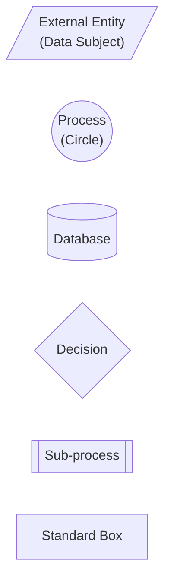

| Shape | Syntax | Use For |
|-------|--------|---------|
| Parallelogram | `[/"text"/]` | External entities, data subjects |
| Circle | `(("text"))` | Processes, transformations |
| Cylinder | `[("text")]` | Data stores, databases |
| Diamond | `{"text"}` | Decisions, validations |
| Stadium | `(["text"])` | Terminals, endpoints |
| Subroutine | `[["text"]]` | Sub-processes |

### Arrow Types

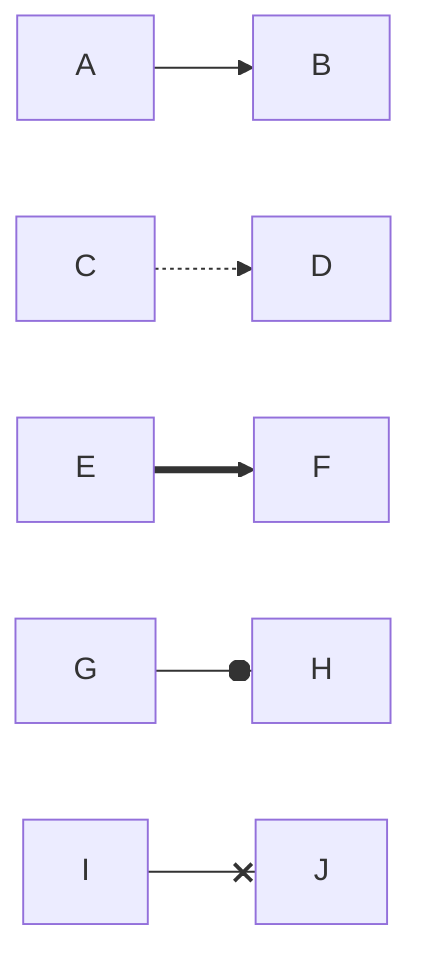

| Arrow | Syntax | Meaning |
|-------|--------|---------|
| Solid | `-->` | Primary data flow |
| Dotted | `-.->` | Optional/conditional flow |
| Thick | `==>` | High-volume/critical flow |
| Circle end | `--o` | Asynchronous/batch |
| Cross end | `--x` | Terminated/blocked |

### Labeled Arrows

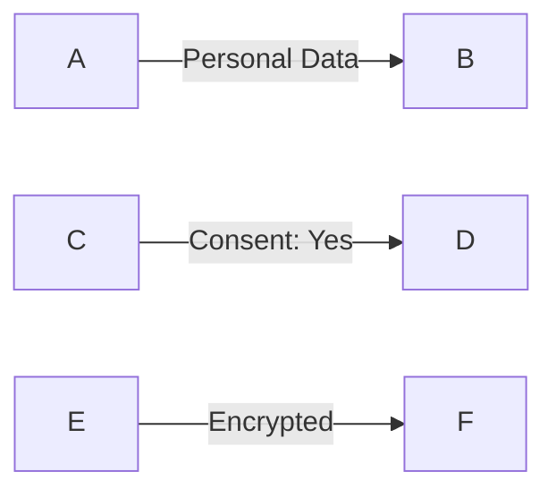

---

## GDPR-Specific Patterns

### Legal Basis Indicators

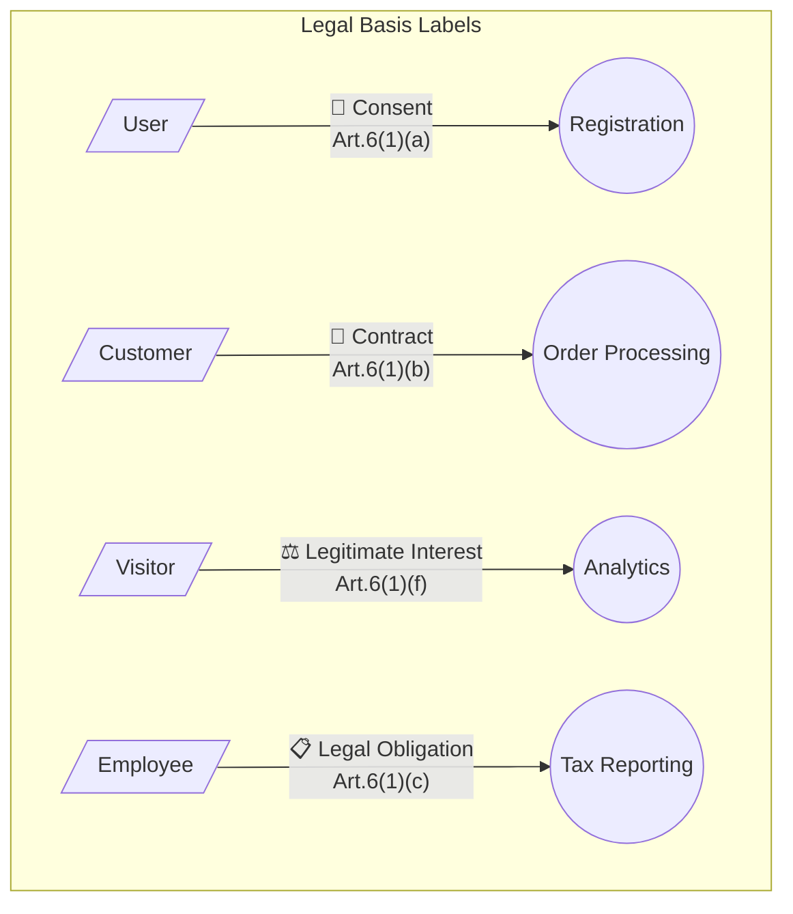

### Data Category Styling

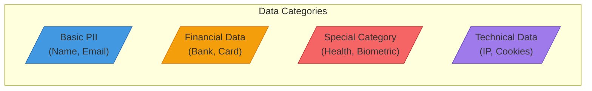

### Retention Period Labels

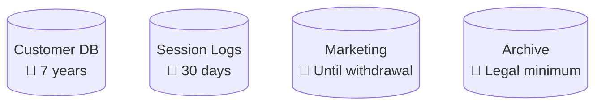

### Security Control Icons

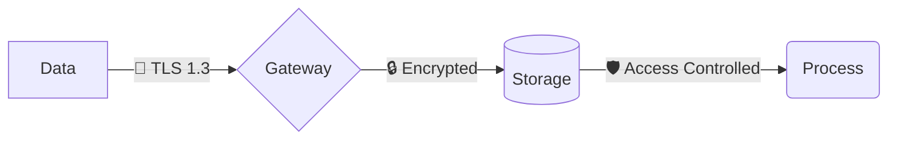

---

## Subgraph Patterns

### Organization Boundaries

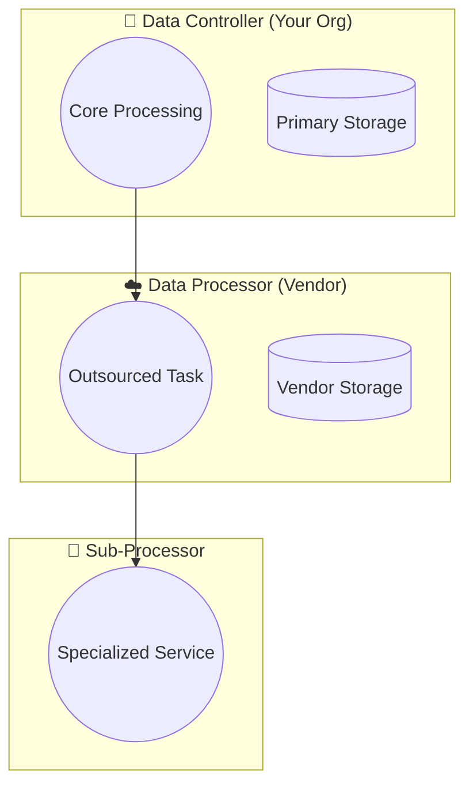

### Geographic Boundaries

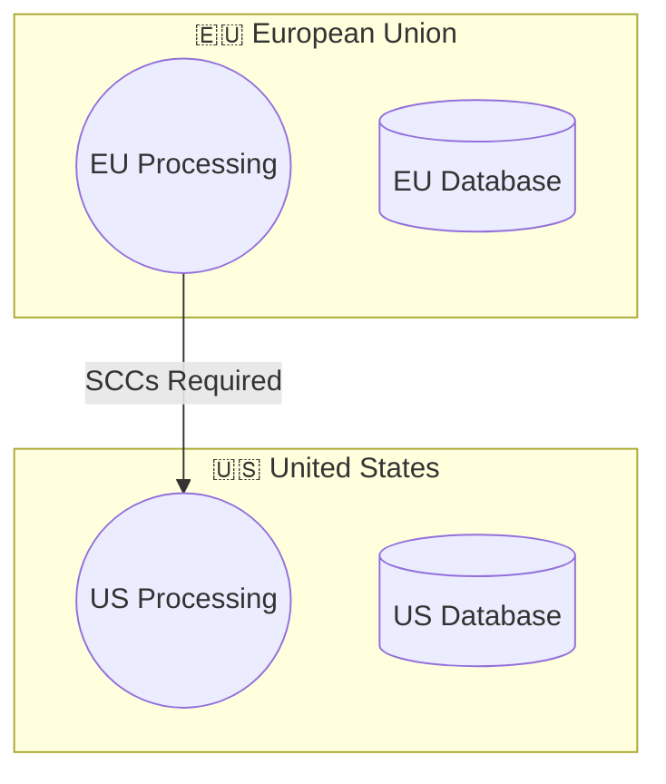

### Data Lifecycle Phases

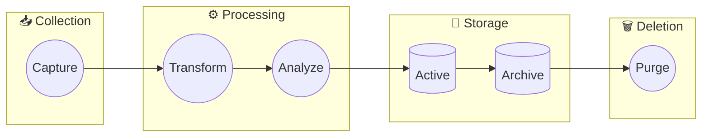

---

## Complex Flow Patterns

### Consent-Based Branching

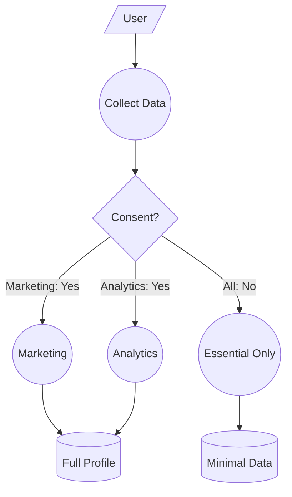

### Data Subject Request Handling

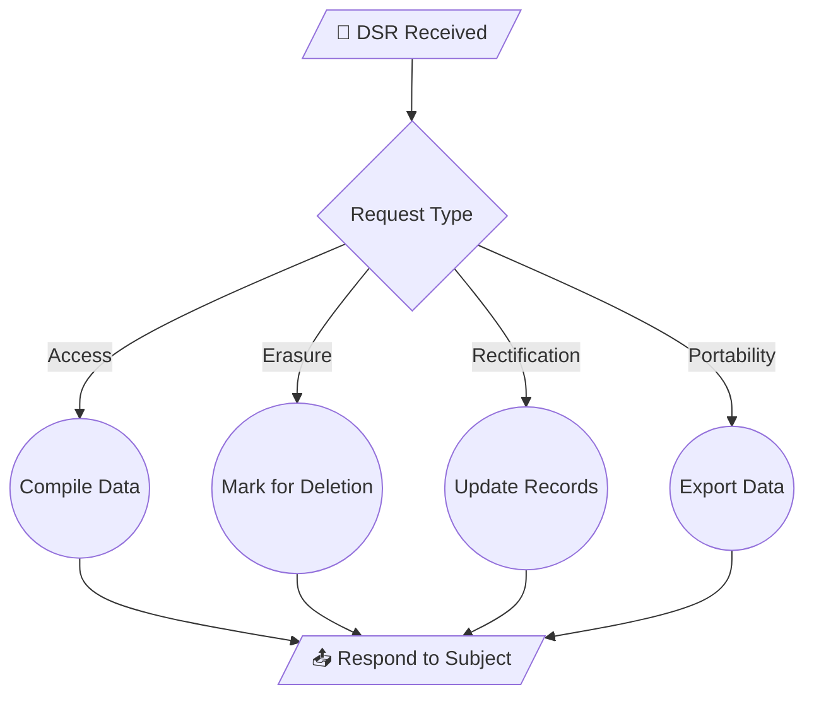

### Third-Party Data Sharing

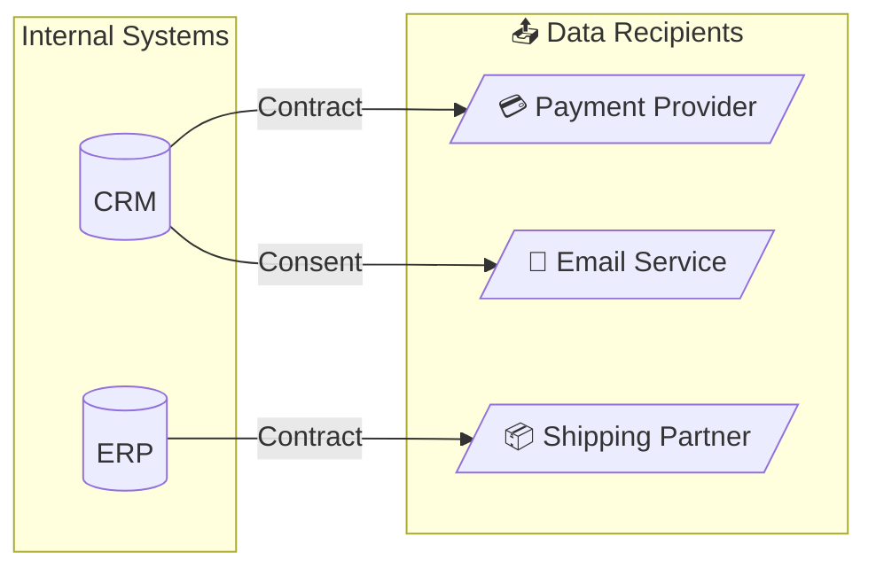

---

## Styling Reference

### Complete Style Block


### Individual Node Styling

```
style NODE_ID fill:#COLOR,stroke:#BORDER,color:#TEXT
```

| Purpose | Fill | Stroke | Text |
|---------|------|--------|------|
| Controller | `#4299e1` | `#2b6cb0` | `#fff` |
| Processor | `#9f7aea` | `#6b46c1` | `#fff` |
| Data Store | `#48bb78` | `#2f855a` | `#fff` |
| External Entity | `#e2e8f0` | `#a0aec0` | `#2d3748` |
| Special Category | `#f56565` | `#c53030` | `#fff` |
| Warning/Attention | `#f59e0b` | `#d97706` | `#fff` |
| Success/Compliant | `#48bb78` | `#2f855a` | `#fff` |

---

## Common Emoji Reference

| Emoji | Meaning |
|-------|---------|
| 👤 | Individual data subject |
| 👥 | Group of data subjects |
| 🏢 | Organization/company |
| ☁️ | Cloud service/processor |
| 🔐 | Encryption in transit |
| 🔒 | Encryption at rest |
| 🛡️ | Security control |
| 📜 | Consent-based |
| 📄 | Contract-based |
| ⚖️ | Legitimate interest |
| 📋 | Legal obligation |
| 🇪🇺 | EU/EEA region |
| 🇺🇸 | United States |
| 🇬🇧 | United Kingdom |
| ✅ | Adequate/compliant |
| ⚠️ | Requires attention |
| ❌ | Non-compliant/blocked |
| 📅 | Retention period |
| 🗑️ | Deletion/purge |
| 📥 | Data input |
| 📤 | Data output |
| 💳 | Financial data |
| 🏥 | Health data |
| 🔬 | Biometric data |
