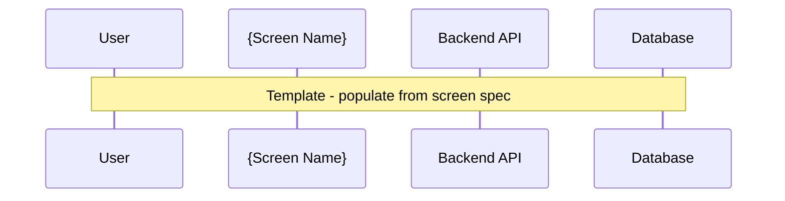

# Generate Product Specs

## FIRST ACTION (MANDATORY)

Before doing ANYTHING else, run this command:

```bash
bash .claude/hooks/log-lifecycle.sh skill generating-product-specs instruction_start '{"stage": "productspecs", "method": "instruction-based"}'
```

> **Implements**: [VERSION_CONTROL_STANDARD.md](../VERSION_CONTROL_STANDARD.md) for output file versioning
> **Supports**: Smart Obsolescence Handling for non-UI projects

## Metadata
- **Skill ID**: ProductSpecs_Generator
- **Version**: 4.0.0
- **Created**: 2024-12-16
- **Updated**: 2025-12-26
- **Author**: Milos Cigoj
- **Change History**:
  - v4.0.0 (2025-12-26): Added NOT_APPLICABLE handling for non-UI projects with API-focused module generation
  - v3.0.0 (2025-12-23): **BREAKING**: Consolidated registries to `traceability/` as single source of truth. Removed local `_registry/` folder.
  - v2.2.0 (2025-12-23): Added NFR registry creation and propagation to ROOT-level traceability for ADR linkage
  - v2.1.0 (2025-12-23): Added mandatory ROOT-level registry propagation for requirements, modules, and test cases
  - v2.0.0 (2025-12-22): Added state management hooks, checkpoint integration, shared _state/ folder support
  - v1.1.0 (2025-12-19): Added version control metadata per VERSION_CONTROL_STANDARD.md
  - v1.0.0 (2024-12-16): Initial release

---

## STATE MANAGEMENT INTEGRATION

### Shared State Files (at PROJECT ROOT)

This skill reads from and writes to shared state files:

| File | Location | Read/Write | Purpose |
|------|----------|------------|---------|
| `productspecs_config.json` | `_state/` | Read | System configuration |
| `productspecs_progress.json` | `_state/` | Read/Write | Phase tracking |
| `discovery_summary.json` | `_state/` | Read | Discovery data |
| `requirements_registry.json` | `_state/` | Read | Requirements |
| `screen_registry.json` | `traceability/` | Read | Screen tracking |

### Checkpoint Integration

This skill handles Checkpoints 3 and 4:

| Checkpoint | Phase | Validation |
|------------|-------|------------|
| 3 | Modules Core | `module-index.md` + at least 1 MOD-*.md |
| 4 | Modules Extended | All screens have module specs |

**Before execution:**
```bash
# Verify Checkpoint 2 passed
python3 .claude/hooks/productspecs_quality_gates.py --validate-checkpoint 2 --dir ProductSpecs_<SystemName>/
```

**After Phase 3 (Core):**
```bash
python3 .claude/hooks/productspecs_quality_gates.py --validate-checkpoint 3 --dir ProductSpecs_<SystemName>/
```

**After Phase 4 (Extended):**
```bash
python3 .claude/hooks/productspecs_quality_gates.py --validate-checkpoint 4 --dir ProductSpecs_<SystemName>/
```

### Progress Updates

Update `_state/productspecs_progress.json` at key points:

```python
# After Phase 3 (Core modules)
progress["phases"]["modules_core"]["status"] = "completed"
progress["phases"]["modules_core"]["completed_at"] = timestamp
progress["phases"]["modules_core"]["outputs"] = ["01-modules/module-index.md", ...]
progress["current_phase"] = 4

# After Phase 4 (Extended modules)
progress["phases"]["modules_extended"]["status"] = "completed"
progress["phases"]["modules_extended"]["completed_at"] = timestamp
progress["current_phase"] = 5
```

---

## APPLICABILITY CHECK (Smart Obsolescence Handling)

**BEFORE generating module specifications**, check project classification:

```
1. Read _state/productspecs_config.json
2. Check project_type from upstream (inherited from Discovery/Prototype)
3. IF project_type IN [BACKEND_ONLY, DATABASE_ONLY, INTEGRATION, INFRASTRUCTURE]:
   → Generate modules for applicable artifacts only
   → Mark UI-related modules as NOT_APPLICABLE
   → Generate API-focused module specs instead
4. IF project_type == FULL_STACK:
   → Proceed with normal module generation (all artifacts)
```

### Project Type Detection (Inherited)

Read from `_state/productspecs_config.json`:

```json
{
  "project_classification": {
    "type": "BACKEND_ONLY",
    "confidence": "HIGH",
    "ui_artifacts_applicable": false,
    "inherited_from": "_state/prototype_config.json"
  }
}
```

### Module Applicability Matrix

| Module Type | FULL_STACK | BACKEND_ONLY | DATABASE_ONLY | INTEGRATION |
|-------------|------------|--------------|---------------|-------------|
| UI/Screen modules (MOD-*-UI-*) | ✅ | ❌ N/A | ❌ N/A | ❌ N/A |
| Component modules (MOD-*-COMP-*) | ✅ | ❌ N/A | ❌ N/A | ❌ N/A |
| API modules (MOD-*-API-*) | ✅ | ✅ | ❌ N/A | ✅ |
| Data modules (MOD-*-DATA-*) | ✅ | ✅ | ✅ | ✅ |
| Integration modules (MOD-*-INT-*) | ✅ | ✅ | ✅ | ✅ |

### API-Focused Module Generation

When `ui_artifacts_applicable == false`:

1. **Skip UI module sections**:
   - Section 2.X.1 UI Component Dictionary → N/A
   - Section 2.X.2 UI State Logic → N/A
   - Screen layout sections → N/A

2. **Expand API sections**:
   - Section 6 API Contracts → Full detail
   - Add Section 6.3 API Integration Patterns
   - Add Section 6.4 Event Handling (if applicable)

3. **Adjust module structure**:
   ```markdown
   ## 2. Endpoint Specifications (instead of Screen Specifications)

   ### Endpoint Group A: {Resource Name}

   * **Group ID:** `EP-{APP}-{RESOURCE}-{NN}`
   * **Base Path:** `/api/v1/{resource}`
   * **Module:** `MOD-{APP}-{FEATURE}-{NN}`

   #### 2.A.1 Endpoint Dictionary

   | Endpoint | Method | Purpose | Auth | Request | Response |
   | :--- | :--- | :--- | :--- | :--- | :--- |

   #### 2.A.2 Request/Response Schemas

   #### 2.A.3 User Stories & Acceptance Criteria

   (Gherkin scenarios for API behavior)
   ```

### NOT_APPLICABLE Module Placeholder

When generating N/A placeholders for UI modules:

```markdown
---
document_id: MOD-{APP}-{FEAT}-{NN}
version: 1.0.0
created_at: {TIMESTAMP}
updated_at: {TIMESTAMP}
generated_by: ProductSpecs_Generator
status: NOT_APPLICABLE
---

# Module Specification: {Module Name}

## Status: NOT APPLICABLE

This module specification has been marked as **NOT APPLICABLE** for the current project.

### Reason

This project is classified as **{PROJECT_TYPE}** which does not include user interface components.
The functionality addressed by this module is instead covered by API endpoints in module `MOD-{APP}-API-{NN}`.

### Project Classification

- **Project Type**: {PROJECT_TYPE}
- **UI Artifacts Applicable**: false
- **Alternative Coverage**: API module `MOD-{APP}-API-{NN}`

### Decision Metadata

| Field | Value |
|-------|-------|
| Decision Date | {TIMESTAMP} |
| Deciding Skill | ProductSpecs_Generator |
| Checkpoint | 3-4 |
| Confidence | {CONFIDENCE} |

### Traceability

Original requirements addressed through alternative modules:
- **REQ-XXX** → Covered by `MOD-{APP}-API-{NN}` endpoint `/api/v1/{resource}`
- **REQ-YYY** → Covered by `MOD-{APP}-DATA-{NN}` data model

---

*This placeholder maintains framework integrity while acknowledging that UI modules are not applicable to this project type.*
```

### Module Registry Updates for N/A

When modules are marked N/A, update `traceability/module_registry.json`:

```json
{
  "items": [
    {
      "id": "MOD-MOB-TASK-01",
      "title": "Mobile Task Execution",
      "status": "not_applicable",
      "reason": "Project classified as BACKEND_ONLY - no mobile UI",
      "alternative_coverage": {
        "module_id": "MOD-API-TASK-01",
        "type": "api_module",
        "requirements_transferred": ["REQ-001", "REQ-002"]
      },
      "app": "mobile",
      "priority": "P0"
    },
    {
      "id": "MOD-API-TASK-01",
      "title": "Task Management API",
      "status": "active",
      "app": "api",
      "priority": "P0",
      "requirements_covered": ["REQ-001", "REQ-002", "REQ-003"]
    }
  ],
  "summary": {
    "total_modules": 10,
    "active_modules": 6,
    "na_modules": 4,
    "by_status": {
      "active": 6,
      "not_applicable": 4
    }
  }
}
```

### User Story Registry for Non-UI Projects

Adjust user story format for API-focused projects:

```json
{
  "id": "US-API-001",
  "title": "Create Task via API",
  "format": "api_consumer",
  "story": "As an API consumer, I want to create a new task via POST /api/v1/tasks so that I can programmatically add tasks to the system",
  "acceptance_criteria": [
    {
      "id": "AC-001",
      "given": "A valid authentication token",
      "when": "POST /api/v1/tasks with valid payload",
      "then": "Return 201 Created with task object"
    }
  ]
}
```

---

## SKILL OVERVIEW

This skill ingests a complete prototype output folder and transforms it into formal, production-ready specifications suitable for:
- Development handoff
- Technical documentation
- QA test case derivation
- Compliance audits
- Stakeholder sign-off

The output follows the **SMART** approach:
- **S**pecific: Exact IDs, testIDs, API endpoints, Gherkin scenarios
- **M**easurable: NFR metrics, acceptance criteria, test coverage
- **A**chievable: Scoped to prototype-validated functionality
- **R**elevant: Traced to original pain points and requirements
- **T**ime-bound: Phased development with milestones

---

## INPUTS REQUIRED

### Configuration (from `_state/productspecs_config.json`)

```json
{
  "system_name": "<SystemName>",
  "prototype_path": "Prototype_<SystemName>",
  "discovery_path": "ClientAnalysis_<SystemName>",
  "output_path": "ProductSpecs_<SystemName>"
}
```

### Required Source Files

```
project_root/
├── _state/                              # SHARED (at ROOT level)
│   ├── discovery_summary.json           # Personas, pain points, entities
│   ├── productspecs_config.json         # ProductSpecs configuration
│   └── productspecs_progress.json       # Phase tracking
│
├── traceability/                        # SHARED REGISTRIES (ROOT level) - SINGLE SOURCE OF TRUTH
│   ├── requirements_registry.json       # All requirements with priorities
│   ├── screen_registry.json             # Screen tracking
│   ├── component_registry.json          # Component registry
│   └── ...                              # Other upstream registries
│
├── Prototype_<SystemName>/              # Prototype outputs
│   ├── 00-foundation/
│   │   ├── data-model/                  # Entity schemas
│   │   ├── api-contracts/               # OpenAPI specs
│   │   └── design-tokens.json           # Design system
│   ├── 01-components/                   # Component specifications
│   ├── 02-screens/                      # Screen specifications
│   ├── 03-interactions/                 # Motion & accessibility
│   └── prototype/src/                   # Working code reference
│
├── ClientAnalysis_<SystemName>/         # Discovery outputs (optional)
│   └── ...
│
└── ProductSpecs_<SystemName>/           # OUTPUT FOLDER
    ├── 00-overview/
    ├── 01-modules/                      # Module specifications
    ├── 02-api/                          # API contracts
    ├── 03-tests/                        # Test specifications
    ├── 04-jira/                         # JIRA export
    └── feedback-sessions/               # Change management
```

### Output Structure (v3.0 - Consolidated Registries)

> **⚠️ IMPORTANT: Single Source of Truth**
>
> As of v3.0, all registries are written DIRECTLY to `traceability/` folder.
> There is NO local `_registry/` folder inside `ProductSpecs_<SystemName>/`.
> This eliminates duplication and sync issues.

```
project_root/
├── _state/                              # SHARED (ROOT level) - Configuration & Progress
│   ├── productspecs_config.json
│   └── productspecs_progress.json
│
├── traceability/                        # SHARED (ROOT level) - ALL REGISTRIES
│   ├── requirements_registry.json       # ← Write directly (CP 2)
│   ├── module_registry.json             # ← Write directly (CP 3-4)
│   ├── nfr_registry.json                # ← Write directly (CP 5)
│   ├── test_case_registry.json          # ← Write directly (CP 6)
│   ├── user_story_registry.json         # ← Write directly (CP 3-4)
│   ├── productspecs_traceability_register.json  # ← Write directly (CP 7)
│   └── ...                              # Other shared registries
│
└── ProductSpecs_<SystemName>/           # OUTPUT FOLDER (Specs only, no registries)
    ├── 00-overview/
    │   ├── MASTER_DEVELOPMENT_PLAN.md       # Program-level plan
    │   ├── GENERATION_SUMMARY.md            # Generation report
    │   └── standards.md                     # Coding standards
    │
    ├── 01-modules/                          # Per-module specifications
    │   ├── module-index.md                  # Module index
    │   └── MOD-{APP}-{FEAT}-{NN}.md         # Individual module specs
    │
    ├── 02-api/                              # API specifications
    │   ├── api-index.md
    │   └── data-contracts.md
    │
    ├── 03-tests/                            # Test specifications
    │   ├── test-case-registry.md
    │   └── e2e-scenarios.md
    │
    ├── 04-jira/                             # JIRA export
    │   ├── IMPORT_GUIDE.md
    │   ├── full-hierarchy.csv
    │   └── jira_config.json
    │
    └── feedback-sessions/                   # Change management
        └── productspecs_feedback_registry.json
```

---

## 🚨 CONSOLIDATED REGISTRY ARCHITECTURE (v3.0) 🚨

> **SINGLE SOURCE OF TRUTH**: All registries live in `traceability/` at project ROOT.
> No more local `_registry/` folders. No more propagation steps.

### Registry Write Locations

| Checkpoint | Registry File | Write Location |
|------------|---------------|----------------|
| CP 2 (Extract) | `requirements_registry.json` | `traceability/requirements_registry.json` |
| CP 3-4 (Modules) | `module_registry.json` | `traceability/module_registry.json` |
| CP 3-4 (User Stories) | `user_story_registry.json` | `traceability/user_story_registry.json` |
| CP 5 (Contracts) | `nfr_registry.json` | `traceability/nfr_registry.json` |
| CP 6 (Tests) | `test_case_registry.json` | `traceability/test_case_registry.json` |
| CP 7 (Finalize) | `productspecs_traceability_register.json` | `traceability/productspecs_traceability_register.json` |

### Benefits of Consolidated Architecture

1. **No Duplication**: Each registry exists in exactly one location
2. **No Sync Issues**: No need to propagate from local to ROOT
3. **Simpler Validation**: Quality gates check one location
4. **Cross-Stage Access**: All stages read/write same files
5. **Easier Debugging**: Single source of truth for traceability

### Validation

```bash
# Verify all ProductSpecs registries exist
ls -la traceability/ | grep -E "(module|nfr|test_case|user_story)_registry"
```

---

## 🚨 MODULE REGISTRY CREATION (MANDATORY for CP 3-4) 🚨

**CRITICAL**: During Checkpoints 3-4 (Modules), you MUST create the module registry DIRECTLY in `traceability/module_registry.json`.

> **GATE**: Checkpoint 4 CANNOT pass validation if `traceability/module_registry.json` has empty `items` array.

### Module Registry Schema

Write DIRECTLY to `traceability/module_registry.json`:

```json
{
  "schema_version": "1.0.0",
  "stage": "ProductSpecs",
  "checkpoint": 4,
  "source_file": "traceability/module_registry.json",
  "system_name": "{SystemName}",
  "created_at": "YYYY-MM-DD",
  "updated_at": "YYYY-MM-DD",
  "traceability_chain": {
    "upstream": ["requirements_registry.json", "screen_registry.json", "component_registry.json"],
    "downstream": ["nfr_registry.json", "adr_registry.json", "test_case_registry.json", "user_story_registry.json"]
  },
  "items": [
    {
      "id": "MOD-XXX-YYY-NN",
      "title": "Module title",
      "app": "mobile|desktop|admin|shared",
      "priority": "P0|P1|P2",
      "phase": 1,
      "epic_id": "REQ-XXX",
      "pain_point_refs": ["PP-X.X"],
      "jtbd_refs": ["JTBD-X.X"],
      "requirement_refs": ["REQ-XXX"],
      "screen_refs": ["SCR-XXX", "M-XX", "D-XX"],
      "component_refs": ["COMP-XXX"],
      "api_endpoints": ["ENDPOINT-XXX"],
      "user_stories": ["US-XXX"],
      "nfr_refs": [],
      "adr_refs": [],
      "effort": {
        "fe": 8,
        "be": 5,
        "qa": 3,
        "total": 16
      },
      "spec_file": "01-modules/MOD-XXX-YYY-NN.md"
    }
  ],
  "summary": {
    "total_modules": 0,
    "by_app": {
      "mobile": 0,
      "desktop": 0
    },
    "by_priority": {
      "P0": 0,
      "P1": 0,
      "P2": 0
    },
    "by_phase": {},
    "total_effort": {
      "fe": 0,
      "be": 0,
      "qa": 0,
      "total": 0
    }
  }
}
```

### Module ID Convention

```
MOD-{APP_CODE}-{FEATURE}-{NN}

App Codes:
- MOB: Mobile application
- DSK: Desktop application
- ADM: Admin portal
- SHR: Shared/cross-platform module

Examples:
- MOD-MOB-TASK-01: Mobile Task Execution
- MOD-DSK-DASH-01: Desktop Dashboard
- MOD-SHR-AUTH-01: Shared Authentication
```

### Module Traceability Chain (MANDATORY)

Each module MUST link to upstream artifacts:

```
1. Pain Points → Which pain points does this module address?
   - Extract from: ClientAnalysis_*/01-analysis/PAIN_POINTS.md
   - Link via: pain_point_refs[]

2. JTBDs → Which jobs does this module fulfill?
   - Extract from: ClientAnalysis_*/02-research/JOBS_TO_BE_DONE.md
   - Link via: jtbd_refs[]

3. Requirements → Which requirements define this module?
   - Extract from: _state/requirements_registry.json
   - Link via: requirement_refs[], epic_id

4. Screens → Which screens implement this module?
   - Extract from: traceability/screen_registry.json
   - Link via: screen_refs[]

5. Components → Which components are used?
   - Extract from: traceability/component_registry.json (if exists)
   - Link via: component_refs[]
```

### Module Registry Population Process (v3.0 - Direct Write)

```
# Step 1: Read all generated module specs
FOR each file in 01-modules/MOD-*.md:
  EXTRACT module metadata from frontmatter/header

# Step 2: Build module item with full traceability
FOR each module:
  FIND pain_point_refs by matching module description to PP-X.X
  FIND jtbd_refs by matching module goals to JTBD-X.X
  FIND requirement_refs from epic_id and related requirements
  FIND screen_refs from traceability/screen_registry.json
  FIND component_refs from traceability/component_registry.json

# Step 3: Write DIRECTLY to traceability/ (SINGLE SOURCE OF TRUTH)
WRITE traceability/module_registry.json

# Step 4: Verify
VALIDATE traceability/module_registry.json has items.length > 0
```

### Module Registry Update Triggers

The module registry at `traceability/module_registry.json` MUST be updated when:

| Event | Action |
|-------|--------|
| New module created | ADD to items[], recalculate summary |
| Module renamed | UPDATE id, title, spec_file in items[] |
| Module deleted | REMOVE from items[], recalculate summary |
| Module priority changed | UPDATE priority, recalculate summary.by_priority |
| Module screens changed | UPDATE screen_refs[] |
| NFRs assigned (CP 5) | UPDATE nfr_refs[] |
| ADRs created (SolArch) | UPDATE adr_refs[] |

### Validation Gate (CP 4)

```bash
# This validation MUST pass before proceeding to CP 5
python3 .claude/hooks/productspecs_quality_gates.py --validate-checkpoint 4 --dir ProductSpecs_X/

# Will check:
# 1. traceability/module_registry.json exists with items.length > 0
# 2. All modules have at least: id, title, app, priority, phase
# 3. All P0 modules have epic_id and screen_refs
```

---

## 🚨 NFR REGISTRY CREATION (MANDATORY for CP 5) 🚨

**CRITICAL**: During Checkpoint 5 (Contracts), you MUST create the NFR registry DIRECTLY in `traceability/nfr_registry.json` to enable NFR → ADR traceability in Solution Architecture.

### NFR Registry Schema

Write DIRECTLY to `traceability/nfr_registry.json`:

```json
{
  "schema_version": "1.0.0",
  "stage": "ProductSpecs",
  "checkpoint": 5,
  "source_file": "traceability/nfr_registry.json",
  "created_at": "YYYY-MM-DD",
  "updated_at": "YYYY-MM-DD",
  "traceability_chain": {
    "upstream": ["requirements_registry.json", "module_registry.json"],
    "downstream": ["adr_registry.json", "test_case_registry.json"]
  },
  "items": [
    {
      "id": "NFR-XXX",
      "category": "Performance|Availability|Security|Scalability|Accessibility|Maintainability",
      "title": "NFR title",
      "description": "Full description",
      "smart_metric": "Specific measurable target with units",
      "priority": "P0|P1|P2",
      "module_refs": ["MOD-XXX"],
      "requirement_refs": ["REQ-XXX", "US-XXX"],
      "screen_refs": ["SCR-XXX"],
      "verification_method": "How to test this NFR",
      "adr_refs": [],  // Populated by SolutionArchitecture_AdrGenerator
      "test_case_ids": []  // Populated by test generation
    }
  ],
  "summary": {
    "total_nfrs": 0,
    "by_category": {
      "Performance": 0,
      "Availability": 0,
      "Security": 0,
      "Scalability": 0,
      "Accessibility": 0,
      "Maintainability": 0
    },
    "by_priority": {
      "P0": 0,
      "P1": 0,
      "P2": 0
    }
  }
}
```

### NFR ID Convention

```
NFR-{CATEGORY_CODE}-{NNN}

Category Codes:
- PERF: Performance
- AVAIL: Availability
- SEC: Security
- SCALE: Scalability
- A11Y: Accessibility
- MAINT: Maintainability

Examples:
- NFR-PERF-001: Page load under 2 seconds
- NFR-SEC-003: JWT token expiry
- NFR-A11Y-002: WCAG 2.1 AA compliance
```

### NFR Extraction Process

```
# During Phase 2.5 (NFR Extraction):

READ _state/requirements_registry.json AS req_reg
READ all module specs from 01-modules/MOD-*.md

EXTRACT NFRs from:
1. requirements_registry.json → non_functional_requirements[]
2. Module specs → Section 4: Non-Functional Requirements
3. Accessibility specs from Prototype → 03-interactions/accessibility-spec.md

FOR each extracted NFR:
  ASSIGN unique ID: NFR-{CATEGORY}-{NNN}
  MAP to modules that implement it
  MAP to requirements that define it
  CAPTURE SMART metric

# Write DIRECTLY to traceability/ (SINGLE SOURCE OF TRUTH)
WRITE traceability/nfr_registry.json

# Update module registry with NFR links
READ traceability/module_registry.json AS mod_reg

FOR each NFR in nfr_registry.items:
  FOR each mod_id in NFR.module_refs:
    FIND module in mod_reg.items WHERE id == mod_id
    IF module.nfr_refs NOT CONTAINS NFR.id:
      APPEND NFR.id TO module.nfr_refs

WRITE traceability/module_registry.json
```

---

## EXECUTION PHASES

### Phase 1: ANALYZE - Extract & Map Structure
### Phase 2: GENERATE_MODULES - Create Module Specifications  
### Phase 3: GENERATE_PLAN - Create Master Development Plan
### Phase 4: VALIDATE - Verify Completeness & Traceability

---

## PHASE 1: ANALYZE

> **Note**: This phase is typically completed by `ProductSpecs_Validate` and `ProductSpecs_ExtractRequirements`.
> If running standalone, ensure Checkpoints 0-2 are passed first.

### Step 1.0: Load Configuration

```python
# Load from shared _state/ at ROOT level
config = json.load("_state/productspecs_config.json")
system_name = config["system_name"]
prototype_path = config["prototype_path"]
discovery_path = config["discovery_path"]
output_path = config["output_path"]
```

### Step 1.1: Load Discovery Summary

```
READ: _state/discovery_summary.json  # SHARED at ROOT level

EXTRACT:
  - product_name
  - product_description
  - stakeholders[] → map to CM-{NNN} IDs
  - personas[] → map to PERSONA-{ID}
  - pain_points[] → preserve PP-{NNN} IDs
  - entities[] → map to ENT-{NAME}
  - screens[] → map to SCR-{APP}-{NAME}-{NN}
  - workflows[] → map to WF-{NNN}
  - jobs_to_be_done → map to JTBD-{N.N}

STORE → analysis.discovery
```

### Step 1.2: Load Requirements Registry

```
READ: _state/requirements_registry.json  # SHARED at ROOT level

EXTRACT:
  - user_stories[] → US-{NNN}
  - functional_requirements[] → FR-{NNN}
  - non_functional_requirements[] → NFR-{NNN}
  - accessibility_requirements[] → A11Y-{NNN}

MAP each requirement to:
  - Source pain point (PP-xxx)
  - Source JTBD
  - Implementing screen(s)
  - Implementing component(s)
  - Priority (P0/P1/P2)

STORE → analysis.requirements
```

### Step 1.2b: Load Traceability Registries (SINGLE SOURCE OF TRUTH)

```
# If resuming from Phase 2 - READ FROM traceability/ (ROOT LEVEL)
IF EXISTS: traceability/requirements_registry.json
  READ: traceability/requirements_registry.json
  READ: traceability/traceability_matrix_master.json

  # Use enriched requirements with traceability chains
  STORE → analysis.enriched_requirements
```

### Step 1.3: Load Screen Specifications

```
# Use prototype_path from config
FOR EACH app_folder IN {prototype_path}/02-screens/*/

  READ: {app_folder}/README.md → Extract app metadata

  FOR EACH screen_file IN {app_folder}/*.md

    EXTRACT:
      - Screen ID
      - Name
      - URL/Route
      - Primary User (persona)
      - Requirements Addressed (table)
      - Layout (ASCII diagram)
      - Components Used (table)
      - Data Requirements
      - User Interactions
      - States
      - Accessibility

    STORE → analysis.screens[{screen_id}]

# Also load screen registry from shared state
READ: traceability/screen_registry.json
STORE → analysis.screen_registry
```

### Step 1.4: Load Component Specifications

```
FOR EACH category IN [primitives, data-display, feedback, navigation, overlays, patterns]
  
  FOR EACH component_file IN {PROTOTYPE_PATH}/01-components/{category}/*.md
    
    EXTRACT:
      - Component name
      - Requirements addressed
      - Variants
      - Props (name, type, default, description)
      - States
      - Token mappings
      - Accessibility attributes
    
    STORE → analysis.components[{component_name}]
```

### Step 1.5: Load API Contracts

```
READ: {PROTOTYPE_PATH}/00-foundation/api-contracts/openapi.yaml

EXTRACT:
  - All endpoints with methods
  - Request/response schemas
  - Error codes
  - Authentication requirements

FOR EACH endpoint_doc IN {PROTOTYPE_PATH}/00-foundation/api-contracts/endpoints/*.api.md
  EXTRACT detailed endpoint documentation

STORE → analysis.api
```

### Step 1.6: Load Data Model

```
FOR EACH schema_file IN {PROTOTYPE_PATH}/00-foundation/data-model/entities/*.schema.json
  
  EXTRACT:
    - Entity name
    - Fields with types
    - Required fields
    - Foreign keys
    - Validation rules
  
STORE → analysis.entities

READ: {PROTOTYPE_PATH}/00-foundation/data-model/constraints/referential-integrity.md
STORE → analysis.relationships
```

### Step 1.7: Load Validation Results

```
READ: {PROTOTYPE_PATH}/05-validation/TRACEABILITY_MATRIX.md
READ: {PROTOTYPE_PATH}/05-validation/REQUIREMENTS_COVERAGE.md
READ: {PROTOTYPE_PATH}/05-validation/VALIDATION_REPORT.md

EXTRACT:
  - P0 coverage percentage
  - P1 coverage percentage
  - Requirement → Implementation mappings
  - Any gaps or issues

STORE → analysis.validation
```

### Step 1.8: Derive Module Structure

```
ANALYZE screens and group into logical MODULES:

MODULE criteria:
  - Screens sharing same workflow
  - Screens with shared primary entity
  - Screens for same persona/role
  - Screens with sequential navigation

GENERATE module_map:
  {
    "MOD-{APP}-{FEATURE}-{NN}": {
      "name": "Module Name",
      "app": "app_id",
      "screens": ["SCR-xxx", "SCR-yyy"],
      "primary_entity": "Entity",
      "primary_persona": "persona_id",
      "workflows": ["WF-xxx"],
      "requirements": ["US-xxx", "FR-xxx"],
      "priority": "P0|P1|P2"
    }
  }

STORE → analysis.modules
```

### Step 1.9: Load Client Materials (Optional)

```
IF {CLIENT_ANALYSIS_PATH} exists:
  
  READ: {CLIENT_ANALYSIS_PATH}/discovery_summary.json
  
  EXTRACT:
    - Original stakeholder quotes → CM-{NNN}
    - Interview transcripts references
    - Raw pain point descriptions
  
  STORE → analysis.client_materials
```

---

## PHASE 2: GENERATE_MODULES

For each module in `analysis.modules`, generate a complete specification file.

### Step 2.1: Generate Module Spec Header

```markdown
---
document_id: {MOD-APP-FEATURE-NN}
version: 1.0.0
created_at: {YYYY-MM-DD}
updated_at: {YYYY-MM-DD}
generated_by: ProductSpecs_Generator
source_files:
  - "{PROTOTYPE_PATH}/_state/discovery_summary.json"
  - "{PROTOTYPE_PATH}/_state/requirements_registry.json"
  - "{PROTOTYPE_PATH}/02-screens/{app}/*.md"
change_history:
  - version: "1.0.0"
    date: "{YYYY-MM-DD}"
    author: "ProductSpecs_Generator"
    changes: "Initial module specification generation from prototype"
---

# Module Specification: {Module Name}

| **Meta Field** | **Value** |
| :--- | :--- |
| **Module ID** | `{MOD-APP-FEATURE-NN}` |
| **Owner** | {Derived from primary_persona or "Product Team"} |
| **Status** | 🟢 **Approved for Dev** |
| **Prototype Source** | `{PROTOTYPE_PATH}/prototype/` |
| **Prototype Screens** | {List of screen files with relative paths} |

---
```

### Step 2.2: Generate Traceability Section

```markdown
## 1. Traceability & Context

### 1.1 Trace Map

| Level | ID | Description / Artifact |
| :--- | :--- | :--- |
| **Client Material** | `{CM-NNN}` | "{Direct quote from stakeholder}" |
| **Pain Point** | `{PP-NNN}` | "{Pain point description}" |
| **Job To Be Done** | `{JTBD-N.N}` | "{JTBD statement}" |
| **PRD Requirement** | `{US-NNN}` | "{Requirement title}" |
| **Prototype Screen** | `{SCR-xxx}` | [Link: 02-screens/{app}/{screen}.md] |

### 1.2 Module Scope (Use Cases)

```mermaid
useCaseDiagram
    {Generate actors from personas using this module}
    {Generate use cases from requirements}
    {Generate relationships}
```

### 1.3 Workflow Mapping

| Workflow ID | Name | Screens Involved | Target Time |
| :--- | :--- | :--- | :--- |
| {WF-NNN} | {Workflow name} | {SCR-xxx → SCR-yyy} | {target from discovery} |
```

**RULES for Traceability:**
- Every module MUST trace to at least one CM (Client Material)
- Every module MUST trace to at least one PP (Pain Point)
- Every module MUST have JTBD linkage
- Every PRD requirement MUST link to prototype screen
- Use ACTUAL IDs from discovery_summary.json and requirements_registry.json
```

### Step 2.3: Generate Screen Specifications

For each screen in the module:

```markdown
## 2. Screen Specifications

### Screen {Letter}: {Screen Name}

* **Screen ID:** `{SCR-APP-NAME-NN}`
* **Name:** {Screen Name}
* **URL Route:** `{route from screen spec}`
* **Source Prototype:** `{PROTOTYPE_PATH}/02-screens/{app}/{screen}.md`
* **Implementation:** `{PROTOTYPE_PATH}/prototype/src/screens/{ScreenName}Screen.tsx`

#### 2.{N}.1 UI Component Dictionary

| Component Name | UI ID (`testID`) | Type | Props / Constraints |
| :--- | :--- | :--- | :--- |
{FOR EACH component in screen's "Components Used" table:}
| **{Component display name}** | `{generate_testid(component, location)}` | `{Component type}` | {Props from component spec} |

**testID Generation Rules:**
- Format: `{element_type}_{semantic_name}`
- Examples: `btn_confirm`, `input_search`, `card_item_{id}`, `table_transactions`
- Must be unique within screen
- Must be deterministic (same input = same output)

#### 2.{N}.2 UI State Logic

```mermaid
stateDiagram-v2
    [*] --> {Initial state}
    {Generate states from screen spec "States" section}
    {Generate transitions from "User Interactions" section}
```

#### 2.{N}.3 User Stories & Acceptance Criteria

{FOR EACH requirement addressed by this screen:}

**User Story {N}:** {Requirement title}
* **Req ID:** `{US-NNN}`
* **Priority:** {P0|P1|P2}
* **Persona:** {Primary user from requirement}

**Acceptance Criteria (Gherkin):**
```gherkin
Feature: {Requirement title}

  Scenario: {Happy path scenario}
    GIVEN {precondition from screen spec}
    WHEN {user action from interactions table}
    THEN {expected result from screen spec}
    AND {verification step}

  Scenario: {Edge case from screen spec States section}
    GIVEN {edge case trigger}
    WHEN {user attempts action}
    THEN {expected error handling}
```

#### 2.{N}.4 Data Requirements

| Data Element | Source | API Endpoint | Caching | Req Trace |
| :--- | :--- | :--- | :--- | :--- |
{FROM screen spec "Data Requirements" table, ADD API endpoint from api-contracts}

#### 2.{N}.5 Interaction Flow (Sequence)


```

### Step 2.4: Generate Access Control Section

```markdown
## 3. Access Control & Security Policies (RBAC/ABAC)

### 3.1 Permission Matrix (RBAC)

{Derive from personas who use this module and their roles}

| Action ID | Resource | {Role 1} | {Role 2} | {Role 3} |
| :--- | :--- | :--- | :--- | :--- |
| `ACT-{NN}` | **{Entity/Action}** | {✅ CRUD permissions | ❌ DENY} | ... | ... |

**Permission Derivation Rules:**
- Primary persona for module → Full CRUD on primary entity
- Secondary personas → READ only unless explicitly granted
- Admin role → READ + DELETE on all resources
- Public/Anonymous → Only explicitly public endpoints

### 3.2 Attribute Logic (ABAC)

{Generate based on entity ownership and multi-tenancy requirements}

**Policy {N}: {Policy Name}**

> **Rule:** {Condition for access}
> **Trace:** `SEC-POL-{NN}`
> **Derived From:** {NFR or security requirement ID}

### 3.3 Authorization Flowchart

```mermaid
flowchart TD
    Req[Incoming Request] --> Auth{Is Authenticated?}
    {Generate flowchart based on roles and policies}
```

### 3.4 Security Acceptance Criteria (Gherkin)

```gherkin
Feature: Access Control Enforcement for {Module Name}

  Scenario: {Role} can {allowed action}
    GIVEN a user with role "{Role}"
    WHEN they attempt to {action} on {resource}
    THEN the request should succeed with status {200|201}

  Scenario: {Role} cannot {denied action}
    GIVEN a user with role "{Role}"
    WHEN they attempt to {action} on {resource}
    THEN the API should return 403 Forbidden
```
```

### Step 2.5: Generate NFR Section

```markdown
## 4. Non-Functional Requirements (NFRs)

| ID | Category | Requirement | Metric / Test | Source |
| :--- | :--- | :--- | :--- | :--- |
{FOR EACH NFR in requirements_registry that applies to this module:}
| `{NFR-NNN}` | {Category} | {Description} | {SMART metric} | {Trace to NFR-xxx} |

**SMART Metrics Examples:**
- Performance: "Page load < 2s at 95th percentile"
- Availability: "99.9% uptime measured monthly"  
- Accessibility: "WCAG 2.1 AA compliant, verified by axe-core"
- Security: "All API responses < 100ms for auth checks"
- Scalability: "Support 100 concurrent users per tenant"

### 4.1 Accessibility Requirements

| ID | WCAG Criterion | Implementation | Test Method |
| :--- | :--- | :--- | :--- |
{FROM 03-interactions/accessibility-specs.md relevant to this module}
| `{A11Y-NNN}` | {WCAG ref} | {How implemented in components} | {How to verify} |
```

### Step 2.6: Generate Edge Cases Section

```markdown
## 5. Edge Cases & Exception Handling

### 5.1 Boundary Conditions

| Edge Case ID | Trigger | Expected System Behavior | Related Req |
| :--- | :--- | :--- | :--- |
{FROM screen specs "States" sections - error, empty, edge cases}
| `EC-{MOD}-{NN}` | {Trigger condition} | {Expected UI + API behavior} | {Req ID} |

### 5.2 Error Handling Matrix

| Error Code | Trigger | User Message | Recovery Action | API Response |
| :--- | :--- | :--- | :--- | :--- |
{FROM api-contracts error codes + screen error states}
| {4xx/5xx} | {What causes it} | {User-friendly message} | {What user can do} | {JSON error response} |

### 5.3 Race Condition Handling

{IF module has concurrent access patterns (e.g., booking, stock adjustment):}

```mermaid
sequenceDiagram
    participant A as User A
    participant B as User B
    participant API as API
    participant DB as Database
    
    {Generate optimistic locking / conflict resolution flow}
```

**Conflict Resolution Strategy:** {Optimistic Locking | Last Write Wins | Merge | User Choice}
```

### Step 2.7: Generate API Contract Section

```markdown
## 6. API Contracts

### 6.1 Endpoint Summary

| Method | Endpoint | Purpose | Auth | Request | Response |
| :--- | :--- | :--- | :--- | :--- | :--- |
{FROM openapi.yaml filtered to this module's entities}
| {GET|POST|PUT|DELETE} | `/api/{resource}` | {Description} | {JWT|API Key|Public} | {Schema ref} | {Schema ref} |

### 6.2 Request/Response Schemas

{FOR EACH endpoint used by this module:}

#### {METHOD} {endpoint}

**Request:**
```json
{JSON schema from openapi.yaml or api-contracts/types/requests.d.ts}
```

**Response (Success):**
```json
{JSON schema from openapi.yaml or api-contracts/types/responses.d.ts}
```

**Response (Error):**
```json
{Error schema from api-contracts/types/errors.d.ts}
```
```

### Step 2.8: Generate Test Specifications

```markdown
## 7. Test Specifications

### 7.1 Unit Test Coverage

| Component | Test File | Coverage Target | Key Scenarios |
| :--- | :--- | :--- | :--- |
{FOR EACH component in this module}
| {ComponentName} | `{ComponentName}.test.tsx` | 80% | {List key test scenarios} |

### 7.2 Integration Test Scenarios

| Scenario ID | Description | Preconditions | Steps | Expected Result |
| :--- | :--- | :--- | :--- | :--- |
{FROM Gherkin scenarios, expand to full test specs}
| `IT-{MOD}-{NN}` | {Scenario name} | {Setup required} | {Step-by-step} | {Verification} |

### 7.3 E2E Test Flows

| Flow ID | User Journey | Screens | Duration | Priority |
| :--- | :--- | :--- | :--- | :--- |
{FROM workflows mapped to this module}
| `E2E-{MOD}-{NN}` | {Journey description} | {Screen sequence} | {Expected time} | {P0|P1|P2} |
```

### Step 2.9: Write Module Spec File

```
WRITE: {OUTPUT_PATH}/modules/{MOD-ID}.md
  Content: Assembled module specification

# WRITE DIRECTLY TO traceability/ (SINGLE SOURCE OF TRUTH)
UPDATE: traceability/module_registry.json
  Add: Module metadata to items array
  Update: summary counts
```

---

## PHASE 3: GENERATE_PLAN

Create the Master Development Plan aggregating all modules.

### Step 3.1: Generate Ecosystem Map

```markdown
---
document_id: PRG-{PRODUCT}-MASTER-001
version: 1.0.0
created_at: {YYYY-MM-DD}
updated_at: {YYYY-MM-DD}
generated_by: ProductSpecs_Generator
source_files:
  - "{PROTOTYPE_PATH}/_state/discovery_summary.json"
  - "{PROTOTYPE_PATH}/_state/requirements_registry.json"
  - "{OUTPUT_PATH}/modules/*.md"
change_history:
  - version: "1.0.0"
    date: "{YYYY-MM-DD}"
    author: "ProductSpecs_Generator"
    changes: "Initial master development plan generation"
---

# 🏗️ Master Program: {Product Name}

**System Scope:** {N} Applications, {M} Modules
**Methodology:** Spec-Driven Development
**Generated From:** {PROTOTYPE_PATH}

---

## 1. The Ecosystem Map

*High-level architecture defining where modules live.*

{FOR EACH unique app in analysis.modules:}
* **{App Name}:** `{APP-ID}` ({Technology stack from prototype})

---
```

### Step 3.2: Generate Module Registry

```markdown
## 2. Module Registry

{FOR EACH module in analysis.modules, sorted by priority then app:}

### Module {Letter}: {Module Name}

* **Module ID:** `{MOD-ID}`
* **Primary App:** `{APP-ID}`
* **Core Function:** {One-line description}
* **Key Logic:** {Critical business rule or formula}
* **Screen IDs:** {List of SCR-xxx}
* **Complexity:** {Low | Medium | High} ({Reason})
* **Priority:** {P0 | P1 | P2}
* **Spec File:** [modules/{MOD-ID}.md](modules/{MOD-ID}.md)

---
```

### Step 3.3: Generate Golden Thread Traceability Matrix

```markdown
## 3. The "Golden Thread" Traceability Matrix

*Maps **User Needs** all the way to **QA Tests**. If a row is broken, the feature is at risk.*

| **Origin (Why)** | **Requirement (What)** | **Spec / Screen (How)** | **User Story (Dev)** | **Acceptance Criteria** | **Test Case ID** | **Status** |
| :--- | :--- | :--- | :--- | :--- | :--- | :--- |
{FOR EACH P0 requirement first, then P1, then P2:}
| **{CM-ID}**<br>{Quote snippet} | **{REQ-ID}**<br>{Title} | **{MOD-ID}**<br>`{SCR-ID}` | **{US-ID}**<br>{Story title} | `Scenario: {Gherkin title}` | `TC-{TYPE}-{NNN}`<br>({Status}) | {🟢 Done \| 🟡 In Dev \| 🔴 Bug} |

**Status Legend:**
- 🟢 **Done**: Implemented and tested in prototype
- 🟡 **In Dev**: Specified, implementation pending
- 🔴 **Bug**: Issue identified during validation
- ⚪ **Not Started**: Scheduled for future phase

---
```

### Step 3.4: Generate Program Dashboard

```markdown
## 4. Program Progress Dashboard

*High-level view showing the maturity of each module.*

| Module | Spec Definition | Design (Tokens) | Mock API | Backend Dev | Frontend Dev | QA Automation |
| :--- | :---: | :---: | :---: | :---: | :---: | :---: |
{FOR EACH module:}
| **{Module Name}** | {🟢 Approved} | {Status from prototype} | {Status from api-contracts} | {⚪ Pending} | {Status from codegen} | {Status from validation} |

**Dashboard Derivation:**
- Spec Definition: 🟢 if module spec generated
- Design: 🟢 if design tokens referenced in components
- Mock API: 🟢 if api-contracts/mocks exist for entities
- Backend Dev: ⚪ (prototype is frontend-only)
- Frontend Dev: 🟢 if prototype/src/screens exists
- QA Automation: Status from 05-validation/

---
```

### Step 3.5: Generate Development Template

```markdown
## 5. Development Template (How to Build a Module)

*Every team follows this 4-Step Standard Operating Procedure (SOP).*

### Phase 1: The Definition Gate

* **Input:** Module Spec File + Design Tokens
* **Output:** Approved specification with all sections complete
* **Checklist:**
    * [ ] Every UI element has a `testID`?
    * [ ] Sequence Diagram for each API flow?
    * [ ] JSON Schema defined for all entities?
    * [ ] Gherkin scenarios for all P0 requirements?
    * [ ] RBAC/ABAC policies documented?
* **Gatekeeper:** Architect must approve spec PR.

### Phase 2: The Contract Handshake

* **Input:** Module Spec API Contracts section
* **Output:** Generated SDK + Mock Server
* **Action:**
    ```bash
    # Generate types from OpenAPI spec
    npx openapi-typescript {PROTOTYPE_PATH}/00-foundation/api-contracts/openapi.yaml -o src/types/api.d.ts
    
    # Generate mock handlers
    npm run gen:mocks --module={MOD-ID}
    ```

### Phase 3: Parallel Build

* **Backend:** Implement Sequence Diagrams and RBAC policies
* **Frontend:** Build Components matching UI Component Dictionary
* **QA:** Write Playwright tests matching Gherkin Scenarios

### Phase 4: The Traceability Audit

* **Input:** Traceability Matrix (Section 3)
* **Action:**
    1. Find `REQ-ID` in matrix
    2. Check linked `Test Case ID`
    3. If Test = Pass → Requirement = Met
    4. If Test = Fail → Open Bug linked to `Spec ID`

---
```

### Step 3.6: Generate Machine-Readable Export

```markdown
## 6. Machine-Readable Export

*Feed this JSON into JIRA or a Custom Dashboard to auto-update the matrix.*

```json
{
  "$metadata": {
    "document_id": "REG-PROGRAM-001",
    "version": "1.0.0",
    "created_at": "YYYY-MM-DDTHH:MM:SSZ",
    "updated_at": "YYYY-MM-DDTHH:MM:SSZ",
    "generated_by": "ProductSpecs_Generator",
    "source_files": [
      "{PROTOTYPE_PATH}/_state/discovery_summary.json",
      "{PROTOTYPE_PATH}/_state/requirements_registry.json"
    ],
    "change_history": [
      {
        "version": "1.0.0",
        "date": "YYYY-MM-DD",
        "author": "ProductSpecs_Generator",
        "changes": "Initial program registry generation"
      }
    ]
  },
  "program_id": "PRG-{PRODUCT}-{YEAR}",
  "product_name": "{Product Name}",
  "source_prototype": "{PROTOTYPE_PATH}",
  "apps": [
    {FOR EACH app:}
    {
      "id": "{APP-ID}",
      "name": "{App Name}",
      "technology": "{Tech stack}"
    }
  ],
  "modules": [
    {FOR EACH module:}
    {
      "id": "{MOD-ID}",
      "name": "{Module Name}",
      "app_id": "{APP-ID}",
      "priority": "{P0|P1|P2}",
      "screens": ["{SCR-xxx}", "{SCR-yyy}"],
      "requirements": ["{US-xxx}", "{FR-xxx}"],
      "spec_file": "modules/{MOD-ID}.md"
    }
  ],
  "traceability_snapshot": [
    {FOR EACH requirement:}
    {
      "req_id": "{REQ-ID}",
      "priority": "{P0|P1|P2}",
      "module_id": "{MOD-ID}",
      "screen_ids": ["{SCR-xxx}"],
      "test_coverage": [
        { "id": "{TC-xxx}", "type": "{UNIT|E2E}", "status": "{PASS|FAIL|PENDING}" }
      ],
      "status": "{DONE|IN_DEV|BUG}"
    }
  ],
  "metrics": {
    "total_modules": {N},
    "total_screens": {N},
    "total_requirements": {N},
    "p0_coverage": ""
  }
}
```
```

### Step 3.7: Write Master Plan File

```
WRITE: {OUTPUT_PATH}/MASTER_DEVELOPMENT_PLAN.md
  Content: Assembled master plan

# WRITE DIRECTLY TO traceability/ (SINGLE SOURCE OF TRUTH)
UPDATE: traceability/program_registry.json
  Content: Machine-readable program metadata
```

---

## PHASE 4: VALIDATE

### Step 4.1: Completeness Check

```
FOR EACH module in analysis.modules:
  VERIFY:
    - [ ] Module spec file exists
    - [ ] All sections present (1-7)
    - [ ] All screens have UI Component Dictionary
    - [ ] All screens have Gherkin scenarios
    - [ ] All P0 requirements have test IDs
    - [ ] All entities have API contracts
    - [ ] All personas have RBAC entries

REPORT gaps in: {OUTPUT_PATH}/VALIDATION_REPORT.md
```

### Step 4.2: Traceability Verification

```
FOR EACH P0 requirement in requirements_registry:
  VERIFY:
    - [ ] Traced to Client Material (CM-xxx)
    - [ ] Traced to Pain Point (PP-xxx)
    - [ ] Traced to Module Spec
    - [ ] Traced to Screen Spec
    - [ ] Has Gherkin acceptance criteria
    - [ ] Has Test Case ID

IF any P0 requirement is not fully traced:
  BLOCK with error listing gaps
```

### Step 4.3: Cross-Reference Check

```
VERIFY all IDs referenced exist:
  - CM-xxx → exists in client_materials or discovery_summary
  - PP-xxx → exists in discovery_summary.pain_points
  - JTBD-x.x → exists in discovery_summary.jobs_to_be_done
  - US-xxx → exists in requirements_registry
  - FR-xxx → exists in requirements_registry
  - NFR-xxx → exists in requirements_registry
  - SCR-xxx → exists in 02-screens/
  - MOD-xxx → exists in generated modules

REPORT broken references
```

### Step 4.4: Generate Summary Report

```
WRITE: {OUTPUT_PATH}/GENERATION_SUMMARY.md

Content:
# Product Specs Generation Summary

## Generation Metadata
- Source: {PROTOTYPE_PATH}
- Output: {OUTPUT_PATH}
- Generated: {TIMESTAMP}
- Duration: {X minutes}

## Artifacts Created
- Module Specs: {N} files
- Master Plan: 1 file
- Registry Files: {N} files

## Coverage
- P0 Requirements: {N}/{N} traced (100%)
- P1 Requirements: {N}/{N} traced ()

## Validation Status
- Completeness: {PASS|FAIL}
- Traceability: {PASS|FAIL}
- Cross-References: {PASS|FAIL}

## Next Steps
1. Review generated specs with stakeholders
2. Resolve any validation failures
3. Begin Phase 1 (Definition Gate) for each module
```

---

## OUTPUT STRUCTURE

```
{OUTPUT_PATH}/
├── MASTER_DEVELOPMENT_PLAN.md       # Program-level plan
├── GENERATION_SUMMARY.md            # Generation report
├── VALIDATION_REPORT.md             # Validation results
│
├── modules/                         # Per-module specifications
│   ├── MOD-{APP}-{FEAT}-01.md
│   ├── MOD-{APP}-{FEAT}-02.md
│   └── ...
│
├── apps/                            # Per-application summaries
│   └── {APP-ID}/
│       ├── README.md                # App overview
│       └── SCREEN_INDEX.md          # Screen quick reference
│
└── reports/                         # Summary reports (human-readable)
    ├── GENERATION_SUMMARY.md        # Generation summary
    └── VALIDATION_REPORT.md         # Validation report
```

> **NOTE (v3.0)**: All machine-readable registries are now in `traceability/` at ROOT level:
> - `traceability/program_registry.json` - Program metadata
> - `traceability/module_registry.json` - Module index
> - `traceability/screen_registry.json` - Screen index
> - `traceability/requirements_registry.json` - Requirements index
> - `traceability/traceability_matrix_master.json` - Full trace matrix

---

## ID GENERATION CONVENTIONS

### Module IDs
```
Format: MOD-{APP}-{FEATURE}-{NN}
Example: MOD-INV-ADJUST-01

Where:
- APP: 3-4 letter app abbreviation (INV, REC, CAND)
- FEATURE: 3-6 letter feature abbreviation (ADJUST, SCHED, DASH)
- NN: Sequential number starting at 01
```

### Screen IDs
```
Format: SCR-{APP}-{NAME}-{NN}
Example: SCR-INV-SEARCH-01

Where:
- APP: Same as module
- NAME: 4-8 letter screen name abbreviation
- NN: Sequential within module
```

### Test IDs (testID attributes)
```
Format: {element_type}_{semantic_name}
Examples:
- btn_confirm, btn_cancel, btn_search
- input_item_code, input_quantity
- card_item_{id}, card_bin_{id}
- table_transactions, table_approvals
- modal_confirm_adjustment
- toast_success, toast_error
```

### Test Case IDs
```
Format: TC-{TYPE}-{NNN}
Examples:
- TC-UNIT-001 (Unit test)
- TC-INT-015 (Integration test)
- TC-E2E-042 (End-to-end test)
- TC-SEC-008 (Security test)
- TC-PERF-003 (Performance test)
```

---

## SMART METRIC TEMPLATES

Use these templates for NFRs:

### Performance
```
"{Action} completes in < {N}ms at {percentile} percentile under {load} concurrent users"
Example: "Search results render in < 500ms at 95th percentile under 50 concurrent users"
```

### Availability
```
"{Component} achieves {N}% uptime measured over {period}"
Example: "API achieves 99.9% uptime measured over rolling 30 days"
```

### Accessibility
```
"{Screen|Component} passes {standard} {level} with {tool} automated scan"
Example: "All screens pass WCAG 2.1 AA with axe-core automated scan"
```

### Security
```
"{Security control} enforced with {N}ms latency overhead"
Example: "JWT validation enforced with < 50ms latency overhead"
```

### Scalability
```
"System supports {N} {resource} per {scope} with {degradation} degradation"
Example: "System supports 10,000 items per warehouse with < 10% performance degradation"
```

---

## ERROR HANDLING

### Missing Data Handling

```
IF client_materials not available:
  - Use pain_points from discovery_summary as CM source
  - Mark CM-xxx as "Derived from discovery"

IF workflow not defined for screen group:
  - Create implicit workflow from screen navigation
  - Mark WF-xxx as "Inferred from prototype"

IF NFR not explicitly defined:
  - Generate default NFRs from prototype validation metrics
  - Mark as "Default - requires stakeholder review"
```

### Validation Failures

```
IF P0 requirement has no trace:
  BLOCK generation
  OUTPUT error: "CRITICAL: P0 requirement {ID} has no traceability chain"
  SUGGEST: "Add to discovery_summary or requirements_registry"

IF screen has no testIDs:
  WARN but continue
  OUTPUT warning: "Screen {ID} missing testID specifications"
  GENERATE default testIDs from component types
```

---

## USAGE EXAMPLE

```
Generate production specs from prototype.

PROTOTYPE_PATH: /Users/mike/Projects/04_Prototype_InventorySystem
CLIENT_ANALYSIS_PATH: /Users/mike/Projects/01_ClientAnalysis_InventorySystem
OUTPUT_PATH: /Users/mike/Projects/03_Product_Specs_InventorySystem

Execute ProductSpecs_Generator skill.
```

---

## SKILL DEPENDENCIES

This skill can invoke:
- `view` - Read source files
- `create_file` - Write output files
- `bash_tool` - Generate JSON indexes

This skill requires:
- Complete prototype output (all phases 1-14 completed)
- At minimum: _state/, 02-screens/, 01-components/

---

## VERSION HISTORY

| Version | Date | Changes |
|---------|------|---------|
| 1.0.0 | 2024-12-16 | Initial release |
