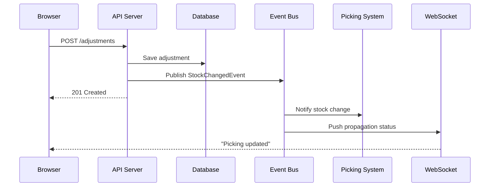

## FIRST ACTION (MANDATORY)

Before doing ANYTHING else, run this command:

```bash
"$CLAUDE_PROJECT_DIR/.claude/hooks/log-lifecycle.sh" skill generating-adrs instruction_start '{"stage": "utility", "method": "instruction-based"}'
```

---

# Generate ADRs

> **Implements**: [VERSION_CONTROL_STANDARD.md](../VERSION_CONTROL_STANDARD.md) for output file versioning

## Metadata
- **Skill ID**: SolutionArchitecture_AdrGenerator
- **Version**: 2.0.0
- **Created**: 2024-12-16
- **Updated**: 2025-12-26
- **Author**: Milos Cigoj
- **Change History**:
  - v2.0.0 (2025-12-26): Added Applicability Check for non-UI projects - ADR-008 Frontend Architecture marked N/A for BACKEND_ONLY, DATABASE_ONLY, INTEGRATION project types
  - v1.2.0 (2025-12-23): Added ROOT-level ADR registry propagation and mandatory NFR → ADR linkage for complete traceability
  - v1.1.0 (2025-12-19): Updated metadata for consistency
  - v1.0.0 (2024-12-16): Initial release

---

## Execution Logging (MANDATORY)

This skill logs all execution to the global pipeline progress registry. Logging is automatic and requires no manual configuration.

### How Logging Works

Every execution of this skill is logged to `_state/lifecycle.json`:

- **start_event**: Logged when skill execution begins
- **end_event**: Logged when skill execution completes

Events include:
- skill_name, intent, stage, system_name
- start/end timestamps
- status (completed/failed)
- output files created (ADR specifications)
- error messages (if failed)

### View Execution Progress

```bash
# See recent pipeline events
cat _state/lifecycle.json | grep '\"skill_name\": \"generating-adrs\"'

# Or query by stage
python3 _state/pipeline_query_api.py --skill \"generating-adrs\" --stage solarch
```

Logging is handled automatically by the skill framework. No user action required.

---

## Overview
This skill creates ADRs that explicitly trace architectural decisions back to:
- Pain Points (from Client Analysis)
- JTBD (Jobs To Be Done)
- User Stories / Requirements (from Product Specifications)
- Modules (from Product Specifications)

### Key Principle: Every Decision Must Have Rationale

No architectural decision exists in a vacuum. This skill enforces that every ADR answers:
1. **What problem are we solving?** (Pain Point)
2. **What job is the user trying to do?** (JTBD)
3. **What requirement drives this?** (US/FR)
4. **What module does this affect?** (MOD-*)

---

## Applicability Check (Smart Obsolescence Handling)

Before generating ADRs, check the project classification:

```
READ _state/solarch_config.json
EXTRACT project_classification (FULL_STACK | BACKEND_ONLY | DATABASE_ONLY | INTEGRATION | INFRASTRUCTURE)

IF project_classification NOT IN [FULL_STACK]:
  # Non-UI project - ADR-008 Frontend Architecture NOT APPLICABLE
  MARK ADR-008 as NOT_APPLICABLE
  GENERATE N/A placeholder instead of full ADR
```

### ADR Applicability Matrix

| ADR | FULL_STACK | BACKEND_ONLY | DATABASE_ONLY | INTEGRATION | INFRASTRUCTURE |
|-----|------------|--------------|---------------|-------------|----------------|
| ADR-001 Architecture Style | ✅ | ✅ | ✅ | ✅ | ✅ |
| ADR-002 Technology Stack | ✅ | ✅ | ✅ | ✅ | ✅ |
| ADR-003 Module Structure | ✅ | ✅ | ✅ | ✅ | ❌ N/A |
| ADR-004 Database Design | ✅ | ✅ | ✅ | ✅ | ❌ N/A |
| ADR-005 API Design Strategy | ✅ | ✅ | ❌ N/A | ✅ | ❌ N/A |
| ADR-006 Event/Message Communication | ✅ | ✅ | ❌ N/A | ✅ | ❌ N/A |
| ADR-007 Authentication & Authorization | ✅ | ✅ | ✅ | ✅ | ✅ |
| **ADR-008 Frontend Architecture** | **✅** | **❌ N/A** | **❌ N/A** | **❌ N/A** | **❌ N/A** |
| ADR-009 Caching Strategy | ✅ | ✅ | ✅ | ✅ | ❌ N/A |
| ADR-010 Deployment Strategy | ✅ | ✅ | ✅ | ✅ | ✅ |

### NOT_APPLICABLE ADR Placeholder Template

When an ADR is marked N/A, generate this placeholder:

```markdown
# ADR-008: Frontend Architecture

**Status**: NOT_APPLICABLE
**Date**: {YYYY-MM-DD}
**Reason**: Project classified as {PROJECT_CLASSIFICATION} - no UI layer

---

## Applicability

This ADR is NOT APPLICABLE to this project.

### Project Classification
- **Type**: {PROJECT_CLASSIFICATION}
- **Has UI Layer**: No
- **Config Source**: `_state/solarch_config.json`

### Why N/A

The following ADR topics are not relevant:
- Screen complexity analysis
- State management patterns
- Component architecture
- Client-side routing
- Responsive/adaptive design

### Related Documentation

For API-focused architecture decisions, see:
- [ADR-005: API Design Strategy](./ADR-005-api-design.md)
- [ADR-006: Event Communication](./ADR-006-event-communication.md)

---

**Document Status**: NOT_APPLICABLE
**Generated**: {timestamp}
```

### ADR Registry Entry for N/A

When adding N/A ADR to registry:

```json
{
  "id": "ADR-008",
  "title": "Frontend Architecture",
  "status": "NOT_APPLICABLE",
  "date": "{YYYY-MM-DD}",
  "file": "09-decisions/ADR-008-frontend-architecture.md",
  "applicability": {
    "applicable": false,
    "project_classification": "{PROJECT_CLASSIFICATION}",
    "reason": "No UI layer in project"
  },
  "traceability": {
    "painPoints": [],
    "jtbd": [],
    "requirements": [],
    "modules": [],
    "nfrs": []
  }
}
```

### Minimum ADR Count Adjustment

For Checkpoint 8 validation:
- **FULL_STACK**: Minimum 9 ADRs (all applicable)
- **BACKEND_ONLY**: Minimum 8 ADRs (ADR-008 as N/A counts toward total)
- **DATABASE_ONLY**: Minimum 6 ADRs (ADR-005, ADR-006, ADR-008 as N/A)
- **INTEGRATION**: Minimum 7 ADRs (ADR-005, ADR-008 applicable, ADR-008 as N/A)
- **INFRASTRUCTURE**: Minimum 4 ADRs (only core ADRs applicable)

The quality gate accepts N/A placeholders as valid ADR files.

---

## ADR Catalog

### Foundation ADRs (Always Generate)

| ADR | Title | Primary Sources |
|-----|-------|-----------------|
| ADR-001 | Architecture Style | Module count, team size, timeline |
| ADR-002 | Technology Stack | Technical constraints, NFRs |
| ADR-003 | Module Structure | Module definitions, dependencies |
| ADR-004 | Database Design | Data model, entities |
| ADR-005 | API Design Strategy | API contracts, integration points |
| ADR-006 | Event/Message Communication | Integration events, cross-module |
| ADR-007 | Authentication & Authorization | RBAC/ABAC from modules |
| ADR-008 | Frontend Architecture | Screen complexity, state management |
| ADR-009 | Caching Strategy | Performance NFRs |
| ADR-010 | Deployment Strategy | Environment requirements |

### Conditional ADRs (Generate When Applicable)

| ADR | Trigger Condition | Sources |
|-----|-------------------|---------|
| ADR-011 | Approval workflow exists | MOD-*-APPROV |
| ADR-012 | External integrations | Technical context |
| ADR-013 | Real-time requirements | Propagation requirements |
| ADR-014 | Offline capability | Connectivity constraints |
| ADR-015 | Multi-tenancy | Client isolation requirements |

---

## Generation Process

### Step 1: Extract Decision Drivers

For each ADR, extract from source materials:

```yaml
decision_context:
  pain_points: 
    - id: PP-001
      text: "Picking doesn't reflect adjustments immediately"
      source: "ANALYSIS_SUMMARY.md"
  jtbd:
    - id: JTBD-1.1
      text: "Complete stock adjustment in under 60 seconds"
      source: "traceability.json"
  requirements:
    - id: US-003
      text: "Know picking was updated after adjustment"
      priority: P0
      source: "MOD-INV-ADJUST-01.md"
  modules:
    - id: MOD-INV-ADJUST-01
      name: "Stock Adjustment"
      source: "modules/MOD-INV-ADJUST-01.md"
```

### Step 2: Formulate Decision

Match decision drivers to architectural patterns:

| Driver Pattern | Architectural Response |
|----------------|----------------------|
| Real-time requirement | Event-driven, WebSocket |
| High complexity, multi-team | Modular monolith or microservices |
| Audit requirements | Event sourcing, immutable logs |
| Performance < 500ms | Caching, read replicas |
| Multi-role access | RBAC with row-level security |

### Step 3: Generate ADR

Use the template below, ensuring ALL traceability fields are populated.

---

## ADR Template

```markdown
# ADR-{NNN}: {Descriptive Title}

**Status**: Proposed | Accepted | Superseded by ADR-{NNN}
**Date**: {YYYY-MM-DD}
**Decision Makers**: Architecture Team
**Supersedes**: ADR-{NNN} (if applicable)

---

## Traceability

### Pain Points Addressed

| ID | Description | Source |
|----|-------------|--------|
| PP-{id} | {pain point text} | {file reference} |

### Jobs To Be Done

| ID | Job Statement | Source |
|----|---------------|--------|
| JTBD-{id} | {job statement} | {file reference} |

### Requirements Driving This Decision

| ID | Priority | Description | Module |
|----|----------|-------------|--------|
| {US/FR}-{id} | P{n} | {requirement text} | MOD-{id} |

### Modules Affected

| Module ID | Module Name | Impact |
|-----------|-------------|--------|
| MOD-{id} | {name} | {how affected} |

---

## Context

{Describe the situation that requires a decision. Reference pain points and requirements directly.}

For example:
> Operations Coordinators report that stock adjustments don't reflect in the picking system immediately (PP-001). 
> This creates trust issues and forces workarounds like manual confirmation calls.
> The system must complete the adjustment → propagation cycle in under 10 seconds (US-003).

---

## Decision

{State the decision clearly and unambiguously}

We will implement {specific approach/technology/pattern} because {core reason}.

### Key Elements

1. {Element 1}
2. {Element 2}
3. {Element 3}

### Implementation Approach

```
{Code, configuration, or diagram showing implementation}
```

---

## Rationale

### Why This Addresses Pain Points

| Pain Point | How Addressed |
|------------|---------------|
| PP-{id} | {explanation} |

### Alternatives Considered

| Alternative | Pros | Cons | Why Rejected |
|-------------|------|------|--------------|
| {Option 1} | {pros} | {cons} | {reason} |
| {Option 2} | {pros} | {cons} | {reason} |

### Supporting Evidence

- {Reference to industry pattern}
- {Reference to similar system}
- {Performance benchmark}

---

## Consequences

### Positive

- ✅ {Benefit 1 - linked to requirement}
- ✅ {Benefit 2 - linked to pain point resolution}

### Negative

- ❌ {Tradeoff 1}
- ❌ {Tradeoff 2}

### Mitigation Strategies

| Consequence | Mitigation |
|-------------|------------|
| {negative 1} | {how to address} |

---

## Implementation Notes

### For Backend Developers

{Specific guidance}

### For Frontend Developers

{Specific guidance}

### Configuration

```yaml
# Example configuration
key: value
```

---

## Validation Criteria

| Criterion | Target | Verification |
|-----------|--------|--------------|
| {metric} | {value} | {how to measure} |

---

## Related Decisions

- [ADR-{NNN}](./ADR-{NNN}-{title}.md) - {relationship}
- [ADR-{NNN}](./ADR-{NNN}-{title}.md) - {relationship}

---

## Change Log

| Date | Change | Author |
|------|--------|--------|
| {date} | Initial draft | {name} |

---

**Document Status**: {Complete | Draft}
**Last Validation**: {date}
```

---

## Traceability Validation Rules

### Rule 1: Every ADR Must Reference At Least One Pain Point
```javascript
validate(adr) {
  if (adr.traceability.painPoints.length === 0) {
    throw Error("ADR must address at least one pain point");
  }
}
```

### Rule 2: Every P0 Requirement Must Appear in At Least One ADR
```javascript
validateCoverage(adrs, requirements) {
  const p0Reqs = requirements.filter(r => r.priority === "P0");
  const coveredReqs = new Set(adrs.flatMap(a => a.traceability.requirements));
  
  for (const req of p0Reqs) {
    if (!coveredReqs.has(req.id)) {
      throw Error(`P0 requirement ${req.id} not addressed by any ADR`);
    }
  }
}
```

### Rule 3: Every Module Must Be Architecturally Addressed
```javascript
validateModuleCoverage(adrs, modules) {
  const addressedModules = new Set(adrs.flatMap(a => a.traceability.modules));
  
  for (const mod of modules) {
    if (!addressedModules.has(mod.id)) {
      throw Error(`Module ${mod.id} not addressed by any ADR`);
    }
  }
}
```

---

## Example: ADR-006 Event Communication

```markdown
# ADR-006: Event-Driven Communication for Stock Propagation

**Status**: Accepted
**Date**: 2025-12-16
**Decision Makers**: Architecture Team

---

## Traceability

### Pain Points Addressed

| ID | Description | Source |
|----|-------------|--------|
| PP-001 | Picking doesn't reflect adjustments immediately | ANALYSIS_SUMMARY.md |
| PP-002 | System state appears to "revert" or show duplicates | ANALYSIS_SUMMARY.md |

### Jobs To Be Done

| ID | Job Statement | Source |
|----|---------------|--------|
| JTBD-1.1 | Complete stock adjustment in under 60 seconds | traceability.json |
| JTBD-2.2 | Know when changes are confirmed in downstream systems | traceability.json |

### Requirements Driving This Decision

| ID | Priority | Description | Module |
|----|----------|-------------|--------|
| US-003 | P0 | Know picking was updated after adjustment | MOD-INV-ADJUST-01 |
| FR-002 | P0 | Real-time Stock Propagation | MOD-INV-ADJUST-01 |

### Modules Affected

| Module ID | Module Name | Impact |
|-----------|-------------|--------|
| MOD-INV-ADJUST-01 | Stock Adjustment | Publishes StockAdjusted event |
| MOD-INV-HISTORY-01 | Transaction History | Subscribes to all stock events |

---

## Context

Operations Coordinators report that stock adjustments don't reflect in the picking system immediately (PP-001). 
Michael from IT confirms: "The database reflects it immediately. But the picking module does caching."
Monica states the acceptable propagation delay is "under 10 seconds" before "people start calling and it becomes chaos."

The current fat client architecture has no mechanism to push updates to other clients or systems.
We need a reliable way to:
1. Notify the picking system immediately when stock changes
2. Provide feedback to the user that propagation completed
3. Handle failures gracefully

---

## Decision

We will implement **event-driven communication** using an in-process event bus (MediatR) with WebSocket push for UI feedback.

### Key Elements

1. **Stock Events**: All stock changes publish `StockChangedEvent`
2. **Event Bus**: MediatR for in-process handling, with abstraction for future message queue
3. **WebSocket**: Push propagation status to UI in real-time
4. **Guaranteed Delivery**: Outbox pattern for external system notifications

### Architecture



---

## Rationale

### Why This Addresses Pain Points

| Pain Point | How Addressed |
|------------|---------------|
| PP-001 | Event pushed to picking immediately, not waiting for cache expiry |
| PP-002 | Event log provides audit trail of what changed |

### Alternatives Considered

| Alternative | Pros | Cons | Why Rejected |
|-------------|------|------|--------------|
| Polling | Simple | Delays up to poll interval, wasted requests | Doesn't meet <10s requirement |
| Direct API call | Immediate | Tight coupling, failure handling complex | Picking system may be unavailable |
| Cache invalidation | Works with existing | Complex, race conditions | Doesn't provide confirmation |

---

## Consequences

### Positive

- ✅ Propagation under 10 seconds (addresses US-003)
- ✅ User sees confirmation of propagation (addresses JTBD-2.2)
- ✅ Decoupled systems, easier to maintain
- ✅ Audit trail of all events

### Negative

- ❌ Additional infrastructure (WebSocket server)
- ❌ Eventual consistency complexity
- ❌ More complex debugging

### Mitigation Strategies

| Consequence | Mitigation |
|-------------|------------|
| WebSocket infrastructure | Use existing API server, SignalR |
| Eventual consistency | Show clear status to user, allow manual retry |
| Debugging | Correlation IDs, structured logging |

---

## Implementation Notes

### Event Definition

```csharp
public record StockChangedEvent(
    Guid AdjustmentId,
    string ItemId,
    string FromBinId,
    string ToBinId,
    int Quantity,
    DateTime OccurredAt
) : IntegrationEventBase;
```

### Frontend WebSocket Handler

```typescript
useEffect(() => {
  const connection = new HubConnectionBuilder()
    .withUrl('/hubs/propagation')
    .build();
  
  connection.on('PropagationComplete', (adjustmentId: string) => {
    setPropagationStatus('complete');
  });
  
  connection.start();
  return () => connection.stop();
}, []);
```

---

## Related Decisions

- [ADR-005](./ADR-005-api-design.md) - API endpoints that publish events
- [ADR-003](./ADR-003-module-structure.md) - Module boundaries and event ownership
```

---

## Output Registry Entry (v3.0)

For each generated ADR, add to `traceability/adr_registry.json` (ROOT level):

> **NOTE**: Local `_registry/decisions.json` is DEPRECATED. Use ROOT-level `traceability/adr_registry.json`.

```json
{
  "id": "ADR-006",
  "title": "Event-Driven Communication for Stock Propagation",
  "status": "Accepted",
  "date": "2025-12-16",
  "file": "09-decisions/ADR-006-event-communication.md",
  "traceability": {
    "painPoints": ["PP-001", "PP-002"],
    "jtbd": ["JTBD-1.1", "JTBD-2.2"],
    "requirements": ["US-003", "FR-002"],
    "modules": ["MOD-INV-ADJUST-01", "MOD-INV-HISTORY-01"]
  },
  "relatedAdrs": ["ADR-003", "ADR-005"]
}
```

---

## State Management Integration

### Command System Integration

This skill is invoked by these commands:

```
Commands that use this skill:
├─ /solarch-strategy (checkpoint 3) - ADR-001, ADR-002
├─ /solarch-blocks (checkpoint 4) - ADR-003, ADR-004
├─ /solarch-runtime (checkpoint 5) - ADR-005, ADR-006, ADR-007
├─ /solarch-quality (checkpoint 6) - ADR-008, ADR-009
├─ /solarch-deploy (checkpoint 7) - ADR-010
└─ /solarch-decisions (checkpoint 8) - Complete all ADRs
```

### Registry Updates (v3.0)

After creating ADRs, update `traceability/adr_registry.json` (ROOT level):

> **NOTE**: Local `_registry/` is DEPRECATED. All registries now at ROOT `traceability/`.

```json
{
  "items": [
    {
      "id": "ADR-001",
      "title": "Architecture Style Selection",
      "status": "Accepted",
      "version": "1.0.0",
      "file": "09-decisions/ADR-001-architecture-style.md",
      "traceability": {
        "painPoints": ["PP-1.1", "PP-2.1"],
        "jtbd": ["JTBD-1.1"],
        "requirements": ["REQ-001"],
        "modules": ["MOD-INV-ADJUST-01"]
      },
      "created_at": "ISO8601",
      "updated_at": "ISO8601"
    }
  ]
}
```

### Traceability Requirements

**MANDATORY**: Every ADR must include:
- At least one Pain Point reference
- At least one Requirement reference (P0 requirements preferred)
- Module references for affected modules

### Quality Gate Validation

```bash
# Validate ADR structure
python3 .claude/hooks/solarch_quality_gates.py --validate-file SolArch_X/09-decisions/ADR-001-architecture-style.md

# Checkpoint 8 requires minimum 9 ADRs
python3 .claude/hooks/solarch_quality_gates.py --validate-checkpoint 8 --dir SolArch_X/
```

---

## 🚨 ROOT-LEVEL REGISTRY PROPAGATION (MANDATORY) 🚨

**CRITICAL**: After generating ADRs and updating `_registry/decisions.json`, you MUST propagate to ROOT-level `traceability/` folder.

### ADR Registry Propagation

```
# After creating/updating _registry/decisions.json:

READ SolArch_{SystemName}/_registry/decisions.json AS local_adr_reg

# Build ROOT-level ADR registry with enhanced metadata
adr_registry = {
  "schema_version": "1.0.0",
  "stage": "SolutionArchitecture",
  "checkpoint": 8,
  "source_file": "SolArch_{SystemName}/_registry/decisions.json",
  "created_at": "{timestamp}",
  "updated_at": "{timestamp}",
  "traceability_chain": {
    "upstream": ["nfr_registry.json", "module_registry.json", "requirements_registry.json"],
    "downstream": []
  },
  "items": local_adr_reg.items.map(adr => ({
    ...adr,
    "nfr_refs": adr.traceability.nfrs || [],  // NFRs that this ADR addresses
    "module_refs": adr.traceability.modules || [],
    "requirement_refs": adr.traceability.requirements || [],
    "pain_point_refs": adr.traceability.painPoints || []
  })),
  "summary": {
    "total_adrs": local_adr_reg.items.length,
    "by_status": {
      "Proposed": count,
      "Accepted": count,
      "Superseded": count
    },
    "nfr_coverage": "{percentage}%",
    "module_coverage": "{percentage}%"
  }
}

WRITE traceability/adr_registry.json:
  {adr_registry}
```

### NFR → ADR Linkage (MANDATORY)

**CRITICAL**: Every ADR MUST link to NFRs it addresses. After creating ADRs, update the NFR registry with ADR references.

```
# After generating ADRs:

READ traceability/nfr_registry.json AS nfr_reg
READ traceability/adr_registry.json AS adr_reg

# For each ADR, update the NFRs it addresses
FOR each adr in adr_reg.items:
  FOR each nfr_id in adr.nfr_refs:
    FIND nfr in nfr_reg.items WHERE id == nfr_id
    IF nfr.adr_refs NOT CONTAINS adr.id:
      APPEND adr.id TO nfr.adr_refs

WRITE traceability/nfr_registry.json:
  {nfr_reg with updated adr_refs}

# Validate NFR coverage
uncovered_nfrs = nfr_reg.items.filter(nfr => nfr.adr_refs.length === 0)

IF uncovered_nfrs.length > 0 AND priority == "P0":
  WARN: "P0 NFRs not addressed by any ADR: {uncovered_nfrs.map(n => n.id)}"
```

### ADR → NFR Mapping Guidelines

Each ADR type should address specific NFR categories:

| ADR | NFR Categories Typically Addressed |
|-----|-----------------------------------|
| ADR-001 (Architecture Style) | Scalability, Maintainability |
| ADR-002 (Technology Stack) | Performance, Security, Maintainability |
| ADR-005 (API Design) | Performance, Availability |
| ADR-006 (Events) | Performance, Availability, Scalability |
| ADR-007 (Auth) | Security |
| ADR-008 (Frontend) | Performance, Accessibility |
| ADR-009 (Caching) | Performance |
| ADR-010 (Deployment) | Availability, Scalability |

### Enhanced ADR Template Section

When generating ADRs, include NFR traceability in the Traceability section:

```markdown
## Traceability

### Pain Points Addressed
...

### Jobs To Be Done
...

### Requirements Driving This Decision
...

### Non-Functional Requirements Addressed

| NFR ID | Category | Metric | How Addressed |
|--------|----------|--------|---------------|
| NFR-PERF-001 | Performance | Page load < 2s | Caching layer reduces API calls |
| NFR-SEC-003 | Security | Token expiry 15min | Short-lived tokens with refresh |

### Modules Affected
...
```

### Validation

After propagation, verify:

```bash
ls -la traceability/
# Should show: adr_registry.json

# Verify NFR linkage
cat traceability/nfr_registry.json | jq '.items[] | select(.adr_refs | length > 0) | .id'
```

### Quality Gate Integration

```bash
# Checkpoint 8 validation includes ADR registry check
python3 .claude/hooks/solarch_quality_gates.py --validate-checkpoint 8 --dir SolArch_X/

# Checkpoint 11 validation includes NFR → ADR coverage
python3 .claude/hooks/solarch_quality_gates.py --validate-traceability --dir SolArch_X/
```

---

**Skill Status**: Ready for Use
