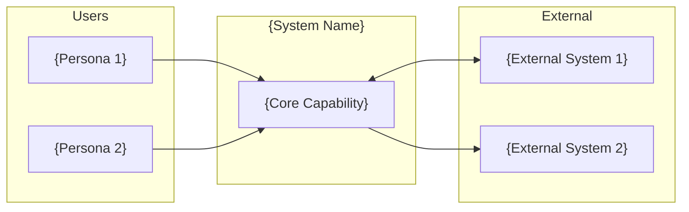
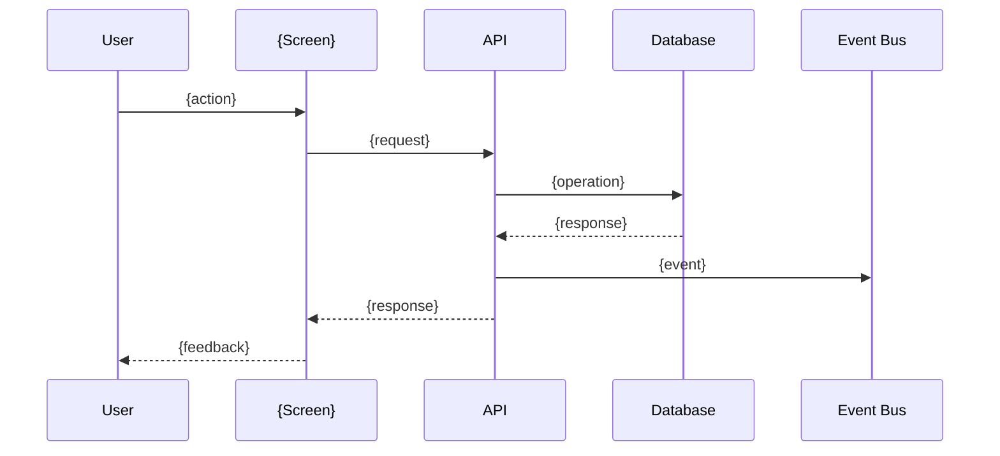

## FIRST ACTION (MANDATORY)

Before doing ANYTHING else, run this command:

```bash
"$CLAUDE_PROJECT_DIR/.claude/hooks/log-lifecycle.sh" skill generating-arc42-docs instruction_start '{"stage": "utility", "method": "instruction-based"}'
```

---

# Generate arc42 Documentation

> **Implements**: [VERSION_CONTROL_STANDARD.md](../VERSION_CONTROL_STANDARD.md) for output file versioning

## Metadata
- **Skill ID**: SolutionArchitecture_Arc42Generator
- **Version**: 1.1.0
- **Created**: 2024-12-16
- **Updated**: 2025-12-19
- **Author**: Milos Cigoj
- **Change History**:
  - v1.1.0 (2025-12-19): Updated metadata for consistency
  - v1.0.0 (2024-12-16): Initial release

---

## Execution Logging (MANDATORY)

This skill logs all execution to the global pipeline progress registry. Logging is automatic and requires no manual configuration.

### How Logging Works

Every execution of this skill is logged to `_state/lifecycle.json`:

- **start_event**: Logged when skill execution begins
- **end_event**: Logged when skill execution completes

Events include:
- skill_name, intent, stage, system_name
- start/end timestamps
- status (completed/failed)
- output files created (arc42 documentation)
- error messages (if failed)

### View Execution Progress

```bash
# See recent pipeline events
cat _state/lifecycle.json | grep '\"skill_name\": \"generating-arc42-docs\"'

# Or query by stage
python3 _state/pipeline_query_api.py --skill \"generating-arc42-docs\" --stage solarch
```

Logging is handled automatically by the skill framework. No user action required.

---

# arc42 Documentation Generator Skill

> **Version**: 1.0.0
> **Purpose**: Generate arc42 section documents from Product Specifications with full traceability

---

## Overview

arc42 is a template for software architecture documentation with 12 sections. This skill generates each section by extracting and transforming data from Product Specifications and Client Analysis.

### arc42 Sections Mapped to Sources

| Section | arc42 Name | Primary Source | Secondary Sources |
|---------|------------|----------------|-------------------|
| 01 | Introduction & Goals | MASTER_DEVELOPMENT_PLAN.md | ANALYSIS_SUMMARY.md |
| 02 | Constraints | ANALYSIS_SUMMARY.md | MOD-*.md (NFRs) |
| 03 | Context & Scope | MASTER_DEVELOPMENT_PLAN.md | ANALYSIS_SUMMARY.md |
| 04 | Solution Strategy | ADR-001, ADR-002 | modules.json |
| 05 | Building Block View | modules.json | MOD-*.md |
| 06 | Runtime View | MOD-*.md (sequences) | traceability.json |
| 07 | Deployment View | ADR-010 | NFRs |
| 08 | Cross-cutting Concepts | MOD-*.md (RBAC, NFRs) | ADRs |
| 09 | Architecture Decisions | Generated ADRs | - |
| 10 | Quality Requirements | MOD-*.md (NFRs) | MASTER_DEVELOPMENT_PLAN.md |
| 11 | Risks & Technical Debt | MASTER_DEVELOPMENT_PLAN.md | Risk Register |
| 12 | Glossary | All sources | Domain terms |

---

## Section Templates

### Section 01: Introduction and Goals

**Purpose**: Describe the system's purpose, quality goals, and stakeholders.

**Source Extraction**:
```yaml
from_master_plan:
  product_vision: "1.1 Product Vision"
  success_criteria: "1.3 Success Criteria"
  personas: "1.2 Target Personas"

from_analysis:
  user_types: "User Type Registry"
  key_metrics: "Metrics Baseline"
```

**Template**:

```markdown
# 1. Introduction and Goals

## 1.1 Requirements Overview

{Extract from MASTER_DEVELOPMENT_PLAN "1.1 Product Vision"}

### Business Context

{Summarize the business problem being solved}

### Key Capabilities

| Capability | Description | Priority |
|------------|-------------|----------|
| {name} | {description} | P{n} |

*Source: MASTER_DEVELOPMENT_PLAN.md Section 1*

---

## 1.2 Quality Goals

The top 3-5 quality goals that drive architectural decisions:

| Priority | Quality Goal | Scenario | Source |
|----------|--------------|----------|--------|
| 1 | {goal} | {measurable scenario} | {NFR-*} |
| 2 | {goal} | {measurable scenario} | {NFR-*} |
| 3 | {goal} | {measurable scenario} | {NFR-*} |

*Derived from: Module NFRs, Success Criteria*

---

## 1.3 Stakeholders

| Role | Name/Title | Expectations | Contact |
|------|------------|--------------|---------|
| {role} | {name from personas} | {what they expect} | {optional} |

### Stakeholder Concerns

| Stakeholder | Key Concerns | Addressed By |
|-------------|--------------|--------------|
| {role} | {pain points} | {ADR-*, Module} |

*Source: ANALYSIS_SUMMARY.md User Type Registry, MASTER_DEVELOPMENT_PLAN.md Personas*
```

---

### Section 02: Constraints

**Purpose**: Document business, technical, and regulatory constraints.

**Source Extraction**:
```yaml
from_analysis:
  integration_constraints: "Integration Points"
  technical_constraints: "Key Decisions Needed"
  
from_modules:
  performance_constraints: "NFR-PERF-*"
  security_constraints: "RBAC sections"
  
from_master_plan:
  timeline_constraints: "Development Phases"
  resource_constraints: "Team composition" (if mentioned)
```

**Template**:

```markdown
# 2. Architecture Constraints

## 2.1 Business Constraints

| ID | Constraint | Rationale | Impact |
|----|------------|-----------|--------|
| BC-001 | {constraint} | {why it exists} | {how it affects architecture} |

### Timeline Constraints

| Milestone | Date | Deliverable |
|-----------|------|-------------|
| Phase 1 | {date} | {deliverable} |

*Source: MASTER_DEVELOPMENT_PLAN.md Development Phases*

---

## 2.2 Technical Constraints

| ID | Constraint | Category | Source |
|----|------------|----------|--------|
| TC-001 | {constraint} | Integration | ANALYSIS_SUMMARY.md |
| TC-002 | {constraint} | Performance | NFR-PERF-* |

### Integration Constraints

{Extract from ANALYSIS_SUMMARY "Integration Points"}

| External System | Constraint | Impact |
|-----------------|------------|--------|
| {system} | {what we must accommodate} | {architectural impact} |

### Technology Mandates

| Technology | Mandate | Reason |
|------------|---------|--------|
| {tech} | {required/prohibited} | {why} |

*Source: ANALYSIS_SUMMARY.md Integration Points*

---

## 2.3 Regulatory Constraints

| ID | Regulation | Requirement | Implementation |
|----|------------|-------------|----------------|
| RC-001 | {regulation} | {what it requires} | {how we address it} |

### Security Requirements

{Extract from module RBAC sections}

### Audit Requirements

{Extract from module audit requirements}

*Source: MOD-*.md Section 4 (Access Control), Section 5 (NFRs)*
```

---

### Section 03: Context and Scope

**Purpose**: Define system boundaries, external interfaces, and scope.

**Source Extraction**:
```yaml
from_master_plan:
  system_name: Title
  modules: "Module Dependency Map"
  
from_analysis:
  external_systems: "Integration Points"
  personas: "User Type Registry"
  workflows: "Workflow Registry"
```

**Template**:

```markdown
# 3. Context and Scope

## 3.1 Business Context

### System Purpose

{One paragraph describing what the system does and why}

### Business Context Diagram



### Communication Partners

| Partner | Type | Interface | Data Exchanged |
|---------|------|-----------|----------------|
| {persona} | User | Web UI | {what they do} |
| {system} | External | API | {data exchanged} |

*Source: ANALYSIS_SUMMARY.md User Types, Integration Points*

---

## 3.2 Technical Context

### Technical Context Diagram

See: `diagrams/c4-context.mermaid`

### External Interfaces

| Interface | Protocol | Data Format | Direction |
|-----------|----------|-------------|-----------|
| {interface} | {HTTP/WS/etc} | {JSON/XML} | {In/Out/Both} |

### Integration Details

| System | Integration Type | Authentication | Data Flow |
|--------|------------------|----------------|-----------|
| {system} | {sync/async} | {mechanism} | {description} |

*Source: ANALYSIS_SUMMARY.md Integration Points, Technical Constraints*

---

## 3.3 Scope

### In Scope

| Module | Capability | Priority |
|--------|------------|----------|
| {MOD-*} | {capability} | P{n} |

### Out of Scope

| Capability | Reason | Future Phase |
|------------|--------|--------------|
| {capability} | {why excluded} | {when} |

### Assumptions

| ID | Assumption | Risk if Wrong |
|----|------------|---------------|
| A-001 | {assumption} | {impact} |

*Source: MASTER_DEVELOPMENT_PLAN.md Module Overview*
```

---

### Section 04: Solution Strategy

**Purpose**: Summarize key architectural decisions and approaches.

**Source Extraction**:
```yaml
from_adrs:
  architecture_style: ADR-001
  technology_stack: ADR-002
  module_structure: ADR-003
  
from_pain_points:
  key_challenges: PP-* (prioritized)
```

**Template**:

```markdown
# 4. Solution Strategy

## 4.1 Technology Decisions

| Decision | Choice | Rationale | ADR |
|----------|--------|-----------|-----|
| Architecture Style | {choice} | {why} | ADR-001 |
| Frontend | {choice} | {why} | ADR-002 |
| Backend | {choice} | {why} | ADR-002 |
| Database | {choice} | {why} | ADR-002 |
| Communication | {choice} | {why} | ADR-006 |

---

## 4.2 Top-Level Decomposition

{Describe how system is broken into modules}

| Module | Responsibility | Key Decisions |
|--------|----------------|---------------|
| {MOD-*} | {responsibility} | {ADR-*} |

---

## 4.3 Approaches to Achieve Quality Goals

| Quality Goal | Approach | Implementation |
|--------------|----------|----------------|
| Performance | {approach} | {how} |
| Security | {approach} | {how} |
| Reliability | {approach} | {how} |

---

## 4.4 Organizational Decisions

| Decision | Approach | Rationale |
|----------|----------|-----------|
| Deployment | {approach} | {why} |
| Testing | {approach} | {why} |
| Documentation | {approach} | {why} |

*Source: ADR-001, ADR-002, ADR-003*
```

---

### Section 05: Building Block View

**Purpose**: Describe the static structure of the system.

**Source Extraction**:
```yaml
from_modules_json:
  modules: All module definitions
  dependencies: Module dependencies
  
from_mod_specs:
  screens: Screens per module
  apis: API endpoints per module
  entities: Data entities per module
```

**Template**:

```markdown
# 5. Building Block View

## 5.1 Level 1: System Context

See: `diagrams/c4-context.mermaid`

{Prose description of system in its environment}

---

## 5.2 Level 2: Container View

See: `diagrams/c4-container.mermaid`

### Containers

| Container | Technology | Responsibility |
|-----------|------------|----------------|
| Web Application | {tech} | {responsibility} |
| API Application | {tech} | {responsibility} |
| Database | {tech} | {responsibility} |
| Cache | {tech} | {responsibility} |

---

## 5.3 Level 3: Component View

### Module Overview

| Module ID | Name | Screens | APIs | Priority |
|-----------|------|---------|------|----------|
| {MOD-*} | {name} | {count} | {count} | P{n} |

### Module Details

#### {MOD-*}: {Module Name}

See: `modules/{slug}/c4-component.mermaid`

**Responsibility**: {from module spec}

**Screens**:
| Screen ID | Name | Purpose |
|-----------|------|---------|
| {S-*} | {name} | {purpose} |

**API Endpoints**:
| Method | Path | Purpose |
|--------|------|---------|
| {method} | {path} | {purpose} |

**Key Components**:
- Controller: Handles HTTP requests
- Service: Business logic
- Repository: Data access
- Event Publisher: Cross-module communication

**Traceability**:
- Pain Points: {PP-*}
- Requirements: {US-*, FR-*}

*Source: MOD-*.md, modules.json*

---

## 5.4 Cross-Cutting Components

### Shared Kernel

| Component | Purpose | Used By |
|-----------|---------|---------|
| {component} | {purpose} | {modules} |

### Module Communication

| Pattern | When Used | Example |
|---------|-----------|---------|
| Facade | Synchronous queries | IItemsFacade.GetItemAsync() |
| Event | State changes | StockChangedEvent |

*Source: ADR-003, ADR-006*
```

---

### Section 06: Runtime View

**Purpose**: Describe system behavior through key scenarios.

**Source Extraction**:
```yaml
from_mod_specs:
  state_diagrams: "UI State Logic" sections
  sequence_diagrams: "Sequence Diagram" sections
  workflows: "Workflow Mapping" sections
  
from_traceability:
  key_chains: Critical path chains
```

**Template**:

```markdown
# 6. Runtime View

## 6.1 Key Scenarios

| Scenario | Description | Modules Involved | Priority |
|----------|-------------|------------------|----------|
| {name} | {description} | {MOD-*} | P{n} |

---

## 6.2 Scenario: {Scenario Name}

### Overview

{Description of the scenario and its business context}

**Traceability**:
- Pain Point: {PP-*}
- JTBD: {JTBD-*}
- Requirement: {US-*}

### Sequence Diagram



### Steps

| Step | Actor | Action | System Response |
|------|-------|--------|-----------------|
| 1 | {actor} | {action} | {response} |

### Error Handling

| Error Condition | Detection | Recovery |
|-----------------|-----------|----------|
| {condition} | {how detected} | {what happens} |

*Source: MOD-*.md Sequence Diagrams, State Logic*

---

## 6.3 Scenario: {Another Scenario}

{Repeat pattern for each key scenario}
```

---

### Section 07: Deployment View

**Purpose**: Describe the technical infrastructure and deployment.

**Source Extraction**:
```yaml
from_adr_010:
  deployment_strategy: Decision
  environments: Environment definitions
  
from_nfrs:
  availability: NFR-AVAIL-*
  performance: NFR-PERF-*
```

**Template**:

```markdown
# 7. Deployment View

## 7.1 Infrastructure Overview

See: `diagrams/c4-deployment.mermaid`

### Deployment Strategy

{From ADR-010}

---

## 7.2 Infrastructure Elements

| Element | Technology | Purpose | Scaling |
|---------|------------|---------|---------|
| Load Balancer | {tech} | {purpose} | {how} |
| Application Server | {tech} | {purpose} | {how} |
| Database | {tech} | {purpose} | {how} |
| Cache | {tech} | {purpose} | {how} |

---

## 7.3 Environments

| Environment | Purpose | URL | Configuration |
|-------------|---------|-----|---------------|
| Development | Local dev | localhost | Docker Compose |
| Staging | Integration testing | staging.{domain} | {config} |
| Production | Live system | {domain} | {config} |

### Environment Differences

| Aspect | Development | Staging | Production |
|--------|-------------|---------|------------|
| Database | Local PostgreSQL | RDS | RDS Multi-AZ |
| Cache | Local Redis | ElastiCache | ElastiCache Cluster |
| Logging | Console | CloudWatch | CloudWatch + alerts |

---

## 7.4 Network Topology

{Describe network layout, security groups, etc.}

### Security Zones

| Zone | Contains | Access |
|------|----------|--------|
| Public | Load Balancer, CDN | Internet |
| Application | API servers | Load Balancer only |
| Data | Database, Cache | Application tier only |

*Source: ADR-010, NFRs*
```

---

### Section 08: Cross-cutting Concepts

**Purpose**: Document concepts that apply across the system.

**Source Extraction**:
```yaml
from_mod_specs:
  security: RBAC/ABAC sections
  error_handling: Error matrices
  validation: Validation rules
  
from_adrs:
  caching: ADR-009
  authentication: ADR-007
  events: ADR-006
```

**Template**:

```markdown
# 8. Cross-cutting Concepts

## 8.1 Security

### Authentication

{From ADR-007}

### Authorization Model

| Level | Mechanism | Implementation |
|-------|-----------|----------------|
| Role-based | RBAC | Role claims in JWT |
| Attribute-based | ABAC | Policy evaluation |
| Data-level | Row filtering | Query predicates |

### Consolidated Permission Matrix

| Permission | Coordinator | Manager | Admin |
|------------|-------------|---------|-------|
| {action} | {Y/N} | {Y/N} | {Y/N} |

*Source: ADR-007, MOD-*.md RBAC sections*

---

## 8.2 Error Handling

### Error Categories

| Category | HTTP Status | User Message | Logging |
|----------|-------------|--------------|---------|
| Validation | 400 | Field-specific | Debug |
| Authentication | 401 | Generic | Warning |
| Authorization | 403 | Generic | Warning |
| Not Found | 404 | Resource-specific | Debug |
| Conflict | 409 | Action-specific | Info |
| Server Error | 500 | Generic | Error + alert |

### Error Response Format

```json
{
  "success": false,
  "error": {
    "code": "{ERROR_CODE}",
    "message": "{User-friendly message}",
    "details": [{...}]
  },
  "timestamp": "{ISO 8601}"
}
```

*Source: MOD-*.md Error Handling sections*

---

## 8.3 Validation

### Validation Layers

| Layer | Type | Implementation |
|-------|------|----------------|
| Client | Immediate feedback | Form validation |
| API | Request validation | FluentValidation |
| Domain | Business rules | Domain services |
| Database | Integrity | Constraints |

*Source: MOD-*.md Validation Rules*

---

## 8.4 Caching

{From ADR-009}

### Cache Layers

| Layer | Technology | TTL | Invalidation |
|-------|------------|-----|--------------|
| Browser | HTTP cache | {ttl} | {strategy} |
| CDN | {tech} | {ttl} | {strategy} |
| Application | Redis | {ttl} | {strategy} |
| Database | Query cache | {ttl} | {strategy} |

---

## 8.5 Logging & Monitoring

### Log Levels

| Level | When Used | Example |
|-------|-----------|---------|
| Debug | Development details | Query parameters |
| Info | Business events | Adjustment created |
| Warning | Recoverable issues | Retry attempted |
| Error | Failures | Database connection lost |

### Structured Log Format

```json
{
  "timestamp": "{ISO 8601}",
  "level": "{level}",
  "correlationId": "{id}",
  "userId": "{id}",
  "action": "{action}",
  "message": "{message}",
  "data": {...}
}
```

---

## 8.6 Internationalization

{If applicable}

---

## 8.7 Testability

### Testing Strategy

| Level | Coverage | Tools |
|-------|----------|-------|
| Unit | 80% | Jest, xUnit |
| Integration | 70% | Playwright API |
| E2E | Critical paths | Playwright |

*Source: MASTER_DEVELOPMENT_PLAN.md Testing Strategy*
```

---

### Section 09: Architecture Decisions

**Purpose**: Index of all ADRs.

**Template**:

```markdown
# 9. Architecture Decisions

## Decision Log

| ADR | Title | Status | Date |
|-----|-------|--------|------|
| [ADR-001](./ADR-001-architecture-style.md) | Architecture Style | Accepted | {date} |
| [ADR-002](./ADR-002-technology-stack.md) | Technology Stack | Accepted | {date} |
| ... | ... | ... | ... |

## Decision Categories

### Foundation Decisions
- ADR-001: Architecture Style
- ADR-002: Technology Stack
- ADR-003: Module Structure

### Data Decisions
- ADR-004: Database Design

### Integration Decisions
- ADR-005: API Design
- ADR-006: Event Communication

### Security Decisions
- ADR-007: Authentication & Authorization

### Frontend Decisions
- ADR-008: Frontend Architecture

### Operations Decisions
- ADR-009: Caching Strategy
- ADR-010: Deployment Strategy

## Traceability Summary

| ADR | Pain Points Addressed | Requirements Covered |
|-----|----------------------|---------------------|
| ADR-001 | {PP-*} | {US-*, FR-*} |

*Source: Generated ADRs*
```

---

### Section 10: Quality Requirements

**Purpose**: Detail quality requirements and scenarios.

**Source Extraction**:
```yaml
from_mod_specs:
  performance: NFR-PERF-*
  security: NFR-SEC-*
  accessibility: A11Y-*
  
from_master_plan:
  success_criteria: "Success Criteria"
```

**Template**:

```markdown
# 10. Quality Requirements

## 10.1 Quality Tree

```
Quality
├── Performance
│   ├── Response Time
│   ├── Throughput
│   └── Resource Usage
├── Security
│   ├── Authentication
│   ├── Authorization
│   └── Audit
├── Usability
│   ├── Accessibility
│   └── Efficiency
└── Reliability
    ├── Availability
    └── Recoverability
```

---

## 10.2 Quality Scenarios

### Performance Scenarios

| ID | Scenario | Stimulus | Response | Measure | Source |
|----|----------|----------|----------|---------|--------|
| QS-PERF-001 | {scenario} | {trigger} | {response} | {metric} | {NFR-*} |

### Security Scenarios

| ID | Scenario | Stimulus | Response | Measure | Source |
|----|----------|----------|----------|---------|--------|
| QS-SEC-001 | {scenario} | {trigger} | {response} | {metric} | {NFR-*} |

### Accessibility Scenarios

| ID | Scenario | Stimulus | Response | Measure | Source |
|----|----------|----------|----------|---------|--------|
| QS-A11Y-001 | {scenario} | {trigger} | {response} | {metric} | {A11Y-*} |

---

## 10.3 Quality Requirements by Module

| Module | Performance | Security | Accessibility |
|--------|-------------|----------|---------------|
| {MOD-*} | {requirements} | {requirements} | {requirements} |

*Source: MOD-*.md Section 5 (NFRs)*
```

---

### Section 11: Risks and Technical Debt

**Purpose**: Document known risks and technical debt.

**Source Extraction**:
```yaml
from_master_plan:
  risks: "Risk Register"
  
from_adrs:
  negative_consequences: "Consequences" sections
  mitigations: "Mitigation" sections
```

**Template**:

```markdown
# 11. Risks and Technical Debt

## 11.1 Technical Risks

| ID | Risk | Probability | Impact | Mitigation | Owner |
|----|------|-------------|--------|------------|-------|
| TR-001 | {risk} | {H/M/L} | {H/M/L} | {mitigation} | {owner} |

### Risk Matrix

|          | Low Impact | Medium Impact | High Impact |
|----------|------------|---------------|-------------|
| High Prob | {risks} | {risks} | {risks} |
| Med Prob | {risks} | {risks} | {risks} |
| Low Prob | {risks} | {risks} | {risks} |

*Source: MASTER_DEVELOPMENT_PLAN.md Risk Register*

---

## 11.2 Technical Debt

| ID | Debt Item | Reason | Impact | Remediation |
|----|-----------|--------|--------|-------------|
| TD-001 | {item} | {why incurred} | {consequences} | {how to fix} |

### Debt from ADR Tradeoffs

| ADR | Tradeoff | Debt Created | When to Address |
|-----|----------|--------------|-----------------|
| ADR-001 | {tradeoff} | {debt} | {trigger} |

*Source: ADR "Negative Consequences" sections*

---

## 11.3 Monitoring Plan

| Risk/Debt | Indicator | Threshold | Action |
|-----------|-----------|-----------|--------|
| {item} | {metric} | {value} | {response} |
```

---

### Section 12: Glossary

**Purpose**: Define domain-specific terms.

**Source Extraction**:
```yaml
from_all_sources:
  domain_terms: Extract unique terms
  acronyms: Extract acronyms
  
from_analysis:
  business_terms: User Type Registry, Workflows
```

**Template**:

```markdown
# 12. Glossary

## Domain Terms

| Term | Definition | Context |
|------|------------|---------|
| Adjustment | A stock movement between bins | Inventory module |
| Bin | A physical storage location | Warehouse |
| Propagation | Notification of changes to downstream systems | Integration |

## Acronyms

| Acronym | Expansion | Usage |
|---------|-----------|-------|
| ADR | Architecture Decision Record | Documentation |
| API | Application Programming Interface | Integration |
| RBAC | Role-Based Access Control | Security |
| JTBD | Jobs To Be Done | Requirements |

## Technical Terms

| Term | Definition |
|------|------------|
| Facade | Interface for cross-module queries |
| Integration Event | Async notification between modules |
| Domain Event | Internal module state change |

*Source: All documentation*
```

---

## Generation Process

### Step 1: Extract Source Data

For each section, extract from specified sources.

### Step 2: Apply Template

Fill template with extracted data.

### Step 3: Add Traceability Headers

```markdown
---
title: {Section Title}
section: {arc42 section number}
generated: {date}
sources:
  - {source file 1}
  - {source file 2}
traceability:
  pain_points: [{PP-*}]
  requirements: [{US-*, FR-*}]
---
```

### Step 4: Cross-Reference

- Link to C4 diagrams where applicable
- Link to ADRs where decisions are referenced
- Link to other sections where related

### Step 5: Validate

- All source references exist
- All links resolve
- No placeholder text remains

---

## Output Files

| Section | Output File | Location |
|---------|-------------|----------|
| 01 | introduction.md, stakeholders.md | 01-introduction-goals/ |
| 02 | business-constraints.md, technical-constraints.md, regulatory-constraints.md | 02-constraints/ |
| 03 | business-context.md, technical-context.md | 03-context-scope/ |
| 04 | solution-strategy.md | 04-solution-strategy/ |
| 05 | overview.md, cross-cutting.md, modules/{slug}/README.md | 05-building-blocks/ |
| 06 | overview.md, scenarios/{name}.md | 06-runtime-view/ |
| 07 | deployment.md, environments.md | 07-deployment-view/ |
| 08 | security.md, error-handling.md, logging-monitoring.md, performance.md | 08-cross-cutting/ |
| 09 | ADR-000-index.md | 09-decisions/ |
| 10 | quality-requirements.md, quality-scenarios.md | 11-quality/ |
| 11 | technical-risks.md, technical-debt.md | 12-risks-debt/ |
| 12 | glossary.md | 13-glossary/ |

---

## State Management Integration

### Command System Integration

This skill is the primary generator for arc42 documentation sections:

```
Commands that use this skill:
├─ /solarch-context (checkpoint 2) - Sections 1-3
├─ /solarch-strategy (checkpoint 3) - Section 4
├─ /solarch-blocks (checkpoint 4) - Section 5
├─ /solarch-runtime (checkpoint 5) - Section 6
├─ /solarch-quality (checkpoint 6) - Section 8, 10
├─ /solarch-deploy (checkpoint 7) - Section 7
├─ /solarch-risks (checkpoint 9) - Section 11
└─ /solarch-docs (checkpoint 10) - Section 12
```

### Section to Checkpoint Mapping

| arc42 Section | Checkpoint | Command |
|---------------|------------|---------|
| 01 - Introduction & Goals | 2 | `/solarch-context` |
| 02 - Constraints | 2 | `/solarch-context` |
| 03 - Context & Scope | 2 | `/solarch-context` |
| 04 - Solution Strategy | 3 | `/solarch-strategy` |
| 05 - Building Block View | 4 | `/solarch-blocks` |
| 06 - Runtime View | 5 | `/solarch-runtime` |
| 07 - Deployment View | 7 | `/solarch-deploy` |
| 08 - Cross-cutting Concepts | 6 | `/solarch-quality` |
| 09 - Architecture Decisions | 8 | `/solarch-decisions` |
| 10 - Quality Requirements | 6 | `/solarch-quality` |
| 11 - Risks & Technical Debt | 9 | `/solarch-risks` |
| 12 - Glossary | 10 | `/solarch-docs` |

### Output Folder Structure

```
SolArch_{SystemName}/
├─ 01-introduction-goals/
├─ 02-constraints/
├─ 03-context-scope/
├─ 04-solution-strategy/
├─ 05-building-blocks/
├─ 06-runtime/
├─ 07-quality/
├─ 08-deployment/
├─ 09-decisions/
├─ 10-risks/
├─ 11-glossary/
├─ _registry/
└─ diagrams/
```

### Quality Gate Validation

```bash
# Validate specific checkpoint
python3 .claude/hooks/solarch_quality_gates.py --validate-checkpoint N --dir SolArch_X/
```

---

**Skill Status**: Ready for Use
**Last Updated**: 2025-12-22
