## FIRST ACTION (MANDATORY)

Before doing ANYTHING else, run this command:

```bash
"$CLAUDE_PROJECT_DIR/.claude/hooks/log-lifecycle.sh" skill generating-c4-diagrams instruction_start '{"stage": "utility", "method": "instruction-based"}'
```

---

# Generate C4 Diagrams

> **Implements**: [VERSION_CONTROL_STANDARD.md](../VERSION_CONTROL_STANDARD.md) for output file versioning
> **Supports**: Smart Obsolescence Handling for non-UI projects

## Metadata
- **Skill ID**: SolutionArchitecture_C4Generator
- **Version**: 2.0.0
- **Created**: 2024-12-16
- **Updated**: 2025-12-26
- **Author**: Milos Cigoj
- **Change History**:
  - v2.0.0 (2025-12-26): Added NOT_APPLICABLE handling for non-UI projects with backend-focused C4 diagrams
  - v1.1.0 (2025-12-19): Updated metadata for consistency
  - v1.0.0 (2024-12-16): Initial release

---

## Execution Logging (MANDATORY)

This skill logs all execution to the global pipeline progress registry. Logging is automatic and requires no manual configuration.

### How Logging Works

Every execution of this skill is logged to `_state/lifecycle.json`:

- **start_event**: Logged when skill execution begins
- **end_event**: Logged when skill execution completes

Events include:
- skill_name, intent, stage, system_name
- start/end timestamps
- status (completed/failed)
- output files created (C4 diagrams)
- error messages (if failed)

### View Execution Progress

```bash
# See recent pipeline events
cat _state/lifecycle.json | grep '\"skill_name\": \"generating-c4-diagrams\"'

# Or query by stage
python3 _state/pipeline_query_api.py --skill \"generating-c4-diagrams\" --stage solarch
```

Logging is handled automatically by the skill framework. No user action required.

---

# C4 Diagram Generator Skill

> **Version**: 2.0.0
> **Purpose**: Generate C4 Model diagrams in Mermaid format from Product Specifications
> **Supports**: Smart Obsolescence Handling for non-UI projects

---

## APPLICABILITY CHECK (Smart Obsolescence Handling)

**BEFORE generating C4 diagrams**, check project classification:

```
1. Read _state/solarch_config.json
2. Check project_type from upstream
3. IF project_type IN [BACKEND_ONLY, DATABASE_ONLY, INTEGRATION, INFRASTRUCTURE]:
   → Generate C4 diagrams WITHOUT UI containers
   → Use API Consumer instead of User persona where appropriate
   → Skip frontend component diagrams
4. IF project_type == FULL_STACK:
   → Proceed with normal C4 generation (all containers including UI)
```

### C4 Element Applicability by Project Type

| C4 Element | FULL_STACK | BACKEND_ONLY | DATABASE_ONLY | INTEGRATION |
|------------|------------|--------------|---------------|-------------|
| Person (End User) | ✅ | ❌ N/A | ❌ N/A | ❌ N/A |
| Person (API Consumer) | ✅ | ✅ | ✅ | ✅ |
| Person (Admin) | ✅ | ✅ | ✅ | ✅ |
| Container (Mobile App) | ✅ | ❌ N/A | ❌ N/A | ❌ N/A |
| Container (Web App) | ✅ | ❌ N/A | ❌ N/A | ❌ N/A |
| Container (API) | ✅ | ✅ | ❌ N/A | ✅ |
| Container (Database) | ✅ | ✅ | ✅ | ✅ |
| Container (Message Queue) | ✅ | ✅ | ✅ | ✅ |
| Component (UI Module) | ✅ | ❌ N/A | ❌ N/A | ❌ N/A |
| Component (API Module) | ✅ | ✅ | ❌ N/A | ✅ |
| Component (Domain Module) | ✅ | ✅ | ✅ | ✅ |

### Backend-Only Context Diagram Template

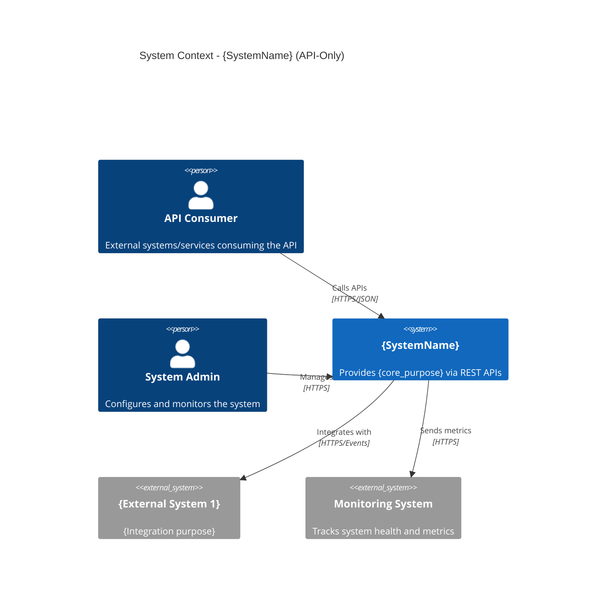

### Backend-Only Container Diagram Template

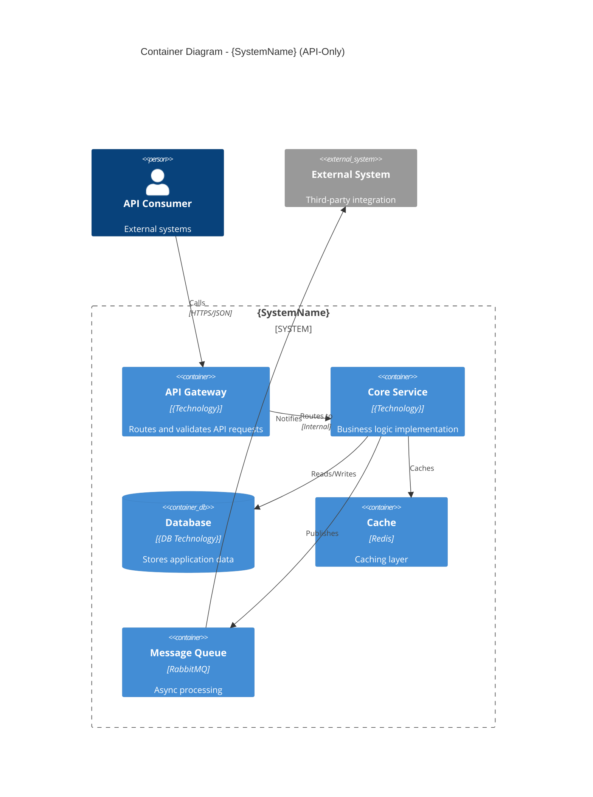

### Database-Only Container Diagram Template

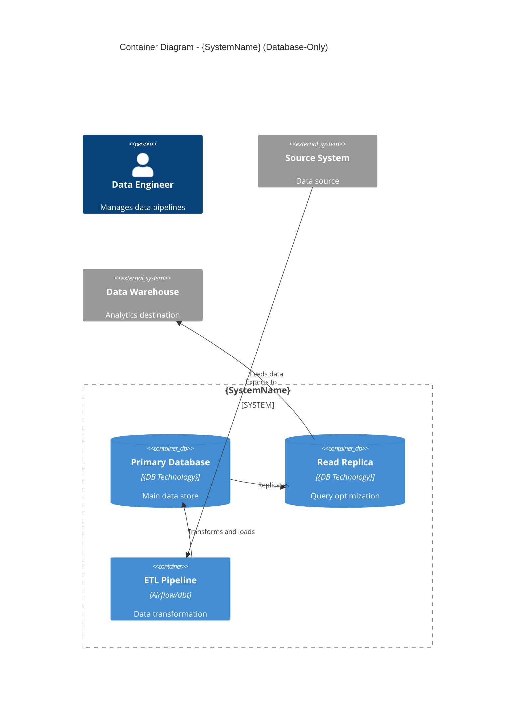

### NOT_APPLICABLE Component Diagram Placeholder

When frontend component diagrams are not applicable:

```markdown
---
document_id: c4-component-{module}-frontend
version: 1.0.0
status: NOT_APPLICABLE
created_at: {TIMESTAMP}
generated_by: SolutionArchitecture_C4Generator
---

# C4 Component Diagram: {Module} - Frontend

## Status: NOT APPLICABLE

This C4 Component diagram has been marked as **NOT APPLICABLE** for the current project.

### Reason

This project is classified as **{PROJECT_TYPE}** which does not include user interface components.
Frontend component architecture is not relevant for API-only or backend-focused systems.

### Project Classification

- **Project Type**: {PROJECT_TYPE}
- **UI Artifacts Applicable**: false

### Alternative Documentation

- Backend components documented in: `c4-component-{module}-backend.mermaid`
- API architecture documented in: `06-runtime-view/api-design.md`

---

*This placeholder maintains framework integrity while acknowledging that frontend component diagrams are not applicable to this project type.*
```

---

## Overview

The C4 Model provides four levels of abstraction for visualizing software architecture:

| Level | View | Audience | Shows |
|-------|------|----------|-------|
| 1 | Context | Everyone | System in its environment |
| 2 | Container | Technical | High-level technology choices |
| 3 | Component | Developers | Module internal structure |
| 4 | Code | Developers | Class/function level |

This skill generates Levels 1-3 in Mermaid format. Level 4 is generated from code, not specifications.

---

## Input Sources

| C4 Level | Primary Source | Reference Sources |
|----------|---------------|-------------------|
| Context | MASTER_DEVELOPMENT_PLAN.md | ANALYSIS_SUMMARY.md |
| Container | ADR-002 (Tech Stack), ADR-003 (Modules) | modules.json |
| Component | MOD-*.md (module specs) | API contracts |

---

## Level 1: System Context Diagram

### Purpose
Show the system as a box surrounded by its users (personas) and external systems.

### Source Extraction

From MASTER_DEVELOPMENT_PLAN.md:
```yaml
extract:
  product_name: "1.1 Product Vision" section
  personas: "1.2 Target Personas" table
  
from_analysis:
  external_systems: "Integration Points" section
  
from_modules:
  core_purpose: Aggregate module purposes
```

### Template

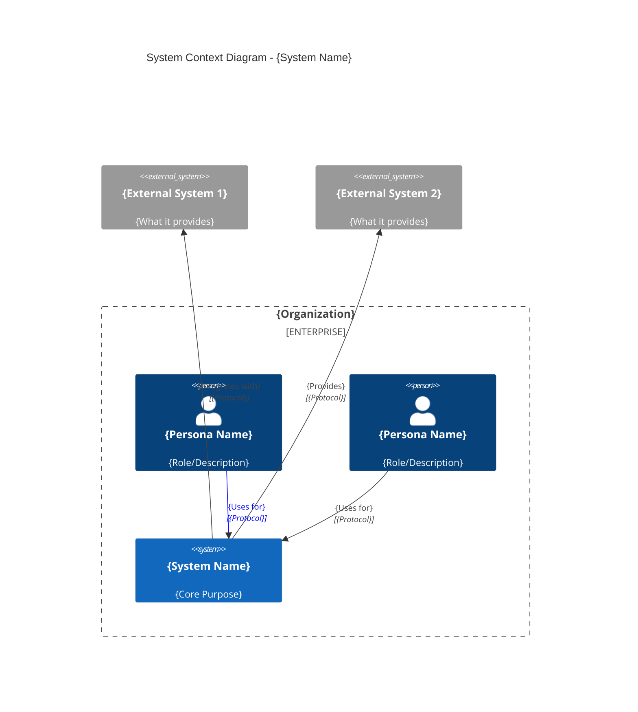

### Example: Inventory System

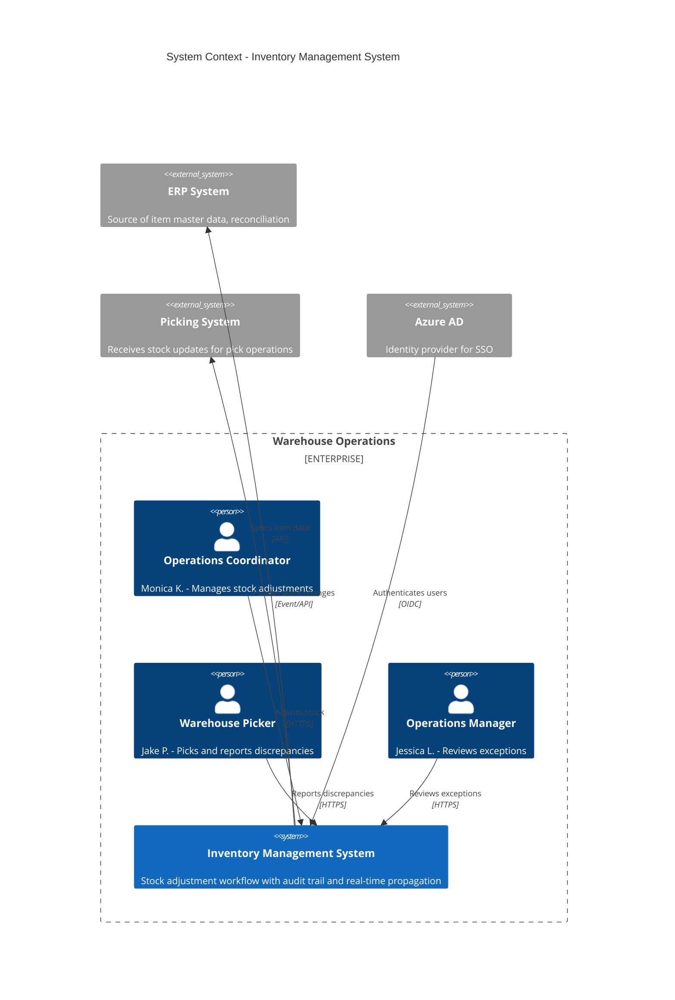

---

## Level 2: Container Diagram

### Purpose
Zoom into the system to show containers (applications, databases, message queues).

### Source Extraction

From ADR-002 (Technology Stack):
```yaml
extract:
  frontend: "Frontend Stack" section
  backend: "Backend Stack" section
  database: "Database" selection
  cache: "Cache" selection
  messaging: "Message Bus" selection
```

From ADR-003 (Module Structure):
```yaml
extract:
  modules: List of module IDs
  boundaries: Module boundaries
```

### Template

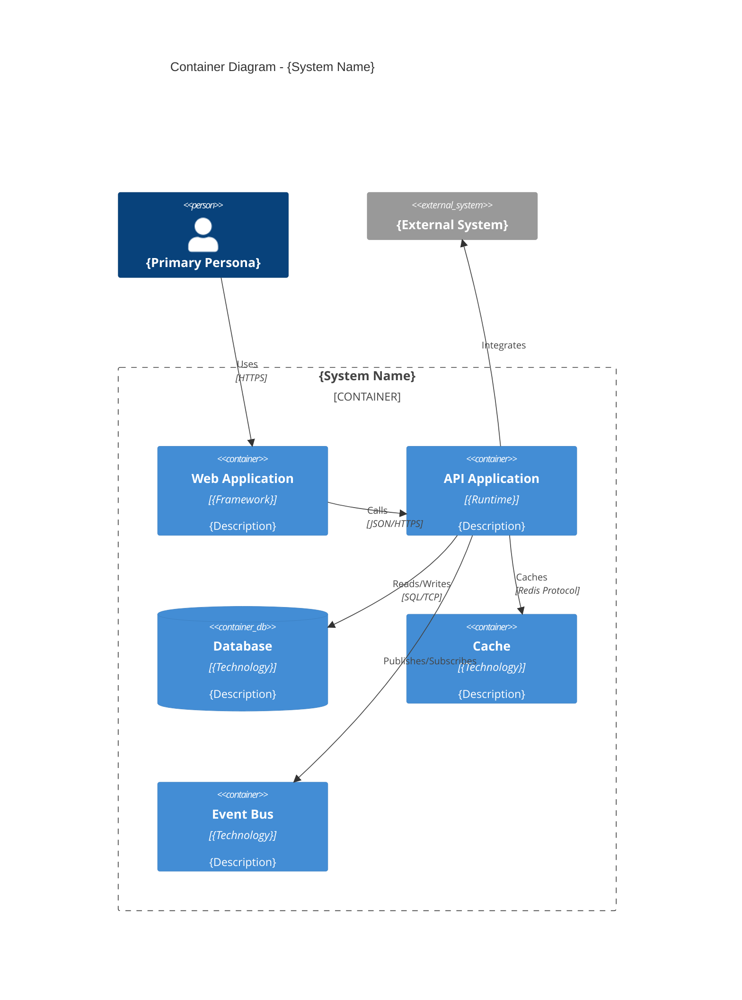

### Example: Inventory System

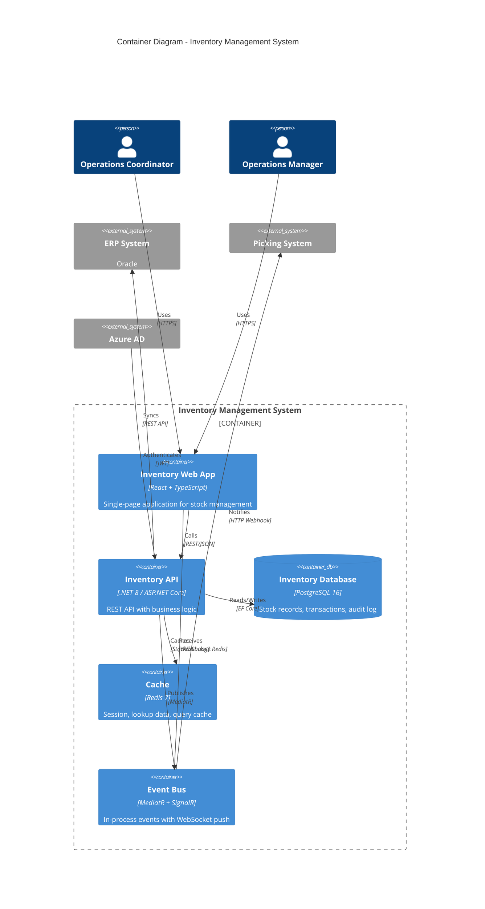

---

## Level 3: Component Diagram

### Purpose
Zoom into a container to show components (services, controllers, repositories).

### Source Extraction

From MOD-*.md:
```yaml
extract:
  screens: "3. Screen Specifications" section
  api_endpoints: "7. API Contracts" section
  entities: "Data Requirements" sections
  rbac: "4. Access Control" section
  state_logic: "UI State Logic" diagrams
```

### Template

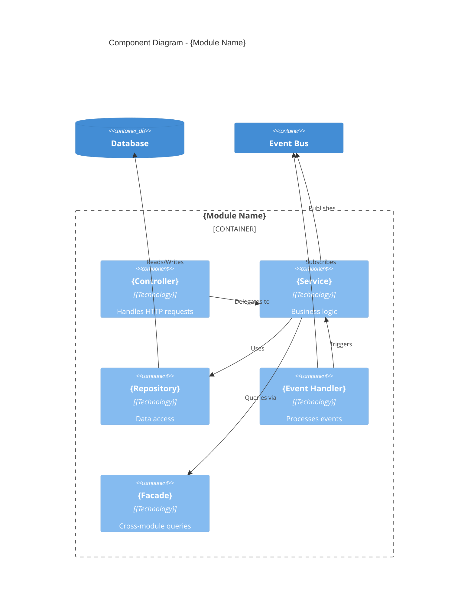

### Example: Stock Adjustment Module

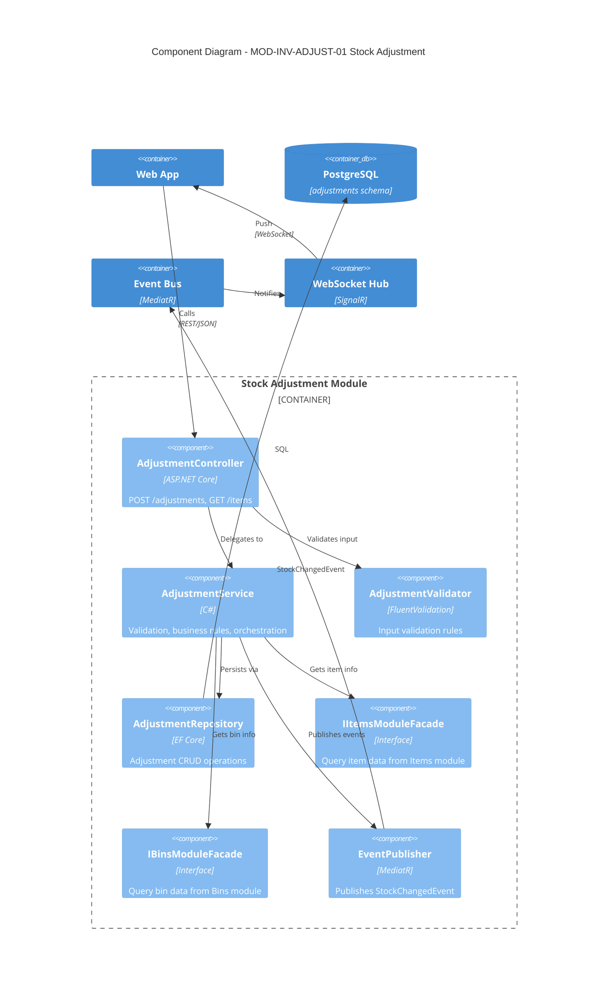

---

## Cross-Module Diagram

### Purpose
Show how modules communicate via facades and events.

### Template

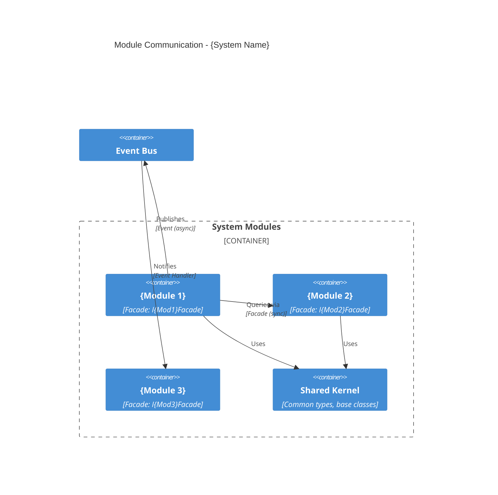

### Example: Inventory System Module Communication

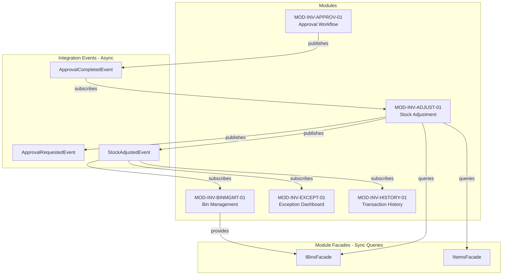

---

## Deployment Diagram

### Purpose
Show how containers are deployed to infrastructure.

### Template

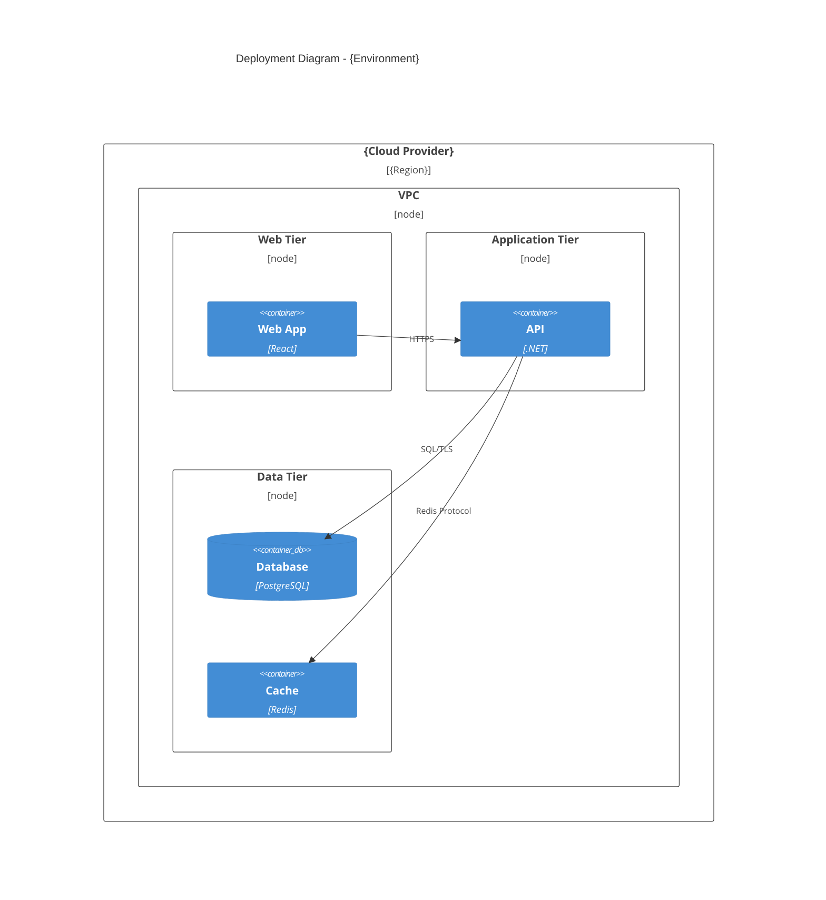

### Example: AWS Deployment

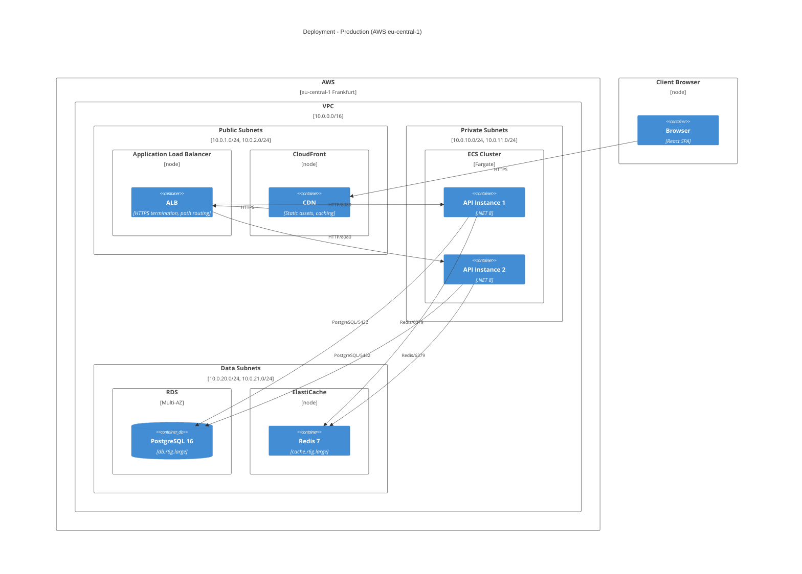

---

## Output Files

For each level, generate:

| Level | Output File | Location |
|-------|-------------|----------|
| Context | c4-context.mermaid | 03-context-scope/diagrams/ |
| Container | c4-container.mermaid | 05-building-blocks/ |
| Component | c4-component-{module}.mermaid | 05-building-blocks/modules/{module}/ |
| Deployment | c4-deployment.mermaid | 07-deployment-view/ |
| Cross-Module | c4-module-communication.mermaid | 05-building-blocks/ |

---

## Registry Entry

For each diagram, add to `_registry/components.json`:

```json
{
  "diagrams": [
    {
      "level": "context",
      "file": "03-context-scope/diagrams/c4-context.mermaid",
      "personas": ["coordinator", "picker", "manager"],
      "externalSystems": ["erp", "picking", "azure"]
    },
    {
      "level": "container",
      "file": "05-building-blocks/c4-container.mermaid",
      "containers": ["spa", "api", "db", "cache", "events"]
    },
    {
      "level": "component",
      "module": "MOD-INV-ADJUST-01",
      "file": "05-building-blocks/modules/adjustment/c4-component.mermaid",
      "components": ["controller", "service", "repository", "facade", "eventPublisher"]
    }
  ],
  "modules": [
    {
      "id": "MOD-INV-ADJUST-01",
      "diagramFile": "05-building-blocks/modules/adjustment/c4-component.mermaid",
      "facades": {
        "provides": [],
        "consumes": ["IItemsFacade", "IBinsFacade"]
      },
      "events": {
        "publishes": ["StockChangedEvent"],
        "subscribes": ["ApprovalCompletedEvent"]
      }
    }
  ]
}
```

---

## State Management Integration

### Command System Integration

This skill is invoked by these commands:

```
Commands that use this skill:
├─ /solarch-context (checkpoint 2) - C4 Context diagram
├─ /solarch-blocks (checkpoint 4) - C4 Container, Component diagrams
└─ /solarch-deploy (checkpoint 7) - C4 Deployment diagram
```

### Registry Updates

After generating diagrams, update `_registry/components.json`:

```json
{
  "diagrams": [
    {
      "id": "C4-CTX-001",
      "level": "context",
      "file": "diagrams/c4-context.mmd",
      "generated_at": "ISO8601"
    }
  ],
  "modules": [
    {
      "id": "MOD-INV-ADJUST-01",
      "component_diagram": "diagrams/modules/MOD-INV-ADJUST-01/c4-component.mmd"
    }
  ]
}
```

### Output Locations

| Diagram Type | Location |
|--------------|----------|
| Context | `SolArch_{name}/diagrams/c4-context.mmd` |
| Container | `SolArch_{name}/diagrams/c4-container.mmd` |
| Component | `SolArch_{name}/diagrams/modules/{mod}/c4-component.mmd` |
| Deployment | `SolArch_{name}/diagrams/c4-deployment.mmd` |

### Quality Gate Validation

```bash
# Checkpoint 4 requires C4 diagrams
python3 .claude/hooks/solarch_quality_gates.py --validate-checkpoint 4 --dir SolArch_X/
```

---

**Skill Status**: Ready for Use
