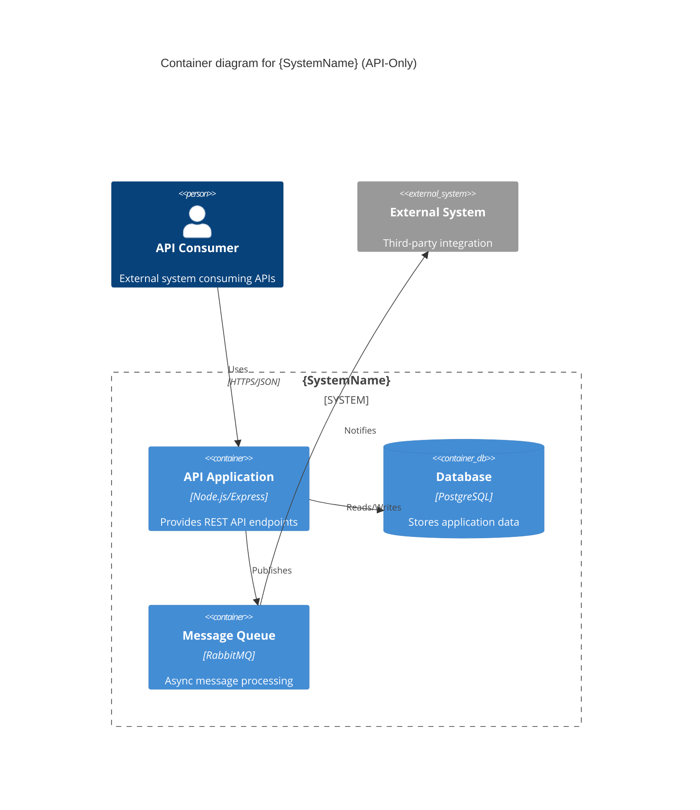
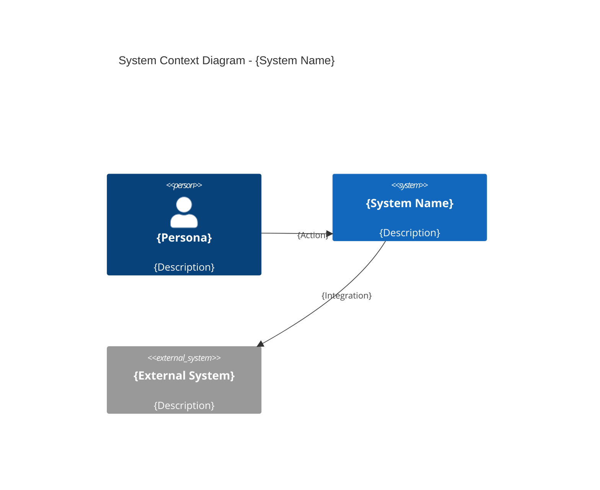
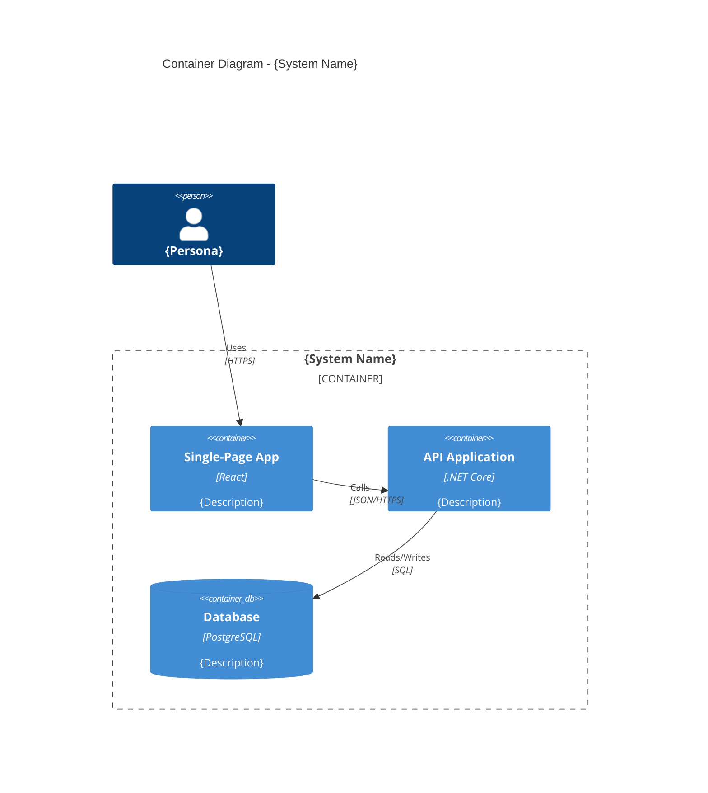
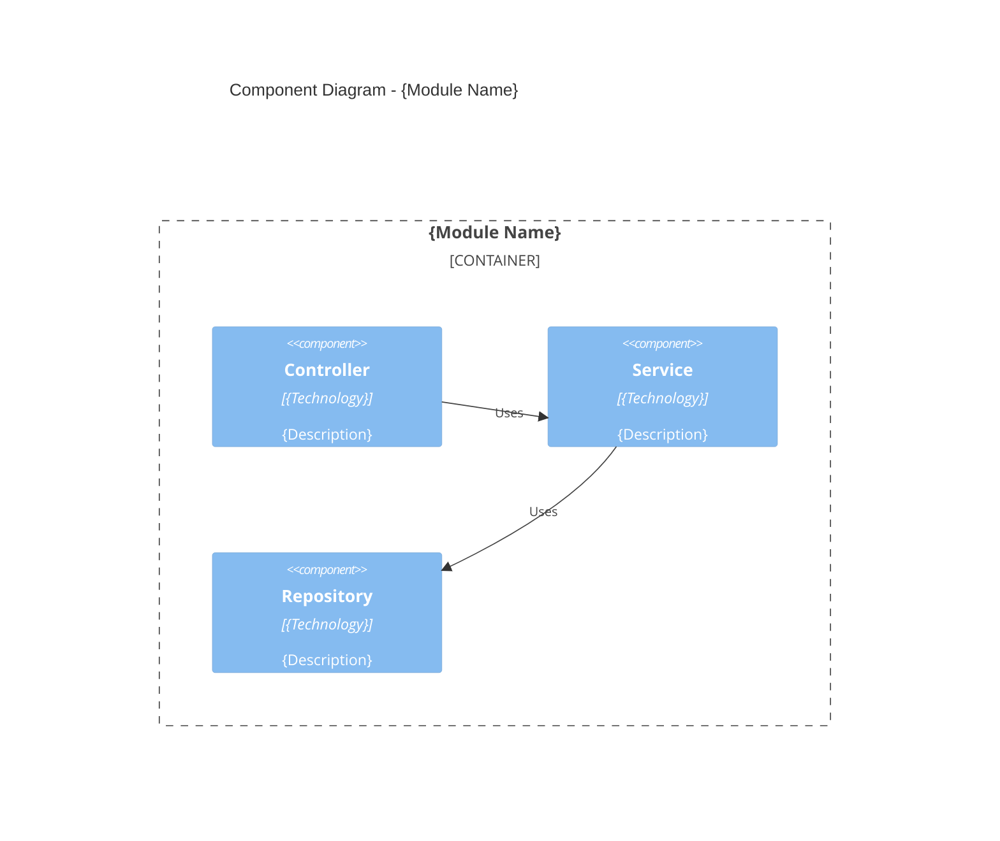

# Generate Solution Architecture

## FIRST ACTION (MANDATORY)

Before doing ANYTHING else, run this command:

```bash
bash .claude/hooks/log-lifecycle.sh skill generating-solution-architecture instruction_start '{"stage": "solarch", "method": "instruction-based"}'
```

> **Implements**: [VERSION_CONTROL_STANDARD.md](../VERSION_CONTROL_STANDARD.md) for output file versioning
> **Supports**: Smart Obsolescence Handling for non-UI projects

## Metadata
- **Skill ID**: SolutionArchitecture_Generator
- **Version**: 2.0.0
- **Created**: 2025-12-16
- **Updated**: 2025-12-26
- **Author**: Milos Cigoj
- **Change History**:
  - v2.0.0 (2025-12-26): Added NOT_APPLICABLE handling for non-UI projects with backend-focused architecture
  - v1.2.0 (2025-12-23): Added mandatory ROOT-level registry propagation for ADRs and components
  - v1.1.0 (2025-12-19): Added version control metadata to skill and output templates per VERSION_CONTROL_STANDARD.md
  - v1.0.0 (2025-12-16): Initial skill version

---

## Execution Logging

This skill uses **deterministic lifecycle logging** via frontmatter hooks.

**Events logged automatically:**
- `skill:generating-solution-architecture:started` - When skill begins
- `skill:generating-solution-architecture:ended` - When skill finishes

**Log file:** `_state/lifecycle.json`

## Description
Transform Product Specifications into comprehensive Solution Architecture documentation. Generates architecture overview, system context, component diagrams, and architectural decision records.

---

## Overview

This skill orchestrates the generation of production-ready Solution Architecture documentation from Product Specifications. It creates traceable architectural decisions that link back to specifications, pain points, and JTBD.

### Architectural Framework

We use a **hybrid approach** combining:

| Framework | Purpose | Deliverable |
|-----------|---------|-------------|
| **ADR (Architecture Decision Records)** | Document decisions with rationale | Markdown files, git-friendly |
| **C4 Model** | Visual representation | Mermaid diagrams at 4 levels |
| **arc42** | Structure template | 12-section organization |
| **Traceability Chains** | Link to source | JSON registry + markdown links |

### 4+1 View Model Mapping

| View | arc42 Section | C4 Level | ADRs |
|------|---------------|----------|------|
| **Logical** | Building Blocks | Component | ADR-003 Modules |
| **Process** | Runtime View | Sequence | ADR-005 Events |
| **Physical** | Deployment | Container | ADR-007 Infrastructure |
| **Development** | Constraints | All | ADR-002 Technology |
| **+1 Scenarios** | Runtime Scenarios | Sequence | Use Case driven |

---

## APPLICABILITY CHECK (Smart Obsolescence Handling)

**BEFORE generating solution architecture**, check project classification:

```
1. Read _state/solarch_config.json
2. Check project_type from upstream (inherited from Discovery/Prototype/ProductSpecs)
3. IF project_type IN [BACKEND_ONLY, DATABASE_ONLY, INTEGRATION, INFRASTRUCTURE]:
   → Generate backend-focused architecture only
   → Skip UI container/component documentation
   → Adjust C4 diagrams for API-only systems
   → Skip ADR-008 Frontend Architecture
4. IF project_type == FULL_STACK:
   → Proceed with normal architecture generation (all containers)
```

### Architecture Artifact Applicability Matrix

| Artifact | FULL_STACK | BACKEND_ONLY | DATABASE_ONLY | INTEGRATION |
|----------|------------|--------------|---------------|-------------|
| C4 Context (Level 1) | ✅ | ✅ | ✅ | ✅ |
| C4 Container - UI containers | ✅ | ❌ N/A | ❌ N/A | ❌ N/A |
| C4 Container - API containers | ✅ | ✅ | ❌ N/A | ✅ |
| C4 Container - DB containers | ✅ | ✅ | ✅ | ✅ |
| C4 Component - Frontend modules | ✅ | ❌ N/A | ❌ N/A | ❌ N/A |
| C4 Component - Backend modules | ✅ | ✅ | ❌ N/A | ✅ |
| ADR-001 Architecture Style | ✅ | ✅ | ✅ | ✅ |
| ADR-002 Technology Stack | ✅ | ✅ | ✅ | ✅ |
| ADR-003 Module Structure | ✅ | ✅ | ✅ | ✅ |
| ADR-004 Database Design | ✅ | ✅ | ✅ | ✅ |
| ADR-005 API Design | ✅ | ✅ | ❌ N/A | ✅ |
| ADR-006 Event Communication | ✅ | ✅ | ✅ | ✅ |
| ADR-007 Authentication | ✅ | ✅ | ✅ | ✅ |
| ADR-008 Frontend Architecture | ✅ | ❌ N/A | ❌ N/A | ❌ N/A |
| ADR-009 Infrastructure | ✅ | ✅ | ✅ | ✅ |
| Cross-cutting Security | ✅ | ✅ | ✅ | ✅ |
| Cross-cutting Error Handling | ✅ | ✅ | ✅ | ✅ |

### Backend-Only C4 Container Diagram

When `ui_artifacts_applicable == false`, generate simplified C4 Container:



### ADR-008 Not Applicable Placeholder

When frontend architecture is not applicable:

```markdown
---
document_id: ADR-008
version: 1.0.0
status: NOT_APPLICABLE
created_at: {TIMESTAMP}
generated_by: SolutionArchitecture_Generator
---

# ADR-008: Frontend Architecture

## Status: NOT APPLICABLE

This Architecture Decision Record has been marked as **NOT APPLICABLE** for the current project.

### Reason

This project is classified as **{PROJECT_TYPE}** which does not include user interface components.
Frontend architecture decisions are not relevant for API-only or backend-focused systems.

### Project Classification

- **Project Type**: {PROJECT_TYPE}
- **UI Artifacts Applicable**: false
- **Alternative Coverage**: API architecture documented in ADR-005

### Decision Metadata

| Field | Value |
|-------|-------|
| Decision Date | {TIMESTAMP} |
| Deciding Skill | SolutionArchitecture_Generator |
| Checkpoint | 8 |
| Confidence | {CONFIDENCE} |

---

*This placeholder maintains framework integrity while acknowledging that frontend architecture decisions are not applicable to this project type.*
```

### Component Registry for Non-UI Projects

When generating component registry for non-UI projects, adjust type distribution:

```json
{
  "schema_version": "1.0.0",
  "stage": "SolutionArchitecture",
  "project_type": "BACKEND_ONLY",
  "ui_artifacts_applicable": false,
  "total": 10,
  "by_type": {
    "frontend": 0,
    "backend": 3,
    "domain": 5,
    "infrastructure": 2
  },
  "na_components": {
    "count": 0,
    "reason": "Frontend components not applicable for BACKEND_ONLY project"
  },
  "items": [
    {
      "id": "COMP-API-001",
      "name": "API Gateway",
      "type": "backend",
      "modules": ["MOD-API-AUTH-01", "MOD-API-TASK-01"]
    }
  ]
}
```

### arc42 Section Adjustments for Non-UI Projects

When `project_type != FULL_STACK`, adjust arc42 sections:

| Section | Adjustment |
|---------|------------|
| 5. Building Block View | Skip frontend containers, focus on API/service components |
| 6. Runtime View | API call sequences instead of UI interaction flows |
| 7. Deployment View | Skip CDN/static hosting, focus on API deployment |
| 8. Cross-cutting | Skip UI concerns (responsive, accessibility), focus on API cross-cutting |

---

## Input Requirements

### Required Source Folders

```
├── 05_Product_Specifications_{project}/
│   ├── MASTER_DEVELOPMENT_PLAN.md      # Program overview
│   ├── GENERATION_SUMMARY.md           # Coverage analysis
│   ├── _registry/
│   │   ├── modules.json                # Module definitions
│   │   ├── traceability.json           # Pain point chains
│   │   └── test-cases.json             # Test coverage
│   └── modules/
│       └── MOD-*.md                    # Module specifications
│
├── 04_Prototype_{project}/             # Reference for data model
│   ├── 00-foundation/
│   │   ├── data-model/                 # Entity schemas
│   │   └── api-contracts/              # API definitions
│   └── _state/                         # Discovery state
│
└── 03_ClientAnalysis_{project}/        # Reference for context
    └── 01-analysis/
        └── ANALYSIS_SUMMARY.md         # Pain points, JTBD
```

### Key Source Files

| File | Contains | Used For |
|------|----------|----------|
| MASTER_DEVELOPMENT_PLAN.md | Modules, phases, personas | Context, constraints |
| traceability.json | Pain point → Screen chains | ADR rationale |
| MOD-*.md | UI specs, API contracts, RBAC | Component architecture |
| ANALYSIS_SUMMARY.md | Pain points, workflows | Decision context |

---

## Output Structure

> **⚠️ CRITICAL: ROOT-Level Traceability Files**
>
> In addition to the local `_registry/` files, you MUST also create/update these ROOT-level traceability files:
> - `traceability/solarch_traceability_register.json` (ROOT level - MANDATORY)
> - `traceability/adr_registry.json` (ROOT level) - from `_registry/decisions.json`
> - `traceability/component_registry.json` (ROOT level) - from `_registry/components.json`
>
> These ROOT-level files enable cross-stage traceability and are **validated by checkpoint 11** (BLOCKING).
> Failure to create these files will cause checkpoint 11 validation to FAIL.

---

## 🚨 MANDATORY: ROOT-LEVEL REGISTRY PROPAGATION 🚨

**CRITICAL**: After generating LOCAL `_registry/` files, you MUST propagate them to ROOT-level `traceability/` folder.

### When to Propagate

| Checkpoint | Local Registry Created | ROOT File to Update |
|------------|------------------------|---------------------|
| CP 4 (Building Blocks) | `_registry/components.json` | `traceability/component_registry.json` |
| CP 8 (Decisions) | `_registry/decisions.json` | `traceability/adr_registry.json` |
| CP 11 (Traceability) | `_registry/architecture-traceability.json` | `traceability/solarch_traceability_register.json` |

### Propagation Template

After writing any local registry file, IMMEDIATELY copy to ROOT level:

```python
# After creating _registry/decisions.json
local_path = "SolArch_{SystemName}/_registry/decisions.json"
root_path = "traceability/adr_registry.json"

# Read local, write to ROOT
local_data = read(local_path)
write(root_path, local_data)

# After creating _registry/components.json
local_path = "SolArch_{SystemName}/_registry/components.json"
root_path = "traceability/component_registry.json"

local_data = read(local_path)
write(root_path, local_data)
```

### ROOT Registry Schema Enhancement

When copying to ROOT, add stage metadata:

```json
{
  "schema_version": "1.0.0",
  "stage": "SolutionArchitecture",
  "checkpoint": 8,
  "source_file": "SolArch_{SystemName}/_registry/decisions.json",
  "created_at": "YYYY-MM-DD",
  "updated_at": "YYYY-MM-DD",
  "items": [
    // ... original data from local registry
  ]
}
```

### ADR Registry Structure

```json
{
  "schema_version": "1.0.0",
  "stage": "SolutionArchitecture",
  "checkpoint": 8,
  "source_file": "SolArch_{SystemName}/_registry/decisions.json",
  "created_at": "YYYY-MM-DD",
  "updated_at": "YYYY-MM-DD",
  "total": 9,
  "items": [
    {
      "id": "ADR-001",
      "title": "Architecture Style",
      "status": "Accepted",
      "category": "Architecture",
      "pain_points": ["PP-1.1", "PP-1.2"],
      "requirements": ["REQ-001", "REQ-004"]
    }
  ]
}
```

### Component Registry Structure

```json
{
  "schema_version": "1.0.0",
  "stage": "SolutionArchitecture",
  "checkpoint": 4,
  "source_file": "SolArch_{SystemName}/_registry/components.json",
  "created_at": "YYYY-MM-DD",
  "updated_at": "YYYY-MM-DD",
  "total": 15,
  "by_type": {
    "frontend": 2,
    "backend": 1,
    "domain": 7,
    "infrastructure": 5
  },
  "items": [
    {
      "id": "COMP-MOB-001",
      "name": "Mobile App",
      "type": "frontend",
      "modules": ["MOD-MOB-TASK-01", "MOD-MOB-QUEUE-01"]
    }
  ]
}
```

### Validation

After propagation, verify ROOT files exist:

```bash
ls -la traceability/
# Should show: adr_registry.json, component_registry.json, solarch_traceability_register.json
```

```
project_root/
├── _state/                                   # SHARED (ROOT level)
│   ├── solarch_config.json
│   ├── solarch_progress.json
│   └── solarch_input_validation.json
│
├── traceability/                             # SHARED (ROOT level) - MANDATORY
│   └── solarch_traceability_register.json    # ⚠️ MUST CREATE
│
└── SolArch_{SystemName}/                     # Solution Architecture outputs
```

### SolArch Folder Contents

```
SolArch_{SystemName}/
├── README.md                              # Navigation and overview
├── GENERATION_SUMMARY.md                  # What was generated
│
├── reports/                               # v3.0: Reports moved here
│   ├── VALIDATION_REPORT.md               # Final validation
│   └── GENERATION_SUMMARY.md              # What was generated
│
│ # NOTE (v3.0): _registry/ is DEPRECATED - registries now at ROOT traceability/
│ # - decisions.json → traceability/adr_registry.json
│ # - components.json → traceability/component_registry.json
│ # - architecture-traceability.json → traceability/traceability_matrix_master.json
│
├── 01-introduction-goals/
│   ├── introduction.md                    # System purpose, quality goals
│   └── stakeholders.md                    # Key stakeholders
│
├── 02-constraints/
│   ├── business-constraints.md            # Business rules, policies
│   ├── technical-constraints.md           # Technology mandates
│   └── regulatory-constraints.md          # Compliance requirements
│
├── 03-context-scope/
│   ├── business-context.md                # arc42 Section 3
│   ├── technical-context.md               # External systems
│   └── diagrams/
│       └── c4-context.mermaid             # C4 Level 1
│
├── 04-solution-strategy/
│   └── solution-strategy.md               # arc42 Section 4
│
├── 05-building-blocks/
│   ├── overview.md                        # Module overview
│   ├── c4-container.mermaid               # C4 Level 2
│   ├── modules/
│   │   ├── {module-id}/
│   │   │   ├── README.md                  # Module architecture
│   │   │   └── c4-component.mermaid       # C4 Level 3
│   │   └── ...
│   └── cross-cutting.md                   # Shared components
│
├── 06-runtime-view/
│   ├── overview.md                        # Key scenarios
│   └── scenarios/
│       ├── {scenario-id}.md               # Sequence diagrams
│       └── ...
│
├── 07-deployment-view/
│   ├── deployment.md                      # Infrastructure
│   ├── environments.md                    # Dev, staging, prod
│   └── c4-deployment.mermaid              # C4 deployment
│
├── 08-cross-cutting/
│   ├── security.md                        # Security architecture
│   ├── error-handling.md                  # Error patterns
│   ├── logging-monitoring.md              # Observability
│   └── performance.md                     # Caching, optimization
│
├── 09-decisions/
│   ├── ADR-000-index.md                   # Decision log
│   ├── ADR-001-architecture-style.md
│   ├── ADR-002-technology-stack.md
│   ├── ADR-003-module-structure.md
│   ├── ADR-004-database-design.md
│   ├── ADR-005-api-design.md
│   ├── ADR-006-event-communication.md
│   ├── ADR-007-authentication.md
│   ├── ADR-008-frontend-architecture.md
│   ├── ADR-009-caching-strategy.md
│   └── ADR-010-deployment-strategy.md
│
├── 10-information-design/
│   ├── api-contracts.md                   # REST API contracts
│   ├── data-model.md                      # Entity relationships
│   ├── event-catalog.md                   # Integration events
│   └── dto-catalog.md                     # Data transfer objects
│
├── 11-quality/
│   ├── quality-requirements.md            # NFRs
│   ├── quality-scenarios.md               # Measurable scenarios
│   └── test-architecture.md               # Test strategy
│
├── 12-risks-debt/
│   ├── technical-risks.md                 # Risk register
│   └── technical-debt.md                  # Known limitations
│
└── 13-glossary/
    └── glossary.md                        # Domain terms
```

---

## Execution Phases

### Phase 1: Context Extraction (Checkpoints 1-2)

**Input Analysis**:
1. Read MASTER_DEVELOPMENT_PLAN.md → Extract program overview
2. Read ANALYSIS_SUMMARY.md → Extract pain points, personas, workflows
3. Read modules.json → Extract module structure
4. Read traceability.json → Build decision rationale map

**Output**:
- `_registry/architecture-traceability.json`
- `01-introduction-goals/*.md`
- `02-constraints/*.md`
- `03-context-scope/*.md` with C4 Context diagram

### Phase 2: Solution Strategy (Checkpoint 3)

**Decision Making**:
1. Analyze module complexity → Recommend architecture style
2. Map technology requirements → Technology stack decisions
3. Identify cross-cutting concerns → Security, logging patterns

**Output**:
- `04-solution-strategy/solution-strategy.md`
- `09-decisions/ADR-001-architecture-style.md`
- `09-decisions/ADR-002-technology-stack.md`

### Phase 3: Building Blocks (Checkpoints 4-6)

**Module Architecture**:
1. For each module in modules.json:
   - Extract screens, APIs, RBAC from MOD-*.md
   - Generate C4 Component diagram
   - Document module boundaries

**Output**:
- `05-building-blocks/overview.md`
- `05-building-blocks/c4-container.mermaid`
- `05-building-blocks/modules/{id}/README.md`
- `05-building-blocks/modules/{id}/c4-component.mermaid`
- `09-decisions/ADR-003-module-structure.md`

### Phase 4: Runtime & Integration (Checkpoints 7-8)

**Dynamic Behavior**:
1. Extract API contracts from modules → Generate sequence diagrams
2. Identify event flows → Document integration patterns
3. Map error scenarios → Error handling patterns

**Output**:
- `06-runtime-view/overview.md`
- `06-runtime-view/scenarios/*.md`
- `09-decisions/ADR-005-api-design.md`
- `09-decisions/ADR-006-event-communication.md`

### Phase 5: Cross-Cutting & Quality (Checkpoints 9-10)

**Non-Functional Architecture**:
1. Extract RBAC/ABAC from modules → Security architecture
2. Extract NFRs from specs → Quality scenarios
3. Document observability requirements

**Output**:
- `08-cross-cutting/*.md`
- `11-quality/*.md`
- `09-decisions/ADR-007-authentication.md`
- `09-decisions/ADR-009-caching-strategy.md`

### Phase 6: Deployment & Validation (Checkpoints 11-12)

**Infrastructure & Risks**:
1. Define deployment model → Infrastructure diagrams
2. Identify technical risks → Risk register
3. Document known limitations → Technical debt log
4. Validate all traceability chains

**Output**:
- `07-deployment-view/*.md`
- `12-risks-debt/*.md`
- `09-decisions/ADR-010-deployment-strategy.md`
- `GENERATION_SUMMARY.md`

---

## ADR Template

```markdown
---
document_id: ADR-{NNN}
version: 1.0.0
created_at: {YYYY-MM-DD}
updated_at: {YYYY-MM-DD}
generated_by: SolutionArchitecureGenerator
source_files:
  - 05_Product_Specifications/modules/MOD-*.md
  - 05_Product_Specifications/_registry/traceability.json
change_history:
  - version: "1.0.0"
    date: "{YYYY-MM-DD}"
    author: "SolutionArchitecureGenerator"
    changes: "Initial ADR generation from product specifications"
---

# ADR-{NNN}: {Title}

**Status**: Proposed | Accepted | Superseded
**Date**: {YYYY-MM-DD}
**Decision Makers**: Architecture Team

## Traceability

| Source | Reference | Description |
|--------|-----------|-------------|
| Pain Point | PP-{id} | {pain point text} |
| JTBD | JTBD-{id} | {job to be done} |
| Requirement | {US/FR}-{id} | {requirement text} |
| Module | MOD-{id} | {module name} |

## Context

{Problem statement derived from pain points and requirements}

## Decision

{The architectural decision made}

## Rationale

{Why this decision addresses the pain points and requirements}

## Consequences

### Positive
- {benefit}

### Negative  
- {tradeoff}

### Mitigation
- {how to address negative consequences}

## Implementation Notes

{Guidance for developers}

## Related Decisions

- [ADR-{NNN}](./ADR-{NNN}-{title}.md)
```

---

## C4 Diagram Templates

### Level 1: Context



### Level 2: Container



### Level 3: Component



---

## Traceability JSON Schema

```json
{
  "$schema": "architecture-traceability",
  "$metadata": {
    "document_id": "REG-ARCH-TRACE-001",
    "version": "1.0.0",
    "created_at": "YYYY-MM-DDTHH:MM:SSZ",
    "updated_at": "YYYY-MM-DDTHH:MM:SSZ",
    "generated_by": "SolutionArchitecureGenerator",
    "source_files": [
      "05_Product_Specifications/_registry/traceability.json",
      "05_Product_Specifications/_registry/modules.json"
    ],
    "change_history": [
      {
        "version": "1.0.0",
        "date": "YYYY-MM-DD",
        "author": "SolutionArchitecureGenerator",
        "changes": "Initial architecture traceability generation"
      }
    ]
  },
  "chains": [
    {
      "chainId": "ARCH-CHAIN-001",
      "source": {
        "painPoint": "PP-001",
        "jtbd": "JTBD-1.1",
        "requirement": "US-001",
        "module": "MOD-INV-ADJUST-01"
      },
      "architecture": {
        "adrs": ["ADR-001", "ADR-003"],
        "components": ["adjustment-service", "event-bus"],
        "qualityAttributes": ["NFR-PERF-001"]
      }
    }
  ],
  "coverage": {
    "painPointsCovered": 10,
    "painPointsTotal": 10,
    "requirementsCovered": 26,
    "requirementsTotal": 26,
    "modulesArchitected": 5,
    "modulesTotal": 5
  }
}
```

---

## Quality Gates

### Gate 1: Context Complete
- [ ] All stakeholders identified
- [ ] All external systems documented
- [ ] C4 Context diagram validated
- [ ] Business constraints extracted

### Gate 2: Decisions Documented
- [ ] All ADRs have traceability section
- [ ] Each pain point traced to ADR
- [ ] Technology choices justified
- [ ] Architecture style explained

### Gate 3: Building Blocks Complete
- [ ] All modules have C4 Component diagrams
- [ ] Cross-cutting concerns documented
- [ ] Module boundaries validated
- [ ] Integration patterns defined

### Gate 4: Validation Complete
- [ ] 100% pain point coverage in ADRs
- [ ] 100% module coverage in architecture
- [ ] All NFRs have quality scenarios
- [ ] Risk register populated

---

## Sub-Skills

| Skill | File | Purpose |
|-------|------|---------|
| arc42 Generator | `skills/arc42-generator.md` | Generate arc42 section documents (01-12) |
| ADR Generator | `skills/adr-generator.md` | Create ADRs with traceability |
| C4 Diagram Generator | `skills/c4-generator.md` | Create Mermaid C4 diagrams |
| Contract Generator | `skills/contract-generator.md` | Create API/Event contracts |
| Traceability Analyzer | `skills/traceability-analyzer.md` | Validate coverage chains |

---

## Execution Commands

### Full Generation
```
Generate complete Solution Architecture from specifications.
Source: 05_Product_Specifications_{project}
Reference: 04_Prototype_{project}, 03_ClientAnalysis_{project}
Target: 06_Solution_Architecture_{project}

Execute all 12 checkpoints with validation gates.
```

### Incremental Update
```
Update Solution Architecture ADR-{NNN}.
Reason: {change description}
Affected modules: {module list}

Maintain traceability and update dependent documents.
```

---

## State Management Integration

### Command System Integration

This skill is orchestrated by the `/solarch` command system. When invoked through commands:

```
Commands that use this skill:
├─ /solarch (main orchestrator)
├─ /solarch-init (checkpoint 0)
├─ /solarch-validate (checkpoint 1)
└─ /solarch-resume (resume from any checkpoint)
```

### State Files

| File | Location | Purpose |
|------|----------|---------|
| `solarch_config.json` | `_state/` (ROOT) | System configuration |
| `solarch_progress.json` | `_state/` (ROOT) | Checkpoint progress tracking |
| `solarch_input_validation.json` | `_state/` (ROOT) | Validation results |

### Registry Updates

After generating outputs, update registries at ROOT level (v3.0):

```bash
# Update ADR registry (ROOT level)
traceability/adr_registry.json

# Update component registry (ROOT level)
traceability/component_registry.json

# Update master traceability matrix (ROOT level)
traceability/traceability_matrix_master.json

# Stage-specific register (ROOT level)
traceability/solarch_traceability_register.json
```

> **NOTE (v3.0)**: Local `_registry/` folders are DEPRECATED. All registries are now stored at ROOT `traceability/` level.

### Checkpoint Hooks

| Checkpoint | Phase | This Skill's Role |
|------------|-------|-------------------|
| 0 | Initialize | Create folder structure |
| 1 | Validate | Verify ProductSpecs/Prototype |
| 2-3 | Context/Strategy | Generate foundation docs |
| 4-12 | Remaining | Generate architecture artifacts |

### Quality Gate Integration

```bash
# Validate checkpoint after generation
python3 .claude/hooks/solarch_quality_gates.py --validate-checkpoint N --dir SolArch_{SystemName}/
```

### Error Handling

Same pattern as other stages:
```
ERROR → SKIP → CONTINUE → NEVER RETRY
```

Log failures to `_state/FAILURES_LOG.md` and continue.

---

**Skill Status**: Ready for Use
**Last Updated**: 2025-12-22
