# Architecture Browser

**Source**: `.claude/architecture/`
**Generated**: 2026-02-03

---

## Folder Structure

```mermaid
graph TD
    subgraph root["📁 .claude/architecture"]
        direction TB

        subgraph files["📄 Root Files"]
            F1["HTEC_ClaudeCode_Accelerators_Architecture.md"]
            F2["Quality_Gates_Reference.md"]
            F3["Stage_Output_Structures.md"]
            F4["Maintainability_First_Principle.md"]
            F5["HLDDiagram.md"]
            F6["PRD_vs_Product_Specifications.md"]
            F7["Framework_Test_Demo.md"]
            F8["NewSkillsPlan.md"]
        end

        subgraph folders["📂 Subfolders"]
            D1["📂 Assembly-First Design System"]
            D2["📂 CC"]
            D3["📂 hooks"]
            D4["📂 LSP Integrations"]
            D5["📂 Memory Management and Traceability"]
            D6["📂 to be solved"]
            D7["📂 Workflows"]
        end
    end

    click F1 "#htec_claudecode_accelerators_architecturemd"
    click F2 "#quality_gates_referencemd"
    click F3 "#stage_output_structuresmd"
    click F4 "#maintainability_first_principlemd"
    click D1 "#-assembly-first-design-system"
    click D2 "#-cc"
    click D3 "#-hooks"
    click D4 "#-lsp-integrations"
    click D5 "#-memory-management-and-traceability"
    click D6 "#-to-be-solved"
    click D7 "#-workflows"

    style files fill:#e3f2fd
    style folders fill:#fff3e0
```



---

## 📄 Root Files

### HTEC_ClaudeCode_Accelerators_Architecture.md
**Size**: 109 KB | **Purpose**: Master architecture manual

Comprehensive onboarding and usage guide for the HTEC ClaudeCode Accelerators Framework. Contains:
- Executive overview
- Architecture principles
- System components
- Multi-agent architecture
- Stage-by-stage journey
- Skills framework
- Commands reference
- Rules & guardrails
- Hooks & quality gates
- Traceability system

---

### Quality_Gates_Reference.md
**Size**: 10 KB | **Purpose**: Checkpoint requirements

Quality gate validation for all 5 framework stages:
- Discovery checkpoints (0-11)
- Prototype checkpoints (0-14)
- ProductSpecs checkpoints
- SolArch checkpoints
- Implementation checkpoints

---

### Stage_Output_Structures.md
**Size**: 14 KB | **Purpose**: Output folder definitions

Defines folder structures and output artifacts:
- Shared folders architecture (`_state/`, `traceability/`)
- Discovery output structure
- Prototype output structure
- ProductSpecs output structure
- SolArch output structure
- Implementation output structure

---

### Maintainability_First_Principle.md
**Size**: 10 KB | **Purpose**: Core architectural guideline

Decision-making guideline: "Optimize for maintainability, not simplicity"
- Rationale and problem statement
- Decision-making protocol
- Dependency evaluation checklist
- Agent injection points

---

### HLDDiagram.md
**Size**: 24 KB | **Purpose**: High-level design diagrams

Visual system architecture diagrams.

---

### PRD_vs_Product_Specifications.md
**Size**: 16 KB | **Purpose**: Methodology comparison

Comparison of PRD vs ProductSpecs approaches for requirement documentation.

---

### Framework_Test_Demo.md
**Size**: 23 KB | **Purpose**: Testing demonstration

Framework testing and validation demonstration.

---

### NewSkillsPlan.md
**Size**: 20 KB | **Purpose**: Skills roadmap

Skills development roadmap and planning.

---

## 📂 Assembly-First Design System

Component-first prototype generation architecture.

```mermaid
graph LR
    subgraph folder["📂 Assembly-First Design System"]
        A1["📄 ASSEMBLY_FIRST_ARCHITECTURE.md<br/>20 KB"]
        A2["📄 AUTOMATIC_MODE_DETECTION.md<br/>13 KB"]
    end

    style folder fill:#f3e5f5
```



| File | Size | Description |
|------|------|-------------|
| `ASSEMBLY_FIRST_ARCHITECTURE.md` | 20 KB | Core architecture - transforms prototype generation from code generation to component composition using 62 pre-built React Aria components |
| `AUTOMATIC_MODE_DETECTION.md` | 13 KB | Automatic detection of generation mode based on project context |

---

## 📂 CC

Claude Code extension points and integration mechanisms.

```mermaid
graph TB
    subgraph cc["📂 CC"]
        Main["📄 Agentic Context Memory Management.md<br/>32 KB"]

        subgraph agents["📂 Agents"]
            A1["📄 Agent_Spawning_Architecture.md"]
            A2["📄 agentsSpawningTech.md"]
        end

        subgraph hooks["📂 Hooks"]
            H1["📄 Hooks_Quick_Reference.md"]
            H2["📄 Frontmatter_Hooks_Implementation_Plan.md"]
            H3["📄 Frontmatter_Hooks_Examples.md"]
            H4["📄 Frontmatter_Hooks_Implementation_Status.md"]
        end

        subgraph skills["📂 Skills"]
            S1["📄 Skills_and_Registry_System.md"]
            S2["📄 Skills_Reference.md"]
            S3["📄 Skills_Integration_Mapping.md"]
            S4["📄 Skills_Integration_Summary.md"]
        end

        subgraph logging["📂 Logging"]
            L1["📄 claude-code-lifecycle-logging-reference.md"]
        end
    end

    style cc fill:#fff3e0
    style agents fill:#ffecb3
    style hooks fill:#ffe0b2
    style skills fill:#ffcc80
    style logging fill:#ffb74d
```



### 📄 Agentic Context Memory Management.md
**Size**: 32 KB | Memory optimization strategies for agentic workflows

### 📂 CC/Agents

| File | Size | Description |
|------|------|-------------|
| `Agent_Spawning_Architecture.md` | 17 KB | Multi-agent spawning patterns, unified naming convention (`{stage}-{role}`), model allocation strategy |
| `agentsSpawningTech.md` | 3 KB | Technical implementation details for agent spawning |

### 📂 CC/Hooks

| File | Size | Description |
|------|------|-------------|
| `Hooks_Quick_Reference.md` | 12 KB | Quick syntax reference for agent and skill hooks |
| `Frontmatter_Hooks_Implementation_Plan.md` | 36 KB | Full implementation plan for frontmatter-based hooks |
| `Frontmatter_Hooks_Examples.md` | 15 KB | Examples and patterns for hook usage |
| `Frontmatter_Hooks_Implementation_Status.md` | 9 KB | Current implementation status |

### 📂 CC/Skills

| File | Size | Description |
|------|------|-------------|
| `Skills_and_Registry_System.md` | 12 KB | How to maintain skills and registry files |
| `Skills_Reference.md` | 9 KB | Complete skill catalog by stage (115+ skills) |
| `Skills_Integration_Mapping.md` | 13 KB | Skill-to-command mapping |
| `Skills_Integration_Summary.md` | 15 KB | Integration summary |

### 📂 CC/Logging

| File | Size | Description |
|------|------|-------------|
| `claude-code-lifecycle-logging-reference.md` | 11 KB | Lifecycle event logging reference |

---

## 📂 hooks

Notification and integration hooks documentation.

```mermaid
graph LR
    subgraph folder["📂 hooks"]
        H1["📄 NotificationHookGuide.md<br/>15 KB"]
        H2["📄 SLACK_NOTIFICATION_SETUP.md<br/>12 KB"]
    end

    style folder fill:#e8f5e9
```



| File | Size | Description |
|------|------|-------------|
| `NotificationHookGuide.md` | 15 KB | General notification hook guide |
| `SLACK_NOTIFICATION_SETUP.md` | 12 KB | Slack integration setup instructions |

---

## 📂 LSP Integrations

Language Server Protocol integrations for enhanced code intelligence.

```mermaid
graph LR
    subgraph folder["📂 LSP Integrations"]
        L1["📄 LSP Integrations Readme.md<br/>4 KB"]
    end

    style folder fill:#e0f7fa
```



| File | Size | Description |
|------|------|-------------|
| `LSP Integrations Readme.md` | 4 KB | LSP integration guide for code intelligence |

---

## 📂 Memory Management and Traceability

End-to-end traceability and version management system.

```mermaid
graph TB
    subgraph folder["📂 Memory Management and Traceability"]
        T1["📄 Traceability_System.md"]
        T2["📄 Version_and_Traceability_Management.md"]
        T3["📄 TASK_LOGGING_PATTERN.md"]
        T4["📄 README_MONITORING.md"]

        subgraph agent["Agent Traceability (5 files)"]
            A1["📄 Agent_Traceability_Implementation_Plan.md"]
            A2["📄 Agent_Traceability_Implementation_Status.md"]
            A3["📄 Agent_Traceability_Hooks_Complete.md"]
            A4["📄 Agent_Traceability_Usage_Guide.md"]
            A5["📄 AGENT_TRACEABILITY_COMPLETED.md"]
        end
    end

    style folder fill:#fce4ec
    style agent fill:#f8bbd0
```



| File | Size | Description |
|------|------|-------------|
| `Traceability_System.md` | 9 KB | ID formats, cross-stage linking, end-to-end traceability chain |
| `Version_and_Traceability_Management.md` | 5 KB | Global version history logging |
| `TASK_LOGGING_PATTERN.md` | 11 KB | Task execution logging patterns |
| `README_MONITORING.md` | 18 KB | Monitoring and observability guide |
| `Agent_Traceability_Implementation_Plan.md` | 32 KB | Full implementation plan for agent traceability |
| `Agent_Traceability_Implementation_Status.md` | 11 KB | Current status of implementation |
| `Agent_Traceability_Hooks_Complete.md` | 20 KB | Completed hooks documentation |
| `Agent_Traceability_Usage_Guide.md` | 10 KB | Usage guide for agent traceability |
| `AGENT_TRACEABILITY_COMPLETED.md` | 9 KB | Completion summary |

---

## 📂 to be solved

Pending architectural decisions and improvements.

```mermaid
graph LR
    subgraph folder["📂 to be solved"]
        X1["📄 xDeveloperStateAndMemoryManagement.md"]
    end

    style folder fill:#ffebee
```



| File | Description |
|------|-------------|
| `xDeveloperStateAndMemoryManagement.md` | Developer state management exploration (pending decision) |

---

## 📂 Workflows

Stage-specific workflow documentation organized by HTEC framework phases.

```mermaid
graph TB
    subgraph workflows["📂 Workflows"]
        Root1["📄 FRAMEWORK_ONBOARDING.md"]
        Root2["📄 QUICK_START_GUIDE.md"]
        Root3["📄 ObsolescenceHandlingPlan.md"]

        subgraph d1["📂 Discovery Phase"]
            D1["DISCOVERY_ONBOARDING.md"]
            D2["discovery-multiagent-architecture.md"]
            D3["three-layer-architecture-how-it-works.md"]
        end

        subgraph d2["📂 Idea Shaping and Validation Phase"]
            P1["PROTOTYPE_ONBOARDING.md"]
            P2["Multi_Agent_Prototype_Architecture.md"]
            P3["Prototype_Phase_Agentic_Workflow.md"]
        end

        subgraph d3["📂 Solution Specification Phase"]
            PS1["SOLUTION_SPECIFICATION_ONBOARDING.md"]
            PS2["ProductSpecs_MultiAgent_Architecture.md"]
            PS3["Entry_Points_Usage_Guide.md"]
            PS4["ProductSpecs_Performance_Benchmarks.md"]
            PS5["+ 5 more files"]
        end

        subgraph d4["📂 Solution Architecture Phase"]
            SA1["SolArch_MultiAgent_Architecture.md"]
        end

        subgraph d5["📂 Implementation Phase"]
            I1["Implementation_Architecture.md"]
            I2["Implementation_Phase_WoW.md"]
            I3["Task_Execution_Flow_Detailed.md"]
            I4["+ 9 more files"]
        end

        subgraph d6["📂 ChangeManagement"]
            C1["ChangeRequest_Process.md"]
        end
    end

    style workflows fill:#e8f5e9
    style d1 fill:#e3f2fd
    style d2 fill:#fff3e0
    style d3 fill:#e8f5e9
    style d4 fill:#fce4ec
    style d5 fill:#f3e5f5
    style d6 fill:#e0f7fa
```



### 📄 Root Files

| File | Description |
|------|-------------|
| `FRAMEWORK_ONBOARDING.md` | Getting started with the HTEC framework |
| `QUICK_START_GUIDE.md` | Quick start guide |
| `ObsolescenceHandlingPlan.md` | Plan for handling obsolete components |

### 📂 Workflows/Discovery Phase

| File | Description |
|------|-------------|
| `DISCOVERY_ONBOARDING.md` | Getting started with Discovery stage |
| `discovery-multiagent-architecture.md` | 7+ parallel agent architecture for Discovery |
| `three-layer-architecture-how-it-works.md` | Three-layer processing approach |

### 📂 Workflows/Idea Shaping and Validation Phase

| File | Description |
|------|-------------|
| `PROTOTYPE_ONBOARDING.md` | Getting started with Prototype stage |
| `Multi_Agent_Prototype_Architecture.md` | 11-agent architecture for Prototype |
| `Prototype_Phase_Agentic_Workflow.md` | Workflow details |

### 📂 Workflows/Solution Specification Phase

| File | Description |
|------|-------------|
| `SOLUTION_SPECIFICATION_ONBOARDING.md` | Getting started with ProductSpecs |
| `ProductSpecs_MultiAgent_Architecture.md` | v2.0 hierarchical orchestration |
| `Entry_Points_Usage_Guide.md` | 7 entry points for targeted generation |
| `ProductSpecs_Performance_Benchmarks.md` | Performance metrics |
| `SolutionSpecs_Implementation_Plan_FINAL.md` | Final implementation plan |
| `PHASE_4_SUMMARY.md` | Phase 4 summary |
| `PHASE_4_VERIFICATION.md` | Phase 4 verification |
| `PHASE_6_COMPLETED.md` | Phase 6 completion |
| `Phase_4_Entry_Points_COMPLETED.md` | Entry points completion |

### 📂 Workflows/Solution Architecture Phase

| File | Description |
|------|-------------|
| `SolArch_MultiAgent_Architecture.md` | 6-agent architecture for C4/ADR generation |

### 📂 Workflows/Implementation Phase

| File | Description |
|------|-------------|
| `Implementation_Architecture.md` | Overall implementation architecture |
| `Implementation_Phase_WoW.md` | Ways of Working |
| `Task_Execution_Flow_Detailed.md` | 8-phase TDD automation |
| `Parallel_Agent_Coordination.md` | Parallel execution patterns |
| `Code_Review_Architecture.md` | 6 parallel quality reviewers |
| `Worktree_State_Schemas.md` | Git worktree support |
| `Subagent_Architecture.md` | Subagent patterns |
| `Implementation_Diagrams.md` | Implementation diagrams |
| `Implementation_Traceability_Map.md` | Traceability mapping |
| `Implementation_Phase_Reorganization_Plan.md` | Reorganization plan |
| `CHANGELOG_Agent_Taxonomy_Fix.md` | Agent taxonomy fix changelog |
| `CHANGELOG_Implementation_V2.md` | Implementation v2 changelog |

### 📂 Workflows/ChangeManagement

| File | Description |
|------|-------------|
| `ChangeRequest_Process.md` | Kaizen-based change management with PDCA + TDD + Reflexion |

---

## Complete File Tree

```
.claude/architecture/
├── Assembly-First Design System/
│   ├── ASSEMBLY_FIRST_ARCHITECTURE.md
│   └── AUTOMATIC_MODE_DETECTION.md
├── CC/
│   ├── Agentic Context Memory Management.md
│   ├── Agents/
│   │   ├── Agent_Spawning_Architecture.md
│   │   └── agentsSpawningTech.md
│   ├── Hooks/
│   │   ├── Frontmatter_Hooks_Examples.md
│   │   ├── Frontmatter_Hooks_Implementation_Plan.md
│   │   ├── Frontmatter_Hooks_Implementation_Status.md
│   │   └── Hooks_Quick_Reference.md
│   ├── Logging/
│   │   └── claude-code-lifecycle-logging-reference.md
│   └── Skills/
│       ├── Skills_and_Registry_System.md
│       ├── Skills_Integration_Mapping.md
│       ├── Skills_Integration_Summary.md
│       └── Skills_Reference.md
├── hooks/
│   ├── NotificationHookGuide.md
│   └── SLACK_NOTIFICATION_SETUP.md
├── LSP Integrations/
│   └── LSP Integrations Readme.md
├── Memory Management and Traceability/
│   ├── AGENT_TRACEABILITY_COMPLETED.md
│   ├── Agent_Traceability_Hooks_Complete.md
│   ├── Agent_Traceability_Implementation_Plan.md
│   ├── Agent_Traceability_Implementation_Status.md
│   ├── Agent_Traceability_Usage_Guide.md
│   ├── README_MONITORING.md
│   ├── TASK_LOGGING_PATTERN.md
│   ├── Traceability_System.md
│   └── Version_and_Traceability_Management.md
├── to be solved/
│   └── xDeveloperStateAndMemoryManagement.md
├── Workflows/
│   ├── ChangeManagement/
│   │   └── ChangeRequest_Process.md
│   ├── Discovery Phase/
│   │   ├── DISCOVERY_ONBOARDING.md
│   │   ├── discovery-multiagent-architecture.md
│   │   └── three-layer-architecture-how-it-works.md
│   ├── Idea Shaping and Validation Phase/
│   │   ├── Multi_Agent_Prototype_Architecture.md
│   │   ├── PROTOTYPE_ONBOARDING.md
│   │   └── Prototype_Phase_Agentic_Workflow.md
│   ├── Implementation Phase/
│   │   ├── CHANGELOG_Agent_Taxonomy_Fix.md
│   │   ├── CHANGELOG_Implementation_V2.md
│   │   ├── Code_Review_Architecture.md
│   │   ├── Implementation_Architecture.md
│   │   ├── Implementation_Diagrams.md
│   │   ├── Implementation_Phase_Reorganization_Plan.md
│   │   ├── Implementation_Phase_WoW.md
│   │   ├── Implementation_Traceability_Map.md
│   │   ├── Parallel_Agent_Coordination.md
│   │   ├── Subagent_Architecture.md
│   │   ├── Task_Execution_Flow_Detailed.md
│   │   └── Worktree_State_Schemas.md
│   ├── Solution Architecture Phase/
│   │   └── SolArch_MultiAgent_Architecture.md
│   ├── Solution Specification Phase/
│   │   ├── Entry_Points_Usage_Guide.md
│   │   ├── PHASE_4_SUMMARY.md
│   │   ├── PHASE_4_VERIFICATION.md
│   │   ├── PHASE_6_COMPLETED.md
│   │   ├── Phase_4_Entry_Points_COMPLETED.md
│   │   ├── ProductSpecs_MultiAgent_Architecture.md
│   │   ├── ProductSpecs_Performance_Benchmarks.md
│   │   ├── SOLUTION_SPECIFICATION_ONBOARDING.md
│   │   └── SolutionSpecs_Implementation_Plan_FINAL.md
│   ├── FRAMEWORK_ONBOARDING.md
│   ├── ObsolescenceHandlingPlan.md
│   └── QUICK_START_GUIDE.md
├── Framework_Test_Demo.md
├── HLDDiagram.md
├── HTEC_ClaudeCode_Accelerators_Architecture.md
├── Maintainability_First_Principle.md
├── NewSkillsPlan.md
├── PRD_vs_Product_Specifications.md
├── Quality_Gates_Reference.md
└── Stage_Output_Structures.md
```

---

*Browser for `.claude/architecture/` folder*
