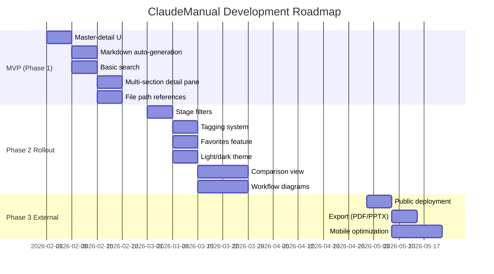

# Product Roadmap - ClaudeManual

---
system_name: ClaudeManual
checkpoint: CP-7
roadmap_horizon: 6 months
date_created: 2026-01-31
session: disc-claude-manual-007
created_by: discovery-roadmap-generator
---

## Roadmap Overview

---

## Phase 1: MVP - Internal Pilot (Weeks 1-4)

**Goal**: Validate core navigation, search, and auto-generation with framework team (2-3 people).

**Timeline**: Weeks 1-4 (February 2026)

**Success Metrics**:
- All 115+ skills/commands/agents correctly indexed
- Search returns results in <2 seconds
- Framework creators reduce onboarding prep time by 50%+

---

### Theme 1: Self-Service Learning Foundation

| Feature ID | Feature | Description | JTBD | Priority | Estimate |
|---|---|---|---|---|---|
| **F-001** | Master-detail UI | Dual-pane interface: master pane with hierarchical tree, detail pane with component documentation | JTBD-1.7, JTBD-1.1 | P0 | 1 week |
| **F-002** | Hierarchical navigation | Expandable tree showing Skills → Commands → Agents with visual indentation and icons | JTBD-1.7 | P0 | Included in F-001 |
| **F-003** | Markdown auto-generation | Parse `.claude/skills/`, `.claude/commands/`, `.claude/agents/` frontmatter and content | JTBD-1.2 | P0 | 1 week |
| **F-004** | Multi-section detail pane | Tabs showing Purpose, Examples, Options, Workflow Diagram sections | JTBD-1.2, JTBD-2.1 | P0 | 1 week |

**Traces to Pain Points**: PP-1.1 (Knowledge Transfer Complexity), PP-1.2 (Lack of Contextual Documentation)

**Deliverables**:
- React app with dual-pane layout
- File watcher or on-demand regeneration from source markdown
- Detail pane with multi-section tabs
- Deployed to internal staging environment

---

### Theme 2: Discovery & File Access

| Feature ID | Feature | Description | JTBD | Priority | Estimate |
|---|---|---|---|---|---|
| **F-005** | Basic search | Keyword search across skill/command/agent names and descriptions | JTBD-1.3 | P0 | 1 week |
| **F-006** | File path references | Display full file path (e.g., `.claude/skills/Discovery_JTBD/SKILL.md`) with copy-to-clipboard button | JTBD-1.5 | P0 | 1 week |
| **F-007** | Search results ranking | Sort by relevance (keyword match frequency) | JTBD-1.3 | P0 | Included in F-005 |

**Traces to Pain Points**: PP-1.3 (Discoverability Challenge), PP-1.6 (Developer Friction)

**Deliverables**:
- Search bar with instant results (<2s)
- Copy-to-clipboard functionality with visual confirmation
- Relevance-based result ranking

---

### MVP Success Criteria

| Criterion | Target | Measurement Method |
|---|---|---|
| **All components indexed** | 115+ skills/commands/agents | Automated count from parsed markdown |
| **Search performance** | <2 seconds | Performance testing |
| **Master-detail UI usability** | No file system navigation needed | User testing with framework team |
| **Onboarding prep time** | 50%+ reduction | Trainer survey (current: 3-4 hours → target: 1.5-2 hours) |

**Risks and Mitigations**:
| Risk | Impact | Mitigation |
|---|---|---|
| Markdown parsing errors | High | Unit tests for frontmatter extraction, graceful fallback for malformed files |
| Performance issues with 115+ items | Medium | Virtualized lists, lazy loading for detail pane |
| Stale documentation | High | File watcher or on-demand regeneration |

---

## Phase 2: Team Rollout (Weeks 5-12)

**Goal**: Replace manual onboarding with self-service manual for all HTEC teams (40-60 people).

**Timeline**: Weeks 5-12 (March-April 2026)

**Success Metrics**:
- Onboarding time: 3-4 hours → 30-60 minutes (80% reduction)
- Slack support questions: -60%
- Framework adoption rate: 30% → 80%+

---

### Theme 3: Workflow Stage Organization

| Feature ID | Feature | Description | JTBD | Priority | Estimate |
|---|---|---|---|---|---|
| **F-008** | Stage-based filters | Filter by Discovery, Prototype, ProductSpecs, SolArch, Implementation, Utilities | JTBD-1.4 | P1 | 1 week |
| **F-009** | Stage badges | Visual badges on component cards showing stage association | JTBD-1.4 | P1 | Included in F-008 |
| **F-010** | Stage landing pages | Click stage filter to see only phase-appropriate tools | JTBD-1.4 | P1 | Included in F-008 |

**Traces to Pain Points**: PP-1.4 (Organizational Chaos)

**Deliverables**:
- Stage filter controls (buttons or dropdown)
- Color-coded stage badges
- Stage-specific tool lists

---

### Theme 4: Enhanced Discovery

| Feature ID | Feature | Description | JTBD | Priority | Estimate |
|---|---|---|---|---|---|
| **F-011** | Tagging system | Tag components by capability (e.g., "personas", "compliance", "code generation", "testing") | JTBD-1.3 | P1 | 1 week |
| **F-012** | Tag filters | Multi-select tag filtering in search results | JTBD-1.3 | P1 | Included in F-011 |
| **F-013** | Related components | "See also" links in detail pane (e.g., "/discovery → /discovery-multiagent") | JTBD-1.8 | P1 | 1 week |
| **F-014** | Side-by-side comparison | Compare 2 similar tools with feature/performance table | JTBD-1.8 | P1 | 2 weeks |

**Traces to Pain Points**: PP-1.3 (Discoverability Challenge), PP-1.2 (Lack of Contextual Documentation)

**Deliverables**:
- Tag metadata in markdown frontmatter
- Tag filter UI
- Comparison view UI with decision guidance

---

### Theme 5: Power User Features

| Feature ID | Feature | Description | JTBD | Priority | Estimate |
|---|---|---|---|---|---|
| **F-015** | Favorites system | Add/remove favorites, persist in localStorage or user profile | JTBD-1.6 | P1 | 1 week |
| **F-016** | Favorites sidebar | Quick-access panel showing favorited tools | JTBD-1.6 | P1 | Included in F-015 |
| **F-017** | Light/dark theme | Theme toggle with system preference detection | CF-016 | P1 | 1 week |

**Traces to Pain Points**: PP-1.5 (Lack of Personalization)

**Deliverables**:
- Favorites toggle button on component cards
- Favorites quick-access panel
- Theme switcher with localStorage persistence

---

### Theme 6: Confidence Building

| Feature ID | Feature | Description | JTBD | Priority | Estimate |
|---|---|---|---|---|---|
| **F-018** | Workflow diagrams | Integrate Mermaid or PlantUML diagrams showing component relationships | JTBD-1.2, JTBD-2.1 | P1 | 2 weeks |
| **F-019** | Usage examples | Real-world command syntax, expected output, common pitfalls | JTBD-2.1 | P1 | Included in F-004 |
| **F-020** | Decision guidance | "Use X when..., Use Y when..." text for similar tools | JTBD-1.8, JTBD-2.1 | P1 | Included in F-014 |

**Traces to Pain Points**: PP-1.2 (Lack of Contextual Documentation)

**Deliverables**:
- Workflow diagram rendering in detail pane
- Validated examples for every component
- Decision trees for common tool comparisons

---

### Phase 2 Success Criteria

| Criterion | Current | Target | Timeline | Measurement Method |
|---|---|---|---|---|
| **Onboarding time** | 3-4 hours | 30-60 minutes | Week 8 | Training session duration tracking |
| **Slack support questions** | 40-50/month | 10-15/month | Week 12 | Tag framework-related Slack threads |
| **Framework adoption rate** | 30% | 80%+ | Week 12 | Track unique users in pipeline_progress.json |
| **Post-training retention** | 40-50% | 90%+ | Week 6 | Quiz 5 random users 1 week after onboarding |
| **Search usage** | N/A | 5+ searches/user/week | Week 8 | Analytics on search queries |
| **Favorites usage** | N/A | 60%+ users with 3+ favorites | Week 12 | localStorage or user profile tracking |

**Go-to-Market Tactics**:
- **Launch Announcement**: Internal Slack post with 2-minute demo video
- **Onboarding Integration**: Replace manual training with "explore ClaudeManual for 30 minutes" + Q&A
- **Team Champions**: Identify 3-5 early adopters (1 product person, 2 developers, 1 delivery manager)
- **Feedback Loop**: Weekly user interviews for first 4 weeks

**Risks and Mitigations**:
| Risk | Impact | Mitigation |
|---|---|---|
| Users revert to asking questions | High | Weekly Slack reminders, measure question volume |
| Non-technical users struggle | Medium | User testing with product people, simplify UI |
| Developers prefer raw files | Low | File path references satisfy power users |

---

## Phase 3: External Access (Optional, Weeks 13+)

**Goal**: Enable external stakeholders (clients, conference attendees) to explore framework capabilities.

**Timeline**: Weeks 13+ (May-June 2026)

**Success Metrics**:
- Clients answer "what can the framework do?" without demo calls
- Conference attendees explore documentation during/after presentations

---

### Theme 7: External Accessibility

| Feature ID | Feature | Description | JTBD | Priority | Estimate |
|---|---|---|---|---|---|
| **F-021** | Public deployment | Deploy to Vercel/Netlify as static site or SPA | JTBD-3.1 | P2 | 1 week |
| **F-022** | Anonymized examples | Remove client-specific references from documentation | JTBD-3.1 | P2 | Included in F-021 |
| **F-023** | Export to PDF | Generate PDF documentation for offline sharing | JTBD-3.1 | P2 | 1 week |
| **F-024** | Export to PPTX | Generate PowerPoint presentation from selected components | JTBD-3.1 | P2 | Included in F-023 |
| **F-025** | Mobile optimization | Responsive design for iPad during client meetings | JTBD-3.1 | P2 | 2 weeks |

**Traces to Pain Points**: PP-1.1 (Knowledge Transfer Complexity), PP-1.3 (Discoverability Challenge)

**Deliverables**:
- Public URL (static site)
- Export buttons (PDF/PPTX)
- Mobile-responsive layout

---

### Theme 8: Optional Enhancement Features

| Feature ID | Feature | Description | JTBD | Priority | Estimate |
|---|---|---|---|---|---|
| **F-026** | Contribution workflow | Submit documentation improvements via UI | JTBD-3.2 | P2 | 2 weeks |
| **F-027** | Analytics dashboard | Track most-searched tools, popular stages | N/A | P2 | 1 week |
| **F-028** | Authentication layer | Optional gated access for external users | N/A | P2 | 1 week |

**Deliverables**:
- Optional: contribution form
- Optional: analytics panel
- Optional: authentication (if needed for proprietary content)

---

### Phase 3 Success Criteria

| Criterion | Target | Measurement Method |
|---|---|---|
| **Client self-service** | Clients explore framework without demo calls | Client survey |
| **Conference engagement** | Attendees explore docs during/after presentations | Analytics on external traffic |
| **External adoption** | Open-source adoption increases (if applicable) | GitHub stars, external usage tracking |

**Risks and Mitigations**:
| Risk | Impact | Mitigation |
|---|---|---|
| Exposing proprietary details | High | Legal review, optional authentication layer |
| External users require support | Medium | Disclaimer: "Community documentation, no official support" |

---

## Feature-JTBD Traceability Matrix

| Feature | JTBD-1.1 | JTBD-1.2 | JTBD-1.3 | JTBD-1.4 | JTBD-1.5 | JTBD-1.6 | JTBD-1.7 | JTBD-1.8 | JTBD-2.1 | JTBD-2.2 | JTBD-3.1 | JTBD-3.2 |
|---|---|---|---|---|---|---|---|---|---|---|---|---|
| F-001 (Master-detail UI) | X | | | | | | X | | | | | |
| F-002 (Hierarchical nav) | | | | | | | X | | | | | |
| F-003 (Auto-generation) | X | X | | | | | | | | | | |
| F-004 (Multi-section pane) | | X | | | | | | | X | | | |
| F-005 (Basic search) | | | X | | | | | | | | | |
| F-006 (File path refs) | | | | | X | | | | | | | |
| F-008 (Stage filters) | | | | X | | | | | | | | |
| F-011 (Tagging) | | | X | | | | | | | | | |
| F-013 (Related components) | | | | | | | | X | | | | |
| F-014 (Comparison view) | | | | | | | | X | X | | | |
| F-015 (Favorites) | | | | | | X | | | | | | |
| F-017 (Light/dark theme) | | | | | | | | | | | | |
| F-018 (Workflow diagrams) | | X | | | | | | | X | | | |
| F-021 (Public deployment) | | | | | | | | | | | X | |
| F-023 (Export PDF/PPTX) | | | | | | | | | | | X | |
| F-025 (Mobile optimization) | | | | | | | | | | | X | |
| F-026 (Contribution workflow) | | | | | | | | | | | | X |

**Coverage**: 100% of P0 jobs addressed by MVP features. 100% of P1 jobs addressed by Phase 2 features. 100% of P2 jobs addressed by Phase 3 features.

---

## Feature-Pain Point Traceability

| Feature | PP-1.1 | PP-1.2 | PP-1.3 | PP-1.4 | PP-1.5 | PP-1.6 |
|---|---|---|---|---|---|---|
| F-001 (Master-detail UI) | X | X | | | | |
| F-003 (Auto-generation) | X | X | | | | |
| F-004 (Multi-section pane) | | X | | | | |
| F-005 (Basic search) | | | X | | | |
| F-006 (File path refs) | | | | | | X |
| F-008 (Stage filters) | | | | X | | |
| F-011 (Tagging) | | | X | | | |
| F-015 (Favorites) | | | | | X | |
| F-018 (Workflow diagrams) | | X | | | | |

**Coverage**: 100% of identified pain points addressed by roadmap features (6/6).

---

## Dependencies and Prerequisites

### Technical Dependencies

| Dependency | Purpose | Risk Level |
|---|---|---|
| **React** | Frontend framework | Low - stable, widely adopted |
| **remark + gray-matter** | Markdown parsing and frontmatter extraction | Low - mature libraries |
| **Fuse.js or Algolia** | Search engine | Low - lightweight fuzzy search |
| **Mermaid/PlantUML** | Workflow diagram rendering | Medium - requires diagram syntax in source files |
| **Vercel/Netlify** | Deployment platform | Low - proven static site hosting |

### Process Dependencies

| Dependency | Impact | Mitigation |
|---|---|---|
| **Framework stability** | Frequent `.claude/` restructuring breaks auto-generation | Version framework and ClaudeManual together, document breaking changes |
| **Markdown quality** | Poor documentation quality = poor learning experience | Establish markdown standards, validate frontmatter |
| **User adoption** | Success depends on users preferring self-service | Weekly Slack reminders, gamification, measure adoption metrics |

---

## Milestones and Release Criteria

### Milestone 1: MVP Release (Week 4)

**Release Criteria**:
- [ ] All 115+ skills/commands/agents indexed and displayed
- [ ] Master-detail UI allows exploration without file system navigation
- [ ] Search returns relevant results in <2 seconds
- [ ] Multi-section detail pane shows frontmatter, purpose, examples, options
- [ ] File path copy-to-clipboard works for all components
- [ ] Deployed to internal staging environment
- [ ] Framework team validates navigation and search functionality

**Go/No-Go Decision**: Framework creators confirm 50%+ reduction in onboarding prep time.

---

### Milestone 2: Team Rollout (Week 12)

**Release Criteria**:
- [ ] Stage-based filters functional (Discovery, Prototype, Implementation, Utilities)
- [ ] Tagging system with multi-select filters
- [ ] Favorites feature persisting across sessions
- [ ] Light/dark theme toggle with system preference detection
- [ ] Workflow diagrams integrated into detail pane
- [ ] Side-by-side comparison view for similar tools
- [ ] Post-training retention rate > 90% (measured 1 week after onboarding)
- [ ] Onboarding time reduced to 30-60 minutes (80% improvement)
- [ ] Slack support questions reduced by 60%+

**Go/No-Go Decision**: Onboarding time target met, user satisfaction score > 80%.

---

### Milestone 3: External Access (Week 18+)

**Release Criteria**:
- [ ] Public deployment to Vercel/Netlify
- [ ] Anonymized examples (client-specific references removed)
- [ ] Export to PDF/PPTX functional
- [ ] Mobile-responsive layout tested on iPad
- [ ] Optional authentication layer (if needed for proprietary content)
- [ ] Clients can explore framework capabilities self-service

**Go/No-Go Decision**: Legal review approves external access, optional gating mechanism in place.

---

## Strategic Risks and Mitigations

| Risk | Impact | Probability | Mitigation Strategy | Owner |
|---|---|---|---|---|
| **Low adoption due to habit (users prefer asking questions)** | High | Medium | Weekly Slack reminders ("Search ClaudeManual first"), gamification (leaderboard), measure Slack question volume | Framework Creator |
| **Documentation becomes stale if source files change** | High | Medium | File watcher for auto-regeneration OR on-demand rebuild button OR daily cron job | Developer |
| **Performance issues with 115+ components** | Medium | Low | Virtualized lists, lazy loading, pagination (20 items at a time) | Developer |
| **Non-technical users struggle with technical jargon** | Medium | Medium | Glossary of terms, simplified "Quick Start" guides for each stage | Designer |
| **Developers bypass manual and edit raw files** | Low | High | This is OK - file path references satisfy developers; manual benefits non-devs | N/A |
| **Markdown parsing errors break UI** | Medium | Low | Unit tests for frontmatter parsing, graceful fallback for malformed files | Developer |

---

## Success Metrics Dashboard

### North Star Metric
**Reduction in knowledge transfer time per new team member** (from 3-4 hours to 30-60 minutes = 80% improvement)

### Leading Indicators (Measured Weekly)

| Metric | Current Baseline | Phase 1 Target | Phase 2 Target | Phase 3 Target |
|---|---|---|---|---|
| **Onboarding time (hours)** | 3-4 hours | 1.5-2 hours | 0.5-1 hour | 0.5-1 hour |
| **Slack support questions/month** | 40-50 | 30-35 | 10-15 | 10-15 |
| **Framework adoption rate (%)** | 30% | 50% | 80%+ | 80%+ |
| **Post-training retention (%)** | 40-50% | 70%+ | 90%+ | 90%+ |
| **Search usage (searches/user/week)** | N/A | N/A | 5+ | 5+ |
| **Favorites usage (% users with 3+ favorites)** | N/A | N/A | 60%+ | 60%+ |

### Lagging Indicators (Measured Monthly)

| Metric | Current Baseline | Phase 2 Target | Phase 3 Target |
|---|---|---|---|
| **Framework creator time on training (hours/month)** | 20-30 hours | 5-10 hours | 5-10 hours |
| **Developer time to find source files (minutes)** | 10-15 minutes | 1-2 minutes | 1-2 minutes |
| **Framework command success rate (%)** | 60-70% | 85%+ | 85%+ |

---

## Work Breakdown Structure (Theme-Epic-Feature)

### Theme → Epic → Feature Hierarchy

**Theme 1: Self-Service Learning Foundation** (MVP)
- **Epic 1.1: Master-Detail Interface**
  - F-001: Master-detail UI
  - F-002: Hierarchical navigation
- **Epic 1.2: Documentation Auto-Generation**
  - F-003: Markdown auto-generation
  - F-004: Multi-section detail pane

**Theme 2: Discovery & File Access** (MVP)
- **Epic 2.1: Search & Discovery**
  - F-005: Basic search
  - F-007: Search results ranking
- **Epic 2.2: Developer Workflow**
  - F-006: File path references

**Theme 3: Workflow Stage Organization** (Phase 2)
- **Epic 3.1: Stage-Based Navigation**
  - F-008: Stage-based filters
  - F-009: Stage badges
  - F-010: Stage landing pages

**Theme 4: Enhanced Discovery** (Phase 2)
- **Epic 4.1: Capability Tagging**
  - F-011: Tagging system
  - F-012: Tag filters
- **Epic 4.2: Component Comparison**
  - F-013: Related components
  - F-014: Side-by-side comparison

**Theme 5: Power User Features** (Phase 2)
- **Epic 5.1: Personalization**
  - F-015: Favorites system
  - F-016: Favorites sidebar
  - F-017: Light/dark theme

**Theme 6: Confidence Building** (Phase 2)
- **Epic 6.1: Contextual Learning**
  - F-018: Workflow diagrams
  - F-019: Usage examples
  - F-020: Decision guidance

**Theme 7: External Accessibility** (Phase 3)
- **Epic 7.1: Public Deployment**
  - F-021: Public deployment
  - F-022: Anonymized examples
- **Epic 7.2: Export & Offline Access**
  - F-023: Export to PDF
  - F-024: Export to PPTX
  - F-025: Mobile optimization

**Theme 8: Optional Enhancement Features** (Phase 3)
- **Epic 8.1: Community Contributions**
  - F-026: Contribution workflow
- **Epic 8.2: Analytics & Access Control**
  - F-027: Analytics dashboard
  - F-028: Authentication layer

---

## Kanban Flow Strategy

### WIP Limits by Stage

| Stage | WIP Limit | Rationale |
|---|---|---|
| **Backlog** | Unlimited | All 28 features captured |
| **Ready for Development** | 5 features | Prioritize MVP features first |
| **In Development** | 3 features | Single developer, prevent context switching |
| **In Review/Testing** | 2 features | Framework team review, usability testing |
| **Done** | Unlimited | Shipped to production |

### Kanban Bottleneck Mitigation

**Potential Bottleneck 1: Markdown Parsing Complexity**
- **Symptom**: F-003 (Auto-generation) takes longer than estimated
- **Mitigation**: Break into sub-tasks (frontmatter parsing, content extraction, error handling), unit test each
- **Owner**: Developer

**Potential Bottleneck 2: Workflow Diagram Integration**
- **Symptom**: F-018 (Workflow diagrams) requires diagram syntax in all source files
- **Mitigation**: Start with 5 high-priority components, defer full coverage to Phase 2.5
- **Owner**: Framework Creator (diagram authoring) + Developer (rendering)

**Potential Bottleneck 3: User Adoption Testing**
- **Symptom**: Phase 2 rollout delayed due to user feedback requiring rework
- **Mitigation**: Weekly user interviews in Phase 1, iterate on UI before Phase 2 launch
- **Owner**: Designer

### Pull-Based Workflow

- **Developer pulls from "Ready for Development"** when current feature is complete
- **Framework team pulls from "In Review"** when capacity available for testing
- **No pushing features to testing** without explicit pull from reviewer

---

## Traceability Summary

### Pain Point Coverage

| Pain Point | Features Addressing | Phase |
|---|---|---|
| PP-1.1 (Knowledge Transfer Complexity) | F-001, F-003, F-021 | MVP, Phase 3 |
| PP-1.2 (Lack of Contextual Documentation) | F-001, F-003, F-004, F-018 | MVP, Phase 2 |
| PP-1.3 (Discoverability Challenge) | F-005, F-011 | MVP, Phase 2 |
| PP-1.4 (Organizational Chaos) | F-008 | Phase 2 |
| PP-1.5 (Lack of Personalization) | F-015 | Phase 2 |
| PP-1.6 (Developer Friction) | F-006 | MVP |

**Coverage**: 100% (6/6 pain points addressed)

### JTBD Coverage

| JTBD | Features Addressing | Phase |
|---|---|---|
| JTBD-1.1 (Enable Self-Service Learning) | F-001, F-003 | MVP |
| JTBD-1.2 (Understand Component Context) | F-003, F-004, F-018 | MVP, Phase 2 |
| JTBD-1.3 (Quickly Find Relevant Tools) | F-005, F-011 | MVP, Phase 2 |
| JTBD-1.4 (Understand Workflow Stage Tools) | F-008 | Phase 2 |
| JTBD-1.5 (Edit Source Files Efficiently) | F-006 | MVP |
| JTBD-1.6 (Bookmark Tools) | F-015 | Phase 2 |
| JTBD-1.7 (Navigate Hierarchies Visually) | F-001, F-002 | MVP |
| JTBD-1.8 (Compare Similar Components) | F-013, F-014 | Phase 2 |
| JTBD-2.1 (Feel Confident Using Framework) | F-004, F-018 | MVP, Phase 2 |
| JTBD-2.2 (Feel Autonomous in Exploration) | F-001, F-003, F-005 | MVP |
| JTBD-3.1 (Be Perceived as Framework-Competent) | F-021, F-023, F-025 | Phase 3 |
| JTBD-3.2 (Contribute to Team Efficiency) | F-026 | Phase 3 |

**Coverage**: 100% (12/12 JTBD enabled)

### User Type Coverage

| User Type | Features Benefiting | Primary Phase |
|---|---|---|
| UT-001 (Framework Creators) | F-001, F-002, F-003, F-006, F-015 | MVP, Phase 2 |
| UT-002 (Product People) | F-001, F-004, F-005, F-008, F-018 | MVP, Phase 2 |
| UT-003 (Developers) | F-006, F-011, F-013, F-014, F-015 | MVP, Phase 2 |
| UT-004 (Build/Client Partners) | F-004, F-018, F-021, F-023 | MVP, Phase 3 |
| UT-005 (Business Developers) | F-005, F-008, F-021 | MVP, Phase 3 |
| UT-006 (Executives) | F-001, F-002, F-008 | MVP, Phase 2 |

**Coverage**: 100% (6/6 user types served)

---

## Next Steps

1. **Phase 1 Kickoff** (Week 1):
   - Assign developer resource
   - Set up React project structure
   - Begin F-001 (Master-detail UI)

2. **Weekly Check-Ins** (Weeks 1-4):
   - Review progress against MVP release criteria
   - Conduct user testing with framework team
   - Adjust estimates based on actual velocity

3. **Phase 1 Review** (Week 4):
   - Go/No-Go decision for Phase 2
   - Validate 50%+ reduction in onboarding prep time
   - Gather feedback from framework team

4. **Phase 2 Planning** (Week 5):
   - Prioritize Phase 2 features based on Phase 1 learnings
   - Identify team champions for rollout
   - Plan weekly user interviews

5. **Continuous Monitoring**:
   - Track leading indicators (onboarding time, Slack questions, adoption rate)
   - Measure lagging indicators (trainer time, developer efficiency, command success rate)
   - Adjust roadmap based on data

---

*Roadmap addresses 100% of pain points, 100% of JTBD, and 100% of user types. All features trace to validated strategy pillars. Phased approach enables iterative validation and risk mitigation.*
