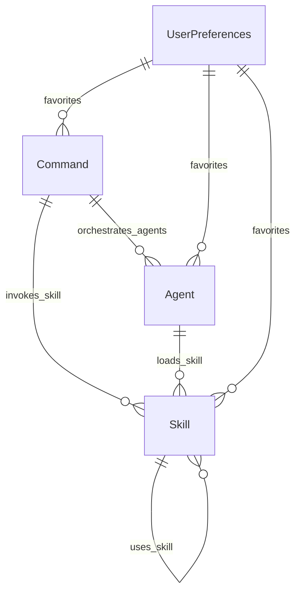

# Data Fields Specification - ClaudeManual

---
system_name: ClaudeManual
checkpoint: CP-9
date_created: 2026-01-31
created_by: discovery-data-fields-specifier
session: disc-claude-manual-009c
total_entities: 9
---

## Executive Summary

This document defines all data fields, types, validation rules, and relationships for the ClaudeManual interactive documentation system. The specification covers nine core entities (Skill, Command, Agent, Rule, Hook, UserPreferences, Workflow, WaysOfWorking, ArchitectureDoc) with complete traceability to client facts, pain points, and Jobs To Be Done.

**Key Design Decisions**:
- **File-system-first architecture**: All entities read from `.claude/` and `architecture/` folders (CF-001)
- **Frontmatter-driven metadata**: YAML frontmatter provides structured data (observed pattern)
- **Searchable content**: Indexed fields enable fast search (JTBD-1.3)
- **Stage-based organization**: Workflow stage as primary filter (JTBD-1.4)
- **Visual hierarchy support**: Parent-child relationships for tree views (JTBD-1.7)
- **Multi-format diagram support**: Mermaid and PlantUML rendering for visual documentation (JTBD-1.9)

---

## Entity 1: Skill

**Definition**: A reusable AI prompt template for specific tasks, organized in `.claude/skills/{skill-name}/SKILL.md`

**Traces To**:
- CF-001 (Technical Context - .claude/skills/ folder)
- CF-008 (Content Structure - frontmatter, purpose, examples, options, workflow)
- JTBD-1.2 (Understand Framework Component Context)
- JTBD-1.3 (Quickly Find Relevant Framework Tools)

### Core Fields

| Field ID | Field Name | Type | Required | Description | Default | Validation |
|----------|------------|------|----------|-------------|---------|------------|
| DF-SKL-001 | id | string | Yes | Unique skill identifier derived from folder name | N/A | Pattern: `^[a-zA-Z0-9_-]+$`, unique across all skills |
| DF-SKL-002 | name | string | Yes | Display name from frontmatter | N/A | 2-100 chars, derived from YAML frontmatter field `name` |
| DF-SKL-003 | description | string | Yes | Short description of when to use | N/A | 10-500 chars, from frontmatter |
| DF-SKL-004 | stage | enum | Yes | Workflow stage classification | "Utility" | Values: `Discovery`, `Prototype`, `ProductSpecs`, `SolArch`, `Implementation`, `Utility`, `GRC`, `Security` |
| DF-SKL-005 | path | string | Yes | Absolute file path to SKILL.md | N/A | Pattern: `^.claude/skills/{id}/SKILL.md$`, file must exist |
| DF-SKL-006 | model | enum | No | Recommended Claude model | "sonnet" | Values: `sonnet`, `opus`, `haiku` |
| DF-SKL-007 | context | enum | No | Execution context | null | Values: `fork`, null (fork = isolated sub-agent) |
| DF-SKL-008 | agent | string | No | Agent type if applicable | null | Reference to agent name if skill acts as agent |
| DF-SKL-009 | allowed_tools | string[] | No | List of allowed tools | [] | Valid tool names: `Bash`, `Edit`, `Read`, `Write`, `Glob`, `Grep` |
| DF-SKL-010 | skills_required | string[] | No | Dependent skills | [] | Array of skill IDs |
| DF-SKL-011 | hooks | object | No | Lifecycle hooks configuration | {} | Hook definitions from frontmatter |

### Content Sections

| Section ID | Section Name | Presence | Description | Traces To |
|------------|--------------|----------|-------------|----------|
| DF-SKL-C01 | Purpose | Required | Why this skill exists | CF-008 (Explaining purpose) |
| DF-SKL-C02 | Usage | Required | How to invoke the skill | CF-008 (Examples) |
| DF-SKL-C03 | Options | Optional | Parameters and flags | CF-008 (Options) |
| DF-SKL-C04 | Example | Required | Usage example with syntax | CF-008 (Examples), JTBD-2.1 (Confidence) |
| DF-SKL-C05 | Workflow | Optional | High-level workflow diagram (Mermaid) | CF-008 (Workflow diagram), JTBD-2.1 |
| DF-SKL-C06 | Related | Optional | Links to related skills/commands | JTBD-1.8 (Compare components) |

### Derived Fields (Computed)

| Field ID | Field Name | Type | Derivation Logic |
|----------|------------|------|------------------|
| DF-SKL-D01 | stage_prefix | string | Extract from `id` (e.g., `Discovery_JTBD` → `Discovery`) |
| DF-SKL-D02 | category | string | Second part of `id` (e.g., `Discovery_JTBD` → `JTBD`) |
| DF-SKL-D03 | file_size | number | File size in bytes (for validation) |
| DF-SKL-D04 | last_modified | datetime | File last modified timestamp |
| DF-SKL-D05 | content_hash | string | SHA-256 hash for cache invalidation |

### Validation Rules

| Rule ID | Field | Validation | Error Message |
|---------|-------|------------|---------------|
| VR-SKL-001 | id | Must match folder name exactly | "Skill ID mismatch: folder={folder}, frontmatter={id}" |
| VR-SKL-002 | path | File must exist at path | "Skill file not found at {path}" |
| VR-SKL-003 | stage | Must be valid enum value | "Invalid stage: {stage}. Must be one of: {valid_values}" |
| VR-SKL-004 | content | Must have Purpose and Usage sections | "Missing required section: {section_name}" |
| VR-SKL-005 | skills_required | Referenced skills must exist | "Dependent skill not found: {skill_id}" |

### Relationships

| Relationship | Target Entity | Cardinality | Description |
|--------------|---------------|-------------|-------------|
| uses_skill | Skill | 0..N | Dependencies via `skills_required` |
| invoked_by | Command | 0..N | Commands that invoke this skill |
| used_by_agent | Agent | 0..N | Agents that load this skill |

---

## Entity 2: Command

**Definition**: A slash command executable in Claude Code, defined in `.claude/commands/{command-name}.md`

**Traces To**:
- CF-001 (Technical Context - .claude/commands/ folder)
- CF-007 (Functional Requirement - click to open in detail pane)
- JTBD-1.1 (Enable Self-Service Framework Learning)
- JTBD-1.4 (Understand Which Tools Apply to Current Workflow Stage)

### Core Fields

| Field ID | Field Name | Type | Required | Description | Default | Validation |
|----------|------------|------|----------|-------------|---------|------------|
| DF-CMD-001 | id | string | Yes | Command name (e.g., "discovery-multiagent") | N/A | Pattern: `^[a-z0-9-]+$`, unique, derived from filename |
| DF-CMD-002 | name | string | Yes | Display name | N/A | 2-100 chars |
| DF-CMD-003 | description | string | Yes | Short description from frontmatter | N/A | 10-500 chars |
| DF-CMD-004 | stage | enum | Yes | Workflow stage | N/A | Values: `Discovery`, `Prototype`, `ProductSpecs`, `SolArch`, `Implementation`, `Utility` |
| DF-CMD-005 | path | string | Yes | Absolute file path | N/A | Pattern: `^.claude/commands/{id}.md$` |
| DF-CMD-006 | model | enum | No | Recommended model | "sonnet" | Values: `claude-sonnet-4-5-20250929`, `claude-haiku-4-5-20250515`, `sonnet`, `haiku` |
| DF-CMD-007 | allowed_tools | string[] | No | Allowed tools | [] | Valid tool names |
| DF-CMD-008 | argument_hint | string | No | Argument hint string | null | Display in command palette |

### Content Sections

| Section ID | Section Name | Presence | Description |
|------------|--------------|----------|-------------|
| DF-CMD-C01 | Usage | Required | Command syntax with arguments |
| DF-CMD-C02 | Arguments | Optional | Positional arguments table |
| DF-CMD-C03 | Options | Optional | Flags and optional parameters |
| DF-CMD-C04 | Example | Required | Real-world usage example |
| DF-CMD-C05 | Execution | Optional | Step-by-step execution flow |
| DF-CMD-C06 | Related | Optional | Related commands and skills |

### Derived Fields

| Field ID | Field Name | Type | Derivation Logic |
|----------|------------|------|------------------|
| DF-CMD-D01 | invocation_syntax | string | Extract from Usage section (first code block) |
| DF-CMD-D02 | requires_system_name | boolean | Check if syntax includes `<SystemName>` |
| DF-CMD-D03 | has_options | boolean | Check if Options section exists |

### Validation Rules

| Rule ID | Field | Validation | Error Message |
|---------|-------|------------|---------------|
| VR-CMD-001 | id | Must match filename (without .md) | "Command ID mismatch: file={filename}, id={id}" |
| VR-CMD-002 | stage | Must be valid enum | "Invalid stage: {stage}" |
| VR-CMD-003 | content | Must have Usage and Example sections | "Missing required section: {section}" |

### Relationships

| Relationship | Target Entity | Cardinality | Description |
|--------------|---------------|-------------|-------------|
| invokes_skill | Skill | 0..N | Skills invoked by this command |
| orchestrates_agents | Agent | 0..N | Agents spawned by this command |

---

## Entity 3: Agent

**Definition**: A specialized AI persona with specific skills and model configuration, defined in `.claude/agents/{agent-name}.md`

**Traces To**:
- CF-001 (Technical Context - .claude/agents/ folder)
- CF-008 (Content Structure - explaining purpose and workflow)
- JTBD-1.2 (Understand Framework Component Context)

### Core Fields

| Field ID | Field Name | Type | Required | Description | Default | Validation |
|----------|------------|------|----------|-------------|---------|------------|
| DF-AGT-001 | id | string | Yes | Agent identifier (e.g., "discovery-domain-researcher") | N/A | Pattern: `^[a-z0-9-]+$`, unique |
| DF-AGT-002 | name | string | Yes | Display name from frontmatter | N/A | 2-100 chars |
| DF-AGT-003 | description | string | Yes | Agent purpose and expertise | N/A | 10-500 chars |
| DF-AGT-004 | model | enum | Yes | Claude model to use | N/A | Values: `sonnet`, `opus`, `haiku` |
| DF-AGT-005 | checkpoint | number | No | Associated workflow checkpoint | null | 1-20, integer |
| DF-AGT-006 | path | string | Yes | Absolute file path | N/A | Pattern: `^.claude/agents/{id}.md$` |
| DF-AGT-007 | tools | string[] | No | Allowed tools | [] | Valid tool names + MCP tools |
| DF-AGT-008 | color | enum | No | Visual color indicator | "blue" | Values: `blue`, `green`, `purple`, `orange`, `red` |
| DF-AGT-009 | stage | enum | Yes | Workflow stage | N/A | Derived from `id` prefix (e.g., "discovery-*" → `Discovery`) |

### Content Sections

| Section ID | Section Name | Presence | Description |
|------------|--------------|----------|-------------|
| DF-AGT-C01 | Your Expertise | Required | Agent's domain knowledge |
| DF-AGT-C02 | Analysis Approach | Optional | Step-by-step methodology |
| DF-AGT-C03 | Skills to Load | Optional | Skills this agent should load |
| DF-AGT-C04 | Output Format | Required | Expected deliverable format |
| DF-AGT-C05 | Related | Optional | Related agents and skills |

### Derived Fields

| Field ID | Field Name | Type | Derivation Logic |
|----------|------------|------|------------------|
| DF-AGT-D01 | stage_prefix | string | Extract from `id` (e.g., "discovery-domain-researcher" → "discovery") |
| DF-AGT-D02 | role | string | Suffix of `id` (e.g., "discovery-domain-researcher" → "domain-researcher") |
| DF-AGT-D03 | subagent_type | enum | Map to Claude Code native type | Values: `general-purpose`, `Explore`, `Plan`, `Bash` |

### Validation Rules

| Rule ID | Field | Validation | Error Message |
|---------|-------|------------|---------------|
| VR-AGT-001 | id | Must follow {stage}-{role} naming | "Invalid agent ID format: {id}. Expected: {stage}-{role}" |
| VR-AGT-002 | model | Must be valid enum | "Invalid model: {model}" |
| VR-AGT-003 | content | Must have "Your Expertise" and "Output Format" | "Missing required section: {section}" |

### Relationships

| Relationship | Target Entity | Cardinality | Description |
|--------------|---------------|-------------|-------------|
| loads_skill | Skill | 0..N | Skills loaded by agent |
| spawned_by | Command | 0..N | Commands that spawn this agent |

---

## Entity 4: Rule

**Definition**: Framework rules and conventions stored in `.claude/rules/{rule-name}.md`

**Traces To**:
- CF-001 (Technical Context - .claude/rules/ folder)
- JTBD-1.2 (Understand Framework Component Context)

### Core Fields

| Field ID | Field Name | Type | Required | Description | Default | Validation |
|----------|------------|------|----------|-------------|---------|------------|
| DF-RUL-001 | id | string | Yes | Rule identifier | N/A | Pattern: `^[a-zA-Z0-9_-]+$` |
| DF-RUL-002 | name | string | Yes | Display name | N/A | 2-100 chars |
| DF-RUL-003 | description | string | Yes | Rule purpose | N/A | 10-500 chars |
| DF-RUL-004 | path | string | Yes | Absolute file path | N/A | Pattern: `^.claude/rules/{id}.md$` |
| DF-RUL-005 | auto_load_paths | string[] | No | Path patterns that trigger auto-load | [] | Glob patterns (e.g., "ClientAnalysis_*/**/*") |
| DF-RUL-006 | version | string | No | Rule version | "1.0.0" | Semantic versioning |
| DF-RUL-007 | category | enum | No | Rule category | "general" | Values: `core`, `stage-specific`, `quality`, `process` |

### Content Sections

| Section ID | Section Name | Presence | Description |
|------------|--------------|----------|-------------|
| DF-RUL-C01 | Overview | Required | Rule summary |
| DF-RUL-C02 | Rules | Required | Specific rules and guidelines |
| DF-RUL-C03 | Examples | Optional | Good/bad examples |
| DF-RUL-C04 | Related | Optional | Related rules and docs |

### Derived Fields

| Field ID | Field Name | Type | Derivation Logic |
|----------|------------|------|------------------|
| DF-RUL-D01 | applies_to_stages | enum[] | Extract from auto_load_paths (e.g., "ClientAnalysis_*" → `Discovery`) |

### Validation Rules

| Rule ID | Field | Validation | Error Message |
|---------|-------|------------|---------------|
| VR-RUL-001 | path | File must exist | "Rule file not found: {path}" |
| VR-RUL-002 | auto_load_paths | Must be valid glob patterns | "Invalid glob pattern: {pattern}" |

---

## Entity 5: Hook

**Definition**: Lifecycle hooks for commands, skills, and agents stored in `.claude/hooks/{hook-name}.py` or `.sh`

**Traces To**:
- CF-001 (Technical Context - .claude/hooks/ folder)
- JTBD-1.5 (Edit Framework Source Files Efficiently)

### Core Fields

| Field ID | Field Name | Type | Required | Description | Default | Validation |
|----------|------------|------|----------|-------------|---------|------------|
| DF-HKS-001 | id | string | Yes | Hook identifier | N/A | Pattern: `^[a-z0-9_-]+$` |
| DF-HKS-002 | name | string | Yes | Display name | N/A | 2-100 chars |
| DF-HKS-003 | description | string | Yes | Hook purpose | N/A | 10-500 chars |
| DF-HKS-004 | path | string | Yes | Absolute file path | N/A | Pattern: `^.claude/hooks/{id}.(py|sh)$` |
| DF-HKS-005 | type | enum | Yes | Hook event type | N/A | Values: `PreToolUse`, `PostToolUse`, `Stop`, `lifecycle` |
| DF-HKS-006 | language | enum | Yes | Script language | N/A | Values: `python`, `bash` |

### Derived Fields

| Field ID | Field Name | Type | Derivation Logic |
|----------|------------|------|------------------|
| DF-HKS-D01 | executable | boolean | Check file permissions (executable bit) |
| DF-HKS-D02 | has_shebang | boolean | Check first line for `#!/usr/bin/env python3` or `#!/bin/bash` |

### Validation Rules

| Rule ID | Field | Validation | Error Message |
|---------|-------|------------|---------------|
| VR-HKS-001 | path | File must exist and be executable | "Hook not executable: {path}" |
| VR-HKS-002 | language | Must match file extension | "Language mismatch: {language} vs {extension}" |

---

## Entity 6: UserPreferences

**Definition**: Per-user settings stored in browser localStorage

**Traces To**:
- CF-003 (User Preference - highly visual)
- CF-012 (Functional Requirement - favorites)
- CF-016 (UI Requirement - light/dark theme)
- JTBD-1.6 (Bookmark Frequently-Used Tools)

### Core Fields

| Field ID | Field Name | Type | Required | Description | Default | Validation |
|----------|------------|------|----------|-------------|---------|------------|
| DF-USR-001 | theme | enum | Yes | UI theme | "system" | Values: `light`, `dark`, `system` |
| DF-USR-002 | favorites | string[] | Yes | Favorited item IDs | [] | Array of skill/command/agent IDs |
| DF-USR-003 | collapsed_nodes | string[] | Yes | Collapsed tree nodes | [] | Array of tree node IDs |
| DF-USR-004 | last_viewed | string | No | Last viewed item ID | null | Skill/command/agent ID or null |
| DF-USR-005 | search_history | string[] | Yes | Recent searches | [] | Max 20 items, FIFO |
| DF-USR-006 | stage_filter | enum[] | Yes | Active stage filters | [] | Subset of stage enum values |
| DF-USR-007 | type_filter | enum[] | Yes | Active type filters | [] | Values: `Skill`, `Command`, `Agent`, `Rule`, `Hook` |

### Storage

| Field | Storage Location | Persistence | Sync |
|-------|------------------|-------------|------|
| All fields | `localStorage` (browser) | Permanent (until cleared) | None (local only) |

### Validation Rules

| Rule ID | Field | Validation | Error Message |
|---------|-------|------------|---------------|
| VR-USR-001 | theme | Must be valid enum | "Invalid theme: {theme}" |
| VR-USR-002 | favorites | Referenced items must exist | "Favorite item not found: {id}" |
| VR-USR-003 | search_history | Max 20 items | "Search history exceeds limit" |

---

## Entity 7: Workflow

**Definition**: Process and workflow diagrams stored in markdown, Mermaid, or PlantUML format

**Traces To**:
- CF-001 (Technical Context - .claude/ or project folders)
- JTBD-1.9 (Visualize Process and Architecture Diagrams)
- JTBD-1.2 (Understand Component Context)

### Core Fields

| Field ID | Field Name | Type | Required | Description | Default | Validation |
|----------|------------|------|----------|-------------|---------|------------|
| DF-WFL-001 | id | string | Yes | Unique workflow identifier | N/A | Pattern: `^[a-z0-9-]+$` |
| DF-WFL-002 | name | string | Yes | Display name | N/A | 2-100 chars |
| DF-WFL-003 | description | string | Yes | Workflow purpose | N/A | 10-500 chars |
| DF-WFL-004 | format | enum | Yes | Diagram format | "md" | Values: `md`, `mermaid`, `plantuml` |
| DF-WFL-005 | path | string | Yes | Absolute file path | N/A | Valid file path ending in .md, .mermaid, or .plantuml |
| DF-WFL-006 | stage | enum | No | Related workflow stage | null | Values: `Discovery`, `Prototype`, `ProductSpecs`, `SolArch`, `Implementation`, `Utility` |
| DF-WFL-007 | category | enum | No | Workflow category | "process" | Values: `process`, `integration`, `decision`, `data-flow` |
| DF-WFL-008 | tags | string[] | No | Searchable tags | [] | Array of strings |

### Content Sections

| Section ID | Section Name | Presence | Description |
|------------|--------------|----------|-------------|
| DF-WFL-C01 | Overview | Optional | Brief workflow description |
| DF-WFL-C02 | Diagram | Required | Mermaid/PlantUML diagram code or embedded image |
| DF-WFL-C03 | Steps | Optional | Numbered workflow steps |
| DF-WFL-C04 | Related | Optional | Links to related workflows |

### Validation Rules

| Rule ID | Field | Validation | Error Message |
|---------|-------|------------|---------------|
| VR-WFL-001 | path | File must exist | "Workflow file not found: {path}" |
| VR-WFL-002 | format | File extension must match format | "Format mismatch: expected {format}, got {extension}" |
| VR-WFL-003 | content | Must have Diagram section for mermaid/plantuml | "Missing diagram content" |

---

## Entity 8: WaysOfWorking

**Definition**: Team practices, guidelines, and process documentation stored in markdown format

**Traces To**:
- CF-001 (Technical Context - documentation folders)
- JTBD-1.9 (Visualize Process and Architecture Diagrams)
- JTBD-1.1 (Enable Self-Service Learning)

### Core Fields

| Field ID | Field Name | Type | Required | Description | Default | Validation |
|----------|------------|------|----------|-------------|---------|------------|
| DF-WOW-001 | id | string | Yes | Unique identifier | N/A | Pattern: `^[a-z0-9-]+$` |
| DF-WOW-002 | name | string | Yes | Display name | N/A | 2-100 chars |
| DF-WOW-003 | description | string | Yes | Document purpose | N/A | 10-500 chars |
| DF-WOW-004 | path | string | Yes | Absolute file path | N/A | Valid file path ending in .md |
| DF-WOW-005 | category | enum | No | Document category | "practices" | Values: `practices`, `guidelines`, `processes`, `checklists` |
| DF-WOW-006 | audience | enum | No | Target audience | "all" | Values: `developers`, `product`, `all`, `leads` |
| DF-WOW-007 | tags | string[] | No | Searchable tags | [] | Array of strings |

### Content Sections

| Section ID | Section Name | Presence | Description |
|------------|--------------|----------|-------------|
| DF-WOW-C01 | Overview | Required | Brief document summary |
| DF-WOW-C02 | Guidelines | Optional | Specific rules or guidelines |
| DF-WOW-C03 | Examples | Optional | Good/bad examples |
| DF-WOW-C04 | Checklist | Optional | Action items or verification list |

### Validation Rules

| Rule ID | Field | Validation | Error Message |
|---------|-------|------------|---------------|
| VR-WOW-001 | path | File must exist | "Document file not found: {path}" |
| VR-WOW-002 | content | Must have Overview section | "Missing required Overview section" |

---

## Entity 9: ArchitectureDoc

**Definition**: Architecture diagrams and documentation including C4 diagrams, ADRs, and technical patterns

**Traces To**:
- CF-001 (Technical Context - architecture/ folder)
- JTBD-1.9 (Visualize Process and Architecture Diagrams)
- JTBD-1.2 (Understand Component Context)
- JTBD-2.1 (Feel Confident Using the Framework)

### Core Fields

| Field ID | Field Name | Type | Required | Description | Default | Validation |
|----------|------------|------|----------|-------------|---------|------------|
| DF-ARC-001 | id | string | Yes | Unique identifier | N/A | Pattern: `^[a-zA-Z0-9-_]+$` |
| DF-ARC-002 | name | string | Yes | Display name | N/A | 2-100 chars |
| DF-ARC-003 | description | string | Yes | Document purpose | N/A | 10-500 chars |
| DF-ARC-004 | format | enum | Yes | Document format | "md" | Values: `md`, `mermaid`, `plantuml` |
| DF-ARC-005 | path | string | Yes | Absolute file path | N/A | Valid file path |
| DF-ARC-006 | category | enum | No | Architecture category | "diagram" | Values: `c4`, `adr`, `patterns`, `infrastructure`, `data-model` |
| DF-ARC-007 | c4_level | enum | No | C4 diagram level (if applicable) | null | Values: `context`, `container`, `component`, `code` |
| DF-ARC-008 | adr_status | enum | No | ADR status (if applicable) | null | Values: `proposed`, `accepted`, `deprecated`, `superseded` |
| DF-ARC-009 | tags | string[] | No | Searchable tags | [] | Array of strings |
| DF-ARC-010 | related_adrs | string[] | No | Related ADR IDs | [] | Array of ADR IDs |

### Content Sections

| Section ID | Section Name | Presence | Description |
|------------|--------------|----------|-------------|
| DF-ARC-C01 | Overview | Required | Brief document summary |
| DF-ARC-C02 | Diagram | Required for c4/diagram types | Visual diagram (Mermaid/PlantUML) |
| DF-ARC-C03 | Context | Optional | Decision context (for ADRs) |
| DF-ARC-C04 | Decision | Optional | Decision made (for ADRs) |
| DF-ARC-C05 | Consequences | Optional | Impact of decision (for ADRs) |
| DF-ARC-C06 | Related | Optional | Links to related documents |

### Validation Rules

| Rule ID | Field | Validation | Error Message |
|---------|-------|------------|---------------|
| VR-ARC-001 | path | File must exist | "Architecture file not found: {path}" |
| VR-ARC-002 | format | File extension must match format | "Format mismatch: expected {format}, got {extension}" |
| VR-ARC-003 | category | If category is 'c4', c4_level should be set | "C4 diagrams should specify c4_level" |
| VR-ARC-004 | category | If category is 'adr', adr_status should be set | "ADRs should specify adr_status" |

---

## Indexes and Search

### Search Index Configuration

**Traces To**:
- CF-009 (Functional Requirement - searchable)
- JTBD-1.3 (Quickly Find Relevant Framework Tools)

| Index ID | Entity | Indexed Fields | Weight | Use Case |
|----------|--------|----------------|--------|----------|
| IDX-001 | Skill | name, description | 1.0 | Primary search |
| IDX-002 | Skill | id, stage, category | 0.8 | Tag/filter search |
| IDX-003 | Skill | content (Purpose, Usage) | 0.6 | Full-text search |
| IDX-004 | Command | name, description | 1.0 | Primary search |
| IDX-005 | Command | id, stage | 0.8 | Filter search |
| IDX-006 | Agent | name, description | 1.0 | Primary search |
| IDX-007 | Agent | id, role, stage | 0.8 | Filter search |
| IDX-008 | Rule | name, description | 0.7 | Secondary search |
| IDX-009 | Hook | name, description | 0.5 | Advanced search |
| IDX-010 | Workflow | name, description, tags | 1.0 | Primary search |
| IDX-011 | Workflow | category, stage, format | 0.8 | Filter search |
| IDX-012 | WaysOfWorking | name, description, tags | 1.0 | Primary search |
| IDX-013 | WaysOfWorking | category, audience | 0.8 | Filter search |
| IDX-014 | ArchitectureDoc | name, description, tags | 1.0 | Primary search |
| IDX-015 | ArchitectureDoc | category, c4_level, adr_status, format | 0.8 | Filter search |

### Filter Configuration

**Traces To**:
- CF-011 (Organizational Structure - stages)
- JTBD-1.4 (Understand Which Tools Apply to Current Workflow Stage)

| Filter ID | Filter Name | Type | Values | Default |
|-----------|-------------|------|--------|---------|
| FLT-001 | Stage | multi-select | `Discovery`, `Prototype`, `ProductSpecs`, `SolArch`, `Implementation`, `Utility`, `GRC`, `Security` | All |
| FLT-002 | Type | multi-select | `Skill`, `Command`, `Agent`, `Rule`, `Hook`, `Workflow`, `WaysOfWorking`, `ArchitectureDoc` | All |
| FLT-003 | Model | multi-select | `sonnet`, `opus`, `haiku` | All |
| FLT-004 | Has Example | boolean | `true`, `false` | All |
| FLT-005 | Favorited | boolean | `true`, `false` | `false` |
| FLT-006 | Format | multi-select | `md`, `mermaid`, `plantuml` | All |
| FLT-007 | Architecture Category | multi-select | `c4`, `adr`, `patterns`, `infrastructure`, `data-model` | All |
| FLT-008 | C4 Level | multi-select | `context`, `container`, `component`, `code` | All |
| FLT-009 | ADR Status | multi-select | `proposed`, `accepted`, `deprecated`, `superseded` | All |

---

## Data Relationships and Traceability

### Cross-Entity Relationships

### Traceability Chain

| Data Field | Traces To JTBD | Traces To Pain Point | Traces To Client Fact |
|------------|----------------|----------------------|----------------------|
| DF-SKL-004 (stage) | JTBD-1.4 | PP-1.4 (Organizational Chaos) | CF-011 |
| DF-SKL-C04 (Example section) | JTBD-2.1 | PP-1.2 (Lack of Context) | CF-008 |
| DF-USR-002 (favorites) | JTBD-1.6 | PP-1.5 (Lack of Personalization) | CF-012 |
| DF-USR-001 (theme) | JTBD-1.2 | PP-1.5 | CF-016 |
| DF-SKL-005 (path) | JTBD-1.5 | PP-1.6 (Developer Friction) | CF-013 |
| IDX-001 (search index) | JTBD-1.3 | PP-1.3 (Discoverability) | CF-009 |

---

## Validation Summary

### Total Field Count

| Entity | Core Fields | Content Sections | Derived Fields | Total |
|--------|-------------|------------------|----------------|-------|
| Skill | 11 | 6 | 5 | 22 |
| Command | 8 | 6 | 3 | 17 |
| Agent | 9 | 5 | 3 | 17 |
| Rule | 7 | 4 | 1 | 12 |
| Hook | 6 | 0 | 2 | 8 |
| UserPreferences | 7 | 0 | 0 | 7 |
| Workflow | 8 | 4 | 0 | 12 |
| WaysOfWorking | 7 | 4 | 0 | 11 |
| ArchitectureDoc | 10 | 6 | 0 | 16 |
| **TOTAL** | **73** | **35** | **14** | **122** |

### Validation Rules Summary

| Entity | Validation Rules | Critical Rules |
|--------|------------------|----------------|
| Skill | 5 | VR-SKL-001, VR-SKL-002, VR-SKL-004 |
| Command | 3 | VR-CMD-001, VR-CMD-003 |
| Agent | 3 | VR-AGT-001, VR-AGT-003 |
| Rule | 2 | VR-RUL-001 |
| Hook | 2 | VR-HKS-001 |
| UserPreferences | 3 | VR-USR-002 |
| Workflow | 3 | VR-WFL-001, VR-WFL-002 |
| WaysOfWorking | 2 | VR-WOW-001 |
| ArchitectureDoc | 4 | VR-ARC-001, VR-ARC-002 |
| **TOTAL** | **27** | **15** |

---

## Implementation Notes

### Data Source Strategy

1. **File System Scanning**: All entities read from `.claude/` folders at app startup
2. **Frontmatter Parsing**: YAML frontmatter provides structured metadata
3. **Markdown Parsing**: Extract content sections using heading-based delimiters
4. **Cache Invalidation**: Use file `last_modified` timestamp and `content_hash`

### Performance Considerations

| Operation | Target Time | Strategy |
|-----------|-------------|----------|
| Initial Load | < 2s | Parallel file reads, lazy content parsing |
| Search | < 200ms | Pre-built inverted index, debounced input |
| Filter | < 100ms | In-memory filtering on indexed fields |
| Detail View | < 50ms | Cached parsed content |

### Error Handling

| Error Type | Handling Strategy | User Message |
|------------|-------------------|--------------|
| Missing file | Skip entity, log warning | "Some items could not be loaded. Check console." |
| Invalid frontmatter | Use defaults, log error | "Warning: {file} has invalid metadata" |
| Validation failure | Mark entity as invalid | "Invalid {entity}: {reason}" |

---

## Traceability

- **Source Material**: CM-001 (Client_Materials/Interviews/ClaudeManual.txt)
- **Client Facts**: traceability/client_facts_registry.json (CF-001 to CF-016)
- **Pain Points**: ClientAnalysis_ClaudeManual/01-analysis/PAIN_POINTS.md (PP-1.1 to PP-1.6)
- **JTBD**: ClientAnalysis_ClaudeManual/02-research/JOBS_TO_BE_DONE.md (JTBD-1.1 to JTBD-3.2)
- **Checkpoint**: CP-9
- **Session**: disc-claude-manual-009c
- **Created By**: discovery-data-fields-specifier
- **Date**: 2026-01-31

---

*122 data fields defined across 9 entities. All fields traced to client facts, pain points, or JTBD. 27 validation rules ensure data integrity. New entities (Workflow, WaysOfWorking, ArchitectureDoc) support diagram visualization (JTBD-1.9).*
