# Navigation Structure - ClaudeManual

---
system_name: ClaudeManual
checkpoint: CP-9
date_created: 2026-01-31
session: disc-claude-manual-009b
created_by: discovery-navigation-specifier
---

## Information Architecture

```mermaid
graph TD
    A[Home] --> B[Skills]
    A --> C[Commands]
    A --> D[Agents]
    A --> E[Rules]
    A --> F[Hooks]
    A --> G[Search]
    A --> H[Favorites]

    B --> B1[Discovery Skills]
    B --> B2[Prototype Skills]
    B --> B3[ProductSpecs Skills]
    B --> B4[Implementation Skills]
    B --> B5[Utility Skills]

    C --> C1[Discovery Commands]
    C --> C2[Prototype Commands]
    C --> C3[ProductSpecs Commands]
    C --> C4[SolArch Commands]
    C --> C5[Implementation Commands]

    D --> D1[Discovery Agents]
    D --> D2[Prototype Agents]
    D --> D3[ProductSpecs Agents]
    D --> D4[Implementation Agents]
    D --> D5[Quality Agents]

    E --> E1[Core Rules]
    E --> E2[Discovery Rules]
    E --> E3[Process Integrity Rules]
    E --> E4[Agent Coordination Rules]

    F --> F1[Lifecycle Hooks]
    F --> F2[Quality Hooks]
    F --> F3[Coordination Hooks]
```



---

## Navigation Hierarchy

### Level 1: Component Types (Primary Navigation)

**Master Pane - Top Level Categories**

| Node | Label | Icon | JTBD Supported | Description |
|------|-------|------|----------------|-------------|
| `/skills` | Skills | 🛠️ | JTBD-1.7, JTBD-1.3 | Framework capabilities (115+ skills) |
| `/commands` | Commands | ⚡ | JTBD-1.7, JTBD-1.3 | Executable slash commands |
| `/agents` | Agents | 🤖 | JTBD-1.7, JTBD-1.3 | Multi-agent orchestrators |
| `/rules` | Rules | 📋 | JTBD-1.7, JTBD-1.3 | Framework rules and policies |
| `/hooks` | Hooks | 🔗 | JTBD-1.7, JTBD-1.3 | Execution lifecycle hooks |
| `/workflows` | Workflows | 📊 | JTBD-1.7, JTBD-1.9 | Process and workflow diagrams (.md, .mermaid) |
| `/ways-of-working` | Ways of Working | 📖 | JTBD-1.7, JTBD-1.9 | Team practices and methodology documentation |
| `/architecture` | Architecture | 🏛️ | JTBD-1.7, JTBD-1.9 | Architecture diagrams and docs (.md, .mermaid, .plantuml) |
| `/search` | Search | 🔍 | JTBD-1.3 | Global search interface |
| `/favorites` | Favorites | ⭐ | JTBD-1.6 | User-curated quick access |

**Design Notes**:
- Icons provide visual recognition (CF-003: highly visual)
- Addresses JTBD-1.7 (Navigate Framework Hierarchies Visually)
- Supports JTBD-1.3 (Quickly Find Relevant Framework Tools)
- New document types (Workflows, Ways of Working, Architecture) address JTBD-1.9 (Visualize Process and Architecture Diagrams)

---

### Level 2: Stage Groups (Secondary Navigation)

**Hierarchical Tree - Stage-Based Grouping**

#### Skills by Stage

| Node | Label | Badge Color | Count | JTBD Supported |
|------|-------|-------------|-------|----------------|
| `/skills/discovery` | Discovery | Blue (#2563EB) | 29 | JTBD-1.4 |
| `/skills/prototype` | Prototype | Green (#059669) | 14+ | JTBD-1.4 |
| `/skills/productspecs` | ProductSpecs | Orange (#EA580C) | 10 | JTBD-1.4 |
| `/skills/solarch` | SolArch | Teal (#0891B2) | 6 | JTBD-1.4 |
| `/skills/implementation` | Implementation | Purple (#9333EA) | 5 | JTBD-1.4 |
| `/skills/utility` | Utility | Gray (#6B7280) | 51+ | JTBD-1.4 |

#### Commands by Stage

| Node | Label | Badge Color | Example Commands |
|------|-------|-------------|------------------|
| `/commands/discovery` | Discovery | Blue | /discovery, /discovery-multiagent, /discovery-audit |
| `/commands/prototype` | Prototype | Green | /prototype, /prototype-feedback, /presentation-slidev |
| `/commands/productspecs` | ProductSpecs | Orange | /productspecs, /productspecs-jira |
| `/commands/solarch` | SolArch | Teal | /solarch, /solarch-feedback |
| `/commands/implementation` | Implementation | Purple | /htec-sdd-tasks, /htec-sdd-implement, /htec-sdd-review |
| `/commands/utility` | Utility | Gray | /htec-libraries-init, /integrity-check, /trace-audit |

#### Agents by Stage

| Node | Label | Badge Color | Example Agents |
|------|-------|-------------|----------------|
| `/agents/discovery` | Discovery | Blue | interview-analyst, persona-synthesizer, jtbd-extractor |
| `/agents/prototype` | Prototype | Green | screen-specifier, code-generator, design-system-creator |
| `/agents/productspecs` | ProductSpecs | Orange | module-spec-writer, test-designer, jira-exporter |
| `/agents/implementation` | Implementation | Purple | implementation-developer, test-automation-engineer |
| `/agents/quality` | Quality | Red (#DC2626) | bug-hunter, security-auditor, code-reviewer |

#### Workflows by Category

| Node | Label | Badge Color | Example Workflows |
|------|-------|-------------|-------------------|
| `/workflows/process` | Process Flows | Blue (#2563EB) | discovery-process, prototype-workflow, feedback-loop |
| `/workflows/integration` | Integration | Green (#059669) | api-integration-flow, data-pipeline |
| `/workflows/decision` | Decision Trees | Orange (#EA580C) | tool-selection-guide, error-handling-flow |

#### Ways of Working by Category

| Node | Label | Badge Color | Example Documents |
|------|-------|-------------|-------------------|
| `/ways-of-working/practices` | Practices | Teal (#0891B2) | tdd-practices, code-review-checklist |
| `/ways-of-working/guidelines` | Guidelines | Purple (#9333EA) | naming-conventions, commit-standards |
| `/ways-of-working/processes` | Processes | Gray (#6B7280) | sprint-process, release-process |

#### Architecture by Category

| Node | Label | Badge Color | Example Documents |
|------|-------|-------------|-------------------|
| `/architecture/c4` | C4 Diagrams | Blue (#2563EB) | context-diagram, container-diagram, component-diagram |
| `/architecture/adr` | ADRs | Green (#059669) | ADR-001-architecture-style, ADR-002-data-storage |
| `/architecture/patterns` | Patterns | Orange (#EA580C) | repository-pattern, event-sourcing |
| `/architecture/infrastructure` | Infrastructure | Purple (#9333EA) | deployment-diagram, network-topology |

**Design Notes**:
- Stage badges match framework conventions (CF-011: organized by stages)
- Addresses JTBD-1.4 (Understand Which Tools Apply to Current Workflow Stage)
- Visual color coding reduces cognitive load
- New document types (Workflows, Ways of Working, Architecture) address JTBD-1.9

---

### Level 3: Individual Items (Detail Navigation)

**Component Detail Pattern**

| Pattern | Example | Detail Pane Sections |
|---------|---------|----------------------|
| `/skills/{stage}/{skill_name}` | `/skills/discovery/Discovery_JTBD` | Purpose, Examples, Options, Workflow, Traceability |
| `/commands/{command_name}` | `/commands/discovery-multiagent` | Purpose, Usage, Arguments, Examples, Related Commands |
| `/agents/{agent_name}` | `/agents/interview-analyst` | Purpose, Skills Loaded, Model, Session Tracking |
| `/rules/{rule_name}` | `/rules/traceability` | Purpose, ID Formats, Validation Rules, Examples |
| `/hooks/{hook_name}` | `/hooks/version_history_logger` | Purpose, Arguments, Integration Points, Examples |

**Detail Pane Tabs** (CF-008: multiple sections):

| Tab | Content | JTBD Supported |
|-----|---------|----------------|
| **Purpose** | Why and when to use this component | JTBD-1.2, JTBD-2.1 |
| **Examples** | Command syntax, expected output, common pitfalls | JTBD-1.2, JTBD-2.1 |
| **Options** | Arguments, flags, configuration | JTBD-1.2 |
| **Workflow** | High-level workflow diagram (Mermaid) | JTBD-1.2, JTBD-2.1 |
| **Traceability** | JTBD/Pain Point links, version history | JTBD-1.2 |
| **Related** | Similar components, comparison links | JTBD-1.8 |

**Design Notes**:
- Addresses JTBD-1.2 (Understand Framework Component Context)
- Addresses JTBD-2.1 (Feel Confident Using the Framework)
- Addresses JTBD-1.8 (Compare Similar Framework Components)

---

## URL Structure

**Base URL Pattern**: `/manual/`

### Route Examples

| Route | Description |
|-------|-------------|
| `/manual/` | Home page (dashboard with recent items, favorites, quick search) |
| `/manual/skills` | Skills landing page (stage filters, search, grid/list toggle) |
| `/manual/skills/discovery` | Discovery skills list |
| `/manual/skills/discovery/Discovery_JTBD` | Discovery_JTBD skill detail |
| `/manual/commands` | Commands landing page |
| `/manual/commands/discovery-multiagent` | Discovery-multiagent command detail |
| `/manual/agents` | Agents landing page |
| `/manual/agents/interview-analyst` | Interview-analyst agent detail |
| `/manual/workflows` | Workflows landing page (process diagrams) |
| `/manual/workflows/discovery-process` | Specific workflow diagram |
| `/manual/ways-of-working` | Ways of Working landing page |
| `/manual/ways-of-working/tdd-practices` | Specific practices document |
| `/manual/architecture` | Architecture documentation landing page |
| `/manual/architecture/c4/context-diagram` | C4 context diagram |
| `/manual/architecture/adr/ADR-001` | Architecture Decision Record |
| `/manual/search?q={query}` | Global search results |
| `/manual/search?q={query}&stage=discovery` | Stage-filtered search |
| `/manual/search?q={query}&type=workflow` | Type-filtered search (workflows) |
| `/manual/favorites` | User favorites list |

**Query Parameters**:
- `q`: Search query string
- `stage`: Filter by stage (discovery, prototype, productspecs, solarch, implementation, utility)
- `type`: Filter by type (skill, command, agent, rule, hook, workflow, ways-of-working, architecture)
- `format`: Filter by format (md, mermaid, plantuml) - applies to workflows/architecture
- `sort`: Sort order (name, stage, recent)

**Design Notes**:
- Clean, RESTful URLs
- Deep linkable for sharing (CF-013: reference where they are in route)
- Supports browser history navigation

---

## Breadcrumb Pattern

**Format**: `Home > {Category} > {Stage} > {Item}`

### Examples

| Path | Breadcrumb |
|------|------------|
| `/manual/skills/discovery/Discovery_JTBD` | Home > Skills > Discovery > Discovery_JTBD |
| `/manual/commands/discovery-multiagent` | Home > Commands > Discovery > discovery-multiagent |
| `/manual/agents/interview-analyst` | Home > Agents > Discovery > interview-analyst |
| `/manual/search?q=persona` | Home > Search > "persona" |
| `/manual/favorites` | Home > Favorites |

**Behavior**:
- Each breadcrumb segment is clickable (navigates up hierarchy)
- Current page (last segment) is non-clickable, bold
- Truncate long item names with ellipsis (max 40 chars)

**Design Notes**:
- Addresses JTBD-1.7 (Navigate Framework Hierarchies Visually)
- Provides context and escape hatches

---

## Stage Filters

**Global Filter Bar** (appears on landing pages: /skills, /commands, /agents)

### Filter UI

| Filter Type | UI Component | Options |
|-------------|--------------|---------|
| **Stage** | Badge toggle buttons | All, Discovery, Prototype, ProductSpecs, SolArch, Implementation, Utility |
| **Type** | Dropdown | All Types, Skill, Command, Agent, Rule, Hook |
| **Sort** | Dropdown | Name (A-Z), Stage, Recently Added |

**Filter Behavior**:
- Default: "All" selected (shows all items)
- Clicking stage badge filters items instantly (no page reload)
- Multiple filters combine with AND logic
- Active filters show count badge (e.g., "Discovery (29)")
- Clear filters button appears when filters active

**Visual Design**:
- Stage badges use consistent color scheme (Blue, Green, Orange, Teal, Purple, Gray)
- Active badge has solid background, inactive has outline only
- Badge hover state shows tooltip with stage description

**Design Notes**:
- Addresses JTBD-1.4 (Understand Which Tools Apply to Current Workflow Stage)
- Reduces cognitive load by hiding irrelevant tools

---

## Keyboard Navigation

**Tree Navigation** (master pane):

| Key | Action |
|-----|--------|
| `↑` / `↓` | Navigate tree items vertically |
| `←` | Collapse current node (if expanded) or move to parent |
| `→` | Expand current node (if collapsed) or move to first child |
| `Enter` | Select item (load detail pane) |
| `Space` | Toggle expand/collapse without selecting |
| `Home` | Jump to first item in tree |
| `End` | Jump to last item in tree |

**Global Shortcuts**:

| Key | Action |
|-----|--------|
| `/` | Focus search input (global) |
| `F` | Toggle favorite for current item |
| `C` | Copy file path to clipboard (CF-013) |
| `Esc` | Close detail pane or clear search |
| `Ctrl+K` (or `Cmd+K`) | Open command palette |

**Search Navigation**:

| Key | Action |
|-----|--------|
| `↑` / `↓` | Navigate search results |
| `Enter` | Open selected result |
| `Esc` | Clear search |

**Design Notes**:
- Keyboard-first navigation for power users
- Addresses JTBD-1.5 (Edit Framework Source Files Efficiently) via `C` shortcut
- Addresses JTBD-1.6 (Bookmark Frequently-Used Tools) via `F` shortcut

---

## Deep Linking

**Every component has a unique, shareable URL.**

### Link Format

| Component Type | URL Pattern | Example |
|----------------|-------------|---------|
| Skill | `/manual/skills/{stage}/{skill_name}` | `/manual/skills/discovery/Discovery_JTBD` |
| Command | `/manual/commands/{command_name}` | `/manual/commands/discovery-multiagent` |
| Agent | `/manual/agents/{agent_name}` | `/manual/agents/interview-analyst` |
| Rule | `/manual/rules/{rule_name}` | `/manual/rules/traceability` |
| Hook | `/manual/hooks/{hook_name}` | `/manual/hooks/version_history_logger` |

### Link Behavior

- **Bookmarkable**: URLs persist in browser bookmarks
- **Shareable**: Copy URL from address bar to share with team
- **Browser History**: Back/forward navigation works
- **Direct Access**: Paste URL to jump directly to component
- **Copy Link Button**: Each detail pane has "Copy Link" button

### Deep Link Features

| Feature | Implementation |
|---------|----------------|
| **Copy Link** | Button in detail pane header (copies full URL to clipboard) |
| **Open in New Tab** | Right-click tree item → "Open in New Tab" |
| **Share Icon** | Detail pane header shows share icon with URL copy tooltip |

**Design Notes**:
- Supports JTBD-3.1 (Be Perceived as Framework-Competent) by enabling easy sharing with stakeholders
- Addresses CF-007 (clicking opens content in detail pane)

---

## Mobile Navigation Adaptations

**Responsive Breakpoints**:

| Breakpoint | Screen Width | Layout |
|------------|--------------|--------|
| Desktop | ≥ 1024px | Master-detail side-by-side |
| Tablet | 768px - 1023px | Master-detail stacked (detail slides over) |
| Mobile | < 768px | Master-detail stacked (detail full-screen overlay) |

### Mobile-Specific Navigation

| Feature | Mobile Implementation |
|---------|----------------------|
| **Hamburger Menu** | Toggles master pane visibility |
| **Swipe Gestures** | Swipe right to close detail pane, swipe left to open favorites |
| **Bottom Navigation** | Fixed bottom bar with Home, Search, Favorites icons |
| **Floating Action Button** | Quick access to favorites toggle (bottom-right) |

**Design Notes**:
- Progressive disclosure for small screens
- Touch-friendly targets (minimum 44x44px)
- Maintains core JTBD even on mobile

---

## Navigation States

### Visual States

| State | Visual Treatment | Use Case |
|-------|------------------|----------|
| **Active** | Bold text, highlight background, stage badge visible | Current selected item in tree |
| **Inactive** | Normal text, no background | Unselected tree items |
| **Hover** | Subtle background change, pointer cursor | Mouse over tree item |
| **Expanded** | Chevron down icon, child items visible | Parent node with visible children |
| **Collapsed** | Chevron right icon, child items hidden | Parent node with hidden children |
| **Disabled** | Gray text, no hover state, lock icon | Items under development or restricted |
| **Favorited** | Star icon (filled) | Item added to favorites |

### State Transitions

| Transition | Animation | Duration |
|------------|-----------|----------|
| Expand/Collapse | Smooth height transition | 200ms ease-in-out |
| Select Item | Fade-in detail pane | 150ms ease-in |
| Search Results | Fade-in results list | 100ms ease-in |
| Stage Filter | Fade items in/out | 150ms ease-in-out |

**Design Notes**:
- Subtle animations avoid distraction (CF-014: clean, modern, minimalistic)
- Clear visual feedback for all interactions

---

## Search Integration

**Global Search Bar** (always visible in header):

### Search Features

| Feature | Implementation | JTBD Supported |
|---------|----------------|----------------|
| **Instant Search** | Results appear as user types (debounced 300ms) | JTBD-1.3 |
| **Fuzzy Matching** | Allows typos (e.g., "prsona" finds "persona") | JTBD-1.3 |
| **Search Scope** | Name, description, tags, file paths | JTBD-1.3 |
| **Stage Filtering** | Dropdown to filter by stage | JTBD-1.4 |
| **Result Preview** | Snippet showing match context | JTBD-1.2 |
| **Keyboard Navigation** | Up/down arrows to navigate results | - |

### Search Result Format

```
┌─────────────────────────────────────────────┐
│ Discovery_JTBD                      [Discovery] │
│ Extract Jobs To Be Done from pain points    │
│ File: .claude/skills/Discovery_JTBD/SKILL.md │
│ Matches: "JTBD", "jobs", "pain points"      │
└─────────────────────────────────────────────┘
```

**Design Notes**:
- Addresses JTBD-1.3 (Quickly Find Relevant Framework Tools)
- Addresses CF-009 (searchable)

---

## Favorites System

**Favorites Panel** (accessible via `/manual/favorites` or sidebar):

### Favorites Features

| Feature | Implementation | JTBD Supported |
|---------|----------------|----------------|
| **Add to Favorites** | Star icon button on every component detail pane | JTBD-1.6 |
| **Remove from Favorites** | Click filled star icon to toggle off | JTBD-1.6 |
| **Reorder Favorites** | Drag-and-drop in favorites panel | JTBD-1.6 |
| **Persistent Storage** | Local storage (per-user, per-browser) | JTBD-1.6 |
| **Quick Access** | Favorites sidebar (collapsible) | JTBD-1.6 |
| **Favorites Count** | Badge showing total favorited items | - |

### Favorites UI

**Sidebar Layout** (left side, below master pane):

```
┌─────────────────────┐
│ ⭐ Favorites (5)    │
├─────────────────────┤
│ Discovery_JTBD      │
│ discovery-multiagent│
│ interview-analyst   │
│ traceability        │
│ version_history_log…│
└─────────────────────┘
```

**Design Notes**:
- Addresses JTBD-1.6 (Bookmark Frequently-Used Tools)
- Addresses CF-012 (concept of favorites)

---

## File Path Display and Copy

**Every component detail pane shows file path** (CF-013):

### Path Display

| Component Type | File Path Example |
|----------------|-------------------|
| Skill | `.claude/skills/Discovery_JTBD/SKILL.md` |
| Command | `.claude/commands/discovery-multiagent.md` |
| Agent | `.claude/agents/interview-analyst.md` |
| Rule | `.claude/rules/traceability.md` |
| Hook | `.claude/hooks/version_history_logger.py` |

### Copy Path Feature

| Element | Behavior |
|---------|----------|
| **Path Display** | Monospace font, subtle background |
| **Copy Button** | Icon button next to path (clipboard icon) |
| **Click Behavior** | Copies full file path to clipboard |
| **Confirmation** | Tooltip shows "Copied!" for 2 seconds |

**Design Notes**:
- Addresses JTBD-1.5 (Edit Framework Source Files Efficiently)
- Addresses CF-013 (reference where they are in route, copy path, edit source)

---

## Related Components and Comparison

**Each detail pane includes "Related" section** (addresses JTBD-1.8):

### Related Components Display

| Section | Content | UI Element |
|---------|---------|-----------|
| **Similar Tools** | Links to comparable commands/skills | Clickable cards |
| **Alternative Approaches** | Different tools for same job | Comparison table |
| **Workflow Sequence** | Before/after tools in workflow | Sequential arrows |

### Comparison View

**Example: `/discovery` vs `/discovery-multiagent`**

| Feature | /discovery | /discovery-multiagent |
|---------|------------|----------------------|
| **Execution** | Sequential | Parallel (60-70% faster) |
| **Agent Coordination** | Single agent | Multi-agent (29 skills) |
| **Use Case** | Simple projects | Complex projects |
| **Performance** | Baseline | 60-70% time savings |

**Design Notes**:
- Addresses JTBD-1.8 (Compare Similar Framework Components)
- Provides decision guidance

---

## Theme Support

**Light and Dark Themes** (CF-016):

| Theme | Background | Text | Accent |
|-------|------------|------|--------|
| **Light** | #FFFFFF (white) | #1F2937 (gray-900) | Stage-specific colors |
| **Dark** | #1F2937 (gray-900) | #F9FAFB (gray-50) | Stage-specific colors |

**Theme Toggle**:
- Icon button in header (sun/moon icon)
- Persists preference in local storage
- Smooth transition (200ms fade)

**Design Notes**:
- Addresses CF-016 (white and black theme)
- Maintains brand consistency with stage colors

---

## Traceability

### JTBD Coverage

| Navigation Feature | JTBD Supported |
|-------------------|----------------|
| Hierarchical tree navigation | JTBD-1.7 (Visual hierarchy) |
| Stage filters and badges | JTBD-1.4 (Workflow stage awareness) |
| Global search | JTBD-1.3 (Quickly find tools) |
| Detail pane tabs (Purpose, Examples, Workflow) | JTBD-1.2 (Component context), JTBD-2.1 (Confidence) |
| Favorites system | JTBD-1.6 (Bookmark frequently-used tools) |
| File path copy | JTBD-1.5 (Edit source files efficiently) |
| Related components | JTBD-1.8 (Compare similar components) |
| Self-service learning | JTBD-1.1 (Enable self-service learning) |

### Pain Point Coverage

| Navigation Feature | Pain Point Addressed |
|-------------------|----------------------|
| Visual hierarchy tree | PP-1.1 (Knowledge Transfer Complexity), PP-1.4 (Organizational Chaos) |
| Multi-section detail pane | PP-1.2 (Lack of Contextual Documentation) |
| Search and filters | PP-1.3 (Discoverability Challenge) |
| Favorites system | PP-1.5 (Lack of Personalization) |
| File path copy | PP-1.6 (Developer Friction) |

### Client Facts Coverage

| Navigation Feature | Client Fact Reference |
|-------------------|----------------------|
| Skills/Commands/Agents/Rules/Hooks folders | CF-001 (Framework structure) |
| Highly visual tree interface | CF-003 (very visual) |
| Master-detail pane layout | CF-006 (two pane view) |
| Multi-section detail tabs | CF-008 (multiple sections) |
| Search page | CF-009 (searchable) |
| Tagging (via stage badges) | CF-010 (tagging support) |
| Stage-based organization | CF-011 (organized by stages) |
| Favorites system | CF-012 (favorites concept) |
| File path display | CF-013 (reference where they are in route) |
| Clean, modern, terminal-inspired UI | CF-014 (minimalistic terminal look) |
| Light and dark themes | CF-016 (white and black theme) |

---

## Navigation Schema Summary

| Level | Example | Description |
|-------|---------|-------------|
| **L1: Component Type** | `/skills`, `/commands`, `/agents`, `/workflows`, `/architecture` | Top-level categories (10 nodes) |
| **L2: Stage Group** | `/skills/discovery`, `/commands/prototype`, `/workflows/process` | Workflow stage or category grouping (5-6 stages per type) |
| **L3: Individual Item** | `/skills/discovery/Discovery_JTBD`, `/architecture/c4/context-diagram` | Specific component or document detail view |

**Total Navigation Nodes**: ~350+ (115+ skills + 50+ commands + 40+ agents + 10+ rules + 10+ hooks + 20+ workflows + 15+ ways-of-working + 30+ architecture)

---

## Validation Notes

✅ **All navigation levels support visual hierarchy** (JTBD-1.7)
✅ **Stage filters address workflow stage awareness** (JTBD-1.4)
✅ **Search enables quick tool discovery** (JTBD-1.3)
✅ **Detail pane provides contextual documentation** (JTBD-1.2, JTBD-2.1)
✅ **Favorites system enables personalization** (JTBD-1.6)
✅ **File path copy reduces developer friction** (JTBD-1.5)
✅ **Related components enable comparison** (JTBD-1.8)
✅ **Deep linking supports sharing and bookmarking** (JTBD-3.1)
✅ **Keyboard navigation for power users** (JTBD-1.5)
✅ **Mobile-responsive design** (progressive disclosure)

---

## Metadata

- **Source**: JOBS_TO_BE_DONE.md (JTBD-1.1 through JTBD-3.2)
- **Client Facts**: client_facts_registry.json (CF-001 through CF-016)
- **Checkpoint**: CP-9
- **Session**: disc-claude-manual-009b
- **Created By**: discovery-navigation-specifier
- **Date**: 2026-01-31

---

*Navigation structure defines 3-level hierarchy (component type > stage group > individual item), supports 12 JTBD, addresses 6 pain points, and covers 16 client facts. Visual hierarchy, stage filters, search, favorites, and deep linking are core navigation features.*
