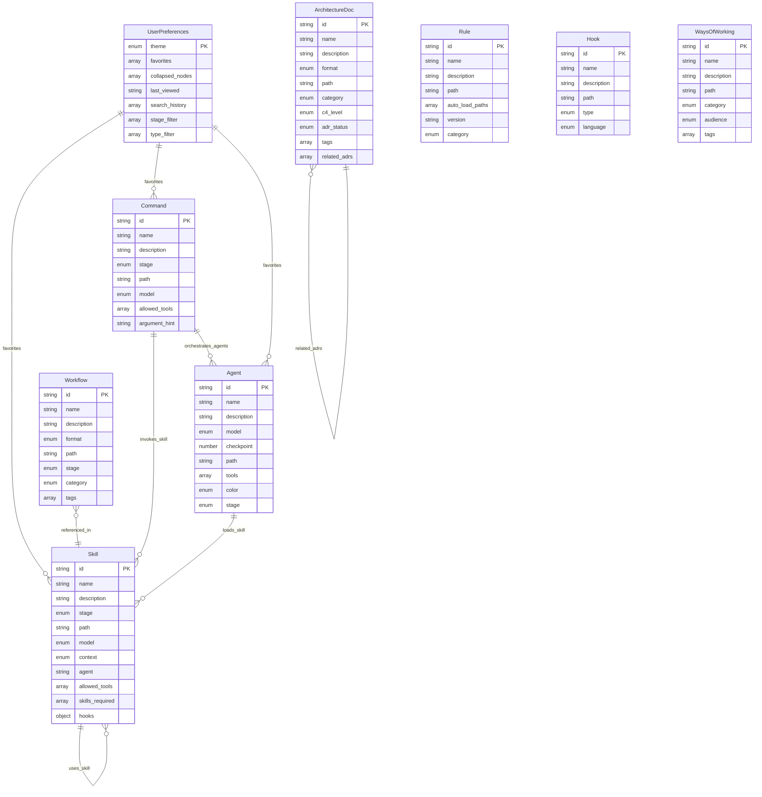

# Data Model: ClaudeManual

---
**System**: ClaudeManual
**Stage**: Prototype
**Checkpoint**: CP-3
**Created**: 2026-01-31
**Session**: session-data-model-claudemanual
**Agent**: prototype-data-model-specifier
**Total Entities**: 9
**Total Relationships**: 8
**Validation Rules**: 27
---

## Overview

| Metric | Value |
|--------|-------|
| **Total Entities** | 9 |
| **Core Entities** | 5 (Skill, Command, Agent, Rule, Hook) |
| **Reference Entities** | 1 (UserPreferences) |
| **Documentation Entities** | 3 (Workflow, WaysOfWorking, ArchitectureDoc) |
| **Total Fields** | 122 (73 core + 35 content sections + 14 derived) |
| **Relationships** | 8 (uses_skill, invokes_skill, loads_skill, orchestrates_agents, favorites) |

---

## Entity Relationship Diagram



---

## Entities

### ENT-001: Skill

**Description**: Reusable AI prompt template for specific tasks, organized in `.claude/skills/{skill-name}/SKILL.md`

**Traces To**: CF-001, CF-008, JTBD-1.2, JTBD-1.3

#### Fields

| Field | Type | Required | Constraints | Description | Traceability |
|-------|------|----------|-------------|-------------|--------------|
| id | string | Yes | Pattern: `^[a-zA-Z0-9_-]+$`, unique | Unique skill identifier | CF-001 |
| name | string | Yes | 2-100 chars | Display name from frontmatter | CF-008 |
| description | string | Yes | 10-500 chars | When to use this skill | CF-008, JTBD-1.2 |
| stage | enum | Yes | Discovery, Prototype, ProductSpecs, SolArch, Implementation, Utility, GRC, Security | Workflow stage | JTBD-1.4 |
| path | string | Yes | Pattern: `^.claude/skills/{id}/SKILL.md$` | Absolute file path | CF-001 |
| model | enum | No | sonnet, opus, haiku | Recommended Claude model | - |
| context | enum | No | fork, null | Execution context (fork = isolated) | - |
| agent | string | No | - | Agent type if skill acts as agent | - |
| allowed_tools | string[] | No | Bash, Edit, Read, Write, Glob, Grep | List of allowed tools | - |
| skills_required | string[] | No | Array of skill IDs | Dependent skills | - |
| hooks | object | No | - | Lifecycle hooks configuration | - |

#### Content Sections

| Section | Required | Description | Traceability |
|---------|----------|-------------|--------------|
| Purpose | Yes | Why this skill exists | CF-008, JTBD-1.2 |
| Usage | Yes | How to invoke | CF-008 |
| Options | No | Parameters and flags | CF-008 |
| Example | Yes | Usage example with syntax | CF-008, JTBD-2.1 |
| Workflow | No | High-level workflow diagram (Mermaid) | CF-008, JTBD-2.1 |
| Related | No | Links to related skills/commands | JTBD-1.8 |

#### TypeScript Interface

```typescript
interface Skill {
  id: string;
  name: string;
  description: string;
  stage: 'Discovery' | 'Prototype' | 'ProductSpecs' | 'SolArch' | 'Implementation' | 'Utility' | 'GRC' | 'Security';
  path: string;
  model?: 'sonnet' | 'opus' | 'haiku';
  context?: 'fork' | null;
  agent?: string;
  allowed_tools?: string[];
  skills_required?: string[];
  hooks?: Record<string, any>;

  // Derived fields
  stage_prefix?: string;
  category?: string;
  file_size?: number;
  last_modified?: Date;
  content_hash?: string;

  // Content sections
  content?: {
    purpose: string;
    usage: string;
    options?: string;
    example: string;
    workflow?: string;
    related?: string;
  };
}

type CreateSkillInput = Omit<Skill, 'file_size' | 'last_modified' | 'content_hash' | 'stage_prefix' | 'category'>;
type UpdateSkillInput = Partial<CreateSkillInput>;
```

#### Validation Schema (Zod)

```typescript
import { z } from 'zod';

export const skillSchema = z.object({
  id: z.string().regex(/^[a-zA-Z0-9_-]+$/, 'Invalid skill ID format'),
  name: z.string().min(2).max(100),
  description: z.string().min(10).max(500),
  stage: z.enum(['Discovery', 'Prototype', 'ProductSpecs', 'SolArch', 'Implementation', 'Utility', 'GRC', 'Security']),
  path: z.string().regex(/^\.claude\/skills\/[^/]+\/SKILL\.md$/, 'Invalid skill path'),
  model: z.enum(['sonnet', 'opus', 'haiku']).optional(),
  context: z.enum(['fork']).nullable().optional(),
  agent: z.string().optional(),
  allowed_tools: z.array(z.string()).optional(),
  skills_required: z.array(z.string()).optional(),
  hooks: z.record(z.any()).optional(),
});

export const createSkillSchema = skillSchema;
export const updateSkillSchema = skillSchema.partial();
```

#### Relationships

| Relation | Target | Type | Description |
|----------|--------|------|-------------|
| uses_skill | Skill | 1:N | Dependencies via `skills_required` |
| invoked_by | Command | N:M | Commands that invoke this skill |
| used_by_agent | Agent | N:M | Agents that load this skill |

#### Validation Rules

| Rule ID | Validation | Error Message |
|---------|------------|---------------|
| VR-SKL-001 | ID must match folder name | "Skill ID mismatch: folder={folder}, frontmatter={id}" |
| VR-SKL-002 | File must exist at path | "Skill file not found at {path}" |
| VR-SKL-003 | Stage must be valid enum | "Invalid stage: {stage}" |
| VR-SKL-004 | Must have Purpose and Usage sections | "Missing required section: {section_name}" |
| VR-SKL-005 | Referenced skills must exist | "Dependent skill not found: {skill_id}" |

---

### ENT-002: Command

**Description**: Slash command executable in Claude Code, defined in `.claude/commands/{command-name}.md`

**Traces To**: CF-001, CF-007, JTBD-1.1, JTBD-1.4

#### Fields

| Field | Type | Required | Constraints | Description | Traceability |
|-------|------|----------|-------------|-------------|--------------|
| id | string | Yes | Pattern: `^[a-z0-9-]+$`, unique | Command name | CF-001, CF-007 |
| name | string | Yes | 2-100 chars | Display name | CF-007 |
| description | string | Yes | 10-500 chars | Short description | JTBD-1.1 |
| stage | enum | Yes | Discovery, Prototype, ProductSpecs, SolArch, Implementation, Utility | Workflow stage | JTBD-1.4 |
| path | string | Yes | Pattern: `^.claude/commands/{id}.md$` | Absolute file path | CF-001 |
| model | enum | No | claude-sonnet-4-5-20250929, claude-haiku-4-5-20250515, sonnet, haiku | Recommended model | - |
| allowed_tools | string[] | No | - | Allowed tools | - |
| argument_hint | string | No | - | Argument hint for command palette | - |

#### TypeScript Interface

```typescript
interface Command {
  id: string;
  name: string;
  description: string;
  stage: 'Discovery' | 'Prototype' | 'ProductSpecs' | 'SolArch' | 'Implementation' | 'Utility';
  path: string;
  model?: string;
  allowed_tools?: string[];
  argument_hint?: string;

  // Derived fields
  invocation_syntax?: string;
  requires_system_name?: boolean;
  has_options?: boolean;

  // Content sections
  content?: {
    usage: string;
    arguments?: string;
    options?: string;
    example: string;
    execution?: string;
    related?: string;
  };
}

type CreateCommandInput = Omit<Command, 'invocation_syntax' | 'requires_system_name' | 'has_options'>;
type UpdateCommandInput = Partial<CreateCommandInput>;
```

#### Validation Schema (Zod)

```typescript
export const commandSchema = z.object({
  id: z.string().regex(/^[a-z0-9-]+$/, 'Invalid command ID format'),
  name: z.string().min(2).max(100),
  description: z.string().min(10).max(500),
  stage: z.enum(['Discovery', 'Prototype', 'ProductSpecs', 'SolArch', 'Implementation', 'Utility']),
  path: z.string().regex(/^\.claude\/commands\/[^/]+\.md$/, 'Invalid command path'),
  model: z.string().optional(),
  allowed_tools: z.array(z.string()).optional(),
  argument_hint: z.string().optional(),
});
```

#### Relationships

| Relation | Target | Type | Description |
|----------|--------|------|-------------|
| invokes_skill | Skill | N:M | Skills invoked by this command |
| orchestrates_agents | Agent | N:M | Agents spawned by this command |

#### Validation Rules

| Rule ID | Validation | Error Message |
|---------|------------|---------------|
| VR-CMD-001 | ID must match filename | "Command ID mismatch: file={filename}, id={id}" |
| VR-CMD-002 | Stage must be valid enum | "Invalid stage: {stage}" |
| VR-CMD-003 | Must have Usage and Example sections | "Missing required section: {section}" |

---

### ENT-003: Agent

**Description**: Specialized AI persona with specific skills and model configuration

**Traces To**: CF-001, CF-008, JTBD-1.2

#### Fields

| Field | Type | Required | Constraints | Description | Traceability |
|-------|------|----------|-------------|-------------|--------------|
| id | string | Yes | Pattern: `^[a-z0-9-]+$`, unique | Agent identifier | CF-001 |
| name | string | Yes | 2-100 chars | Display name | CF-008 |
| description | string | Yes | 10-500 chars | Agent purpose and expertise | JTBD-1.2 |
| model | enum | Yes | sonnet, opus, haiku | Claude model to use | - |
| checkpoint | number | No | 1-20, integer | Associated workflow checkpoint | - |
| path | string | Yes | Pattern: `^.claude/agents/{id}.md$` | Absolute file path | CF-001 |
| tools | string[] | No | - | Allowed tools (including MCP) | - |
| color | enum | No | blue, green, purple, orange, red | Visual color indicator | - |
| stage | enum | Yes | Derived from id prefix | Workflow stage | JTBD-1.4 |

#### TypeScript Interface

```typescript
interface Agent {
  id: string;
  name: string;
  description: string;
  model: 'sonnet' | 'opus' | 'haiku';
  checkpoint?: number;
  path: string;
  tools?: string[];
  color?: 'blue' | 'green' | 'purple' | 'orange' | 'red';
  stage: 'Discovery' | 'Prototype' | 'ProductSpecs' | 'SolArch' | 'Implementation' | 'Utility' | 'GRC' | 'Security';

  // Derived fields
  stage_prefix?: string;
  role?: string;
  subagent_type?: 'general-purpose' | 'Explore' | 'Plan' | 'Bash';

  // Content sections
  content?: {
    expertise: string;
    approach?: string;
    skills_to_load?: string;
    output_format: string;
    related?: string;
  };
}

type CreateAgentInput = Omit<Agent, 'stage_prefix' | 'role' | 'subagent_type'>;
type UpdateAgentInput = Partial<CreateAgentInput>;
```

#### Validation Schema (Zod)

```typescript
export const agentSchema = z.object({
  id: z.string().regex(/^[a-z0-9-]+$/, 'Invalid agent ID format'),
  name: z.string().min(2).max(100),
  description: z.string().min(10).max(500),
  model: z.enum(['sonnet', 'opus', 'haiku']),
  checkpoint: z.number().int().min(1).max(20).optional(),
  path: z.string().regex(/^\.claude\/agents\/[^/]+\.md$/, 'Invalid agent path'),
  tools: z.array(z.string()).optional(),
  color: z.enum(['blue', 'green', 'purple', 'orange', 'red']).optional(),
  stage: z.enum(['Discovery', 'Prototype', 'ProductSpecs', 'SolArch', 'Implementation', 'Utility', 'GRC', 'Security']),
});
```

#### Relationships

| Relation | Target | Type | Description |
|----------|--------|------|-------------|
| loads_skill | Skill | N:M | Skills loaded by agent |
| spawned_by | Command | N:M | Commands that spawn this agent |

#### Validation Rules

| Rule ID | Validation | Error Message |
|---------|------------|---------------|
| VR-AGT-001 | ID must follow {stage}-{role} naming | "Invalid agent ID format: {id}" |
| VR-AGT-002 | Model must be valid enum | "Invalid model: {model}" |
| VR-AGT-003 | Must have Expertise and Output Format sections | "Missing required section: {section}" |

---

### ENT-004: Rule

**Description**: Framework rules and conventions stored in `.claude/rules/{rule-name}.md`

**Traces To**: CF-001, JTBD-1.2

#### Fields

| Field | Type | Required | Constraints | Description |
|-------|------|----------|-------------|-------------|
| id | string | Yes | Pattern: `^[a-zA-Z0-9_-]+$` | Rule identifier |
| name | string | Yes | 2-100 chars | Display name |
| description | string | Yes | 10-500 chars | Rule purpose |
| path | string | Yes | Pattern: `^.claude/rules/{id}.md$` | Absolute file path |
| auto_load_paths | string[] | No | Glob patterns | Path patterns that trigger auto-load |
| version | string | No | Semantic versioning | Rule version |
| category | enum | No | core, stage-specific, quality, process | Rule category |

#### TypeScript Interface

```typescript
interface Rule {
  id: string;
  name: string;
  description: string;
  path: string;
  auto_load_paths?: string[];
  version?: string;
  category?: 'core' | 'stage-specific' | 'quality' | 'process';

  // Derived fields
  applies_to_stages?: string[];

  // Content sections
  content?: {
    overview: string;
    rules: string;
    examples?: string;
    related?: string;
  };
}

type CreateRuleInput = Omit<Rule, 'applies_to_stages'>;
type UpdateRuleInput = Partial<CreateRuleInput>;
```

#### Validation Schema (Zod)

```typescript
export const ruleSchema = z.object({
  id: z.string().regex(/^[a-zA-Z0-9_-]+$/, 'Invalid rule ID format'),
  name: z.string().min(2).max(100),
  description: z.string().min(10).max(500),
  path: z.string().regex(/^\.claude\/rules\/[^/]+\.md$/, 'Invalid rule path'),
  auto_load_paths: z.array(z.string()).optional(),
  version: z.string().regex(/^\d+\.\d+\.\d+$/, 'Invalid version format').optional(),
  category: z.enum(['core', 'stage-specific', 'quality', 'process']).optional(),
});
```

#### Validation Rules

| Rule ID | Validation | Error Message |
|---------|------------|---------------|
| VR-RUL-001 | File must exist | "Rule file not found: {path}" |
| VR-RUL-002 | Auto-load paths must be valid glob patterns | "Invalid glob pattern: {pattern}" |

---

### ENT-005: Hook

**Description**: Lifecycle hooks for commands, skills, and agents

**Traces To**: CF-001, JTBD-1.5

#### Fields

| Field | Type | Required | Constraints | Description |
|-------|------|----------|-------------|-------------|
| id | string | Yes | Pattern: `^[a-z0-9_-]+$` | Hook identifier |
| name | string | Yes | 2-100 chars | Display name |
| description | string | Yes | 10-500 chars | Hook purpose |
| path | string | Yes | Pattern: `^.claude/hooks/{id}.(py|sh)$` | Absolute file path |
| type | enum | Yes | PreToolUse, PostToolUse, Stop, lifecycle | Hook event type |
| language | enum | Yes | python, bash | Script language |

#### TypeScript Interface

```typescript
interface Hook {
  id: string;
  name: string;
  description: string;
  path: string;
  type: 'PreToolUse' | 'PostToolUse' | 'Stop' | 'lifecycle';
  language: 'python' | 'bash';

  // Derived fields
  executable?: boolean;
  has_shebang?: boolean;
}

type CreateHookInput = Omit<Hook, 'executable' | 'has_shebang'>;
type UpdateHookInput = Partial<CreateHookInput>;
```

#### Validation Schema (Zod)

```typescript
export const hookSchema = z.object({
  id: z.string().regex(/^[a-z0-9_-]+$/, 'Invalid hook ID format'),
  name: z.string().min(2).max(100),
  description: z.string().min(10).max(500),
  path: z.string().regex(/^\.claude\/hooks\/[^/]+\.(py|sh)$/, 'Invalid hook path'),
  type: z.enum(['PreToolUse', 'PostToolUse', 'Stop', 'lifecycle']),
  language: z.enum(['python', 'bash']),
});
```

#### Validation Rules

| Rule ID | Validation | Error Message |
|---------|------------|---------------|
| VR-HKS-001 | File must exist and be executable | "Hook not executable: {path}" |
| VR-HKS-002 | Language must match file extension | "Language mismatch: {language} vs {extension}" |

---

### ENT-006: UserPreferences

**Description**: Per-user settings stored in browser localStorage

**Traces To**: CF-003, CF-012, CF-016, JTBD-1.6

#### Fields

| Field | Type | Required | Constraints | Description | Traceability |
|-------|------|----------|-------------|-------------|--------------|
| theme | enum | Yes | light, dark, system | UI theme | CF-016 |
| favorites | string[] | Yes | Array of item IDs | Favorited items | CF-012, JTBD-1.6 |
| collapsed_nodes | string[] | Yes | Array of tree node IDs | Collapsed tree nodes | - |
| last_viewed | string | No | Item ID or null | Last viewed item | - |
| search_history | string[] | Yes | Max 20 items, FIFO | Recent searches | - |
| stage_filter | string[] | Yes | Subset of stage enum | Active stage filters | JTBD-1.4 |
| type_filter | string[] | Yes | Skill, Command, Agent, Rule, Hook | Active type filters | - |

#### TypeScript Interface

```typescript
interface UserPreferences {
  theme: 'light' | 'dark' | 'system';
  favorites: string[];
  collapsed_nodes: string[];
  last_viewed?: string | null;
  search_history: string[];
  stage_filter: string[];
  type_filter: ('Skill' | 'Command' | 'Agent' | 'Rule' | 'Hook' | 'Workflow' | 'WaysOfWorking' | 'ArchitectureDoc')[];
}

type UpdatePreferencesInput = Partial<UserPreferences>;
```

#### Validation Schema (Zod)

```typescript
export const userPreferencesSchema = z.object({
  theme: z.enum(['light', 'dark', 'system']),
  favorites: z.array(z.string()),
  collapsed_nodes: z.array(z.string()),
  last_viewed: z.string().nullable().optional(),
  search_history: z.array(z.string()).max(20),
  stage_filter: z.array(z.string()),
  type_filter: z.array(z.enum(['Skill', 'Command', 'Agent', 'Rule', 'Hook', 'Workflow', 'WaysOfWorking', 'ArchitectureDoc'])),
});
```

#### Validation Rules

| Rule ID | Validation | Error Message |
|---------|------------|---------------|
| VR-USR-001 | Theme must be valid enum | "Invalid theme: {theme}" |
| VR-USR-002 | Referenced items must exist | "Favorite item not found: {id}" |
| VR-USR-003 | Search history max 20 items | "Search history exceeds limit" |

---

### ENT-007: Workflow

**Description**: Process and workflow diagrams in markdown, Mermaid, or PlantUML format

**Traces To**: CF-001, JTBD-1.9, JTBD-1.2

#### Fields

| Field | Type | Required | Constraints | Description |
|-------|------|----------|-------------|-------------|
| id | string | Yes | Pattern: `^[a-z0-9-]+$` | Workflow identifier |
| name | string | Yes | 2-100 chars | Display name |
| description | string | Yes | 10-500 chars | Workflow purpose |
| format | enum | Yes | md, mermaid, plantuml | Diagram format |
| path | string | Yes | Valid file path | Absolute file path |
| stage | enum | No | Discovery, Prototype, etc. | Related workflow stage |
| category | enum | No | process, integration, decision, data-flow | Workflow category |
| tags | string[] | No | - | Searchable tags |

#### TypeScript Interface

```typescript
interface Workflow {
  id: string;
  name: string;
  description: string;
  format: 'md' | 'mermaid' | 'plantuml';
  path: string;
  stage?: 'Discovery' | 'Prototype' | 'ProductSpecs' | 'SolArch' | 'Implementation' | 'Utility';
  category?: 'process' | 'integration' | 'decision' | 'data-flow';
  tags?: string[];

  // Content sections
  content?: {
    overview?: string;
    diagram: string;
    steps?: string;
    related?: string;
  };
}

type CreateWorkflowInput = Omit<Workflow, 'content'>;
type UpdateWorkflowInput = Partial<CreateWorkflowInput>;
```

#### Validation Schema (Zod)

```typescript
export const workflowSchema = z.object({
  id: z.string().regex(/^[a-z0-9-]+$/, 'Invalid workflow ID format'),
  name: z.string().min(2).max(100),
  description: z.string().min(10).max(500),
  format: z.enum(['md', 'mermaid', 'plantuml']),
  path: z.string(),
  stage: z.enum(['Discovery', 'Prototype', 'ProductSpecs', 'SolArch', 'Implementation', 'Utility']).optional(),
  category: z.enum(['process', 'integration', 'decision', 'data-flow']).optional(),
  tags: z.array(z.string()).optional(),
});
```

#### Validation Rules

| Rule ID | Validation | Error Message |
|---------|------------|---------------|
| VR-WFL-001 | File must exist | "Workflow file not found: {path}" |
| VR-WFL-002 | File extension must match format | "Format mismatch: expected {format}, got {extension}" |
| VR-WFL-003 | Must have Diagram section for mermaid/plantuml | "Missing diagram content" |

---

### ENT-008: WaysOfWorking

**Description**: Team practices, guidelines, and process documentation

**Traces To**: CF-001, JTBD-1.9, JTBD-1.1

#### Fields

| Field | Type | Required | Constraints | Description |
|-------|------|----------|-------------|-------------|
| id | string | Yes | Pattern: `^[a-z0-9-]+$` | Unique identifier |
| name | string | Yes | 2-100 chars | Display name |
| description | string | Yes | 10-500 chars | Document purpose |
| path | string | Yes | Valid .md file path | Absolute file path |
| category | enum | No | practices, guidelines, processes, checklists | Document category |
| audience | enum | No | developers, product, all, leads | Target audience |
| tags | string[] | No | - | Searchable tags |

#### TypeScript Interface

```typescript
interface WaysOfWorking {
  id: string;
  name: string;
  description: string;
  path: string;
  category?: 'practices' | 'guidelines' | 'processes' | 'checklists';
  audience?: 'developers' | 'product' | 'all' | 'leads';
  tags?: string[];

  // Content sections
  content?: {
    overview: string;
    guidelines?: string;
    examples?: string;
    checklist?: string;
  };
}

type CreateWaysOfWorkingInput = Omit<WaysOfWorking, 'content'>;
type UpdateWaysOfWorkingInput = Partial<CreateWaysOfWorkingInput>;
```

#### Validation Schema (Zod)

```typescript
export const waysOfWorkingSchema = z.object({
  id: z.string().regex(/^[a-z0-9-]+$/, 'Invalid WaysOfWorking ID format'),
  name: z.string().min(2).max(100),
  description: z.string().min(10).max(500),
  path: z.string().endsWith('.md'),
  category: z.enum(['practices', 'guidelines', 'processes', 'checklists']).optional(),
  audience: z.enum(['developers', 'product', 'all', 'leads']).optional(),
  tags: z.array(z.string()).optional(),
});
```

#### Validation Rules

| Rule ID | Validation | Error Message |
|---------|------------|---------------|
| VR-WOW-001 | File must exist | "Document file not found: {path}" |
| VR-WOW-002 | Must have Overview section | "Missing required Overview section" |

---

### ENT-009: ArchitectureDoc

**Description**: Architecture diagrams and documentation (C4, ADRs, patterns)

**Traces To**: CF-001, JTBD-1.9, JTBD-1.2, JTBD-2.1

#### Fields

| Field | Type | Required | Constraints | Description |
|-------|------|----------|-------------|-------------|
| id | string | Yes | Pattern: `^[a-zA-Z0-9-_]+$` | Unique identifier |
| name | string | Yes | 2-100 chars | Display name |
| description | string | Yes | 10-500 chars | Document purpose |
| format | enum | Yes | md, mermaid, plantuml | Document format |
| path | string | Yes | Valid file path | Absolute file path |
| category | enum | No | c4, adr, patterns, infrastructure, data-model | Architecture category |
| c4_level | enum | No | context, container, component, code | C4 diagram level |
| adr_status | enum | No | proposed, accepted, deprecated, superseded | ADR status |
| tags | string[] | No | - | Searchable tags |
| related_adrs | string[] | No | Array of ADR IDs | Related ADR IDs |

#### TypeScript Interface

```typescript
interface ArchitectureDoc {
  id: string;
  name: string;
  description: string;
  format: 'md' | 'mermaid' | 'plantuml';
  path: string;
  category?: 'c4' | 'adr' | 'patterns' | 'infrastructure' | 'data-model';
  c4_level?: 'context' | 'container' | 'component' | 'code';
  adr_status?: 'proposed' | 'accepted' | 'deprecated' | 'superseded';
  tags?: string[];
  related_adrs?: string[];

  // Content sections
  content?: {
    overview: string;
    diagram?: string;
    context?: string;
    decision?: string;
    consequences?: string;
    related?: string;
  };
}

type CreateArchitectureDocInput = Omit<ArchitectureDoc, 'content'>;
type UpdateArchitectureDocInput = Partial<CreateArchitectureDocInput>;
```

#### Validation Schema (Zod)

```typescript
export const architectureDocSchema = z.object({
  id: z.string().regex(/^[a-zA-Z0-9-_]+$/, 'Invalid ArchitectureDoc ID format'),
  name: z.string().min(2).max(100),
  description: z.string().min(10).max(500),
  format: z.enum(['md', 'mermaid', 'plantuml']),
  path: z.string(),
  category: z.enum(['c4', 'adr', 'patterns', 'infrastructure', 'data-model']).optional(),
  c4_level: z.enum(['context', 'container', 'component', 'code']).optional(),
  adr_status: z.enum(['proposed', 'accepted', 'deprecated', 'superseded']).optional(),
  tags: z.array(z.string()).optional(),
  related_adrs: z.array(z.string()).optional(),
});
```

#### Validation Rules

| Rule ID | Validation | Error Message |
|---------|------------|---------------|
| VR-ARC-001 | File must exist | "Architecture file not found: {path}" |
| VR-ARC-002 | File extension must match format | "Format mismatch: expected {format}, got {extension}" |
| VR-ARC-003 | If category is 'c4', c4_level should be set | "C4 diagrams should specify c4_level" |
| VR-ARC-004 | If category is 'adr', adr_status should be set | "ADRs should specify adr_status" |

---

## API Types

### Request Types

```typescript
// List endpoints
interface ListSkillsRequest {
  stage?: string[];
  search?: string;
  page?: number;
  pageSize?: number;
  favorites?: boolean;
}

interface ListCommandsRequest {
  stage?: string[];
  search?: string;
  page?: number;
  pageSize?: number;
}

interface ListAgentsRequest {
  stage?: string[];
  model?: string[];
  search?: string;
  page?: number;
  pageSize?: number;
}

interface ListWorkflowsRequest {
  stage?: string[];
  category?: string[];
  format?: string[];
  search?: string;
  page?: number;
  pageSize?: number;
}

interface ListArchitectureDocsRequest {
  category?: string[];
  c4_level?: string[];
  adr_status?: string[];
  format?: string[];
  search?: string;
  page?: number;
  pageSize?: number;
}

// Search endpoint
interface SearchRequest {
  query: string;
  types?: ('Skill' | 'Command' | 'Agent' | 'Rule' | 'Hook' | 'Workflow' | 'WaysOfWorking' | 'ArchitectureDoc')[];
  stage?: string[];
  limit?: number;
}

// Preferences endpoints
interface UpdatePreferencesRequest {
  theme?: 'light' | 'dark' | 'system';
  favorites?: string[];
  collapsed_nodes?: string[];
  last_viewed?: string | null;
  stage_filter?: string[];
  type_filter?: string[];
}
```

### Response Types

```typescript
// Paginated response wrapper
interface PaginatedResponse<T> {
  data: T[];
  pagination: {
    page: number;
    pageSize: number;
    totalItems: number;
    totalPages: number;
  };
}

// List responses
type SkillListResponse = PaginatedResponse<Skill>;
type CommandListResponse = PaginatedResponse<Command>;
type AgentListResponse = PaginatedResponse<Agent>;
type WorkflowListResponse = PaginatedResponse<Workflow>;
type ArchitectureDocListResponse = PaginatedResponse<ArchitectureDoc>;

// Detail responses
interface SkillDetailResponse {
  skill: Skill;
  related_skills: Skill[];
  used_by_commands: Command[];
  used_by_agents: Agent[];
}

interface CommandDetailResponse {
  command: Command;
  invoked_skills: Skill[];
  spawned_agents: Agent[];
}

interface AgentDetailResponse {
  agent: Agent;
  loaded_skills: Skill[];
  spawned_by_commands: Command[];
}

// Search response
interface SearchResponse {
  results: Array<{
    id: string;
    type: 'Skill' | 'Command' | 'Agent' | 'Rule' | 'Hook' | 'Workflow' | 'WaysOfWorking' | 'ArchitectureDoc';
    name: string;
    description: string;
    stage?: string;
    score: number;
  }>;
  total: number;
}

// Error response
interface ErrorResponse {
  error: string;
  message: string;
  code: string;
  details?: Record<string, any>;
}
```

### Query Parameters

```typescript
interface BaseQueryParams {
  page?: number;           // Default: 1
  pageSize?: number;       // Default: 20, Max: 100
  search?: string;         // Full-text search
  sortBy?: string;         // Field to sort by
  sortOrder?: 'asc' | 'desc'; // Default: 'asc'
}

interface SkillQueryParams extends BaseQueryParams {
  stage?: string[];
  model?: string[];
  has_example?: boolean;
  favorited?: boolean;
}

interface CommandQueryParams extends BaseQueryParams {
  stage?: string[];
  requires_system_name?: boolean;
  has_options?: boolean;
}

interface AgentQueryParams extends BaseQueryParams {
  stage?: string[];
  model?: string[];
  checkpoint?: number;
}

interface WorkflowQueryParams extends BaseQueryParams {
  stage?: string[];
  category?: string[];
  format?: string[];
  tags?: string[];
}

interface ArchitectureDocQueryParams extends BaseQueryParams {
  category?: string[];
  c4_level?: string[];
  adr_status?: string[];
  format?: string[];
  tags?: string[];
}
```

---

## Mock Data Schemas

```typescript
import { faker } from '@faker-js/faker';

export const mockSkill = (): Skill => ({
  id: faker.helpers.slugify(faker.word.words(2)),
  name: faker.helpers.arrayElement(['Discovery_', 'Prototype_', 'Implementation_']) + faker.word.noun(),
  description: faker.lorem.sentence(),
  stage: faker.helpers.arrayElement(['Discovery', 'Prototype', 'ProductSpecs', 'SolArch', 'Implementation', 'Utility']),
  path: `.claude/skills/${faker.helpers.slugify(faker.word.words(2))}/SKILL.md`,
  model: faker.helpers.arrayElement(['sonnet', 'opus', 'haiku']),
  allowed_tools: faker.helpers.arrayElements(['Bash', 'Edit', 'Read', 'Write', 'Glob', 'Grep']),
  skills_required: [],
});

export const mockCommand = (): Command => ({
  id: faker.helpers.slugify(faker.word.words(2)),
  name: faker.helpers.slugify(faker.word.words(2)),
  description: faker.lorem.sentence(),
  stage: faker.helpers.arrayElement(['Discovery', 'Prototype', 'ProductSpecs', 'SolArch', 'Implementation', 'Utility']),
  path: `.claude/commands/${faker.helpers.slugify(faker.word.words(2))}.md`,
  model: faker.helpers.arrayElement(['sonnet', 'haiku']),
});

export const mockAgent = (): Agent => ({
  id: faker.helpers.slugify(faker.word.words(2)),
  name: faker.person.jobTitle(),
  description: faker.lorem.sentence(),
  model: faker.helpers.arrayElement(['sonnet', 'opus', 'haiku']),
  checkpoint: faker.number.int({ min: 1, max: 20 }),
  path: `.claude/agents/${faker.helpers.slugify(faker.word.words(2))}.md`,
  tools: faker.helpers.arrayElements(['Bash', 'Edit', 'Read', 'Write']),
  color: faker.helpers.arrayElement(['blue', 'green', 'purple', 'orange', 'red']),
  stage: faker.helpers.arrayElement(['Discovery', 'Prototype', 'Implementation']),
});

export const mockUserPreferences = (): UserPreferences => ({
  theme: faker.helpers.arrayElement(['light', 'dark', 'system']),
  favorites: faker.helpers.arrayElements([...Array(20)].map(() => faker.string.uuid())),
  collapsed_nodes: faker.helpers.arrayElements([...Array(10)].map(() => faker.string.uuid())),
  last_viewed: faker.helpers.maybe(() => faker.string.uuid()),
  search_history: faker.helpers.arrayElements([...Array(20)].map(() => faker.word.words(2))),
  stage_filter: faker.helpers.arrayElements(['Discovery', 'Prototype', 'Implementation']),
  type_filter: faker.helpers.arrayElements(['Skill', 'Command', 'Agent']),
});

export const mockWorkflow = (): Workflow => ({
  id: faker.helpers.slugify(faker.word.words(2)),
  name: faker.word.words(3),
  description: faker.lorem.sentence(),
  format: faker.helpers.arrayElement(['md', 'mermaid', 'plantuml']),
  path: `workflows/${faker.helpers.slugify(faker.word.words(2))}.md`,
  stage: faker.helpers.arrayElement(['Discovery', 'Prototype', 'ProductSpecs']),
  category: faker.helpers.arrayElement(['process', 'integration', 'decision', 'data-flow']),
  tags: faker.helpers.arrayElements(['automation', 'manual', 'review']),
});

export const mockArchitectureDoc = (): ArchitectureDoc => ({
  id: faker.helpers.slugify(faker.word.words(2)),
  name: faker.word.words(3),
  description: faker.lorem.sentence(),
  format: faker.helpers.arrayElement(['md', 'mermaid', 'plantuml']),
  path: `architecture/${faker.helpers.slugify(faker.word.words(2))}.md`,
  category: faker.helpers.arrayElement(['c4', 'adr', 'patterns']),
  c4_level: faker.helpers.maybe(() => faker.helpers.arrayElement(['context', 'container', 'component', 'code'])),
  adr_status: faker.helpers.maybe(() => faker.helpers.arrayElement(['proposed', 'accepted', 'deprecated'])),
  tags: faker.helpers.arrayElements(['microservices', 'api', 'database']),
  related_adrs: [],
});
```

---

## Traceability

### Requirements Coverage

| Requirement | Entity/Field | Coverage |
|-------------|--------------|----------|
| REQ-021 | Skill entity, search index | ✅ Complete |
| REQ-022 | Command entity, stage filter | ✅ Complete |
| REQ-023 | Agent entity, relationships | ✅ Complete |
| REQ-024 | UserPreferences.favorites | ✅ Complete |
| REQ-025 | Search index (IDX-001 to IDX-015) | ✅ Complete |
| REQ-026 | Workflow, ArchitectureDoc entities | ✅ Complete |

### JTBD Coverage

| JTBD | Entity/Field | Coverage |
|------|--------------|----------|
| JTBD-1.1 | Skill.description, Command.description | ✅ Complete |
| JTBD-1.2 | All entities with .description | ✅ Complete |
| JTBD-1.3 | Search index (IDX-001 to IDX-015) | ✅ Complete |
| JTBD-1.4 | .stage field on all entities | ✅ Complete |
| JTBD-1.5 | .path field, file system integration | ✅ Complete |
| JTBD-1.6 | UserPreferences.favorites | ✅ Complete |
| JTBD-1.8 | Relationships (uses_skill, invokes_skill) | ✅ Complete |
| JTBD-1.9 | Workflow, ArchitectureDoc entities | ✅ Complete |
| JTBD-2.1 | Content sections (Example, Workflow) | ✅ Complete |

### Data Fields Traceability

| Data Field ID | Traces To |
|---------------|-----------|
| DF-SKL-004 (stage) | JTBD-1.4, PP-1.4, CF-011 |
| DF-SKL-C04 (Example) | JTBD-2.1, PP-1.2, CF-008 |
| DF-USR-002 (favorites) | JTBD-1.6, PP-1.5, CF-012 |
| DF-USR-001 (theme) | PP-1.5, CF-016 |
| DF-SKL-005 (path) | JTBD-1.5, PP-1.6, CF-013 |
| IDX-001 (search) | JTBD-1.3, PP-1.3, CF-009 |

---

**Summary**: 9 entities, 122 total fields (73 core + 35 content sections + 14 derived), 8 relationships, 27 validation rules. Complete TypeScript interfaces, Zod validation schemas, API types, and mock data generators. Full traceability to CF-001 to CF-016, PP-1.1 to PP-1.6, JTBD-1.1 to JTBD-3.2.

**Created**: 2026-01-31 by prototype-data-model-specifier
**Session**: session-data-model-claudemanual
**Checkpoint**: CP-3
