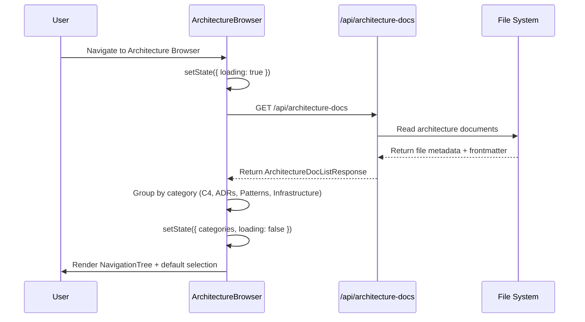
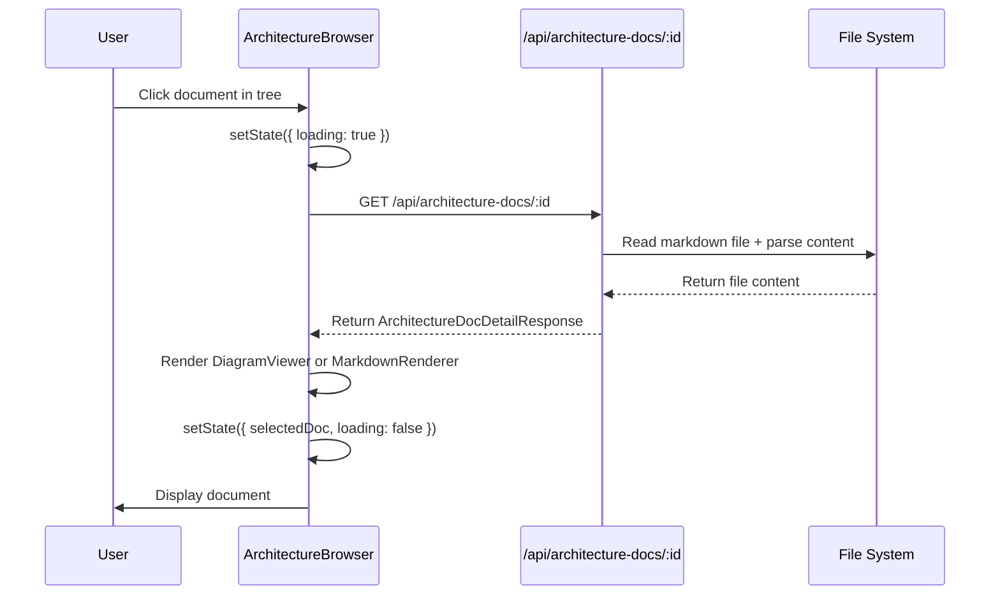

# Data Requirements: Architecture Browser (SCR-010)

---
**Screen**: SCR-010 - Architecture Browser
**Created**: 2026-01-31
**Session**: session-screen-scr010
---

## Data Entities

### ArchitectureDoc (ENT-009)

**Source**: Data Model (`00-foundation/data-model/DATA_MODEL.md`)

```typescript
interface ArchitectureDoc {
  id: string;                    // Unique identifier (e.g., "context-diagram", "ADR-001")
  name: string;                  // Display name (e.g., "Context Diagram - ClaudeManual")
  description: string;           // Document purpose (10-500 chars)
  format: 'md' | 'mermaid' | 'plantuml';  // Document format
  path: string;                  // Absolute file path
  category?: 'c4' | 'adr' | 'patterns' | 'infrastructure' | 'data-model';
  c4_level?: 'context' | 'container' | 'component' | 'code';
  adr_status?: 'proposed' | 'accepted' | 'deprecated' | 'superseded';
  tags?: string[];               // Searchable tags
  related_adrs?: string[];       // Related ADR IDs
  content?: {
    overview: string;
    diagram?: string;
    context?: string;
    decision?: string;
    consequences?: string;
    related?: string;
  };
}
```

---

## API Endpoints

### 1. List Architecture Documents

**Endpoint**: `GET /api/architecture-docs`

**Description**: Fetch all architecture documents with optional filtering

**Request Query Parameters**:
```typescript
interface ListArchitectureDocsRequest {
  category?: string[];           // Filter by category (c4, adr, patterns, infrastructure)
  c4_level?: string[];           // Filter by C4 level (context, container, component, code)
  adr_status?: string[];         // Filter by ADR status (proposed, accepted, deprecated, superseded)
  format?: string[];             // Filter by format (md, mermaid, plantuml)
  search?: string;               // Full-text search
  page?: number;                 // Default: 1
  pageSize?: number;             // Default: 20, Max: 100
}
```

**Response**:
```typescript
interface ArchitectureDocListResponse {
  data: ArchitectureDoc[];
  pagination: {
    page: number;
    pageSize: number;
    totalItems: number;
    totalPages: number;
  };
}
```

**Example Request**:
```bash
GET /api/architecture-docs?category=c4&category=adr&page=1&pageSize=50
```

**Example Response**:
```json
{
  "data": [
    {
      "id": "context-diagram",
      "name": "Context Diagram - ClaudeManual",
      "description": "Shows ClaudeManual system in context with external actors",
      "format": "mermaid",
      "path": "architecture/c4/context-diagram.md",
      "category": "c4",
      "c4_level": "context",
      "tags": ["c4", "system-context"],
      "related_adrs": ["ADR-001"]
    },
    {
      "id": "ADR-001",
      "name": "Architecture Style",
      "description": "Decision on using component-based architecture",
      "format": "md",
      "path": "architecture/adrs/ADR-001-architecture-style.md",
      "category": "adr",
      "adr_status": "accepted",
      "tags": ["architecture", "design"],
      "related_adrs": []
    }
  ],
  "pagination": {
    "page": 1,
    "pageSize": 50,
    "totalItems": 27,
    "totalPages": 1
  }
}
```

---

### 2. Get Architecture Document by ID

**Endpoint**: `GET /api/architecture-docs/:id`

**Description**: Fetch full document details including content sections

**Request Parameters**:
- `id` (path parameter): Document identifier

**Response**:
```typescript
interface ArchitectureDocDetailResponse {
  doc: ArchitectureDoc;
  related_docs: ArchitectureDoc[];  // Related ADRs or diagrams
}
```

**Example Request**:
```bash
GET /api/architecture-docs/context-diagram
```

**Example Response**:
```json
{
  "doc": {
    "id": "context-diagram",
    "name": "Context Diagram - ClaudeManual",
    "description": "Shows ClaudeManual system in context with external actors",
    "format": "mermaid",
    "path": "architecture/c4/context-diagram.md",
    "category": "c4",
    "c4_level": "context",
    "tags": ["c4", "system-context"],
    "related_adrs": ["ADR-001"],
    "content": {
      "overview": "This C4 Context diagram shows...",
      "diagram": "graph TD\n  A[Framework User] --> B[ClaudeManual System]\n  B --> C[File System]",
      "related": "[Container Diagram](container-diagram), [ADR-001](ADR-001)"
    }
  },
  "related_docs": [
    {
      "id": "ADR-001",
      "name": "Architecture Style",
      "description": "Decision on using component-based architecture",
      "format": "md",
      "path": "architecture/adrs/ADR-001-architecture-style.md",
      "category": "adr",
      "adr_status": "accepted"
    }
  ]
}
```

---

## Data Flow

### Page Load Flow



### Document Selection Flow



---

## Local State Management

```typescript
interface ArchitectureBrowserState {
  // Categories grouped by type
  categories: {
    c4: ArchitectureDoc[];
    adrs: ArchitectureDoc[];
    patterns: ArchitectureDoc[];
    infrastructure: ArchitectureDoc[];
  };

  // Current selection
  selectedDoc: ArchitectureDoc | null;

  // UI state
  loading: boolean;
  error: string | null;
  zoomLevel: number;                // For DiagramViewer
  expandedCategories: string[];     // Collapsed/expanded tree nodes

  // Filter state (if filtering is added in Phase 2)
  filters: {
    c4_level?: string[];
    adr_status?: string[];
    format?: string[];
  };
}
```

---

## Data Transformations

### 1. Grouping Documents by Category

```typescript
function groupByCategory(docs: ArchitectureDoc[]): {
  c4: ArchitectureDoc[];
  adrs: ArchitectureDoc[];
  patterns: ArchitectureDoc[];
  infrastructure: ArchitectureDoc[];
} {
  return {
    c4: docs.filter(d => d.category === 'c4'),
    adrs: docs.filter(d => d.category === 'adr'),
    patterns: docs.filter(d => d.category === 'patterns'),
    infrastructure: docs.filter(d => d.category === 'infrastructure'),
  };
}
```

### 2. Badge Generation

```typescript
function getDocumentBadges(doc: ArchitectureDoc): Array<{ label: string; color: string }> {
  const badges = [];

  if (doc.category === 'c4' && doc.c4_level) {
    badges.push({
      label: doc.c4_level.toUpperCase(),
      color: 'blue',
    });
  }

  if (doc.category === 'adr' && doc.adr_status) {
    badges.push({
      label: doc.adr_status.toUpperCase(),
      color: doc.adr_status === 'accepted' ? 'green' :
             doc.adr_status === 'deprecated' ? 'red' : 'orange',
    });
  }

  badges.push({
    label: doc.format.toUpperCase(),
    color: 'gray',
  });

  return badges;
}
```

### 3. Related Document Links

```typescript
function formatRelatedLinks(doc: ArchitectureDoc, allDocs: ArchitectureDoc[]): Array<{ id: string; name: string }> {
  if (!doc.related_adrs || doc.related_adrs.length === 0) {
    return [];
  }

  return doc.related_adrs
    .map(adrId => allDocs.find(d => d.id === adrId))
    .filter((d): d is ArchitectureDoc => d !== undefined)
    .map(d => ({ id: d.id, name: d.name }));
}
```

---

## Validation Rules

### Client-Side Validation

```typescript
import { z } from 'zod';

const architectureDocSchema = z.object({
  id: z.string().regex(/^[a-zA-Z0-9-_]+$/, 'Invalid document ID format'),
  name: z.string().min(2).max(100),
  description: z.string().min(10).max(500),
  format: z.enum(['md', 'mermaid', 'plantuml']),
  path: z.string(),
  category: z.enum(['c4', 'adr', 'patterns', 'infrastructure', 'data-model']).optional(),
  c4_level: z.enum(['context', 'container', 'component', 'code']).optional(),
  adr_status: z.enum(['proposed', 'accepted', 'deprecated', 'superseded']).optional(),
  tags: z.array(z.string()).optional(),
  related_adrs: z.array(z.string()).optional(),
});

// Validation Rule: If category is 'c4', c4_level should be set
function validateC4Document(doc: ArchitectureDoc): boolean {
  if (doc.category === 'c4' && !doc.c4_level) {
    console.warn('C4 diagrams should specify c4_level');
    return false;
  }
  return true;
}

// Validation Rule: If category is 'adr', adr_status should be set
function validateADRDocument(doc: ArchitectureDoc): boolean {
  if (doc.category === 'adr' && !doc.adr_status) {
    console.warn('ADRs should specify adr_status');
    return false;
  }
  return true;
}
```

---

## Mock Data (Development)

```typescript
import { faker } from '@faker-js/faker';

export const mockArchitectureDocs = (): ArchitectureDoc[] => [
  {
    id: 'context-diagram',
    name: 'Context Diagram - ClaudeManual',
    description: 'Shows ClaudeManual system in context with external actors',
    format: 'mermaid',
    path: 'architecture/c4/context-diagram.md',
    category: 'c4',
    c4_level: 'context',
    tags: ['c4', 'system-context'],
    related_adrs: ['ADR-001'],
  },
  {
    id: 'container-diagram',
    name: 'Container Diagram - ClaudeManual',
    description: 'Shows high-level containers (web app, API, file system)',
    format: 'mermaid',
    path: 'architecture/c4/container-diagram.md',
    category: 'c4',
    c4_level: 'container',
    tags: ['c4', 'containers'],
    related_adrs: ['ADR-001', 'ADR-002'],
  },
  {
    id: 'ADR-001',
    name: 'Architecture Style',
    description: 'Decision on using component-based architecture with React',
    format: 'md',
    path: 'architecture/adrs/ADR-001-architecture-style.md',
    category: 'adr',
    adr_status: 'accepted',
    tags: ['architecture', 'design'],
    related_adrs: [],
  },
  {
    id: 'ADR-002',
    name: 'Data Storage Strategy',
    description: 'Decision on using file system as primary data source',
    format: 'md',
    path: 'architecture/adrs/ADR-002-data-storage.md',
    category: 'adr',
    adr_status: 'accepted',
    tags: ['data', 'storage'],
    related_adrs: ['ADR-001'],
  },
  {
    id: 'repository-pattern',
    name: 'Repository Pattern',
    description: 'Data access pattern for file system operations',
    format: 'md',
    path: 'architecture/patterns/repository-pattern.md',
    category: 'patterns',
    tags: ['patterns', 'data-access'],
    related_adrs: ['ADR-002'],
  },
];
```

---

## Traceability

| Data Requirement | Traces To |
|------------------|-----------|
| ArchitectureDoc entity | ENT-009, DATA_MODEL.md |
| API endpoints | API Contract Spec (Phase 4) |
| Category grouping | JTBD-1.7 (Navigate hierarchies visually) |
| C4 level badges | JTBD-1.9 (Visualize Architecture) |
| ADR status badges | JTBD-2.1 (Confidence in decision context) |
| Related ADRs links | JTBD-1.8 (Compare components) |

---

**Created**: 2026-01-31
**Session**: session-screen-scr010
**Agent**: prototype-screen-specifier
