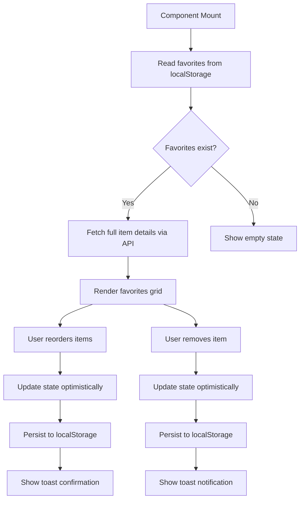
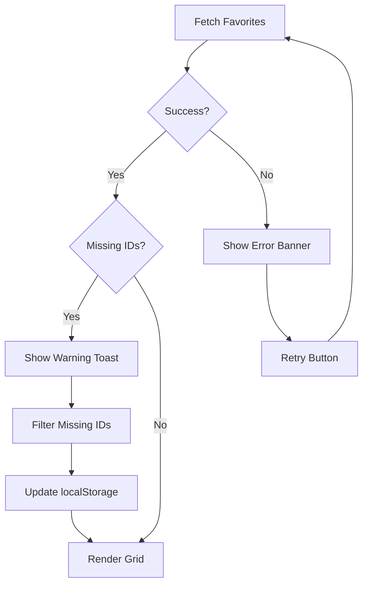

# Data Requirements: Favorites Page (SCR-004)

**Screen ID**: SCR-004
**Created**: 2026-01-31
**Agent**: prototype-screen-specifier
**Session**: session-screen-scr004

---

## Data Flow Overview



---

## Data Sources

### 1. localStorage (Primary Source)

**Key**: `user-preferences`

**Schema**:
```typescript
interface UserPreferences {
  theme: 'light' | 'dark' | 'system';
  favorites: string[];  // Array of item IDs (skill/command/agent)
  collapsed_nodes: string[];
  last_viewed: string | null;
  search_history: string[];
  stage_filter: string[];
  type_filter: string[];
}
```

**Example**:
```json
{
  "theme": "dark",
  "favorites": [
    "Discovery_JTBD",
    "htec-sdd-implement",
    "quality-security-auditor",
    "Prototype_DesignSystem",
    "discovery-multiagent"
  ],
  "collapsed_nodes": ["Skills", "Commands"],
  "last_viewed": "Discovery_JTBD",
  "search_history": ["TDD", "GDPR", "persona"],
  "stage_filter": ["Discovery", "Implementation"],
  "type_filter": ["Skill", "Command"]
}
```

**Access**:
```typescript
const preferences = JSON.parse(localStorage.getItem('user-preferences') || '{}');
const favoriteIds = preferences.favorites || [];
```

---

### 2. API: GET /api/favorites (Derived from Multiple Entities)

**Endpoint**: `GET /api/favorites?ids={comma-separated IDs}`

**Purpose**: Fetch full details for favorited items (skills, commands, agents)

**Query Parameters**:
| Parameter | Type | Required | Description |
|-----------|------|----------|-------------|
| ids | string | Yes | Comma-separated list of item IDs (e.g., "Discovery_JTBD,htec-sdd-implement") |

**Response**:
```typescript
interface FavoritesResponse {
  items: (Skill | Command | Agent)[];
  missing_ids: string[];  // IDs not found (e.g., deleted skills)
}
```

**Example Request**:
```bash
GET /api/favorites?ids=Discovery_JTBD,htec-sdd-implement,quality-security-auditor
```

**Example Response**:
```json
{
  "items": [
    {
      "id": "Discovery_JTBD",
      "type": "Skill",
      "name": "Discovery_JTBD",
      "description": "Extracts Jobs To Be Done from pain points and client facts",
      "stage": "Discovery",
      "path": ".claude/skills/Discovery_JTBD/SKILL.md"
    },
    {
      "id": "htec-sdd-implement",
      "type": "Command",
      "name": "htec-sdd-implement",
      "description": "TDD implementation workflow with quality gates",
      "stage": "Implementation",
      "path": ".claude/commands/htec-sdd-implement.md"
    },
    {
      "id": "quality-security-auditor",
      "type": "Agent",
      "name": "Security Auditor",
      "description": "OWASP vulnerability scanning and security best practices",
      "stage": "Quality",
      "path": ".claude/agents/quality/security-auditor.md",
      "model": "sonnet"
    }
  ],
  "missing_ids": []
}
```

---

## Data Entities

### ENT-001: Skill (from DATA_MODEL.md)

| Field | Type | Used In Component | Display |
|-------|------|-------------------|---------|
| id | string | ComponentCard key | Hidden |
| name | string | Card title | "Discovery_JTBD" |
| description | string | Card preview | "Extracts Jobs To Be..." (truncated) |
| stage | enum | Badge | "Discovery" (blue badge) |
| path | string | Copy Path button | ".claude/skills/..." |
| model | enum | Card metadata | "sonnet" (optional) |

### ENT-002: Command (from DATA_MODEL.md)

| Field | Type | Used In Component | Display |
|-------|------|-------------------|---------|
| id | string | ComponentCard key | Hidden |
| name | string | Card title | "/htec-sdd-implement" |
| description | string | Card preview | "TDD implementation..." (truncated) |
| stage | enum | Badge | "Implementation" (purple badge) |
| path | string | Copy Path button | ".claude/commands/..." |

### ENT-003: Agent (from DATA_MODEL.md)

| Field | Type | Used In Component | Display |
|-------|------|-------------------|---------|
| id | string | ComponentCard key | Hidden |
| name | string | Card title | "Security Auditor" |
| description | string | Card preview | "OWASP vulnerability..." (truncated) |
| stage | enum | Badge | "Quality" (orange badge) |
| path | string | Copy Path button | ".claude/agents/..." |
| model | enum | Card metadata | "sonnet" |
| color | enum | Visual indicator | "red" (border accent) |

---

## State Management

### Component State

```typescript
interface FavoritesPageState {
  // Data
  favorites: (Skill | Command | Agent)[];
  favoriteIds: string[];  // IDs in current order

  // UI state
  isLoading: boolean;
  error: string | null;
  isReordering: boolean;
  isDragging: boolean;
  draggedItemId: string | null;

  // Temporary state (for optimistic updates)
  pendingRemovalId: string | null;
  pendingReorder: string[] | null;
}
```

### State Updates

| Action | State Change | Side Effect |
|--------|--------------|-------------|
| Mount | `isLoading = true` | Fetch favorites from API |
| Fetch success | `favorites = data.items`, `isLoading = false` | - |
| Fetch failure | `error = message`, `isLoading = false` | Show error banner |
| Drag start | `isDragging = true`, `draggedItemId = id` | Show drag preview |
| Drop | `favoriteIds = newOrder`, `isDragging = false` | Persist to localStorage, show toast |
| Remove | `pendingRemovalId = id` | Optimistic UI update, persist to localStorage |
| Remove success | `favorites = favorites.filter(...)`, `pendingRemovalId = null` | Show toast |

---

## Data Transformations

### 1. localStorage → API Request

```typescript
// Read from localStorage
const preferences = JSON.parse(localStorage.getItem('user-preferences') || '{}');
const favoriteIds: string[] = preferences.favorites || [];

// Transform to API query
const query = `ids=${favoriteIds.join(',')}`;
const response = await fetch(`/api/favorites?${query}`);
```

### 2. API Response → Component State

```typescript
interface FavoritesResponse {
  items: (Skill | Command | Agent)[];
  missing_ids: string[];
}

// Transform to component state
const favorites = response.items;

// Preserve original order from localStorage
const orderedFavorites = favoriteIds
  .map(id => favorites.find(item => item.id === id))
  .filter(Boolean);  // Remove missing items
```

### 3. Drag-Drop Event → New Order

```typescript
interface DragDropEvent {
  draggedId: string;
  targetId: string;
}

// Transform to new order
const newOrder = [...favoriteIds];
const draggedIndex = newOrder.indexOf(draggedId);
const targetIndex = newOrder.indexOf(targetId);

newOrder.splice(draggedIndex, 1);  // Remove from old position
newOrder.splice(targetIndex, 0, draggedId);  // Insert at new position

// Persist
const preferences = JSON.parse(localStorage.getItem('user-preferences') || '{}');
preferences.favorites = newOrder;
localStorage.setItem('user-preferences', JSON.stringify(preferences));
```

---

## Data Validation

### localStorage Validation

| Rule | Validation | Error Handling |
|------|------------|----------------|
| VR-FAV-001 | `favorites` must be string[] | Default to `[]` if invalid |
| VR-FAV-002 | Each ID must match pattern `^[a-zA-Z0-9_-]+$` | Filter out invalid IDs |
| VR-FAV-003 | Max 100 favorites | Truncate to 100 if exceeded |

### API Response Validation

| Rule | Validation | Error Handling |
|------|------------|----------------|
| VR-FAV-004 | `items` must be array | Show error: "Invalid response format" |
| VR-FAV-005 | Each item must have `id`, `type`, `name`, `description`, `stage`, `path` | Filter out incomplete items |
| VR-FAV-006 | `missing_ids` must be array | Default to `[]` if missing |

### Zod Validation Schema

```typescript
import { z } from 'zod';

export const favoritesResponseSchema = z.object({
  items: z.array(
    z.union([
      z.object({
        id: z.string(),
        type: z.literal('Skill'),
        name: z.string(),
        description: z.string(),
        stage: z.enum(['Discovery', 'Prototype', 'ProductSpecs', 'SolArch', 'Implementation', 'Utility', 'GRC', 'Security']),
        path: z.string(),
        model: z.enum(['sonnet', 'opus', 'haiku']).optional(),
      }),
      z.object({
        id: z.string(),
        type: z.literal('Command'),
        name: z.string(),
        description: z.string(),
        stage: z.enum(['Discovery', 'Prototype', 'ProductSpecs', 'SolArch', 'Implementation', 'Utility']),
        path: z.string(),
      }),
      z.object({
        id: z.string(),
        type: z.literal('Agent'),
        name: z.string(),
        description: z.string(),
        stage: z.enum(['Discovery', 'Prototype', 'ProductSpecs', 'SolArch', 'Implementation', 'Utility', 'GRC', 'Security']),
        path: z.string(),
        model: z.enum(['sonnet', 'opus', 'haiku']),
        color: z.enum(['blue', 'green', 'purple', 'orange', 'red']).optional(),
      }),
    ])
  ),
  missing_ids: z.array(z.string()),
});
```

---

## Error Handling

### Error Scenarios

| Error | Cause | User Experience | Recovery |
|-------|-------|-----------------|----------|
| Load failure | API down, network error | ErrorBanner: "Failed to load favorites. Try again." + Retry button | Click Retry refetches data |
| Partial load | Some IDs missing (deleted items) | Show warning badge: "Some favorites no longer exist" | Remove missing IDs from localStorage |
| localStorage quota | Browser storage full (unlikely for favorites) | Toast: "Favorites storage full. Remove old items." | User removes items manually |
| Invalid data | Corrupted localStorage JSON | Auto-reset favorites to `[]`, show toast: "Favorites reset due to error" | User re-adds favorites |

### Error Recovery Flow



---

## Performance Considerations

### Data Fetching

| Optimization | Implementation | Benefit |
|--------------|----------------|---------|
| Batch API call | Single `/api/favorites?ids=...` request | 1 network call vs. N calls (N = favorites count) |
| Cache API response | React Query with 5-minute stale time | Avoid refetch on unmount/remount |
| Prefetch on hover | Prefetch item details when hovering "View" button | Instant navigation (JTBD-2.1) |

### localStorage Operations

| Optimization | Implementation | Benefit |
|--------------|----------------|---------|
| Debounced writes | Wait 500ms after drop before saving | Prevent excessive writes during rapid reordering |
| Write batching | Batch multiple updates (reorder + remove) | Reduce localStorage I/O |
| JSON stringify once | Store stringified JSON in variable, write once | Faster writes |

### Rendering Optimization

| Optimization | Implementation | Benefit |
|--------------|----------------|---------|
| Virtual scrolling | Use `react-window` if >50 favorites | Render only visible cards, support 100+ favorites |
| Memoized cards | `React.memo(ComponentCard)` | Prevent unnecessary re-renders |
| Lazy load images | Load card metadata on viewport intersection | Faster initial render |

---

## Data Dependencies

### Required Before Render

| Data | Source | Fallback |
|------|--------|----------|
| favoriteIds | localStorage → `user-preferences.favorites` | `[]` (empty array) |
| favorites | API → `/api/favorites?ids=...` | `[]` (show empty state) |

### Optional Data

| Data | Source | Fallback |
|------|--------|----------|
| Item metadata (model, color) | API response | Use default values |
| Missing IDs | API response → `missing_ids` | `[]` (assume all valid) |

---

## Traceability

### Data Fields Mapped

| Data Field ID | Field Name | Used In |
|---------------|------------|---------|
| DF-USR-002 | favorites | localStorage read/write |
| DF-SKL-001 | id | ComponentCard key, drag-drop logic |
| DF-SKL-002 | name | Card title |
| DF-SKL-003 | description | Card preview text |
| DF-SKL-004 | stage | Badge color/text |
| DF-SKL-005 | path | Copy Path button |
| DF-CMD-001 to DF-CMD-005 | (same as Skill) | Command cards |
| DF-AGT-001 to DF-AGT-006 | (same as Skill + model, color) | Agent cards |

### Requirements Coverage

| Requirement ID | Description | Data Support |
|----------------|-------------|--------------|
| REQ-024 | Favorites persistence | localStorage `favorites` array |
| REQ-007 | Drag-drop reordering | `favoriteIds` state + localStorage sync |
| REQ-015 | Keyboard shortcut access | No data impact (UI-only) |

### JTBD Coverage

| JTBD | Data Support |
|------|--------------|
| JTBD-1.6 (Bookmark tools) | `favorites` array stores bookmarked IDs |
| JTBD-1.2 (Component context) | Full item details fetched via API for preview |

---

*Created: 2026-01-31 | Agent: prototype-screen-specifier | Session: session-screen-scr004*
