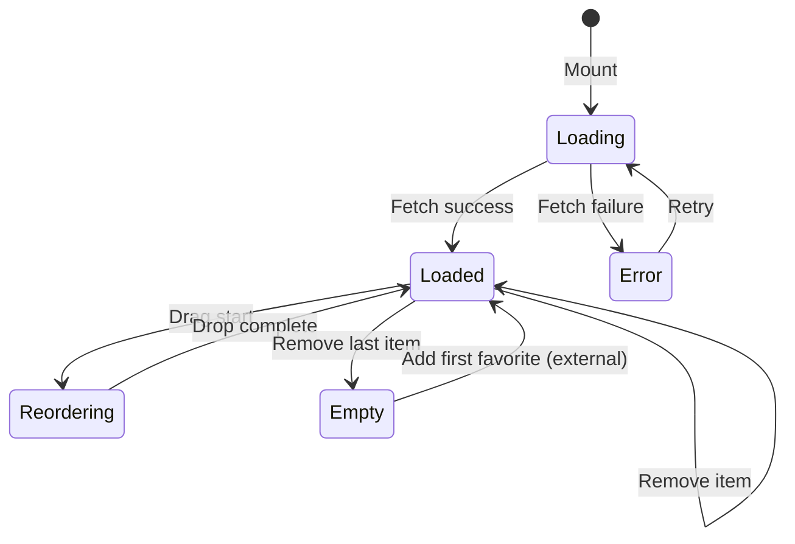
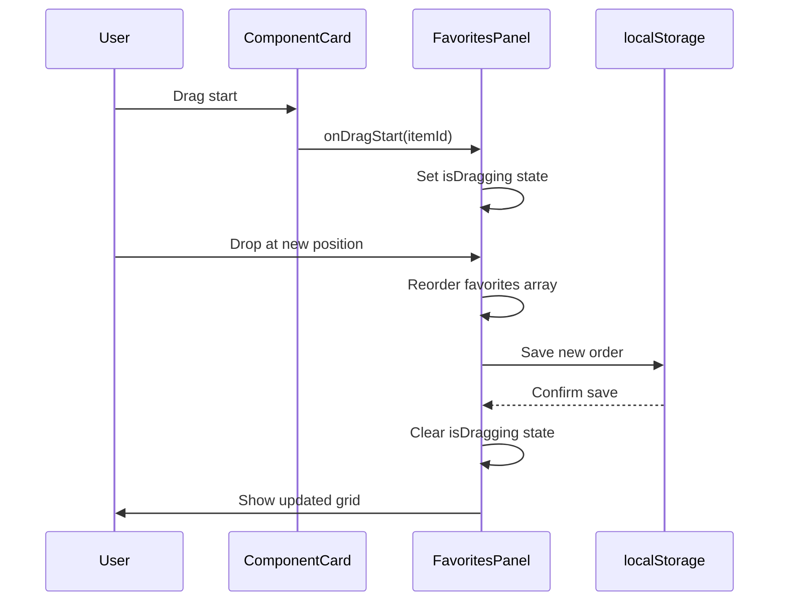

# Favorites Page (SCR-004)

**Screen ID**: SCR-004
**Discovery ID**: S-4
**Screen Name**: Favorites Page
**Application**: Web
**Priority**: P1 (Phase 2)
**Primary Persona**: PER-003 (Developers), PER-001 (Framework Creators)
**Status**: Specified

---

## Overview

The Favorites Page provides quick access to bookmarked frequently-used tools (skills, commands, agents). Users can curate a personalized collection and reorder items via drag-and-drop for optimal workflow efficiency. This addresses PP-1.5 (Lack of Personalization) and enables JTBD-1.6 (Bookmark tools for quick access).

**Key Features**:
- Grid layout of favorited items with metadata preview
- Drag-and-drop reordering with localStorage persistence
- Quick actions: View details, Copy path, Remove from favorites
- Empty state with clear onboarding message
- Keyboard shortcut: `Cmd+B` to open favorites

---

## Layout

### Wireframe (ASCII)

```
┌──────────────────────────────────────────────────────────────────────────────┐
│ Header (Same as SCR-001)                                                     │
│ ┌───────────┐ ┌────────────────────────┐ ┌──────┐ ┌────────┐ ┌─────────┐   │
│ │ Logo      │ │ Search Bar             │ │Theme │ │ Stage  │ │Favorites│   │
│ └───────────┘ └────────────────────────┘ └──────┘ └────────┘ └─────────┘   │
├──────────────────────────────────────────────────────────────────────────────┤
│                                                                              │
│ [← Back to Explorer]                                                         │
│                                                                              │
│ My Favorites (5 items)                                           [Clear All] │
│                                                                              │
│ ┌─────────────────────────┐ ┌─────────────────────────┐ ┌────────────────┐ │
│ │ ⭐ Discovery_JTBD        │ │ ⭐ /htec-sdd-implement   │ │ ⭐ quality-    │ │
│ │ [Skill] [Discovery]     │ │ [Command] [Implement]   │ │ security-auditor│ │
│ │                         │ │                         │ │ [Agent] [Quality]│ │
│ │ Extracts Jobs To Be...  │ │ TDD implementation...   │ │ Security checks...│ │
│ │                         │ │                         │ │                │ │
│ │ [View] [Copy Path] [×]  │ │ [View] [Copy Path] [×]  │ │ [View] [×]     │ │
│ └─────────────────────────┘ └─────────────────────────┘ └────────────────┘ │
│                                                                              │
│ ┌─────────────────────────┐ ┌─────────────────────────┐                     │
│ │ ⭐ Prototype_DesignSystem│ │ ⭐ /discovery-multiagent │                     │
│ │ [Skill] [Prototype]     │ │ [Command] [Discovery]   │                     │
│ │                         │ │                         │                     │
│ │ Generates design tokens │ │ Multi-agent discovery   │                     │
│ │                         │ │ 60% faster...           │                     │
│ │ [View] [Copy Path] [×]  │ │ [View] [Copy Path] [×]  │                     │
│ └─────────────────────────┘ └─────────────────────────┘                     │
│                                                                              │
│ Drag to reorder favorites                                                   │
│                                                                              │
└──────────────────────────────────────────────────────────────────────────────┘
```

### Grid Structure

| Region | Columns (Desktop) | Columns (Tablet) | Columns (Mobile) |
|--------|-------------------|------------------|------------------|
| Header | 12 | 12 | 12 |
| Back Button | 12 | 12 | 12 |
| Page Title + Clear All | 12 | 12 | 12 |
| Favorites Grid | 3 (4 cols each) | 2 (6 cols each) | 1 (12 cols) |
| Footer Hint | 12 | 12 | 12 |

---

## Components Used

### Aggregate Components (from Prototype_ClaudeManual/01-components/)

| Component ID | Component Name | Instance | Props |
|--------------|----------------|----------|-------|
| COMP-AGG-005 | FavoritesPanel | Main grid | `favorites={favorites}`, `onRemove={handleRemove}`, `onReorder={handleReorder}` |
| COMP-AGG-004 | ComponentCard | Per favorite item | `item={favorite}`, `variant="compact"`, `showFavoriteToggle={true}` |

### Library Components (Adobe Spectrum React)

| Library Component | Used In | Purpose |
|-------------------|---------|---------|
| GridList | FavoritesPanel | Drag-drop grid layout with ARIA support |
| Card | ComponentCard | Card container for favorite items |
| Button | ComponentCard, Header | View, Copy Path, Remove, Back, Clear All buttons |
| Badge | ComponentCard | Type badge (Skill/Command/Agent), Stage badge (Discovery/Prototype/etc.) |
| IllustratedMessage | FavoritesPanel | Empty state illustration |
| Heading | Page title | "My Favorites (N items)" |
| Text | ComponentCard, Footer | Description preview, footer hint text |
| Link | Back button | Navigation link to SCR-001 |
| Tooltip | Button icons | Hover tooltips for icon-only buttons |

---

## Data Requirements

### Page Load Data

| Field | Source | Type | Required | Description |
|-------|--------|------|----------|-------------|
| favorites | localStorage | string[] | Yes | Array of favorited item IDs |
| items | GET /api/favorites?ids={favorites} | (Skill \| Command \| Agent)[] | Yes | Full item details for favorited IDs |

### Data Fetching Logic

```typescript
// On component mount
const favoritesIds = localStorage.getItem('favorites')
  ? JSON.parse(localStorage.getItem('favorites'))
  : [];

// Fetch full item details
const items = await fetch(`/api/favorites?ids=${favoritesIds.join(',')}`);
```

### User Input Data

| Field | Component | Validation | Description |
|-------|-----------|------------|-------------|
| reorderedFavorites | FavoritesPanel | Array of IDs | New order after drag-drop |
| removedItemId | ComponentCard | Must exist in favorites | ID of removed favorite |

---

## State Management

### Local State

```typescript
interface FavoritesPageState {
  favorites: (Skill | Command | Agent)[];
  isLoading: boolean;
  error: string | null;
  isReordering: boolean;
}

// Initial state
const initialState: FavoritesPageState = {
  favorites: [],
  isLoading: true,
  error: null,
  isReordering: false,
};
```

### Global State Dependencies

| Store | Slice | Usage |
|-------|-------|-------|
| preferences | favorites | Read favorite IDs from localStorage wrapper |
| preferences | updateFavorites | Update favorites order/removal |

### State Transitions



---

## Navigation

### Entry Points

| From | Trigger | Params | Traceability |
|------|---------|--------|--------------|
| Main Explorer (SCR-001) | Click "Favorites" icon in header | - | JTBD-1.6 |
| Main Explorer (SCR-001) | Keyboard shortcut `Cmd+B` | - | PP-1.5 |
| Search Results (SCR-002) | After adding item to favorites | `?added={itemId}` | JTBD-1.6 |

### Exit Points

| To | Trigger | Data Passed | Traceability |
|----|---------|-------------|--------------|
| Main Explorer (SCR-001) | Click "Back to Explorer" | `?selected={itemId}` (if View clicked) | JTBD-1.2 |
| Main Explorer (SCR-001) | Click "View" on card | `?selected={itemId}` | JTBD-1.2 |
| Clipboard | Click "Copy Path" | File path string | PP-1.6 |

---

## Interactions

### User Actions

| Action | Component | Handler | Result | Traceability |
|--------|-----------|---------|--------|--------------|
| Drag card | FavoritesPanel | onDragStart | Show drag preview, update state | JTBD-1.6 |
| Drop card | FavoritesPanel | onDrop | Reorder favorites, persist to localStorage | JTBD-1.6 |
| Click "View" | ComponentCard | onView | Navigate to SCR-001 with item selected | JTBD-1.2 |
| Click "Copy Path" | ComponentCard | onCopyPath | Copy file path to clipboard, show toast | PP-1.6 |
| Click "×" (Remove) | ComponentCard | onRemove | Remove from favorites, update localStorage | JTBD-1.6 |
| Click "Clear All" | Header | onClearAll | Show confirmation dialog, remove all favorites | JTBD-1.6 |
| Click "Back" | Header | onBack | Navigate to SCR-001 | - |

### Drag-and-Drop Flow



### Keyboard Shortcuts

| Key | Action | Traceability |
|-----|--------|--------------|
| `Cmd+B` | Open Favorites page | JTBD-1.6 |
| `Esc` | Close confirmation dialog (if open) | - |
| `Tab` | Navigate between cards | Accessibility |
| `Enter` | Activate focused button (View/Copy/Remove) | Accessibility |

---

## Responsive Behavior

| Breakpoint | Layout Changes | Traceability |
|------------|----------------|--------------|
| Desktop (>1024px) | 3-column grid, cards show full description | - |
| Tablet (768-1024px) | 2-column grid, cards show truncated description | - |
| Mobile (<768px) | 1-column grid, cards show full width, drag handles larger | JTBD-3.1 |

---

## Accessibility

### WCAG 2.1 AA Compliance

| Requirement | Implementation | Traceability |
|-------------|----------------|--------------|
| Page Title | `<title>Favorites - ClaudeManual</title>` | WCAG 2.4.2 |
| Landmarks | `<header>`, `<main role="main">`, `<footer>` | WCAG 1.3.1 |
| Skip Link | "Skip to favorites grid" link | WCAG 2.4.1 |
| Focus Management | Focus first card on load, visible focus indicators | WCAG 2.4.7 |
| Announcements | "Item removed from favorites", "Favorites reordered" (ARIA live region) | WCAG 4.1.3 |
| Keyboard Navigation | All actions accessible via keyboard | WCAG 2.1.1 |
| Color Contrast | Badge text 4.5:1, button text 4.5:1 | WCAG 1.4.3 |

### ARIA Attributes

```tsx
<main role="main" aria-label="Favorites page">
  <h1 id="page-title">My Favorites (5 items)</h1>

  <GridList
    aria-labelledby="page-title"
    aria-describedby="drag-hint"
    // GridList provides ARIA drag-drop support
  >
    <Card aria-label="Discovery_JTBD skill">
      <Button aria-label="View Discovery_JTBD details">View</Button>
      <Button aria-label="Copy file path">Copy Path</Button>
      <Button aria-label="Remove from favorites">×</Button>
    </Card>
  </GridList>

  <p id="drag-hint" className="sr-only">
    Drag cards to reorder favorites. Changes save automatically.
  </p>

  <div role="status" aria-live="polite" aria-atomic="true">
    {/* Toast notifications appear here */}
  </div>
</main>
```

---

## Error States

| State | Display | Recovery | Traceability |
|-------|---------|----------|--------------|
| Load Error | ErrorBanner: "Failed to load favorites. Try again." + Retry button | Retry button refetches data | - |
| Empty State | IllustratedMessage: "No favorites yet. Click ⭐ on any component to add it here." | Link to SCR-001 | JTBD-1.6 |
| Partial Error | Toast notification: "Failed to remove item. Try again." | User can retry remove action | - |
| Network Error | ErrorBanner: "You're offline. Favorites may be outdated." | Auto-retry when online | - |

### Empty State Design

```tsx
<IllustratedMessage>
  <Heading>No favorites yet</Heading>
  <Text>
    Click the ⭐ icon on any skill, command, or agent to bookmark it for quick access.
  </Text>
  <Link href="/explorer">Browse framework components</Link>
</IllustratedMessage>
```

---

## Performance Optimization

| Optimization | Implementation | Benefit |
|--------------|----------------|---------|
| Lazy load images | Load card metadata on viewport intersection | Faster initial render for 20+ favorites |
| Debounced reorder | Wait 500ms after drop before localStorage save | Prevent excessive writes during rapid reordering |
| Optimistic UI | Update UI immediately, sync to localStorage async | Instant user feedback (JTBD-2.1) |
| Virtual scrolling | Render only visible cards if >50 favorites | Support power users with large collections |

---

## UX Psychology Summary

| Principle | Application | User Benefit | Traceability |
|-----------|-------------|--------------|--------------|
| **Personalization** | User-controlled bookmarks and ordering | Reduces repeated search effort from 5+ searches/week to 0 | JTBD-1.6 |
| **Low-stakes Actions** | Easy add/remove, confirmation for destructive "Clear All" | Users feel confident customizing without fear of data loss | JTBD-2.2 |
| **Visual Cues** | Drag handles (6-dot icon on hover), ⭐ icons | Clear affordances for interaction, discoverable reordering | PP-1.2 |
| **Instant Feedback** | Optimistic UI updates, toast notifications | Builds confidence in tool responsiveness | JTBD-2.1 |
| **Progressive Disclosure** | Preview cards → Full details on "View" click | Users control information depth | JTBD-1.2 |

---

## Acceptance Criteria

### Functional Requirements

- [ ] Favorites persist to localStorage across sessions
- [ ] Grid layout: 3 columns on desktop (>1024px), 2 on tablet (768-1024px), 1 on mobile (<768px)
- [ ] Drag-and-drop reordering works with mouse and touch
- [ ] Reorder animations: smooth 200ms transitions
- [ ] Remove button removes item with toast notification: "Removed from favorites"
- [ ] "Clear All" button shows confirmation modal before deleting all
- [ ] Empty state shows IllustratedMessage with helpful text and link to SCR-001
- [ ] Clicking card "View" button navigates to SCR-001 with item selected
- [ ] Keyboard shortcut `Cmd+B` opens favorites page from any screen
- [ ] Page title updates with item count: "My Favorites (5 items)"

### Non-Functional Requirements

- [ ] Page load time < 1 second for 50 favorites
- [ ] Drag-drop latency < 100ms (feels instant)
- [ ] localStorage save < 200ms after drop
- [ ] Supports up to 100 favorites without performance degradation
- [ ] WCAG 2.1 AA compliant (keyboard nav, focus indicators, ARIA labels)
- [ ] Responsive layout tested on 320px width screens

---

## Traceability

### Pain Points Addressed

| Pain Point | How This Screen Addresses It |
|------------|------------------------------|
| PP-1.5 (Lack of Personalization) | User-curated favorites with drag-drop customization |
| PP-1.6 (Developer Friction) | One-click "Copy Path" on favorited items |

### Jobs To Be Done (JTBD)

| JTBD | Coverage |
|------|----------|
| JTBD-1.6 (Bookmark tools for quick access) | 100% - Core purpose of this screen |
| JTBD-1.2 (Understand component context) | "View" button navigates to full details |
| JTBD-2.1 (Gain confidence through examples) | Preview cards show metadata before clicking |
| JTBD-2.2 (Explore autonomously) | Users self-serve via bookmarks without asking developers |

### Client Facts

| Client Fact | Implementation |
|-------------|----------------|
| CF-012 (Favorites feature requested) | Favorites page with localStorage persistence |
| CF-013 (File path references) | "Copy Path" button on every card |
| CF-016 (Light/dark theme) | Respects global theme preference |

### Requirements

| Requirement ID | Coverage |
|----------------|----------|
| REQ-024 | UserPreferences.favorites field stores favorited item IDs |
| REQ-007 | Drag-drop reordering with visual feedback |
| REQ-015 | Keyboard shortcut `Cmd+B` to access favorites |

### Design System

| Token | Usage |
|-------|-------|
| color.stage.{stage}.light/dark | Stage badge colors (Discovery=blue, Prototype=green) |
| spacing.4 | Card padding (16px) |
| spacing.6 | Grid gap (24px) |
| shadow.md | Card elevation |
| motion.duration.normal | Reorder animation (200ms) |
| typography.fontFamily.mono | Terminal-inspired card text (CF-014) |

---

## Related Screens

| Screen | Relationship |
|--------|--------------|
| SCR-001 (Main Explorer) | Entry point via header "Favorites" icon |
| SCR-002 (Search Results) | Can add items to favorites from search |
| SCR-006 (Component Detail Modal) | "View" button opens detail modal |

---

## Future Enhancements (Phase 3+)

| Enhancement | Description | Priority |
|-------------|-------------|----------|
| Favorites export | Export favorites list as JSON for sharing with team | P2 |
| Favorites import | Import someone else's favorites JSON | P2 |
| Favorites folders | Organize favorites into folders (e.g., "Daily Tools", "Discovery", "Testing") | P2 |
| Favorites search | Search within favorites (useful for 50+ items) | P2 |
| Favorites notes | Add personal notes to favorited items | P3 |

---

*Traceability: S-4 (Discovery), PP-1.5, PP-1.6, JTBD-1.6, JTBD-1.2, CF-012, CF-013, REQ-024*

*Components: COMP-AGG-005 (FavoritesPanel), COMP-AGG-004 (ComponentCard), GridList, Card, Button, Badge, IllustratedMessage*

*Created: 2026-01-31 | Agent: prototype-screen-specifier | Session: session-screen-scr004*
