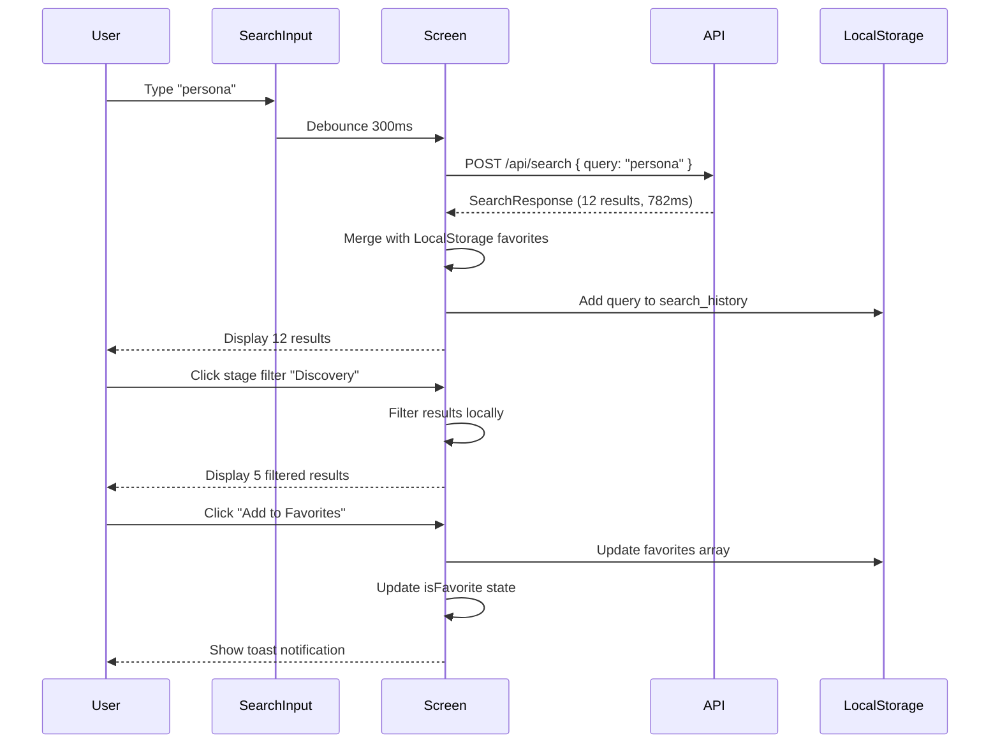

# Data Requirements: Search Results Page (SCR-002)

**Screen**: SCR-002 - Search Results Page
**Date**: 2026-01-31
**Session**: session-screen-scr002

---

## Data Sources

### API Endpoints

| Endpoint | Method | Purpose | Response Time |
|----------|--------|---------|---------------|
| `/api/search` | POST | Full-text search across framework components | <2 seconds |
| `/api/search/suggestions` | GET | Autocomplete suggestions for search query | <500ms |

### LocalStorage

| Key | Type | Purpose |
|-----|------|---------|
| `userPreferences` | JSON | User theme, favorites, filters |
| `searchHistory` | JSON | Recent search queries (max 20) |
| `favorites` | JSON | Array of favorited item IDs |

---

## API Request Schemas

### POST /api/search

**Request Body**:

```typescript
interface SearchRequest {
  query: string;                    // Search query (min 2 chars)
  types?: string[];                 // Filter by type: Skill, Command, Agent, Rule, Hook, Workflow, etc.
  stages?: string[];                // Filter by stage: Discovery, Prototype, etc.
  sortBy?: 'relevance' | 'alphabetical' | 'recent'; // Sort order
  page?: number;                    // Pagination page (default: 1)
  pageSize?: number;                // Results per page (default: 20, max: 100)
}
```

**Example**:

```json
{
  "query": "persona",
  "types": ["Skill", "Agent"],
  "stages": ["Discovery"],
  "sortBy": "relevance",
  "page": 1,
  "pageSize": 20
}
```

**Response**:

```typescript
interface SearchResponse {
  results: SearchResult[];
  pagination: {
    page: number;
    pageSize: number;
    totalResults: number;
    totalPages: number;
    hasMore: boolean;
  };
  performanceMetrics: {
    executionTime: number;          // In milliseconds
    indexedItems: number;           // Total items in search index
  };
}

interface SearchResult {
  id: string;                       // Unique item ID
  type: 'Skill' | 'Command' | 'Agent' | 'Rule' | 'Hook' | 'Workflow' | 'WaysOfWorking' | 'ArchitectureDoc';
  name: string;                     // Display name
  description: string;              // One-sentence summary
  stage?: string;                   // Discovery, Prototype, etc.
  path: string;                     // Absolute file path
  score: number;                    // Relevance score (0-1)
  highlights?: {                    // Matched text highlights
    name?: string;
    description?: string;
  };
}
```

**Example Response**:

```json
{
  "results": [
    {
      "id": "Discovery_GeneratePersona",
      "type": "Skill",
      "name": "Discovery_GeneratePersona",
      "description": "Generates rich persona documents from interview transcripts...",
      "stage": "Discovery",
      "path": ".claude/skills/Discovery_GeneratePersona/SKILL.md",
      "score": 0.95,
      "highlights": {
        "name": "Discovery_Generate<mark>Persona</mark>",
        "description": "Generates rich <mark>persona</mark> documents..."
      }
    },
    {
      "id": "discovery-persona-synthesizer",
      "type": "Agent",
      "name": "discovery-persona-synthesizer",
      "description": "Multi-agent coordinator for persona synthesis from pain points...",
      "stage": "Discovery",
      "path": ".claude/agents/discovery/persona-synthesizer.md",
      "score": 0.88
    }
  ],
  "pagination": {
    "page": 1,
    "pageSize": 20,
    "totalResults": 12,
    "totalPages": 1,
    "hasMore": false
  },
  "performanceMetrics": {
    "executionTime": 782,
    "indexedItems": 115
  }
}
```

---

## GET /api/search/suggestions

**Query Params**:

```typescript
interface SuggestionsRequest {
  query: string;                    // Partial query (min 2 chars)
  limit?: number;                   // Max suggestions (default: 5)
}
```

**Example**: `/api/search/suggestions?query=pers&limit=5`

**Response**:

```typescript
interface SuggestionsResponse {
  suggestions: string[];            // Array of suggested queries
}
```

**Example Response**:

```json
{
  "suggestions": [
    "persona",
    "personal preferences",
    "personalization"
  ]
}
```

---

## LocalStorage Schemas

### userPreferences

```typescript
interface UserPreferences {
  theme: 'light' | 'dark' | 'system';
  favorites: string[];              // Array of item IDs
  collapsed_nodes: string[];        // Collapsed tree nodes
  last_viewed: string | null;       // Last viewed item ID
  search_history: string[];         // Recent searches (FIFO, max 20)
  stage_filter: string[];           // Active stage filters
  type_filter: string[];            // Active type filters
}
```

**Example**:

```json
{
  "theme": "dark",
  "favorites": ["Discovery_GeneratePersona", "test-automation-engineer"],
  "collapsed_nodes": ["Skills-Discovery", "Commands"],
  "last_viewed": "Discovery_JTBD",
  "search_history": ["persona", "GDPR", "TDD", "implementation"],
  "stage_filter": ["Discovery", "Implementation"],
  "type_filter": ["Skill", "Agent"]
}
```

---

## Data Bindings

### SearchResultCard

| Prop | Data Source | Field Path |
|------|-------------|------------|
| `id` | SearchResult | `result.id` |
| `name` | SearchResult | `result.name` |
| `description` | SearchResult | `result.description` |
| `type` | SearchResult | `result.type` |
| `stage` | SearchResult | `result.stage` |
| `path` | SearchResult | `result.path` |
| `isFavorite` | LocalStorage | `userPreferences.favorites.includes(result.id)` |
| `highlights` | SearchResult | `result.highlights` |

### StageFilterDropdown

| Prop | Data Source | Field Path |
|------|-------------|------------|
| `selectedStages` | LocalState | `filters.stages` |
| `onChange` | Handler | `setFilters({ ...filters, stages: newStages })` |
| `availableStages` | Static | `['Discovery', 'Prototype', 'ProductSpecs', 'SolArch', 'Implementation', 'Utility']` |

### TypeFilter

| Prop | Data Source | Field Path |
|------|-------------|------------|
| `selectedTypes` | LocalState | `filters.types` |
| `onChange` | Handler | `setFilters({ ...filters, types: newTypes })` |
| `availableTypes` | Static | `['Skill', 'Command', 'Agent', 'Rule', 'Hook', 'Workflow', 'WaysOfWorking', 'ArchitectureDoc']` |

### Performance Indicator

| Display | Data Source | Field Path |
|---------|-------------|------------|
| Result count | SearchResponse | `pagination.totalResults` |
| Execution time | SearchResponse | `performanceMetrics.executionTime / 1000` (convert to seconds) |
| Color | Computed | `executionTime < 1000 ? 'green' : executionTime < 2000 ? 'yellow' : 'red'` |

---

## Data Flow Diagram



---

## Data Validation

### Client-Side Validation

| Field | Rule | Error Message |
|-------|------|---------------|
| `query` | Min 2 characters | "Search query must be at least 2 characters" |
| `query` | Max 100 characters | "Search query too long" |
| `page` | Must be >= 1 | "Invalid page number" |
| `pageSize` | Must be 1-100 | "Page size must be between 1 and 100" |

### Server-Side Validation

| Field | Rule | Error Message |
|-------|------|---------------|
| `query` | Required | "Search query is required" |
| `types` | Must be valid enum values | "Invalid type: {value}" |
| `stages` | Must be valid enum values | "Invalid stage: {value}" |
| `sortBy` | Must be 'relevance', 'alphabetical', or 'recent' | "Invalid sort option" |

---

## Error Handling

### API Errors

| HTTP Code | Error Type | Display Message | Recovery |
|-----------|------------|-----------------|----------|
| 400 | Bad Request | "Invalid search query" | Show validation error |
| 500 | Server Error | "Search temporarily unavailable. Try browsing by category instead." | Link to SCR-001 |
| 503 | Service Unavailable | "Search service is down. Try again later." | Retry button |
| Timeout | Network Timeout | "Search timed out. Check your connection." | Retry button |

### Client-Side Errors

| Error | Trigger | Display Message | Recovery |
|-------|---------|-----------------|----------|
| Empty query | User submits blank search | "Type to search skills, commands, agents, or rules..." | Placeholder text |
| No results | API returns 0 results | "No results for '{query}'. Try different keywords or browse by stage." | Suggestions, link to SCR-003 |
| LocalStorage unavailable | Browser blocks localStorage | "Preferences cannot be saved. Enable cookies." | Continue without saving |

---

## Performance Requirements

| Metric | Target | Measurement |
|--------|--------|-------------|
| Search execution time | <2 seconds | API response time (JTBD-1.3) |
| Autocomplete suggestions | <500ms | API response time |
| Result rendering | <200ms | Time to first render after API response |
| Filter application | Instant (<50ms) | Client-side filtering |
| Pagination load | <1 second | API response time |

---

## Data Caching Strategy

| Data | Cache Duration | Invalidation |
|------|----------------|--------------|
| Search results | None | Every search is fresh |
| Autocomplete suggestions | 5 minutes | Time-based |
| User preferences | Persistent | Manual update |
| Search history | Persistent | Manual clear |
| Favorites | Persistent | Manual update |

---

## Traceability

### Data Fields to Requirements

| Data Field | Requirement | Traceability |
|------------|-------------|--------------|
| `query` | REQ-025 (Search functionality) | JTBD-1.3 |
| `types`, `stages` | REQ-022 (Filtering) | JTBD-1.4 |
| `score` | REQ-025 (Relevance ranking) | F-007 |
| `favorites` | REQ-024 (Favorites system) | JTBD-1.6 |
| `executionTime` | JTBD-1.3 (2-second threshold) | Performance metric |

### Data Model Entities

| Data | Data Model Entity | Field Path |
|------|-------------------|------------|
| Search results | Skill, Command, Agent, Rule, Hook, Workflow, WaysOfWorking, ArchitectureDoc | All entities |
| User preferences | UserPreferences | `theme`, `favorites`, `search_history`, `stage_filter`, `type_filter` |
| Performance metrics | N/A (computed) | Derived from API response |

---

**Summary**: 2 API endpoints, 1 LocalStorage schema, 12 data bindings, 4 validation rules, 6 error states. All data sources trace to REQ-025 (Search), REQ-024 (Favorites), JTBD-1.3 (Find tools quickly), JTBD-1.4 (Stage filtering).
