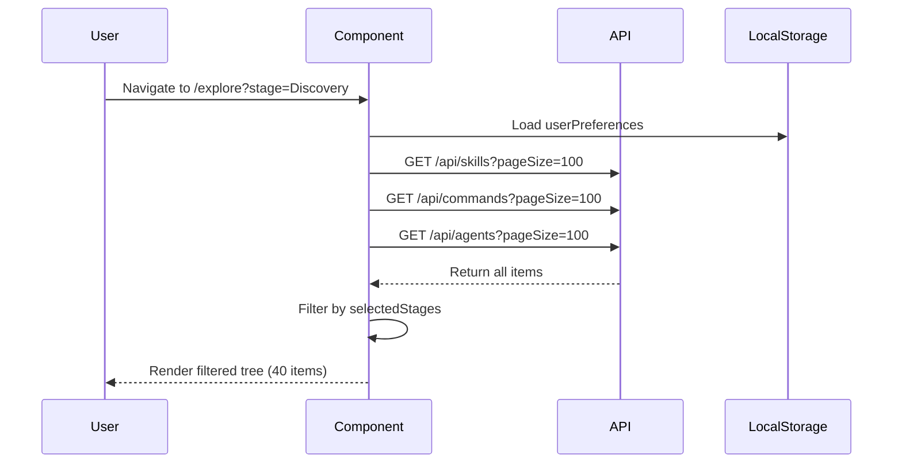
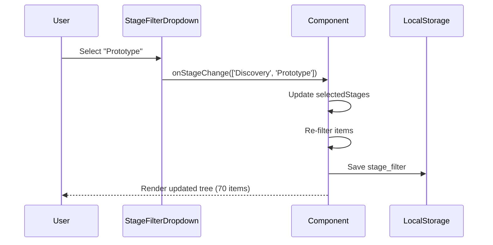

# Data Requirements: Stage-Filtered View (SCR-003)

**Screen**: Stage-Filtered View
**Screen ID**: SCR-003
**Discovery ID**: S-3.0
**Created**: 2026-01-31

---

## Data Sources

### API Endpoints

| Endpoint | Method | Purpose | Response Type |
|----------|--------|---------|---------------|
| `/api/skills` | GET | Fetch all skills | `SkillListResponse` |
| `/api/commands` | GET | Fetch all commands | `CommandListResponse` |
| `/api/agents` | GET | Fetch all agents | `AgentListResponse` |
| `/api/rules` | GET | Fetch all rules | `RuleListResponse` |
| `/api/hooks` | GET | Fetch all hooks | `HookListResponse` |

### Query Parameters

```typescript
interface ListQueryParams {
  stage?: string[];          // Filter by stages (e.g., ['Discovery', 'Prototype'])
  search?: string;           // Full-text search (optional, not used in initial load)
  page?: number;             // Pagination (default: 1)
  pageSize?: number;         // Items per page (default: 100, load all for filtering)
}
```

### Example API Call

```typescript
// Fetch all items for client-side filtering
const response = await Promise.all([
  fetch('/api/skills?pageSize=100'),
  fetch('/api/commands?pageSize=100'),
  fetch('/api/agents?pageSize=100'),
  fetch('/api/rules?pageSize=100'),
  fetch('/api/hooks?pageSize=100'),
]);

const [skills, commands, agents, rules, hooks] = await Promise.all(
  response.map(r => r.json())
);

const allItems = [
  ...skills.data,
  ...commands.data,
  ...agents.data,
  ...rules.data,
  ...hooks.data,
];
```

---

## Data Model Entities

### ENT-001: Skill

**Fields Used**:
- `id` - Unique identifier
- `name` - Display name
- `description` - Short description
- `stage` - Workflow stage (Discovery, Prototype, etc.)
- `path` - File path for "Copy Path" feature
- `model` - Recommended Claude model
- `content.purpose` - Purpose section for detail pane
- `content.example` - Usage example

**Filter Logic**:
```typescript
const filteredSkills = skills.filter(skill =>
  selectedStages.includes(skill.stage)
);
```

### ENT-002: Command

**Fields Used**:
- `id` - Unique identifier
- `name` - Display name
- `description` - Short description
- `stage` - Workflow stage
- `path` - File path
- `argument_hint` - Command syntax hint
- `content.usage` - Usage section

**Filter Logic**:
```typescript
const filteredCommands = commands.filter(command =>
  selectedStages.includes(command.stage)
);
```

### ENT-003: Agent

**Fields Used**:
- `id` - Unique identifier
- `name` - Display name
- `description` - Agent purpose
- `stage` - Derived from id prefix (e.g., "discovery-domain-researcher" → "Discovery")
- `path` - File path
- `model` - Claude model
- `content.expertise` - Expertise section

**Filter Logic**:
```typescript
const filteredAgents = agents.filter(agent =>
  selectedStages.includes(agent.stage)
);
```

### ENT-006: UserPreferences

**Fields Used**:
- `stage_filter` - Array of selected stages (persisted to localStorage)
- `collapsed_nodes` - Tree node expansion state
- `last_viewed` - Last selected item ID

**Persistence**:
```typescript
// Load from localStorage on mount
const savedPreferences = JSON.parse(
  localStorage.getItem('userPreferences') || '{}'
);
const initialStages = savedPreferences.stage_filter || ['Discovery'];

// Save on stage filter change
useEffect(() => {
  const preferences = {
    ...savedPreferences,
    stage_filter: selectedStages,
  };
  localStorage.setItem('userPreferences', JSON.stringify(preferences));
}, [selectedStages]);
```

---

## State Schema

### Local Component State

```typescript
interface StageFilteredViewState {
  // Raw data
  allItems: Array<Skill | Command | Agent | Rule | Hook>;

  // Filter state
  selectedStages: string[];

  // Derived data
  filteredItems: Array<Skill | Command | Agent | Rule | Hook>;
  filteredSkills: Skill[];
  filteredCommands: Command[];
  filteredAgents: Agent[];
  filteredRules: Rule[];
  filteredHooks: Hook[];

  // UI state
  selectedItem: Skill | Command | Agent | Rule | Hook | null;
  loading: boolean;
  error: string | null;

  // Counts
  totalCount: number;
  filteredCount: number;
  skillCount: number;
  commandCount: number;
  agentCount: number;
  ruleCount: number;
  hookCount: number;
}
```

### Derived Data Computation

```typescript
// useMemo for performance
const filteredItems = useMemo(() => {
  if (selectedStages.length === 0) return allItems;

  return allItems.filter(item =>
    selectedStages.includes(item.stage)
  );
}, [allItems, selectedStages]);

const filteredSkills = useMemo(() =>
  filteredItems.filter(item => 'skills_required' in item) as Skill[],
  [filteredItems]
);

const filteredCommands = useMemo(() =>
  filteredItems.filter(item => 'argument_hint' in item) as Command[],
  [filteredItems]
);

const filteredAgents = useMemo(() =>
  filteredItems.filter(item => 'checkpoint' in item) as Agent[],
  [filteredItems]
);
```

---

## Data Bindings

### Header Section

| UI Element | Data Field | Format |
|------------|------------|--------|
| Stage Filter Dropdown | `selectedStages` | Comma-separated (e.g., "Discovery, Prototype") |

### Filter Indicator Section

| UI Element | Data Field | Format |
|------------|------------|--------|
| Active Filter Text | `selectedStages.join(', ')` | "Discovery" or "Discovery, Prototype" |
| Item Count Badge | `filteredCount` of `totalCount` | "Showing 40 of 115 items" |

### Navigation Tree Section

| UI Element | Data Field | Format |
|------------|------------|--------|
| Skills Category | `filteredSkills` | Array, count badge shows `filteredSkills.length` |
| Commands Category | `filteredCommands` | Array, count badge shows `filteredCommands.length` |
| Agents Category | `filteredAgents` | Array, count badge shows `filteredAgents.length` |
| Rules Category | `filteredRules` | Array, count badge shows `filteredRules.length` |
| Hooks Category | `filteredHooks` | Array, count badge shows `filteredHooks.length` |

### Detail Pane Section

| UI Element | Data Field | Format |
|------------|------------|--------|
| Title | `selectedItem.name` | String |
| Stage Badge | `selectedItem.stage` | Enum, color-coded |
| Path | `selectedItem.path` | Absolute path, click to copy |
| Purpose Section | `selectedItem.content.purpose` | Markdown |
| Example Section | `selectedItem.content.example` | Markdown with syntax highlighting |
| Workflow Context | Conditional, only if skill/command has workflow metadata | Markdown |

---

## Data Validation Rules

| Validation | Rule | Error Handling |
|------------|------|----------------|
| Non-empty stages | `selectedStages.length > 0` | Show warning if user clears all stages |
| Valid stage enum | `selectedStages.every(s => VALID_STAGES.includes(s))` | Filter out invalid stages, log warning |
| Item exists | Selected item must exist in `filteredItems` | Fallback to first item if selection invalid |

### Valid Stage Enum

```typescript
const VALID_STAGES = [
  'Discovery',
  'Prototype',
  'ProductSpecs',
  'SolArch',
  'Implementation',
  'Utility',
  'Security',
  'GRC',
] as const;
```

---

## Performance Optimization

### Memoization

```typescript
// Prevent re-filtering on every render
const filteredItems = useMemo(() => {
  return allItems.filter(item =>
    selectedStages.includes(item.stage)
  );
}, [allItems, selectedStages]);

// Prevent re-counting on every render
const counts = useMemo(() => ({
  total: allItems.length,
  filtered: filteredItems.length,
  skills: filteredSkills.length,
  commands: filteredCommands.length,
  agents: filteredAgents.length,
}), [allItems, filteredItems, filteredSkills, filteredCommands, filteredAgents]);
```

### Virtualization

For large lists (100+ items), use `react-window` for tree virtualization:

```typescript
import { FixedSizeList } from 'react-window';

<FixedSizeList
  height={600}
  itemCount={filteredItems.length}
  itemSize={35}
  width="100%"
>
  {({ index, style }) => (
    <TreeItem
      item={filteredItems[index]}
      style={style}
      onClick={handleItemSelect}
    />
  )}
</FixedSizeList>
```

---

## Example Data Flow

### 1. Initial Load



### 2. Stage Filter Change



---

## Traceability

| Data Field | Traces To |
|------------|-----------|
| `stage` | DF-SKL-004, JTBD-1.4, PP-1.4, CF-011 |
| `filteredItems` | JTBD-1.3, JTBD-1.4, PP-1.3 |
| `stage_filter` (UserPreferences) | JTBD-1.6, CF-012, REQ-025 |
| `content.purpose` | DF-SKL-C01, JTBD-1.2, CF-008 |

---

**Summary**: Stage-Filtered View requires fetching all skills, commands, agents, rules, and hooks from 5 API endpoints, then client-side filtering by `selectedStages`. Filtering logic uses memoized functions for performance. User preferences (selected stages) persist to localStorage. Derived data includes filtered counts for each category.
