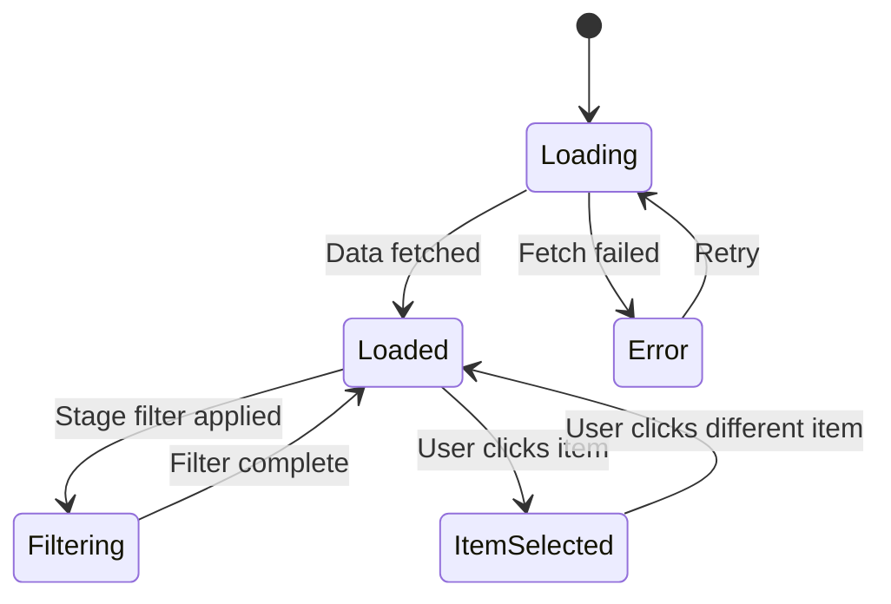

# Stage-Filtered View

**ID**: SCR-003
**Discovery ID**: S-3.0
**Application**: Web
**Priority**: P1
**Primary Persona**: PER-002 (Product People), PER-003 (Developers)

## Overview

The Stage-Filtered View provides a focused navigation experience by showing only tools relevant to the current workflow stage (Discovery, Prototype, Implementation, etc.). It uses the same dual-pane layout as the Main Explorer View but with a filtered navigation tree, reducing cognitive load by limiting visible items from 115+ to 20-40 stage-specific components.

**User Benefit**: Eliminates choice paralysis (Hicks Law) by filtering framework components by workflow stage, enabling users to quickly identify relevant tools without developer assistance.

## Layout

### Wireframe

```
┌──────────────────────────────────────────────────────────────┐
│  [Logo]    Search [___________]  [🌓] [Stage: Discovery▾]    │ <- Header
├────────────────────────────┬─────────────────────────────────┤
│ Active Filter: Discovery   │ Detail Pane                     │
│ [Clear Filter]             │                                 │
│                            │ [Tabs: Purpose | Examples | ... │
│ ──────────────────────────│ ─────────────────────────────── │
│                            │                                 │
│ Showing 40 of 115 items    │ # Discovery_JTBD                │
│                            │                                 │
│ ▼ Skills (29)         [i]  │ **Stage**: Discovery            │
│   ├ Discovery_JTBD    ⭐   │ **Path**: `.claude/skills/...`  │
│   ├ Discovery_Persona      │                                 │
│   ├ Discovery_Vision       │ ## Purpose                      │
│   └ ... (26 more)          │ Extracts Jobs To Be Done from   │
│                            │ validated pain points...        │
│ ▼ Commands (8)        [i]  │                                 │
│   ├ /discovery             │ ## Workflow Context             │
│   ├ /discovery-multiagent  │ **When to use**: After pain     │
│   ├ /discovery-audit       │ point extraction (CP-4), before │
│   └ ... (5 more)           │ vision strategy (CP-6).         │
│                            │                                 │
│ ▼ Agents (6)          [i]  │ **Inputs Required**:            │
│   ├ discovery-domain-...   │ pain_points.md, client_facts... │
│   ├ discovery-jtbd-...     │                                 │
│   └ ... (4 more)           │ [Workflow Diagram - Mermaid]    │
│                            │                                 │
│ [Collapse All] [Expand All]│                                 │
├────────────────────────────┴─────────────────────────────────┤
│ Footer: Filtered View | 40 Discovery Components | v3.0.0    │
└──────────────────────────────────────────────────────────────┘
```

### Grid Structure

| Region | Grid Columns | Components |
|--------|--------------|------------|
| Header | 1-12 | AppHeader (with StageFilterDropdown) |
| Filter Indicator | 1-4 | Text + Badge + Button |
| Sidebar | 1-4 | NavigationTree (filtered) |
| Main | 5-12 | DetailPane |
| Footer | 1-12 | AppFooter |

## Components Used

| Component | Instance | Props |
|-----------|----------|-------|
| COMP-AGG-001 | NavigationTree | `filteredStage="Discovery"`, `items={filteredItems}` |
| COMP-AGG-002 | DetailPane | `selectedItem={currentItem}` |
| COMP-AGG-006 | StageFilterDropdown | `selectedStages={['Discovery']}`, `onChange={handleStageChange}` |

## Data Requirements

### Page Load Data

| Field | Source | Type | Required |
|-------|--------|------|----------|
| allItems | GET /api/skills + /api/commands + /api/agents | Array<Skill \| Command \| Agent> | Yes |
| userPreferences | localStorage | UserPreferences | Yes |
| selectedStages | URL params or localStorage | string[] | No |

### User Input Data

| Field | Component | Validation |
|-------|-----------|------------|
| selectedStages | StageFilterDropdown | Non-empty array |

### Derived Data

| Field | Computation | Type |
|-------|-------------|------|
| filteredItems | `allItems.filter(item => selectedStages.includes(item.stage))` | Array<Skill \| Command \| Agent> |
| itemCount | `filteredItems.length` | number |
| totalCount | `allItems.length` | number |

## State Management

### Local State

```typescript
interface StageFilteredViewState {
  allItems: Array<Skill | Command | Agent>;
  selectedStages: string[];
  filteredItems: Array<Skill | Command | Agent>;
  selectedItem: Skill | Command | Agent | null;
  loading: boolean;
  error: string | null;
}

const [state, setState] = useState<StageFilteredViewState>({
  allItems: [],
  selectedStages: ['Discovery'], // Default from URL or localStorage
  filteredItems: [],
  selectedItem: null,
  loading: true,
  error: null,
});
```

### Global State Dependencies

| Store | Slice | Usage |
|-------|-------|-------|
| ui | stageFilter | Persist selected stages |
| preferences | userPreferences | Load saved filters |

### State Transitions



## Navigation

### Entry Points

| From | Trigger | Params |
|------|---------|--------|
| Main Explorer View | Click "Stage Filter" dropdown | `?stage=Discovery` |
| Direct URL | URL with stage param | `?stage=Discovery,Prototype` |
| Favorites Page | Stage filter applied | - |

### Exit Points

| To | Trigger | Data Passed |
|----|---------|-------------|
| Main Explorer View | Click "Clear Filter" | - |
| Search Results Page | Enter search query | `searchQuery`, preserves `selectedStages` |

### URL Schema

```
/explore?stage=Discovery
/explore?stage=Discovery,Prototype
/explore?stage=Discovery&item=Discovery_JTBD
```

## Interactions

### User Actions

| Action | Component | Handler | Result |
|--------|-----------|---------|--------|
| Select stage | StageFilterDropdown | onStageChange | Update `selectedStages`, filter items, update URL |
| Clear filter | Button | onClearFilter | Reset `selectedStages` to `[]`, show all items |
| Click tree item | NavigationTree | onItemSelect | Update `selectedItem`, load content |
| Expand/Collapse All | Button | onToggleAll | Expand/collapse all tree nodes |

### Keyboard Shortcuts

| Key | Action |
|-----|--------|
| `Cmd+F` | Focus stage filter dropdown |
| `Esc` | Clear filter |
| `Arrow Keys` | Navigate tree items |
| `Enter` | Select highlighted item |

## Responsive Behavior

| Breakpoint | Changes |
|------------|---------|
| Desktop (>1024px) | Full dual-pane layout as wireframed |
| Tablet (768-1024px) | Sidebar width reduced to 30% |
| Mobile (<768px) | Single-pane, filter in drawer, tree collapses to hamburger menu |

## Accessibility

- **Page Title**: "Stage-Filtered View: {Stage Name} - ClaudeManual"
- **Landmarks**: `<header>`, `<nav>`, `<main>`, `<aside>`, `<footer>`
- **Skip Link**: "Skip to filtered results"
- **Focus Management**: Focus first filtered item after stage selection
- **ARIA Announcements**: "Showing {count} {stage} components" on filter change
- **Keyboard Navigation**: Full keyboard support for filter dropdown and tree

## Error States

| State | Display | Recovery |
|-------|---------|----------|
| Load Error | ErrorBanner + "Failed to load components" | Retry button |
| Empty Filter Result | IllustratedMessage + "No {stage} components found" | Clear filter button |
| Network Error | Toast notification + "Connection lost" | Auto-retry after 5s |

## Performance Considerations

- **Filter Performance**: Use memoized filter function to avoid re-computing on every render
- **Tree Virtualization**: Render only visible tree nodes (react-window) for large item lists
- **Lazy Content Loading**: Load detail pane content only when item selected

## UX Psychology Principles

| Principle | Application | User Benefit |
|-----------|-------------|--------------|
| **Hicks Law** | Filtering reduces choices from 115+ to 20-40 | Faster tool discovery, less overwhelm (JTBD-1.4) |
| **Cognitive Load** | Smaller item lists, contextual "When to use" guidance | Users understand workflow stage relationships (PP-1.4) |
| **Visual Cues** | Stage color-coding, active filter indicator | Clear mental model of current context (JTBD-1.4) |
| **Progressive Disclosure** | Workflow Context section in detail pane | Users learn stage relationships without overwhelming initial view |

## Acceptance Criteria

- [ ] Stage filter dropdown includes: Discovery, Prototype, ProductSpecs, SolArch, Implementation, Utilities, Security, GRC
- [ ] Selecting stage filters tree to show only matching items
- [ ] Count badges update to show filtered counts (e.g., "Skills (29 of 85)")
- [ ] Detail pane shows "Workflow Context" section for stage-specific tools
- [ ] Clear filter button resets to full tree view
- [ ] Multi-select allows combining stages (e.g., Discovery + Prototype)
- [ ] Filter persists across sessions (localStorage)
- [ ] URL reflects selected stages (`?stage=Discovery,Prototype`)
- [ ] Filtered item count shown in footer
- [ ] Active filter indicator badge visible in header
- [ ] Keyboard navigation works in filtered tree
- [ ] Screen reader announces filter changes
- [ ] Empty state shows helpful message if no items match filter
- [ ] Performance: Filter operation completes in <100ms for 115+ items

## Traceability

- **Addresses Pain Points**: PP-1.4 (Organizational Chaos), PP-1.3 (Discoverability Challenge)
- **Enables JTBD**: JTBD-1.4 (Understand stage-appropriate tools), JTBD-1.3 (Find relevant tools)
- **Client Facts**: CF-011 (Stage-based organization)
- **Roadmap Features**: F-008 (Stage-based filters), F-009 (Stage badges), F-010 (Stage landing pages)
- **Discovery Screen**: S-3.0 (Stage-Filtered View)
- **Requirements**: REQ-022 (Stage filtering), REQ-025 (Search and filter)

---

*Specification for Stage-Filtered View screen. Implements Hicks Law to reduce choice paralysis from 115+ items to 20-40 stage-specific components. Uses NavigationTree + DetailPane + StageFilterDropdown aggregate components.*
