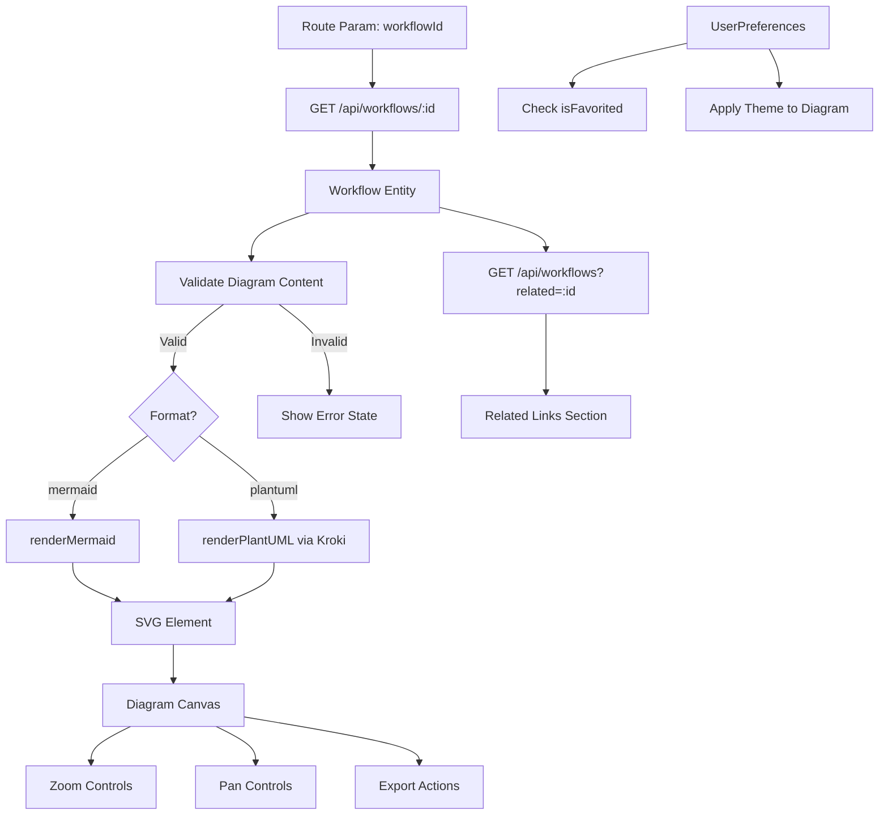

# Data Requirements: Workflow Viewer (SCR-009)

---
**Screen**: SCR-009 - Workflow Viewer
**Created**: 2026-01-31
**Agent**: prototype-screen-specifier
**Session**: session-screen-scr009
---

## Data Model Entities Used

### Primary Entity

**ENT-007: Workflow**

| Field | Type | Required | Usage |
|-------|------|----------|-------|
| id | string | Yes | Workflow identifier from route param |
| name | string | Yes | Display in header |
| description | string | Yes | Render in description section |
| format | enum | Yes | Determine rendering engine (Mermaid/PlantUML) |
| path | string | Yes | File path reference |
| stage | enum | No | Display stage badge |
| category | enum | No | Process/Integration/Decision/Data-flow classification |
| tags | string[] | No | Search metadata |
| content.diagram | string | Yes | Diagram source code for rendering |
| content.overview | string | No | Extended description |
| content.steps | string | No | Step-by-step breakdown |
| content.related | string | No | Related workflow IDs |

### Related Entities

**ENT-006: UserPreferences**

| Field | Usage |
|-------|-------|
| favorites | Check if workflow is favorited |
| theme | Apply theme to diagram rendering |

## API Endpoints

### GET /api/workflows/:id

**Request**:
```http
GET /api/workflows/discovery-process-flow
```

**Response** (200 OK):
```json
{
  "id": "discovery-process-flow",
  "name": "Discovery Process Flow",
  "description": "End-to-end Discovery phase workflow from client materials to deliverables",
  "format": "mermaid",
  "path": ".claude/workflows/discovery-process-flow.md",
  "stage": "Discovery",
  "category": "process",
  "tags": ["discovery", "orchestration", "multi-agent"],
  "content": {
    "overview": "This workflow shows the Discovery phase process flow...",
    "diagram": "graph TD\n  Start --> InputFiles\n  InputFiles --> |Extract| PainPoints\n  ...",
    "steps": "1. Collect client materials...",
    "related": "prototype-process-flow,productspecs-flow"
  }
}
```

**Error Responses**:
- 404: Workflow not found
- 500: Server error

### GET /api/workflows?related=:id

**Request**:
```http
GET /api/workflows?related=discovery-process-flow
```

**Response** (200 OK):
```json
{
  "data": [
    {
      "id": "prototype-process-flow",
      "name": "Prototype Process Flow",
      "description": "Prototype generation workflow",
      "format": "mermaid",
      "stage": "Prototype",
      "category": "process"
    },
    {
      "id": "productspecs-flow",
      "name": "ProductSpecs Flow",
      "description": "Module specification workflow",
      "format": "mermaid",
      "stage": "ProductSpecs",
      "category": "process"
    }
  ],
  "total": 2
}
```

## Data Binding

### Page Load

```typescript
interface WorkflowViewerProps {
  workflowId: string; // From route param
}

function WorkflowViewerScreen({ workflowId }: WorkflowViewerProps) {
  // 1. Fetch workflow data
  const { data: workflow, loading, error } = useFetch<Workflow>(
    `/api/workflows/${workflowId}`
  );

  // 2. Fetch related workflows
  const { data: relatedData } = useFetch<PaginatedResponse<Workflow>>(
    `/api/workflows?related=${workflowId}`
  );

  // 3. Check if favorited
  const { favorites } = useUserPreferences();
  const isFavorited = favorites.includes(workflowId);

  // 4. Render diagram
  useEffect(() => {
    if (workflow?.content?.diagram) {
      renderDiagram(workflow.content.diagram, workflow.format);
    }
  }, [workflow]);
}
```

### Diagram State

```typescript
interface DiagramState {
  // Rendering
  svgElement: SVGElement | null;
  renderError: string | null;

  // Zoom/Pan
  zoom: number; // 25-200
  pan: { x: number; y: number };
  minimapEnabled: boolean;

  // Export
  exportFormat: 'png' | 'svg' | 'pdf';
  exportInProgress: boolean;
}

const [diagramState, setDiagramState] = useState<DiagramState>({
  svgElement: null,
  renderError: null,
  zoom: 100,
  pan: { x: 0, y: 0 },
  minimapEnabled: false,
  exportFormat: 'png',
  exportInProgress: false,
});
```

## Data Transformations

### Mermaid Rendering

```typescript
import mermaid from 'mermaid';

async function renderMermaid(
  diagramCode: string,
  theme: 'light' | 'dark'
): Promise<{ svg: string; error?: string }> {
  try {
    mermaid.initialize({
      theme: theme === 'dark' ? 'dark' : 'default',
      securityLevel: 'strict',
      flowchart: { htmlLabels: true },
    });

    const { svg } = await mermaid.render('diagram-canvas', diagramCode);
    return { svg };
  } catch (error) {
    return { svg: '', error: error.message };
  }
}
```

### PlantUML Rendering (via Kroki)

```typescript
async function renderPlantUML(
  diagramCode: string
): Promise<{ svg: string; error?: string }> {
  try {
    const encoded = encode(diagramCode); // Kroki encoder
    const response = await fetch(`https://kroki.io/plantuml/svg/${encoded}`);

    if (!response.ok) {
      throw new Error(`Kroki error: ${response.status}`);
    }

    const svg = await response.text();
    return { svg };
  } catch (error) {
    return { svg: '', error: error.message };
  }
}
```

### Export Data Preparation

```typescript
function preparePNGExport(svgElement: SVGElement): Blob {
  const canvas = document.createElement('canvas');
  const ctx = canvas.getContext('2d')!;
  const svgData = new XMLSerializer().serializeToString(svgElement);
  const svgBlob = new Blob([svgData], { type: 'image/svg+xml;charset=utf-8' });
  const url = URL.createObjectURL(svgBlob);

  const img = new Image();
  img.onload = () => {
    canvas.width = img.width * 2; // 2x for retina
    canvas.height = img.height * 2;
    ctx.scale(2, 2);
    ctx.drawImage(img, 0, 0);
    URL.revokeObjectURL(url);
  };
  img.src = url;

  return canvas.toBlob((blob) => blob, 'image/png')!;
}

function prepareSVGExport(svgElement: SVGElement): Blob {
  const svgData = new XMLSerializer().serializeToString(svgElement);
  return new Blob([svgData], { type: 'image/svg+xml;charset=utf-8' });
}

async function preparePDFExport(
  svgElement: SVGElement,
  workflowName: string
): Promise<Blob> {
  const { jsPDF } = await import('jspdf');
  const pdf = new jsPDF({ orientation: 'landscape', unit: 'px', format: 'a4' });

  pdf.text(workflowName, 20, 20);
  pdf.addSVG(svgElement, 20, 40);

  return pdf.output('blob');
}
```

## Data Validation

### Route Parameter Validation

```typescript
import { z } from 'zod';

const workflowRouteSchema = z.object({
  workflowId: z.string().regex(/^[a-z0-9-]+$/, 'Invalid workflow ID format'),
});

// Usage
function WorkflowViewerRoute() {
  const params = useParams();
  const validation = workflowRouteSchema.safeParse(params);

  if (!validation.success) {
    return <ErrorPage message="Invalid workflow ID" />;
  }

  return <WorkflowViewerScreen workflowId={validation.data.workflowId} />;
}
```

### Diagram Content Validation

```typescript
function validateDiagramContent(
  diagram: string | undefined,
  format: 'mermaid' | 'plantuml'
): { valid: boolean; error?: string } {
  if (!diagram || diagram.trim() === '') {
    return { valid: false, error: 'Diagram content is empty' };
  }

  if (format === 'mermaid') {
    // Basic Mermaid syntax check
    const validStarts = ['graph', 'sequenceDiagram', 'classDiagram', 'stateDiagram', 'erDiagram', 'gantt', 'journey'];
    const hasValidStart = validStarts.some((start) => diagram.trim().startsWith(start));

    if (!hasValidStart) {
      return { valid: false, error: `Mermaid diagram must start with one of: ${validStarts.join(', ')}` };
    }
  }

  if (format === 'plantuml') {
    // Basic PlantUML syntax check
    if (!diagram.trim().startsWith('@start') || !diagram.includes('@end')) {
      return { valid: false, error: 'PlantUML diagram must start with @start and end with @end' };
    }
  }

  return { valid: true };
}
```

## Caching Strategy

### Rendered Diagrams

```typescript
const diagramCache = new Map<string, { svg: string; timestamp: number }>();
const CACHE_TTL = 5 * 60 * 1000; // 5 minutes

async function getCachedDiagram(
  workflowId: string,
  diagramCode: string,
  format: 'mermaid' | 'plantuml'
): Promise<string> {
  const cacheKey = `${workflowId}-${format}-${hashCode(diagramCode)}`;
  const cached = diagramCache.get(cacheKey);

  if (cached && Date.now() - cached.timestamp < CACHE_TTL) {
    return cached.svg;
  }

  // Render fresh
  const { svg } = format === 'mermaid'
    ? await renderMermaid(diagramCode, theme)
    : await renderPlantUML(diagramCode);

  diagramCache.set(cacheKey, { svg, timestamp: Date.now() });
  return svg;
}
```

### localStorage Persistence

```typescript
interface DiagramViewState {
  zoom: number;
  pan: { x: number; y: number };
  minimapEnabled: boolean;
}

function saveDiagramState(workflowId: string, state: DiagramViewState) {
  localStorage.setItem(`workflow-view-${workflowId}`, JSON.stringify(state));
}

function loadDiagramState(workflowId: string): DiagramViewState | null {
  const stored = localStorage.getItem(`workflow-view-${workflowId}`);
  return stored ? JSON.parse(stored) : null;
}
```

## Data Flow Diagram



## Performance Metrics

| Metric | Target | Measurement |
|--------|--------|-------------|
| API Response Time | < 200ms | Time to first byte |
| Diagram Render Time | < 2s | Time from data load to SVG render |
| Zoom Frame Rate | 60fps | RequestAnimationFrame counter |
| Export Generation | < 5s | PNG/SVG/PDF export completion |
| Cache Hit Rate | > 80% | Cached vs fresh renders |

---

**Traceability**:
- **Entities**: ENT-007 (Workflow), ENT-006 (UserPreferences)
- **Data Fields**: DF-WFL-001 to DF-WFL-008
- **API Endpoints**: GET /api/workflows/:id, GET /api/workflows?related=:id
- **Client Facts**: CF-001 (Markdown structure), CF-008 (Multi-section docs)
- **JTBD**: JTBD-1.9 (Visualize diagrams), JTBD-1.2 (Component context)

---

**Generated**: 2026-01-31
**Agent**: prototype-screen-specifier
**Session**: session-screen-scr009
