# Build Sequence - ClaudeManual Prototype

## Overview

This document defines the implementation order for the ClaudeManual prototype, organized into phases with dependency tracking and parallel execution markers.

**Generated**: 2026-01-31
**Total Tasks**: 35
**Estimated Phases**: 5
**Parallel Execution**: 60% of tasks can run in parallel

---

## Phase Summary

| Phase | Name | Tasks | Dependencies | Parallel |
|-------|------|-------|--------------|----------|
| 1 | Foundation | 8 | None | 75% |
| 2 | Core Components | 8 | Phase 1 | 100% |
| 3 | Screens (MVP) | 7 | Phase 2 | 100% |
| 4 | Screens (Extended) | 6 | Phase 3 partial | 100% |
| 5 | Integration & Polish | 6 | Phase 4 | 50% |

---

## Phase 1: Foundation (No Dependencies)

Setup project structure, design tokens, and shared utilities.

| Task ID | Description | Marker | Depends On |
|---------|-------------|--------|------------|
| T-001 | Initialize Next.js project with TypeScript | [S] | - |
| T-002 | Configure Tailwind CSS with design tokens | [P] | T-001 |
| T-003 | Setup Adobe Spectrum React integration | [P] | T-001 |
| T-004 | Create TypeScript types from data model | [P] | T-001 |
| T-005 | Setup React Query for data fetching | [P] | T-001 |
| T-006 | Create API mock handlers (MSW) | [P] | T-004 |
| T-007 | Setup localStorage utilities | [P] | T-004 |
| T-008 | Create theme provider (light/dark) | [P] | T-002 |

**Parallel Groups**:
- Group A: T-002, T-003, T-004, T-005
- Group B (after T-004): T-006, T-007, T-008

---

## Phase 2: Core Components

Build aggregate components that combine library components with business logic.

| Task ID | Description | Marker | Depends On | Component |
|---------|-------------|--------|------------|-----------|
| T-009 | Implement NavigationTree | [P] | T-003 | COMP-AGG-001 |
| T-010 | Implement DetailPane | [P] | T-003 | COMP-AGG-002 |
| T-011 | Implement SearchResultCard | [P] | T-003 | COMP-AGG-003 |
| T-012 | Implement ComponentCard | [P] | T-003 | COMP-AGG-004 |
| T-013 | Implement FavoritesPanel | [P] | T-003, T-007 | COMP-AGG-005 |
| T-014 | Implement StageFilterDropdown | [P] | T-003 | COMP-AGG-006 |
| T-015 | Implement DiagramViewer | [P] | T-003 | COMP-AGG-007 |
| T-016 | Implement MarkdownRenderer | [P] | T-003 | COMP-AGG-008 |

**All tasks in Phase 2 can run in parallel** (same dependencies on T-003).

---

## Phase 3: Screens (MVP)

Build core screens required for minimum viable product.

| Task ID | Description | Marker | Depends On | Screen |
|---------|-------------|--------|------------|--------|
| T-017 | Implement Main Explorer View | [P] | T-009, T-010 | SCR-001 |
| T-018 | Implement Search Results Page | [P] | T-011, T-014 | SCR-002 |
| T-019 | Implement Stage-Filtered View | [P] | T-009, T-014 | SCR-003 |
| T-020 | Implement Favorites Page | [P] | T-012, T-013 | SCR-004 |
| T-021 | Implement Component Detail Modal | [P] | T-010, T-016 | SCR-006 |
| T-022 | Create API routes (skills, commands, agents) | [P] | T-004, T-006 | API |
| T-023 | Create search API route | [P] | T-004, T-006 | API |

**Parallel Groups**:
- Group A: T-017, T-018, T-019, T-020, T-021 (screens)
- Group B: T-022, T-023 (API routes)

---

## Phase 4: Screens (Extended)

Build additional screens for full feature set.

| Task ID | Description | Marker | Depends On | Screen |
|---------|-------------|--------|------------|--------|
| T-024 | Implement Workflow Viewer | [P] | T-015 | SCR-009 |
| T-025 | Implement Architecture Browser | [P] | T-009, T-015 | SCR-010 |
| T-026 | Create workflow API route | [P] | T-004 | API |
| T-027 | Create architecture-docs API route | [P] | T-004 | API |
| T-028 | Implement Settings Page | [P] | T-008 | SCR-011 |
| T-029 | Create preferences API route | [P] | T-004, T-007 | API |

**All tasks can run in parallel** (independent screens/APIs).

---

## Phase 5: Integration & Polish

Wire up routing, add global features, and polish.

| Task ID | Description | Marker | Depends On |
|---------|-------------|--------|------------|
| T-030 | Setup Next.js routing | [S] | T-017 to T-029 |
| T-031 | Implement global keyboard shortcuts | [P] | T-030 |
| T-032 | Add loading states and error boundaries | [P] | T-030 |
| T-033 | Implement file system watching (hot-reload) | [S] | T-022 |
| T-034 | Add responsive layout adjustments | [P] | T-030 |
| T-035 | Final accessibility audit fixes | [S] | T-034 |

**Sequential Tasks**: T-030, T-033, T-035 (depend on prior completion)
**Parallel Tasks**: T-031, T-032, T-034 (can run together after T-030)

---

## Dependency Graph

```mermaid
graph TD
    subgraph "Phase 1: Foundation"
        T001[T-001: Init Next.js]
        T002[T-002: Tailwind]
        T003[T-003: Spectrum]
        T004[T-004: TypeScript Types]
        T005[T-005: React Query]
        T006[T-006: MSW Mocks]
        T007[T-007: localStorage]
        T008[T-008: Theme Provider]

        T001 --> T002
        T001 --> T003
        T001 --> T004
        T001 --> T005
        T004 --> T006
        T004 --> T007
        T002 --> T008
    end

    subgraph "Phase 2: Components"
        T009[T-009: NavigationTree]
        T010[T-010: DetailPane]
        T011[T-011: SearchResultCard]
        T012[T-012: ComponentCard]
        T013[T-013: FavoritesPanel]
        T014[T-014: StageFilter]
        T015[T-015: DiagramViewer]
        T016[T-016: MarkdownRenderer]

        T003 --> T009
        T003 --> T010
        T003 --> T011
        T003 --> T012
        T003 --> T013
        T007 --> T013
        T003 --> T014
        T003 --> T015
        T003 --> T016
    end

    subgraph "Phase 3: MVP Screens"
        T017[T-017: Main Explorer]
        T018[T-018: Search Results]
        T019[T-019: Stage Filter View]
        T020[T-020: Favorites]
        T021[T-021: Detail Modal]
        T022[T-022: Core APIs]
        T023[T-023: Search API]

        T009 --> T017
        T010 --> T017
        T011 --> T018
        T014 --> T018
        T009 --> T019
        T014 --> T019
        T012 --> T020
        T013 --> T020
        T010 --> T021
        T016 --> T021
        T004 --> T022
        T006 --> T022
        T004 --> T023
        T006 --> T023
    end

    subgraph "Phase 4: Extended"
        T024[T-024: Workflow Viewer]
        T025[T-025: Architecture Browser]
        T026[T-026: Workflow API]
        T027[T-027: Arch Docs API]
        T028[T-028: Settings]
        T029[T-029: Preferences API]

        T015 --> T024
        T009 --> T025
        T015 --> T025
        T004 --> T026
        T004 --> T027
        T008 --> T028
        T004 --> T029
        T007 --> T029
    end

    subgraph "Phase 5: Integration"
        T030[T-030: Routing]
        T031[T-031: Keyboard Shortcuts]
        T032[T-032: Error Boundaries]
        T033[T-033: File Watching]
        T034[T-034: Responsive]
        T035[T-035: A11y Audit]

        T017 --> T030
        T018 --> T030
        T019 --> T030
        T020 --> T030
        T021 --> T030
        T024 --> T030
        T025 --> T030
        T028 --> T030

        T030 --> T031
        T030 --> T032
        T022 --> T033
        T030 --> T034
        T034 --> T035
    end
```



---

## TDD Specifications

Each task follows RED-GREEN-REFACTOR cycle.

### Example: T-009 (NavigationTree)

**RED Phase** - Write failing tests:
```typescript
// NavigationTree.test.tsx
describe('NavigationTree', () => {
  it('renders tree items from data', () => {
    render(<NavigationTree items={mockItems} />);
    expect(screen.getByRole('tree')).toBeInTheDocument();
    expect(screen.getAllByRole('treeitem')).toHaveLength(5);
  });

  it('expands node on click', async () => {
    render(<NavigationTree items={mockItems} />);
    await userEvent.click(screen.getByText('Skills'));
    expect(screen.getByText('Discovery_Analyzer')).toBeVisible();
  });

  it('filters by stage when stage filter changes', () => {
    const onFilter = jest.fn();
    render(<NavigationTree items={mockItems} onStageFilter={onFilter} />);
    // ... test filter behavior
  });

  it('supports keyboard navigation', async () => {
    render(<NavigationTree items={mockItems} />);
    await userEvent.tab();
    expect(screen.getByRole('tree')).toHaveFocus();
    await userEvent.keyboard('{ArrowDown}');
    // ... test keyboard nav
  });
});
```

**GREEN Phase** - Implement to pass tests:
```typescript
// NavigationTree.tsx
export function NavigationTree({ items, onStageFilter, onSelect }: NavigationTreeProps) {
  const { expandedKeys, setExpandedKeys } = useTreeState();
  // ... implementation
}
```

**REFACTOR Phase** - Improve code quality:
- Extract custom hooks
- Optimize re-renders with memo
- Add TypeScript strict types

---

## Team Assignment

Tasks are balanced across 2 parallel teams:

| Team | Tasks | Focus |
|------|-------|-------|
| Team A | T-001 to T-008, T-017, T-019, T-024, T-030, T-033 | Foundation, Navigation, Integration |
| Team B | T-009 to T-016, T-018, T-020, T-021, T-025 to T-029 | Components, Search, Detail Views |

---

## Completion Criteria

Phase is complete when:
- [ ] All tasks pass TDD tests
- [ ] Code review approved
- [ ] Accessibility checks pass (axe-core)
- [ ] TypeScript strict mode (no errors)
- [ ] Component documented with props table

---

## Related

- `task_registry.json` - Machine-readable task list
- `01-components/` - Component specifications
- `02-screens/` - Screen specifications
- `03-interactions/` - Motion, accessibility, responsive specs
